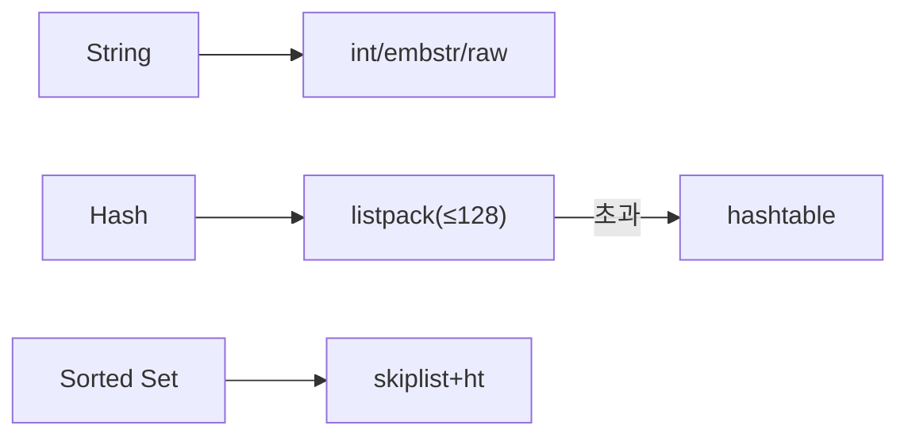
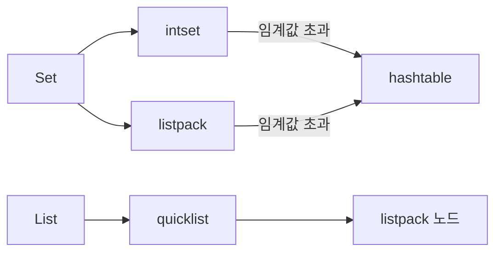
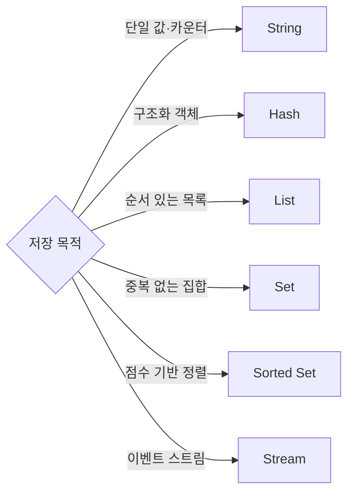

실시간 랭킹을 구현해야 한다. MySQL로 매 요청마다 `ORDER BY score DESC`를 돌리면 수천 명이 동시 접속할 때 DB가 버티지 못한다. Redis Sorted Set 하나로 수백만 명의 점수를 실시간으로 정렬해 1ms 안에 응답할 수 있다. 그런데 이것이 왜 가능한가? Skip List라는 확률적 자료구조가 O(log N) 삽입·삭제를 보장하기 때문이다. 이 포스트는 Redis 자료구조의 인터페이스뿐 아니라, **내부 메커니즘과 설계 근거**까지 파고든다.

---

## 왜 자료구조 내부를 알아야 하는가?

> **비유**: Redis 자료구조는 스위스 군용 칼과 같다. 겉보기엔 하나의 도구지만, 어떤 날을 꺼내느냐에 따라 성능이 수십 배 달라진다. 그리고 칼날이 어떤 강철로 만들어졌는지 모르면, 어떤 상황에서 부러지는지도 모른다.

"Redis는 빠르다"라는 말만 믿고 쓰면 함정에 빠진다. Hash는 필드 수가 128개를 넘는 순간 listpack에서 hashtable로 전환되며 메모리 사용량이 급증한다. Sorted Set은 원소가 128개를 초과하면 skip list가 활성화된다. HyperLogLog의 12KB 고정 메모리는 알고리즘적 근거가 있는 숫자다. 이것을 모르면 장애 상황에서 원인을 설명할 수 없다.

| 자료구조 | 핵심 내부 구조 | 주요 사용 사례 |
|---------|------|--------------|
| String | int / embstr / raw SDS | 캐시, 카운터, 세션 |
| List | listpack → quicklist | 메시지 큐, 최근 항목 |
| Set | listpack / intset → hashtable | 태그, 좋아요, 온라인 사용자 |
| Sorted Set | listpack → skiplist + hashtable | 리더보드, 타임라인 |
| Hash | listpack → hashtable | 객체 저장, 부분 업데이트 |
| Bitmap | SDS 비트 배열 | 출석체크, 대규모 불리언 플래그 |
| HyperLogLog | 16384개 레지스터, 조화평균 | UV 집계 |
| Stream | Radix Tree + listpack | 이벤트 로그, 이벤트 소싱 |
| Geospatial | Sorted Set + geohash52 | 근처 매장 검색 |

---

## 1. String — 세 가지 인코딩과 메모리 함의

Redis에서 가장 기본적인 자료구조다. 그러나 "String = 문자열"이라는 단순한 이해로는 메모리 최적화 기회를 놓친다. Redis는 저장하는 값에 따라 **세 가지 내부 인코딩**을 자동으로 선택한다.

### 1-1. int / embstr / raw — 왜 세 가지인가?

```
값의 종류                    내부 인코딩     메모리 배치
────────────────────────────────────────────────────────────
정수 (0 ~ 9999)              shared int     공유 오브젝트 풀
정수 (9999 초과 64비트 범위)  int            robj 내 포인터에 직접 저장
≤ 44바이트 문자열             embstr         robj + SDS 연속 단일 할당
> 44바이트 문자열             raw            robj + SDS 두 번 할당
```

**왜 44바이트가 경계인가?**
Redis의 메모리 할당자(jemalloc)는 64바이트 단위로 메모리를 할당한다. `robj` 헤더 크기(16바이트) + `SDS` 헤더(3바이트) + null terminator(1바이트) = 20바이트. 64 - 20 = **44바이트**가 SDS 데이터로 사용 가능한 최대 크기다. 이 범위 안에서 `robj`와 `SDS`를 하나의 연속 블록에 할당하면 malloc 호출 1회 + CPU 캐시 친화성 확보가 된다.

**embstr과 raw의 실질적 차이:**
- `embstr`: 단일 `malloc` → 단일 `free`. **불변(immutable)**으로 취급. 수정 시 자동으로 raw로 전환.
- `raw`: 두 번 `malloc`, 두 번 `free`. 수정 가능.

```bash
# 인코딩 직접 확인
SET counter 42
OBJECT ENCODING counter        # → "int"

SET name "hello"
OBJECT ENCODING name           # → "embstr"

SET blob "이 문자열은 44바이트를 초과하는 긴 텍스트입니다. 내부적으로 raw 인코딩이 됩니다."
OBJECT ENCODING blob           # → "raw"
```

```java
// Spring RedisTemplate — 인코딩은 Redis 내부가 자동 결정
ValueOperations<String, String> ops = redisTemplate.opsForValue();

// int 인코딩: 카운터 원자 증가
ops.set("page:view:home", "0");
redisTemplate.opsForValue().increment("page:view:home"); // INCR → int 인코딩 유지

// embstr 인코딩: 짧은 세션 토큰
ops.set("session:abc123", "userId:9001", Duration.ofMinutes(30));

// raw 인코딩: 직렬화된 DTO (JSON 등 긴 문자열)
String json = objectMapper.writeValueAsString(productDto); // 보통 100바이트 이상
ops.set("product:" + id, json, Duration.ofHours(1));
```

**메모리 함의:** 수백만 개의 키를 저장하는 경우, 값이 44바이트를 조금 넘는 설계라면 embstr 범위로 줄여서 메모리 단편화를 줄일 수 있다. JSON 직렬화 시 불필요한 공백 제거나 필드 축약이 성능에 실질적 영향을 준다.

### 1-2. INCR의 원자성 — 왜 GET+SET로 대체할 수 없는가

```
[싱글 스레드 이벤트 루프]
  클라이언트A: INCR counter ──→ [GET 10 → +1 → SET 11] → 반환 11
  클라이언트B: INCR counter ──────────────────────────→ [GET 11 → +1 → SET 12] → 반환 12

[잘못된 방식: GET + 애플리케이션 증가 + SET]
  클라이언트A: GET counter → 10
  클라이언트B: GET counter → 10  (A가 아직 SET하기 전)
  클라이언트A: SET counter 11
  클라이언트B: SET counter 11  (B가 덮어씀 → 하나의 증가 유실)
```

Redis는 단일 스레드 이벤트 루프로 명령어를 처리한다. `INCR`은 하나의 명령어로 등록되어 실행 중 컨텍스트 스위치가 발생하지 않는다. 이것이 분산 카운터가 안전한 이유다.

```java
@Service
@RequiredArgsConstructor
public class PageViewService {

    private final RedisTemplate<String, String> redisTemplate;

    // 원자적 증가 — 동시 100개 요청이 와도 정확히 100이 더해진다
    public long incrementView(String pageId) {
        Long count = redisTemplate.opsForValue()
            .increment("page:view:" + pageId);
        return count != null ? count : 0L;
    }

    // 분산 락 — NX(Not eXists) + EX(EXpire) 조합이 원자적
    public boolean acquireLock(String resource, String token, long ttlSeconds) {
        Boolean result = redisTemplate.opsForValue()
            .setIfAbsent("lock:" + resource, token, Duration.ofSeconds(ttlSeconds));
        return Boolean.TRUE.equals(result);
    }

    // 락 해제 — Lua 스크립트로 확인과 삭제를 원자적으로
    private static final String RELEASE_LOCK_SCRIPT =
        "if redis.call('GET', KEYS[1]) == ARGV[1] then " +
        "  return redis.call('DEL', KEYS[1]) " +
        "else " +
        "  return 0 " +
        "end";

    public boolean releaseLock(String resource, String token) {
        DefaultRedisScript<Long> script = new DefaultRedisScript<>(RELEASE_LOCK_SCRIPT, Long.class);
        Long result = redisTemplate.execute(script,
            Collections.singletonList("lock:" + resource), token);
        return Long.valueOf(1L).equals(result);
    }
}
```

**시간복잡도**: GET, SET, INCR 모두 O(1) — SDS 길이 필드로 크기를 상수 시간에 읽기 때문이다.

---

## 2. Hash — listpack에서 hashtable로의 전환 메커니즘

Hash는 필드-값 쌍의 맵이다. 그런데 Redis는 Hash를 항상 hashtable로 저장하지 않는다. 소규모일 때는 **listpack(구 ziplist)**을 쓰고, 임계값을 초과하면 hashtable로 전환한다.

### 2-1. listpack 내부 구조 — 왜 메모리 효율적인가?

```
listpack 메모리 레이아웃:
┌──────────┬──────────┬──────────────────────────────────────────────┐
│ total-   │ num-     │  entry | entry | entry | entry | ...  │ END  │
│ bytes(4) │ elements │                                              │(0xFF)│
└──────────┴──────────┴──────────────────────────────────────────────┘

각 entry:
┌──────────────────┬──────────┬──────────────────┐
│ prevlen          │ encoding │ data             │
│ (이전 엔트리 길이)│          │ (실제 값)        │
└──────────────────┴──────────┴──────────────────┘
```

listpack은 연속 메모리 블록이다. 각 엔트리가 이전 엔트리의 길이를 가지고 있어 역방향 순회가 가능하다. **포인터가 없다**. 일반 해시 테이블은 버킷 배열 + 연결 리스트 포인터를 사용하므로 필드 하나당 포인터 오버헤드(8바이트 × 여러 개)가 발생한다. listpack은 값을 그냥 인접하게 붙여 저장한다.

**왜 소규모에서만 listpack을 쓰는가?**
listpack은 검색이 O(N) 선형 탐색이다. 필드 수가 적을 때는 N이 작아서 실제 속도가 빠르고, 메모리 절약 효과가 더 크다. 필드 수가 늘어나면 O(N) 탐색 비용이 O(1) hashtable보다 커지므로 자동 전환한다.

### 2-2. 전환 임계값과 설정

```bash
# redis.conf — 임계값 설정
hash-max-listpack-entries 128   # 필드 수가 이 값 초과 시 hashtable 전환
hash-max-listpack-value 64      # 필드명 또는 값이 이 바이트 초과 시 hashtable 전환

# 현재 인코딩 확인
HSET user:1 name "김철수" email "kim@example.com" age "30"
OBJECT ENCODING user:1          # → "listpack"

# 128개 필드 추가 후
OBJECT ENCODING user:1          # → "hashtable"
```

**전환은 단방향이다.** hashtable에서 listpack으로 되돌아가지 않는다. 대규모 Hash를 만든 뒤 필드를 줄여도 hashtable 인코딩이 유지된다. 이 점이 메모리 예측을 어렵게 만드는 요인이다.

```java
@Configuration
public class RedisConfig {

    @Bean
    public RedisTemplate<String, Object> redisTemplate(RedisConnectionFactory factory) {
        RedisTemplate<String, Object> template = new RedisTemplate<>();
        template.setConnectionFactory(factory);
        // Hash key/value 직렬화 — 짧은 직렬화 형식이 listpack 유지에 유리
        template.setHashKeySerializer(new StringRedisSerializer());
        template.setHashValueSerializer(new StringRedisSerializer());
        return template;
    }
}

@Service
@RequiredArgsConstructor
public class UserProfileService {

    private final RedisTemplate<String, Object> redisTemplate;
    private static final String PREFIX = "user:";

    // 전체 저장 — putAll은 HSET key field1 val1 field2 val2 ...
    public void saveProfile(Long userId, UserProfile profile) {
        Map<String, String> fields = new HashMap<>();
        fields.put("name", profile.getName());
        fields.put("email", profile.getEmail());
        fields.put("loginCount", "0");
        // 주의: 필드 수를 128 미만으로 설계해야 listpack 유지
        redisTemplate.opsForHash().putAll(PREFIX + userId, fields);
        redisTemplate.expire(PREFIX + userId, Duration.ofDays(7));
    }

    // 필드 단위 업데이트 — 전체 객체를 읽고 쓰지 않아도 된다
    public void incrementLoginCount(Long userId) {
        redisTemplate.opsForHash().increment(PREFIX + userId, "loginCount", 1L);
    }

    // 필드 단위 조회 — String+JSON이라면 전체를 역직렬화해야 함
    public String getName(Long userId) {
        return (String) redisTemplate.opsForHash().get(PREFIX + userId, "name");
    }

    // 여러 필드 동시 조회
    public List<Object> getProfileFields(Long userId, List<String> fields) {
        return redisTemplate.opsForHash()
            .multiGet(PREFIX + userId, new ArrayList<>(fields));
    }
}
```

**String+JSON vs Hash 선택 기준:**

| 조건 | 권장 방식 |
|------|---------|
| 필드 단위 업데이트 필요 | Hash |
| 전체를 항상 함께 읽음 | String+JSON |
| 필드 수 < 128, 값 크기 < 64B | Hash (listpack으로 메모리 절약) |
| 중첩 객체, 복잡한 계층 구조 | String+JSON (또는 RedisJSON 모듈) |

**시간복잡도**: HSET, HGET O(1) / HMGET O(N) / HGETALL O(N) — hashtable 인코딩 기준

---

## 3. Sorted Set — Skip List를 선택한 이유

각 원소에 score(실수)를 부여해 자동으로 정렬되는 집합이다. 내부적으로 **skip list + hash table** 조합을 사용한다. 이 설계 결정이 핵심이다.

### 3-1. Skip List 구조 — 다단계 연결 리스트

Skip List는 여러 레벨의 연결 리스트를 쌓아 올린 구조다.

```
레벨 4: ──────────────────────── [100] ─────────────────────────── NIL
레벨 3: ───────── [20] ─────────── [100] ──────── [500] ─────────── NIL
레벨 2: ──[5]──── [20] ──[50]───── [100] ──[300]── [500] ─────────── NIL
레벨 1: ─[1]─[5]─ [20] ─[50]─[70]─[100] ─[300]──[500]─[800]──[999]─ NIL
           ↑ 헤드
```

레벨 1은 모든 노드를 포함하는 완전한 연결 리스트다. 레벨이 올라갈수록 노드가 드문드문 있다. 검색 시 높은 레벨에서 시작해 목표값을 찾다가 내려오는 방식으로 O(log N) 탐색을 달성한다.

### 3-2. 확률적 레벨 배정 — 왜 50%인가?

```
노드 삽입 시 레벨 결정:
  - 레벨 1: 항상 포함 (확률 1)
  - 레벨 2: 50% 확률로 포함
  - 레벨 3: 25% 확률로 포함 (50% × 50%)
  - 레벨 k: (1/2)^(k-1) 확률로 포함

Redis 코드 (t_zset.c):
  int zslRandomLevel(void) {
      int level = 1;
      while ((random() & 0xFFFF) < (ZSKIPLIST_P * 0xFFFF))
          level += 1;
      return (level < ZSKIPLIST_MAXLEVEL) ? level : ZSKIPLIST_MAXLEVEL;
  }
  // ZSKIPLIST_P = 0.25 (Redis는 실제로 25% 사용)
  // ZSKIPLIST_MAXLEVEL = 32
```

**왜 25%인가?** Redis는 이론적 최적값 50%가 아닌 25%를 사용한다. 이는 메모리와 속도 사이의 트레이드오프다. 25%면 포인터 개수가 줄어 메모리를 절약하면서도 O(log N) 특성은 유지된다. 실측 결과 Redis workload에서 25%가 더 나은 성능을 보였다.

### 3-3. 왜 Red-Black Tree 대신 Skip List인가?

Redis 저자 Salvatore Sanfilippo가 직접 밝힌 이유:

```
이유 1: 구현 단순성
  - Red-Black Tree: 좌회전, 우회전, 색 변경, 재균형 — 수백 줄의 복잡한 코드
  - Skip List: 삽입은 확률적 레벨 배정 + 포인터 연결 — 수십 줄

이유 2: 범위 쿼리 성능
  - ZRANGE key 10 50 — score 범위 내 모든 원소 반환
  - Skip List: 최소값 노드 찾은 뒤 레벨 1 연결 리스트를 순회 → O(log N + M)
  - Red-Black Tree: 범위 순회 시 in-order traversal 필요, 캐시 비친화적

이유 3: 역방향 순회
  - ZREVRANGE를 위한 역방향 포인터를 Skip List에 추가하기 쉬움
  - Red-Black Tree 역방향 순회는 별도 구현 복잡도

이유 4: lock-free 확장 가능성
  - 병렬 Skip List는 CAS 연산으로 lock-free 구현 가능
```

### 3-4. skip list + hash table 이중 구조의 이유

```
hash table: member → score  (O(1) 점수 조회)
skip list:  score → member  (O(log N) 순위 조회, 범위 조회)

ZSCORE user:1  → hash table에서 O(1) 조회
ZRANK user:1   → skip list에서 O(log N) 조회
ZRANGE 0 9     → skip list 레벨 1 순차 순회 O(log N + M)
```

두 구조를 동시에 유지하는 비용(메모리 × 2, 삽입 시 양쪽 업데이트)을 감수하는 이유는, `ZSCORE`의 O(1)과 `ZRANGE`의 O(log N)을 모두 달성하기 위해서다. skip list만으로는 특정 멤버의 점수를 O(log N)에 찾아야 한다.

```java
@Service
@RequiredArgsConstructor
public class LeaderboardService {

    private final RedisTemplate<String, String> redisTemplate;
    private static final String KEY = "leaderboard:game";

    // ZADD — skip list O(log N) + hash table O(1) 동시 업데이트
    public void updateScore(String userId, double score) {
        redisTemplate.opsForZSet().add(KEY, userId, score);
    }

    // ZINCRBY — 점수 증가 (아이템 획득, 퀘스트 완료 등)
    public double addScore(String userId, double delta) {
        Double result = redisTemplate.opsForZSet().incrementScore(KEY, userId, delta);
        return result != null ? result : 0.0;
    }

    // ZSCORE — hash table O(1) 점수 조회
    public Double getScore(String userId) {
        return redisTemplate.opsForZSet().score(KEY, userId);
    }

    // ZREVRANK — skip list O(log N) 순위 조회
    public Long getRank(String userId) {
        Long rank = redisTemplate.opsForZSet().reverseRank(KEY, userId);
        return rank != null ? rank + 1 : null; // 0-indexed → 1-indexed
    }

    // ZREVRANGE — skip list 순차 순회 O(log N + M)
    public List<RankEntry> getTopN(int n) {
        Set<ZSetOperations.TypedTuple<String>> tuples =
            redisTemplate.opsForZSet().reverseRangeWithScores(KEY, 0, n - 1);

        if (tuples == null) return List.of();

        int[] rank = {1};
        return tuples.stream()
            .map(t -> new RankEntry(rank[0]++, t.getValue(), t.getScore()))
            .collect(Collectors.toList());
    }

    // ZRANGEBYSCORE — score 범위 조회 O(log N + M)
    public Set<String> getScoreRange(double minScore, double maxScore) {
        return redisTemplate.opsForZSet()
            .rangeByScore(KEY, minScore, maxScore);
    }

    // 타임라인 — Unix timestamp를 score로 사용
    public void addTimelinePost(String userId, String postId, long timestamp) {
        redisTemplate.opsForZSet().add("timeline:" + userId, postId, timestamp);
    }

    public Set<String> getRecentPosts(String userId, int count) {
        return redisTemplate.opsForZSet()
            .reverseRange("timeline:" + userId, 0, count - 1);
    }

    public record RankEntry(int rank, String userId, Double score) {}
}
```

**인코딩 전환:**
```bash
# 원소 수 ≤ 128 AND 원소 크기 ≤ 64바이트 → listpack (메모리 효율 우선)
# 임계값 초과 → skiplist + hashtable (성능 우선)

zset-max-listpack-entries 128
zset-max-listpack-value   64
```

**시간복잡도**: ZADD O(log N) / ZSCORE O(1) / ZRANK O(log N) / ZRANGE O(log N + M)

---

## 4. HyperLogLog — 12KB로 수십억 UV를 세는 알고리즘

HyperLogLog는 단순한 "유니크 카운터"가 아니다. 확률론과 해시 함수를 결합한 정교한 알고리즘이다.

### 4-1. 핵심 아이디어 — 최장 0 런(leading zeros)

```
직관적 설명:
  동전을 던져 앞면이 나올 때까지 던진 횟수를 기록한다.
  "HHHT" → 3회 (뒤 3번 후 앞)
  최대 연속 뒤(0)의 수가 k라면, 대략 2^k번의 시도가 있었다는 추정이 가능하다.

HyperLogLog 아이디어:
  각 원소를 해시 → 이진수 표현 → 맨 앞의 0 개수(leading zeros) 기록
  원소 해시값의 최대 leading zeros = k → 카디널리티 ≈ 2^k
```

하지만 단순 최댓값은 분산이 크다. 운 좋게 하나의 원소가 32개의 leading zeros를 가지면 카디널리티를 2^32 = 40억으로 추정해버린다. 이를 해결하기 위해 **m개의 레지스터로 분산**한다.

### 4-2. 레지스터 기반 구조 — 왜 16384개인가?

```
Redis HyperLogLog 구조:
  - 레지스터 수: m = 2^14 = 16384개
  - 각 레지스터: 6비트 (0~63 값 저장)
  - 총 메모리: 16384 × 6 bits = 98304 bits = 12,288 bytes ≈ 12KB

원소 처리 과정:
  1. 해시(element) → 64비트 이진수
  2. 앞 14비트 → 레지스터 인덱스 (0~16383)
  3. 나머지 50비트에서 leading zeros + 1 = ρ(rho) 계산
  4. registers[index] = max(registers[index], ρ)

카디널리티 추정 (조화평균):
  E = α_m × m² × (Σ 2^(-registers[i]))^(-1)
  α_m: 편향 보정 상수 (m=16384일 때 α_m ≈ 0.7213)
```

**왜 조화평균(harmonic mean)인가?**
산술평균은 극단값(outlier)에 민감하다. 운 좋게 leading zeros가 매우 큰 원소가 있으면 산술평균이 크게 왜곡된다. 조화평균은 큰 값의 영향을 억제하므로, 극단적인 해시 충돌로 인한 과대 추정을 방지한다.

**왜 16384개(2^14)인가?**
레지스터 수 m과 오차율의 관계: 표준 오차 ≈ 1.04 / √m.
m = 16384 → 오차 ≈ 1.04 / √16384 = 1.04 / 128 ≈ **0.81%**.
m을 늘리면 오차가 줄지만 메모리가 비례해서 증가한다. 0.81%는 실용적 정확도와 12KB 고정 메모리 사이의 균형점이다.

```
m = 1024  → 오차 3.25%,  메모리 768B
m = 4096  → 오차 1.62%,  메모리 3KB
m = 16384 → 오차 0.81%,  메모리 12KB  ← Redis 선택
m = 65536 → 오차 0.41%,  메모리 48KB
```

### 4-3. Set vs HyperLogLog — 언제 어느 것을?

| 항목 | Set | HyperLogLog |
|------|-----|-------------|
| 정확도 | 100% | ~0.81% 오차 |
| 메모리 | 원소 수 × 수십 바이트 | 고정 12KB |
| 원소 목록 조회 | 가능 | 불가능 |
| 1억 UV | 수 GB 필요 | 12KB |
| 적합 사례 | 중복 제거 후 목록 필요 | 대규모 카디널리티 추정 |

```java
@Service
@RequiredArgsConstructor
public class UniqueVisitorService {

    private final RedisTemplate<String, String> redisTemplate;

    // PFADD — 내부적으로 해시 후 레지스터 업데이트 O(1)
    public void recordVisit(String pageId, String userId) {
        String key = "uv:" + pageId + ":" + LocalDate.now();
        redisTemplate.opsForHyperLogLog().add(key, userId);
        // TTL 설정 — 집계 후 보관 기간
        redisTemplate.expire(key, Duration.ofDays(7));
    }

    // PFCOUNT — 조화평균으로 카디널리티 추정 O(1)
    public long getUniqueVisitors(String pageId, LocalDate date) {
        return redisTemplate.opsForHyperLogLog()
            .size("uv:" + pageId + ":" + date);
    }

    // PFMERGE — 여러 HLL 병합 (월간 UV = 일별 UV 합산)
    // 병합 후 중복 제거된 추정값 반환
    public long getMonthlyUniqueVisitors(String pageId, int year, int month) {
        String destKey = "uv:monthly:" + pageId + ":" + year + ":" + month;

        // 일별 키를 모두 병합
        YearMonth ym = YearMonth.of(year, month);
        String[] dailyKeys = IntStream.rangeClosed(1, ym.lengthOfMonth())
            .mapToObj(day -> "uv:" + pageId + ":" + LocalDate.of(year, month, day))
            .toArray(String[]::new);

        redisTemplate.opsForHyperLogLog().union(destKey, dailyKeys);
        redisTemplate.expire(destKey, Duration.ofDays(90));

        return redisTemplate.opsForHyperLogLog().size(destKey);
    }
}
```

**Count-Min Sketch와의 관계:**
HyperLogLog는 "몇 개의 고유한 원소가 있는가"(카디널리티)를 추정한다. Count-Min Sketch는 "특정 원소가 몇 번 등장했는가"(빈도)를 추정한다. 둘 다 확률적 자료구조로 정확도를 메모리와 교환한다. Redis Stack의 `TopK` 명령어가 Count-Min Sketch 기반이다. UV 집계는 HyperLogLog, 인기 검색어 Top-K는 Count-Min Sketch가 적합하다.

---

## 5. Stream — Radix Tree와 소비자 그룹 ACK 메커니즘

Redis 5.0에서 도입된 Stream은 단순한 "영속 List"가 아니다. Radix Tree 기반의 인덱스 구조와 소비자 그룹 메커니즘이 결합된 메시지 브로커다.

### 5-1. Radix Tree 내부 구조 — 왜 List가 아닌가?

```
Stream의 메시지 ID: <millisecondsTime>-<sequenceNumber>
예: 1714567890123-0, 1714567890123-1, 1714567890200-0

Radix Tree (압축 트리) 구조:
  루트
  ├── "17145678" (공통 prefix 압축)
  │   ├── "90123-0" → listpack [field1:val1, field2:val2]
  │   ├── "90123-1" → listpack [field1:val1]
  │   └── "90200-0" → listpack [field1:val3]
  └── "17145679" ...

각 리프 노드: listpack으로 여러 메시지를 묶어 저장 (메모리 효율)
```

**왜 List가 아닌 Radix Tree인가?**
메시지 ID가 타임스탬프 기반이라 많은 공통 prefix를 가진다. Radix Tree는 공통 prefix를 압축 저장해 메모리를 절약한다. 또한 ID 기반 범위 검색(`XRANGE 시작ID 종료ID`)이 O(log N)으로 가능하다. List는 ID 기반 검색이 O(N) 순차 탐색이 된다.

### 5-2. 소비자 그룹과 ACK 메커니즘

```
Stream 상태 다이어그램:

생산자 → XADD → [stream 저장소]
                      │
                      ├── 소비자그룹 A
                      │     ├── consumer-1 (XREADGROUP)
                      │     └── consumer-2 (XREADGROUP)
                      └── 소비자그룹 B
                            └── consumer-3 (XREADGROUP)

메시지 처리 상태:
  [pending]   ← XREADGROUP으로 전달됨, 아직 ACK 안 됨
  [delivered] ← XACK 완료
```

```
PEL (Pending Entry List) — ACK 대기 목록:
  consumer-1의 PEL:
  ┌──────────────────┬────────────┬──────────┬───────────────┐
  │ 메시지 ID        │ 소비자     │ 전달 시각 │ 전달 횟수     │
  ├──────────────────┼────────────┼──────────┼───────────────┤
  │ 1714567890123-0  │ consumer-1 │ +0ms     │ 1             │
  │ 1714567890200-0  │ consumer-1 │ +100ms   │ 2 (재시도)    │
  └──────────────────┴────────────┴──────────┴───────────────┘
```

**XPENDING과 XCLAIM — 장애 복구 메커니즘:**
소비자가 ACK 없이 죽으면 PEL에 메시지가 남는다. `XPENDING`으로 확인하고, `XCLAIM`으로 다른 소비자에게 소유권을 이전해 재처리한다.

```java
@Service
@RequiredArgsConstructor
public class OrderEventService {

    private final RedisTemplate<String, String> redisTemplate;
    private static final String STREAM_KEY = "stream:orders";
    private static final String GROUP_NAME = "order-processors";

    // 소비자 그룹 생성 — 애플리케이션 시작 시 한 번만
    @PostConstruct
    public void initConsumerGroup() {
        try {
            redisTemplate.opsForStream()
                .createGroup(STREAM_KEY, ReadOffset.from("0"), GROUP_NAME);
        } catch (RedisSystemException e) {
            // BUSYGROUP: 이미 존재하는 그룹 — 정상, 무시
            if (!e.getMessage().contains("BUSYGROUP")) throw e;
        }
    }

    // 이벤트 발행 — Radix Tree에 저장, ID는 자동 생성
    public String publishOrder(OrderEvent event) {
        Map<String, String> fields = Map.of(
            "orderId", event.orderId().toString(),
            "status", event.status().name(),
            "amount", event.amount().toPlainString()
        );
        RecordId id = redisTemplate.opsForStream().add(STREAM_KEY, fields);
        return id != null ? id.getValue() : null;
    }

    // 메시지 소비 — PEL에 등록됨 (ACK 전까지)
    public void consumeOrders(String consumerId) {
        List<MapRecord<String, Object, Object>> records =
            redisTemplate.opsForStream().read(
                Consumer.from(GROUP_NAME, consumerId),
                StreamReadOptions.empty().count(10).block(Duration.ofSeconds(2)),
                StreamOffset.create(STREAM_KEY, ReadOffset.lastConsumed())
            );

        if (records == null) return;

        for (MapRecord<String, Object, Object> record : records) {
            try {
                processOrder(record.getValue());
                // ACK — PEL에서 제거, 재처리 대상 해제
                redisTemplate.opsForStream()
                    .acknowledge(STREAM_KEY, GROUP_NAME, record.getId());
            } catch (Exception e) {
                // ACK 안 함 → PEL에 남아 XCLAIM으로 재처리 가능
                log.error("Order processing failed: {}", record.getId(), e);
            }
        }
    }

    // XPENDING — PEL 조회 (처리 안 된 메시지 확인)
    public void recoverStaleMessages(String consumerId, long idleMillis) {
        // idle 시간이 지난 미처리 메시지 조회
        PendingMessages pending = redisTemplate.opsForStream()
            .pending(STREAM_KEY, Consumer.from(GROUP_NAME, consumerId),
                     Range.unbounded(), 100L);

        for (PendingMessage message : pending) {
            if (message.getElapsedTimeSinceLastDelivery().toMillis() > idleMillis) {
                // XCLAIM — 소유권을 현재 소비자로 이전
                redisTemplate.opsForStream()
                    .claim(STREAM_KEY, GROUP_NAME, consumerId,
                           Duration.ofMillis(idleMillis),
                           message.getId());
            }
        }
    }

    private void processOrder(Map<Object, Object> fields) {
        String orderId = (String) fields.get("orderId");
        log.info("Processing order: {}", orderId);
        // 실제 비즈니스 로직
    }
}
```

### 5-3. Pub/Sub vs List vs Stream 비교

```
Pub/Sub:
  - 메시지 저장 없음. 구독자가 없으면 메시지 소실
  - 연결 끊기면 그 사이 메시지 모두 유실
  - 적합: 실시간 알림, 채팅 (유실 허용)

List (BLPOP):
  - LPOP 시 메시지 삭제 → 한 소비자만 처리 가능
  - ACK 없음 → 처리 중 죽으면 메시지 유실
  - 적합: 단순 작업 큐 (정확히 한 번 처리 불필요)

Stream (XREADGROUP):
  - 메시지 영속 저장 (MAXLEN으로 크기 제한 가능)
  - 소비자 그룹으로 여러 인스턴스가 분산 처리
  - ACK 기반 → 미처리 메시지 복구 가능 (XPENDING + XCLAIM)
  - 적합: 주문 처리, 결제 이벤트 (최소 한 번 처리 보장)
```

---

## 6. List — listpack에서 quicklist로

순서가 있는 이중 연결 리스트다. Redis 3.2 이후 내부적으로 **quicklist** 구조를 사용한다.

### 6-1. quicklist — listpack의 연결 리스트

```
quicklist 구조:
  ┌─────────┐    ┌─────────┐    ┌─────────┐
  │listpack │←──│listpack │←──│listpack │
  │[1,2,3] │    │[4,5,6] │    │[7,8,9] │
  └─────────┘    └─────────┘    └─────────┘
  (각 노드는 listpack, 노드들이 이중 연결 리스트 형성)
```

순수 연결 리스트는 노드마다 포인터 2개(prev, next) = 16바이트 오버헤드가 발생한다. quicklist는 여러 원소를 하나의 listpack 노드에 묶어 포인터 오버헤드를 줄인다.

```bash
list-max-listpack-size 128  # 각 listpack 노드의 최대 원소 수
# 또는 바이트 단위로 제한 (-1: 4KB, -2: 8KB)
```

### 6-2. 메시지 큐와 Reliable Queue

```java
@Service
@RequiredArgsConstructor
public class TaskQueueService {

    private final RedisTemplate<String, String> redisTemplate;
    private static final String QUEUE = "queue:tasks";
    private static final String PROCESSING = "queue:tasks:processing";

    // 생산자 — RPUSH (오른쪽에 추가)
    public void enqueue(String taskJson) {
        redisTemplate.opsForList().rightPush(QUEUE, taskJson);
    }

    // 소비자 — BLPOP (왼쪽에서 블로킹 팝)
    // 메시지가 없으면 최대 30초 대기 후 null 반환
    public String dequeue() {
        List<String> result = redisTemplate.opsForList()
            .leftPop(QUEUE, Duration.ofSeconds(30));
        return (result != null && !result.isEmpty()) ? result.get(1) : null;
    }

    // Reliable Queue — LMOVE로 원자적 이동 (처리 중 실패 대비)
    public String dequeueReliable() {
        // LMOVE: queue → processing으로 원자적 이동 (pop 후 push가 아님)
        return redisTemplate.opsForList()
            .move(QUEUE, RedisListCommands.Direction.LEFT,
                  PROCESSING, RedisListCommands.Direction.RIGHT);
    }

    public void acknowledgeTask(String taskJson) {
        // 처리 완료 시 processing에서 제거
        redisTemplate.opsForList().remove(PROCESSING, 1, taskJson);
    }

    // 최근 N개 유지 — LTRIM으로 bigkey 방지
    public void addActivity(String userId, String activity) {
        String key = "activity:" + userId;
        redisTemplate.opsForList().leftPush(key, activity);
        redisTemplate.opsForList().trim(key, 0, 99); // 최근 100개만 유지
    }
}
```

**BLPOP을 쓰지 않으면?** 소비자가 폴링으로 빈 큐를 계속 확인해야 한다. 초당 수백 번의 빈 GET 요청이 Redis와 네트워크에 불필요한 부하를 준다. BLPOP은 서버 사이드 대기로 효율적이다.

**시간복잡도**: LPUSH, RPUSH, LPOP, RPOP O(1) / LRANGE O(S+N) / LINDEX O(N)

---

## 7. Set — intset과 hashtable 전환

중복을 허용하지 않는 비정렬 집합이다. 원소의 타입에 따라 내부 인코딩이 달라진다.

### 7-1. intset — 정수 전용 최적화

원소가 모두 정수인 경우, Redis는 **intset**을 사용한다.

```
intset 구조:
  ┌──────────┬──────────┬─────────────────────────────────┐
  │ encoding │ length   │ int16/int32/int64 배열 (정렬됨) │
  └──────────┴──────────┴─────────────────────────────────┘

  - 정렬된 정수 배열로 이진 검색 O(log N)
  - 메모리: 원소당 2~8바이트 (정수 크기에 따라)
  - hashtable 대비 메모리 약 1/3
```

```bash
set-max-intset-entries 512  # 정수 원소 512개까지 intset 유지
                             # 초과 시 → hashtable
```

### 7-2. 집합 연산의 실용 예

```java
@Service
@RequiredArgsConstructor
public class SocialService {

    private final RedisTemplate<String, String> redisTemplate;

    // 좋아요 — SADD는 중복 자동 방지
    public boolean like(Long postId, Long userId) {
        Long added = redisTemplate.opsForSet()
            .add("post:" + postId + ":likes", userId.toString());
        return Long.valueOf(1L).equals(added); // 1이면 새로 추가, 0이면 중복
    }

    public long getLikeCount(Long postId) {
        Long size = redisTemplate.opsForSet().size("post:" + postId + ":likes");
        return size != null ? size : 0L;
    }

    // 공통 팔로워 — SINTER
    public Set<String> getMutualFollowers(Long userId1, Long userId2) {
        return redisTemplate.opsForSet()
            .intersect("user:" + userId1 + ":followers",
                       "user:" + userId2 + ":followers");
    }

    // 추천 친구 — 친구의 친구이면서 나의 친구가 아닌 사람 (SDIFF + SINTER)
    public Set<String> getRecommendedFriends(Long userId, Long friendId) {
        // friendId의 팔로워 중 userId가 팔로우하지 않는 사람
        return redisTemplate.opsForSet()
            .difference("user:" + friendId + ":followers",
                        "user:" + userId + ":followers");
    }

    // 온라인 사용자
    public void markOnline(Long userId) {
        redisTemplate.opsForSet().add("online:users", userId.toString());
        redisTemplate.expire("online:users", Duration.ofMinutes(5));
    }

    public boolean isOnline(Long userId) {
        return Boolean.TRUE.equals(
            redisTemplate.opsForSet().isMember("online:users", userId.toString())
        );
    }
}
```

**시간복잡도**: SADD, SREM O(N) — N은 추가/삭제 개수 / SISMEMBER O(1) / SUNION O(N+M)

---

## 8. Bitmap — 비트 배열의 메모리 산수

String을 비트 배열로 해석한다. 10만 명의 출석 여부를 10만 비트 = 약 12KB로 저장한다.

```
메모리 비교 (10만 명, 한 달 출석):
  Set (날짜 문자열):  10만 × 6바이트(날짜) × 30일 = 18MB
  Bitmap (사용자별): 10만 사용자 × (31비트 → 4바이트) = 400KB
  Bitmap (날짜별):   31일 × (10만비트 → 12.5KB) = 387KB
```

```java
@Service
@RequiredArgsConstructor
public class AttendanceService {

    private final RedisTemplate<String, String> redisTemplate;

    // 출석 기록 — SETBIT key offset 1
    public void markAttendance(Long userId, LocalDate date) {
        String key = "attendance:" + date.getYear() + ":" + date.getMonthValue();
        // offset = userId (사용자 ID를 비트 위치로 사용)
        // 대규모 사용자라면 userId % maxUsersPerKey로 샤딩 필요
        redisTemplate.opsForValue().setBit(key, userId, true);
    }

    // 출석 여부 — GETBIT O(1)
    public boolean isAttended(Long userId, LocalDate date) {
        String key = "attendance:" + date.getYear() + ":" + date.getMonthValue();
        Boolean attended = redisTemplate.opsForValue().getBit(key, userId);
        return Boolean.TRUE.equals(attended);
    }

    // 해당 날짜 총 출석자 수 — BITCOUNT O(N/8) N=비트 수
    public long getAttendanceCount(LocalDate date) {
        String key = "attendance:" + date.getYear() + ":" + date.getMonthValue();
        return redisTemplate.execute(
            (RedisCallback<Long>) conn ->
                conn.stringCommands().bitCount(key.getBytes())
        );
    }

    // 이번 달 개인 출석 일수 — 사용자별 키 방식
    public void markUserAttendance(Long userId, int dayOfMonth) {
        String key = "user:attendance:" + userId + ":" +
                     LocalDate.now().getYear() + ":" +
                     LocalDate.now().getMonthValue();
        redisTemplate.opsForValue().setBit(key, dayOfMonth - 1, true);
        redisTemplate.expire(key, Duration.ofDays(60));
    }

    public long getMonthlyAttendanceDays(Long userId, int year, int month) {
        String key = "user:attendance:" + userId + ":" + year + ":" + month;
        return redisTemplate.execute(
            (RedisCallback<Long>) conn ->
                conn.stringCommands().bitCount(key.getBytes())
        );
    }
}
```

---

## 9. Geospatial — Sorted Set 위에 쌓은 위치 인덱스

내부적으로 **Sorted Set**을 사용한다. 좌표를 52비트 geohash로 인코딩해 score에 저장한다.

```
geohash 인코딩:
  (longitude, latitude) → 52비트 정수 (geohash52)
  → Sorted Set의 score로 저장
  → 가까운 좌표 = 비슷한 geohash = 비슷한 score → 범위 쿼리로 근접 검색 가능

정밀도: 52비트 geohash → 0.6m 오차 이내
```

```java
@Service
@RequiredArgsConstructor
public class StoreLocationService {

    private final RedisTemplate<String, String> redisTemplate;
    private static final String KEY = "stores:geo";

    // GEOADD — 내부적으로 ZADD와 동일
    public void addStore(Store store) {
        redisTemplate.opsForGeo().add(
            KEY,
            new Point(store.getLongitude(), store.getLatitude()),
            store.getName()
        );
    }

    // GEOSEARCH — 현재 위치에서 반경 N km 이내 매장
    public List<String> findNearbyStores(double lon, double lat, double radiusKm) {
        GeoSearchCommandArgs args = GeoSearchCommandArgs.newGeoSearchArgs()
            .includeDistance()
            .sortAscending()
            .limit(10);

        GeoResults<RedisGeoCommands.GeoLocation<String>> results =
            redisTemplate.opsForGeo().search(
                KEY,
                GeoReference.fromCoordinate(lon, lat),
                new Distance(radiusKm, Metrics.KILOMETERS),
                args
            );

        if (results == null) return List.of();

        return results.getContent().stream()
            .map(r -> r.getContent().getName() +
                      " (" + r.getDistance().getValue() + "km)")
            .collect(Collectors.toList());
    }

    // 두 매장 간 거리
    public Distance getDistance(String store1, String store2) {
        return redisTemplate.opsForGeo()
            .distance(KEY, store1, store2, Metrics.KILOMETERS);
    }
}
```

---

## 10. 자료구조별 인코딩 전환 요약





```bash
# 모든 임계값 확인
CONFIG GET hash-max-listpack-entries    # 기본 128
CONFIG GET hash-max-listpack-value      # 기본 64
CONFIG GET zset-max-listpack-entries    # 기본 128
CONFIG GET zset-max-listpack-value      # 기본 64
CONFIG GET set-max-intset-entries       # 기본 512
CONFIG GET set-max-listpack-entries     # 기본 128
CONFIG GET list-max-listpack-size       # 기본 128

# 특정 키의 현재 인코딩
OBJECT ENCODING mykey
```

---

## 11. 자료구조 선택 가이드



---

## 12. 실무에서 자주 하는 실수

**실수 1: TTL 없이 캐시 키 적재**
캐시 키에 `EXPIRE`를 빠뜨리면 메모리가 서서히 차오르다 `maxmemory` 한계에 도달해 `OOM` 또는 eviction 폭주가 발생한다. 모든 캐시 키에 TTL을 설정하고, `maxmemory-policy allkeys-lru`를 보조 방어선으로 설정한다.

```java
// 잘못된 방식
redisTemplate.opsForValue().set("product:" + id, json);

// 올바른 방식 — TTL 필수
redisTemplate.opsForValue().set("product:" + id, json, Duration.ofHours(1));
```

**실수 2: Hash 필드 수를 128 초과로 설계**
필드 수가 128을 넘으면 listpack에서 hashtable로 전환되어 메모리 사용량이 급증한다. 사용자 프로필에 50개 필드를 넣는 대신, 자주 쓰는 핵심 필드만 Hash에, 나머지는 별도 키나 JSON으로 분리한다.

**실수 3: KEYS 명령 운영 사용**
`KEYS pattern*`은 단일 스레드 Redis를 블로킹한다. 키가 500만 개면 3초 이상 전체 요청이 블로킹된다. `SCAN cursor MATCH pattern COUNT 100`으로 대체한다.

```java
// 잘못된 방식
Set<String> keys = redisTemplate.keys("cache:*");

// 올바른 방식 — SCAN 커서 기반
ScanOptions options = ScanOptions.scanOptions().match("cache:*").count(100).build();
List<String> keys = new ArrayList<>();
try (Cursor<String> cursor = redisTemplate.scan(options)) {
    cursor.forEachRemaining(keys::add);
}
```

**실수 4: bigkey DEL로 블로킹**
DEL은 동기적으로 메모리를 해제한다. 2,000만 원소 List를 DEL하면 수 초간 Redis가 멈춘다. 10만 원소 이상의 키는 `UNLINK`(비동기 삭제)를 사용한다.

```java
// 잘못된 방식 — 동기 삭제
redisTemplate.delete("big:key");

// 올바른 방식 — 비동기 삭제
redisTemplate.execute((RedisCallback<Object>) conn -> {
    conn.keyCommands().unlink("big:key".getBytes());
    return null;
});
```

**실수 5: Sorted Set score 정밀도 오해**
score는 IEEE 754 double(64비트 부동소수점)이다. 2^53을 초과하는 정수를 score로 쓰면 정밀도가 손실된다. 금융 점수라면 정수로 변환해 저장한다.

---

## 13. 핵심 운영 메트릭

| 메트릭 | 정상 기준 | 이상 신호 | 원인 가설 |
|--------|---------|---------|---------|
| `mem_fragmentation_ratio` | 1.0~1.5 | 1.5 초과 또는 1.0 미만 | 잦은 키 삭제·생성, active defrag 미설정 |
| `used_memory` 증가율 | 완만 | 급격히 증가 | TTL 없는 키, bigkey 미정리 |
| slowlog 발생 수 | 0/분 | 1 이상/분 | KEYS 명령, bigkey DEL, LRANGE 전체 |
| `evicted_keys` | 0 | 증가 | maxmemory 도달, LRU eviction 작동 |
| `OBJECT ENCODING` 확인 | listpack | hashtable 전환 급증 | 임계값 초과 원소 추가 |

---

## 14. 실제 장애 사례

### 사례 1: bigkey DEL로 Redis 전체 블로킹

**상황**: 이벤트 기간 중 채팅 메시지를 Redis List에 무제한 축적했다. 이벤트 종료 후 배치 스크립트가 `DEL chat:room:event` 명령으로 2,000만 원소짜리 List를 삭제하려 했다.

**근본 원인**: DEL은 동기적으로 메모리를 해제한다. 2,000만 원소를 해제하는 데 수 초가 걸렸고, Redis 싱글 스레드가 완전히 블로킹됐다. 모든 클라이언트 요청이 타임아웃됐다.

**해결책:**

```java
// UNLINK — 비동기 백그라운드 삭제
redisTemplate.execute((RedisCallback<Object>) conn -> {
    conn.keyCommands().unlink("chat:room:event".getBytes());
    return null;
});

// 예방: List 삽입 시 LTRIM으로 최대 크기 제한
public void addChatMessage(String roomId, String message) {
    String key = "chat:room:" + roomId;
    redisTemplate.opsForList().leftPush(key, message);
    redisTemplate.opsForList().trim(key, 0, 9999); // 최근 1만 개만 유지
}
```

### 사례 2: Hash listpack → hashtable 전환으로 메모리 3배 증가

**상황**: 사용자 활동 로그를 Hash에 저장했다. 필드를 `activity:{timestamp}` 형식으로 계속 추가하다 보니 필드 수가 수백 개로 늘었다. 메모리 사용량이 예상의 3배가 됐다.

**근본 원인**: 필드 수가 128을 초과하면서 listpack에서 hashtable로 전환됐다. hashtable은 버킷 배열 + 포인터 오버헤드로 메모리 사용량이 크게 증가한다.

**해결책:**

```java
// 잘못된 설계: 타임스탬프를 필드로 → 필드 수 무한 증가
redisTemplate.opsForHash().put("user:1:activities",
    "activity:" + System.currentTimeMillis(), activityJson);

// 올바른 설계: Stream 또는 List 사용 (활동 로그는 순서 있는 시퀀스)
redisTemplate.opsForStream().add("user:1:activities",
    Map.of("type", activityType, "data", activityJson));

// Hash는 고정 필드만 (name, email, loginCount 등 30개 미만)
```

### 사례 3: String+JSON 대규모 저장으로 메모리 낭비

**상황**: 사용자 1,000만 명의 프로필을 JSON으로 String에 저장했다. Redis 메모리 30GB를 초과했다. 필드 이름이 JSON에 매번 포함되어 1,000만 번 중복됐다.

**근본 원인**: `{"name":"...", "email":"...", "age":30, ...}` 형식에서 필드 이름 문자열이 모든 사용자에게 반복된다. Hash의 listpack 인코딩은 필드 이름을 컴팩트하게 저장한다.

**해결책:**

```java
// 점진적 마이그레이션 — 기존 JSON 키 읽어서 Hash로 변환
@Component
@RequiredArgsConstructor
public class ProfileMigrationService {

    private final RedisTemplate<String, Object> redisTemplate;
    private final ObjectMapper objectMapper;

    public void migrateUser(Long userId) {
        String jsonKey = "user:json:" + userId;
        String hashKey = "user:" + userId;

        String json = (String) redisTemplate.opsForValue().get(jsonKey);
        if (json == null) return;

        Map<String, Object> profile = objectMapper.readValue(json, new TypeReference<>() {});
        Map<String, String> fields = profile.entrySet().stream()
            .collect(Collectors.toMap(
                Map.Entry::getKey,
                e -> e.getValue().toString()
            ));

        redisTemplate.opsForHash().putAll(hashKey, fields);
        redisTemplate.expire(hashKey, Duration.ofDays(7));
        redisTemplate.delete(jsonKey); // 마이그레이션 완료 후 삭제
    }
}
```

---

## 15. 극한 시나리오

### 시나리오 1: 실시간 리더보드 — 1억 명 게임 유저 점수 관리

게임 서버에서 1억 명 유저의 실시간 랭킹을 운영한다. 이벤트 기간 중 초당 50만 건 점수 업데이트가 발생한다.

**DB로 접근 시 문제:**
`SELECT rank FROM (SELECT user_id, RANK() OVER (ORDER BY score DESC)) WHERE user_id = ?` — 1억 행 테이블에서 매 조회마다 전체 정렬이 필요하다. 초당 50만 건 UPDATE는 MySQL 단일 인스턴스 한계(약 2만 TPS)를 25배 초과한다.

**Redis Sorted Set으로 해결:**

```java
@Service
@RequiredArgsConstructor
public class GameLeaderboardService {

    private final RedisTemplate<String, String> redisTemplate;

    // 1억 명 → skip list 내부 레벨 수: log(1억) / log(4) ≈ 13레벨
    // ZADD: O(log 1억) ≈ O(27) — 수십 ns
    public void updateScore(String userId, double score) {
        // 샤딩: 단일 노드 한계(15만 TPS) 초과 시 샤드 분산
        int shard = Math.abs(userId.hashCode()) % 4;
        redisTemplate.opsForZSet().add("leaderboard:shard:" + shard, userId, score);
    }

    // 전역 순위: 샤드별 상위 N을 합산 후 재정렬
    public List<String> getGlobalTop(int n) {
        String mergedKey = "leaderboard:merged";

        // ZUNIONSTORE — 여러 Sorted Set을 합산
        redisTemplate.opsForZSet().unionAndStore(
            "leaderboard:shard:0",
            List.of("leaderboard:shard:1", "leaderboard:shard:2", "leaderboard:shard:3"),
            mergedKey
        );
        redisTemplate.expire(mergedKey, Duration.ofSeconds(5)); // 5초 캐시

        Set<String> top = redisTemplate.opsForZSet()
            .reverseRange(mergedKey, 0, n - 1);
        return top != null ? new ArrayList<>(top) : List.of();
    }
}
```

**실전 수치:**
- ZADD 단일 노드: 약 15만 TPS
- 50만 TPS → 4샤드로 분산, 샤드당 12.5만 TPS
- 메모리: 1억 명 × (평균 20바이트 userId + 8바이트 score + skip list 포인터 ≈ 60바이트) = 약 6GB

### 시나리오 2: 대규모 UV 집계 — 일 1억 PV 서비스

하루 1억 PV, 유니크 방문자 1,000만 명 규모 서비스에서 페이지별 UV를 집계한다.

**Set으로 시도 시:**
1,000만 명 × 페이지 100개 × userId 8바이트 = 약 8GB 메모리 필요. 주간/월간 집계를 위한 SUNION 연산도 무겁다.

**HyperLogLog로 해결:**

```java
@Service
@RequiredArgsConstructor
public class UvAggregationService {

    private final RedisTemplate<String, String> redisTemplate;

    public void recordPageView(String pageId, String userId) {
        // 12KB 고정 메모리 — 방문자가 1명이든 1억 명이든 동일
        String dailyKey = "hll:page:" + pageId + ":" + LocalDate.now();
        redisTemplate.opsForHyperLogLog().add(dailyKey, userId);
        redisTemplate.expire(dailyKey, Duration.ofDays(35));
    }

    // 전체 사이트 일일 UV — 페이지별 HLL을 PFMERGE
    public long getSiteUV(LocalDate date) {
        String destKey = "hll:site:" + date;

        // 모든 페이지의 HLL을 병합 — 중복 방문자는 한 번만 카운트
        List<String> pageKeys = getPageKeys(date);
        if (pageKeys.isEmpty()) return 0L;

        redisTemplate.opsForHyperLogLog()
            .union(destKey, pageKeys.toArray(String[]::new));
        redisTemplate.expire(destKey, Duration.ofDays(90));

        return redisTemplate.opsForHyperLogLog().size(destKey);
        // 실제 1,000만 명이면 약 0.81% 오차 → ±8만 명 오차 허용
    }

    private List<String> getPageKeys(LocalDate date) {
        // 페이지 목록 관리는 별도 Set 키 사용
        Set<String> pages = redisTemplate.opsForSet().members("pages:all");
        if (pages == null) return List.of();
        return pages.stream()
            .map(p -> "hll:page:" + p + ":" + date)
            .collect(Collectors.toList());
    }
}
```

**메모리 비교:**

| 방식 | 페이지 100개, UV 1000만 명 | 정확도 |
|------|--------------------------|--------|
| Set | 약 8GB | 100% |
| HyperLogLog | 100개 × 12KB = 1.2MB | 99.19% |

### 시나리오 3: 이벤트 소싱 — 주문 처리 파이프라인

초당 1만 건 주문이 발생하는 이커머스에서 주문 이벤트를 처리한다. 결제 실패 시 재처리가 필수다.

```java
@Service
@RequiredArgsConstructor
public class OrderPipelineService {

    private final RedisTemplate<String, String> redisTemplate;
    private static final String STREAM = "stream:orders";
    private static final String GROUP = "payment-processors";

    // 주문 생성 — Stream에 영속 저장
    public String createOrder(OrderRequest req) {
        Map<String, String> event = Map.of(
            "orderId", UUID.randomUUID().toString(),
            "userId", req.userId().toString(),
            "amount", req.amount().toPlainString(),
            "status", "CREATED",
            "timestamp", Instant.now().toString()
        );

        // XADD MAXLEN ~ 1000000 — 최대 100만 메시지 유지
        RecordId id = redisTemplate.opsForStream()
            .add(StreamRecords.newRecord()
                .in(STREAM)
                .ofMap(event));

        return id != null ? id.getValue() : null;
    }

    // 미처리 메시지 복구 — 5분 이상 ACK 안 된 메시지를 재처리
    @Scheduled(fixedDelay = 60000)
    public void recoverPendingMessages() {
        PendingMessagesSummary summary = redisTemplate.opsForStream()
            .pending(STREAM, GROUP);

        if (summary == null || summary.getTotalPendingMessages() == 0) return;

        // 소비자별 PEL 확인
        for (PendingMessagesSummary.ConsumerPendingMessages consumer
                : summary.getPendingMessagesPerConsumer()) {

            PendingMessages pending = redisTemplate.opsForStream()
                .pending(STREAM,
                         Consumer.from(GROUP, consumer.getConsumerName()),
                         Range.unbounded(), 100L);

            for (PendingMessage msg : pending) {
                // 5분 이상 미처리
                if (msg.getElapsedTimeSinceLastDelivery().toMinutes() >= 5) {
                    // XCLAIM — 현재 인스턴스로 소유권 이전
                    redisTemplate.opsForStream()
                        .claim(STREAM, GROUP, "recovery-worker",
                               Duration.ofMinutes(5), msg.getId());
                    log.warn("Claiming stale message: {}", msg.getId());
                }
            }
        }
    }
}
```

---

## 16. 면접 포인트

### Q1. Redis Sorted Set이 내부적으로 skip list를 사용하는 이유는? Red-Black Tree 대신 선택한 근거를 설명하라.
Skip list는 Red-Black Tree에 비해 세 가지 장점이 있다. 첫째, 구현 단순성이다. Red-Black Tree는 회전(rotation)과 색 변경(recoloring)으로 수백 줄의 코드가 필요하지만, skip list는 확률적 레벨 배정과 포인터 연결로 수십 줄에 구현된다. 버그 가능성이 낮고 유지보수가 쉽다. 둘째, 범위 쿼리 성능이다. `ZRANGE`처럼 score 범위 내 원소를 순차 반환할 때, skip list의 레벨 1 연결 리스트를 순서대로 순회하면 O(M) 추가 비용으로 처리된다. Red-Black Tree의 in-order traversal은 포인터 추적이 복잡하고 캐시 미스가 잦다. 셋째, 역방향 포인터 추가가 용이하다. `ZREVRANGE`를 위한 역방향 포인터를 skip list에 추가하는 것은 간단하다. Skip list는 O(log N) 삽입·삭제·검색을 보장하면서 이 이점들을 제공한다.

### Q2. HyperLogLog가 12KB 메모리로 0.81% 오차를 달성하는 메커니즘은?
HyperLogLog는 원소를 해시 후 이진수로 변환하고, 맨 앞의 0 개수(leading zeros)를 기록한다. k개의 leading zeros가 있으면 대략 2^k개의 고유 원소가 있다는 확률적 추정이 가능하다. 단일 레지스터는 분산이 너무 크므로, Redis는 m = 2^14 = 16384개의 레지스터로 분산한다. 해시값의 앞 14비트로 레지스터 인덱스를 결정하고, 나머지 비트에서 leading zeros를 계산한다. 최종 카디널리티는 조화평균으로 추정한다: `E = α_m × m² × (Σ 2^(-registers[i]))^(-1)`. 조화평균은 극단적으로 큰 레지스터 값의 영향을 억제해 과대 추정을 방지한다. 각 레지스터는 6비트(0~63), 16384 × 6비트 = 98,304비트 = **12KB**. 표준 오차 ≈ 1.04 / √16384 = **0.81%**.

### Q3. Redis Hash의 listpack에서 hashtable로 전환 시 무슨 일이 일어나는가? 전환을 막으려면?
listpack은 연속 메모리 블록에 엔트리를 순서대로 저장한다. 포인터가 없으므로 메모리 효율이 높지만, 검색은 O(N) 선형 탐색이다. 필드 수가 `hash-max-listpack-entries`(기본 128) 또는 필드 값이 `hash-max-listpack-value`(기본 64바이트)를 초과하면, Redis는 hashtable로 전환한다. Hashtable은 버킷 배열 + 연결 리스트 포인터 오버헤드로 메모리 사용량이 listpack의 3~5배가 된다. **전환은 단방향**이다. 필드를 삭제해도 listpack으로 되돌아가지 않는다. 막으려면 Hash 설계 시 필드 수를 128 미만으로 유지하고, 로그나 타임스탬프 기반 필드처럼 무한히 증가하는 구조를 Hash에 넣지 않아야 한다. `OBJECT ENCODING key`로 현재 인코딩을 모니터링한다.

### Q4. Redis Stream의 XPENDING과 XCLAIM이 필요한 이유는? Kafka의 offset commit과 어떻게 다른가?
Stream은 소비자 그룹(Consumer Group)으로 메시지를 분산 처리한다. 소비자가 `XREADGROUP`으로 메시지를 가져가면, 해당 메시지는 PEL(Pending Entry List)에 기록된다. 소비자가 처리 완료 후 `XACK`를 보내면 PEL에서 제거된다. 소비자가 `XACK` 없이 죽으면 메시지가 PEL에 남는다. `XPENDING`으로 PEL을 조회하면 어떤 메시지가 얼마나 오래 미처리 상태인지 확인할 수 있다. `XCLAIM`으로 특정 메시지의 소유권을 다른 소비자에게 이전해 재처리한다. Kafka의 offset commit과 다른 점은, Kafka는 파티션 내 오프셋 위치 하나를 커밋하지만, Redis Stream PEL은 개별 메시지 단위로 ACK 상태를 추적한다. 따라서 메시지 5가 실패하고 6이 성공한 경우, Redis Stream에서는 메시지 5만 재처리 대상이 되지만, Kafka에서는 오프셋 5부터 다시 읽어야 한다.

### Q5. String embstr 인코딩이 raw보다 빠른 이유는? 어떤 상황에서 embstr이 raw로 자동 전환되는가?
`embstr`은 `robj`(Redis Object 헤더, 16바이트)와 `SDS`(Simple Dynamic String)를 하나의 연속 메모리 블록에 할당한다. 단일 `malloc` 호출로 두 구조체가 인접하게 배치되므로, 첫 번째 이점은 `malloc`/`free` 호출 횟수가 절반이다. 두 번째 이점은 CPU 캐시 친화성이다. `robj`에 접근하면 `SDS`가 같은 캐시 라인에 있어 캐시 미스 없이 읽힌다. `raw`는 두 번 `malloc`으로 `robj`와 `SDS`가 메모리 다른 위치에 있어 캐시 미스가 발생할 수 있다. 자동 전환은 두 가지 상황에서 발생한다: 값의 길이가 44바이트를 초과할 때(저장 시점에 raw로 생성), 또는 `embstr` 상태에서 **어떤 수정 명령이든 적용될 때**다. `embstr`은 불변으로 취급하므로, `APPEND key "x"`처럼 단 1바이트를 추가해도 즉시 `raw`로 전환된다. 따라서 자주 수정하는 키는 처음부터 `raw`로 관리된다고 이해해야 한다.
