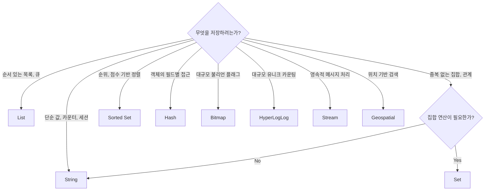

실시간 랭킹을 구현해야 한다. MySQL로 매 요청마다 `ORDER BY score DESC`를 돌리면 수천 명이 동시 접속할 때 DB가 버티지 못한다. Redis Sorted Set 하나로 수백만 명의 점수를 실시간으로 정렬해 1ms 안에 응답할 수 있다. Redis가 단순 캐시 저장소가 아닌 이유가 바로 여기 있다.

## 왜 자료구조가 중요한가?

> **비유**: Redis 자료구조는 스위스 군용 칼 같다. 하나의 도구지만 상황에 따라 칼날(String), 가위(List), 드라이버(Set), 줄(Sorted Set) 등 적합한 기능을 꺼내 쓴다. 무조건 String만 쓰는 건 가위로 나사를 조이는 것과 같다.

잘못된 자료구조를 선택하면 어떻게 될까? "좋아요 중복 방지"를 String으로 구현하면 매번 값을 파싱해야 하고 원자성도 없다. Set을 쓰면 `SADD`로 중복 방지와 추가가 한 번에 된다. 같은 문제라도 자료구조 선택 하나가 코드량과 성능을 10배 가른다.

| 자료구조 | 핵심 특징 | 주요 사용 사례 |
|---------|------|--------------|
| String | 범용 바이너리 값, 최대 512MB | 캐시, 카운터, 세션 |
| List | 순서 있는 이중 연결 리스트 | 메시지 큐, 최근 항목 |
| Set | 중복 없는 비정렬 집합 | 태그, 좋아요, 온라인 사용자 |
| Sorted Set | 점수 기반 정렬 집합 | 리더보드, 타임라인 |
| Hash | 필드-값 맵 | 객체 저장, 부분 업데이트 |
| Bitmap | 비트 배열 | 출석체크, 대규모 불리언 플래그 |
| HyperLogLog | 확률적 유니크 카운터 | UV 집계 |
| Stream | 영속적 메시지 시퀀스 | 이벤트 로그, 이벤트 소싱 |
| Geospatial | 위치 좌표 인덱스 | 근처 매장 검색 |

---

## String — 가장 기본, 가장 강력

Redis에서 가장 기본적인 자료구조다. 텍스트뿐 아니라 정수, 직렬화된 객체, 바이너리 데이터까지 **최대 512MB**까지 저장 가능하다.

### 왜 INCR이 안전한가?

```bash
# 이렇게 하면 race condition 발생한다
GET counter  → 10
             ← 다른 클라이언트도 GET counter → 10
SET counter 11
             ← 다른 클라이언트 SET counter 11  # 둘 다 11, 하나 손실

# INCR은 Redis 싱글 스레드에서 하나의 명령어로 실행된다
INCR counter  # GET + 증가 + SET을 원자적으로 처리
```

Redis는 싱글 스레드로 명령어를 순차 처리하므로 `INCR`은 실행 도중 다른 명령어가 끼어들 수 없다. **이 원자성이 Redis를 분산 카운터로 쓸 수 있는 이유다.**

만약 INCR을 쓰지 않으면? 두 서버가 동시에 GET → 값 증가 → SET을 하면 하나의 증가가 유실된다. 페이지뷰 카운터가 실제보다 적게 집계되는 것이다.

### 주요 명령어

```bash
# 기본 저장/조회
SET key value
GET key

# 조건부 저장 — 분산 락에 핵심
SETNX key value       # 키가 없을 때만 설정
SET key value NX      # 동일 동작
SET key value XX      # 키가 있을 때만 설정

# TTL과 함께 저장 — 세션에 필수
SET key value EX 60   # 60초 후 만료
SET key value PX 60000 # 60000밀리초 후 만료

# 여러 키 한번에 처리
MSET key1 val1 key2 val2
MGET key1 key2

# 숫자 연산 — 모두 원자적
INCR key              # +1
INCRBY key 5          # +5
INCRBYFLOAT key 1.5   # 부동소수점 증가
```

### 실전 활용

```java
// 캐시: 1시간짜리 상품 정보 캐시
redisTemplate.opsForValue().set("product:" + id, json, 1, TimeUnit.HOURS);

// 카운터: 페이지뷰 집계
redisTemplate.opsForValue().increment("page:view:" + pageId);

// 세션: 30분 자동 만료
redisTemplate.opsForValue().set("session:" + token, userId, 30, TimeUnit.MINUTES);

// 분산 락: 키가 없을 때만 설정 (있으면 다른 서버가 이미 락을 잡은 것)
Boolean acquired = redisTemplate.opsForValue()
    .setIfAbsent("lock:" + resource, uuid, 30, TimeUnit.SECONDS);
```

**시간복잡도**: GET, SET, INCR 모두 O(1) — 데이터 크기와 무관하게 일정하다.

---

## List — 큐와 스택을 동시에

순서가 있는 **이중 연결 리스트**다. 양쪽 끝 삽입/삭제가 O(1)이다. "최근 방문한 상품 10개"처럼 순서가 중요한 데이터에 적합하다.

### 동작 원리

```
LPUSH → [3, 2, 1]  (왼쪽에 추가)
RPUSH → [1, 2, 3]  (오른쪽에 추가)
LPOP  → 3          (왼쪽에서 꺼냄)
RPOP  → 3          (오른쪽에서 꺼냄)
```

> **비유**: List는 마트 계산대 줄과 같다. RPUSH로 줄 뒤에 서고 LPOP으로 앞에서 한 명씩 계산한다. 이게 큐다. 반대로 LPUSH로 앞에 서고 LPOP으로 꺼내면 스택이 된다.

### 메시지 큐 패턴

```bash
# 생산자: 오른쪽에 추가
RPUSH queue:orders "{\"orderId\": 123}"

# 소비자: 왼쪽에서 블로킹 팝 — 메시지가 올 때까지 기다린다
BLPOP queue:orders 0   # 0 = 무한 대기
```

**BLPOP을 쓰지 않으면?** 소비자가 폴링으로 빈 큐를 계속 확인해야 한다. CPU 낭비 + Redis 부하 증가. BLPOP은 메시지가 도착하는 순간 즉시 깨어나므로 효율적이다.

```java
// Spring에서 블로킹 팝
List<String> result = redisTemplate.opsForList()
    .leftPop("queue:orders", Duration.ofSeconds(30));
```

### Reliable Queue — 처리 중 실패 대비

일반 큐는 LPOP으로 꺼낸 뒤 서버가 죽으면 메시지가 영원히 사라진다. 해결법:

```bash
# 꺼내면서 처리 중 목록으로 원자적 이동
LMOVE queue:orders processing LEFT RIGHT

# 처리 완료 후 processing에서 삭제
LREM processing 1 "{\"orderId\": 123}"

# 장애 복구: processing에 남은 항목을 재처리
LRANGE processing 0 -1
```

**시간복잡도**: LPUSH, RPUSH, LPOP, RPOP O(1) / LRANGE O(S+N) / LINDEX O(N)

---

## Set — 중복 없는 집합, 집합 연산이 핵심

**중복을 허용하지 않는 비정렬 집합**이다. `SADD`로 값을 추가하면 이미 있는 경우 무시된다. "좋아요"처럼 한 사람이 두 번 누를 수 없는 경우에 딱 맞는다.

### 집합 연산이 만드는 가능성

```bash
# 두 사용자의 공통 팔로워를 구하려면?
SADD user:1:followers "alice" "bob" "charlie"
SADD user:2:followers "bob" "charlie" "dave"
SINTER user:1:followers user:2:followers
# → "bob", "charlie"
```

> **비유**: Set은 벤 다이어그램이다. 두 원의 겹치는 부분(교집합), 합치는 부분(합집합), 한쪽에만 있는 부분(차집합)을 명령어 하나로 구한다.

이걸 MySQL로 하면 두 테이블 JOIN + 집계가 필요하다. Set이면 명령어 하나다.

### 주요 명령어

```bash
SADD key member1 member2  # 추가 (이미 있으면 무시)
SREM key member           # 삭제
SISMEMBER key member      # 존재 여부 O(1)
SCARD key                 # 원소 개수 O(1)
SMEMBERS key              # 전체 조회 (대용량 주의)

# 집합 연산
SUNION key1 key2          # 합집합
SINTER key1 key2          # 교집합
SDIFF key1 key2           # 차집합 (key1 - key2)
```

### 실전 활용

```java
// 좋아요: 중복 방지는 자동
redisTemplate.opsForSet().add("post:1:likes", userId);
Long likeCount = redisTemplate.opsForSet().size("post:1:likes");

// 온라인 사용자 관리
redisTemplate.opsForSet().add("online:users", userId);
Boolean isOnline = redisTemplate.opsForSet().isMember("online:users", userId);

// 공통 팔로워 찾기
Set<String> common = redisTemplate.opsForSet()
    .intersect("user:1:followers", "user:2:followers");
```

**시간복잡도**: SADD, SREM O(N) — N은 추가/삭제 개수 / SISMEMBER O(1) / SUNION O(N+M)

---

## Sorted Set (ZSet) — 점수로 정렬되는 집합

각 원소에 **score(실수)**를 부여해 자동으로 정렬되는 집합이다. 내부적으로 skip list와 hash table을 함께 사용한다. skip list가 정렬 순서를 유지하고, hash table이 O(1) 조회를 담당한다.

### 왜 skip list인가?

> **비유**: Sorted Set은 도서관의 분류된 서가와 같다. 책(원소)마다 청구기호(score)가 붙어 있어 순서대로 꽂혀 있다. "상위 10권"을 꺼내는 것도, "이 책이 몇 번째인지"도 빠르게 알 수 있다.

배열로 정렬 상태를 유지하면 삽입이 O(N)이다. skip list는 삽입, 삭제, 검색 모두 O(log N)을 보장한다.

### 리더보드 구현

```java
@Service
public class LeaderboardService {

    private static final String KEY = "leaderboard:game";

    // 점수 추가/갱신
    public void addScore(String userId, double score) {
        redisTemplate.opsForZSet().add(KEY, userId, score);
    }

    // 점수 증가 — 아이템 획득 시
    public Double incrementScore(String userId, double delta) {
        return redisTemplate.opsForZSet().incrementScore(KEY, userId, delta);
    }

    // 상위 N명 조회
    public Set<ZSetOperations.TypedTuple<String>> getTopN(int n) {
        return redisTemplate.opsForZSet()
            .reverseRangeWithScores(KEY, 0, n - 1);
    }

    // 내 순위 조회 (0-indexed이므로 +1)
    public Long getMyRank(String userId) {
        Long rank = redisTemplate.opsForZSet().reverseRank(KEY, userId);
        return rank != null ? rank + 1 : null;
    }
}
```

이 코드를 MySQL로 구현하면? 매 요청마다 `COUNT(*) WHERE score > ?` 쿼리가 필요하다. 동시 사용자 100만 명이면 DB가 버틸 수 없다.

### 타임라인 — score에 Unix timestamp 사용

```bash
# score에 Unix timestamp를 넣으면 시간 순서대로 정렬된다
ZADD timeline:feed 1714567890 "post:123"
ZADD timeline:feed 1714567950 "post:124"

# 최신 10개 조회
ZREVRANGE timeline:feed 0 9 WITHSCORES

# 특정 시간 범위 조회
ZRANGEBYSCORE timeline:feed 1714560000 1714599999
```

**시간복잡도**: ZADD O(log N) / ZSCORE O(1) / ZRANK O(log N) / ZRANGE O(log N + M)

---

## Hash — 객체를 JSON 대신 필드로 저장

**필드-값 쌍의 맵**이다. 객체를 JSON으로 직렬화해 String에 저장하는 방식과 비교해보자.

### String(JSON) vs Hash — 어떤 차이가 있나?

```bash
# String 방식: 나이 하나 바꾸려면 전체를 덮어써야 한다
SET user:1 '{"name":"김철수","email":"kim@example.com","age":30}'
# 나이 변경: 전체 JSON 읽어서 파싱하고 다시 직렬화해서 저장

# Hash 방식: 필드 하나만 바꾸면 된다
HSET user:1 name "김철수" email "kim@example.com" age 30
HSET user:1 age 31  # 나이만 변경
HGET user:1 name    # name만 조회
```

> **비유**: String+JSON은 캐비닛에 서류를 투명 비닐백에 통째로 넣어두는 것. 하나를 꺼내려면 봉투를 열어야 한다. Hash는 캐비닛에 서류를 파일별로 정리한 것. 원하는 파일만 꺼낼 수 있다.

### 실전 활용

```java
// 사용자 객체 저장
Map<String, String> userMap = new HashMap<>();
userMap.put("name", "김철수");
userMap.put("email", "kim@example.com");
userMap.put("age", "30");
redisTemplate.opsForHash().putAll("user:1", userMap);

// 특정 필드만 조회
String name = (String) redisTemplate.opsForHash().get("user:1", "name");

// 로그인 횟수 증가 — 다른 필드는 건드리지 않는다
redisTemplate.opsForHash().increment("user:1", "loginCount", 1);
```

**메모리 최적화**: 소규모 Hash(기본값: 128필드 이하, 64바이트 이하)는 내부적으로 **listpack**을 사용해 메모리를 효율적으로 사용한다. 임계값을 초과하면 hashtable로 전환된다.

**시간복잡도**: HSET, HGET O(1) / HMGET O(N) / HGETALL O(N)

---

## Bitmap — 10만 명의 출석을 12KB로

String을 **비트 배열로 해석**한다. `SETBIT key offset 1`로 특정 위치의 비트를 켠다.

**메모리 효율이 얼마나 좋은가?**

| 방법 | 10만 명 하루 출석 데이터 |
|------|----------------------|
| Boolean Set | 수 MB |
| Bitmap | 약 12KB |

10만 명의 출석 여부를 10만 비트로 표현. 10만 비트 = 12,500바이트 = 약 12KB.

```java
// 출석 기록: 키 = attendance:{userId}:{year}:{month}, offset = 일(day) - 1
redisTemplate.opsForValue().setBit("attendance:user1:2026:05", 0, true);  // 1일 출석
redisTemplate.opsForValue().setBit("attendance:user1:2026:05", 4, true);  // 5일 출석

// 특정 날 출석 여부
Boolean attended = redisTemplate.opsForValue()
    .getBit("attendance:user1:2026:05", 0);

// 월 출석 일수
Long count = redisTemplate.execute(
    (RedisCallback<Long>) conn ->
        conn.stringCommands().bitCount("attendance:user1:2026:05".getBytes())
);
```

**만약 Bitmap을 안 쓰면?** 매번 Set에 날짜를 추가하면 사용자당 수십 바이트씩 필요하고 집계 쿼리도 복잡해진다.

---

## HyperLogLog — 메모리 12KB로 수십억 UV 집계

**확률적 알고리즘**으로 집합의 원소 개수(cardinality)를 근사 추정한다. 최대 12KB 고정 메모리로 2^64개 원소까지 추정 가능. 오차율 약 0.81%.

### Set vs HyperLogLog — 언제 어느 것을?

| 항목 | Set | HyperLogLog |
|------|-----|-------------|
| 정확도 | 100% 정확 | 약 0.81% 오차 |
| 메모리 | 원소 수에 비례 | 최대 12KB 고정 |
| 원소 목록 조회 | 가능 | 불가능 |
| 적합 사례 | 원소 목록이 필요할 때 | 대규모 유니크 카운팅 |

> **비유**: Set으로 UV를 세는 건 방문자마다 이름을 출석부에 적는 것. HyperLogLog는 "대략 몇 명쯤 왔다"를 스케치로 기록하는 것. 정확한 명단은 모르지만 인원 파악은 빠르다.

```java
// 방문자 추가
String key = "uv:page:home:" + today;
redisTemplate.opsForHyperLogLog().add(key, userId);

// 유니크 방문자 수
Long uv = redisTemplate.opsForHyperLogLog().size(key);
```

---

## Stream — Kafka가 없을 때의 영속 메시지 큐

메시지의 **영속적 시퀀스**를 저장한다. Redis 5.0에서 도입. List와 달리 소비 후에도 메시지가 남고, 소비자 그룹을 지원한다.

### Pub/Sub, List, Stream — 뭐가 다른가?

```
Pub/Sub: 메시지를 저장하지 않는다. 구독자가 없으면 메시지가 사라진다.
List: LPOP으로 꺼내면 메시지가 사라진다. 여러 소비자가 같은 메시지를 처리할 수 없다.
Stream: 메시지가 남아 있다. 소비자 그룹으로 여러 인스턴스가 메시지를 나눠 처리할 수 있다.
```

```java
// 이벤트 발행
Map<String, String> eventData = new HashMap<>();
eventData.put("orderId", "123");
eventData.put("status", "CREATED");
redisTemplate.opsForStream().add("stream:orders", eventData);

// 소비자 그룹으로 읽기 — 여러 인스턴스가 메시지를 분산 처리
List<MapRecord<String, Object, Object>> records = redisTemplate.opsForStream()
    .read(Consumer.from("order-service", "consumer-1"),
          StreamReadOptions.empty().count(10),
          StreamOffset.create("stream:orders", ReadOffset.lastConsumed()));

// 처리 후 ACK — 안 하면 재처리 대상이 된다
records.forEach(record -> {
    processOrder(record.getValue());
    redisTemplate.opsForStream().acknowledge("stream:orders", "order-service", record.getId());
});
```

---

## Geospatial — 위치 기반 검색을 명령어 하나로

내부적으로 **Sorted Set**을 사용한다. 좌표를 geohash로 인코딩해 score에 저장한다.

```java
// 매장 등록
redisTemplate.opsForGeo()
    .add("stores", new Point(127.0276, 37.4979), "강남점");

// 현재 위치에서 5km 이내 매장 조회
GeoSearchCommandArgs args = GeoSearchCommandArgs.newGeoSearchArgs()
    .includeDistance()
    .sortAscending()
    .limit(10);

GeoResults<RedisGeoCommands.GeoLocation<String>> results = redisTemplate.opsForGeo()
    .search("stores",
            new BoundingBox(new Point(127.0, 37.5), new Distance(5, Metrics.KILOMETERS)),
            args);
```

이걸 MySQL로 하면 모든 매장에 대해 거리 계산 후 정렬해야 한다. 매장이 10만 개라면 10만 번의 삼각함수 연산이 필요하다.

---

## 자료구조별 메모리 자동 최적화

Redis는 소규모 자료구조에 **컴팩트 인코딩**을 자동 적용한다.

| 자료구조 | 소규모 인코딩 | 임계값 | 초과 시 |
|---------|------------|--------|--------|
| Hash | listpack | 128 필드, 64바이트 | hashtable |
| List | listpack | 128 원소, 64바이트 | quicklist |
| Set | listpack / intset | 128 원소 | hashtable |
| Sorted Set | listpack | 128 원소, 64바이트 | skiplist |

```bash
# 현재 인코딩 확인
OBJECT ENCODING key
# → listpack, skiplist, hashtable, intset 등
```

---

## 자료구조 선택 가이드


