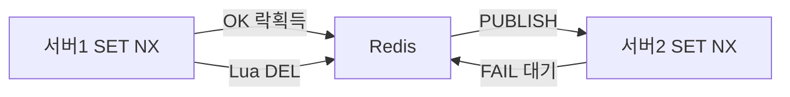
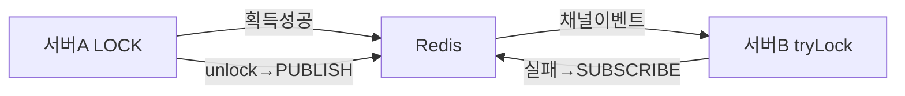
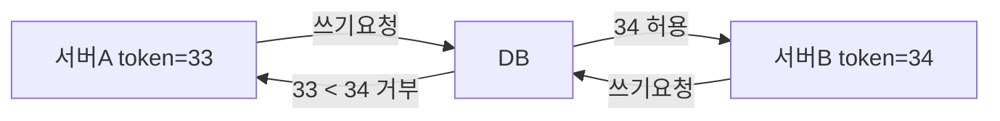
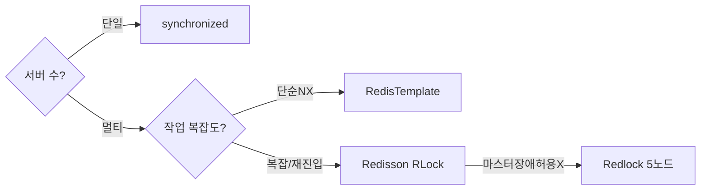

쿠팡 블랙프라이데이 자정, 한정판 운동화 1켤레에 5만 명이 동시에 달려든다. 서버 20대가 저마다 "재고 1개 남음"을 읽고 결제를 진행하면, 재고는 1개인데 20명에게 팔리는 참사가 벌어진다. `synchronized`는 JVM 안에서만 유효하다. 20대 서버가 공유하는 자원을 보호하려면 **분산 락**이 필요하다.

이 글은 "Redis 분산 락을 왜 그렇게 구현하는가"라는 질문에 집중한다. SETNX와 EXPIRE를 왜 분리하면 안 되는지, Lua 스크립트가 어떻게 원자성을 보장하는지, Redisson의 Watchdog이 왜 정확히 10초마다 갱신하는지, Martin Kleppmann이 Redlock을 왜 비판했는지를 내부 메커니즘 수준으로 파헤친다.

---

## 1. 분산 락이란 — 왜 필요한가

> **비유**: 분산 락은 은행 금고 열쇠다. 열쇠를 가진 직원(서버)만 금고(공유 자원)에 들어갈 수 있고, 나올 때 열쇠를 반납해야 다음 직원이 들어갈 수 있다. 열쇠 보관소(Redis)는 모든 지점에서 접근 가능하다.

단일 서버 환경에서는 `ReentrantLock`이나 `synchronized`로 충분하다. 문제는 **수평 확장(Scale-Out)**이다. 서버 인스턴스 10대가 같은 재고 테이블을 읽으면, 각 JVM 락은 자신의 프로세스 안에서만 유효하므로 10대가 동시에 같은 레코드를 잡는다.

외부 저장소 기반의 분산 락이 필요한 이유다. Redis가 선택받는 이유는 세 가지다.

| 특성 | 이유 |
|------|------|
| **싱글 스레드 이벤트 루프** | 명령어 실행이 순차적이므로 Redis 자체에서 race condition이 없다 |
| **원자적 복합 명령어** | `SET NX EX`, `EVAL`(Lua)로 "읽기-검사-쓰기"를 한 명령으로 처리 |
| **TTL 기본 지원** | 락 보유자가 죽어도 TTL 만료로 자동 해제 — 데드락 방지 |
| **Pub/Sub** | 락 해제 시 구독자에게 즉시 push — 스핀락 불필요 |



---

## 2. SETNX + EXPIRE의 치명적 race condition

Redis 분산 락의 첫 번째 함정은 "SETNX를 먼저, EXPIRE를 나중에" 패턴이다.

### 왜 분리하면 안 되는가

```java
// 절대 하지 말 것: 두 명령어가 원자적이지 않다
redisTemplate.opsForValue().setIfAbsent(lockKey, lockValue); // SETNX
redisTemplate.expire(lockKey, 30, TimeUnit.SECONDS);          // EXPIRE
```

이 코드에는 두 명령어 사이에 **시간 간격**이 존재한다. Redis는 싱글 스레드지만 클라이언트 측의 시간 간격은 제어할 수 없다. 다음 시나리오가 발생한다.

```
t=0: 서버 A → SETNX lock_key "uuid-A" → 성공 (TTL 없음)
t=1: 서버 A 프로세스 크래시! (EXPIRE를 보내기 전에)
t=2: lock_key는 TTL 없이 Redis에 영구 존재 → 데드락
t=∞: 어떤 서버도 이 락을 획득하지 못함
```

SETNX 성공 직후 프로세스가 죽으면 TTL 없는 키가 영구 잔류한다. 서비스 전체가 해당 자원에 접근 불가가 된다.

### SET NX EX — 원자적 해법

Redis 2.6.12부터 `SET` 명령어에 옵션이 통합됐다.

```bash
SET resource_lock <unique_value> NX EX 30
```

이 명령어는 **Redis 서버에서 단일 명령으로 처리**된다. Redis의 싱글 스레드 이벤트 루프는 이 명령어 하나를 처리하는 동안 다른 어떤 명령도 끼어들 수 없다. "키 존재 여부 확인 + 값 설정 + TTL 설정"이 하나의 원자적 단위다.

왜 이게 원자적인가? Redis는 epoll/kqueue 기반 이벤트 루프에서 **명령어 파싱 → 실행 → 응답 전송**을 단일 스레드로 처리한다. `SET NX EX`는 하나의 명령어이므로 파싱부터 실행까지 인터럽트가 없다. SETNX와 EXPIRE가 두 줄이면 각각 독립된 이벤트가 되어 그 사이에 다른 클라이언트 명령이 실행될 수 있다.

```java
// 올바른 방법: SET NX EX = 원자적 하나의 명령
Boolean acquired = redisTemplate.opsForValue()
    .setIfAbsent(lockKey, lockValue, 30, TimeUnit.SECONDS);
// Spring Data Redis는 내부적으로 SET key value NX EX 30 을 보낸다
```

---

## 3. Lua 스크립트 원자성 — 왜 GET+DEL을 분리하면 안 되는가

락을 해제할 때도 같은 원자성 문제가 있다.

### 해제 시 race condition

```java
// 잘못된 해제 코드
String value = redisTemplate.opsForValue().get(lockKey);  // GET
if (lockValue.equals(value)) {
    redisTemplate.delete(lockKey);  // DEL
}
```

GET과 DEL 사이에 다른 서버가 끼어들 수 있다.

```
t=0: 서버 A → GET lock_key → "uuid-A" (내 값 맞음)
t=1: 서버 A의 락 TTL 만료 (GC pause로 코드 실행이 멈춰있었음)
t=2: 서버 B → SET NX EX → 성공, lock_key = "uuid-B"
t=3: 서버 A 깨어남 → DEL lock_key → 서버 B의 락을 삭제!
t=4: 서버 C → SET NX EX → 성공, 두 서버가 동시에 임계 구역 진입
```

### Lua 스크립트 — Redis의 원자적 스크립팅

Redis는 Lua 인터프리터를 내장하고 있다. EVAL 명령으로 실행되는 Lua 스크립트는 **Redis 이벤트 루프에서 단일 명령처럼 처리**된다. 스크립트 실행 도중 다른 클라이언트의 명령은 실행되지 않는다.

왜 Lua가 원자적인가? Redis 소스 코드(`scripting.c`)를 보면 `EVAL` 명령의 핸들러는 Lua 스크립트를 완전히 실행한 뒤에야 다음 이벤트 루프 사이클로 넘어간다. 이것이 Redis 문서가 "scripts are atomic with respect to the rest of Redis"라고 명시하는 이유다.

```java
// 올바른 해제: Lua로 GET + 비교 + DEL을 원자적으로
private static final String RELEASE_SCRIPT =
    "if redis.call('get', KEYS[1]) == ARGV[1] then " +
    "  return redis.call('del', KEYS[1]) " +
    "else " +
    "  return 0 " +
    "end";

public boolean releaseLock(String lockKey, String lockValue) {
    Long result = redisTemplate.execute(
        new DefaultRedisScript<>(RELEASE_SCRIPT, Long.class),
        List.of(lockKey),
        lockValue
    );
    return Long.valueOf(1L).equals(result);
}
```

### EVALSHA — Lua 스크립트 캐싱

`EVAL`은 매번 스크립트 전문을 Redis로 전송한다. `EVALSHA`는 스크립트의 SHA1 해시만 전송하고, Redis가 캐시에서 찾아 실행한다. 네트워크 전송량을 줄이고 파싱 오버헤드를 제거한다.

Spring Data Redis의 `DefaultRedisScript`는 내부적으로 이를 자동 처리한다. 처음 실행 시 `SCRIPT LOAD`로 스크립트를 Redis에 등록하고 SHA1을 받은 뒤, 이후 호출은 `EVALSHA`로 SHA1만 전송한다. 스크립트가 캐시에 없으면(`NOSCRIPT` 에러) 자동으로 `EVAL`로 폴백한다.

```java
// DefaultRedisScript 내부 동작 원리
// 1. SCRIPT LOAD "if redis.call('get'..." → SHA1: "a1b2c3..."
// 2. 이후: EVALSHA a1b2c3 1 lockKey lockValue
// 3. NOSCRIPT 에러 시: 자동으로 EVAL 재실행
DefaultRedisScript<Long> script = new DefaultRedisScript<>();
script.setScriptText(RELEASE_SCRIPT);
script.setResultType(Long.class);
// Spring이 내부적으로 EVALSHA/EVAL 전환 처리
```

---

## 4. RedisTemplate 기반 완전 구현

```java
@Component
@RequiredArgsConstructor
public class RedisDistributedLock {

    private final StringRedisTemplate redisTemplate;

    private static final String RELEASE_SCRIPT =
        "if redis.call('get', KEYS[1]) == ARGV[1] then " +
        "  return redis.call('del', KEYS[1]) " +
        "else " +
        "  return 0 " +
        "end";

    /**
     * 락 획득 시도 (단순 1회)
     * 내부적으로 SET lockKey lockValue NX EX ttlSeconds 전송
     */
    public boolean tryLock(String lockKey, String lockValue, long ttlSeconds) {
        Boolean result = redisTemplate.opsForValue()
            .setIfAbsent(lockKey, lockValue, ttlSeconds, TimeUnit.SECONDS);
        return Boolean.TRUE.equals(result);
    }

    /**
     * 락 해제 — Lua 스크립트로 GET+비교+DEL을 원자적으로 실행
     * 자신이 건 락만 삭제하므로 타인 락 오삭제 불가
     */
    public boolean releaseLock(String lockKey, String lockValue) {
        Long result = redisTemplate.execute(
            new DefaultRedisScript<>(RELEASE_SCRIPT, Long.class),
            List.of(lockKey),
            lockValue
        );
        return Long.valueOf(1L).equals(result);
    }

    /**
     * 스핀락 방식 재시도
     * Lettuce는 Pub/Sub 구독 없이 폴링만 가능 — 고부하 시 Redis 타격
     */
    public boolean tryLockWithRetry(String lockKey, String lockValue,
                                     long ttlSeconds, long waitMillis)
            throws InterruptedException {
        long deadline = System.currentTimeMillis() + waitMillis;
        while (System.currentTimeMillis() < deadline) {
            if (tryLock(lockKey, lockValue, ttlSeconds)) {
                return true;
            }
            Thread.sleep(100); // 100ms 폴링 간격 — 해제 감지까지 최대 100ms 지연
        }
        return false;
    }
}
```

```java
@Service
@RequiredArgsConstructor
public class StockService {

    private final RedisDistributedLock lock;
    private final StockRepository stockRepository;

    public void decreaseStock(Long productId, int amount) {
        String lockKey   = "stock:lock:" + productId;
        String lockValue = UUID.randomUUID().toString(); // 내 락 식별용 UUID

        if (!lock.tryLock(lockKey, lockValue, 30)) {
            throw new LockAcquisitionException("재고 락 획득 실패: " + productId);
        }
        try {
            // DB 레벨 방어: WHERE quantity >= amount 조건 필수
            int updated = stockRepository.decreaseStock(productId, amount);
            if (updated == 0) {
                throw new InsufficientStockException("재고 부족");
            }
        } finally {
            lock.releaseLock(lockKey, lockValue); // Lua로 안전하게 해제
        }
    }
}
```

### 스핀락의 근본적 문제

스핀락은 락이 해제되는 **정확한 시점을 모른다**. 100ms마다 물어봐야 한다. 경쟁 스레드가 100개면 초당 1000번의 `SET NX` 명령이 Redis로 쏟아진다. 락 해제 시점과 다음 폴링 사이에 최대 100ms 지연이 생긴다. Redisson은 Pub/Sub으로 이 문제를 근본적으로 해결한다.

---

## 5. Redisson — Pub/Sub 기반 락 대기

Redisson의 핵심 차별점은 락을 기다리는 방법이다.

### 왜 Pub/Sub이 스핀락보다 우월한가

TCP 소켓은 전이중(full-duplex)이다. 클라이언트가 데이터를 보내지 않아도 서버가 먼저 데이터를 보낼 수 있다. Redis의 `SUBSCRIBE` 명령을 보내면 클라이언트 TCP 소켓은 "구독 모드"가 된다. 이 소켓은 OS의 `epoll_wait`에 등록되어 데이터가 올 때까지 CPU를 전혀 사용하지 않는다. Redis가 `PUBLISH`를 보내면 OS가 소켓에 데이터가 왔음을 감지하고 대기 중인 스레드를 깨운다.

```
스핀락:  [SET NX]→[FAIL]→[sleep 100ms]→[SET NX]→[FAIL]→... (CPU + 네트워크 낭비)
Pub/Sub: [SUBSCRIBE]→epoll_wait(CPU 0%)→[락 해제 PUBLISH 수신]→즉시 재시도
```

Redisson 내부 채널명은 `redisson_lock__channel:{lockKey}`다. 락 보유자가 unlock을 호출하면 이 채널에 `PUBLISH`하고, 대기 중인 모든 클라이언트가 즉시 깨어나 `SET NX`를 재시도한다.



### Redisson 설정 및 기본 사용

```xml
<dependency>
    <groupId>org.redisson</groupId>
    <artifactId>redisson-spring-boot-starter</artifactId>
    <version>3.27.0</version>
</dependency>
```

```java
@Configuration
public class RedissonConfig {

    @Bean
    public RedissonClient redissonClient() {
        Config config = new Config();
        config.useSingleServer()
            .setAddress("redis://localhost:6379")
            .setConnectionMinimumIdleSize(2)
            .setConnectionPoolSize(10);
        // Watchdog TTL: 기본 30초, 실무에서는 10~20초 권장
        config.setLockWatchdogTimeout(30000);
        return Redisson.create(config);
    }
}
```

```java
@Service
@RequiredArgsConstructor
public class OrderService {

    private final RedissonClient redissonClient;
    private final OrderRepository orderRepository;

    public OrderResult processOrder(Long orderId) {
        RLock lock = redissonClient.getLock("order:lock:" + orderId);

        try {
            // waitTime=10초(락 대기), leaseTime=30초(보유 최대)
            // leaseTime 지정 시 Watchdog 비활성화 — 명시적 제어 선호 시
            boolean acquired = lock.tryLock(10, 30, TimeUnit.SECONDS);
            if (!acquired) {
                throw new LockAcquisitionException("주문 처리 중: " + orderId);
            }
            return doProcessOrder(orderId);
        } catch (InterruptedException e) {
            Thread.currentThread().interrupt();
            throw new LockInterruptedException(e);
        } finally {
            if (lock.isHeldByCurrentThread()) {
                lock.unlock();
            }
        }
    }
}
```

---

## 6. Redisson Watchdog — 내부 메커니즘 완전 분석

### 왜 30초 기본값인가

Watchdog의 기본 TTL은 30초(`lockWatchdogTimeout`)다. 이 값이 선택된 이유는 "대부분의 작업이 30초 내에 완료"되는 경험적 기준이 아니라, **TTL 갱신 주기 계산**에서 나온다.

Redisson은 TTL의 1/3 시점마다 갱신한다. 30초 TTL → 10초마다 갱신. 이렇게 하면 갱신 실패(네트워크 일시 장애) 후 2번의 재시도 기회가 있고, 그래도 실패하면 락이 만료된다. 즉 **가용성과 안전성 사이의 균형점**이 1/3 주기다.

```
TTL=30초, 갱신주기=10초:
  t=0:  락 획득, TTL=30초
  t=10: Watchdog 갱신 → TTL=30초 (리셋)
  t=20: Watchdog 갱신 → TTL=30초 (리셋)
  t=30: 갱신 실패(네트워크 단절) → TTL=30초 남아있음
  t=60: 갱신 계속 실패 → TTL 만료 → 락 자동 해제
  → 최악의 경우 30초 후 자동 해제 보장
```

### Watchdog 내부 구현 원리

Redisson의 `RedissonLock.lock()` 소스(GitHub `RedissonLock.java`)를 보면 Watchdog은 `HashedWheelTimer`(Netty 내장)를 사용한다. leaseTime을 지정하지 않으면 `scheduleExpirationRenewal(threadId)`가 호출되어 타이머에 갱신 태스크를 등록한다.

```java
// Redisson 내부 로직 (개념적 재현)
private void scheduleExpirationRenewal(long threadId) {
    ExpirationEntry entry = new ExpirationEntry();
    entry.addThreadId(threadId);

    // lockWatchdogTimeout의 1/3 주기로 갱신
    long renewalInterval = internalLockLeaseTime / 3; // 기본 10초

    Timeout task = commandExecutor.getConnectionManager().newTimeout(
        timeout -> renewExpiration(threadId),
        renewalInterval,   // 10초 후 첫 실행
        TimeUnit.MILLISECONDS
    );
    entry.setTimeout(task);
    EXPIRATION_RENEWAL_MAP.put(getEntryName(), entry);
}

private void renewExpiration(long threadId) {
    // Lua로 현재 스레드가 락 보유 중이면 TTL을 30초로 리셋
    String renewScript =
        "if redis.call('hexists', KEYS[1], ARGV[2]) == 1 then " +
        "  return redis.call('pexpire', KEYS[1], ARGV[1]) " +
        "return 0 end";
    // 갱신 성공 → 다음 갱신 스케줄
    // 갱신 실패(락 없음) → 스케줄 취소
}
```

핵심은 `EXPIRATION_RENEWAL_MAP`이다. `getEntryName()`은 `id + ":" + name` 형태로 JVM 인스턴스 + 락 이름의 조합이다. **JVM이 죽으면 이 Map에서 엔트리가 사라지고 타이머도 멈춘다.** 따라서 JVM이 죽으면 Watchdog도 죽고, 30초 후 TTL 만료로 락이 자동 해제된다.

### leaseTime 지정 여부에 따른 동작 비교

```java
// 케이스 1: leaseTime 생략 → Watchdog 활성
lock.lock();                          // internalLockLeaseTime(30s) TTL + Watchdog
lock.tryLock(10, TimeUnit.SECONDS);  // 10초 대기, Watchdog 활성

// 케이스 2: leaseTime 명시 → Watchdog 비활성
lock.tryLock(10, 30, TimeUnit.SECONDS); // 30초 후 강제 만료, Watchdog 없음

// 케이스 3: Watchdog 타임아웃 커스터마이즈
Config config = new Config();
config.setLockWatchdogTimeout(10_000); // 10초 TTL, 3.3초마다 갱신
```

| 시나리오 | Watchdog (leaseTime 생략) | leaseTime=30초 명시 |
|---------|--------------------------|---------------------|
| 작업 정상 완료 (5초) | unlock() → Watchdog 중단 | unlock() → 즉시 해제 |
| 작업이 느림 (45초) | TTL 갱신 → 45초에 완료, 안전 | 30초에 락 만료 → **이중 진입 위험** |
| 프로세스 크래시 | Watchdog 중단 → 30초 후 만료 | 30초 후 만료 (동일) |
| unlock() 누락 | **영구 락** (Watchdog이 계속 갱신) | 30초 후 만료 (자동 해제) |
| GC STW 35초 | 다른 서버 35초 대기 | 30초에 만료 → **이중 진입** |

**실무 권장**: 작업 시간이 예측 가능하면 leaseTime 명시, 예측 불가(외부 API 호출 등)면 Watchdog + try-finally 필수.

```java
// Watchdog 사용 시 try-finally는 생존 조건
lock.lock();
try {
    callUnpredictableExternalApi();
} finally {
    if (lock.isHeldByCurrentThread()) {
        lock.unlock(); // 이 줄이 없으면 Watchdog이 영원히 갱신 → 영구 락
    }
}
```

---

## 7. 재진입 락(Reentrant Lock) — 왜 필요하고 어떻게 동작하는가

### 왜 재진입이 필요한가

단순 뮤텍스 락에서 같은 스레드가 락을 두 번 획득하려 하면 데드락이 발생한다.

```java
public void methodA() {
    lock.lock();
    try {
        methodB(); // methodB도 같은 락을 획득하려 한다
    } finally {
        lock.unlock();
    }
}

public void methodB() {
    lock.lock(); // 이미 같은 스레드가 잡고 있으므로 데드락!
    try {
        doWork();
    } finally {
        lock.unlock();
    }
}
```

재귀 호출이나 메서드 체인에서 같은 락이 필요한 경우가 실무에서 자주 발생한다. 재진입 락은 "이미 내가 잡은 락이면 다시 획득을 허용"하는 메커니즘이다.

### Thread ID + 카운터 패턴

Redisson의 재진입 락은 Redis 해시(HSET)로 구현된다. 키는 락 이름, 필드는 `threadId`, 값은 **진입 횟수(카운터)**다.

```
# Redis 데이터 구조 (RLock 내부)
HSET "order:lock:42"  "JVM-ID:thread-123"  1   # 첫 번째 lock()
HSET "order:lock:42"  "JVM-ID:thread-123"  2   # 두 번째 lock() (재진입)
HSET "order:lock:42"  "JVM-ID:thread-123"  1   # 첫 번째 unlock()
DEL  "order:lock:42"                            # 두 번째 unlock() → 완전 해제
```

Redisson은 `UUID:threadId` 조합을 필드 키로 사용한다. UUID는 JVM 인스턴스를 식별(서버 구분), threadId는 스레드를 식별한다.

```java
// Redisson 재진입 락 내부 Lua (개념적 재현)
String lockScript =
    // 락이 없으면: 새로 생성, 카운터=1
    "if redis.call('exists', KEYS[1]) == 0 then " +
    "  redis.call('hset', KEYS[1], ARGV[2], 1) " +
    "  redis.call('pexpire', KEYS[1], ARGV[1]) " +
    "  return nil " +
    // 락이 있고 내 스레드 것이면: 카운터 증가
    "elseif redis.call('hexists', KEYS[1], ARGV[2]) == 1 then " +
    "  redis.call('hincrby', KEYS[1], ARGV[2], 1) " +
    "  redis.call('pexpire', KEYS[1], ARGV[1]) " +
    "  return nil " +
    // 다른 스레드 것: 남은 TTL 반환 (대기 시간으로 사용)
    "end " +
    "return redis.call('pttl', KEYS[1])";
```

```java
// 실제 사용 - 재진입이 투명하게 동작
@Service
public class InventoryService {

    private final RedissonClient redissonClient;

    public void processOrder(Long orderId) {
        RLock lock = redissonClient.getLock("order:" + orderId);
        lock.lock(); // 카운터: 1
        try {
            validateOrder(orderId, lock); // 내부에서 같은 락 재획득
        } finally {
            lock.unlock(); // 카운터: 0 → 완전 해제
        }
    }

    private void validateOrder(Long orderId, RLock lock) {
        lock.lock(); // 같은 스레드 → 카운터: 2, 데드락 없음
        try {
            // 검증 로직
        } finally {
            lock.unlock(); // 카운터: 1 (아직 해제 안 됨)
        }
    }
}
```

---

## 8. Fair Lock — 왜 불공정 락이 처리량이 더 높은가

### 불공정 락(기본 RLock)의 동작

락이 해제될 때 Redisson은 Pub/Sub 채널에 `PUBLISH`를 보낸다. 대기 중인 모든 스레드가 깨어나 동시에 `SET NX`(또는 Lua 획득 스크립트)를 시도한다. 어떤 스레드가 먼저 Redis에 도달하느냐에 따라 락이 부여된다. 네트워크 지연이 짧은 서버, 스케줄러가 먼저 깨운 스레드가 유리하다.

이것이 **불공정**한 이유다. 10초 전부터 기다리던 스레드보다 방금 도착한 스레드가 먼저 락을 잡을 수 있다. 기아(Starvation)가 발생할 수 있다.

불공정 락이 **처리량이 더 높은 이유**는 Redis 왕복 횟수다. 공정 락은 대기 순서를 관리하는 추가 데이터 구조(Redis List 기반 큐)가 필요하다. 락 획득마다 큐 조작 + 차례 확인 + Lua 스크립트 실행이 더 발생한다. 불공정 락은 "먼저 도착한 자가 잡는" 단순 경쟁이므로 오버헤드가 없다.

### FairLock 내부 구조

Redisson의 FairLock은 Redis에 다음 두 구조를 유지한다.

```
# 1. 락 해시 (일반 RLock과 동일)
HSET "fairLock:resource"  "JVM-A:thread-1"  1

# 2. 대기 큐 (Redis List)
RPUSH "redisson_lock_queue:{fairLock:resource}"  "JVM-B:thread-2"
RPUSH "redisson_lock_queue:{fairLock:resource}"  "JVM-C:thread-3"

# 3. 대기자 타임아웃 (Redis ZSet — 대기 만료 관리)
ZADD "redisson_lock_timeout:{fairLock:resource}"  <expire_timestamp>  "JVM-B:thread-2"
```

unlock 시 큐의 맨 앞(`LPOP`)을 꺼내 그 스레드에게만 Pub/Sub 알림을 보낸다. 다른 스레드는 깨우지 않는다. **완전히 순서대로** 처리된다.

```java
RLock fairLock = redissonClient.getFairLock("resource:fair");

try {
    // 먼저 요청한 스레드가 먼저 획득 (Starvation 없음)
    // 단, 일반 RLock 대비 약 20~30% 처리량 감소
    fairLock.lock();
    doWork();
} finally {
    fairLock.unlock();
}
```

**언제 FairLock을 써야 하는가**: 모든 요청이 결국 처리되어야 하고, 일부 스레드가 장시간 기아 상태에 빠지면 안 되는 경우. 처리량보다 공정성이 중요한 경우. 예: 배치 작업 큐, 선착순 티켓팅.

**일반 RLock을 써야 하는 경우**: 처리량이 중요하고, 일부 재시도는 허용되는 경우. 예: 재고 차감, 결제 처리.

---

## 9. Fencing Token — GC pause가 락을 무력화하는 과정

### GC Stop-The-World가 락을 무력화하는 과정

Java의 Full GC(G1GC 이전의 Parallel GC, CMS)는 STW(Stop-The-World)를 유발한다. STW 동안 **JVM 내 모든 스레드가 멈춘다.** Watchdog도 멈춘다.

```
t=0:  서버 A, 락 획득 (TTL 30초), Watchdog 활성
t=5:  Full GC 발생 → JVM 전체 정지 (Watchdog 포함)
t=35: GC 완료 → 코드 재개 (30초 동안 아무것도 못함)
      → 락 TTL은 t=30에 만료됨!
      → 서버 A는 자신이 락을 보유 중이라 착각
t=31: 서버 B → 락 획득 성공 (TTL 만료 후)
t=35: 서버 A와 서버 B 동시에 임계 구역 실행!
```

Watchdog을 썼어도 동일하다. Watchdog 스레드도 STW에 묶여 갱신하지 못한다.

### Fencing Token 패턴 — 스테일 락 홀더 차단

락을 획득할 때 **단조 증가하는 토큰(monotonic token)**을 발급한다. 공유 자원(DB, 파일 서버 등)은 토큰을 검사하여 이전보다 큰 토큰만 허용한다. 오래된 락 보유자(stale holder)가 작업을 시도해도 DB가 거부한다.



```java
// 1단계: 락 획득 시 단조 증가 토큰 발급
@Service
@RequiredArgsConstructor
public class FencedLockService {

    private final RedissonClient redissonClient;
    private final StringRedisTemplate redisTemplate;
    private final StockRepository stockRepository;

    public void decreaseStockWithFencing(Long productId, int amount) {
        RLock lock = redissonClient.getLock("stock:lock:" + productId);

        try {
            if (!lock.tryLock(10, 30, TimeUnit.SECONDS)) {
                throw new LockAcquisitionException("락 획득 실패");
            }

            // 단조 증가 토큰 발급 (Redis INCR는 원자적)
            Long fencingToken = redisTemplate.opsForValue()
                .increment("fencing:token:stock:" + productId);

            // 토큰을 DB 쓰기에 함께 전달
            decreaseStockWithToken(productId, amount, fencingToken);

        } catch (InterruptedException e) {
            Thread.currentThread().interrupt();
            throw new LockInterruptedException(e);
        } finally {
            if (lock.isHeldByCurrentThread()) {
                lock.unlock();
            }
        }
    }

    private void decreaseStockWithToken(Long productId, int amount, Long token) {
        // DB가 토큰을 검사하여 stale holder 차단
        // last_fence_token < token 인 경우만 업데이트
        int updated = stockRepository.decreaseStockWithFencing(productId, amount, token);
        if (updated == 0) {
            throw new StaleTokenException("토큰 검증 실패: stale lock holder");
        }
    }
}
```

```sql
-- DB 스키마: 마지막 토큰을 저장
ALTER TABLE stock ADD COLUMN last_fence_token BIGINT DEFAULT 0;

-- 토큰 검증 쿼리: 더 오래된 토큰의 쓰기 거부
UPDATE stock
SET quantity = quantity - :amount,
    last_fence_token = :token
WHERE product_id = :productId
  AND quantity >= :amount
  AND last_fence_token < :token;  -- stale token 거부
```

```java
// Spring Data JPA 어노테이션
@Modifying
@Query("UPDATE Stock s SET s.quantity = s.quantity - :amount, " +
       "s.lastFenceToken = :token " +
       "WHERE s.productId = :productId " +
       "AND s.quantity >= :amount " +
       "AND s.lastFenceToken < :token")
int decreaseStockWithFencing(@Param("productId") Long productId,
                              @Param("amount") int amount,
                              @Param("token") Long token);
```

> **비유**: 병원 대기표와 같다. 33번 환자가 GC로 35분 쉬는 동안 34번 환자가 먼저 진료를 받았다. 33번이 뒤늦게 들어오려 해도 "이미 34번이 지나갔으므로 33번 입장 불가"로 거부된다.

---

## 10. Redlock 알고리즘 — N/2+1의 수학과 논쟁

### 왜 단일 Redis는 신뢰할 수 없는가

Redis 마스터-레플리카 구성에서 복제는 **비동기**다. 마스터가 락을 저장하고 레플리카에 복제하기 전에 마스터가 죽으면 레플리카에는 락이 없다. Sentinel이 레플리카를 마스터로 승격시키면 새 마스터는 "빈" 상태로 시작한다. 다른 클라이언트가 새 마스터에서 같은 키로 락을 획득한다.

```
t=0: 클라이언트 A → 마스터에서 SET NX → 성공 (락 획득)
t=1: 마스터 장애! (복제 미완료)
t=2: Sentinel → 레플리카 승격 (락 키 없음)
t=3: 클라이언트 B → 새 마스터에서 SET NX → 성공 (이중 락!)
```

### Redlock 알고리즘: N/2+1이 왜 과반수인가

Redis 창시자 Antirez가 제안한 Redlock은 **N개의 독립 Redis 마스터**(레플리카 없음)에서 과반수를 얻어야 락으로 인정한다.

N=5 기준:
- 최대 허용 장애 노드: 2개 (N/2 = 2.5, 내림 = 2)
- 필요 성공 노드: 3개 (N/2 + 1 = 3.5, 올림 = 3)

왜 과반수인가? 분산 시스템에서 두 클라이언트가 동시에 락을 얻으려면 각각 과반수 노드에서 성공해야 한다. 과반수는 정의상 서로 겹치는 노드가 반드시 1개 이상 존재한다. 그 겹치는 노드가 먼저 도착한 클라이언트의 락을 보유 중이므로 두 번째 클라이언트는 과반수를 달성하지 못한다. **두 클라이언트가 동시에 과반수를 달성하는 것은 수학적으로 불가능하다.**

### 유효 TTL 계산

```
유효 TTL = 초기 TTL - 경과 시간 - 클럭 드리프트 보정값
         = T_ttl - (T_end - T_start) - (N * drift_factor + jitter)
```

5개 노드에 순차적으로 요청을 보내면 시간이 걸린다. 과반수 획득 시점의 남은 유효 시간이 실제 락 유효 기간이다. 이것이 0 이하면 락 획득을 포기하고 모든 노드에서 해제한다.

```java
@Configuration
public class RedlockConfig {

    @Bean
    public RedissonClient redissonClient1() { return createClient("redis://node1:6379"); }
    @Bean
    public RedissonClient redissonClient2() { return createClient("redis://node2:6379"); }
    @Bean
    public RedissonClient redissonClient3() { return createClient("redis://node3:6379"); }
    @Bean
    public RedissonClient redissonClient4() { return createClient("redis://node4:6379"); }
    @Bean
    public RedissonClient redissonClient5() { return createClient("redis://node5:6379"); }

    private RedissonClient createClient(String address) {
        Config config = new Config();
        config.useSingleServer().setAddress(address);
        return Redisson.create(config);
    }
}

@Service
@RequiredArgsConstructor
public class RedlockService {

    private final RedissonClient redissonClient1;
    private final RedissonClient redissonClient2;
    private final RedissonClient redissonClient3;
    private final RedissonClient redissonClient4;
    private final RedissonClient redissonClient5;

    public void processWithRedlock(Long resourceId) {
        RLock lock1 = redissonClient1.getLock("redlock:" + resourceId);
        RLock lock2 = redissonClient2.getLock("redlock:" + resourceId);
        RLock lock3 = redissonClient3.getLock("redlock:" + resourceId);
        RLock lock4 = redissonClient4.getLock("redlock:" + resourceId);
        RLock lock5 = redissonClient5.getLock("redlock:" + resourceId);

        // 5개 중 3개 이상 성공 시 락 획득
        RLock redLock = redissonClient1.getRedLock(lock1, lock2, lock3, lock4, lock5);

        try {
            // 10초 대기, 30초 보유
            boolean acquired = redLock.tryLock(10, 30, TimeUnit.SECONDS);
            if (!acquired) {
                throw new LockAcquisitionException("Redlock 획득 실패");
            }
            doCriticalWork(resourceId);
        } catch (InterruptedException e) {
            Thread.currentThread().interrupt();
            throw new LockInterruptedException(e);
        } finally {
            if (redLock.isHeldByCurrentThread()) {
                redLock.unlock(); // 5개 노드 모두에서 해제 시도
            }
        }
    }
}
```

### Martin Kleppmann의 비판

2016년 Kleppmann(DDIA 저자)은 "[How to do distributed locking](https://martin.kleppmann.com/2016/02/08/how-to-do-distributed-locking.html)"에서 Redlock의 두 가지 근본 문제를 지적했다.

**비판 1: 클럭 드리프트(Clock Drift)**

Redlock은 유효 TTL을 계산할 때 시스템 클럭에 의존한다. 만약 NTP 동기화로 한 노드의 시계가 갑자기 앞으로 점프하면, 그 노드에서 락의 TTL이 실제보다 빨리 만료된다. TTL이 3초인데 시계가 2초 점프하면, 실질적으로 1초짜리 락이 된다. 이 짧은 창에 다른 클라이언트가 과반수를 달성할 수 있다.

**비판 2: GC pause 문제**

```
t=0:  클라이언트 A, 5개 노드 중 3개에서 락 획득 (과반수 성공)
t=1:  클라이언트 A의 JVM Full GC 시작 (35초)
t=31: 락 TTL 만료 (모든 노드에서)
t=32: 클라이언트 B, 5개 노드 모두에서 락 획득
t=35: 클라이언트 A GC 완료, 여전히 락 보유 중이라 착각
      → A와 B 동시에 임계 구역 진입!
```

Kleppmann의 결론: **Redlock은 strong consistency가 필요한 경우에 사용하기 안전하지 않다.** fencing token 없이는 GC pause 시나리오를 막을 수 없다.

### Antirez의 반론

Antirez는 "[Is Redlock safe?](http://antirez.com/news/101)"에서 반박했다.

- 클럭 드리프트: NTP는 점진적으로 조정한다. 급격한 점프는 설정 오류이며, `ntpd`의 `tinker panic 0`으로 방지 가능하다.
- GC pause: GC로 인한 35초 STW는 비현실적이다. G1GC, ZGC로 STW를 수백 ms 이하로 제한하면 실제 문제가 되지 않는다.
- Kleppmann이 제안하는 fencing token을 쓰려면 결국 공유 자원(DB)이 토큰을 검증해야 한다. 그렇다면 DB가 이미 동시성 제어를 하고 있는 것이므로, 분산 락 자체가 불필요해진다.

**실무적 결론**: 완전한 합의(consensus)가 필요하면 Raft 기반 ZooKeeper/etcd를 사용한다. 금전적 손해가 발생하는 결제, 재고 차감에는 Redlock + fencing token + DB 레벨 방어를 조합한다.

---

## 11. Redisson 락 종류 — 상황별 선택 가이드

### MultiLock — 데드락 없는 복수 자원 잠금

계좌 이체에서 출금 계좌와 입금 계좌를 동시에 잠가야 한다. 순서를 정하지 않으면 A→B 이체와 B→A 이체가 동시에 발생할 때 데드락이 생긴다.

```java
@Service
@RequiredArgsConstructor
public class TransferService {

    private final RedissonClient redissonClient;
    private final AccountRepository accountRepository;

    public void transfer(Long fromId, Long toId, BigDecimal amount) {
        // 락 획득 순서를 ID 크기로 정렬 → 데드락 원천 차단
        Long smallId = Math.min(fromId, toId);
        Long largeId = Math.max(fromId, toId);

        RLock lock1 = redissonClient.getLock("account:lock:" + smallId);
        RLock lock2 = redissonClient.getLock("account:lock:" + largeId);
        RLock multiLock = redissonClient.getMultiLock(lock1, lock2);

        try {
            // 두 락을 원자적으로 획득 — 하나 실패 시 전체 롤백 후 재시도
            boolean acquired = multiLock.tryLock(10, 30, TimeUnit.SECONDS);
            if (!acquired) {
                throw new LockAcquisitionException("계좌 락 획득 실패");
            }
            accountRepository.debit(fromId, amount);
            accountRepository.credit(toId, amount);
        } catch (InterruptedException e) {
            Thread.currentThread().interrupt();
            throw new TransferException(e);
        } finally {
            if (multiLock.isHeldByCurrentThread()) {
                multiLock.unlock();
            }
        }
    }
}
```

### ReadWriteLock — 읽기 병렬화로 처리량 향상

읽기는 여러 스레드가 동시에 수행해도 데이터가 변경되지 않으므로 안전하다. 쓰기만 배타적으로 처리하면 된다.

```java
@Service
@RequiredArgsConstructor
public class CatalogService {

    private final RedissonClient redissonClient;
    private final CatalogRepository catalogRepository;

    // 다수의 스레드가 동시에 읽기 가능 (처리량 극대화)
    public Catalog getCatalog(Long catalogId) {
        RReadWriteLock rwLock = redissonClient.getReadWriteLock("catalog:rw:" + catalogId);
        RLock readLock = rwLock.readLock();
        readLock.lock();
        try {
            return catalogRepository.findById(catalogId)
                .orElseThrow(() -> new CatalogNotFoundException(catalogId));
        } finally {
            readLock.unlock();
        }
    }

    // 쓰기 시에만 배타적 락 (읽기 스레드 전부 대기)
    public void updateCatalog(Long catalogId, CatalogUpdateRequest request) {
        RReadWriteLock rwLock = redissonClient.getReadWriteLock("catalog:rw:" + catalogId);
        RLock writeLock = rwLock.writeLock();
        writeLock.lock();
        try {
            catalogRepository.update(catalogId, request);
        } finally {
            writeLock.unlock();
        }
    }
}
```

| 현재 상태 \ 요청 | 읽기 락 | 쓰기 락 |
|----------------|---------|---------|
| 잠금 없음 | 즉시 허용 | 즉시 허용 |
| 읽기 락 1개+ | 즉시 허용 (동시 읽기) | 대기 |
| 쓰기 락 1개 | 대기 | 대기 |

### Semaphore — 외부 API 동시 호출 제한

```java
@Service
@RequiredArgsConstructor
public class ExternalApiService {

    private final RedissonClient redissonClient;
    private final WebClient webClient;

    // 외부 결제 API 동시 호출 최대 50개로 제한 (외부 API SLA 준수)
    public PaymentResult callPaymentApi(PaymentRequest request) {
        RSemaphore semaphore = redissonClient.getSemaphore("semaphore:payment-api");
        semaphore.trySetPermits(50); // 최초 한 번만 설정

        try {
            boolean acquired = semaphore.tryAcquire(1, 5, TimeUnit.SECONDS);
            if (!acquired) {
                throw new ApiThrottleException("결제 API 호출 한도 초과");
            }
            try {
                return webClient.post()
                    .uri("/payment")
                    .bodyValue(request)
                    .retrieve()
                    .bodyToMono(PaymentResult.class)
                    .block(Duration.ofSeconds(10));
            } finally {
                semaphore.release();
            }
        } catch (InterruptedException e) {
            Thread.currentThread().interrupt();
            throw new ApiCallException(e);
        }
    }
}
```

---

## 12. 면접 포인트 5개 — WHY 중심 깊은 답변

<details>
<summary>펼쳐보기</summary>


### Q1. SETNX와 EXPIRE를 왜 분리하면 안 되는가?

**핵심 WHY**: Redis의 싱글 스레드 모델은 단일 명령의 원자성만 보장한다. SETNX와 EXPIRE는 별개의 명령이므로 두 명령 사이에 다른 클라이언트 명령이 실행될 수 있다. 더 심각한 것은 클라이언트 자체 문제다. SETNX 성공 직후 애플리케이션이 크래시하면 EXPIRE를 보내지 못한다. 결과는 TTL 없는 영구 키이므로 데드락이 된다. `SET NX EX`는 Redis 서버 내에서 단일 명령으로 파싱-실행되므로 중간에 끊길 수 없다.

### Q2. Lua 스크립트가 원자적인 메커니즘은 무엇인가?

**핵심 WHY**: Redis 이벤트 루프는 `ae.c`의 `aeProcessEvents()`가 I/O 이벤트를 처리한다. `EVAL` 명령 핸들러는 Lua 인터프리터를 호출하고, 스크립트가 완전히 종료될 때까지 다른 명령의 실행 핸들러가 호출되지 않는다. 이것은 명시적 잠금이 아니라 싱글 스레드 이벤트 루프의 구조적 특성이다. Lua 스크립트 내의 여러 Redis 명령은 모두 같은 이벤트 루프 사이클에서 실행된다. `EVALSHA`는 SHA1 해시로 스크립트를 참조하므로 네트워크 전송량과 파싱 시간이 줄어들고, NOSCRIPT 에러 시 자동 폴백으로 안전성을 유지한다.

### Q3. Watchdog이 정확히 1/3 주기로 갱신하는 이유는?

**핵심 WHY**: 1/3 주기는 네트워크 일시 장애에 대한 허용 횟수를 2회로 설정하기 위한 설계 결정이다. TTL=30초, 갱신주기=10초면 갱신이 연속으로 2번 실패해도 3번째 갱신(30초 시점)이 성공하면 락이 만료되지 않는다. 3번 모두 실패하면(네트워크 완전 단절) 30초 후 락이 자동 만료된다. 1/2 주기면 1번 실패 허용(안전하지만 갱신 빈도 높음), 1/4 주기면 3번 실패 허용(여유 있지만 빠른 만료 대응 늦음). 1/3는 이 트레이드오프의 균형점이다.

### Q4. Redlock의 N/2+1 과반수가 이중 락을 막는 수학적 이유는?

**핵심 WHY**: N개 노드에서 두 클라이언트가 동시에 락을 얻으려면, 각각 과반수(N/2+1) 이상의 노드에서 성공해야 한다. 두 집합의 합이 2*(N/2+1) = N+2이므로, N개 노드에서 반드시 (N+2)-N = 2개 이상의 노드가 양쪽 집합에 모두 포함된다. 그 겹치는 노드는 먼저 도착한 클라이언트의 락을 보유 중이므로 두 번째 클라이언트의 SET NX를 거부한다. 따라서 두 클라이언트가 동시에 과반수를 달성하는 것은 수학적으로 불가능하다. Kleppmann의 비판은 이 수학이 틀린 게 아니라, **TTL 만료 후** 재획득 시점의 시간 의존성 문제다.

### Q5. Fencing Token이 GC pause 문제를 해결하는 원리는?

**핵심 WHY**: 분산 락의 근본 한계는 "락 보유자가 락을 보유 중인지 락 자체가 모른다"는 것이다. 락은 TTL로만 유효성을 판단하고, 보유자의 실제 상태(살아있음, GC 중, 느림)를 모른다. Fencing Token은 이 문제를 공유 자원 레벨로 이동시킨다. 락 획득 시 단조 증가 토큰을 부여하고, 공유 자원이 "마지막으로 허용한 토큰보다 큰 경우만 처리"한다. GC 후 깨어난 stale holder가 가진 토큰(예: 33)은 이미 최신 lock holder의 토큰(예: 34)보다 작으므로 DB 레벨에서 거부된다. 락의 시간 의존성을 토큰의 순서 의존성으로 대체하는 것이 핵심이다.

---

## 13. 극한 시나리오

### 시나리오 1: 결제 서버 GC STW 35초 — Watchdog vs leaseTime

**상황**: 쿠팡 결제 서버가 힙 메모리 부족으로 Full GC가 35초 발생했다. 락 TTL은 30초로 설정되어 있었다.

```
[leaseTime=30초 설정 시]
t=0:  결제 서버 A, 주문 42번 락 획득 (TTL=30초), 재고 확인 시작
t=3:  Full GC 시작 → JVM 전체 정지
t=30: 락 TTL 만료
t=31: 결제 서버 B, 주문 42번 락 획득, 재고 1개 확인, 차감 시작
t=32: 결제 서버 B, 재고 차감 완료 (재고 0개)
t=38: 결제 서버 A GC 완료, 재고 1개라고 착각한 채 차감 시도
      → DB: WHERE quantity >= 1 조건 실패 → InsufficientStockException
      → 재고 음수 방지 성공 (DB 레벨 방어가 막음)

[Watchdog 사용 시 (leaseTime 생략)]
t=0:  결제 서버 A, 주문 42번 락 획득, Watchdog 활성
t=3:  Full GC 시작 → JVM + Watchdog 전체 정지
t=10: Watchdog이 갱신 못함 (STW 중)
t=30: 락 TTL 만료 (Watchdog이 못 갱신했으므로)
      → leaseTime과 동일한 시나리오 전개
```

**결론**: GC STW가 TTL보다 길면 Watchdog도 leaseTime도 도움이 되지 않는다. **DB 레벨 방어가 최종 보루다.**

```java
// DB 레벨 방어: 음수 재고 절대 불가
@Modifying
@Query("UPDATE Stock s SET s.quantity = s.quantity - :amount " +
       "WHERE s.productId = :id AND s.quantity >= :amount")
int decreaseStockSafely(@Param("id") Long id, @Param("amount") int amount);
// 영향 행 = 0이면 재고 부족 → 비즈니스 예외 발생

// G1GC/ZGC 설정으로 STW 최소화
// JVM 옵션: -XX:+UseZGC -XX:MaxGCPauseMillis=100
```

### 시나리오 2: Redlock 클럭 드리프트 — NTP 시계 점프

**상황**: 결제 서버 5대에 Redlock 적용, TTL=5초. NTP 재동기화로 노드 2개의 시계가 3초 앞으로 점프했다.

```
[정상 상황]
t=0: 클라이언트 A → 5개 노드에 SET NX EX 5
     → 3개 노드에서 성공, 유효 TTL = 5초 - 0.1초(왕복) = 4.9초

[시계 점프 시]
t=0: 클라이언트 A → 노드1,2,3 성공 (과반수 달성)
t=1: 노드1,2의 시계가 3초 앞으로 점프
     → 노드1,2 입장: t=4 (실제로는 t=1인데)
     → 노드1,2의 TTL: 5초 - 4초 = 1초만 남은 것처럼 인식
t=1.5: 노드1,2의 락 만료 (시계 기준)
t=2: 클라이언트 B → 노드1,2,4 에서 성공 (과반수!)
     → A와 B 동시에 락 보유!
```

**방어책**:
```java
// 1. TTL을 클럭 드리프트 허용치의 10배 이상으로 설정
// NTP drift 허용치 = 500ms → TTL = 5000ms 이상

// 2. 유효 TTL에 drift 보정값 추가
// 유효 TTL = 초기 TTL - 경과 시간 - (노드수 * 클럭 드리프트 추정값)
long driftFactor = 5; // ms per second
long validityTime = lockTtl - (System.currentTimeMillis() - startTime)
                           - (numNodes * driftFactor);
if (validityTime <= 0) {
    // 시간이 너무 걸렸음 → 모든 노드에서 락 해제
    releaseAllLocks();
    throw new LockExpiredException("유효 TTL 부족");
}

// 3. fencing token으로 stale holder 차단 (근본적 해결)
```

### 시나리오 3: 티켓팅 플래시 세일 — 10만 명 동시 접속

**상황**: BTS 콘서트 티켓 100장에 10만 명 동시 접근. 각 사용자가 좌석 선점(5초) 후 결제해야 한다.

```java
@Service
@RequiredArgsConstructor
public class TicketingService {

    private final RedissonClient redissonClient;
    private final StringRedisTemplate redisTemplate;
    private final TicketRepository ticketRepository;

    // 10만 명이 동시에 호출 — Pub/Sub으로 스핀락 없이 대기
    public ReservationResult reserveSeat(Long seatId, Long userId) {
        RLock lock = redissonClient.getLock("seat:lock:" + seatId);

        try {
            // waitTime=0: 즉시 실패 (다른 사용자가 선점 중이면 바로 포기)
            // leaseTime=5초: 결제 완료 시간 제한
            boolean acquired = lock.tryLock(0, 5, TimeUnit.SECONDS);
            if (!acquired) {
                return ReservationResult.ALREADY_TAKEN; // 다른 사용자 선점 중
            }

            // 재고 확인 (락 안에서)
            if (!ticketRepository.isAvailable(seatId)) {
                lock.unlock();
                return ReservationResult.SOLD_OUT;
            }

            // 5초 후 결제 미완료 시 TTL 만료로 자동 반환
            redisTemplate.opsForValue().set(
                "seat:reserve:" + seatId, userId.toString(), 5, TimeUnit.SECONDS
            );
            return ReservationResult.success(seatId, userId);

        } catch (InterruptedException e) {
            Thread.currentThread().interrupt();
            return ReservationResult.ERROR;
        }
        // finally에서 unlock하지 않음 — 5초간 선점 유지
    }

    // 결제 완료 시 선점 → 확정
    @Transactional
    public void confirmPayment(Long seatId, Long userId) {
        RLock lock = redissonClient.getLock("seat:lock:" + seatId);

        // 선점한 사용자만 확정 가능
        String reservedUser = redisTemplate.opsForValue().get("seat:reserve:" + seatId);
        if (!userId.toString().equals(reservedUser)) {
            throw new ReservationExpiredException("선점이 만료됐거나 다른 사용자의 좌석");
        }

        try {
            ticketRepository.confirm(seatId, userId); // DB에 확정 저장
        } finally {
            redisTemplate.delete("seat:reserve:" + seatId);
            if (lock.isHeldByCurrentThread()) {
                lock.unlock(); // 선점 락 해제 → 다른 사용자 진입 가능
            }
        }
    }
}
```

**성능 수치**: Redisson Pub/Sub 방식에서 10만 명 동시 대기 → 락 해제 시 즉시 알림 수신, Redis 명령 추가 발생 없음. 스핀락이었다면 100ms 폴링으로 초당 100만 건 Redis 명령 발생.

### 시나리오 4: Redis 마스터 장애 + 락 유실 + 이중 결제

**상황**: 결제 서버 락 획득 직후 Redis 마스터 장애. Sentinel이 레플리카를 승격. 이중 결제 발생.

```
t=0:  결제 서버 A, payment:lock:order-777 획득 (마스터에 저장)
t=0.1: 마스터 → 레플리카 복제 시작 (비동기, 아직 미완료)
t=0.2: 마스터 장애!
t=1:  Sentinel, 레플리카를 마스터로 승격 (payment:lock:order-777 없음)
t=2:  결제 서버 B, 새 마스터에서 payment:lock:order-777 SET NX → 성공!
t=3:  A와 B 모두 order-777 결제 처리 → 이중 결제
```

**다층 방어 코드**:

```java
@Service
@RequiredArgsConstructor
public class PaymentService {

    private final RedissonClient redissonClient; // Redlock 5노드 구성
    private final PaymentRepository paymentRepository;

    @Transactional
    public PaymentResult processPayment(String orderId, BigDecimal amount) {
        // 1층: Redlock (5개 독립 노드 과반수)
        RLock redLock = buildRedLock(orderId);

        try {
            if (!redLock.tryLock(10, 30, TimeUnit.SECONDS)) {
                throw new PaymentInProgressException(orderId);
            }

            // 2층: 멱등성 체크 (DB UNIQUE 제약)
            // 이미 처리된 주문인지 확인
            Optional<Payment> existing = paymentRepository.findByOrderId(orderId);
            if (existing.isPresent()) {
                return existing.get().toResult(); // 중복 요청 → 기존 결과 반환
            }

            // 3층: 결제 처리 + DB UNIQUE(order_id) 제약
            Payment payment = Payment.builder()
                .orderId(orderId)
                .amount(amount)
                .idempotencyKey(UUID.randomUUID().toString())
                .build();

            try {
                return paymentRepository.save(payment).toResult();
            } catch (DataIntegrityViolationException e) {
                // UNIQUE 위반 → 동시 요청이 먼저 처리됨
                return paymentRepository.findByOrderId(orderId)
                    .map(Payment::toResult)
                    .orElseThrow(() -> new PaymentException("결제 상태 불일치"));
            }

        } catch (InterruptedException e) {
            Thread.currentThread().interrupt();
            throw new PaymentException(e);
        } finally {
            if (redLock.isHeldByCurrentThread()) {
                redLock.unlock();
            }
        }
    }
}
```

---

## 14. 전체 선택 가이드



| 상황 | 선택 | 이유 |
|------|------|------|
| 단일 JVM | `synchronized` / `ReentrantLock` | 오버헤드 없음 |
| 멀티 인스턴스, 단순 lock/unlock | `RedisTemplate SET NX EX` + Lua 해제 | 의존성 최소 |
| 멀티 인스턴스, 재진입/공정성/RW | `Redisson RLock` | 검증된 구현체 |
| 마스터 장애 허용 불가 (결제 등) | `Redisson RedLock` (5노드) | 과반수 합의 |
| 완전한 강일관성 필요 | `ZooKeeper` / `etcd` | Raft 합의 알고리즘 |

---

## 15. 분산 락 설계 체크리스트

| 항목 | 이유 |
|------|------|
| TTL 반드시 설정 | 보유자 크래시 시 자동 해제 — 없으면 영구 데드락 |
| UUID 값 + Lua 해제 | GET-비교-DEL 원자성 — 타인 락 오삭제 방지 |
| leaseTime vs Watchdog 의식적 선택 | 작업 시간 예측 가능 여부로 결정 |
| try-finally로 unlock 보장 | 예외 시에도 반드시 해제 |
| DB 레벨 최종 방어선 | WHERE, UNIQUE, @Version — 락이 깨져도 정합성 보장 |
| Fencing Token | GC STW, 네트워크 지연으로 인한 stale holder 차단 |
| 재시도 타임아웃 | 무한 대기 방지 |
| 멱등성 보장 | 락 실패 후 재시도 시 중복 처리 방지 |

---

## 정리

분산 락은 간단해 보이지만 극한 상황에서 반드시 깨진다. 핵심 원칙 여섯 가지를 기억한다.

1. `SET NX EX`는 원자적이고 `SETNX` + `EXPIRE`는 원자적이지 않다 — 이것이 모든 구현의 출발점이다
2. Lua 스크립트는 Redis 이벤트 루프의 단일 스레드 특성을 이용해 여러 명령을 원자적으로 묶는다
3. Watchdog의 1/3 주기 갱신은 네트워크 일시 장애 2회를 허용하는 설계적 선택이다
4. Redlock의 N/2+1 과반수는 두 클라이언트가 동시에 과반수를 달성하는 것을 수학적으로 불가능하게 만든다
5. Fencing Token은 분산 락의 시간 의존성을 토큰의 순서 의존성으로 대체하여 stale holder를 DB 레벨에서 차단한다
6. 어떤 분산 락도 완벽하지 않다 — 락은 성능 최적화(동시 요청 직렬화)이고, 데이터 정합성의 최종 보장은 DB가 담당한다

</details>
