쿠팡 블랙프라이데이 자정, 한정판 운동화 1켤레에 5만 명이 동시 접속한다. 서버 20대가 동시에 "재고 1개 남음"을 확인하고 저마다 결제를 진행한다면? 재고는 1개인데 20명에게 팔리는 참사가 벌어진다. 분산 락은 "지금 이 자원은 내가 쓰고 있으니 기다려라"는 신호를 20대 서버 전체에 동시에 전달하는 메커니즘이다.

단일 서버라면 `synchronized`로 해결된다. 하지만 서버가 20대라면 JVM 락은 서버 안에서만 유효하다. 20대가 동시에 같은 재고를 잡는다. 이 문제를 해결하는 것이 **분산 락**이다.

---

## 1. 분산 락이란?

> **비유**: 분산 락은 공중화장실 문 걸쇠와 같다. 걸쇠(락)를 건 사람만 안에 있을 수 있고, 나올 때 반드시 열어줘야(해제) 다음 사람이 들어갈 수 있다. Redis라는 건물 관리인이 걸쇠 상태를 모든 서버에게 공개적으로 알려준다.

여러 서버(프로세스)가 **동일한 공유 자원**에 동시에 접근할 때, 오직 하나의 프로세스만 자원을 점유하도록 보장하는 메커니즘이다.

단일 서버에서는 `synchronized`, `ReentrantLock` 등으로 해결되지만, **멀티 인스턴스 환경**에서는 JVM 밖의 외부 저장소가 필요하다. Redis가 가장 널리 쓰인다.

### 전체 아키텍처 흐름

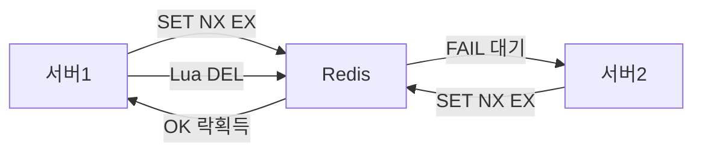

### 왜 Redis인가?

| 특성 | 설명 |
|------|------|
| **싱글 스레드** | 명령어가 순차 실행되므로 race condition 없음 |
| **원자적 명령어** | `SET NX`, `EVAL`(Lua) 등으로 atomic한 락 획득 가능 |
| **TTL 지원** | 락에 만료 시간을 설정하여 데드락 방지 |
| **고성능** | 인메모리 기반으로 지연시간이 매우 낮음 |
| **Pub/Sub** | 락 해제 이벤트를 구독자에게 즉시 전달 가능 |

---

## 2. 기본 구현: SET NX EX

Redis 분산 락의 핵심 명령어다.

```bash
SET resource_lock <unique_value> NX EX 30
```

- `NX` : 키가 존재하지 않을 때만 설정 (Not eXists)
- `EX 30` : 30초 후 자동 만료
- `unique_value` : UUID 등 고유값 — **본인이 건 락만 해제**하기 위함

### 락 획득 ~ 해제 전체 흐름

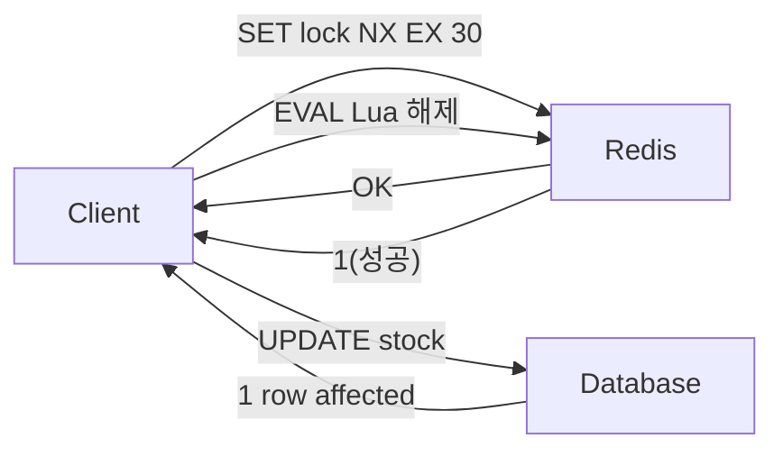

### 락 획득 코드

```java
String lockKey = "order:lock:" + orderId;
String lockValue = UUID.randomUUID().toString();

Boolean acquired = redisTemplate.opsForValue()
    .setIfAbsent(lockKey, lockValue, 30, TimeUnit.SECONDS);

if (Boolean.TRUE.equals(acquired)) {
    try {
        // 임계 영역 로직
        processOrder(orderId);
    } finally {
        // 반드시 Lua로 해제
        releaseLock(lockKey, lockValue);
    }
}
```

### 락 해제 — 반드시 Lua 스크립트로

```java
private void releaseLock(String key, String value) {
    String script =
        "if redis.call('get', KEYS[1]) == ARGV[1] then " +
        "  return redis.call('del', KEYS[1]) " +
        "else " +
        "  return 0 " +
        "end";
    redisTemplate.execute(
        new DefaultRedisScript<>(script, Long.class),
        List.of(key), value
    );
}
```

**왜 Lua인가?**

`GET` → 비교 → `DEL`을 별도로 수행하면, GET과 DEL 사이에 다른 프로세스가 끼어들 수 있다. Lua 스크립트는 Redis에서 **원자적으로** 실행된다.

> **비유**: GET으로 "내 열쇠 맞나 확인" 하고 DEL로 "열쇠 반납" 하는 사이에, 다른 사람이 새 열쇠를 걸어버리면 남의 열쇠를 빼앗게 된다. Lua는 확인과 반납을 하나의 동작으로 묶어준다.

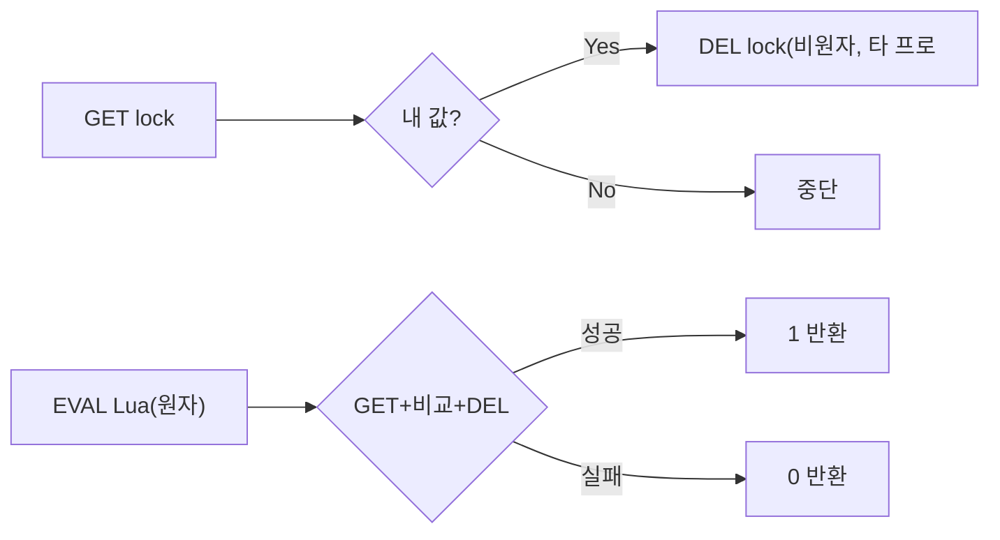

---

## 3. Lettuce 기반 완전 구현

Spring Boot 기본 Redis 클라이언트인 **Lettuce**를 사용한 직접 구현 방식이다.

```java
@Component
public class LettuceDistributedLock {

    private final StringRedisTemplate redisTemplate;

    public LettuceDistributedLock(StringRedisTemplate redisTemplate) {
        this.redisTemplate = redisTemplate;
    }

    /**
     * Step 1: 락 획득 시도
     * @param lockKey   락 키 (예: "order:lock:42")
     * @param lockValue 고유 식별자 (UUID 권장)
     * @param ttlSeconds TTL (초) — 반드시 설정
     * @return 락 획득 성공 여부
     */
    public boolean tryLock(String lockKey, String lockValue, long ttlSeconds) {
        Boolean result = redisTemplate.opsForValue()
            .setIfAbsent(lockKey, lockValue, ttlSeconds, TimeUnit.SECONDS);
        return Boolean.TRUE.equals(result);
    }

    /**
     * Step 2: 락 해제 — Lua 스크립트로 원자 실행
     * GET → 값 비교 → DEL 을 하나의 명령으로 처리
     */
    public boolean releaseLock(String lockKey, String lockValue) {
        String script =
            "if redis.call('get', KEYS[1]) == ARGV[1] then " +
            "  return redis.call('del', KEYS[1]) " +
            "else " +
            "  return 0 " +
            "end";

        Long result = redisTemplate.execute(
            new DefaultRedisScript<>(script, Long.class),
            List.of(lockKey),
            lockValue
        );
        return Long.valueOf(1L).equals(result);
    }

    /**
     * Step 3: 스핀락 방식 재시도 (Lettuce는 Pub/Sub 미지원)
     * @param waitMillis 최대 대기 시간 (ms)
     */
    public boolean tryLockWithRetry(String lockKey, String lockValue,
                                     long ttlSeconds, long waitMillis)
            throws InterruptedException {
        long deadline = System.currentTimeMillis() + waitMillis;

        while (System.currentTimeMillis() < deadline) {
            if (tryLock(lockKey, lockValue, ttlSeconds)) {
                return true;
            }
            // 100ms 대기 후 재시도 — 락 해제 이벤트를 즉시 감지 못하는 단점
            Thread.sleep(100);
        }
        return false;
    }
}
```

### 사용 예시

```java
@Service
public class OrderService {

    private final LettuceDistributedLock lock;

    public void processOrder(Long orderId) {
        String lockKey  = "order:lock:" + orderId;
        String lockValue = UUID.randomUUID().toString();

        boolean acquired = lock.tryLock(lockKey, lockValue, 30);
        if (!acquired) {
            throw new LockAcquisitionException("락 획득 실패: " + orderId);
        }

        try {
            doProcess(orderId);
        } finally {
            lock.releaseLock(lockKey, lockValue);
        }
    }
}
```

### Lettuce 스핀락의 문제점

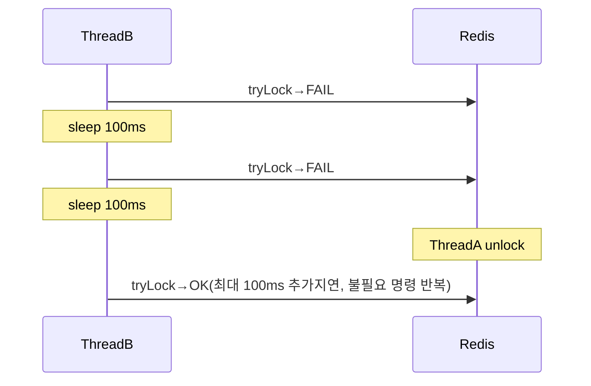

- 불필요한 Redis 명령어 반복 실행 → Redis 부하
- 락 해제 이벤트를 즉시 감지 못해 최대 100ms 추가 지연
- 경쟁 스레드가 많을수록 Redis에 부하 집중

이 문제를 Redisson은 Pub/Sub으로 해결한다.

---

## 4. Redisson 분산 락

**Redisson**은 Redis 기반 Java 클라이언트로, 다양한 분산 동기화 프리미티브를 제공한다. 실무에서는 직접 구현보다 Redisson을 쓰는 것이 안전하다.

### 의존성 추가

```xml
<!-- Maven -->
<dependency>
    <groupId>org.redisson</groupId>
    <artifactId>redisson-spring-boot-starter</artifactId>
    <version>3.27.0</version>
</dependency>
```

```gradle
// Gradle
implementation 'org.redisson:redisson-spring-boot-starter:3.27.0'
```

### 기본 설정

```java
@Configuration
public class RedissonConfig {

    @Bean
    public RedissonClient redissonClient() {
        Config config = new Config();
        config.useSingleServer()
            .setAddress("redis://localhost:6379")
            .setConnectionMinimumIdleSize(1)
            .setConnectionPoolSize(10);
        return Redisson.create(config);
    }
}
```

### RLock — 기본 분산 락

```java
RLock lock = redissonClient.getLock("order:lock:" + orderId);

try {
    // waitTime: 락 대기 최대 시간, leaseTime: 락 보유 최대 시간
    boolean acquired = lock.tryLock(10, 30, TimeUnit.SECONDS);
    if (acquired) {
        processOrder(orderId);
    }
} finally {
    if (lock.isHeldByCurrentThread()) {
        lock.unlock();
    }
}
```

**leaseTime을 생략하면 Watchdog이 자동으로 TTL을 연장한다.**

```java
// leaseTime 생략 → Watchdog 활성화 (기본 30초마다 갱신)
lock.lock(); // 무기한 보유, Watchdog이 TTL 연장
```

---

## 5. Redisson Pub/Sub 기반 대기

Redisson의 가장 큰 장점은 락 대기 방식이다. 스핀락이 아닌 Pub/Sub 이벤트로 대기한다.

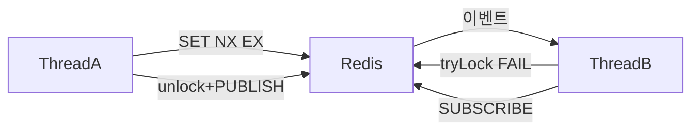

**스핀락 vs Pub/Sub 비교:**

| 항목 | Lettuce (스핀락) | Redisson (Pub/Sub) |
|------|----------------|-------------------|
| 락 해제 감지 | 최대 100ms 지연 | 즉시 |
| 대기 중 Redis 명령 | 반복 발생 | 없음 |
| 경쟁 스레드 증가 시 | Redis 부하 증가 | 부하 일정 |
| 내부 채널 | - | `redisson_lock__channel:{lockKey}` |

---

## 6. Watchdog — TTL 자동 연장

Redisson은 leaseTime을 지정하지 않으면 **Watchdog**을 통해 락 TTL을 자동으로 연장한다.

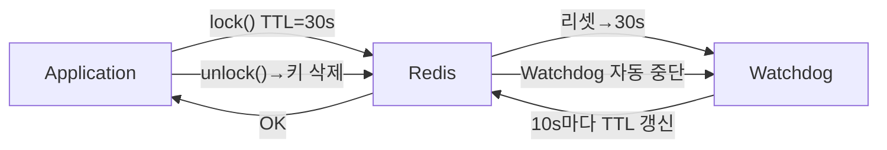

**Watchdog 동작 원리:**
- 기본 TTL: 30초 (`lockWatchdogTimeout`)
- TTL의 1/3 시점마다 갱신 → 즉, 10초마다 30초로 리셋
- 락 해제(`unlock()`) 시 Watchdog 자동 중단

```java
// Watchdog 활성화 (leaseTime 없음)
lock.lock();
lock.tryLock(10, TimeUnit.SECONDS); // waitTime만 지정

// Watchdog 비활성화 (leaseTime 명시)
lock.tryLock(10, 30, TimeUnit.SECONDS); // 30초 후 강제 해제

// Watchdog 타임아웃 커스터마이즈
Config config = new Config();
config.setLockWatchdogTimeout(60000); // 60초
```

**주의:** leaseTime을 명시적으로 설정하면 Watchdog이 비활성화된다. 장시간 작업이라면 leaseTime을 생략해 Watchdog에 맡기는 것이 안전하다.

---

## 7. Redisson 락 종류

### FairLock — 공정 락

락 획득 순서를 **요청 순서대로** 보장한다. 내부적으로 대기 큐를 Redis에 저장한다.

```java
RLock fairLock = redissonClient.getFairLock("fairLock:resource");

try {
    // 먼저 요청한 스레드가 먼저 락을 획득 (starvation 방지)
    fairLock.lock();
    doWork();
} finally {
    fairLock.unlock();
}
```

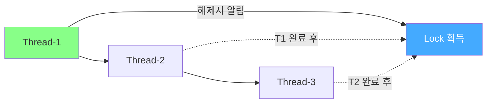

**단점:** 일반 RLock보다 오버헤드가 크고, 처리량이 낮다.

---

### MultiLock — 복수 락 동시 획득

여러 자원에 대한 락을 **하나의 원자적 연산처럼** 획득한다.

```java
RLock lock1 = redissonClient.getLock("lock:accountA"); // 출금 계좌
RLock lock2 = redissonClient.getLock("lock:accountB"); // 입금 계좌

RLock multiLock = redissonClient.getMultiLock(lock1, lock2);

try {
    // Step 1. 두 락을 모두 획득해야 진행
    multiLock.lock();
    // Step 2. 계좌 이체 처리 (데드락 없음)
    transfer(accountA, accountB, amount);
} finally {
    // Step 3. 두 락 동시 해제
    multiLock.unlock();
}
```

**내부 동작:**
1. 모든 락을 순서대로 획득 시도
2. 하나라도 실패하면 이미 획득한 락을 모두 해제 후 재시도
3. 데드락 방지를 위해 랜덤 백오프 적용

**사용 사례:** 계좌 이체 시 출금 계좌 + 입금 계좌 동시 락킹.

---

### ReadWriteLock — 읽기/쓰기 락

여러 스레드의 **동시 읽기를 허용**하고, 쓰기는 배타적으로 처리한다.

```java
RReadWriteLock rwLock = redissonClient.getReadWriteLock("rw:resource");

// Step 1. 읽기 락 — 여러 스레드 동시 획득 가능
RLock readLock = rwLock.readLock();
readLock.lock();
try {
    return readData();
} finally {
    readLock.unlock();
}

// Step 2. 쓰기 락 — 배타적 (다른 읽기/쓰기 없을 때만 획득)
RLock writeLock = rwLock.writeLock();
writeLock.lock();
try {
    writeData();
} finally {
    writeLock.unlock();
}
```

**동작 규칙:**

| 요청 \ 현재 상태 | 읽기 락 보유 | 쓰기 락 보유 |
|-----------------|------------|------------|
| 읽기 락 요청 | 허용 (동시 가능) | 대기 |
| 쓰기 락 요청 | 대기 | 대기 |

---

### Semaphore — 허용 개수 제한

동시에 접근 가능한 **스레드 수를 제한**한다.

```java
RSemaphore semaphore = redissonClient.getSemaphore("semaphore:api");
semaphore.trySetPermits(10); // Step 1. 최대 10개 퍼밋 설정

// Step 2. 퍼밋 획득 (최대 5초 대기)
boolean acquired = semaphore.tryAcquire(1, 5, TimeUnit.SECONDS);
try {
    callExternalApi(); // Step 3. 동시 최대 10개만 실행
} finally {
    semaphore.release(); // Step 4. 퍼밋 반납
}
```

**사용 사례:** 외부 API 동시 호출 수 제한, DB 커넥션 풀 제어.

---

### CountDownLatch — 완료 대기

여러 작업이 **모두 완료될 때까지 대기**하는 분산 카운터다.

```java
RCountDownLatch latch = redissonClient.getCountDownLatch("latch:batch");
latch.trySetCount(3); // Step 1. 3개 작업 완료 대기

// Step 2. 워커 1, 2, 3 각각 완료 시 호출
latch.countDown();

// Step 3. 오케스트레이터 — 3개 모두 완료 시까지 블로킹
latch.await();
```

---

## 8. Lettuce vs Redisson 비교

| 항목 | Lettuce (직접 구현) | Redisson |
|------|-------------------|----------|
| **설정 복잡도** | 낮음 (Spring Boot 기본) | 중간 (추가 의존성) |
| **락 대기 방식** | 스핀락 (폴링) | Pub/Sub (이벤트) |
| **Watchdog** | 없음 (직접 구현 필요) | 내장 자동화 |
| **재진입 지원** | 없음 (직접 구현 필요) | 기본 지원 |
| **락 종류** | SET NX 단일 | RLock, FairLock, MultiLock, RedLock, RW, Semaphore, Latch |
| **Redis 부하** | 스핀락 시 높음 | 이벤트 기반으로 낮음 |
| **TTL 연장** | 직접 구현 필요 | Watchdog 자동 처리 |
| **Redlock** | 직접 구현 필요 | 내장 (`getRedLock`) |
| **코드량** | 많음 | 적음 |
| **적합 환경** | 단순한 락, 최소 의존성 | 복잡한 동기화, 프로덕션 |

> **실무 예시**: 배달의민족 주문 처리 서버가 10대 운영 중이다. 사용자가 주문 버튼을 두 번 눌렀을 때, 두 요청이 서로 다른 서버에 도달해도 Redisson 락 하나로 "첫 번째 요청만 처리"를 보장한다.

---

## 9. Redlock 알고리즘

단일 Redis 인스턴스에 의존하면, 그 노드가 죽으면 락도 사라진다. **Redlock**은 Redis 창시자 Antirez가 제안한 다중 노드 분산 알고리즘이다.

### 동작 방식

1. **N개(보통 5개)의 독립 Redis 마스터**를 준비한다
2. 클라이언트가 **모든 노드에 동시에** 락 획득을 시도한다
3. **과반수(N/2 + 1) 이상** 성공하고, 총 소요 시간이 TTL보다 짧으면 락 획득 성공
4. 실패 시 모든 노드에서 락을 해제한다

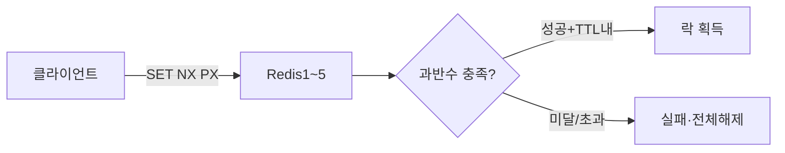

```
Redlock 알고리즘 의사코드:
1. 현재 시각 T1 기록
2. N개 Redis 마스터에 동시에 SET NX PX ttl 시도
3. N/2 + 1 이상 성공하고, 총 소요 시간 < TTL 이면 락 획득 성공
4. 유효 TTL = 초기 TTL - (현재시각 - T1) - 클럭 드리프트 보정값
5. 실패 시 모든 노드에서 락 해제
```

> **비유**: 국회 의결처럼, 5명 중 3명 이상이 찬성해야 법안이 통과된다. 한 명이 결석해도 나머지 4명이 동의하면 유효하다.

### Redisson으로 Redlock 구현

```java
RLock lock1 = redissonClient1.getLock("redlock:key"); // Redis #1
RLock lock2 = redissonClient2.getLock("redlock:key"); // Redis #2
RLock lock3 = redissonClient3.getLock("redlock:key"); // Redis #3
RLock lock4 = redissonClient4.getLock("redlock:key"); // Redis #4
RLock lock5 = redissonClient5.getLock("redlock:key"); // Redis #5

RLock redLock = redissonClient1.getRedLock(lock1, lock2, lock3, lock4, lock5);

try {
    boolean acquired = redLock.tryLock(10, 30, TimeUnit.SECONDS);
    if (acquired) {
        doCriticalWork();
    }
} finally {
    redLock.unlock();
}
```

### Redlock 논쟁

Martin Kleppmann(DDIA 저자)은 Redlock의 안전성에 의문을 제기했다:

- **GC pause**: 락 획득 후 긴 GC가 발생하면, TTL이 만료되어 다른 프로세스가 락을 획득할 수 있다
- **시계 점프**: NTP 동기화로 시스템 시계가 갑자기 뛰면 TTL 계산이 틀어진다

이에 대해 Antirez는 반박했지만, **완벽한 합의에는 이르지 못했다.**

**결론**: 완벽한 분산 합의가 필요하면 ZooKeeper/etcd 같은 CP 시스템 사용.

---


## 극한 시나리오

### 시나리오 1: 락 보유 중 프로세스 크래시

**상황**: 서버 A가 락을 잡고 주문 처리 중에 갑자기 OOM으로 프로세스가 죽었다.

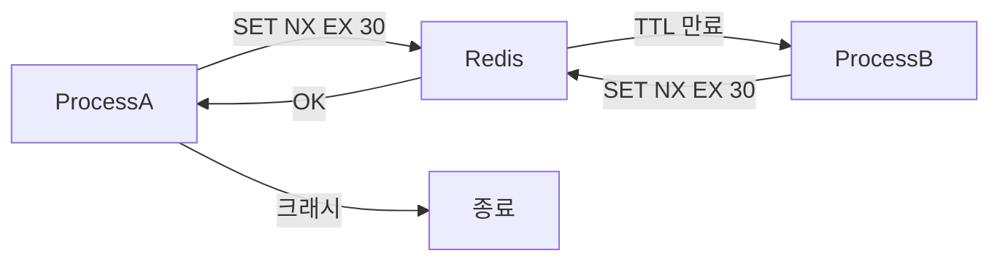

**해결**: TTL이 자동으로 만료시킨다. **TTL이 없으면 영원히 데드락**이다. TTL은 반드시 설정해야 한다.

---

### 시나리오 2: 작업이 TTL보다 오래 걸림

**상황**: 쿠팡 대용량 주문 처리 중 외부 결제 API가 응답을 늦게 줬다. 락 TTL은 30초였는데 작업이 35초 걸렸다.

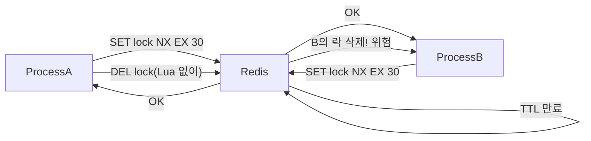

**해결 1**: Lua 스크립트로 `value` 비교 후 삭제 (UUID 확인 후 DEL)

**해결 2**: Watchdog으로 TTL 자동 연장 (Redisson)

**해결 3**: 작업 시작 전 남은 TTL 확인

```java
Long ttl = redisTemplate.getExpire(lockKey, TimeUnit.MILLISECONDS);
if (ttl != null && ttl < MINIMUM_WORK_TIME_MS) {
    throw new LockExpiredException("락 TTL 부족, 작업 포기");
}
```

---

### 시나리오 3: Redis 마스터 장애 + Failover

**상황**: 락을 저장한 Redis 마스터가 갑자기 죽었다. Sentinel이 레플리카를 마스터로 승격시켰다. 그 사이 서버 B가 새 마스터에서 락을 획득했다.

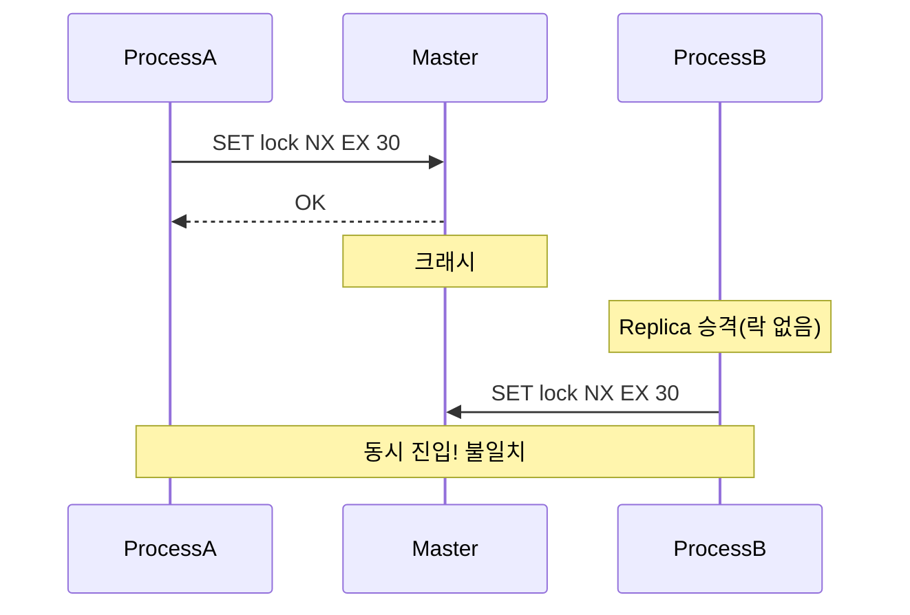

**원인**: Redis 복제는 **비동기**이므로, 마스터가 죽기 전에 복제되지 않은 데이터는 유실된다.

**해결 1**: Redlock 사용 (과반수 기반 — 단일 노드 장애에 내성)

**해결 2**: `WAIT` 명령어로 동기 복제 강제 (성능 저하 감수)

```java
// 락 획득 후 복제 확인
redisTemplate.execute((RedisCallback<Long>) conn ->
    conn.wait(1, 100)); // 레플리카 1개 이상, 100ms 내 동기화 확인
```

**해결 3**: ZooKeeper/etcd 같은 CP 시스템 사용

---

### 시나리오 4: 네트워크 파티션 + Fencing Token

**상황**: 서버 A는 락을 보유하고 작업 중이지만, Redis와 통신이 끊겼다. Watchdog이 TTL을 연장하지 못해 락이 만료됐다. 서버 B가 락을 획득했다.

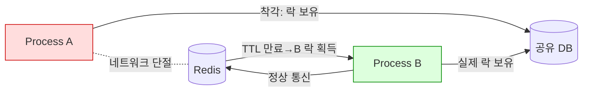

**해결: Fencing Token 패턴**

A는 작업 시작 전 **fencing token**(단조 증가 번호)을 발급받는다. 공유 자원(DB 등)은 fencing token이 현재보다 큰 경우에만 쓰기를 허용한다.

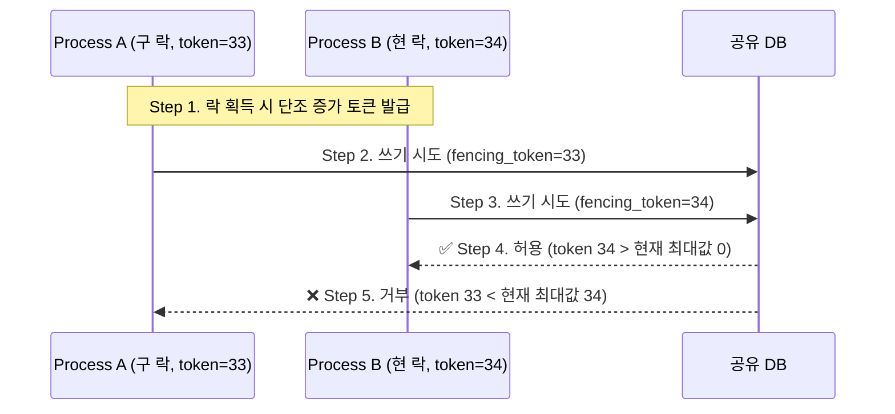

```java
// 락 획득 시 단조 증가 토큰 발급
long fencingToken = redisTemplate.opsForValue()
    .increment("fencing:token:resource");

// 공유 자원(DB)에서 토큰 검증
UPDATE shared_resource
SET data = :data, last_token = :token
WHERE id = :id AND last_token < :token  -- 오래된 토큰이면 무시
```

> **비유**: 병원 대기표와 같다. 33번 대기표를 들고 들어가려는데, 이미 34번 환자가 들어가 있으면 33번은 입장이 거부된다.

---

### 시나리오 5: GC Stop-the-World

**상황**: 대용량 트래픽으로 JVM Full GC가 35초간 발생했다. 락 TTL이 30초였다.

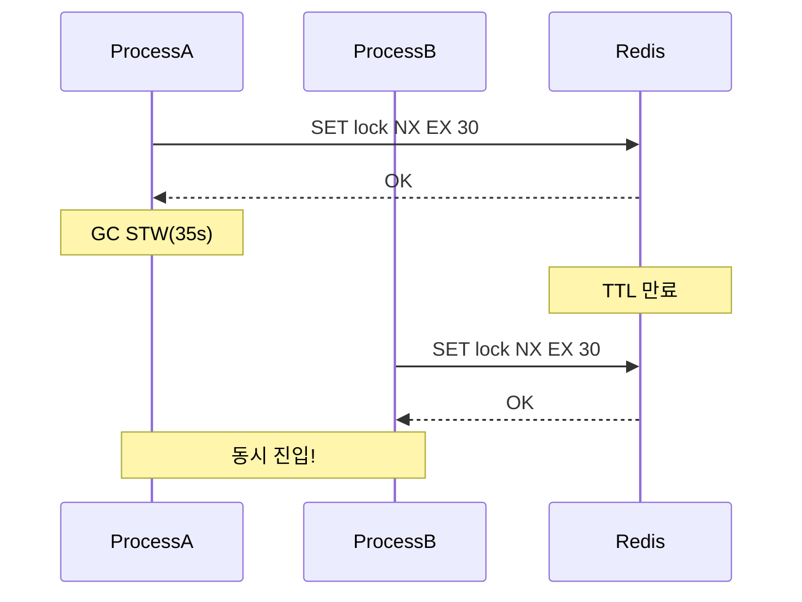

**증상**: GC가 끝난 서버 A가 자신이 여전히 락을 보유하고 있다고 착각하고 작업을 이어간다.

**해결 1**: 락 획득 후 **남은 TTL을 확인**하고, 충분하지 않으면 작업을 포기

**해결 2**: Fencing token 패턴 적용 (DB 레벨 최종 방어)

**해결 3**: G1GC/ZGC 등 STW가 짧은 GC 사용

---
## 11. 전체 선택 가이드

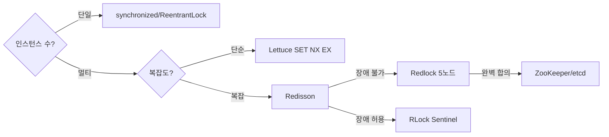

---

## 12. 분산 락 설계 체크리스트

| 항목 | 필수 여부 | 설명 |
|------|-----------|------|
| TTL 설정 | **필수** | 데드락 방지 — 없으면 영구 데드락 |
| unique value + Lua 해제 | **필수** | 남의 락 삭제 방지 |
| 재시도 + 백오프 | 권장 | 일시적 실패 대응 |
| 작업 시간 < TTL 보장 | **필수** | 작업 완료 전 TTL 만료 방지 |
| Watchdog (TTL 연장) | 권장 | 장시간 작업 대응 (Redisson 내장) |
| Fencing token | 강력 권장 | GC pause, 네트워크 파티션 최종 방어선 |
| Redlock (다중 노드) | 고가용성 시 | 단일 장애점 제거 |
| 타임아웃 | **필수** | 락 대기 무한 차단 방지 |
| 멱등성 보장 | **필수** | 락 실패 시에도 안전한 로직 |
| 남은 TTL 확인 | 권장 | GC STW 후 작업 재개 방지 |

---

## 13. 정리

분산 락은 **간단해 보이지만 극한 상황에서 깨지기 쉽다.** 핵심 원칙:

1. **TTL은 반드시** 설정하되, 작업 시간보다 충분히 길게
2. **해제는 반드시 Lua**로 — GET/DEL 분리 금지
3. **Watchdog**은 leaseTime 미지정 시에만 활성화 — Redisson 권장
4. **비동기 복제** 환경에서는 Redlock 또는 fencing token 필수
5. **GC pause, 네트워크 파티션**은 락을 무효화한다 — DB 레벨 fencing token으로 방어
6. **완벽한 분산 락은 없다** — 최종 방어선은 항상 DB 레벨 멱등성

---

## 실무에서 자주 하는 실수

**실수 1: 락 TTL보다 작업 시간이 길어 락 만료 후 중복 실행**
TTL을 3초로 설정했는데 실제 작업이 5초 걸린다. 락이 만료되어 다른 프로세스가 락을 획득하고 두 프로세스가 동시에 임계 구역을 실행한다. Redisson의 watchdog(락 보유 중 자동 TTL 연장)을 사용하거나, 작업 최대 시간 + 여유 시간으로 TTL을 보수적으로 설정한다.

**실수 2: 락 해제 시 자신의 락인지 검증 안 함**
단순 `DEL lock_key`로 해제하면 TTL 만료 후 다른 프로세스가 잡은 락을 실수로 해제한다. 획득 시 고유 UUID를 값으로 저장하고, 해제 시 Lua 스크립트로 값 비교 후 삭제하는 패턴이 필수다.

**실수 3: 단일 Redis 노드에서 Redlock 사용**
Redlock은 독립적인 Redis 노드 5개(권장) 중 과반수에서 락을 획득해야 유효하다. 단일 노드나 Sentinel 구성에서 Redlock을 흉내 내면 의미가 없다. 단일 노드면 단순 SET NX + TTL, 강한 보장이 필요하면 5개 독립 노드 구성이 필요하다.

**실수 4: GC pause/네트워크 지연으로 락 유효성 만료 무시**
JVM GC pause가 수 초 발생하면 락 TTL이 만료된다. 코드는 GC 후 재개되어 락이 유효하다고 착각하고 임계 구역을 실행한다. DB 레벨 fencing token(단조 증가 버전)을 최종 방어선으로 설계해야 한다.

**실수 5: 락 획득 실패 시 무한 재시도**
`while(!tryLock()) { Thread.sleep(10); }` 형태로 무한 루프를 돌린다. 락을 보유한 프로세스가 죽으면 TTL만료까지 모든 스레드가 스핀하며 CPU를 소비한다. 최대 재시도 횟수와 타임아웃을 설정하고 실패 시 빠른 실패(fail-fast) 또는 대기열 방식으로 전환한다.

---

## 면접 포인트

**Q1. Redis 분산 락이 완벽하지 않은 이유는?**
Redis 복제는 비동기다. 마스터가 락을 저장한 직후 장애가 나면 레플리카로 미처 복제되지 않은 상태로 failover가 일어난다. 새 마스터는 그 락을 모르고 다른 클라이언트가 락을 획득할 수 있다. Redlock은 독립 노드 과반수 합의로 이를 완화하지만 완전히 없애지는 못한다.

**Q2. Redlock 알고리즘의 동작 원리는?**
① 5개 독립 Redis 노드에 순차적으로 SET NX PX ttl 시도 ② 과반수(3개 이상) 성공하고 총 소요 시간이 TTL보다 짧으면 락 유효 ③ 실패 시 모든 노드에서 즉시 해제 ④ 락 유효 시간 = TTL - 네트워크 왕복 시간. 단, Martin Kleppmann은 clock skew와 GC pause 문제를 지적했으며 완벽한 보장은 아니다.

**Q3. fencing token이란?**
락 획득 시 단조 증가하는 토큰(버전 번호)을 발급한다. 클라이언트는 리소스에 접근할 때 토큰을 함께 전달하고, 리소스 서버는 이전에 본 토큰보다 큰 것만 허용한다. GC pause로 락이 만료됐다 재획득된 다른 클라이언트의 오래된 토큰을 거부할 수 있다.

**Q4. Redisson의 watchdog은 어떻게 동작하는가?**
락 획득 시 별도 스레드(watchdog)가 30초(기본) 간격으로 TTL을 연장한다. 락을 보유한 JVM이 죽으면 watchdog도 멈춰 TTL이 자연스럽게 만료된다. TTL을 명시적으로 지정하면 watchdog이 비활성화된다.

**Q5. 분산 락 대신 DB 수준 제어로 해결할 수 있는 경우는?**
재고 차감: `UPDATE stock = stock - 1 WHERE id = ? AND stock > 0` (원자적 조건부 업데이트). 중복 요청 방지: DB UNIQUE 제약 + 멱등성 키. 분산 락은 "읽고 → 외부 API 호출 → 쓰기" 같이 DB 단일 쿼리로 처리할 수 없는 복합 작업에서만 필요하다.

---
## 극한 시나리오

### 시나리오 1: 결제 중복 방지 — 네트워크 단절 후 재시도

사용자가 결제 버튼을 클릭했는데 응답이 없어 한 번 더 클릭합니다. 서버는 두 요청을 동시에 받습니다.

**락 없는 경우:**
```
요청1: SELECT balance → 100,000원 확인 → 차감 시작
요청2: SELECT balance → 100,000원 확인 → 차감 시작  (요청1 커밋 전)
결과: 100,000원짜리 결제가 두 번 실행 → 200,000원 이중 차감
```

**Redis 분산 락 적용:**
```java
@Service
@RequiredArgsConstructor
public class PaymentService {
    private final RedissonClient redissonClient;
    private final PaymentRepository paymentRepository;

    public PaymentResult processPayment(String orderId, BigDecimal amount) {
        String lockKey = "payment:lock:" + orderId;
        RLock lock = redissonClient.getLock(lockKey);

        try {
            // 3초 대기, 10초 후 자동 해제 (Watchdog가 연장)
            if (!lock.tryLock(3, 10, TimeUnit.SECONDS)) {
                throw new PaymentInProgressException("결제가 이미 진행 중입니다.");
            }
            // 멱등성 체크: 이미 처리된 주문인지 확인
            if (paymentRepository.existsByOrderId(orderId)) {
                return paymentRepository.findByOrderId(orderId);
            }
            return executePayment(orderId, amount);
        } catch (InterruptedException e) {
            Thread.currentThread().interrupt();
            throw new PaymentException("결제 처리 중 인터럽트 발생");
        } finally {
            if (lock.isHeldByCurrentThread()) {
                lock.unlock();
            }
        }
    }
}
```

**수치:** Redis 락 획득 레이턴시 < 1ms. DB Lock 대비 10~50배 빠름. 10만 TPS 환경에서 충돌 없이 처리 가능.

### 시나리오 2: 재고 선점 — 플래시 세일 1만 명 동시 접근

1만 개 재고에 10만 명이 동시 접근. 각 사용자가 재고를 "선점(Reserve)"하는 5초 동안 다른 사용자는 해당 재고를 가져갈 수 없어야 합니다.

```java
// 선점 락: 사용자별로 특정 재고 아이템을 잠금
public boolean reserveItem(Long itemId, Long userId) {
    String lockKey = "item:reserve:" + itemId;
    RLock lock = redissonClient.getLock(lockKey);

    try {
        // 즉시 획득 실패 시 대기 없이 반환 (재고 없음 응답)
        if (!lock.tryLock(0, 5, TimeUnit.SECONDS)) {
            return false;  // 다른 사용자가 선점 중
        }
        // 5초 내 결제 완료 필요, 미완료 시 TTL 만료로 자동 해제
        reservationCache.put(itemId, userId);
        return true;
    } catch (InterruptedException e) {
        Thread.currentThread().interrupt();
        return false;
    }
    // 주의: unlock을 여기서 하지 않음 (결제 완료 시 해제)
}

public void completePayment(Long itemId, Long userId) {
    String lockKey = "item:reserve:" + itemId;
    RLock lock = redissonClient.getLock(lockKey);
    // 결제 완료 후 락 해제
    if (lock.isHeldByCurrentThread()) {
        lock.unlock();
    }
}
```

### 시나리오 3: Redis 노드 장애 시 락이 유실되면?

**문제:** 락을 획득한 직후 Redis 마스터가 다운되면, Sentinel이 레플리카를 마스터로 승격합니다. 새 마스터는 락 정보가 없으므로 다른 프로세스가 같은 락을 획득합니다. 두 프로세스가 동시에 임계 구역을 실행합니다.

**Redlock 알고리즘 (N=5 독립 Redis 노드):**
```java
// Redisson MultiLock으로 5개 노드 중 3개 이상 획득 시 유효
RLock lock1 = redisson1.getLock("payment:lock:" + orderId);
RLock lock2 = redisson2.getLock("payment:lock:" + orderId);
RLock lock3 = redisson3.getLock("payment:lock:" + orderId);
RLock lock4 = redisson4.getLock("payment:lock:" + orderId);
RLock lock5 = redisson5.getLock("payment:lock:" + orderId);

RLock multiLock = redissonClient.getMultiLock(lock1, lock2, lock3, lock4, lock5);
multiLock.lock();
// 5개 노드 중 3개 이상에 락이 기록되므로
// 하나의 노드 장애로는 락 유실 없음
```

**실무 적용 기준:** 결제·재고처럼 중복 실행이 금전적 손해로 이어지는 경우 Redlock 도입. 일반 중복 방지(알림 중복 발송 등)는 단일 노드 락 + 멱등성 DB 체크 조합으로 충분합니다.
