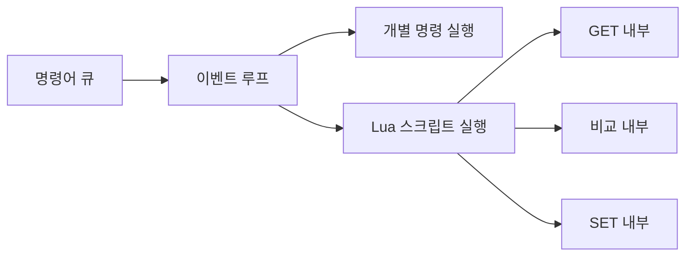
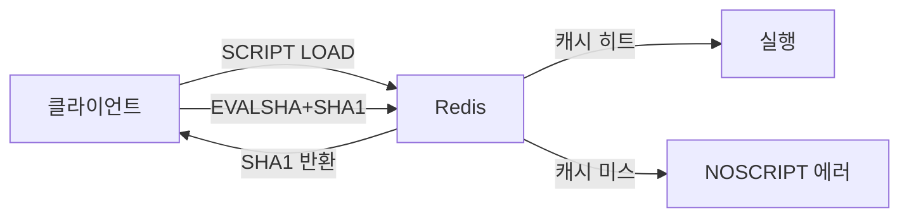
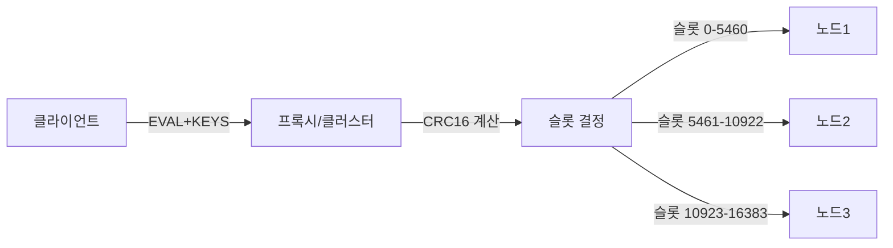
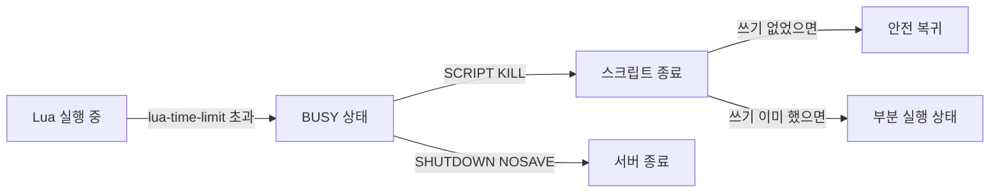
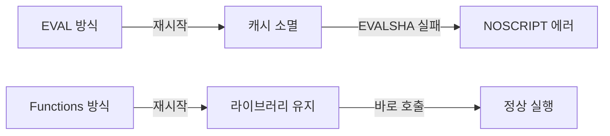

재고 감소 로직을 떠올려보자. `GET`으로 재고를 읽고, 0보다 크면 `DECR`로 줄인다. 코드로만 보면 아무 문제가 없다. 그런데 `GET`과 `DECR` 사이 **0.05밀리초의 틈**에 다른 스레드가 끼어들면 재고가 -1이 된다. 초당 5만 건이 몰리는 플래시 세일에서는 이 틈이 수백 번 열린다. Lua 스크립트는 이 틈 자체를 없앤다 — Redis 내부 이벤트 루프가 스크립트 전체를 하나의 명령처럼 처리하기 때문이다.

## 왜 Redis에 Lua인가 — 내부 메커니즘부터

> **비유**: 은행 창구 직원이 "잔액 확인 → 출금" 두 단계를 처리할 때, 고객이 직접 잔액 확인 후 자리로 돌아갔다가 출금하러 다시 오는 방식(클라이언트 측 조합)은 그 사이에 다른 고객이 통장을 비워버릴 수 있다. 직원(Redis 서버)이 두 단계를 내부에서 한 자리에서 처리하면 끼어들 틈이 없다. Lua 스크립트는 이 "내부 처리"를 의미한다.

### Redis 싱글 스레드 이벤트 루프

Redis는 **단일 이벤트 루프(single-threaded event loop)**로 클라이언트 명령을 처리한다. 명령어 큐에서 하나씩 꺼내어 실행하고, 실행이 끝나야 다음 명령을 꺼낸다.



Lua 스크립트가 이벤트 루프에 진입하는 순간, 스크립트 내부의 모든 Redis 호출(`redis.call`)은 이벤트 루프를 **재진입하지 않는다**. 이미 루프가 점유된 상태이기 때문이다. 스크립트가 끝나야 루프가 다음 명령을 처리한다.

이것이 **원자성의 정확한 메커니즘**이다: 운영체제 레벨 락이나 뮤텍스가 아니라, 이벤트 루프 자체의 단일 진입점 구조가 동시성 문제를 원천 차단한다.

### Race Condition이 발생하는 상황

```
[스레드 A]  GET stock:1001  →  10 (재고 확인)
[스레드 B]  GET stock:1001  →  10 (0.03ms 차이로 끼어듦)
[스레드 A]  SET stock:1001   9  (차감)
[스레드 B]  SET stock:1001   9  (차감 — 10이었던 값을 기준으로 계산, 중복!)
결과: 실제로 2건 판매됐으나 재고는 1만 줄어든 상태 → 초과 판매
```

이 패턴이 초당 수만 건에서 발생하면 **수십만 원 손해가 수백 번** 발생한다.

### 개별 명령어는 원자적이지만 조합은 아니다

`INCR`은 `GET → 증가 → SET`을 내부에서 한 번에 처리하므로 원자적이다. 문제는 두 명령을 **조합**할 때다. `GET`과 `DECR` 사이에 이벤트 루프가 다른 클라이언트 명령을 처리할 수 있다. Lua 스크립트는 이 "사이"를 없앤다.

---

## EVAL vs EVALSHA — SHA1 캐싱 메커니즘

### EVAL의 구조

```
EVAL script numkeys [key ...] [arg ...]
```

`EVAL`은 매 호출마다 스크립트 전문(全文)을 네트워크로 전송한다. Redis 서버는 수신한 스크립트를 Lua VM으로 컴파일하고 실행한다. 컴파일 결과는 SHA1 해시를 키로 내부 캐시에 저장된다.

```java
// Spring Data Redis에서 EVAL
String script = "return redis.call('get', KEYS[1])";

DefaultRedisScript<String> redisScript = new DefaultRedisScript<>(script, String.class);
String result = redisTemplate.execute(
    redisScript,
    List.of("mykey")   // KEYS[1]
);
```

### EVALSHA — 왜 네트워크 절약이 되는가

스크립트 본문 대신 SHA1 해시(40바이트 고정)만 전송한다. 스크립트가 500바이트라면 매 호출마다 **460바이트 절약**이다. 초당 10만 건이면 초당 **46MB 절약**이다.

```
SCRIPT LOAD "스크립트 전문..."  →  "abc123def456..."  (SHA1 반환)
EVALSHA abc123def456... 1 mykey  →  실행 결과
```



### NOSCRIPT 폴백 — DefaultRedisScript의 자동 처리

Redis가 재시작되면 스크립트 캐시가 초기화된다. 이 상황에서 `EVALSHA`를 호출하면 `NOSCRIPT` 에러가 반환된다. 직접 구현하면 반드시 폴백 처리가 필요하다.

`DefaultRedisScript`는 이를 내부적으로 자동 처리한다:

```java
// DefaultRedisScript 내부 동작 흐름 (의사코드)
// 1단계: EVALSHA 시도
// 2단계: NOSCRIPT 에러 수신 → EVAL로 폴백 (스크립트 서버에 캐시됨)
// 3단계: 이후 호출은 EVALSHA로 캐시 히트

@Bean
public DefaultRedisScript<Long> inventoryScript() {
    DefaultRedisScript<Long> script = new DefaultRedisScript<>();
    script.setScriptSource(
        new ResourceScriptSource(new ClassPathResource("scripts/inventory.lua"))
    );
    script.setResultType(Long.class);
    return script;  // SHA1은 첫 실행 시 자동 계산 및 캐시
}
```

Lua 파일을 `src/main/resources/scripts/`에 두면 코드 가독성과 유지보수성이 높아진다.

### 직접 EVALSHA 구현 시 NOSCRIPT 처리

```java
@Service
public class LuaScriptService {

    private final StringRedisTemplate redisTemplate;
    private volatile String cachedSha;

    public Long executeWithFallback(String script, List<String> keys, Object... args) {
        if (cachedSha == null) {
            synchronized (this) {
                if (cachedSha == null) {
                    cachedSha = redisTemplate.execute(
                        (RedisCallback<String>) conn ->
                            conn.scriptingCommands().scriptLoad(script.getBytes())
                    );
                }
            }
        }
        try {
            return redisTemplate.execute(
                (RedisCallback<Long>) conn ->
                    conn.scriptingCommands().evalSha(
                        cachedSha, ReturnType.INTEGER,
                        keys.size(),
                        keysAndArgs(keys, args)
                    )
            );
        } catch (RedisSystemException e) {
            if (isNoscriptError(e)) {
                // 캐시 무효화 후 EVAL로 폴백
                cachedSha = null;
                return executeWithFallback(script, keys, args);
            }
            throw e;
        }
    }

    private boolean isNoscriptError(RedisSystemException e) {
        return e.getMessage() != null && e.getMessage().contains("NOSCRIPT");
    }
}
```

`DefaultRedisScript`를 쓰면 위 코드가 불필요하다. 직접 구현이 필요한 경우에만 위 패턴을 적용한다.

---

## KEYS vs ARGV — 왜 구분이 존재하는가

### Redis Cluster 슬롯 라우팅

Redis Cluster는 16384개의 슬롯(slot)으로 키 공간을 분할한다. 클라이언트가 명령을 보내면 **키의 CRC16 해시로 슬롯을 계산**하여 해당 슬롯을 담당하는 노드로 요청을 라우팅한다.

`EVAL` 명령에서 `KEYS` 배열은 스크립트가 접근하는 Redis 키 목록이다. **클러스터는 KEYS 배열을 보고 어느 노드로 라우팅할지 결정**한다.



### ARGV에 키를 숨기면 생기는 문제

```lua
-- 잘못된 패턴: 키를 ARGV에 전달
local key = ARGV[1]  -- 클러스터는 이 키를 모른다
local val = redis.call('get', key)
```

클러스터는 스크립트 본문을 파싱하지 않는다. `KEYS` 배열만 검사한다. `ARGV`에 키를 넣으면 클러스터가 잘못된 노드로 라우팅하여 **MOVED 에러 또는 데이터 불일치**가 발생한다.

```lua
-- 올바른 패턴: 접근하는 모든 키는 KEYS에 선언
-- EVAL script 2 stock:1001 issued:1001 user:999
local stockKey  = KEYS[1]   -- CRC16으로 슬롯 계산됨
local issuedKey = KEYS[2]   -- CRC16으로 슬롯 계산됨
local userId    = ARGV[1]   -- 값이므로 ARGV (슬롯 계산 불필요)
local quantity  = ARGV[2]   -- 값이므로 ARGV
```

### Java에서 KEYS/ARGV 전달

```java
redisTemplate.execute(
    script,
    List.of("stock:1001", "issued:1001"),  // KEYS — 순서대로 KEYS[1], KEYS[2]
    "user:999",                             // ARGV[1]
    "3"                                     // ARGV[2]
);
```

`execute` 메서드의 세 번째 인자부터가 `ARGV`다. `List.of()`가 `KEYS`다.

---

## 스크립트 원자성의 한계 — lua-time-limit와 SCRIPT KILL

### 스크립트가 너무 오래 실행되면

Lua 스크립트는 이벤트 루프를 점유한다. 무한 루프나 복잡한 연산이 포함된 스크립트가 실행되면 **그 시간 동안 Redis 전체가 응답 불가** 상태가 된다.

Redis는 이를 방어하기 위해 `lua-time-limit`(기본값: 5000ms)를 제공한다.

```
# redis.conf
lua-time-limit 5000   # ms 단위, 기본 5초
```

`lua-time-limit`를 초과하면 Redis는 **BUSY 상태**로 전환된다. 이 상태에서는 두 명령만 수신한다:

- `SCRIPT KILL` — 현재 실행 중인 스크립트를 강제 종료
- `SHUTDOWN NOSAVE` — 데이터 저장 없이 즉시 종료



### SCRIPT KILL이 불가한 경우

스크립트가 **이미 쓰기 작업을 수행한 후** `SCRIPT KILL`을 실행하면 Redis는 이를 거부한다. 부분 실행된 상태로 종료하면 데이터 정합성이 깨지기 때문이다.

```bash
redis-cli SCRIPT KILL
# 쓰기 수행 후면: (error) UNKILLABLE Script being executed...
# 이 경우 SHUTDOWN NOSAVE 만이 옵션이다 (데이터 손실 감수)
```

### 실전 방어: 루프에 상한 설정

```lua
-- 위험한 패턴: 조건이 맞지 않으면 무한 루프
local i = 0
while redis.call('llen', KEYS[1]) > 0 do
    redis.call('lpop', KEYS[1])  -- 오류 시 무한 루프 가능
end

-- 안전한 패턴: 상한 설정
local MAX_ITER = 1000
local i = 0
while redis.call('llen', KEYS[1]) > 0 and i < MAX_ITER do
    redis.call('lpop', KEYS[1])
    i = i + 1
end
return i  -- 처리된 항목 수 반환
```

---

## Redis Cluster + Lua — 해시 태그 패턴

### 클러스터에서 Lua가 까다로운 이유

Redis Cluster에서 Lua 스크립트는 **단일 노드에서 실행**된다. 스크립트가 접근하는 모든 `KEYS`가 동일한 슬롯(= 동일한 노드)에 있어야 한다. 그렇지 않으면:

```
(error) CROSSSLOT Keys in request don't hash to the same slot
```

### 해시 태그로 동일 슬롯 강제

키 이름에 `{tag}` 형식의 해시 태그를 포함하면, Redis는 전체 키가 아닌 **중괄호 안의 문자열만으로 CRC16을 계산**한다. 같은 태그를 가진 키는 항상 같은 슬롯에 배치된다.

```
coupon:stock:A001   → CRC16("coupon:stock:A001") → 슬롯 X
coupon:issued:A001  → CRC16("coupon:issued:A001") → 슬롯 Y (다를 수 있음)

{A001}:coupon:stock   → CRC16("A001") → 슬롯 Z
{A001}:coupon:issued  → CRC16("A001") → 슬롯 Z (항상 동일)
```

```java
// 해시 태그 적용 예시
public CouponIssueResult issueCoupon(String couponId, Long userId) {
    // 해시 태그 {couponId}로 두 키를 같은 슬롯에 배치
    String stockKey  = "{" + couponId + "}:coupon:stock";
    String issuedKey = "{" + couponId + "}:coupon:issued";

    Long result = redisTemplate.execute(
        ISSUE_COUPON_SCRIPT,
        List.of(stockKey, issuedKey),  // 두 키 모두 같은 슬롯
        userId.toString()
    );
    return mapResult(result);
}
```

### 해시 태그 설계 원칙

| 시나리오 | 잘못된 키 | 올바른 키 |
|---------|---------|---------|
| 쿠폰 재고 + 발급자 | `coupon:stock:C001`, `coupon:issued:C001` | `{C001}:stock`, `{C001}:issued` |
| 사용자 세션 + 토큰 | `session:U123`, `token:U123` | `{U123}:session`, `{U123}:token` |
| 상품 재고 + 예약 | `inventory:P456`, `reserved:P456` | `{P456}:inventory`, `{P456}:reserved` |

해시 태그의 입도(granularity)가 너무 넓으면 특정 노드에 과부하가 집중된다. 예를 들어 모든 키에 `{app}`을 붙이면 단일 슬롯으로 쏠린다. **비즈니스 엔티티 ID를 태그**로 사용하는 것이 적절하다.

---

## 실무 패턴 — Java/Spring 완전 구현

### 1. 분산 락 해제 — 내 락만 안전하게 해제

락을 획득할 때 UUID를 값으로 저장하고, 해제 시 UUID가 일치할 때만 삭제한다. `GET → 비교 → DEL` 세 단계를 원자적으로 처리해야 "다른 사람의 락을 실수로 해제하는" 사고를 막는다.

**왜 Lua가 필요한가**: `GET`으로 확인한 후 `DEL` 사이에 락이 만료되고 다른 클라이언트가 새 락을 획득할 수 있다. 그 상태에서 `DEL`을 실행하면 다른 클라이언트의 락이 삭제된다.

```lua
-- scripts/release-lock.lua
-- KEYS[1] = 락 키
-- ARGV[1] = 내 UUID
if redis.call('get', KEYS[1]) == ARGV[1] then
    return redis.call('del', KEYS[1])
else
    return 0
end
```

```java
@Component
public class DistributedLockService {

    private final StringRedisTemplate redisTemplate;

    private static final DefaultRedisScript<Long> RELEASE_LOCK_SCRIPT;

    static {
        RELEASE_LOCK_SCRIPT = new DefaultRedisScript<>();
        RELEASE_LOCK_SCRIPT.setScriptSource(
            new ResourceScriptSource(new ClassPathResource("scripts/release-lock.lua"))
        );
        RELEASE_LOCK_SCRIPT.setResultType(Long.class);
    }

    /**
     * 락 획득: SET NX PX 로 UUID 값과 함께 TTL 설정
     * Lua 스크립트 없이도 SET NX PX 는 원자적
     */
    public Optional<String> acquireLock(String resource, long ttlMs) {
        String lockKey = "lock:" + resource;
        String uuid    = UUID.randomUUID().toString();

        Boolean acquired = redisTemplate.opsForValue()
            .setIfAbsent(lockKey, uuid, Duration.ofMillis(ttlMs));

        return Boolean.TRUE.equals(acquired) ? Optional.of(uuid) : Optional.empty();
    }

    /**
     * 락 해제: Lua 스크립트로 원자적 비교-삭제
     * 내 UUID와 일치할 때만 DEL 수행
     */
    public boolean releaseLock(String resource, String uuid) {
        String lockKey = "lock:" + resource;
        Long result = redisTemplate.execute(
            RELEASE_LOCK_SCRIPT,
            List.of(lockKey),
            uuid
        );
        return Long.valueOf(1L).equals(result);
    }
}
```

### 2. 원자적 재고 차감 — 초과 판매 방지

**왜 Lua가 필요한가**: `GET`으로 재고를 확인하고 충분하면 `DECRBY`로 차감하는 두 단계 사이에, 다른 요청이 동일한 재고를 `GET`하고 먼저 `DECRBY`할 수 있다. 두 요청 모두 재고가 있다고 판단하여 초과 차감이 발생한다.

```lua
-- scripts/decrement-stock.lua
-- KEYS[1] = stock:{productId}
-- ARGV[1] = 차감 수량
local current = tonumber(redis.call('get', KEYS[1]))

if current == nil then
    return -1   -- 상품 없음 (키 자체가 없음)
end

local qty = tonumber(ARGV[1])
if current < qty then
    return -2   -- 재고 부족
end

-- 이 시점이 지나면 차감은 반드시 실행됨 (원자성 보장)
return redis.call('decrby', KEYS[1], qty)  -- 남은 재고 반환
```

```java
@Service
public class InventoryService {

    private final StringRedisTemplate redisTemplate;

    private static final DefaultRedisScript<Long> DECREMENT_STOCK_SCRIPT;

    static {
        DECREMENT_STOCK_SCRIPT = new DefaultRedisScript<>();
        DECREMENT_STOCK_SCRIPT.setScriptSource(
            new ResourceScriptSource(new ClassPathResource("scripts/decrement-stock.lua"))
        );
        DECREMENT_STOCK_SCRIPT.setResultType(Long.class);
    }

    public int decrementStock(Long productId, int quantity) {
        String key = "stock:" + productId;

        Long result = redisTemplate.execute(
            DECREMENT_STOCK_SCRIPT,
            List.of(key),
            String.valueOf(quantity)
        );

        if (result == null || result == -1L) {
            throw new ProductNotFoundException("Product not found: " + productId);
        }
        if (result == -2L) {
            throw new InsufficientStockException(
                "Insufficient stock for product: " + productId
            );
        }
        return result.intValue();  // 차감 후 남은 재고
    }

    /**
     * 재고 초기화: 상품 등록 또는 재입고 시
     */
    public void initStock(Long productId, int quantity) {
        redisTemplate.opsForValue().set(
            "stock:" + productId,
            String.valueOf(quantity)
        );
    }
}
```

### 3. 슬라이딩 윈도우 Rate Limiter

**왜 Lua가 필요한가**: `ZREMRANGEBYSCORE → ZCARD → ZADD` 세 단계 사이에 다른 요청이 끼어들면 카운트가 부정확해진다. 두 요청이 동시에 한도 미만임을 확인하고 둘 다 `ZADD`를 실행하면 실제로 한도를 초과한다.

```lua
-- scripts/rate-limit.lua
-- KEYS[1] = ratelimit:{userId}
-- ARGV[1] = 현재 timestamp (ms)
-- ARGV[2] = 윈도우 크기 (ms)
-- ARGV[3] = 최대 요청 수
local key    = KEYS[1]
local now    = tonumber(ARGV[1])
local window = tonumber(ARGV[2])
local limit  = tonumber(ARGV[3])

-- 윈도우 밖의 오래된 기록 제거
redis.call('zremrangebyscore', key, 0, now - window)

-- 현재 윈도우 내 요청 수 확인
local count = tonumber(redis.call('zcard', key))

if count >= limit then
    return -1  -- 한도 초과 (남은 허용 수: 0)
end

-- 현재 요청 기록: score=timestamp, member=timestamp+랜덤(중복 방지)
-- math.random 금지 이유: 복제 시 마스터/레플리카 불일치
-- 대신 redis.call('time')으로 마이크로초 타임스탬프 활용
local time_result = redis.call('time')
local unique_member = now .. ':' .. time_result[2]  -- ms + 마이크로초
redis.call('zadd', key, now, unique_member)
redis.call('pexpire', key, window)

return limit - count - 1  -- 남은 허용 횟수
```

```java
@Component
public class SlidingWindowRateLimiter {

    private final StringRedisTemplate redisTemplate;

    private static final DefaultRedisScript<Long> RATE_LIMIT_SCRIPT;

    static {
        RATE_LIMIT_SCRIPT = new DefaultRedisScript<>();
        RATE_LIMIT_SCRIPT.setScriptSource(
            new ResourceScriptSource(new ClassPathResource("scripts/rate-limit.lua"))
        );
        RATE_LIMIT_SCRIPT.setResultType(Long.class);
    }

    /**
     * @return 남은 허용 횟수 (0 이상이면 허용, -1이면 거부)
     */
    public RateLimitResult checkLimit(String userId, long windowMs, long limit) {
        String key = "ratelimit:" + userId;
        long now   = System.currentTimeMillis();

        Long remaining = redisTemplate.execute(
            RATE_LIMIT_SCRIPT,
            List.of(key),
            String.valueOf(now),
            String.valueOf(windowMs),
            String.valueOf(limit)
        );

        if (remaining == null || remaining < 0) {
            return RateLimitResult.denied();
        }
        return RateLimitResult.allowed(remaining);
    }
}

// HTTP 레이어에서 사용
@RestController
public class ApiController {

    private final SlidingWindowRateLimiter rateLimiter;

    @GetMapping("/api/products")
    public ResponseEntity<?> getProducts(
            @RequestHeader("X-User-Id") String userId) {
        RateLimitResult result = rateLimiter.checkLimit(userId, 60_000L, 100L);
        if (!result.isAllowed()) {
            return ResponseEntity.status(429)
                .header("X-RateLimit-Remaining", "0")
                .build();
        }
        // 실제 처리...
        return ResponseEntity.ok()
            .header("X-RateLimit-Remaining",
                    String.valueOf(result.getRemaining()))
            .body(/* products */null);
    }
}
```

### 4. Compare-And-Swap (낙관적 락)

**왜 Lua가 필요한가**: `GET → 비교 → SET` 사이에 다른 클라이언트가 값을 변경하면, 내가 읽었던 "예상 값"을 기준으로 SET을 실행하게 된다. 즉, 다른 클라이언트의 변경을 덮어쓴다. 이것이 Lost Update 문제다.

```lua
-- scripts/compare-and-swap.lua
-- KEYS[1] = 키
-- ARGV[1] = 예상 현재 값 (내가 마지막으로 읽은 값)
-- ARGV[2] = 새 값
-- ARGV[3] = TTL (선택적, 0이면 TTL 설정 안 함)
local current = redis.call('get', KEYS[1])

if current == false then
    return -1   -- 키가 존재하지 않음
end

if current ~= ARGV[1] then
    return 0    -- 값이 변경됨 (CAS 실패)
end

redis.call('set', KEYS[1], ARGV[2])

local ttl = tonumber(ARGV[3])
if ttl > 0 then
    redis.call('expire', KEYS[1], ttl)
end

return 1  -- 성공
```

```java
@Service
public class OptimisticLockService {

    private final StringRedisTemplate redisTemplate;
    private static final DefaultRedisScript<Long> CAS_SCRIPT;

    static {
        CAS_SCRIPT = new DefaultRedisScript<>();
        CAS_SCRIPT.setScriptSource(
            new ResourceScriptSource(new ClassPathResource("scripts/compare-and-swap.lua"))
        );
        CAS_SCRIPT.setResultType(Long.class);
    }

    public enum CasResult { SUCCESS, NOT_FOUND, CONFLICT }

    public CasResult compareAndSwap(String key, String expected,
                                    String newValue, long ttlSeconds) {
        Long result = redisTemplate.execute(
            CAS_SCRIPT,
            List.of(key),
            expected,
            newValue,
            String.valueOf(ttlSeconds)
        );

        if (Long.valueOf(1L).equals(result))  return CasResult.SUCCESS;
        if (Long.valueOf(-1L).equals(result)) return CasResult.NOT_FOUND;
        return CasResult.CONFLICT;
    }

    /**
     * 재시도 포함 CAS: 최대 retries회 시도
     */
    public boolean compareAndSwapWithRetry(String key, String expected,
                                           String newValue, long ttlSeconds,
                                           int retries) {
        for (int i = 0; i < retries; i++) {
            CasResult result = compareAndSwap(key, expected, newValue, ttlSeconds);
            if (result == CasResult.SUCCESS)   return true;
            if (result == CasResult.NOT_FOUND) return false;
            // CONFLICT: 현재 값을 다시 읽어 expected 갱신
            expected = redisTemplate.opsForValue().get(key);
            if (expected == null) return false;
        }
        return false;
    }
}
```

### 5. 원자적 쿠폰 발급 — 재고 차감 + 중복 방지

```lua
-- scripts/issue-coupon.lua
-- KEYS[1] = {couponId}:stock    (재고 카운터)
-- KEYS[2] = {couponId}:issued   (발급자 Set)
-- ARGV[1] = userId
local stock = tonumber(redis.call('get', KEYS[1]))

if stock == nil or stock <= 0 then
    return 0   -- 재고 소진
end

local already = redis.call('sismember', KEYS[2], ARGV[1])
if already == 1 then
    return -1  -- 중복 발급
end

redis.call('decr', KEYS[1])
redis.call('sadd', KEYS[2], ARGV[1])

return stock - 1  -- 남은 재고
```

```java
@Service
public class CouponService {

    private final StringRedisTemplate redisTemplate;
    private static final DefaultRedisScript<Long> ISSUE_COUPON_SCRIPT;

    static {
        ISSUE_COUPON_SCRIPT = new DefaultRedisScript<>();
        ISSUE_COUPON_SCRIPT.setScriptSource(
            new ResourceScriptSource(new ClassPathResource("scripts/issue-coupon.lua"))
        );
        ISSUE_COUPON_SCRIPT.setResultType(Long.class);
    }

    public CouponIssueResult issueCoupon(String couponId, Long userId) {
        // 클러스터 환경: 해시 태그로 두 키를 같은 슬롯에 배치
        String stockKey  = "{" + couponId + "}:stock";
        String issuedKey = "{" + couponId + "}:issued";

        Long result = redisTemplate.execute(
            ISSUE_COUPON_SCRIPT,
            List.of(stockKey, issuedKey),
            userId.toString()
        );

        if (result == null || result == 0L) return CouponIssueResult.SOLD_OUT;
        if (result == -1L)                  return CouponIssueResult.ALREADY_ISSUED;

        // Redis 처리 성공 → DB에 비동기 기록 (Kafka)
        eventPublisher.publishEvent(new CouponIssuedEvent(couponId, userId));
        return CouponIssueResult.SUCCESS;
    }
}
```

---

## Lua 문법 — Redis에서 필요한 핵심

### 변수와 타입

```lua
-- local 필수: 전역 변수는 다음 스크립트 실행에도 남아 데이터 오염을 일으킨다
local key      = KEYS[1]
local userId   = ARGV[1]
local quantity = tonumber(ARGV[2])  -- Redis는 모든 값을 string 반환 → 숫자 변환 필수
local flag     = true
local arr      = {1, 2, 3}          -- table (1-indexed 배열)
```

### nil vs false — Redis 특수 처리

Redis에서 존재하지 않는 키에 `GET`을 실행하면 Lua의 `false`가 반환된다 (`nil`이 아님). 이 미묘한 차이가 흔한 버그의 원인이다.

```lua
local val = redis.call('get', KEYS[1])

-- 잘못된 패턴: nil 체크
if val == nil then   -- Redis에서 이 조건은 절대 참이 되지 않음
    return -1
end

-- 올바른 패턴: false 체크
if val == false then  -- 키가 존재하지 않음
    return -1
end

-- 숫자 변환 후 nil 체크
local num = tonumber(val)
if num == nil then   -- tonumber(false) = nil이므로 이것으로도 체크 가능
    return -1
end
```

### redis.call vs redis.pcall

| | `redis.call` | `redis.pcall` |
|---|---|---|
| 에러 발생 시 | 스크립트 전체 즉시 중단 | 에러를 테이블로 반환하고 계속 실행 |
| 언제 사용 | 에러 시 모든 작업이 중단되어야 할 때 | 일부 실패를 허용하고 처리할 때 |
| 주의 | 이전 쓰기 작업은 롤백되지 않음 | 에러 처리를 빠뜨리면 부분 실행 위험 |

```lua
-- redis.pcall 사용 패턴
local result = redis.pcall('incr', KEYS[1])

if type(result) == 'table' and result.err then
    -- 에러 처리: redis.error_reply()로 클라이언트에 에러 전달
    return redis.error_reply('increment failed: ' .. result.err)
end

return result
```

### math.random 절대 금지

```lua
-- 금지: 마스터와 레플리카에서 결과가 다름 → 복제 불일치
local id = math.random(1, 1000)

-- 올바른 방법: redis.call('time')은 복제 시 일관성 보장
local t      = redis.call('time')   -- {초, 마이크로초}
local sec    = t[1]
local usec   = t[2]
local unique = sec .. usec           -- 유일한 ID 생성
```

---

## 성능 비교 — Pipeline vs MULTI/EXEC vs Lua

세 가지 방식의 차이를 정확히 이해하면 상황에 맞는 선택을 할 수 있다.

### Pipeline

여러 명령을 한 번에 묶어 전송한다. 네트워크 왕복을 줄이는 것이 목적이며, 원자성은 없다.

```java
// Pipeline: 원자성 없음, 네트워크 효율 극대화
List<Object> results = redisTemplate.executePipelined((RedisCallback<?>) conn -> {
    conn.stringCommands().get("key1".getBytes());
    conn.stringCommands().get("key2".getBytes());
    conn.stringCommands().get("key3".getBytes());
    return null;
});
// 세 GET 사이에 다른 명령이 끼어들 수 있음
```

### MULTI/EXEC (트랜잭션)

명령을 큐에 쌓았다가 한 번에 실행한다. 큐에 쌓는 동안 다른 클라이언트가 끼어들지 않는다. 그러나 **조건 분기가 불가**하다 — 큐잉 시점에 명령이 확정되어야 하므로, 읽은 값에 따라 다른 명령을 실행하는 것이 불가능하다.

```java
// MULTI/EXEC: 원자적이지만 조건 분기 불가
redisTemplate.execute(new SessionCallback<List<Object>>() {
    @Override
    public List<Object> execute(RedisOperations ops) {
        ops.multi();
        ops.opsForValue().increment("counter");   // 값을 모름 — 증가만 가능
        ops.opsForValue().set("flag", "true");
        return ops.exec();
        // counter 값에 따라 flag를 설정하거나 말거나 — 이건 불가
    }
});
```

### Lua 스크립트

원자성 + 조건 분기 모두 가능하다. "읽은 값에 따라 쓸지 말지 결정"하는 패턴의 유일한 올바른 선택이다.

```java
// Lua: 원자성 + 조건 분기
// counter 값을 읽어서 100 이상이면 리셋, 아니면 증가
String script =
    "local val = tonumber(redis.call('get', KEYS[1])) or 0 " +
    "if val >= 100 then " +
    "  redis.call('set', KEYS[1], '0') " +
    "  return 0 " +
    "else " +
    "  return redis.call('incr', KEYS[1]) " +
    "end";

Long result = redisTemplate.execute(
    new DefaultRedisScript<>(script, Long.class),
    List.of("counter")
);
```

### 비교표

| 방식 | 원자성 | 조건 분기 | 네트워크 왕복 | 언제 사용 |
|------|--------|----------|-------------|---------|
| 개별 명령 | 명령 단위 | 불가 | 명령당 1회 | 단순 읽기/쓰기 |
| Pipeline | 없음 | 불가 | 1회 (배치) | 독립적인 다수 명령 |
| MULTI/EXEC | 큐 단위 원자적 | 불가 | 2회 | 조건 없는 명령 묶음 |
| WATCH+MULTI/EXEC | 낙관적 락 | 제한적 | 3회 이상 | 충돌 드문 CAS |
| Lua 스크립트 | 완전 원자적 | 가능 | 1회 | 읽고-판단-쓰기 |

**결론**: 재고 차감, Rate Limiter, 분산 락 해제처럼 "읽은 값에 따라 쓰기 여부를 결정"해야 하는 패턴은 Lua가 유일한 올바른 선택이다.

---

## Redis Functions — Redis 7.0의 Lua 진화

### 왜 EVAL의 한계를 넘어야 했는가

`EVAL`의 근본적인 문제는 **스크립트가 서버에 영속되지 않는다**는 점이다. Redis 재시작 시 캐시가 초기화되고, `EVALSHA`는 NOSCRIPT 에러로 실패한다. 애플리케이션이 폴백 로직을 갖춰야 하고, 스크립트 버전 관리도 클라이언트 책임이다.

Redis 7.0에서 도입된 **Redis Functions**는 스크립트를 **라이브러리로 서버에 영속 저장**한다. RDB/AOF에 함께 저장되어 재시작 후에도 유지된다.



### FUNCTION LOAD로 라이브러리 등록

```redis
FUNCTION LOAD #!lua name=mylib

local function release_lock(keys, args)
    if redis.call('get', keys[1]) == args[1] then
        return redis.call('del', keys[1])
    end
    return 0
end

local function decrement_stock(keys, args)
    local stock = tonumber(redis.call('get', keys[1]))
    if stock == nil then return -1 end
    if stock < tonumber(args[1]) then return -2 end
    return redis.call('decrby', keys[1], args[1])
end

redis.register_function('release_lock',    release_lock)
redis.register_function('decrement_stock', decrement_stock)
```

```bash
# 등록
redis-cli FUNCTION LOAD "#!lua name=mylib\n..."

# 호출
redis-cli FCALL release_lock    1 lock:resource my-uuid
redis-cli FCALL decrement_stock 1 stock:1001    3

# 라이브러리 목록
redis-cli FUNCTION LIST

# 라이브러리 삭제
redis-cli FUNCTION DELETE mylib
```

### Java에서 FCALL 사용

Spring Data Redis 3.x부터 `FCALL` 지원이 추가됐다.

```java
@Service
public class RedisFunctionService {

    private final StringRedisTemplate redisTemplate;

    /**
     * FCALL을 통한 Functions 호출
     * Spring Data Redis 3.x: RedisTemplate.execute(RedisCallback)
     */
    public Long decrementStock(String productId, int quantity) {
        return redisTemplate.execute((RedisCallback<Long>) conn ->
            conn.scriptingCommands().evalSha(
                // Functions는 내부적으로 FCALL 명령으로 실행
                // Lettuce 6.x: conn.getFunctionCommands().fcall(...)
                "decrement_stock",
                ReturnType.INTEGER,
                1,
                ("stock:" + productId).getBytes(),
                String.valueOf(quantity).getBytes()
            )
        );
    }
}
```

Lettuce 6.x 기준으로는 `StatefulRedisConnection.sync().fcall()`을 사용한다.

### EVAL vs Functions 비교

| 항목 | EVAL/EVALSHA | Redis Functions |
|------|-------------|----------------|
| 영속성 | 없음 (재시작 시 소멸) | RDB/AOF에 저장 |
| 버전 관리 | 클라이언트 책임 | 서버에서 라이브러리 단위 관리 |
| 접근 제어 | 없음 | ACL로 함수별 권한 제어 가능 |
| 언어 | Lua만 지원 | Lua (7.0), 추후 다른 언어 예정 |
| 배포 | 매 실행마다 또는 SCRIPT LOAD | FUNCTION LOAD 한 번 |
| 가용성 | Redis 1.x~ | Redis 7.0+ |

---

## 디버깅 — redis.log와 SCRIPT DEBUG

### redis.log로 로그 출력

스크립트 실행 중 Redis 서버 로그에 메시지를 출력할 수 있다.

```lua
local stock = tonumber(redis.call('get', KEYS[1]))

redis.log(redis.LOG_WARNING,
    'decrement_stock: key=' .. KEYS[1] ..
    ' stock=' .. tostring(stock) ..
    ' requested=' .. tostring(ARGV[1]))

if stock == nil then
    redis.log(redis.LOG_WARNING, 'decrement_stock: key not found')
    return -1
end
```

로그 레벨:

| 상수 | 설명 | redis.conf의 대응 레벨 |
|------|------|----------------------|
| `redis.LOG_DEBUG` | 디버그 상세 | debug |
| `redis.LOG_VERBOSE` | 상세 정보 | verbose |
| `redis.LOG_NOTICE` | 일반 정보 | notice |
| `redis.LOG_WARNING` | 경고 (프로덕션에서 주로 사용) | warning |

**주의**: 프로덕션에서 `LOG_DEBUG`를 대량 출력하면 디스크 I/O 병목이 된다. 조건부로 출력하거나 WARNING만 사용한다.

### SCRIPT DEBUG — 단계별 실행

```bash
# 디버그 모드로 스크립트 실행 (개발 환경 전용)
redis-cli --ldb --eval /path/to/script.lua key1 key2 , arg1 arg2
#                                                    ^ 쉼표로 KEYS와 ARGV 구분

# 디버거 명령어
# s / step  — 다음 줄 실행
# n / next  — 함수 내부 진입 없이 다음 줄
# c / cont  — 끝까지 실행
# p var     — 변수 값 출력
# b 10      — 10번 줄에 브레이크포인트
# l         — 현재 위치 주변 코드 출력
```

```bash
# 예시 세션
$ redis-cli --ldb --eval decrement-stock.lua stock:1001 , 3

Lua debugging session started, please use:
quit    -- End the session.
restart -- Restart the script. Start fresh again.
help    -- Show Lua debugger's help.

* Stopped at 1, stop reason = step over
-> 1   local current = tonumber(redis.call('get', KEYS[1]))
lua debugger> p current
<value> = 10
lua debugger> s
* Stopped at 4, stop reason = step over
-> 4   local qty = tonumber(ARGV[1])
```

**프로덕션에서 `--ldb`를 절대 사용하지 말아야 하는 이유**: LDB 모드는 서버를 sync 모드로 전환하여 다른 클라이언트 처리를 완전히 막는다.

### 흔한 버그와 해결

**버그 1: 숫자 비교 실패**
```lua
-- 잘못: Redis 반환값은 string, string과 숫자를 비교하면 false
local stock = redis.call('get', KEYS[1])  -- "10" (string)
if stock > 5 then  -- "10" > 5: Lua는 이 비교에서 에러 또는 false
    ...
end

-- 올바른: tonumber로 변환 후 비교
local stock = tonumber(redis.call('get', KEYS[1]))  -- 10 (number)
if stock and stock > 5 then  -- nil 체크 + 숫자 비교
    ...
end
```

**버그 2: table.concat 사용 시 타입 오류**
```lua
-- 잘못: table에 숫자가 섞여 있으면 table.concat 에러
local parts = {KEYS[1], 1234}
local result = table.concat(parts, ':')  -- 에러: 1234는 string이 아님

-- 올바른: tostring으로 변환
local parts = {KEYS[1], tostring(1234)}
local result = table.concat(parts, ':')
```

**버그 3: ARGV 인덱스 오프셋**
```lua
-- Java에서 execute(script, keys, "arg1", "arg2") 호출 시
-- ARGV[1] = "arg1"
-- ARGV[2] = "arg2"
-- ARGV[0]은 없음 (Lua 배열은 1-indexed)
local first_arg = ARGV[1]  -- "arg1"  ← 올바름
local wrong_arg = ARGV[0]  -- nil     ← 항상 nil
```

---

## 극한 시나리오

### 시나리오 1: 플래시 세일 — 1만 개 쿠폰에 동시 100만 요청

```java
@Service
public class FlashSaleCouponService {

    private static final String ISSUE_COUPON_SCRIPT =
        "local stock = tonumber(redis.call('get', KEYS[1])) " +
        "if stock == nil or stock <= 0 then return 0 end " +
        "local already = redis.call('sismember', KEYS[2], ARGV[1]) " +
        "if already == 1 then return -1 end " +
        "redis.call('decr', KEYS[1]) " +
        "redis.call('sadd', KEYS[2], ARGV[1]) " +
        "return stock - 1";

    private final StringRedisTemplate redisTemplate;
    private final DefaultRedisScript<Long> script;
    private final ApplicationEventPublisher eventPublisher;

    public FlashSaleCouponService(StringRedisTemplate redisTemplate,
                                  ApplicationEventPublisher eventPublisher) {
        this.redisTemplate  = redisTemplate;
        this.eventPublisher = eventPublisher;
        this.script = new DefaultRedisScript<>(ISSUE_COUPON_SCRIPT, Long.class);
    }

    public CouponIssueResult issueCoupon(String couponId, Long userId) {
        // 클러스터: 해시 태그로 동일 슬롯 보장
        String stockKey  = "{" + couponId + "}:stock";
        String issuedKey = "{" + couponId + "}:issued";

        Long result = redisTemplate.execute(
            script,
            List.of(stockKey, issuedKey),
            userId.toString()
        );

        return switch (result == null ? 0L : result) {
            case -1L -> CouponIssueResult.ALREADY_ISSUED;
            case  0L -> CouponIssueResult.SOLD_OUT;
            default  -> {
                // DB 비동기 기록: Redis가 빠른 처리, DB가 정확한 기록
                eventPublisher.publishEvent(
                    new CouponIssuedEvent(couponId, userId, result)
                );
                yield CouponIssueResult.SUCCESS;
            }
        };
    }
}
```

**Lua 없이 처리할 경우 발생하는 장애:**
```
스레드 A: GET {C001}:stock → 1 (재고 있음 확인)
스레드 B: GET {C001}:stock → 1 (0.03ms 차이로 끼어듦, 재고 있음 확인)
스레드 A: DECR {C001}:stock → 0 (발급 성공)
스레드 B: DECR {C001}:stock → -1 (초과 발급!)
결과: 1만 장 쿠폰이 1만 명 이상에게 발급 → 쿠폰 남용, 금전 손해
```

**단일 Redis 노드 성능**: 약 10만 TPS. 1만 개 쿠폰은 100ms 이내에 소진된다. Lua 원자성으로 초과 발급 건수는 정확히 0이다.

---

### 시나리오 2: 스크립트 무한 루프로 Redis 전체 장애

```
상황: Rate Limiter 스크립트에 버그 → 특정 조건에서 while 루프 무한 반복
결과: lua-time-limit(5초) 동안 모든 클라이언트 응답 불가
     BUSY 상태 전환 → 서비스 전체 5초 장애
```

```bash
# 긴급 대응: SCRIPT KILL (쓰기 작업을 아직 수행하지 않은 경우)
redis-cli SCRIPT KILL

# 쓰기 이미 수행한 경우 SCRIPT KILL 거부됨
# (error) UNKILLABLE Script being executed...

# 최후 수단: 데이터 손실 감수하고 즉시 종료
redis-cli SHUTDOWN NOSAVE
```

```java
// 방어 패턴: 스크립트 실행 전 타임아웃 설정
@Configuration
public class RedisConfig {

    @Bean
    public LettuceConnectionFactory redisConnectionFactory() {
        LettuceClientConfiguration clientConfig = LettuceClientConfiguration.builder()
            .commandTimeout(Duration.ofMillis(200))  // 스크립트 포함 전체 명령 타임아웃
            .build();
        // ...
        return new LettuceConnectionFactory(redisStandaloneConfiguration(), clientConfig);
    }
}
```

```
# redis.conf 방어 설정
lua-time-limit 500     # 기본 5000ms → 500ms로 단축
# 500ms 초과 시 BUSY 전환, SCRIPT KILL 가능 상태로 빠르게 진입
```

---

### 시나리오 3: 클러스터 배포 직후 CROSSSLOT 대량 에러

```
상황: 싱글 Redis로 개발한 Lua 스크립트를 Cluster로 배포
     coupon:stock:A001 → 슬롯 X (노드 1)
     coupon:issued:A001 → 슬롯 Y (노드 2)
결과: CROSSSLOT 에러로 모든 쿠폰 발급 실패
     배포 직후 장애 → 롤백
```

```bash
# 슬롯 확인
redis-cli cluster keyslot "coupon:stock:A001"   # → 12643
redis-cli cluster keyslot "coupon:issued:A001"  # → 3452 (다른 슬롯!)

# 해시 태그 적용 후
redis-cli cluster keyslot "{A001}:coupon:stock"   # → 5649
redis-cli cluster keyslot "{A001}:coupon:issued"  # → 5649 (동일 슬롯!)
```

```java
// 배포 전 자동 검증 (단위 테스트)
@Test
void luaKeysMusBeSameSlot() {
    String couponId = "A001";
    String stockKey  = "{" + couponId + "}:coupon:stock";
    String issuedKey = "{" + couponId + "}:coupon:issued";

    // hash tag가 동일하면 항상 같은 슬롯
    int stockSlot  = SlotHash.getSlot(stockKey);
    int issuedSlot = SlotHash.getSlot(issuedKey);

    assertThat(stockSlot).isEqualTo(issuedSlot);
}
// io.lettuce.core.cluster.SlotHash 사용
```

---

### 시나리오 4: EVALSHA NOSCRIPT 에러로 Redis 재시작 후 30분 장애

```
상황: 직접 구현한 EVALSHA 호출에 NOSCRIPT 폴백 로직 없음
     Redis 유지보수 재시작 → 스크립트 캐시 초기화
     모든 EVALSHA 호출이 NOSCRIPT 에러 → 서비스 전체 실패
     장애 30분 지속 (원인 파악 → 수동 SCRIPT LOAD 작업 소요)
```

```java
// 잘못된 구현 (폴백 없음)
public Long executeScript(String sha, List<String> keys, Object... args) {
    return redisTemplate.execute(
        (RedisCallback<Long>) conn ->
            conn.scriptingCommands().evalSha(sha, ReturnType.INTEGER, keys.size(), ...)
    );
    // NOSCRIPT 에러 시 RedisSystemException 발생 → 폴백 없음 → 장애
}

// 올바른 구현: DefaultRedisScript 사용 (자동 폴백)
DefaultRedisScript<Long> script = new DefaultRedisScript<>(scriptText, Long.class);
// 내부적으로: EVALSHA → NOSCRIPT 감지 → EVAL 폴백 → 이후 EVALSHA 사용
Long result = redisTemplate.execute(script, keys, args);
```

**교훈**: EVALSHA는 항상 NOSCRIPT 폴백과 함께 구현해야 한다. `DefaultRedisScript`가 이를 자동 처리하므로 직접 EVALSHA를 구현하는 것은 특별한 이유가 없는 한 피한다.

---

### 시나리오 5: AOF 비활성화 상태에서 Redis 크래시 — 데이터 정합성

```
상황: 재고 차감 Lua 스크립트 실행 도중 Redis 프로세스 크래시
     AOF 비활성화, RDB만 사용 (마지막 스냅샷: 10분 전)
결과: 최근 10분의 재고 차감 기록 유실
     DB의 주문은 생성됐으나 Redis 재고는 복구 전 값
     → DB와 Redis 불일치
```

```java
// 방어 패턴: Redis-DB 정합성 검증 Job
@Scheduled(fixedDelay = 300_000)  // 5분마다
public void reconcileInventory() {
    List<Product> products = productRepository.findAll();
    for (Product p : products) {
        String redisKey = "stock:" + p.getId();
        String redisStock = redisTemplate.opsForValue().get(redisKey);

        if (redisStock == null) continue;

        int redis = Integer.parseInt(redisStock);
        int db    = p.getStock();

        if (Math.abs(redis - db) > TOLERANCE) {
            log.error("Stock mismatch: product={} redis={} db={}",
                      p.getId(), redis, db);
            alertService.sendAlert("STOCK_MISMATCH", p.getId(), redis, db);
            // Redis를 DB 기준으로 강제 동기화 (DB가 Source of Truth)
            redisTemplate.opsForValue().set(redisKey, String.valueOf(db));
        }
    }
}
```

**원칙**: Redis는 "빠른 처리"를 담당하고, DB가 "정확한 기록"의 Source of Truth다. 주기적 Reconciliation Job이 없으면 불일치가 누적된다.

---

## 면접 포인트 5가지 — 깊은 WHY 답변

<details>
<summary>펼쳐보기</summary>


### Q1. Lua 스크립트가 원자적인 정확한 이유는?

**얕은 답**: "Redis가 싱글 스레드라서요."

**깊은 답**: Redis의 이벤트 루프는 단일 스레드로 명령어 큐를 처리한다. `EVAL` 명령이 이벤트 루프에 진입하면, Lua 인터프리터가 스크립트를 실행한다. 스크립트 내부의 `redis.call()`은 Lua VM에서 직접 Redis 데이터 구조에 접근하며, 이벤트 루프를 재진입하지 않는다.

따라서 스크립트가 끝날 때까지 이벤트 루프가 다른 클라이언트 명령을 처리하는 시점이 물리적으로 존재하지 않는다. OS 레벨 뮤텍스나 락이 아니라 **이벤트 루프 구조 자체**가 원자성을 보장한다.

단, "롤백"은 없다. 스크립트 중간에 `redis.call()`이 에러로 중단되면 이전 쓰기 작업은 이미 반영된 상태다.

---

### Q2. EVAL과 EVALSHA의 내부 동작 차이 — 왜 EVALSHA가 성능상 유리한가?

`EVAL`은 스크립트 전문을 네트워크로 전송한다. Redis 서버는 수신 즉시 스크립트의 SHA1을 계산하고, 해당 SHA1에 컴파일된 결과가 없으면 Lua VM으로 컴파일한다. 컴파일 결과는 SHA1 키로 내부 캐시에 저장된다.

`EVALSHA`는 SHA1(40바이트)만 전송한다. 서버는 캐시에서 즉시 조회하여 실행한다. 네트워크 절약과 컴파일 스킵이 동시에 이뤄진다.

캐시가 없으면 `NOSCRIPT` 에러를 반환한다. 이때 클라이언트는 `EVAL`로 폴백하여 스크립트를 다시 등록한다. `DefaultRedisScript`가 이 폴백을 자동 처리한다. 스크립트가 변경되면 새 SHA1이 계산되므로 별도 버전 관리가 불필요하다.

---

### Q3. KEYS와 ARGV를 왜 구분해야 하는가 — 클러스터 라우팅 관점

Redis Cluster는 `EVAL` 명령의 `KEYS` 배열을 파싱하여 어느 노드로 라우팅할지 결정한다. 구체적으로, `KEYS[1]`의 CRC16 해시로 슬롯을 계산하고, 해당 슬롯을 담당하는 노드에 요청을 전달한다.

`ARGV`에 키를 포함하면 클러스터가 그 키를 인식하지 못한다. 스크립트가 실행되는 노드에 해당 키가 없으면 Redis는 데이터를 찾지 못하거나 잘못된 노드의 데이터를 반환한다.

또한, 스크립트가 접근하는 모든 키는 같은 슬롯에 있어야 한다. `KEYS[1]`으로 라우팅된 노드에서 스크립트가 실행되는데, `KEYS[2]`가 다른 슬롯에 있으면 `CROSSSLOT` 에러가 발생한다. 이를 방지하는 것이 해시 태그 패턴이다.

---

### Q4. lua-time-limit 초과 시 정확히 어떤 일이 일어나는가?

`lua-time-limit`(기본 5000ms)를 초과하면 Redis는 BUSY 상태로 전환된다. 이 상태에서 Redis는 `SCRIPT KILL`과 `SHUTDOWN NOSAVE` 두 명령만 처리한다. 다른 모든 명령은 `BUSY Redis is busy running a script` 에러로 거부된다.

`SCRIPT KILL`을 실행하면:
- 스크립트가 아직 쓰기 작업을 수행하지 않았으면: 스크립트가 종료되고 Redis가 정상 복귀한다.
- 스크립트가 이미 쓰기 작업을 수행했으면: `UNKILLABLE` 에러로 거부된다. 부분 실행 상태를 만들지 않기 위해서다. 이 경우 `SHUTDOWN NOSAVE`(데이터 손실 감수)만이 옵션이다.

이 때문에 스크립트 내 루프에는 반드시 상한을 설정해야 하고, `lua-time-limit`를 환경에 맞게 줄이는 것이 권장된다.

---

### Q5. Redis Functions가 EVAL보다 나은 이유 — 구체적인 차이

EVAL 방식의 근본 문제는 스크립트가 서버에 영속되지 않는다는 것이다. 재시작 시 캐시가 초기화되어 NOSCRIPT 폴백 로직이 필요하다. 스크립트 버전 관리, 배포 자동화가 클라이언트 책임이다.

Redis Functions(7.0+)는 스크립트를 라이브러리로 RDB/AOF에 영속 저장한다. 재시작 후에도 라이브러리가 유지되므로 NOSCRIPT 에러가 발생하지 않는다. `FUNCTION LOAD`로 서버에 한 번 등록하면 이후 모든 클라이언트가 함수 이름으로 `FCALL` 호출이 가능하다.

또한 ACL로 함수별 접근 권한을 제어할 수 있어 보안 측면에서도 개선됐다. 기존 `EVAL`이 "스크립트를 실행하는 것"이라면, Functions는 "서버에 기능을 배포하는 것"에 가깝다.

---

## 모니터링 메트릭

| 메트릭 | 정상 기준 | 이상 신호 | 원인 가설 |
|--------|---------|---------|---------|
| 스크립트 평균 실행 시간 | 1ms 미만 | 5ms 초과 | 루프·복잡 연산, 접근 키 수 과다 |
| BUSY 에러 빈도 | 0 | 1 이상 | lua-time-limit 초과 스크립트 존재 |
| NOSCRIPT 에러 빈도 | 최초 배포 직후만 | 지속 발생 | 재시작 후 폴백 로직 미작동 |
| slowlog 내 EVAL 비율 | 낮음 | 높음 | 실행 시간 긴 스크립트가 slowlog 점유 |
| CROSSSLOT 에러 빈도 | 0 | 증가 | 클러스터에서 다중 슬롯 키 접근 |

```bash
# 실행 중인 스크립트 확인
redis-cli CLIENT LIST | grep lua

# slowlog에서 Lua 스크립트 확인
redis-cli SLOWLOG GET 10

# 등록된 스크립트 목록 (SHA1)
redis-cli SCRIPT EXISTS sha1 sha2 sha3

# 스크립트 캐시 전체 삭제 (주의: 모든 EVALSHA 캐시 무효화)
redis-cli SCRIPT FLUSH
```

---

## 정리

| 항목 | 핵심 |
|------|------|
| 원자성 근거 | 이벤트 루프 단일 진입점 구조 — 스크립트 실행 중 다른 명령 처리 불가 |
| EVAL | 스크립트 전문 매번 전송, SHA1 캐시 자동 생성 |
| EVALSHA | 40바이트 SHA1만 전송, NOSCRIPT 폴백 필수 |
| DefaultRedisScript | EVALSHA + NOSCRIPT 폴백 자동 처리, Spring 권장 방식 |
| KEYS vs ARGV | KEYS: 클러스터 슬롯 라우팅에 사용, ARGV: 값 전달용 |
| 해시 태그 | `{tag}:key` 패턴으로 연관 키를 같은 슬롯에 배치 |
| lua-time-limit | 초과 시 BUSY 상태, SCRIPT KILL 또는 SHUTDOWN NOSAVE |
| redis.call | 에러 시 즉시 중단 (이전 쓰기는 롤백 안 됨) |
| redis.pcall | 에러를 테이블로 반환, 계속 실행 |
| math.random | 복제 불일치 유발 — redis.call('time') 사용 |
| Redis Functions | 7.0+, 라이브러리 영속 저장, NOSCRIPT 문제 해결 |
| 사용처 | 분산 락 해제, 재고 차감, Rate Limiting, CAS, 쿠폰 발급 |

</details>
