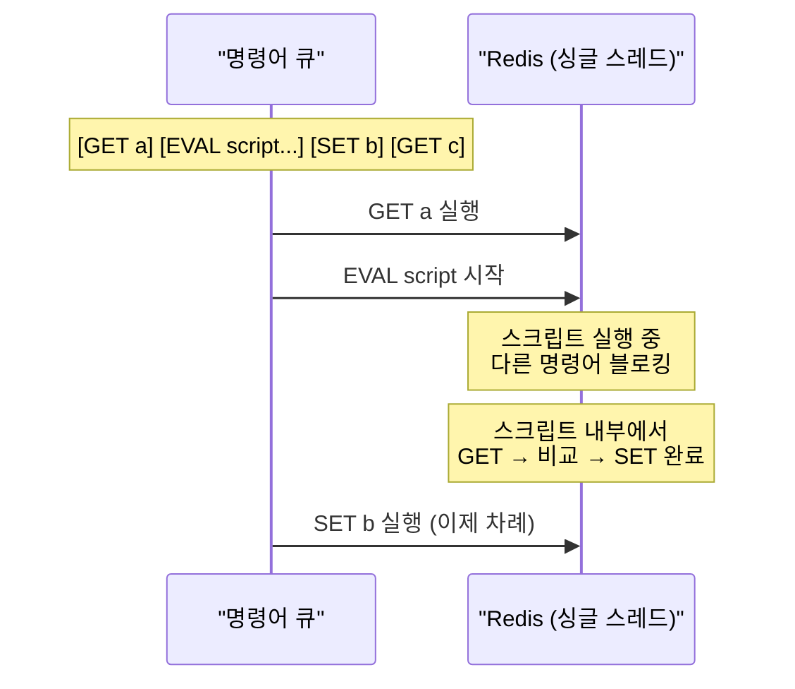

재고 감소 로직을 생각해보자. `GET`으로 재고를 읽고, 0보다 크면 `DECR`로 줄인다. 코드로 보면 아무 문제가 없다. 그런데 `GET`과 `DECR` 사이 **0.1밀리초의 틈**에 다른 요청이 끼어들면 재고가 -1이 된다. 초당 수천 건의 요청이 몰리는 플래시 세일에서는 이 틈이 수십 번 열린다. Lua 스크립트는 이 틈 자체를 없앤다.

## 왜 여러 명령어를 조합하면 위험한가

> **비유**: Lua 스크립트는 은행 창구에서 "잔액 확인 후 출금"을 직원이 한 자리에서 처리하는 것과 같다. 고객(클라이언트)이 잔액 확인을 부탁하고 자리에 돌아갔다가 출금하러 다시 오는 사이에, 다른 고객이 먼저 돈을 빼갈 수 있다. 직원(Redis 서버)이 두 단계를 내부에서 한 번에 처리하면 끼어들 틈이 없다.

Redis의 **개별 명령어**는 원자적이다. `INCR`은 GET → 증가 → SET을 한 번에 처리한다. 문제는 **여러 명령어를 조합**할 때 발생한다:

```
[Client A]  GET counter  →  값: 10
[Client B]  GET counter  →  값: 10   ← 0.05ms 차이로 끼어듦
[Client A]  SET counter 11
[Client B]  SET counter 11           ← 둘 다 11로 설정, 하나 손실
```

만약 이 문제를 무시하면? 재고 -1, 쿠폰 중복 발급, 중복 결제, 포인트 손실이 발생한다. 트래픽이 낮을 때는 발현 안 되다가 이벤트 날에 터진다.

### 원자성이 보장되는 이유 — 싱글 스레드 모델

Redis는 **싱글 스레드**로 명령어 큐를 처리한다. Lua 스크립트가 실행되는 동안 다른 모든 명령어는 큐에서 대기한다:



스크립트 전체가 **인터럽트 없이 실행**된다. Race condition이 발생할 틈이 없다.

---

## EVAL 명령어

```
EVAL script numkeys [key [key ...]] [arg [arg ...]]
```

| 파라미터 | 설명 |
|---------|------|
| `script` | Lua 스크립트 문자열 |
| `numkeys` | KEYS 배열에 전달할 키 개수 |
| `key` | Redis 키 목록 → `KEYS[1]`, `KEYS[2]`... |
| `arg` | 추가 인자 (값, 옵션 등) → `ARGV[1]`, `ARGV[2]`... |

```bash
# 기본 예시
EVAL "return 'hello'" 0

# GET을 스크립트로
EVAL "return redis.call('get', KEYS[1])" 1 mykey

# SET을 스크립트로
EVAL "return redis.call('set', KEYS[1], ARGV[1])" 1 mykey myvalue
```

### Java (Spring Data Redis)에서 EVAL

```java
String script = "return redis.call('set', KEYS[1], ARGV[1])";

redisTemplate.execute(
    new DefaultRedisScript<>(script, String.class),
    List.of("mykey"),   // KEYS[1]
    "myvalue"           // ARGV[1]
);
```

---

## EVALSHA — 스크립트를 서버에 캐싱하기

`EVAL`은 매 호출마다 스크립트 전문(全文)을 네트워크로 전송한다. 스크립트가 수백 바이트라면 초당 수만 번 호출 시 네트워크 낭비가 크다. `EVALSHA`는 스크립트를 서버에 저장하고 SHA1 해시로만 호출한다.

participant C as "Client" participant R as "Redis Server" Note over C,R: 1단계. 스크립트 등록

`DefaultRedisScript`는 이 과정을 자동으로 처리한다:
- 최초 호출: `EVALSHA` 시도 → NOSCRIPT 에러 → 자동으로 `EVAL` 폴백 (스크립트 서버에 캐시됨)
- 이후 호출: `EVALSHA`로 캐시 히트

```java
// DefaultRedisScript — SHA 캐싱이 내장되어 있어서 그냥 쓰면 된다
DefaultRedisScript<Long> script = new DefaultRedisScript<>(scriptText, Long.class);
// 첫 번째 실행에서 자동으로 EVALSHA + EVAL 폴백 처리
// 두 번째부터는 EVALSHA만 사용
redisTemplate.execute(script, List.of(key), arg1, arg2);
```

**서버 재시작 주의**: Redis 재시작 시 스크립트 캐시가 초기화된다. `DefaultRedisScript`는 NOSCRIPT 에러 시 자동 EVAL 폴백이 있으므로 실용적으로는 문제없다.

---

## Lua 문법 핵심 (Redis에서 필요한 것만)

### 변수와 타입

```lua
-- local 필수 — 전역 변수 쓰면 다음 스크립트 실행에 영향을 준다
local key   = KEYS[1]
local value = ARGV[1]
local count = tonumber(ARGV[2])  -- Redis는 모든 값을 string 반환 → 숫자 변환 필수

local flag = true
local arr  = {1, 2, 3}        -- table (배열로 사용)
```

### 조건과 반복

```lua
-- nil 비교: Redis에서 키가 없으면 false 반환
local val = redis.call('get', KEYS[1])
if val == false then     -- nil은 false로 처리
    return 0
elseif tonumber(val) > 100 then
    return 1
else
    return -1
end

-- 배열 순회
for i = 1, #KEYS do
    redis.call('del', KEYS[i])
end
```

### redis.call vs redis.pcall

| 선택 | 에러 발생 시 | 언제 쓰나 |
|------|-----------|---------|
| `redis.call` | 스크립트 전체 중단 | 에러 시 모두 롤백해야 할 때 |
| `redis.pcall` | 에러를 값으로 반환, 계속 실행 | 일부 실패 허용하고 처리할 때 |

```lua
-- redis.pcall로 에러 처리
local result = redis.pcall('incr', KEYS[1])
if type(result) == 'table' and result.err then
    return redis.error_reply("증가 실패: " .. result.err)
end
return result
```

---

## 실무 패턴 4가지

### 1. 분산 락 해제 — 내 락만 해제하기

가장 많이 쓰이는 패턴이다. 락을 설정한 쪽에서만 해제해야 한다. GET → 비교 → DEL 세 단계를 원자적으로 처리해야 "내 락이 아니면 DEL 안 함"이 보장된다.

```lua
-- KEYS[1] = 락 키, ARGV[1] = 내 UUID (락 설정 시 저장한 값)
-- 내 UUID와 일치할 때만 삭제 → 타인의 락을 실수로 해제하지 않음
if redis.call('get', KEYS[1]) == ARGV[1] then
    return redis.call('del', KEYS[1])  -- 성공: 1 반환
else
    return 0  -- 내 락이 아님 (이미 만료되었거나 다른 락)
end
```

```java
private static final DefaultRedisScript<Long> RELEASE_LOCK_SCRIPT =
    new DefaultRedisScript<>(
        "if redis.call('get', KEYS[1]) == ARGV[1] then " +
        "  return redis.call('del', KEYS[1]) " +
        "else " +
        "  return 0 " +
        "end",
        Long.class
    );

public boolean releaseLock(String key, String myUuid) {
    Long result = redisTemplate.execute(RELEASE_LOCK_SCRIPT, List.of(key), myUuid);
    return Long.valueOf(1L).equals(result);
}
```

### 2. 원자적 재고 차감

"재고 있으면 차감, 없으면 거절"을 원자적으로 처리해야 초과 판매를 막는다.

```lua
-- KEYS[1] = stock:productId, ARGV[1] = 차감 수량
local stock = tonumber(redis.call('get', KEYS[1]))

if stock == nil then
    return -1  -- 상품 없음
end

if stock < tonumber(ARGV[1]) then
    return -2  -- 재고 부족
end

-- 위 조건 통과 후에만 차감 → GET과 DECRBY 사이에 끼어들 틈 없음
return redis.call('decrby', KEYS[1], ARGV[1])
```

```java
public int decrementStock(Long productId, int quantity) {
    String script =
        "local stock = tonumber(redis.call('get', KEYS[1]))\n" +
        "if stock == nil then return -1 end\n" +
        "if stock < tonumber(ARGV[1]) then return -2 end\n" +
        "return redis.call('decrby', KEYS[1], ARGV[1])";

    Long result = redisTemplate.execute(
        new DefaultRedisScript<>(script, Long.class),
        List.of("stock:" + productId),
        String.valueOf(quantity)
    );

    if (result == null || result == -1) throw new ProductNotFoundException();
    if (result == -2) throw new InsufficientStockException();
    return result.intValue();  // 남은 재고 반환
}
```

### 3. 슬라이딩 윈도우 Rate Limiting

"1분 안에 최대 100번" 제한을 Sorted Set으로 구현한다. 여러 명령어를 원자적으로 실행해야 정확한 카운팅이 된다.

```lua
-- KEYS[1] = ratelimit:{userId}
-- ARGV[1] = 현재 timestamp(ms), ARGV[2] = 윈도우 크기(ms), ARGV[3] = 최대 요청 수
local key    = KEYS[1]
local now    = tonumber(ARGV[1])
local window = tonumber(ARGV[2])  -- 예: 60000 (1분)
local limit  = tonumber(ARGV[3])  -- 예: 100

-- 1. 윈도우 바깥의 오래된 기록 제거
redis.call('zremrangebyscore', key, 0, now - window)

-- 2. 현재 윈도우 내 요청 수 확인
local count = redis.call('zcard', key)

if count < limit then
    -- 3. 현재 요청 기록 (timestamp를 score와 member로 모두 사용)
    redis.call('zadd', key, now, now)
    redis.call('pexpire', key, window)  -- 윈도우 만큼만 키 유지
    return 1   -- 허용
else
    return 0   -- 거부
end
```

```java
public boolean isAllowed(String userId) {
    String key = "ratelimit:" + userId;
    long now    = System.currentTimeMillis();
    long window = 60_000L;  // 1분
    long limit  = 100L;

    Long result = redisTemplate.execute(
        RATE_LIMIT_SCRIPT,
        List.of(key),
        String.valueOf(now),
        String.valueOf(window),
        String.valueOf(limit)
    );
    return Long.valueOf(1L).equals(result);
}
```

### 4. Compare-And-Swap (조건부 업데이트)

"내가 마지막으로 읽은 값과 현재 값이 같을 때만 업데이트"하는 낙관적 락 패턴이다.

```lua
-- KEYS[1] = 키, ARGV[1] = 예상 현재 값, ARGV[2] = 새 값
local current = redis.call('get', KEYS[1])
if current == ARGV[1] then
    redis.call('set', KEYS[1], ARGV[2])
    return 1   -- 성공
else
    return 0   -- 실패 (값이 이미 변경됨)
end
```

```java
public boolean compareAndSet(String key, String expected, String newValue) {
    String script =
        "local current = redis.call('get', KEYS[1])\n" +
        "if current == ARGV[1] then\n" +
        "  redis.call('set', KEYS[1], ARGV[2])\n" +
        "  return 1\n" +
        "else\n" +
        "  return 0\n" +
        "end";

    Long result = redisTemplate.execute(
        new DefaultRedisScript<>(script, Long.class),
        List.of(key), expected, newValue
    );
    return Long.valueOf(1L).equals(result);
}
```

---

## KEYS vs ARGV — 왜 구분하는가

```lua
-- EVAL script 2 key1 key2 arg1 arg2
--              ↑numkeys ↑KEYS   ↑ARGV

local key1   = KEYS[1]   -- Redis 키 이름 (슬롯 결정에 사용)
local key2   = KEYS[2]
local value  = ARGV[1]   -- 일반 인자 (값, 옵션 등)
local ttl    = ARGV[2]
```

**클러스터에서 중요**: Redis Cluster는 `KEYS` 배열의 키들로 어느 노드로 라우팅할지 결정한다. 키를 `ARGV`에 넣으면 클러스터가 잘못된 노드로 요청을 보낸다. 접근하는 모든 키는 반드시 `KEYS`에 선언해야 한다.

---

## 주의사항

| 항목 | 이유 | 해결책 |
|------|------|--------|
| 실행 시간 최소화 | 스크립트 실행 중 Redis 전체 블로킹 | 로직을 단순하게, 루프 최소화 |
| `local` 변수 필수 | 전역 변수는 다음 스크립트까지 오염 | 모든 변수 앞에 `local` |
| `math.random` 금지 | 복제 시 마스터/레플리카 결과 불일치 | `redis.call('time')` 사용 |
| 무한 루프 금지 | `lua-time-limit`(기본 5초) 초과 시 강제 종료 | 반복 횟수에 상한 설정 |
| 클러스터 해시 태그 | 여러 키가 다른 슬롯에 있으면 에러 | `{tag}:key` 패턴으로 동일 슬롯 배치 |

---

## 정리

| 항목 | 핵심 |
|------|------|
| 원자성 근거 | Redis 싱글 스레드 — 스크립트 실행 중 다른 명령어 없음 |
| `EVAL` | 스크립트 전문을 매번 전송 |
| `EVALSHA` | SHA1 해시로 캐시 호출 — `DefaultRedisScript`가 자동 처리 |
| `redis.call` | 에러 시 스크립트 전체 중단 (롤백 효과) |
| `redis.pcall` | 에러를 값으로 받아 처리 계속 |
| 주요 사용처 | 분산 락 해제, 재고 차감, Rate Limiting, CAS |

---

## 왜 Lua 스크립트인가? (vs 트랜잭션 MULTI/EXEC vs 파이프라인)

| 방식 | 원자성 | 조건 분기 | 네트워크 왕복 |
|------|--------|-----------|--------------|
| **파이프라인** | 없음 | 불가 | 1회(배치 전송) |
| **MULTI/EXEC** | 큐 단위 | 불가(WATCH로 부분 가능) | 2회 |
| **Lua 스크립트** | 완전 원자적 | 가능(if/else) | 1회 |

**핵심 차이**: MULTI/EXEC는 큐에 쌓인 명령을 한 번에 실행하지만 중간에 조건 분기가 불가하다. Lua는 Redis 내부에서 스크립트가 실행되므로 "읽고 → 판단 → 쓰기"를 원자적으로 처리할 수 있다. 재고 차감, Rate Limiter, 분산 락 해제처럼 "읽은 값에 따라 쓰기 여부를 결정"해야 하는 패턴은 Lua가 유일한 올바른 선택이다.

---

## 실무에서 자주 하는 실수

**실수 1: 스크립트 안에서 긴 연산 수행**
Lua 스크립트는 Redis 이벤트 루프를 블로킹한다. 루프나 복잡한 연산을 넣으면 다른 클라이언트 명령이 전혀 처리되지 않는다. 스크립트는 수 밀리초 이내에 완료되도록 최소한의 Redis 명령만 포함해야 한다.

**실수 2: EVALSHA 없이 매번 EVAL로 전체 스크립트 전송**
스크립트 본문을 매 요청마다 네트워크로 전송한다. `SCRIPT LOAD`로 미리 등록하고 SHA1 해시로 `EVALSHA`를 호출하면 네트워크 트래픽이 크게 줄어든다. Lettuce, Jedis 모두 이를 자동화하는 `ScriptingCommands`를 제공한다.

**실수 3: Cluster에서 여러 슬롯의 키를 스크립트에서 접근**
Lua 스크립트는 단일 노드에서 실행된다. `KEYS` 배열의 모든 키가 같은 슬롯(같은 노드)에 있어야 한다. 해시 태그 없이 여러 키를 접근하면 `CROSSSLOT` 에러가 발생한다.

**실수 4: redis.call 대신 무조건 redis.pcall 사용**
`redis.pcall`은 에러를 잡아 스크립트가 계속 실행된다. 중간 명령이 실패해도 이후 명령이 실행되어 데이터 불일치가 생길 수 있다. 에러 시 즉시 중단이 필요하면 `redis.call`을 사용한다.

**실수 5: 스크립트 결과를 nil 처리 없이 사용**
키가 없을 때 `redis.call('GET', key)`는 `false`(Lua의 nil)를 반환한다. 이를 숫자나 문자열로 비교하면 예상치 못한 동작이 생긴다. 반드시 `if result == false then` 형태로 nil 체크를 먼저 해야 한다.

---

## 면접 포인트

**Q1. Lua 스크립트가 원자적인 이유는?**
Redis는 단일 스레드로 이벤트 루프를 실행한다. Lua 스크립트가 실행되는 동안에는 다른 클라이언트 명령이 끼어들 수 없다. 따라서 스크립트 내의 여러 명령이 중간 상태 없이 순차 실행된다. 단, "트랜잭션 롤백"은 없다 — 중간에 실패해도 이전 명령은 이미 실행된 상태다.

**Q2. WATCH와 MULTI/EXEC의 낙관적 락 패턴은?**
`WATCH key` → `MULTI` → 명령 큐잉 → `EXEC`. WATCH한 키가 EXEC 전에 변경되면 EXEC가 nil을 반환하며 트랜잭션 전체가 취소된다. 애플리케이션은 재시도해야 한다. Lua 스크립트와 달리 네트워크 왕복이 2번 필요하고 재시도 로직이 클라이언트에 있다.

**Q3. 스크립트 캐시와 SCRIPT FLUSH는?**
`EVAL`로 실행된 스크립트는 SHA1 해시로 서버에 캐시된다. `SCRIPT FLUSH`로 전체 캐시를 삭제할 수 있다(Redis 재시작 시 자동 삭제). 배포 시 스크립트가 변경되면 이전 SHA1이 무효화되므로 클라이언트가 `EVALSHA` 실패를 감지하고 `EVAL`로 폴백하는 로직이 필요하다.

**Q4. Rate Limiter를 Lua로 구현하는 방법은?**
토큰 버킷 또는 슬라이딩 윈도우를 Lua로 구현한다. 슬라이딩 윈도우 예: `ZADD`로 요청 타임스탬프 추가 → `ZREMRANGEBYSCORE`로 윈도우 밖 제거 → `ZCARD`로 현재 요청 수 확인 → 한도 초과 시 거부. 이 전체가 하나의 Lua 스크립트로 원자적으로 실행된다.

**Q5. Lua 스크립트 디버깅 방법은?**
`redis-cli --ldb` (Lua Debugger) 모드로 스크립트를 단계별 실행할 수 있다. `redis.log(redis.LOG_WARNING, "value: " .. tostring(val))`로 Redis 로그에 출력도 가능하다. 단, 프로덕션에서 `--ldb`는 서버를 디버그 모드로 전환해 성능에 영향을 주므로 개발 환경에서만 사용한다.

---
## 극한 시나리오

### 시나리오 1: 선착순 쿠폰 발급 — 1만 개 쿠폰에 100만 명 동시 요청

```java
// Lua 스크립트: 원자적 쿠폰 발급 (재고 차감 + 사용자 등록 원자적 처리)
private static final String ISSUE_COUPON_SCRIPT =
    "local stock = tonumber(redis.call('GET', KEYS[1])) " +
    "if not stock or stock <= 0 then return 0 end " +           // 재고 소진
    "local already = redis.call('SISMEMBER', KEYS[2], ARGV[1]) " +
    "if already == 1 then return -1 end " +                     // 중복 발급 방지
    "redis.call('DECR', KEYS[1]) " +                            // 재고 차감
    "redis.call('SADD', KEYS[2], ARGV[1]) " +                   // 발급자 등록
    "return stock - 1";                                         // 남은 재고 반환

public CouponIssueResult issueCoupon(String couponId, Long userId) {
    DefaultRedisScript<Long> script = new DefaultRedisScript<>(ISSUE_COUPON_SCRIPT, Long.class);
    Long result = redisTemplate.execute(script,
        List.of("coupon:stock:" + couponId, "coupon:issued:" + couponId),
        userId.toString()
    );
    // result: -1=중복, 0=소진, N=남은재고
    if (result == null || result == 0) return CouponIssueResult.SOLD_OUT;
    if (result == -1) return CouponIssueResult.ALREADY_ISSUED;

    // DB에는 비동기로 기록 (Kafka 발행)
    couponEventPublisher.publish(new CouponIssuedEvent(couponId, userId));
    return CouponIssueResult.SUCCESS;
}
// 성능: 단일 Redis 노드 10만 TPS 처리
// Lua 원자성으로 1만 개 쿠폰이 정확히 1만 명에게만 발급됨
```

**Lua 없이 처리할 경우 발생하는 장애:**
```
스레드 A: GET stock → 1 (재고 있음 확인)
스레드 B: GET stock → 1 (재고 있음 확인)
스레드 A: DECR stock → 0 (발급)
스레드 B: DECR stock → -1 (초과 발급!)
결과: 1만 개 쿠폰이 1만 명 이상에게 발급 → 수백만 원 손해
```

### 시나리오 2: Rate Limiting — API Gateway에서 초당 100건 제한

```java
// 슬라이딩 윈도우 Rate Limiter Lua 스크립트
private static final String RATE_LIMIT_SCRIPT =
    "local current_time = tonumber(ARGV[1]) " +
    "local window = tonumber(ARGV[2]) " +
    "local limit = tonumber(ARGV[3]) " +
    "local key = KEYS[1] " +
    // 윈도우 밖 요청 제거
    "redis.call('ZREMRANGEBYSCORE', key, 0, current_time - window) " +
    // 현재 윈도우 내 요청 수 확인
    "local count = redis.call('ZCARD', key) " +
    "if count >= limit then return 0 end " +  // 한도 초과
    // 현재 요청 추가
    "redis.call('ZADD', key, current_time, current_time .. '-' .. math.random()) " +
    "redis.call('EXPIRE', key, math.ceil(window / 1000)) " +
    "return limit - count - 1";               // 남은 허용 횟수

public boolean allowRequest(String userId) {
    long now = System.currentTimeMillis();
    DefaultRedisScript<Long> script = new DefaultRedisScript<>(RATE_LIMIT_SCRIPT, Long.class);
    Long remaining = redisTemplate.execute(script,
        List.of("ratelimit:" + userId),
        String.valueOf(now),
        "1000",   // 1초 윈도우 (ms)
        "100"     // 초당 100건 제한
    );
    return remaining != null && remaining >= 0;
}
// 10만 사용자 × 초당 100건 = 초당 1000만 건 체크 가능
// Lua 원자성으로 Race Condition 없이 정확한 카운팅
```

### 시나리오 3: Lua 스크립트 실행 중 Redis 재시작 — 장애 대응

**문제:** Lua 스크립트 실행 도중 Redis가 크래시하면 스크립트가 원자적으로 실행됐는가?

**답:** Redis는 AOF(Append-Only File) 또는 RDB 스냅샷을 사용합니다. Lua 스크립트 실행 중 크래시 시: AOF with `everysec` 설정이면 스크립트 전체가 원자적으로 기록되거나 전혀 기록되지 않습니다. 부분 실행 상태로 재시작되지 않습니다.

```bash
# AOF 설정으로 Lua 스크립트 원자성 보장
# redis.conf
appendonly yes
appendfsync everysec  # 1초마다 fsync (성능-내구성 균형)
# aof-use-rdb-preamble yes  # AOF + RDB 하이브리드 (Redis 4+)

# 검증: 재시작 후 데이터 확인
redis-cli DEBUG RELOAD  # RDB 덤프 후 다시 로드 (무중단 검증)
```

**실전 교훈:** 재고 차감 Lua 스크립트를 사용하는 결제 시스템에서 Redis 재시작 후 재고 수치가 맞는지 DB와 정기 비교(Reconciliation)하는 Job이 반드시 필요합니다. Redis는 "빠른 처리"를 담당하고, DB가 "정확한 기록"의 Source of Truth입니다.

---

## 왜 Lua 스크립트인가

**Redis Lua 스크립트를 선택하는 이유는 여러 Redis 명령을 원자적으로 실행해야 할 때 MULTI/EXEC 트랜잭션의 한계를 극복하기 위해서다.**

| 대안 | 문제점 | Lua 스크립트의 해결 |
|------|--------|------------------|
| 개별 명령 순서 실행 | GET → 조건 확인 → SET 사이에 다른 클라이언트가 개입 가능 | 스크립트 전체가 단일 원자 연산으로 실행 |
| MULTI/EXEC 트랜잭션 | WATCH 없이 조건부 분기 불가 | Lua에서 if/else로 조건 분기 가능 |
| 애플리케이션 레벨 락 | 네트워크 왕복 횟수 증가, 락 경쟁 | 서버에서 직접 실행해 왕복 횟수 최소화 |

Rate Limiter를 Lua로 구현하면 "현재 카운터 조회 → 한도 비교 → 증가" 세 단계가 원자적으로 실행된다. 분산 환경에서도 동시 요청이 카운터를 이중으로 증가시키는 Race Condition이 없다.
