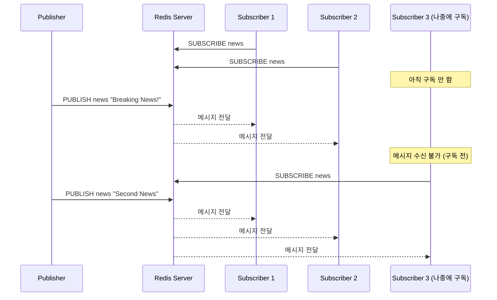
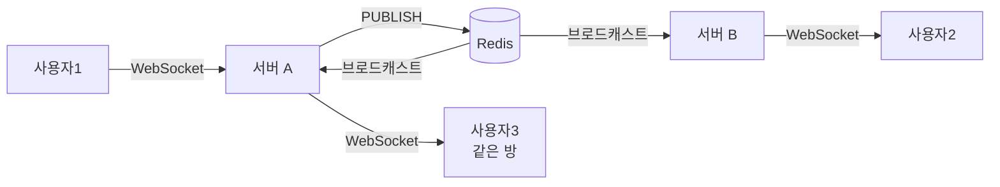

## 비유로 시작하기

라디오 방송을 생각해보세요. DJ(Publisher)가 방송을 보내면, 같은 주파수에 맞춰둔 청취자(Subscriber)들이 동시에 듣습니다. DJ는 청취자가 몇 명인지, 누가 듣는지 알 필요가 없습니다. 청취자도 DJ에게 허락을 구하지 않고 주파수만 맞추면 됩니다. 방송 중에 라디오를 끄면, 그 시간의 내용은 다시 들을 수 없습니다.

Redis Pub/Sub는 **메시지를 채널(주파수)에 발행(Publish)하면 구독(Subscribe)한 클라이언트 모두에게 실시간으로 전달**하는 메시징 패턴입니다.

---

## 동작 원리



핵심 특성:
- **Fire and Forget**: 발행 후 저장하지 않음. 구독자가 없어도 메시지는 사라짐
- **실시간**: 메시지가 거의 즉시 전달됨
- **1:N 브로드캐스트**: 하나의 메시지가 모든 구독자에게 전달

---

## Redis CLI로 동작 확인

```bash
# 터미널 1: 구독자
redis-cli
> SUBSCRIBE chat:room1
Reading messages... (press Ctrl-C to quit)
1) "subscribe"
2) "chat:room1"
3) (integer) 1

# 터미널 2: 발행자
redis-cli
> PUBLISH chat:room1 "안녕하세요!"
(integer) 1  # 수신한 구독자 수

# 터미널 1에서 수신:
1) "message"
2) "chat:room1"
3) "안녕하세요!"
```

---

## 패턴 구독 (PSUBSCRIBE)

와일드카드로 여러 채널을 한 번에 구독합니다.

```bash
# chat: 로 시작하는 모든 채널 구독
redis-cli PSUBSCRIBE "chat:*"

# 발행
redis-cli PUBLISH chat:room1 "Room1 메시지"
redis-cli PUBLISH chat:room2 "Room2 메시지"
redis-cli PUBLISH chat:general "General 메시지"
# 위 3개 모두 수신됨

# 수신 메시지 형식
1) "pmessage"
2) "chat:*"       # 패턴
3) "chat:room1"   # 실제 채널
4) "Room1 메시지"  # 내용
```

---

## Spring Boot에서 사용

### 의존성

```gradle
implementation 'org.springframework.boot:spring-boot-starter-data-redis'
```

### 설정

```java
@Configuration
public class RedisConfig {

    @Bean
    public RedisConnectionFactory redisConnectionFactory() {
        LettuceConnectionFactory factory = new LettuceConnectionFactory(
            new RedisStandaloneConfiguration("localhost", 6379)
        );
        return factory;
    }

    @Bean
    public RedisTemplate<String, Object> redisTemplate(RedisConnectionFactory factory) {
        RedisTemplate<String, Object> template = new RedisTemplate<>();
        template.setConnectionFactory(factory);
        template.setKeySerializer(new StringRedisSerializer());
        template.setValueSerializer(new GenericJackson2JsonRedisSerializer());
        return template;
    }

    // Pub/Sub 메시지 리스너 컨테이너
    @Bean
    public RedisMessageListenerContainer redisMessageListenerContainer(
            RedisConnectionFactory factory,
            ChatMessageListener chatListener) {

        RedisMessageListenerContainer container = new RedisMessageListenerContainer();
        container.setConnectionFactory(factory);

        // 채널 구독 등록
        container.addMessageListener(chatListener,
            new PatternTopic("chat:*"));  // 패턴 구독
        container.addMessageListener(chatListener,
            new ChannelTopic("notification:global"));  // 단일 채널

        return container;
    }
}
```

### Publisher (발행자)

```java
@Service
@RequiredArgsConstructor
public class ChatPublisher {

    private final RedisTemplate<String, Object> redisTemplate;
    private final ObjectMapper objectMapper;

    public void publishMessage(String roomId, ChatMessage message) {
        String channel = "chat:" + roomId;
        try {
            String messageJson = objectMapper.writeValueAsString(message);
            redisTemplate.convertAndSend(channel, messageJson);
            log.info("메시지 발행 - channel: {}, message: {}", channel, messageJson);
        } catch (JsonProcessingException e) {
            throw new MessagePublishException("메시지 직렬화 실패", e);
        }
    }

    // 시스템 공지 브로드캐스트
    public void broadcastNotification(SystemNotification notification) {
        redisTemplate.convertAndSend("notification:global",
            notification.toJson());
    }
}
```

### Subscriber (구독자)

```java
@Component
@RequiredArgsConstructor
@Slf4j
public class ChatMessageListener implements MessageListener {

    private final ObjectMapper objectMapper;
    private final SimpMessagingTemplate webSocketTemplate;  // WebSocket으로 클라이언트에 전달

    @Override
    public void onMessage(Message message, byte[] pattern) {
        String channel = new String(message.getChannel());
        String body = new String(message.getBody());

        log.info("메시지 수신 - channel: {}, body: {}", channel, body);

        try {
            ChatMessage chatMessage = objectMapper.readValue(body, ChatMessage.class);

            // 채널에서 roomId 추출 (chat:room1 → room1)
            String roomId = channel.substring("chat:".length());

            // WebSocket으로 해당 방 구독자들에게 전달
            webSocketTemplate.convertAndSend(
                "/topic/chat/" + roomId,
                chatMessage
            );
        } catch (JsonProcessingException e) {
            log.error("메시지 역직렬화 실패 - channel: {}, body: {}", channel, body, e);
        }
    }
}
```

### 실시간 채팅 전체 흐름

```java
@Controller
@RequiredArgsConstructor
public class ChatController {

    private final ChatPublisher chatPublisher;
    private final ChatMessageRepository messageRepository;

    @MessageMapping("/chat/{roomId}/send")
    public void sendMessage(@DestinationVariable String roomId,
                            @Payload ChatMessageRequest request,
                            Principal principal) {
        ChatMessage message = ChatMessage.builder()
            .roomId(roomId)
            .senderId(principal.getName())
            .content(request.getContent())
            .sentAt(LocalDateTime.now())
            .build();

        // 1. DB 저장 (메시지 영속화)
        messageRepository.save(message);

        // 2. Redis Pub/Sub으로 같은 채널 구독한 서버들에게 브로드캐스트
        chatPublisher.publishMessage(roomId, message);
    }
}
```

---

## 실무 활용 패턴

### 1. 멀티 서버 채팅 (주요 사용 사례)

```
문제: 서버 A에 접속한 사용자가 서버 B에 접속한 사용자에게 메시지 전송

해결:
사용자1(서버A) → WebSocket → 서버A
서버A → Redis PUBLISH "chat:room1" → Redis
Redis → SUBSCRIBE → 서버A, 서버B 모두 수신
서버B → WebSocket → 사용자2(서버B)
```



### 2. 캐시 무효화 브로드캐스트

```java
// 상품 정보 변경 시 모든 서버의 로컬 캐시 무효화
@Service
public class ProductService {

    @Transactional
    public void updateProduct(Long productId, UpdateProductRequest request) {
        Product product = productRepository.findById(productId).orElseThrow();
        product.update(request);
        productRepository.save(product);

        // 모든 서버의 로컬 캐시 무효화 신호
        redisTemplate.convertAndSend("cache:invalidate",
            Map.of("type", "product", "id", productId));
    }
}

@Component
public class CacheInvalidationListener implements MessageListener {
    private final CaffeineCache localCache;

    @Override
    public void onMessage(Message message, byte[] pattern) {
        Map<String, Object> data = parseJson(message.getBody());
        if ("product".equals(data.get("type"))) {
            localCache.invalidate(data.get("id"));
        }
    }
}
```

### 3. 실시간 알림

```java
// 주문 상태 변경 → 해당 사용자에게 실시간 알림
redisTemplate.convertAndSend("notification:user:" + userId,
    new OrderStatusChangedNotification(orderId, newStatus));
```

---

## 한계와 문제점

### 1. 메시지 유실 (가장 중요)

```
문제:
- 구독자가 없을 때 발행된 메시지는 영원히 사라짐
- 구독자가 잠깐 다운되었을 때의 메시지도 사라짐
- Redis가 재시작되면 모든 메시지 사라짐

Redis Pub/Sub은 "At-most-once" 전달 보장
→ 메시지가 한 번도 안 가거나, 한 번 가거나
→ "At-least-once"나 "Exactly-once" 보장 불가
```

### 2. 메시지 이력 없음

구독 전에 발행된 메시지는 조회 불가합니다.

### 3. 확인(ACK) 없음

메시지가 실제로 처리됐는지 알 수 없습니다.

---

## Kafka/RabbitMQ와 비교

| 항목 | Redis Pub/Sub | Apache Kafka | RabbitMQ |
|------|--------------|-------------|----------|
| 메시지 영속성 | 없음 | 있음 (디스크) | 있음 |
| 메시지 재처리 | 불가 | 가능 (오프셋) | 불가 (기본) |
| 전달 보장 | At-most-once | At-least-once | At-least-once |
| 성능 | 매우 빠름 | 빠름 (대용량) | 보통 |
| 복잡도 | 낮음 | 높음 | 보통 |
| 구독자 오프라인 | 메시지 유실 | 나중에 수신 가능 | 큐에 보관 |
| 적합한 상황 | 실시간 채팅, 캐시 무효화 | 이벤트 소싱, 대용량 로그 | 작업 큐, 이메일 발송 |

**선택 기준**:
- 메시지 유실을 절대 허용 못 한다 → Kafka 또는 RabbitMQ
- 빠른 실시간 브로드캐스트, 약간의 유실 허용 가능 → Redis Pub/Sub
- 채팅 시스템 → Redis Pub/Sub (전달 보장이 필요하면 DB와 함께 사용)

---

## Redis Stream (Pub/Sub의 대안)

Redis 5.0+에서 메시지 영속성과 소비자 그룹을 지원하는 Kafka-lite입니다.

```bash
# 메시지 발행
XADD mystream * event order_created orderId 12345

# 소비자 그룹 생성
XGROUP CREATE mystream mygroup $ MKSTREAM

# 메시지 소비 (ACK 기반)
XREADGROUP GROUP mygroup consumer1 COUNT 10 STREAMS mystream >

# 처리 완료 ACK
XACK mystream mygroup <message-id>
```

채팅처럼 "실시간 브로드캐스트"가 목적이면 Pub/Sub, "메시지 처리 보장"이 목적이면 Stream을 사용하세요.

---

## 극한 시나리오

### 시나리오: 채팅 서비스에서 Redis 장애

```
문제: Redis 다운 → Pub/Sub 중단 → 모든 채팅 메시지 전달 불가

대응:
1. Redis Sentinel / Redis Cluster로 고가용성 구성
2. 장애 시 로컬 브로드캐스트로 Fallback (같은 서버 내 사용자만)
3. 중요 메시지는 DB에도 저장하여 조회 가능하게

장기적 해결:
- 채팅 시스템 규모가 커지면 Redis Pub/Sub → Kafka로 이전
  (메시지 영속성 + 재처리 + 높은 처리량)
```
