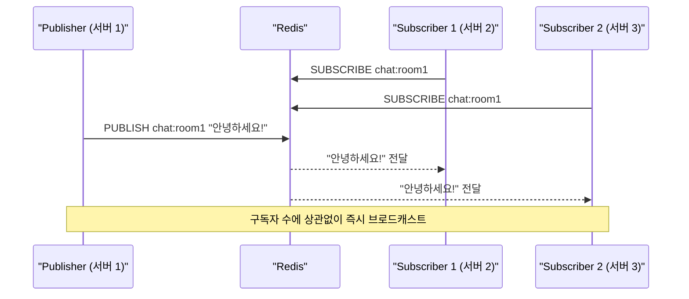
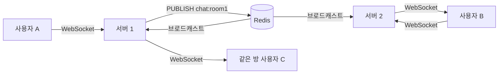
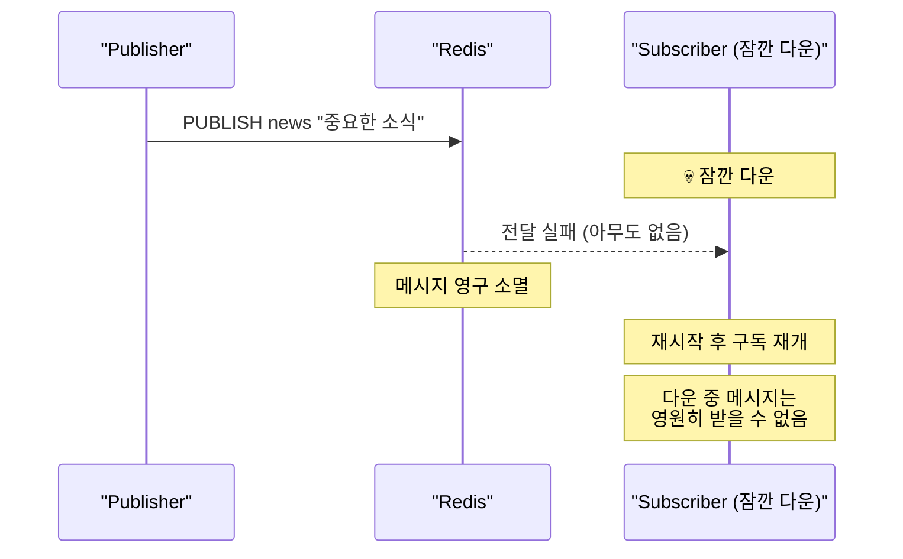

채팅 서비스를 서버 3대로 운영한다고 가정하자. 사용자 A는 서버 1에 WebSocket으로 연결되어 있고, 사용자 B는 서버 2에 연결되어 있다. A가 B에게 메시지를 보내면 어떻게 되는가? 서버 1은 서버 2에 연결된 B에게 직접 WebSocket 메시지를 보낼 수 없다. 서버들 사이의 메시지를 중계할 무언가가 필요하다. Redis Pub/Sub이 그 역할이다.

## Pub/Sub이란?

> **비유**: FM 라디오와 같다. DJ(Publisher)가 특정 주파수(채널)로 방송을 보내면, 그 주파수에 주파수를 맞춘 청취자(Subscriber)들이 동시에 듣는다. DJ는 청취자가 몇 명인지 알 필요가 없다. 청취자가 라디오를 끄고 있을 때 방송된 내용은 다시 들을 수 없다. 방송은 나가는 순간 사라진다.

Redis Pub/Sub은 **메시지를 채널에 발행(Publish)하면 그 채널을 구독(Subscribe)한 모든 클라이언트에게 실시간으로 전달**하는 메시징 패턴이다.



**핵심 특성**:
- **Fire and Forget**: 메시지를 저장하지 않는다. 구독자가 없어도, 구독자가 잠깐 다운되어도 메시지는 영원히 사라진다.
- **1:N 브로드캐스트**: 하나의 메시지가 모든 구독자에게 동시에 전달된다.
- **실시간**: 발행과 수신 사이의 지연이 수 밀리초 이내다.

---

## Redis CLI로 동작 확인

```bash
# 터미널 1: 구독
redis-cli
> SUBSCRIBE chat:room1
Reading messages... (press Ctrl-C to quit)
1) "subscribe"
2) "chat:room1"
3) (integer) 1   # 현재 구독 중인 채널 수

# 터미널 2: 발행
redis-cli
> PUBLISH chat:room1 "안녕하세요!"
(integer) 1   # 이 메시지를 받은 구독자 수

# 터미널 1에서 자동 수신:
1) "message"
2) "chat:room1"    # 채널 이름
3) "안녕하세요!"    # 메시지 내용
```

---

## 패턴 구독 (PSUBSCRIBE)

채널 이름에 와일드카드를 사용해 여러 채널을 한 번에 구독한다. "모든 채팅방의 메시지"를 하나의 구독자가 받아야 할 때 유용하다.

```bash
# chat: 으로 시작하는 모든 채널 구독
redis-cli PSUBSCRIBE "chat:*"

# 어떤 채팅방에 발행해도 수신됨
redis-cli PUBLISH chat:room1 "1번 방 메시지"
redis-cli PUBLISH chat:room99 "99번 방 메시지"

# 수신 메시지 형식 (패턴 구독은 pmessage)
1) "pmessage"
2) "chat:*"       # 매칭된 패턴
3) "chat:room1"   # 실제 채널 이름
4) "1번 방 메시지" # 내용
```

---

## Spring Boot에서 Pub/Sub 구현

### 설정

```java
@Configuration
public class RedisConfig {

    @Bean
    public RedisConnectionFactory redisConnectionFactory() {
        return new LettuceConnectionFactory(
            new RedisStandaloneConfiguration("localhost", 6379)
        );
    }

    @Bean
    public RedisTemplate<String, Object> redisTemplate(RedisConnectionFactory factory) {
        RedisTemplate<String, Object> template = new RedisTemplate<>();
        template.setConnectionFactory(factory);
        template.setKeySerializer(new StringRedisSerializer());
        template.setValueSerializer(new GenericJackson2JsonRedisSerializer());
        return template;
    }

    @Bean
    public RedisMessageListenerContainer redisMessageListenerContainer(
            RedisConnectionFactory factory,
            ChatMessageListener chatListener) {

        RedisMessageListenerContainer container = new RedisMessageListenerContainer();
        container.setConnectionFactory(factory);

        // 패턴 구독: chat: 로 시작하는 모든 채널
        container.addMessageListener(chatListener, new PatternTopic("chat:*"));
        // 단일 채널 구독
        container.addMessageListener(chatListener, new ChannelTopic("notification:global"));

        return container;
    }
}
```

### Publisher

```java
@Service
@RequiredArgsConstructor
public class ChatPublisher {

    private final RedisTemplate<String, Object> redisTemplate;
    private final ObjectMapper objectMapper;

    public void publishMessage(String roomId, ChatMessage message) {
        String channel = "chat:" + roomId;
        try {
            // 메시지를 JSON 직렬화 후 발행
            // convertAndSend는 내부적으로 직렬화를 처리한다
            String messageJson = objectMapper.writeValueAsString(message);
            redisTemplate.convertAndSend(channel, messageJson);
        } catch (JsonProcessingException e) {
            throw new MessagePublishException("메시지 직렬화 실패", e);
        }
    }
}
```

### Subscriber

```java
@Component
@RequiredArgsConstructor
@Slf4j
public class ChatMessageListener implements MessageListener {

    private final ObjectMapper objectMapper;
    private final SimpMessagingTemplate webSocketTemplate;

    @Override
    public void onMessage(Message message, byte[] pattern) {
        String channel = new String(message.getChannel());
        String body    = new String(message.getBody());

        try {
            ChatMessage chatMessage = objectMapper.readValue(body, ChatMessage.class);

            // 채널명에서 roomId 추출: "chat:room1" → "room1"
            String roomId = channel.substring("chat:".length());

            // WebSocket으로 해당 방 사용자들에게 전달
            webSocketTemplate.convertAndSend("/topic/chat/" + roomId, chatMessage);

        } catch (JsonProcessingException e) {
            log.error("메시지 역직렬화 실패 — channel: {}, body: {}", channel, body, e);
        }
    }
}
```

---

## 주요 활용 패턴

### 1. 멀티 서버 채팅 — 가장 대표적인 사용 사례

서버가 여러 대일 때 각 서버의 WebSocket 사용자들에게 메시지를 전달하는 문제를 해결한다:



사용자 A가 메시지를 보내면:
1. 서버 1이 Redis에 `PUBLISH chat:room1 메시지`
2. Redis가 `chat:room1` 구독자인 서버 1, 2, 3 모두에게 전달
3. 각 서버가 자신에 연결된 WebSocket 사용자들에게 전달

서버 수가 늘어도 코드 변경 없이 Redis Pub/Sub이 중계를 담당한다.

### 2. 캐시 무효화 브로드캐스트

상품 정보가 변경될 때 모든 서버의 로컬 캐시를 동시에 무효화한다:

```java
@Service
public class ProductService {

    @Transactional
    public void updateProduct(Long productId, UpdateProductRequest request) {
        // DB 업데이트
        Product product = productRepository.findById(productId).orElseThrow();
        product.update(request);

        // 모든 서버의 로컬 캐시 무효화 신호 발행
        // 이 메시지를 받은 모든 서버가 자신의 Caffeine/Guava 캐시를 지운다
        redisTemplate.convertAndSend("cache:invalidate",
            Map.of("type", "product", "id", productId));
    }
}

@Component
public class CacheInvalidationListener implements MessageListener {
    private final Cache localCache;  // Caffeine, Guava 등

    @Override
    public void onMessage(Message message, byte[] pattern) {
        Map<String, Object> data = parseJson(message.getBody());
        if ("product".equals(data.get("type"))) {
            // 이 서버의 로컬 캐시에서 해당 상품 제거
            localCache.invalidate("product:" + data.get("id"));
        }
    }
}
```

### 3. 실시간 알림

```java
// 주문 상태 변경 → 해당 사용자에게 실시간 알림
// 사용자별 채널에 발행 → 해당 사용자가 연결된 서버만 처리
redisTemplate.convertAndSend(
    "notification:user:" + userId,
    new OrderStatusChangedNotification(orderId, newStatus)
);
```

---

## 한계 — 쓰기 전에 알아야 할 것들

### 메시지 유실 (가장 중요)

Redis Pub/Sub은 **At-most-once** 전달 보장이다. 메시지가 한 번도 안 가거나 한 번 가거나, "최소 한 번"은 보장하지 않는다.



유실이 발생하는 상황:
- 구독자가 없을 때 발행된 메시지
- 구독자가 네트워크 문제로 잠깐 끊겼을 때
- Redis 서버 재시작

### 그 외 한계

| 한계 | 설명 |
|------|------|
| 메시지 이력 없음 | 구독 전에 발행된 메시지는 조회 불가 |
| ACK 없음 | 메시지가 실제로 처리됐는지 알 수 없음 |
| 순서 보장 없음 | 네트워크 문제 시 순서가 뒤바뀔 수 있음 |

---

## Redis Stream — Pub/Sub의 한계를 극복하는 대안

Redis 5.0+의 Stream은 Pub/Sub에 영속성과 소비자 그룹을 추가한 Kafka-lite다.

```bash
# 메시지 발행 (저장됨)
XADD mystream * event order_created orderId 12345

# 소비자 그룹 생성 (오프셋 기반)
XGROUP CREATE mystream mygroup $ MKSTREAM

# ACK 기반 소비 (처리 확인)
XREADGROUP GROUP mygroup consumer1 COUNT 10 STREAMS mystream >
XACK mystream mygroup <message-id>
```

---

## Kafka/RabbitMQ와 언제 무엇을 쓰는가

| 항목 | Redis Pub/Sub | Redis Stream | Apache Kafka | RabbitMQ |
|------|-------------|------------|------------|--------|
| 메시지 영속성 | 없음 | 있음 | 있음 (디스크) | 있음 |
| 전달 보장 | At-most-once | At-least-once | At-least-once | At-least-once |
| 메시지 재처리 | 불가 | 가능 (오프셋) | 가능 (오프셋) | 불가 (기본) |
| 복잡도 | 낮음 | 낮음 | 높음 | 보통 |
| 구독자 오프라인 | 메시지 유실 | 나중에 수신 | 나중에 수신 | 큐에 보관 |
| 처리량 | 매우 빠름 | 빠름 | 대용량 최적화 | 보통 |

**선택 기준**:
- 실시간 브로드캐스트, 약간의 유실 허용 → **Redis Pub/Sub** (채팅, 캐시 무효화)
- 유실 불가, 나중에 재처리 필요 → **Redis Stream** (소규모), **Kafka** (대규모)
- 작업 큐, 이메일 발송 → **RabbitMQ**

채팅 시스템이라면: Redis Pub/Sub으로 실시간 전달 + DB에도 저장해 이력 조회를 분리하는 방식이 실용적이다.

---

## 정리

| 항목 | 핵심 |
|------|------|
| 전달 보장 | At-most-once — 유실 가능 |
| 주요 용도 | 멀티 서버 채팅, 캐시 무효화, 실시간 알림 |
| 한계 | 메시지 저장 없음, ACK 없음, 구독 전 메시지 조회 불가 |
| 유실이 치명적이면 | Redis Stream 또는 Kafka로 전환 |
