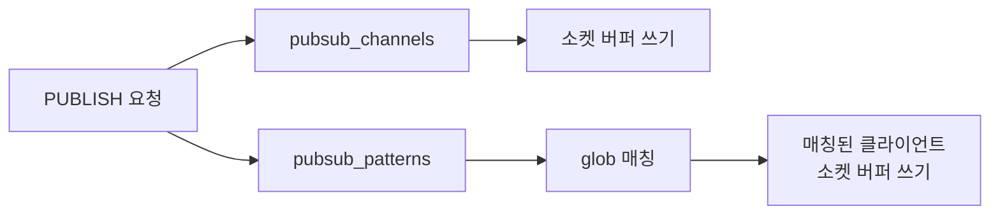
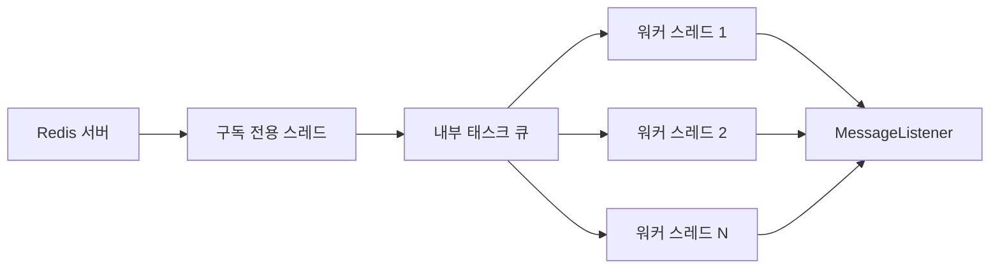
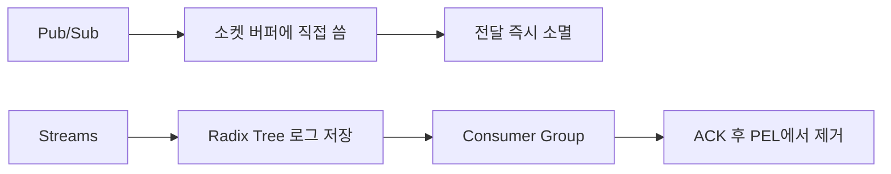
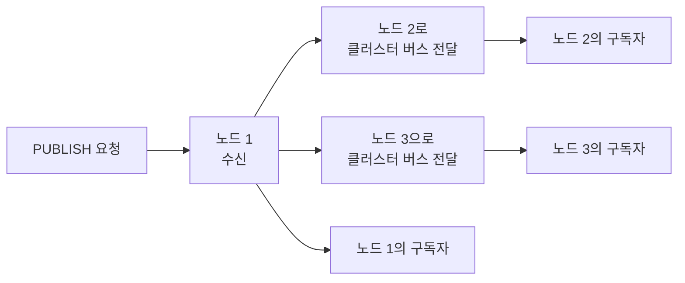

채팅 서비스를 서버 3대로 운영한다. 사용자 A는 서버 1에 WebSocket으로 연결되어 있고, 사용자 B는 서버 2에 연결되어 있다. A가 B에게 메시지를 보낸다. 서버 1은 서버 2에 연결된 B에게 직접 메시지를 전달할 수 없다. 서버들 사이의 메시지를 중계할 무언가가 필요하다. Redis Pub/Sub이 그 역할을 한다.

그런데 Redis Pub/Sub은 메시지를 저장하지 않는다. 전달하는 순간 사라진다. 왜 이런 설계를 했는가? 내부적으로 어떻게 동작하는가? 언제 쓰면 안 되는가? 이 글은 그 질문들에 답한다.

---

## 1. Pub/Sub 내부 구조 — pubsub_channels와 pubsub_patterns

Redis 서버는 모든 채널 구독 정보를 `server.pubsub_channels`라는 딕셔너리 하나에 관리한다. C 소스(`pubsub.c`)에 그대로 드러난다.

### pubsub_channels 딕셔너리

```
server.pubsub_channels = {
  "chat:room1" -> [client_A, client_B, client_C],
  "chat:room2" -> [client_D],
  "notification:global" -> [client_A, client_E]
}
```

- **키**: 채널 이름 (문자열)
- **값**: 해당 채널을 구독하는 클라이언트 포인터의 연결 리스트

`SUBSCRIBE chat:room1`을 실행하면 Redis는 단순히 이 딕셔너리에서 `"chat:room1"` 키를 찾아 현재 클라이언트를 리스트에 추가한다. `PUBLISH chat:room1 msg`를 실행하면 해당 리스트를 순회하며 각 클라이언트의 소켓 버퍼에 메시지를 쓴다. 복잡한 큐가 없다. 메모리 내 딕셔너리 조회와 소켓 쓰기가 전부다.

### pubsub_patterns 연결 리스트

패턴 구독(`PSUBSCRIBE`)은 별도 자료구조다.

```
server.pubsub_patterns = [
  { client: client_A, pattern: "chat:*" },
  { client: client_B, pattern: "chat:room[0-9]*" },
  { client: client_C, pattern: "event:*:created" }
]
```

딕셔너리가 아닌 **연결 리스트**다. 패턴은 해시로 직접 조회할 수 없기 때문이다. `PUBLISH`가 들어오면 Redis는 이 리스트를 **처음부터 끝까지 순회**하며 각 패턴과 glob 매칭을 수행한다.



**왜 딕셔너리를 쓰지 않는가?** 패턴은 `chat:*`처럼 와일드카드가 포함된 문자열이다. `PUBLISH chat:room1`이 들어왔을 때 어떤 패턴이 매칭되는지 사전에 알 수 없다. 딕셔너리의 O(1) 조회는 정확한 키를 알 때만 가능하다. 패턴은 모든 채널명과 비교해야 하므로 O(N) 순회가 불가피하다.

**성능 함의**: 패턴 구독이 M개 있고 초당 PUBLISH가 R번 발생하면, 초당 M × R번의 glob 매칭이 Redis의 단일 스레드에서 실행된다. M=50, R=100,000이면 초당 5,000,000번이다. 이것이 PSUBSCRIBE 남발이 CPU 병목을 만드는 이유다.

---

## 2. 왜 Fire-and-Forget인가 — 설계 결정의 근거

Redis의 철학은 **메모리 내 초고속 연산**이다. 메시지를 저장하려면 어딘가에 써야 한다. 메모리에 쓰면 크기가 무한히 증가한다. 디스크에 쓰면 I/O 대기가 발생해 Redis의 가장 큰 강점인 지연시간이 깨진다.

Pub/Sub의 설계 결정을 분해하면:

**1) 구독자가 없으면 메시지를 어디에 보관할 것인가?**
보관하면 메모리가 필요하다. 얼마나 쌓일지 모른다. 언제까지 보관할지 기준도 없다. 보관하지 않는 것이 단순하고 예측 가능하다.

**2) 구독자가 있다가 없어지면?**
구독자가 연결을 끊은 순간부터 그 구독자를 위한 메시지는 버린다. 재연결 후 어디서부터 받아야 하는지 Redis가 추적하지 않는다.

**3) 전달 확인(ACK)을 어떻게 처리할 것인가?**
ACK를 구현하면 미전달 메시지를 추적하는 상태 머신이 필요하다. 재전송 로직, 타임아웃, 중복 제거가 필요하다. 이것은 Kafka나 RabbitMQ가 하는 일이다. Redis는 그 복잡도를 의도적으로 포기했다.

결과적으로 Redis Pub/Sub은 **최대한 빠르게, 지금 연결된 구독자에게만, 한 번에** 전달하는 시스템이다. 영속성과 신뢰성은 외부에서 보완해야 한다.

---

## 3. 메시지 유실의 세 가지 경로

"메시지가 사라진다"는 말이 추상적으로 들린다. 구체적으로 어느 시점에 사라지는지 추적한다.

### 경로 1: 구독자 없음

```
PUBLISH chat:room1 "안녕"
→ server.pubsub_channels["chat:room1"] 조회
→ 리스트가 비어있음
→ 메시지 즉시 폐기
→ PUBLISH 반환값: (integer) 0  ← 받은 구독자 수
```

PUBLISH의 반환값이 0이면 메시지를 받은 구독자가 없다는 의미다. 대부분의 코드는 이 반환값을 확인하지 않는다. 유실을 탐지조차 못한다.

### 경로 2: 구독자 크래시

```
[정상 상태]
구독자 A: 연결 중, chat:room1 구독
발행자: PUBLISH chat:room1 "메시지1" → A에게 전달됨

[구독자 A 크래시 발생]
발행자: PUBLISH chat:room1 "메시지2" → A 연결 없음 → 폐기
발행자: PUBLISH chat:room1 "메시지3" → A 연결 없음 → 폐기

[구독자 A 재시작, 재구독]
발행자: PUBLISH chat:room1 "메시지4" → A에게 전달됨
→ "메시지2", "메시지3"은 영구 소멸
```

재구독 후 A는 자신이 받지 못한 메시지가 있었다는 사실조차 알 수 없다.

### 경로 3: 클라이언트 출력 버퍼 초과

이것이 가장 위험한 경로다. 구독자가 살아있는 것처럼 보이지만 실제로는 메시지를 받지 못한다.

Redis는 각 구독자에게 전달할 메시지를 **클라이언트 출력 버퍼(client output buffer)**에 쌓는다. 구독자의 처리 속도가 발행 속도보다 느리면 버퍼가 증가한다. 버퍼가 한계를 초과하면 Redis가 해당 구독자의 연결을 **강제 종료**한다.

```
# Redis 기본 설정
client-output-buffer-limit pubsub 32mb 8mb 60
#                                   ^    ^   ^
#          hard limit: 32MB 초과 시 즉시 종료
#                       soft limit: 8MB 초과가 60초 지속 시 종료
```

연결이 끊기면 그 시점부터 발행된 메시지가 유실된다. 연결이 끊긴 사실을 탐지하고 재구독하는 데 수 초가 걸리고, 그 사이의 메시지는 모두 사라진다.

---

## 4. 클라이언트 출력 버퍼 — 느린 구독자가 죽는 메커니즘


**왜 버퍼를 무한히 늘리지 않는가?** 구독자가 100개면 버퍼도 100개다. 모두 느리면 Redis 메모리가 급격히 증가한다. Redis는 메모리 서버다. 메모리가 고갈되면 서버 전체가 위험해진다. 버퍼 한계는 단일 구독자의 문제가 Redis 전체 장애로 번지는 것을 막는 안전장치다.

### Java/Spring에서 버퍼 문제 탐지

```java
@Configuration
public class RedisConfig {

    @Bean
    public RedisMessageListenerContainer messageListenerContainer(
            RedisConnectionFactory connectionFactory,
            MessageListener chatListener) {

        RedisMessageListenerContainer container = new RedisMessageListenerContainer();
        container.setConnectionFactory(connectionFactory);

        // 구독자 스레드풀: 처리 속도를 높이는 핵심 설정
        // 스레드가 부족하면 onMessage()가 블로킹되어 버퍼가 쌓인다
        ThreadPoolTaskExecutor executor = new ThreadPoolTaskExecutor();
        executor.setCorePoolSize(4);
        executor.setMaxPoolSize(16);
        executor.setQueueCapacity(1000);
        executor.setThreadNamePrefix("redis-pubsub-");
        executor.initialize();
        container.setTaskExecutor(executor);

        // 에러 핸들러: 연결 끊김을 탐지하고 로깅
        container.setErrorHandler(e -> {
            log.error("Redis Pub/Sub 오류 발생. 재구독 시도: {}", e.getMessage(), e);
            // 이 시점에서 재구독이 필요하다. container가 자동 재연결을 시도한다.
        });

        container.addMessageListener(chatListener, new PatternTopic("chat:*"));
        return container;
    }
}
```

```java
// Redis INFO clients 명령으로 버퍼 상태 모니터링
@Component
@Slf4j
public class RedisBufferMonitor {

    private final RedisTemplate<String, String> redisTemplate;

    @Scheduled(fixedDelay = 30_000)
    public void checkClientBuffers() {
        // INFO clients 결과에서 blocked_clients, tracking_clients 확인
        Properties info = redisTemplate.getClientList();
        // client-output-buffer 사용량이 높으면 처리 속도를 높여야 한다
        redisTemplate.execute((RedisCallback<String>) connection -> {
            String clientInfo = new String(connection.serverCommands().info("clients"));
            if (clientInfo.contains("blocked_clients")) {
                log.warn("Redis 블로킹 클라이언트 존재. 구독자 처리 속도 점검 필요\n{}", clientInfo);
            }
            return clientInfo;
        });
    }
}
```

### 버퍼 설정 조정 — 트레이드오프

```bash
# 옵션 1: 버퍼 무제한 (메모리 위험)
config set client-output-buffer-limit "pubsub 0 0 0"

# 옵션 2: 버퍼를 키우고 soft limit 시간을 늘림 (안전한 조정)
config set client-output-buffer-limit "pubsub 256mb 64mb 120"

# 옵션 3: 근본 해결 — 구독자 처리 속도를 높이거나 Redis Streams로 전환
```

버퍼를 무제한으로 설정하면 느린 구독자 하나가 Redis 메모리를 고갈시킬 수 있다. 버퍼 조정은 임시방편이다. 처리 속도가 발행 속도를 따라갈 수 없는 구조라면 Redis Streams로 전환하는 것이 옳다.

---

## 5. 패턴 매칭 비용 — PSUBSCRIBE의 숨겨진 위험

`PSUBSCRIBE chat:*`는 편리하다. 모든 채팅방 채널을 한 번에 구독할 수 있다. 그러나 이 편의성에는 비용이 있다.

### glob 매칭이 실행되는 시점

`PUBLISH`가 호출될 때마다, Redis는 `pubsub_patterns` 리스트 **전체를 순회**한다.

```
PUBLISH chat:room1 "메시지"
→ pubsub_channels["chat:room1"] 조회 (O(1))
→ pubsub_patterns 순회 시작 (O(N))
  → "chat:*" vs "chat:room1" → 매칭 → 전달
  → "event:*" vs "chat:room1" → 불일치 → 건너뜀
  → "notification:user:*" vs "chat:room1" → 불일치 → 건너뜀
  ... (모든 패턴 검사 완료)
```

패턴이 N개면 PUBLISH마다 N번의 glob 매칭이 Redis의 단일 이벤트 루프 안에서 실행된다. 이 시간 동안 다른 명령은 처리되지 않는다.

### glob 매칭의 복잡도

Redis의 glob 매칭 구현(`stringmatchlen` 함수)은 단순 와일드카드를 지원한다:

- `*`: 임의 문자열
- `?`: 임의 단일 문자
- `[abc]`: 문자 집합

`chat:*` 같은 단순 패턴은 빠르다. `event:*:user:*:action:[0-9]*` 같은 복잡한 패턴은 백트래킹이 발생해 더 느리다. 패턴이 복잡할수록 단일 매칭 비용도 올라간다.

### Spring에서 SUBSCRIBE vs PSUBSCRIBE

```java
@Configuration
public class RedisSubscribeConfig {

    @Bean
    public RedisMessageListenerContainer container(
            RedisConnectionFactory factory,
            ChatListener chatListener,
            NotificationListener notificationListener) {

        RedisMessageListenerContainer container = new RedisMessageListenerContainer();
        container.setConnectionFactory(factory);

        // 나쁜 예: 패턴 구독 남발
        // 각 PUBLISH마다 3번의 glob 매칭이 실행된다
        container.addMessageListener(chatListener, new PatternTopic("chat:*"));
        container.addMessageListener(chatListener, new PatternTopic("chat:room:*"));
        container.addMessageListener(chatListener, new PatternTopic("chat:dm:*"));

        // 좋은 예: 채널을 명확히 구분하여 정확한 SUBSCRIBE 사용
        // O(1) 딕셔너리 조회만 발생
        container.addMessageListener(chatListener,
            new ChannelTopic("chat:room:1"));
        container.addMessageListener(chatListener,
            new ChannelTopic("chat:room:2"));

        // 불가피하게 패턴이 필요하면 최소화
        // 패턴 1개: "chat:*" 하나로 모든 채팅 채널을 처리
        container.addMessageListener(chatListener, new PatternTopic("chat:*"));
        return container;
    }
}
```

```java
// 패턴 구독 시 채널 정보를 pattern 파라미터로 받음
@Component
@Slf4j
public class ChatListener implements MessageListener {

    @Override
    public void onMessage(Message message, byte[] pattern) {
        String channel = new String(message.getChannel());
        String body = new String(message.getBody());

        // pattern이 null이면 채널 구독(SUBSCRIBE)
        // pattern에 값이 있으면 패턴 구독(PSUBSCRIBE)에서 온 메시지
        if (pattern != null) {
            log.debug("패턴 구독 수신 - pattern: {}, channel: {}",
                new String(pattern), channel);
        }

        // 채널명에서 roomId 추출
        // "chat:room:42" → "42"
        String roomId = channel.replaceFirst("^chat:room:", "");
        processMessage(roomId, body);
    }

    private void processMessage(String roomId, String body) {
        // 처리 로직
    }
}
```

---

## 6. Spring MessageListenerContainer 스레딩 모델

`RedisMessageListenerContainer`가 내부적으로 어떻게 동작하는지 모르면 블로킹 버그를 만들기 쉽다.

### 내부 스레드 구조



- **구독 전용 스레드 1개**: Redis 연결을 유지하며 메시지가 올 때까지 블로킹 read 대기
- **워커 스레드 풀**: `onMessage()` 콜백을 비동기로 실행

구독 전용 스레드에서 직접 `onMessage()`를 실행하면 처리 중 다음 메시지를 받을 수 없다. 따라서 컨테이너는 메시지를 태스크 큐에 넣고 워커 스레드풀에서 처리한다.

### 구독 생명주기와 재연결

```java
@Configuration
public class RobustRedisConfig {

    @Bean
    public RedisMessageListenerContainer container(
            RedisConnectionFactory factory) {

        RedisMessageListenerContainer container = new RedisMessageListenerContainer();
        container.setConnectionFactory(factory);

        // 재연결 간격 설정 (기본값: 5000ms)
        // 연결이 끊기면 이 간격으로 재연결을 시도한다
        container.setRecoveryInterval(3000L);

        // 구독 확인 대기 시간 (SUBSCRIBE 명령 후 확인 응답 대기)
        container.setSubscriptionExecutor(Executors.newSingleThreadExecutor());

        // 에러 핸들러: 재연결 시도 중 예외 처리
        container.setErrorHandler(throwable -> {
            if (throwable instanceof RedisConnectionFailureException) {
                log.error("Redis 연결 실패. {}ms 후 재시도", 3000, throwable);
            } else {
                log.error("Pub/Sub 처리 중 예외", throwable);
            }
        });

        return container;
    }
}
```

### 재연결 시 메시지 유실 탐지

```java
@Component
@Slf4j
public class ReconnectionAwareListener implements MessageListener,
        ApplicationListener<RedisConnectionFailureEvent> {

    private final AtomicLong lastReceivedTimestamp = new AtomicLong(System.currentTimeMillis());
    private volatile boolean reconnected = false;

    @Override
    public void onMessage(Message message, byte[] pattern) {
        long now = System.currentTimeMillis();
        long gap = now - lastReceivedTimestamp.get();

        if (reconnected && gap > 5000) {
            // 재연결 후 5초 이상 공백이 있었다면 그 사이 메시지가 유실됐을 가능성 높음
            log.warn("재연결 후 {}ms 공백 탐지. 이 기간의 메시지가 유실됐을 수 있음", gap);
            // 필요 시 DB에서 공백 기간 이벤트를 조회해 보완 처리
            reconnected = false;
        }

        lastReceivedTimestamp.set(now);
        processMessage(message);
    }

    @Override
    public void onApplicationEvent(RedisConnectionFailureEvent event) {
        reconnected = true;
        log.warn("Redis 연결 끊김 탐지. 재구독 후 메시지 공백 가능성 있음");
    }

    private void processMessage(Message message) {
        // 처리 로직
    }
}
```

---

## 7. Redis Streams vs Pub/Sub — 언제 무엇을 선택하는가

이 두 가지를 혼동하는 것이 가장 흔한 설계 실수다. 내부 구조부터 비교한다.

### 내부 구조 차이

**Pub/Sub**: 메시지 → 구독자 소켓 버퍼에 쓰고 끝. 메시지 자체는 어디에도 저장되지 않는다.

**Streams**: 메시지 → Radix Tree로 구현된 로그 구조에 저장. 각 메시지는 `1234567890-0` 형태의 단조 증가 ID를 부여받는다. 영구히 조회 가능하다(명시적으로 삭제하거나 MAXLEN으로 자르지 않는 한).



### 소비자 그룹과 ACK

```java
@Service
@Slf4j
public class OrderEventConsumer {

    private final RedisTemplate<String, Object> redisTemplate;
    private static final String STREAM_KEY = "orders:events";
    private static final String GROUP_NAME = "order-processor";
    private static final String CONSUMER_NAME = "instance-" +
        InetAddress.getLocalHost().getHostName();

    @PostConstruct
    public void createGroupIfNotExists() {
        try {
            // Consumer Group이 없으면 생성. $ = 지금부터 새 메시지만 받겠다는 의미
            redisTemplate.opsForStream()
                .createGroup(STREAM_KEY, ReadOffset.lastConsumed(), GROUP_NAME);
        } catch (RedisSystemException e) {
            // BUSYGROUP: 이미 존재하는 그룹 → 무시
            if (e.getMessage().contains("BUSYGROUP")) {
                log.debug("Consumer group {} already exists", GROUP_NAME);
            } else {
                throw e;
            }
        }
    }

    @Scheduled(fixedDelay = 100)
    public void consume() {
        // > 는 "아직 다른 컨슈머에게 전달되지 않은 새 메시지"를 의미
        List<MapRecord<String, Object, Object>> records =
            redisTemplate.opsForStream().read(
                Consumer.from(GROUP_NAME, CONSUMER_NAME),
                StreamReadOptions.empty().count(50).block(Duration.ofMillis(50)),
                StreamOffset.create(STREAM_KEY, ReadOffset.lastConsumed())
            );

        if (records == null || records.isEmpty()) return;

        for (MapRecord<String, Object, Object> record : records) {
            try {
                processOrderEvent(record.getValue());
                // 처리 성공 → ACK. PEL(Pending Entry List)에서 제거
                redisTemplate.opsForStream()
                    .acknowledge(STREAM_KEY, GROUP_NAME, record.getId());
            } catch (Exception e) {
                // 처리 실패 → ACK 하지 않음. PEL에 남아 재처리 가능
                log.error("주문 이벤트 처리 실패 — id: {}", record.getId(), e);
            }
        }
    }

    // PEL 재처리: 일정 시간 이상 ACK되지 않은 메시지 재처리
    @Scheduled(fixedDelay = 60_000)
    public void recoverPendingMessages() {
        // XAUTOCLAIM: 60초 이상 ACK되지 않은 메시지를 이 컨슈머가 가져옴
        PendingMessages pending = redisTemplate.opsForStream()
            .pending(STREAM_KEY, GROUP_NAME, Range.unbounded(), 100);

        pending.forEach(message -> {
            if (message.getElapsedTimeSinceLastDelivery().toSeconds() > 60) {
                log.warn("미처리 메시지 재처리 시도 — id: {}", message.getId());
                // 재처리 로직
            }
        });
    }

    private void processOrderEvent(Map<Object, Object> data) {
        log.info("주문 이벤트 처리: {}", data);
    }
}
```

### 상세 비교표

| 항목 | Redis Pub/Sub | Redis Streams |
|------|--------------|--------------|
| 메시지 저장 | 없음 (메모리 통과) | 있음 (Radix Tree) |
| 전달 보장 | At-most-once | At-least-once |
| 소비자 오프라인 | 메시지 영구 소멸 | PEL에 보관, 나중에 처리 |
| ACK | 없음 | XACK로 명시적 확인 |
| 재처리 | 불가 | 가능 (오프셋 기반) |
| 소비자 그룹 | 없음 (모두 브로드캐스트) | 있음 (그룹 내 단일 처리) |
| 브로드캐스트 | 기본 동작 | XREAD로 가능 (ACK 없는 팬아웃) |
| 백프레셔 | 없음 (연결 끊김으로 표현) | MAXLEN으로 스트림 크기 제한 |
| 메시지 이력 | 없음 | XRANGE로 조회 가능 |
| 처리 지연 | 수 밀리초 | 수십 밀리초 (스케줄 폴링 방식) |
| 설정 복잡도 | 낮음 | 중간 |

### 선택 기준

```
메시지 유실 허용 + 즉각적 브로드캐스트 필요
→ Redis Pub/Sub
예: 채팅 실시간 전달, 로컬 캐시 무효화, 실시간 대시보드

메시지 유실 불가 + 순서 보장 + 재처리 필요
→ Redis Streams
예: 주문 이벤트, 재고 차감, 결제 완료 통보

대용량(초당 수십만) + 장기 보존 + 복잡한 소비자 토폴로지
→ Apache Kafka
예: 이벤트 소싱, 감사 로그, 데이터 파이프라인
```

---

## 8. Keyspace Notifications — Redis 내부 이벤트 구독

Redis 자체가 Publisher가 되는 기능이다. 키 생성, 삭제, 만료, 명령 실행 등의 내부 이벤트를 특정 채널로 자동 발행한다.

### 활성화 방법

```bash
# redis.conf 또는 CONFIG SET으로 활성화
# K: Keyspace 이벤트 (키 기준 채널)
# E: Keyevent 이벤트 (이벤트 기준 채널)
# x: 만료 이벤트
# g: 일반 명령 (DEL, EXPIRE 등)
# s: SET 명령
# z: Sorted Set 명령
# A: 모든 이벤트 (g$lszxedt의 별칭)
config set notify-keyspace-events "KEx"

# 만료 이벤트만 구독할 경우:
config set notify-keyspace-events "Ex"
```

### 채널 이름 규칙

```
Keyspace 채널: __keyspace@{db}__:{key}
→ 특정 키에 일어난 모든 이벤트 구독

Keyevent 채널: __keyevent@{db}__:{event}
→ 특정 이벤트가 일어난 모든 키 구독
```

예시:
- `__keyevent@0__:expired` → DB 0에서 만료된 모든 키
- `__keyspace@0__:session:user:42` → `session:user:42` 키에 일어나는 모든 이벤트

### Spring에서 만료 이벤트 구독

```java
@Configuration
public class KeyspaceNotificationConfig {

    @Bean
    public RedisMessageListenerContainer keyspaceContainer(
            RedisConnectionFactory factory,
            SessionExpiredListener sessionListener) {

        RedisMessageListenerContainer container = new RedisMessageListenerContainer();
        container.setConnectionFactory(factory);

        // DB 0의 모든 만료 이벤트 구독
        // notify-keyspace-events가 "Ex" 이상으로 설정되어 있어야 함
        container.addMessageListener(
            sessionListener,
            new PatternTopic("__keyevent@0__:expired")
        );

        return container;
    }
}

@Component
@Slf4j
@RequiredArgsConstructor
public class SessionExpiredListener implements MessageListener {

    private final SessionCleanupService cleanupService;

    @Override
    public void onMessage(Message message, byte[] pattern) {
        // message.getBody()에 만료된 키 이름이 들어옴
        String expiredKey = new String(message.getBody());
        log.info("키 만료 감지: {}", expiredKey);

        // "session:user:42" 형태에서 userId 추출
        if (expiredKey.startsWith("session:user:")) {
            String userId = expiredKey.substring("session:user:".length());
            // 세션 만료에 따른 후처리
            cleanupService.handleSessionExpiry(Long.parseLong(userId));
        }
    }
}

@Service
@RequiredArgsConstructor
@Slf4j
public class SessionCleanupService {

    private final UserStatusRepository userStatusRepository;
    private final NotificationService notificationService;

    public void handleSessionExpiry(Long userId) {
        // 세션 만료 시 사용자 상태를 오프라인으로 변경
        userStatusRepository.setOffline(userId);
        // 친구 목록에 오프라인 알림 전송
        notificationService.notifyFriendsUserOffline(userId);
        log.info("사용자 {} 세션 만료 처리 완료", userId);
    }
}
```

### Keyspace Notification의 한계

**1) 성능 비용**: 모든 키 연산에 추가 PUBLISH가 발생한다. `notify-keyspace-events "KA"`(모든 이벤트)를 켜면 Redis 성능이 최대 30% 저하될 수 있다. 필요한 이벤트만 선택적으로 활성화한다.

**2) Fire-and-Forget**: Keyspace Notification도 Pub/Sub 위에 구현되어 있다. 구독자가 없거나 처리 중 오류가 발생하면 이벤트가 유실된다. 만료 이벤트를 절대 놓치면 안 되는 로직에는 적합하지 않다.

**3) 만료 이벤트의 비결정성**: `EXPIRE`로 TTL을 설정하면 Redis의 지연 삭제(lazy expiration) 때문에 실제 만료 이벤트가 설정 시간보다 늦게 발생할 수 있다. 정밀한 타이밍이 필요한 로직에는 사용하지 않는다.

**4) 클러스터에서 노드별 독립**: 클러스터에서 각 노드는 자신의 키에 대한 Keyspace Notification만 발행한다. 모든 노드의 만료 이벤트를 받으려면 모든 노드에 구독해야 한다.

---

## 9. 클러스터 Pub/Sub — 왜 모든 노드에 브로드캐스트하는가

Redis Cluster에서 Pub/Sub은 예상과 다르게 동작한다. 이것이 프로덕션에서 장애를 만드는 주요 원인이다.

### 클러스터 Pub/Sub의 전파 방식

Redis 6 이하에서 `PUBLISH`는 발행한 노드의 구독자에게만 전달된다. 다른 노드에 연결된 구독자는 받지 못한다.

Redis 7.0 미만의 해결책은 모든 노드에 메시지를 브로드캐스트하는 것이다. `PUBLISH` 명령을 받은 노드가 클러스터 버스(gossip protocol)를 통해 다른 모든 노드에 메시지를 전달한다. 이것이 전통적인 클러스터 Pub/Sub의 동작 방식이다.



**문제**: 클러스터 노드가 많을수록 브로드캐스트 트래픽이 증가한다. 노드 30개 클러스터에서 초당 10,000 PUBLISH가 발생하면, 클러스터 버스에서 초당 300,000개의 메시지 전달이 발생한다. 네트워크 대역폭이 급격히 소모된다.

### Sharded Pub/Sub (Redis 7.0+)

Redis 7.0에서 도입된 Sharded Pub/Sub은 채널을 해시 슬롯에 할당해 특정 노드에서만 처리한다.

```bash
# Sharded Pub/Sub 명령어 (Redis 7.0+)
SSUBSCRIBE chat:room1    # 샤딩된 구독
SPUBLISH chat:room1 msg  # 샤딩된 발행
SUNSUBSCRIBE chat:room1  # 샤딩된 구독 해제
```

동작 원리: `chat:room1`의 해시 슬롯을 계산해 해당 슬롯을 담당하는 노드에서만 Pub/Sub이 처리된다. 브로드캐스트가 없으므로 네트워크 트래픽이 O(nodes)에서 O(1)로 줄어든다.

### Spring Lettuce로 클러스터 Pub/Sub 설정

```java
@Configuration
public class ClusterRedisConfig {

    @Bean
    public LettuceConnectionFactory redisConnectionFactory() {
        // 클러스터 설정
        RedisClusterConfiguration clusterConfig = new RedisClusterConfiguration(
            List.of("redis-node1:6379", "redis-node2:6380", "redis-node3:6381")
        );

        LettuceClientConfiguration clientConfig = LettuceClientConfiguration.builder()
            .clientOptions(ClusterClientOptions.builder()
                // 클러스터에서 Pub/Sub 연결을 위한 설정
                .topologyRefreshOptions(ClusterTopologyRefreshOptions.builder()
                    .enablePeriodicRefresh(Duration.ofSeconds(30))
                    .enableAllAdaptiveRefreshTriggers()
                    .build())
                .build())
            .build();

        return new LettuceConnectionFactory(clusterConfig, clientConfig);
    }

    @Bean
    public RedisMessageListenerContainer clusterContainer(
            RedisConnectionFactory factory,
            MessageListener listener) {

        RedisMessageListenerContainer container = new RedisMessageListenerContainer();
        container.setConnectionFactory(factory);

        // 클러스터에서 패턴 구독은 모든 노드에 구독을 등록한다
        // 따라서 구독 전용 연결이 노드 수만큼 필요하다
        container.addMessageListener(listener, new PatternTopic("chat:*"));

        return container;
    }
}
```

### 클러스터에서의 실무 권장사항

```
옵션 1: Pub/Sub 전용 싱글 Redis 인스턴스
  - Pub/Sub만 담당하는 비클러스터 Redis를 별도로 운영
  - 데이터 저장은 클러스터, Pub/Sub은 싱글 인스턴스로 분리
  - 가장 단순하고 예측 가능한 방법

옵션 2: Redis 7.0+ Sharded Pub/Sub
  - SSUBSCRIBE / SPUBLISH 사용
  - 네트워크 효율적, 하지만 Spring Data Redis 지원 버전 확인 필요

옵션 3: Redis Streams (클러스터 완전 지원)
  - 키 기반으로 해시 슬롯에 자동 배치
  - 클러스터와 완벽히 호환되는 영속성 있는 메시징
```

---

## 10. 전체 Pub/Sub 동작 흐름 — Java/Spring 구현

지금까지의 내용을 통합한 실제 서비스 구현이다. 채팅 서비스를 예시로 Publisher, Subscriber, 설정을 완성한다.

### 설정

```java
@Configuration
@EnableCaching
public class RedisMessagingConfig {

    @Value("${redis.host:localhost}")
    private String redisHost;

    @Value("${redis.port:6379}")
    private int redisPort;

    @Bean
    public LettuceConnectionFactory redisConnectionFactory() {
        RedisStandaloneConfiguration config =
            new RedisStandaloneConfiguration(redisHost, redisPort);

        // Lettuce 클라이언트 설정
        LettuceClientConfiguration clientConfig = LettuceClientConfiguration.builder()
            .commandTimeout(Duration.ofSeconds(2))
            .shutdownTimeout(Duration.ofMillis(100))
            .build();

        return new LettuceConnectionFactory(config, clientConfig);
    }

    @Bean
    public RedisTemplate<String, Object> redisTemplate(
            LettuceConnectionFactory factory) {

        RedisTemplate<String, Object> template = new RedisTemplate<>();
        template.setConnectionFactory(factory);
        template.setKeySerializer(new StringRedisSerializer());
        template.setValueSerializer(new GenericJackson2JsonRedisSerializer());
        template.setHashKeySerializer(new StringRedisSerializer());
        template.setHashValueSerializer(new GenericJackson2JsonRedisSerializer());
        template.afterPropertiesSet();
        return template;
    }

    @Bean
    public RedisTemplate<String, String> stringRedisTemplate(
            LettuceConnectionFactory factory) {

        StringRedisTemplate template = new StringRedisTemplate();
        template.setConnectionFactory(factory);
        return template;
    }

    @Bean
    public RedisMessageListenerContainer messageListenerContainer(
            LettuceConnectionFactory factory,
            ChatMessageListener chatListener,
            CacheInvalidationListener cacheListener) {

        RedisMessageListenerContainer container = new RedisMessageListenerContainer();
        container.setConnectionFactory(factory);
        container.setRecoveryInterval(3000L);

        // 워커 스레드풀: onMessage() 콜백 비동기 실행
        ThreadPoolTaskExecutor executor = new ThreadPoolTaskExecutor();
        executor.setCorePoolSize(8);
        executor.setMaxPoolSize(32);
        executor.setQueueCapacity(5000);
        executor.setThreadNamePrefix("pubsub-worker-");
        executor.setRejectedExecutionHandler(new ThreadPoolExecutor.CallerRunsPolicy());
        executor.initialize();
        container.setTaskExecutor(executor);

        container.setErrorHandler(e ->
            log.error("Redis Pub/Sub 에러. 컨테이너가 재연결 시도: {}", e.getMessage(), e)
        );

        // 채팅 채널 패턴 구독
        container.addMessageListener(chatListener, new PatternTopic("chat:*"));
        // 캐시 무효화 채널 단일 구독
        container.addMessageListener(cacheListener,
            new ChannelTopic("cache:invalidate"));

        return container;
    }
}
```

### Publisher

```java
@Service
@RequiredArgsConstructor
@Slf4j
public class ChatPublisher {

    private final RedisTemplate<String, Object> redisTemplate;
    private final ObjectMapper objectMapper;
    private final MeterRegistry meterRegistry;

    public void publishChatMessage(String roomId, ChatMessage message) {
        String channel = "chat:" + roomId;

        try {
            String payload = objectMapper.writeValueAsString(message);

            // PUBLISH의 반환값: 이 메시지를 받은 구독자 수
            // 0이면 아무도 수신하지 못한 것 → 로깅 또는 대체 처리
            Long receiverCount = (Long) redisTemplate.execute(
                (RedisCallback<Long>) connection ->
                    connection.pubSubCommands().publish(
                        channel.getBytes(StandardCharsets.UTF_8),
                        payload.getBytes(StandardCharsets.UTF_8)
                    )
            );

            if (receiverCount != null && receiverCount == 0) {
                log.warn("메시지를 받은 구독자 없음 — channel: {}, message: {}",
                    channel, message.getId());
                // 유실 허용 불가라면 DB에 저장하거나 Stream으로 대체
            }

            meterRegistry.counter("pubsub.publish.total",
                "channel_prefix", "chat").increment();
            meterRegistry.gauge("pubsub.receivers", receiverCount != null ? receiverCount : 0);

        } catch (JsonProcessingException e) {
            throw new IllegalArgumentException("메시지 직렬화 실패", e);
        }
    }

    // 캐시 무효화: 채널명으로 단순 문자열 발행
    public void publishCacheInvalidation(String cacheKey) {
        redisTemplate.convertAndSend("cache:invalidate", cacheKey);
    }
}
```

### Subscriber (채팅)

```java
@Component
@RequiredArgsConstructor
@Slf4j
public class ChatMessageListener implements MessageListener {

    private final ObjectMapper objectMapper;
    private final SimpMessagingTemplate webSocketTemplate;
    private final MeterRegistry meterRegistry;

    @Override
    public void onMessage(Message message, byte[] pattern) {
        String channel = new String(message.getChannel(), StandardCharsets.UTF_8);
        String body = new String(message.getBody(), StandardCharsets.UTF_8);

        Timer.Sample sample = Timer.start(meterRegistry);

        try {
            ChatMessage chatMessage = objectMapper.readValue(body, ChatMessage.class);

            // "chat:room:42" → "room:42"
            String roomPath = channel.substring("chat:".length());

            // WebSocket 경로로 전달
            // 이 서버에 연결된 해당 방 구독자에게만 실제로 전달됨
            webSocketTemplate.convertAndSend("/topic/chat/" + roomPath, chatMessage);

            sample.stop(meterRegistry.timer("pubsub.process.duration",
                "channel_prefix", "chat"));

        } catch (JsonProcessingException e) {
            log.error("메시지 역직렬화 실패 — channel: {}, body: {}", channel, body, e);
            meterRegistry.counter("pubsub.error.total", "reason", "deserialize").increment();
        } catch (Exception e) {
            log.error("메시지 처리 중 예외 — channel: {}", channel, e);
            meterRegistry.counter("pubsub.error.total", "reason", "process").increment();
        }
    }
}
```

### Subscriber (캐시 무효화)

```java
@Component
@RequiredArgsConstructor
@Slf4j
public class CacheInvalidationListener implements MessageListener {

    private final Cache<String, Object> localCache; // Caffeine L1 캐시

    @Override
    public void onMessage(Message message, byte[] pattern) {
        String cacheKey = new String(message.getBody(), StandardCharsets.UTF_8);
        localCache.invalidate(cacheKey);
        log.debug("L1 캐시 무효화: {}", cacheKey);
    }
}
```

---

## 11. 운영 명령어와 모니터링

```bash
# 현재 구독 중인 채널 목록과 구독자 수 조회
PUBSUB CHANNELS *
PUBSUB NUMSUB chat:room1 chat:room2
# 결과: chat:room1 → 5 (구독자 5개)

# 패턴 구독 수 조회
PUBSUB NUMPAT
# 결과: 3 (패턴 구독이 3개 등록됨)

# 특정 패턴과 일치하는 채널 조회
PUBSUB CHANNELS "chat:*"

# Sharded Pub/Sub (Redis 7.0+)
PUBSUB SHARDCHANNELS *
PUBSUB SHARDNUMSUB chat:room1

# 클라이언트 출력 버퍼 상태 확인
CLIENT LIST TYPE pubsub
# omem 필드가 클라이언트의 현재 출력 버퍼 크기

# Redis INFO로 전체 Pub/Sub 통계
INFO stats
# 결과에서 주목할 필드:
# total_commands_processed
# pubsub_channels: 현재 활성 채널 수
# pubsub_patterns: 현재 패턴 구독 수
```

```java
// Spring에서 PUBSUB 명령 실행
@Component
@RequiredArgsConstructor
public class PubSubMonitor {

    private final RedisTemplate<String, String> redisTemplate;

    @Scheduled(fixedDelay = 60_000)
    public void reportPubSubStatus() {
        redisTemplate.execute((RedisCallback<Void>) connection -> {
            // 활성 채널 수
            Long channelCount = connection.pubSubCommands().pubSubNumPat();
            log.info("현재 Pub/Sub 패턴 구독 수: {}", channelCount);

            // 특정 채널 구독자 수 확인
            Map<byte[], Long> subCounts = connection.pubSubCommands()
                .pubSubNumSub("chat:room1".getBytes(), "chat:room2".getBytes());
            subCounts.forEach((channel, count) ->
                log.info("채널 {} 구독자: {}", new String(channel), count)
            );

            return null;
        });
    }
}
```

---

## 12. 면접 포인트 5가지

### Q1. Redis Pub/Sub이 Fire-and-Forget인 이유는 무엇인가?

**표면 답변**: 메시지를 저장하지 않아서 구독자가 없으면 유실된다.

**깊은 답변**: Redis의 설계 철학 자체에서 온다. Redis는 메모리 내 연산 속도를 극대화하는 것이 목표다. 메시지를 저장하면 메모리가 필요하고, 얼마나 쌓일지 예측할 수 없다. ACK를 구현하면 미전달 메시지를 추적하는 상태 머신, 재전송 로직, 중복 제거가 필요해 복잡도가 폭발한다. Redis는 그 복잡도를 의도적으로 포기하고 Pub/Sub은 "지금 연결된 구독자에게 최대한 빠르게"라는 단일 책임에 집중했다. 영속성과 신뢰성이 필요하면 Redis Streams나 Kafka를 쓰라는 것이 Redis의 설계 입장이다.

---

### Q2. PSUBSCRIBE가 SUBSCRIBE보다 느린 이유는 무엇인가?

**표면 답변**: 와일드카드 매칭 때문에 느리다.

**깊은 답변**: 두 자료구조의 차이다. SUBSCRIBE는 `server.pubsub_channels` 딕셔너리에 채널명으로 O(1) 조회한다. PSUBSCRIBE는 `server.pubsub_patterns` 연결 리스트에 저장되며, PUBLISH가 발생할 때마다 이 리스트를 처음부터 끝까지 순회해 각 패턴과 glob 매칭을 수행한다. 패턴 N개, 초당 PUBLISH R회이면 초당 N×R번의 glob 매칭이 Redis의 단일 이벤트 루프를 점유한다. Redis는 싱글 스레드 이벤트 루프이므로 이 시간 동안 다른 명령이 지연된다. 패턴이 복잡할수록(백트래킹 발생) 단일 매칭 비용도 증가한다.

---

### Q3. 클라이언트 출력 버퍼 초과 시 어떤 일이 벌어지는가?

**표면 답변**: Redis가 구독자 연결을 끊는다.

**깊은 답변**: Redis는 각 구독자에게 전달할 메시지를 클라이언트 출력 버퍼에 쌓는다. 구독자의 처리 속도가 발행 속도보다 느리면 버퍼가 증가한다. `client-output-buffer-limit pubsub 32mb 8mb 60` 설정에서 버퍼가 32MB를 초과하거나 60초간 8MB 이상이면 Redis가 해당 연결을 강제 종료한다. 연결이 끊기면 재구독 전까지 발행된 메시지가 모두 유실된다. 버퍼 한계는 단일 구독자의 문제가 Redis 전체 메모리를 고갈시키는 것을 막는 안전장치다. 해결책은 구독자 처리 속도를 높이거나 (스레드풀 확장, 처리 로직 최적화) Redis Streams로 전환하는 것이다.

---

### Q4. Redis Cluster에서 Pub/Sub이 문제가 되는 이유는?

**표면 답변**: 클러스터에서 Pub/Sub 메시지가 모든 노드에 전파되어 네트워크 부담이 크다.

**깊은 답변**: 두 가지 문제가 있다. 첫째, Redis 6 이하에서 PUBLISH는 발행 노드의 구독자에게만 전달되므로 다른 노드에 연결된 구독자는 메시지를 받지 못한다. 이를 해결하려면 모든 노드에 브로드캐스트해야 하는데, 노드 수 × 트래픽만큼 클러스터 버스 부하가 증가한다. 30개 노드 클러스터에서 초당 10,000 PUBLISH면 클러스터 버스에서 30만 건의 내부 전달이 발생한다. 둘째, 키를 기반으로 슬롯을 결정하는 클러스터의 철학과 Pub/Sub의 채널 기반 라우팅이 충돌한다. Redis 7.0의 Sharded Pub/Sub(SSUBSCRIBE/SPUBLISH)이 이를 해결한다. 채널의 해시 슬롯에 해당하는 노드에서만 처리해 브로드캐스트를 제거한다.

---

### Q5. Keyspace Notification을 이용한 캐시 무효화의 한계는?

**표면 답변**: Pub/Sub 위에 구현되어 있어서 유실 가능성이 있다.

**깊은 답변**: 세 가지 한계가 있다. 첫째, Keyspace Notification 자체가 Pub/Sub 위에 구현되어 있어 Fire-and-Forget이다. 구독자가 없거나 버퍼 초과로 연결이 끊긴 상태에서 키가 만료되면 이벤트를 놓친다. 둘째, Redis의 지연 삭제(lazy expiration) 때문에 TTL이 정확히 만료되는 시점에 이벤트가 발생하지 않을 수 있다. Redis는 키를 읽으려 할 때 만료 여부를 확인하거나, 주기적인 능동 삭제 루틴에서 삭제한다. 접근되지 않는 키는 실제 만료 시간보다 늦게 삭제될 수 있다. 셋째, 모든 키 이벤트를 활성화하면 Redis CPU 부하가 최대 30% 증가한다. 캐시 무효화에 Keyspace Notification을 쓸 때는 "대부분 동작하지만 가끔 놓칠 수 있다"는 전제로 TTL 기반 보완책을 함께 설계해야 한다.

---

## 13. 극한 시나리오

### 시나리오 1: 구독자 처리 지연 → 버퍼 폭발 → 메시지 대규모 유실

**상황**: 쇼핑몰 블랙프라이데이. 초당 15,000건의 주문 알림이 발행된다. 알림 처리 서버의 처리 속도는 초당 4,000건이다. 처리 스레드는 외부 푸시 알림 API를 호출하는데, API 응답이 평소보다 느려졌다.

**재현 순서**:
1. 발행 속도(15,000/s) > 처리 속도(4,000/s) → 버퍼 초당 11,000건씩 증가
2. 약 2분 후 버퍼가 8MB 초과 진입
3. 60초간 8MB 이상 유지 → Redis가 알림 서버 연결 강제 종료
4. 연결 종료 후 재구독까지 약 3초 (Spring container 재연결 간격)
5. 이 3초 동안 발행된 45,000건 알림 영구 유실
6. 재구독 후에도 처리 속도 문제가 해결되지 않아 반복 발생

**대응 방법**:

```java
// 방법 1: Redis Streams로 전환 (근본 해결)
@Service
@Slf4j
public class ReliableNotificationPublisher {

    private final RedisTemplate<String, Object> redisTemplate;

    public void publishNotification(Notification notification) {
        // Pub/Sub 대신 Stream에 쓰기
        // 처리 속도와 무관하게 메시지는 Stream에 보존됨
        StringRecord record = StreamRecords.string(
            Map.of(
                "userId", String.valueOf(notification.getUserId()),
                "type", notification.getType(),
                "payload", notification.getPayload()
            )
        ).withStreamKey("notifications:stream");

        // MAXLEN으로 스트림 크기 제한 (메모리 관리)
        redisTemplate.opsForStream().add(record);
        redisTemplate.opsForStream().trim("notifications:stream",
            StreamTrimOptions.maxlen(100_000));
    }
}

// 방법 2: 버퍼 설정 조정 + 처리 스레드 확장 (임시 대응)
// redis.conf
// client-output-buffer-limit pubsub 256mb 64mb 120
//
// ThreadPoolTaskExecutor corePoolSize를 4 → 32로 확장
// 단, 외부 API 병목이 근본 원인이므로 외부 API 타임아웃을 짧게 설정해야 함

// 방법 3: 발행 속도 제한 (Circuit Breaker)
@Component
public class RateLimitedPublisher {

    private final RateLimiter rateLimiter = RateLimiter.create(10_000); // 초당 10,000건

    public void publish(String channel, Object message) {
        if (!rateLimiter.tryAcquire()) {
            // 초과분은 DB 큐에 저장해 나중에 처리
            fallbackQueue.offer(new QueuedMessage(channel, message));
            return;
        }
        redisTemplate.convertAndSend(channel, message);
    }
}
```

---

### 시나리오 2: 클러스터 전환 후 일부 사용자 메시지 미수신

**상황**: 단일 Redis에서 3노드 클러스터로 전환했다. 전환 직후 일부 채팅방에서 메시지를 받지 못하는 사용자가 산발적으로 발생한다. 재현이 불규칙하다.

**원인 추적**:
```bash
# 어느 노드에 연결됐는지 확인
redis-cli -p 6379 CLIENT INFO
redis-cli -p 6380 CLIENT INFO
redis-cli -p 6381 CLIENT INFO

# 각 노드에서 구독자 수 확인
redis-cli -p 6379 PUBSUB NUMSUB chat:room1
redis-cli -p 6380 PUBSUB NUMSUB chat:room1
redis-cli -p 6381 PUBSUB NUMSUB chat:room1
# 결과: 노드 6379는 5명, 노드 6380은 3명, 노드 6381은 2명 구독
# PUBLISH가 6379로만 가면 6380, 6381의 구독자는 못 받음
```

**해결**:
```java
// 해결책 1: Pub/Sub 전용 싱글 Redis 인스턴스 분리
@Configuration
public class SeparatedRedisConfig {

    // 데이터 저장용: 클러스터
    @Bean("clusterConnectionFactory")
    public RedisConnectionFactory clusterConnectionFactory() {
        RedisClusterConfiguration config = new RedisClusterConfiguration(
            List.of("cluster-node1:6379", "cluster-node2:6380", "cluster-node3:6381")
        );
        return new LettuceConnectionFactory(config);
    }

    // Pub/Sub 전용: 싱글 인스턴스
    @Bean("pubsubConnectionFactory")
    public RedisConnectionFactory pubsubConnectionFactory() {
        return new LettuceConnectionFactory(
            new RedisStandaloneConfiguration("redis-pubsub.internal", 6379)
        );
    }

    @Bean
    public RedisMessageListenerContainer messageListenerContainer(
            @Qualifier("pubsubConnectionFactory")
            RedisConnectionFactory pubsubFactory,
            MessageListener listener) {

        RedisMessageListenerContainer container = new RedisMessageListenerContainer();
        container.setConnectionFactory(pubsubFactory); // Pub/Sub은 싱글 인스턴스
        container.addMessageListener(listener, new PatternTopic("chat:*"));
        return container;
    }
}
```

---

### 시나리오 3: 패턴 구독 누적으로 Redis CPU 100%

**상황**: 마이크로서비스 각 팀이 독립적으로 `PSUBSCRIBE`를 등록하며 패턴이 200개로 누적됐다. 초당 50,000 PUBLISH가 발생하자 Redis CPU가 100%에 달해 모든 명령에 수십 ms 지연이 발생한다.

**진단**:
```bash
PUBSUB NUMPAT
# 결과: 200
# 초당 50,000 PUBLISH × 200패턴 = 10,000,000번/초 glob 매칭
# Redis 싱글 스레드가 전부 glob 매칭에 소비됨

# CPU 프로파일링: redis-cli --latency-history
redis-cli --latency-history -i 1
# 지연이 수십 ms → 정상은 < 1ms
```

**해결**:
```java
// 패턴을 채널로 전환하는 마이그레이션

// Before: 서비스마다 패턴 구독
// PSUBSCRIBE order:*         (주문팀)
// PSUBSCRIBE payment:*       (결제팀)
// PSUBSCRIBE inventory:*     (재고팀)
// ... 200개

// After: 단일 이벤트 채널 + 메시지 내 타입으로 필터링
@Component
public class UnifiedEventListener implements MessageListener {

    private final Map<String, EventHandler> handlers = new HashMap<>();

    @PostConstruct
    public void init() {
        handlers.put("order.created", this::handleOrderCreated);
        handlers.put("payment.completed", this::handlePaymentCompleted);
        handlers.put("inventory.updated", this::handleInventoryUpdated);
    }

    @Override
    public void onMessage(Message message, byte[] pattern) {
        // 채널: "events" (단일 채널, SUBSCRIBE 사용)
        String body = new String(message.getBody(), StandardCharsets.UTF_8);

        try {
            EventEnvelope event = objectMapper.readValue(body, EventEnvelope.class);
            // 메시지 내 type 필드로 라우팅 (O(1) 맵 조회)
            EventHandler handler = handlers.get(event.getType());
            if (handler != null) {
                handler.handle(event);
            }
        } catch (Exception e) {
            log.error("이벤트 처리 실패", e);
        }
    }
}

// 발행도 단일 채널로
redisTemplate.convertAndSend("events",
    new EventEnvelope("order.created", orderData));
```

결과: 패턴 200개 → 0개. SUBSCRIBE 1개. glob 매칭 0. CPU 100% → 15% 복귀.

---

## 14. 실수 패턴 정리

### 실수 1: 유실되면 안 되는 이벤트에 Pub/Sub 사용

결제 완료, 재고 차감, 포인트 적립을 Pub/Sub으로 발행한다. 구독자가 없거나 연결이 순단되면 이벤트가 영구 소멸한다. 이런 이벤트는 Redis Streams 또는 Kafka를 사용해야 한다.

### 실수 2: SUBSCRIBE 상태에서 일반 명령 실행

```java
// 잘못된 패턴: 구독에 사용한 연결으로 데이터 조회 시도
// SUBSCRIBE 상태의 연결은 SUBSCRIBE/UNSUBSCRIBE/PING/QUIT만 허용
// GET/SET/HGET 등을 실행하면 예외 발생

// 올바른 패턴: Pub/Sub 전용 연결을 별도 관리
// Spring의 RedisMessageListenerContainer가 내부적으로 분리 처리
// 직접 연결을 관리한다면 Pub/Sub용 연결과 데이터용 연결을 구분해야 한다
```

### 실수 3: 클러스터에서 Pub/Sub이 "자동으로" 전파된다고 가정

Redis Cluster에서 버전과 설정에 따라 다르게 동작한다. Redis 6 이하라면 발행 노드의 구독자에게만 전달된다. 반드시 운영 환경의 Redis 버전과 클러스터 Pub/Sub 동작을 검증해야 한다.

### 실수 4: Keyspace Notification을 100% 신뢰

`__keyevent@0__:expired` 이벤트를 구독해 만료된 세션을 처리한다. Redis의 지연 삭제로 이벤트가 늦거나 누락될 수 있다. 이벤트 기반 처리와 함께 주기적인 스캔을 병행해야 한다.

### 실수 5: PUBLISH 반환값 무시

```java
// 반환값 0 = 아무도 받지 못한 메시지
Long receiverCount = redisTemplate.execute(
    (RedisCallback<Long>) conn ->
        conn.pubSubCommands().publish(channel.getBytes(), payload.getBytes())
);

if (receiverCount == 0) {
    // 구독자가 없다. 로깅, 알림, 또는 대체 저장 필요
    log.warn("수신자 없음 - channel: {}", channel);
}
```

---

## 15. 핵심 정리

| 항목 | 내용 |
|------|------|
| 내부 자료구조 | pubsub_channels 딕셔너리 (O(1)) + pubsub_patterns 연결 리스트 (O(N)) |
| 전달 보장 | At-most-once (저장 없음, ACK 없음) |
| 메시지 유실 경로 | 구독자 없음, 구독자 크래시, 클라이언트 출력 버퍼 초과 |
| 버퍼 기본 설정 | 32MB hard limit, 8MB/60초 soft limit |
| PSUBSCRIBE 비용 | O(N) 패턴 순회 × glob 매칭, 남발 시 CPU 병목 |
| 클러스터 주의 | Redis 6 이하는 단일 노드 범위, 7.0+ Sharded Pub/Sub으로 해결 |
| Keyspace Notification | Pub/Sub 위에 구현, 지연 삭제로 이벤트 지연 가능 |
| Streams와 차이 | Pub/Sub = 즉각 브로드캐스트 휘발, Streams = 영속 ACK 재처리 |

---

## 면접 포인트

### Q1. Redis Pub/Sub이 At-most-once 전달만 보장하는 구조적 이유는?

Redis Pub/Sub은 메시지를 디스크에 저장하지 않는다. PUBLISH 시점에 구독 중인 클라이언트의 출력 버퍼에 직접 복사해 전달한다. 구독자가 없으면 메시지는 즉시 소멸한다. 구독자가 크래시 상태이거나 처리 속도가 느려 출력 버퍼(`client-output-buffer-limit`)가 초과되면 연결이 강제 종료되고 메시지는 유실된다. ACK 메커니즘이 없으므로 발행자는 전달 여부를 알 수 없다. 이 구조적 한계 때문에 "유실 불허" 메시징에는 Redis Streams 또는 Kafka를 사용한다.

### Q2. SUBSCRIBE와 PSUBSCRIBE의 내부 구현 차이와 PSUBSCRIBE의 성능 비용은?

SUBSCRIBE는 채널 이름을 키, 구독자 목록을 값으로 하는 `pubsub_channels` 딕셔너리에 등록한다. 특정 채널 조회가 O(1)이다. PSUBSCRIBE는 패턴을 `pubsub_patterns` 연결 리스트에 추가한다. PUBLISH 시 모든 패턴을 순회하며 glob 매칭을 수행하므로 O(N) 비용이다. 패턴 수가 많아지면 초당 수천 건의 PUBLISH에서 CPU 병목이 발생한다. 실무에서는 패턴 수를 최소화하고, 가능하면 명시적 채널명을 사용한다.

### Q3. Redis Cluster 환경에서 Pub/Sub이 단일 노드 범위로 제한되는 이유와 해결책은?

Redis 6.x 이하에서 Pub/Sub 메시지는 발행된 노드에서만 전파된다. 구독자가 다른 노드에 연결되어 있으면 메시지를 받지 못한다. Redis의 클러스터 프로토콜은 데이터 슬롯 기반 라우팅이며, Pub/Sub 채널은 슬롯에 속하지 않기 때문이다. Redis 7.0부터 Sharded Pub/Sub이 도입되어 채널이 슬롯에 해시되고 해당 슬롯의 노드로 자동 라우팅된다. 6.x 환경에서 클러스터 전체 브로드캐스트가 필요하면 모든 노드에 직접 PUBLISH하거나, 단일 노드 Redis를 Pub/Sub 전용으로 분리하는 방법을 사용한다.

### Q4. Redis Pub/Sub과 Redis Streams의 사용 기준을 어떻게 나누는가?

Redis Pub/Sub은 메시지 영속성이 불필요하고 구독자가 항상 온라인 상태인 실시간 브로드캐스트에 적합하다. 채팅 알림, 라이브 피드, 실시간 이벤트 전파가 해당한다. Redis Streams는 메시지를 디스크에 저장하고 소비자 그룹으로 분산 처리하며 ACK 기반 재처리가 가능하다. 서버 재시작 후에도 미처리 메시지를 다시 받아야 하는 경우, 여러 워커가 나눠 처리하는 경우, 처리 이력이 필요한 경우에 Streams를 사용한다. Kafka가 과한 규모지만 Pub/Sub보다 강한 보장이 필요할 때 Streams가 중간 선택지다.

### Q5. Spring에서 Redis Pub/Sub 구독자가 예외를 던지면 어떻게 되는가? 안전하게 처리하는 방법은?

`MessageListenerAdapter`의 기본 `ErrorHandler`는 예외를 로그로 출력하고 계속 실행한다. 하지만 구독자 스레드 자체가 비정상 종료되면 재구독이 자동으로 이루어지지 않아 이후 메시지를 전혀 받지 못한다. 안전한 처리를 위해 세 가지를 설정한다. ① `MessageListenerContainer`에 `ErrorHandler`를 등록해 예외를 잡고 알림을 발송한다 ② 구독 처리 메서드 내부에서 try-catch로 모든 예외를 처리해 스레드가 종료되지 않게 한다 ③ `RedisConnectionFactory`에 재연결 정책을 설정해 연결 끊김 시 자동 복구되도록 한다.
| 선택 기준 | 유실 허용 실시간 브로드캐스트 → Pub/Sub, 유실 불가 → Streams/Kafka |
