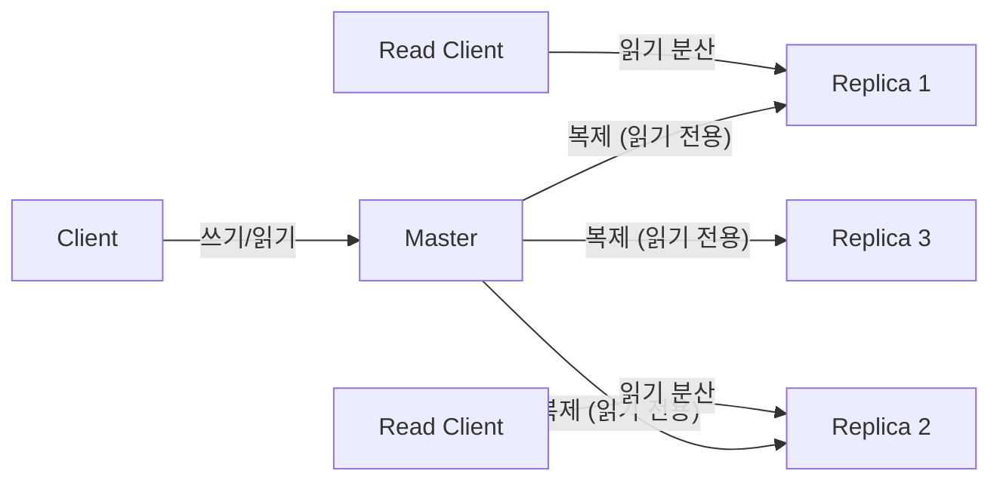
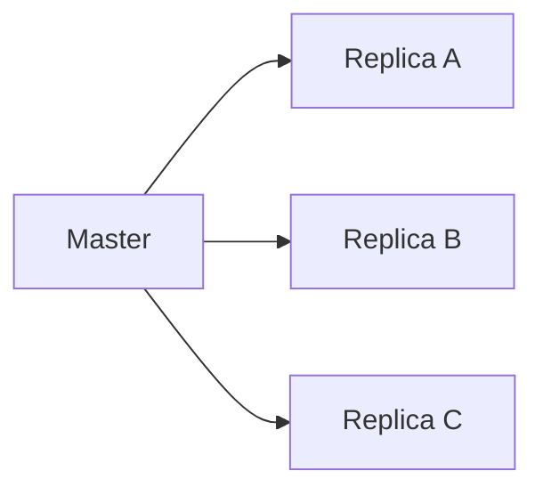
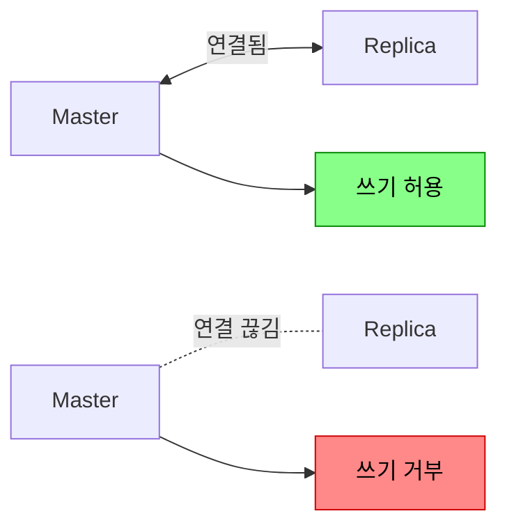
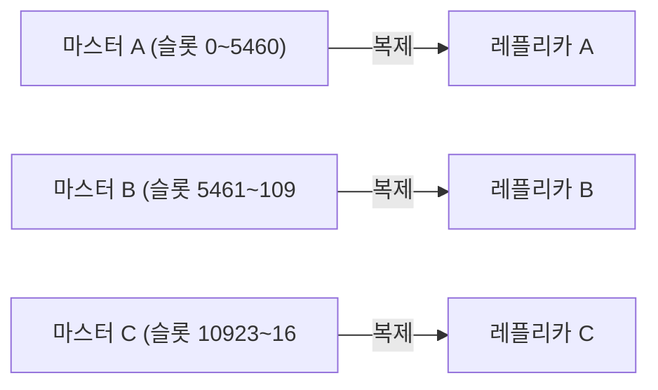

새벽 2시, Redis 마스터 서버의 디스크가 고장났다. 복제 없이 단일 Redis만 운영 중이었다면? 캐시 데이터는 전부 날아간다. 서비스가 재개되어도 모든 캐시가 비어있으니 DB에 쿼리가 폭발적으로 몰린다. DB도 죽는다. 복제(Replication)는 이 연쇄 장애를 막는 첫 번째 방어선이다.

## 복제란 무엇이고 왜 필요한가

> **비유**: 복제는 중요한 계약서를 복사해 여러 금고에 나눠 보관하는 것과 같다. 본사 금고(마스터)가 털리거나 불타도 지점 금고(레플리카)에 동일한 사본이 있어 업무를 이어갈 수 있다. 복사본이 1초 정도 늦게 업데이트될 수 있지만, 아예 없는 것보다 훨씬 낫다.

Redis 복제는 **마스터(Master)** 노드의 데이터를 하나 이상의 **레플리카(Replica)** 노드에 실시간으로 복사하는 기능이다.



**복제를 쓰는 세 가지 이유**:

| 목적 | 설명 | 없으면? |
|------|------|---------|
| **고가용성** | 마스터 장애 시 레플리카가 승격 | 장애 시 서비스 중단 |
| **읽기 분산** | 읽기 요청을 레플리카로 분산 | 마스터 과부하 |
| **백업** | 레플리카에서 RDB 스냅샷 생성 | 마스터 부하 증가 |

---

## 복제 설정

```bash
# 레플리카 서버의 redis.conf
replicaof 192.168.1.100 6379

# 또는 런타임에 동적 설정
REPLICAOF 192.168.1.100 6379

# 마스터에 인증이 있는 경우
masterauth "your_password"

# 레플리카를 독립 마스터로 전환 (페일오버 시)
REPLICAOF NO ONE
```

---

## 복제 동작 원리 — 세 단계

### 1단계: 전체 동기화 (Full Sync)

레플리카가 **최초 연결**되거나 **오랫동안 끊겼다가 재연결**될 때 수행된다. 마스터의 전체 데이터를 RDB 스냅샷으로 받는다.

participant Rep as "Replica" participant M as "Master" Rep->>M: PSYNC ? -1 (처음 연결, 아이디 없음)

**주의**: Full Sync 중 마스터는 BGSAVE + 버퍼 유지로 메모리를 추가 사용한다. 데이터가 수 GB라면 메모리 사용량이 일시적으로 크게 증가한다. 메모리가 넉넉하지 않은 환경에서 레플리카를 여러 개 붙이면 OOM 위험이 있다.

### 2단계: 부분 동기화 (Partial Sync)

연결이 **잠시 끊겼다가** 재연결되면, 끊긴 부분부터 이어서 동기화한다. 전체를 다시 받을 필요가 없다.

participant Rep as "Replica" participant M as "Master" Note over M: replication backlog (원형 버퍼)<br>cmd1, cmd2, cmd3, cmd4, cmd5

**Partial Sync가 실패하는 경우**: 레플리카가 너무 오래 끊겨서 마스터의 backlog에 해당 offset이 없을 때 → Full Sync로 폴백된다.

```bash
# backlog가 너무 작으면 잠깐 끊겨도 Full Sync 발생
# 네트워크 불안정 환경에서는 크게 설정
repl-backlog-size 256mb
repl-backlog-ttl 3600   # 레플리카가 없어도 1시간 backlog 유지
```

### 3단계: 명령어 전파 (Command Propagation)

동기화 완료 후, 마스터의 모든 쓰기 명령어가 **실시간으로** 레플리카에 전파된다.

participant C as Client participant M as Master participant R1 as Replica

**비동기**: 마스터는 레플리카의 응답을 기다리지 않는다. 그래서 마스터는 빠르지만, 레플리카는 항상 마스터보다 약간 뒤처진다(Replication Lag).

---

## 복제 토폴로지

### 스타 복제 (기본)



마스터가 모든 레플리카에 직접 전파. 지연이 짧지만 레플리카 수가 많을수록 마스터의 네트워크 부하가 선형으로 증가한다.

### 체인 복제 (Cascading)


Replica A가 B에게, B가 C에게 전파. 마스터 부하는 줄지만, 전파 지연이 단계만큼 누적된다. 레플리카가 매우 많거나 대역폭이 좁은 환경에서 사용한다.

---

## 비동기 복제의 한계 — 데이터 유실 시나리오

participant C as "Client" participant M as "Master" participant Rep as "Replica"

### WAIT 명령어 — 동기 복제 흉내

중요한 데이터를 쓸 때 최소 N개 레플리카가 받을 때까지 기다릴 수 있다:

```bash
SET important:data "critical"
WAIT 2 5000
# 최소 2개 레플리카가 ACK할 때까지 최대 5초 대기
# 반환값: 실제로 ACK한 레플리카 수
```

**주의**: `WAIT`는 강한 일관성을 **보장하지 않는다**. 레플리카가 "받았다"는 ACK이지, 디스크에 영속화했다는 보장이 아니다. 레플리카가 ACK 직후 크래시하면 여전히 유실된다. 그래도 유실 확률은 크게 줄어든다.

### min-replicas-to-write — 레플리카 없으면 쓰기 거부

```bash
# redis.conf (마스터)
min-replicas-to-write 1    # 최소 1개 레플리카 연결 시만 쓰기 허용
min-replicas-max-lag 10    # 레플리카 지연 10초 이내여야 함
```



마스터 혼자 남으면 쓰기를 거부해서 **장애 시 데이터 유실 범위를 제한**한다. 유실보다 가용성 저하가 낫다는 선택이다.

---

## Sentinel — 자동 장애 조치

수동으로 레플리카를 승격시키는 것은 새벽 2시에는 비현실적이다. Redis Sentinel이 자동으로 처리한다.

자세한 동작은 [Redis 배포 모드](/redis/redis-cluster-sentinel) 포스트 참조.

---

## Redis Cluster에서의 복제

Redis Cluster는 **샤딩 + 복제**를 결합한다:



- 각 마스터가 해시 슬롯의 일부를 담당하고, 자신의 레플리카를 가진다.
- 마스터 장애 시 해당 레플리카가 자동 승격.
- **과반수 마스터가 죽으면** 클러스터 전체가 멈추므로 최소 마스터 3개가 필요하다.

---

## 복제 모니터링

```bash
INFO replication
```

```
role:master
connected_slaves:2
slave0:ip=10.0.0.2,port=6379,state=online,offset=123456,lag=0
slave1:ip=10.0.0.3,port=6379,state=online,offset=123450,lag=1
master_repl_offset:123456
repl_backlog_active:1
repl_backlog_size:1048576
```

| 지표 | 의미 | 경고 기준 |
|------|------|---------|
| `lag` | 레플리카 지연 (초) | 1초 초과 시 주의 |
| `master_repl_offset - slave_offset` | 바이트 단위 지연 | 지속 증가 시 문제 |
| `state` | 연결 상태 | `online`이 아니면 문제 |
| `repl_backlog_size` | 부분 동기화 버퍼 크기 | 너무 작으면 Full Sync 빈발 |

---

## 실무 설정 권장

```bash
# redis.conf (마스터)
repl-backlog-size 256mb          # 네트워크 불안정 대비 버퍼 확장
repl-backlog-ttl 3600            # 레플리카 없어도 1시간 backlog 유지
min-replicas-to-write 1          # 최소 1개 레플리카 연결 시만 쓰기 허용
min-replicas-max-lag 10          # 레플리카 지연 10초 이내

# redis.conf (레플리카)
replica-read-only yes            # 레플리카에 직접 쓰기 방지 (데이터 불일치 예방)
replica-serve-stale-data yes     # 동기화 중에도 (약간 오래된) 데이터 제공
```

---

## 정리

| 항목 | 핵심 |
|------|------|
| 복제 방식 | 비동기 기본, `WAIT`로 준동기 가능 |
| 초기 동기화 | Full Sync (RDB 스냅샷 전송) |
| 재연결 | Partial Sync (backlog 활용, 실패 시 Full Sync) |
| 데이터 유실 | 비동기 특성상 발생 가능 → `WAIT`, `min-replicas-to-write`로 완화 |
| 장애 조치 | Sentinel (자동 failover) 또는 Cluster 내장 |

---

## 왜 Redis 복제를 알아야 하는가? (vs 단순 백업)

복제는 단순 백업이 아니라 HA(고가용성)와 읽기 확장의 기반이다. 비동기 복제의 특성을 모르면 failover 시 데이터 유실량을 예측할 수 없고, 레플리카에서 읽을 때 stale 데이터 가능성을 간과한다. Sentinel과 Cluster 모두 복제 위에서 동작하므로 복제 원리를 이해해야 장애 대응이 가능하다.

---

## 실무에서 자주 하는 실수

**실수 1: 레플리카를 읽기 전용으로만 알고 stale 데이터 무시**
`replica-read-only yes`(기본)로 레플리카에서만 읽기를 처리한다. 비동기 복제 지연(replication lag)으로 마스터에 쓴 데이터가 레플리카에 아직 반영되지 않아 이전 값을 반환할 수 있다. 강한 일관성이 필요한 읽기는 반드시 마스터에서 수행해야 한다.

**실수 2: Full Sync 유발 조건을 모르고 운영**
레플리카가 오랫동안 마스터와 단절됐다가 재연결되면 Partial Sync(repl-backlog-size 내에 있으면)가 실패하고 Full Sync가 발생한다. 마스터가 RDB 스냅샷을 생성하는 동안 fork()로 CPU/메모리 스파이크가 발생한다. `repl-backlog-size`를 충분히 크게(수백MB) 설정해야 한다.

**실수 3: min-replicas-to-write 미설정**
기본값에서 마스터는 레플리카 수에 상관없이 쓰기를 허용한다. 레플리카가 모두 다운돼도 마스터만으로 운영되다가 마스터 장애 시 데이터가 유실된다. `min-replicas-to-write 1`, `min-replicas-max-lag 10`으로 최소 보장을 설정한다.

**실수 4: WAIT 명령의 존재를 모르고 동기 복제가 불가능하다고 오해**
`WAIT numreplicas timeout` 명령으로 지정한 수의 레플리카가 최신 쓰기를 확인할 때까지 블로킹 대기할 수 있다. 완전한 동기 복제는 아니지만 중요한 쓰기 후 복제 확인이 필요한 경우 활용 가능하다.

**실수 5: 레플리카에서 CONFIG REWRITE 후 마스터 정보 유실**
레플리카의 `replicaof` 설정이 `CONFIG REWRITE`로 덮어써지지 않는 경우가 있다. 재시작 후 마스터를 모르는 독립 노드로 동작한다. 설정 파일을 직접 확인하고 `replicaof <master-ip> <port>`가 올바르게 기록됐는지 검증해야 한다.

---

## 면접 포인트

**Q1. Redis 복제의 동작 순서는?**
① 레플리카가 마스터에 `PSYNC replicationId offset` 전송 ② 마스터가 backlog에 offset이 있으면 Partial Sync(차분 전송), 없으면 Full Sync ③ Full Sync: 마스터 fork → RDB 생성 → 레플리카에 전송 → 전송 중 발생한 명령을 버퍼에서 추가 전송 ④ 이후 비동기로 명령 스트리밍.

**Q2. Replication ID란?**
마스터의 복제 히스토리를 식별하는 고유 ID다. failover 후 새 마스터는 새 Replication ID를 갖는다. 레플리카가 reconnect 시 자신이 가진 ID와 마스터의 ID가 다르면 Full Sync가 필요하다. Redis 4.0부터 secondary replication ID를 지원해 failover 후에도 Partial Sync가 가능하다.

**Q3. 복제 지연(Replication Lag)을 어떻게 모니터링하는가?**
`INFO replication`에서 각 레플리카의 `lag` 값을 확인한다(초 단위). Prometheus + redis_exporter로 `redis_connected_slave_lag_seconds` 메트릭을 수집하고 임계값(예: 10초) 초과 시 알림을 설정한다.

**Q4. 레플리카를 새 마스터로 승격 시 데이터 유실 가능성은?**
비동기 복제 특성상 마스터 장애 직전 쓰기가 레플리카에 복제되지 않았을 수 있다. 유실량은 `repl-backlog` 미전송 분량이다. `min-replicas-to-write`와 `WAIT`으로 최소화할 수 있지만 완전 제거는 불가하다. Redis를 주 데이터 저장소로 쓰지 않고 캐시로 쓰는 이유 중 하나다.

**Q5. 체인 복제(레플리카의 레플리카)는 가능한가?**
가능하다(`replicaof replica-ip port`). 마스터 → 레플리카 A → 레플리카 B 구조로 마스터의 복제 부담을 줄일 수 있다. 단, 복제 지연이 누적되고 체인이 길수록 장애 전파 복잡도가 높아진다. 일반적으로 2단계 이상의 체인은 권장하지 않는다.

---
## 극한 시나리오

### 시나리오 1: 마스터 장애 — 레플리카 승격 중 데이터 유실

마스터가 갑자기 다운됩니다. Sentinel이 레플리카를 새 마스터로 승격하는 데 30초 소요됩니다.

**유실 구간:**
- 마스터 다운 직전 3초간 처리된 쓰기 → 레플리카에 미반영 상태
- Sentinel이 ODOWN 판정하는 데 10~15초
- 레플리카 승격 완료까지 추가 15~20초
- 이 30~35초 동안 쓰기 불가, 다운 직전 데이터 유실 가능

```java
// WAIT 명령으로 최소 복제 보장 (유실 최소화)
// 1개 레플리카 확인 후 응답, 최대 500ms 대기
Long replicasAcked = redisTemplate.execute(
    (RedisCallback<Long>) conn -> conn.wait(1, 500)
);
if (replicasAcked < 1) {
    log.warn("복제 지연 감지: 레플리카 동기화 미완료");
    // 중요 데이터라면 DB에 직접 저장
}
```

**실전 대응:**
- `min-replicas-to-write 1`, `min-replicas-max-lag 10` 설정
- 마스터가 레플리카와 10초 이상 동기화되지 않으면 쓰기 거부
- 레플리카 없는 상태에서 중요 데이터를 쓰지 않아 유실 0화

**수치:** 
- 설정 없는 경우: 마스터 장애 시 최대 수십 초치 데이터 유실
- `min-replicas-to-write 1` 적용: 유실 최소화(레플리카 동기화 시점까지만)

### 시나리오 2: 전체 동기화 폭풍 — 다수 레플리카 동시 재연결

배포 재시작으로 레플리카 5개가 동시에 마스터에 재연결을 시도합니다.

**무슨 일이 발생하는가:**
1. 레플리카 5개가 동시에 `PSYNC` 요청
2. 마스터의 replication backlog가 충분하지 않으면 Full Sync 5회 발생
3. 각 Full Sync마다 RDB 스냅샷 생성(fork) + 전송
4. fork 시 CoW(Copy-on-Write) 메모리 사용량 2배 → OOM 위험
5. 대규모 RDB 전송으로 네트워크 포화 → 마스터 응답 지연 급증

```bash
# backlog 크기를 충분히 설정 (기본 1MB는 너무 작음)
# redis.conf
repl-backlog-size 512mb  # 피크 쓰기량 × 예상 재연결 시간
repl-backlog-ttl 3600

# 레플리카 재연결 시간 분산 (배포 스크립트에서)
for i in 1 2 3 4 5; do
  restart_replica $i
  sleep 30  # 레플리카별 30초 간격
done
```

### 시나리오 3: 복제 지연으로 인한 읽기 불일치

마스터에 썼는데 레플리카에서 이전 값이 조회됩니다. 사용자가 "방금 수정했는데 반영이 안 됐다"고 신고합니다.

**발생 조건:**
- 마스터 쓰기 TPS 높음 → 복제 버퍼 누적 → 레플리카 지연 수백 ms~수초
- 쓰기 후 즉시 레플리카에서 읽기 → 이전 값 반환

```java
// 패턴 1: 쓰기 후 읽기는 마스터에서 (Read-Your-Writes)
@Service
public class UserProfileService {
    @Autowired private StringRedisTemplate masterRedis;    // 마스터 전용
    @Autowired private StringRedisTemplate replicaRedis;  // 레플리카 전용

    public void updateProfile(Long userId, UserProfile profile) {
        String key = "profile:" + userId;
        masterRedis.opsForValue().set(key, serialize(profile));
    }

    public UserProfile getProfile(Long userId, boolean freshRead) {
        String key = "profile:" + userId;
        // 방금 수정한 경우 마스터에서 조회
        StringRedisTemplate template = freshRead ? masterRedis : replicaRedis;
        return deserialize(template.opsForValue().get(key));
    }
}

// 패턴 2: 복제 지연 모니터링 및 알림
// INFO replication의 slave_repl_offset과 master_repl_offset 차이가
// 임계값(예: 10MB) 초과 시 알림
```
