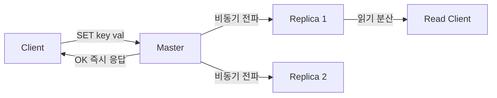
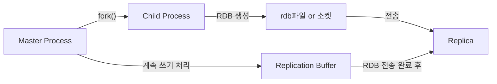
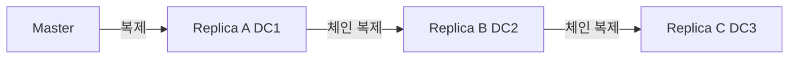

새벽 2시, Redis 마스터 서버의 디스크가 고장났다. 복제 없이 단일 Redis만 운영 중이었다면? 캐시 데이터는 전부 날아간다. 서비스가 재개되어도 모든 캐시가 비어있으니 DB에 쿼리가 폭발적으로 몰린다. DB도 죽는다. 복제(Replication)는 이 연쇄 장애를 막는 첫 번째 방어선이다. 그런데 "복제가 뭔지" 아는 것과 "복제가 왜 그렇게 동작하는지" 아는 것 사이에는 면접에서 당락을 가르는 깊이의 차이가 있다.

이 포스트는 PSYNC 프로토콜 내부, fork()와 Copy-on-Write의 메모리 역학, Replication ID가 두 개인 이유, 레플리카 체인의 전파 지연까지 원리 중심으로 파고든다.

---

## 복제란 무엇이고 왜 비동기인가

Redis 복제는 마스터(Master) 노드의 데이터를 하나 이상의 레플리카(Replica) 노드에 실시간으로 복사하는 기능이다. 핵심은 **기본이 비동기(asynchronous)**라는 점이다.

왜 비동기인가? Redis의 설계 철학은 단일 스레드 이벤트 루프에서 초당 수십만 건의 명령을 처리하는 것이다. 마스터가 레플리카의 ACK를 기다리는 순간, 이벤트 루프가 블로킹되고 전체 처리량이 무너진다. 마스터는 레플리카에 명령을 "쏘고(fire-and-forget)" 즉시 다음 클라이언트 요청을 처리한다. 레플리카는 자신의 속도로 따라간다.

이 선택의 대가는 **최종 일관성(eventual consistency)**이다. 마스터에 쓴 직후 레플리카에서 읽으면 이전 값이 나올 수 있다. 이것은 버그가 아니라 설계 특성이다.



**복제를 쓰는 세 가지 이유**:

| 목적 | 설명 | 없으면? |
|------|------|---------|
| **고가용성** | 마스터 장애 시 레플리카 승격 | 장애 시 서비스 전체 중단 |
| **읽기 확장** | 읽기 요청을 레플리카로 분산 | 마스터 단일 병목 |
| **오프로드 백업** | 레플리카에서 BGSAVE, AOF 처리 | 마스터 디스크 I/O 부하 증가 |

---

## 전체 동기화(Full Sync) — fork()와 Copy-on-Write의 역학

### PSYNC 프로토콜 시작

레플리카가 최초 연결되거나 오랫동안 끊겼다가 재연결되면 전체 동기화가 발생한다. 레플리카는 마스터에 `PSYNC ? -1`을 보낸다. 물음표(?)는 "나는 마스터의 Replication ID를 모른다", -1은 "처음 연결이다"를 뜻한다. 마스터는 `+FULLRESYNC <replid> <offset>`으로 응답하며 RDB 스냅샷 생성을 시작한다.

### fork()가 왜 필요한가

Redis는 단일 스레드다. RDB 스냅샷을 생성하는 동안 클라이언트 요청을 처리해야 한다. 두 작업을 동시에 하려면? Unix의 `fork()` 시스템 콜을 사용한다. 마스터 프로세스가 fork()를 호출하면 자식 프로세스(child)가 생성된다. 자식이 RDB를 만드는 동안 부모(Redis 메인 프로세스)는 계속 클라이언트 요청을 받는다.



### Copy-on-Write(CoW) — 메모리가 두 배가 되는 이유

fork() 직후 부모와 자식은 **동일한 물리 메모리 페이지를 공유**한다. OS는 두 프로세스가 같은 페이지를 읽기만 하는 한 실제로 복사하지 않는다. 이것이 Copy-on-Write다.

문제는 부모(마스터)가 계속 쓰기 요청을 받는다는 것이다. 클라이언트가 `SET key newvalue`를 보내면, 그 key가 있는 메모리 페이지를 수정해야 한다. OS는 수정 직전에 그 페이지를 복사해서 부모에게 새 복사본을 주고 자식은 원본을 유지한다. 이것이 "쓸 때 복사(Copy-on-Write)"다.

**최악의 경우**: RDB 생성 중 마스터에 쓰기가 폭발적으로 들어오면, 거의 모든 페이지가 복사된다. 메모리 사용량이 2배에 가까워진다. 100GB 데이터셋에서 Full Sync를 트리거하면 마스터는 순간 200GB에 가까운 메모리가 필요해진다.

### vm.overcommit_memory 설정이 필수인 이유

Linux는 기본적으로 메모리 오버커밋을 제한한다(`vm.overcommit_memory=0`). 시스템 여유 메모리보다 더 많은 메모리를 `malloc()`으로 요청하면 실패한다. Redis가 fork()를 호출할 때 이론상 현재 메모리의 2배가 필요하다. 여유 메모리가 부족하면 fork() 자체가 실패한다.

```bash
# 현재 설정 확인
cat /proc/sys/vm/overcommit_memory
# 0: 휴리스틱 (기본, Redis에 불리)
# 1: 항상 허용 (Redis 권장)
# 2: ratio 기반 제한

# Redis 권장 설정
echo 1 > /proc/sys/vm/overcommit_memory
# 영구 적용
echo "vm.overcommit_memory = 1" >> /etc/sysctl.conf
sysctl -p
```

`vm.overcommit_memory=1`로 설정하면 OS가 메모리 요청을 항상 허용한다. 실제 메모리가 부족하면 나중에 OOM Killer가 개입하지만, fork() 자체는 성공한다.

### Huge Pages 문제 — CoW를 더 비싸게 만드는 것

Linux의 Transparent Huge Pages(THP)는 4KB 페이지 대신 2MB 페이지를 사용해 TLB 효율을 높인다. 문제는 CoW 단위가 2MB가 된다는 것이다. 1바이트만 수정해도 2MB를 복사한다. Redis에서 THP를 비활성화하는 이유다.

```bash
# THP 비활성화 (Redis 공식 권장)
echo never > /sys/kernel/mm/transparent_hugepage/enabled

# 영구 적용 (rc.local 또는 systemd)
echo "echo never > /sys/kernel/mm/transparent_hugepage/enabled" >> /etc/rc.local
```

### Replication Buffer(복제 버퍼) — RDB 전송 중 쓰인 명령의 행방

RDB 스냅샷을 레플리카에 전송하는 동안(수십 초~수분) 마스터에는 계속 쓰기가 들어온다. 이 명령들은 어디에 저장되는가? **Replication Buffer**에 쌓인다. RDB 전송이 완료되면 마스터는 이 버퍼의 내용을 레플리카에 추가로 전송해 동기화를 완성한다.

레플리카가 여러 개이고 각각 별도의 Replication Buffer를 갖는다는 점도 중요하다. 레플리카 10개가 동시에 Full Sync를 요청하면 버퍼도 10개가 생성된다. `client-output-buffer-limit replica 256mb 64mb 60` 설정으로 버퍼 크기를 제한할 수 있다. 버퍼가 가득 차면 해당 레플리카 연결이 끊기고 다시 Full Sync가 시작된다 — 재동기화 루프가 발생할 수 있다.

전체 동기화 흐름을 단계별로 정리하면:

```
1. Replica → Master: PSYNC ? -1
2. Master: BGSAVE 명령 실행 → fork() → child가 RDB 생성 시작
3. Master(부모): 클라이언트 쓰기를 계속 처리, 새 명령을 Replication Buffer에 복사
4. Child: RDB 직렬화 완료 → 소켓 또는 디스크에 저장
5. Master → Replica: RDB 파일 스트리밍 전송
6. Replica: 기존 데이터 전체 삭제 → RDB 로딩
7. Master → Replica: Replication Buffer의 명령 스트리밍
8. 이후: 비동기 명령 전파(Command Propagation) 모드
```

---

## Diskless 복제 — 디스크를 건너뛰는 이유

### 기본 방식의 문제: 느린 디스크

기본 Full Sync에서 마스터의 child 프로세스는 RDB를 **디스크에 파일로 저장**한 다음 레플리카에 전송한다. 디스크 I/O가 느리면(HDD, 네트워크 스토리지) 이 단계가 병목이 된다. 100GB RDB를 디스크에 쓰는 데 수분, 거기에 레플리카로 전송하는 데 수분이 더 걸린다.

### Diskless 복제: 소켓으로 직접

`repl-diskless-sync yes`를 설정하면 child 프로세스가 RDB를 디스크에 저장하지 않고 **레플리카 소켓에 직접 스트리밍**한다. 디스크 쓰기 시간이 완전히 제거된다.

```bash
# redis.conf (마스터)
repl-diskless-sync yes
# 레플리카가 여러 개일 때 모두 모아서 한 번에 전송하기 위한 대기 시간
repl-diskless-sync-delay 5   # 5초 대기 후 전송 시작
# 동시 전송할 레플리카 수 (0=무제한)
repl-diskless-sync-max-replicas 0
```

`repl-diskless-sync-delay`의 존재 이유: 레플리카 1이 연결된 직후 전송을 시작하면 레플리카 2가 3초 후 연결됐을 때 별도의 RDB 스트리밍을 또 시작해야 한다. delay 동안 기다리면 여러 레플리카에 **하나의 RDB 스트림을 멀티캐스트**할 수 있다.

**Diskless가 유리한 조건**:
- SSD보다 느린 디스크 환경
- 네트워크가 디스크보다 빠른 환경 (10GbE 이상)
- 레플리카가 여러 개일 때 멀티캐스트 효과

**Diskless가 불리한 조건**:
- 레플리카 수가 1개이고 네트워크가 느릴 때: 전송 중 중단되면 처음부터 다시 해야 함 (파일 기반은 재전송 가능)

---

## 부분 동기화(Partial Sync) — Replication Backlog의 내부 구조

### Replication Backlog란

마스터는 항상 **replication backlog**라는 원형 버퍼(ring buffer)를 메모리에 유지한다. 마스터에 쓰이는 모든 명령의 바이트 스트림을 이 버퍼에 순서대로 저장한다. 크기는 `repl-backlog-size`로 설정하고 기본값은 1MB다.

레플리카가 연결을 잃었다가 재연결되면 마스터에 `PSYNC <replid> <offset>`을 보낸다. 마스터는 자신의 backlog에 그 offset 이후의 데이터가 있으면 해당 구간만 전송한다. 이것이 Partial Sync다.

원형 버퍼이므로 오래된 데이터는 새 데이터에 의해 덮어써진다. backlog가 1MB인데 마스터에 초당 10MB의 쓰기가 들어오면 0.1초 만에 backlog가 꽉 찬다. 레플리카가 0.2초만 끊겨도 Partial Sync가 불가능해지고 Full Sync로 폴백된다.

```bash
# 계산식: repl-backlog-size 최솟값
# = 마스터 초당 쓰기 바이트 × 예상 최대 단절 시간(초)
# 예: 쓰기 50MB/s, 최대 60초 단절 예상
# → 50MB × 60 = 3000MB → 최소 3GB 설정

repl-backlog-size 3gb
# 레플리카가 모두 사라진 후에도 backlog 유지 시간
repl-backlog-ttl 3600
```

### Partial Sync가 실패하는 세 가지 경우

**1. Replication ID 불일치**: 레플리카가 기억하는 replid가 현재 마스터의 replid, replid2 중 어느 것과도 다를 때. Failover 후 새 마스터가 들어왔는데 레플리카가 이전 replid2조차 모를 때 발생.

**2. Offset이 backlog 범위 밖**: 레플리카의 offset이 마스터 backlog에서 이미 덮어써진 구간을 가리킬 때. backlog 크기가 작거나 단절 시간이 길 때.

**3. backlog 자체가 없을 때**: `repl-backlog-ttl` 만료로 backlog가 해제된 후 레플리카가 연결될 때.

Partial Sync 실패 시 마스터는 `+FULLRESYNC`를 응답해 Full Sync로 폴백한다. 운영 중에 이 패턴이 반복되면 심각한 문제다. `INFO stats`의 `sync_full` 카운터로 Full Sync 발생 횟수를 모니터링해야 한다.

---

## Replication ID — 왜 두 개인가 (replid vs replid2)

### Replication ID의 역할

Replication ID(replid)는 마스터의 복제 히스토리를 식별하는 40자 16진수 문자열이다. 마스터가 시작될 때 무작위로 생성된다. 레플리카는 자신이 동기화된 마스터의 replid와 현재까지 받은 offset을 기억한다.

레플리카가 재연결할 때 `PSYNC <내가 아는 replid> <내 offset>`을 보내면 마스터는 "이 레플리카는 나의 복제 히스토리를 알고 있다"고 확인하고 Partial Sync를 허용한다.

### 왜 두 번째 ID(replid2)가 필요한가

Redis 4.0 이전에는 replid가 하나였다. Failover가 발생하면 새 마스터는 새로운 replid를 생성했다. 기존 레플리카들은 이전 replid를 기억하고 있으므로 새 마스터의 replid와 달라서 전부 Full Sync를 해야 했다.

Redis 4.0에서 **secondary replication ID(replid2)**가 도입됐다. 동작 방식:

```
1. 마스터 A: replid=AAAA, offset=10000
2. 레플리카 B: replid(기억)=AAAA, offset=9800
3. 마스터 A 장애 → 레플리카 B가 새 마스터로 승격
4. 새 마스터 B:
   - 새 replid=BBBB (새로운 복제 히스토리 시작)
   - replid2=AAAA (이전 마스터의 ID를 "전 ID로 기억")
   - offset2=9800 (승격 시점의 offset)
5. 다른 레플리카 C가 reconnect: PSYNC AAAA 9500 전송
6. 새 마스터 B: "AAAA는 내 replid2다, 9500은 offset2(9800) 이하다 → Partial Sync 가능"
```

replid2가 없으면 Failover 시 클러스터의 모든 레플리카가 동시에 Full Sync를 해야 한다. 100GB 데이터셋에 레플리카 5개라면 재동기화 폭풍이 발생한다.

```bash
# INFO replication 출력에서 확인
master_replid:8b3d4f6a2c1e9d8f7a6b5c4d3e2f1a0b9c8d7e6f
master_replid2:0000000000000000000000000000000000000000
# replid2가 전부 0이면 아직 Failover가 없었다는 뜻
```

**Failover 후 레플리카가 새 마스터에 붙을 때**:

```bash
master_replid:NEW_ID_XXXX
master_replid2:OLD_ID_AAAA     # 이전 마스터의 ID
second_repl_offset:9800        # 이전 마스터에서 승격 시점 offset
```

레플리카가 `PSYNC OLD_ID_AAAA 9500`을 보내면, 새 마스터는 replid2=OLD_ID_AAAA와 일치, 9500 <= second_repl_offset(9800)이므로 Partial Sync를 허용한다.

---

## 복제 지연(Replication Lag) — 왜 발생하고 어떻게 측정하는가

### 지연의 세 가지 원인

**1. 네트워크 전파 지연**: 마스터와 레플리카 사이의 RTT. 같은 IDC 내에서는 수 ms, 지역이 다르면 수십~수백 ms.

**2. 마스터 쓰기 TPS 과부하**: 마스터 초당 쓰기 바이트 > 레플리카가 처리할 수 있는 바이트. 레플리카의 명령 처리 속도가 마스터 쓰기 속도를 따라가지 못하면 backlog가 쌓이고 지연이 누적된다.

**3. 레플리카 느린 처리**: 레플리카에서 blocking 명령, 대량 LRANGE 등 느린 명령이 실행되면 복제 스트림 처리가 지연된다.

### INFO replication으로 지연 측정

```bash
redis-cli INFO replication
```

```
role:master
connected_slaves:2
slave0:ip=10.0.0.2,port=6379,state=online,offset=123456,lag=0
slave1:ip=10.0.0.3,port=6379,state=online,offset=123200,lag=1
master_repl_offset:123456
repl_backlog_active:1
repl_backlog_size:268435456
repl_backlog_first_byte_offset:1
repl_backlog_histlen:123456
```

`lag`는 초 단위 추정치다. 더 정밀한 측정은 바이트 차이다:
- slave0 지연: `123456 - 123456 = 0 bytes`
- slave1 지연: `123456 - 123200 = 256 bytes`

바이트 차이가 지속적으로 증가하면 레플리카가 따라가지 못하고 있다는 신호다.

### WAIT 명령 — 준동기 복제 흉내

```bash
SET important:key "critical_value"
WAIT 2 5000
# 최소 2개 레플리카가 이 offset까지 받았다는 ACK를 보낼 때까지
# 최대 5000ms(5초) 블로킹
# 반환값: 실제 ACK한 레플리카 수
```

WAIT의 의미론: 마스터는 레플리카에 `REPLCONF GETACK *`를 보내 현재 offset을 응답받는다. 지정한 수의 레플리카가 응답하거나 timeout에 도달하면 반환한다.

**WAIT의 한계**: "레플리카가 명령을 받았다"는 ACK이지, 디스크에 fsync했다는 보장이 아니다. 레플리카가 ACK 직후 전원이 나가면 여전히 유실된다. 완전한 동기 복제는 아니지만 비동기 대비 유실 확률을 크게 줄인다.

**왜 최종 일관성(Eventual Consistency)인가**: WAIT를 쓰지 않는 한, 마스터는 레플리카의 응답을 전혀 기다리지 않는다. 클라이언트가 `SET key val`에 OK를 받는 시점은 마스터의 메모리에 반영된 시점이지, 레플리카에 전달된 시점이 아니다. 네트워크 패킷이 레플리카에 도달하기까지의 지연이 항상 존재하므로 복제는 구조적으로 최종 일관성이다.

---

## 읽기/쓰기 분리 — Lettuce ReadFrom 전략

### 왜 읽기 분리가 필요한가

읽기 트래픽이 쓰기보다 10배 많은 서비스(대부분의 웹 서비스)에서 마스터 하나에 모든 읽기를 보내면 마스터가 병목이 된다. 레플리카로 읽기를 분산하면 마스터는 쓰기에 집중하고 읽기는 수평 확장된다.

### Lettuce ReadFrom 전략 종류

Lettuce(Spring Data Redis의 기본 클라이언트)는 `ReadFrom` 설정으로 읽기 요청을 어느 노드로 보낼지 결정한다.

```java
import io.lettuce.core.ReadFrom;
import org.springframework.context.annotation.Bean;
import org.springframework.context.annotation.Configuration;
import org.springframework.data.redis.connection.lettuce.LettuceClientConfiguration;
import org.springframework.data.redis.connection.lettuce.LettuceConnectionFactory;
import org.springframework.data.redis.connection.RedisStaticMasterReplicaConfiguration;

@Configuration
public class RedisReplicationConfig {

    /**
     * ReadFrom.REPLICA_PREFERRED:
     * 레플리카 우선 읽기. 레플리카 없거나 모두 다운 시 마스터에서 읽음.
     * Stale read 가능성 있음. 일반적인 읽기 분산에 적합.
     */
    @Bean
    public LettuceConnectionFactory replicaPreferredConnectionFactory() {
        LettuceClientConfiguration clientConfig = LettuceClientConfiguration.builder()
                .readFrom(ReadFrom.REPLICA_PREFERRED)
                .build();

        RedisStaticMasterReplicaConfiguration serverConfig =
                new RedisStaticMasterReplicaConfiguration("master-host", 6379);
        serverConfig.addNode("replica1-host", 6379);
        serverConfig.addNode("replica2-host", 6379);

        return new LettuceConnectionFactory(serverConfig, clientConfig);
    }

    /**
     * ReadFrom.MASTER:
     * 항상 마스터에서 읽음. Stale read 없음.
     * 읽기 분산 효과 없음. 강한 일관성이 필요한 경우에만 사용.
     */
    @Bean
    public LettuceConnectionFactory masterOnlyConnectionFactory() {
        LettuceClientConfiguration clientConfig = LettuceClientConfiguration.builder()
                .readFrom(ReadFrom.MASTER)
                .build();

        RedisStaticMasterReplicaConfiguration serverConfig =
                new RedisStaticMasterReplicaConfiguration("master-host", 6379);
        serverConfig.addNode("replica1-host", 6379);
        serverConfig.addNode("replica2-host", 6379);

        return new LettuceConnectionFactory(serverConfig, clientConfig);
    }

    /**
     * ReadFrom.NEAREST:
     * 네트워크 지연이 가장 낮은 노드에서 읽음 (마스터 포함).
     * 다중 리전 배포에서 레이턴시 최소화에 유리.
     * Stale read 가능성 있음.
     */
    @Bean
    public LettuceConnectionFactory nearestConnectionFactory() {
        LettuceClientConfiguration clientConfig = LettuceClientConfiguration.builder()
                .readFrom(ReadFrom.NEAREST)
                .build();

        RedisStaticMasterReplicaConfiguration serverConfig =
                new RedisStaticMasterReplicaConfiguration("master-host", 6379);
        serverConfig.addNode("replica1-host", 6379);
        serverConfig.addNode("replica2-host", 6379);

        return new LettuceConnectionFactory(serverConfig, clientConfig);
    }
}
```

### ReadFrom 전략 비교

| ReadFrom | 읽기 대상 | Stale Read | 용도 |
|----------|-----------|------------|------|
| `MASTER` | 마스터만 | 없음 | 강한 일관성 필요 |
| `REPLICA` | 레플리카만, 없으면 실패 | 있음 | 레플리카 전용 읽기 |
| `REPLICA_PREFERRED` | 레플리카 우선, 없으면 마스터 | 있음 | 일반 읽기 분산 |
| `NEAREST` | 지연 최소 노드 | 있음 | 다중 리전 |
| `ANY` | 무작위 (마스터 포함) | 있음 | 부하 분산 |
| `ANY_REPLICA` | 레플리카 중 무작위 | 있음 | 레플리카 균등 분산 |

### Stale Read 완화 — 용도별 RedisTemplate 분리

Stale Read(오래된 읽기) 문제를 완화하는 가장 실용적인 패턴은 두 개의 RedisTemplate을 용도별로 분리하는 것이다.

```java
@Configuration
public class RedisTemplateConfig {

    // 마스터 전용 - 쓰기 + 강한 일관성 읽기
    @Bean("masterRedisTemplate")
    public StringRedisTemplate masterRedisTemplate(
            @Qualifier("masterOnlyConnectionFactory") LettuceConnectionFactory factory) {
        return new StringRedisTemplate(factory);
    }

    // 레플리카 우선 - 일반 읽기 (Stale 허용)
    @Bean("replicaRedisTemplate")
    public StringRedisTemplate replicaRedisTemplate(
            @Qualifier("replicaPreferredConnectionFactory") LettuceConnectionFactory factory) {
        return new StringRedisTemplate(factory);
    }
}

@Service
public class ProductService {

    @Qualifier("masterRedisTemplate")
    @Autowired
    private StringRedisTemplate masterTemplate;

    @Qualifier("replicaRedisTemplate")
    @Autowired
    private StringRedisTemplate replicaTemplate;

    /**
     * 재고 차감: 마스터에 쓰고 즉시 마스터에서 검증
     * 비동기 복제 지연으로 레플리카에서 읽으면 차감 전 값이 나올 수 있음
     */
    public void decreaseStock(String productId, int quantity) {
        String key = "stock:" + productId;
        Long remaining = masterTemplate.opsForValue().decrement(key, quantity);
        if (remaining != null && remaining < 0) {
            // 재고 부족: 롤백
            masterTemplate.opsForValue().increment(key, quantity);
            throw new InsufficientStockException("재고 부족: " + productId);
        }
        // 마스터에서 바로 확인해야 정확한 잔여 재고
        log.info("재고 차감 완료. 잔여: {}", remaining);
    }

    /**
     * 상품 목록 조회: Stale 허용. 레플리카 우선.
     * 1~2초 오래된 데이터는 사용자가 인지하기 어려움
     */
    public List<String> getProductList(String category) {
        String key = "products:" + category;
        // 레플리카에서 읽음 (마스터 부하 절감)
        return replicaTemplate.opsForList().range(key, 0, -1);
    }
}
```

### WAIT 명령으로 중요 쓰기 후 복제 확인

```java
@Service
public class OrderService {

    @Qualifier("masterRedisTemplate")
    @Autowired
    private StringRedisTemplate masterTemplate;

    /**
     * 주문 생성: 최소 1개 레플리카 동기화 확인
     * WAIT는 완전한 내구성을 보장하지 않지만 유실 확률을 크게 줄임
     */
    public void createOrder(Order order) {
        String key = "order:" + order.getId();
        masterTemplate.opsForValue().set(key, serialize(order));

        // 최소 1개 레플리카가 이 쓰기를 받을 때까지 최대 500ms 대기
        Long ackedReplicas = masterTemplate.execute(
                (RedisCallback<Long>) conn -> conn.serverCommands().waitForReplication(1, 500)
        );

        if (ackedReplicas == null || ackedReplicas < 1) {
            log.warn("주문 {} 복제 지연 감지. ackedReplicas={}", order.getId(), ackedReplicas);
            // 중요 데이터: DB에 동기 저장으로 이중화
            orderRepository.save(order);
        }
    }
}
```

---

## 레플리카 체인(Replica Chain) — A → B → C 토폴로지

### 왜 체인 복제가 필요한가

마스터 하나에 레플리카 20개를 붙이면 마스터의 네트워크 송신 부하가 선형으로 증가한다. 1MB 명령이 들어오면 20MB를 각 레플리카에 전송해야 한다. 마스터가 복제 부하 때문에 클라이언트 응답이 느려진다.

체인 복제(Cascading Replication)는 이 문제를 해결한다: 마스터는 1개의 레플리카에만 전파하고, 그 레플리카가 다음 레플리카에 전파한다.



### 체인 설정

```bash
# Replica A: 마스터에서 복제
replicaof master-host 6379

# Replica B: Replica A에서 복제 (마스터가 아닌 다른 레플리카를 마스터로 지정)
replicaof replica-a-host 6379

# Replica C: Replica B에서 복제
replicaof replica-b-host 6379
```

레플리카 A는 마스터처럼 동작해서 자신의 레플리카(B)에 명령을 전파한다. 레플리카 A는 여전히 마스터로부터 복제를 받고, 동시에 B에게 전파하는 중간 노드 역할을 한다.

### 체인의 실전 사용: 크로스 DC 복제

```
DC1 (서울): Master → Replica A
DC2 (도쿄): Replica A → Replica B  (DC1-DC2 WAN 링크 1회만 사용)
DC3 (싱가포르): Replica B → Replica C
```

마스터가 도쿄, 싱가포르 양쪽에 직접 전파하면 WAN 트래픽이 2배다. 체인을 쓰면 마스터는 도쿄로만 보내고 도쿄가 싱가포르로 전달한다.

### 체인의 한계: 전파 지연 누적

체인이 깊어질수록 전파 지연이 누적된다. 마스터 → A 지연 10ms, A → B 지연 50ms(WAN), B → C 지연 80ms(WAN)이면, 마스터에서 C까지 140ms가 걸린다. 마스터에서 C에 직접 전파하면 80+10=90ms. 체인이 지연을 줄이는 게 아니라 **마스터 부하를 줄이는 대가로 지연을 늘린다**는 점을 이해해야 한다.

체인이 끊기면 하위 레플리카 전체가 동기화 불능이 된다. A가 다운되면 B와 C도 마스터와의 연결이 끊긴다. 2단계 이상의 체인은 신중하게 사용해야 한다.

---

## 복제 관련 Spring Data Redis 설정 심화

### application.yml 완전 설정

```yaml
spring:
  data:
    redis:
      # 마스터-레플리카 구성 (Sentinel 없이 정적 설정)
      host: master-redis-host
      port: 6379
      password: your_password
      lettuce:
        pool:
          max-active: 50
          max-idle: 10
          min-idle: 5
          max-wait: 1000ms
        # 레플리카 설정은 코드로 처리 (아래 Config 클래스 참조)
```

### Sentinel 환경에서 ReadFrom 설정

```java
@Configuration
public class SentinelRedisConfig {

    @Bean
    public RedisConnectionFactory sentinelConnectionFactory() {
        // Sentinel 설정
        RedisSentinelConfiguration sentinelConfig =
                new RedisSentinelConfiguration("mymaster",
                        Set.of("sentinel1:26379", "sentinel2:26379", "sentinel3:26379"));
        sentinelConfig.setPassword(RedisPassword.of("your_password"));

        // 레플리카 우선 읽기 설정
        LettuceClientConfiguration clientConfig = LettuceClientConfiguration.builder()
                .readFrom(ReadFrom.REPLICA_PREFERRED)
                .commandTimeout(Duration.ofSeconds(2))
                .build();

        return new LettuceConnectionFactory(sentinelConfig, clientConfig);
    }

    @Bean
    public RedisTemplate<String, Object> redisTemplate(
            RedisConnectionFactory connectionFactory) {
        RedisTemplate<String, Object> template = new RedisTemplate<>();
        template.setConnectionFactory(connectionFactory);
        template.setKeySerializer(new StringRedisSerializer());
        template.setValueSerializer(new GenericJackson2JsonRedisSerializer());
        template.setHashKeySerializer(new StringRedisSerializer());
        template.setHashValueSerializer(new GenericJackson2JsonRedisSerializer());
        template.afterPropertiesSet();
        return template;
    }
}
```

### 복제 지연 모니터링 컴포넌트

```java
@Component
@Slf4j
public class ReplicationLagMonitor {

    @Autowired
    private StringRedisTemplate redisTemplate;

    /**
     * 마스터와 각 레플리카의 offset 차이를 모니터링
     * 임계값 초과 시 경고 로그 및 알림
     */
    @Scheduled(fixedDelay = 10000) // 10초마다 실행
    public void checkReplicationLag() {
        Map<String, String> replicationInfo = getReplicationInfo();

        String masterOffsetStr = replicationInfo.get("master_repl_offset");
        if (masterOffsetStr == null) return;

        long masterOffset = Long.parseLong(masterOffsetStr);
        int slaveCount = Integer.parseInt(
                replicationInfo.getOrDefault("connected_slaves", "0"));

        for (int i = 0; i < slaveCount; i++) {
            String slaveInfo = replicationInfo.get("slave" + i);
            if (slaveInfo == null) continue;

            // 형식: ip=x.x.x.x,port=6379,state=online,offset=123456,lag=0
            Map<String, String> slaveFields = parseSlaveInfo(slaveInfo);
            long slaveOffset = Long.parseLong(slaveFields.getOrDefault("offset", "0"));
            long lagBytes = masterOffset - slaveOffset;
            int lagSeconds = Integer.parseInt(slaveFields.getOrDefault("lag", "-1"));

            log.info("Replica {} lag: {} bytes, {} seconds",
                    slaveFields.get("ip"), lagBytes, lagSeconds);

            // 임계값: 10MB 이상 또는 5초 이상
            if (lagBytes > 10 * 1024 * 1024 || lagSeconds > 5) {
                log.warn("ALERT: Replication lag critical! Replica={}, lagBytes={}, lagSec={}",
                        slaveFields.get("ip"), lagBytes, lagSeconds);
                // alertService.send(...)
            }
        }
    }

    private Map<String, String> getReplicationInfo() {
        return redisTemplate.execute((RedisCallback<Map<String, String>>) conn -> {
            Properties props = conn.serverCommands().info("replication");
            Map<String, String> result = new HashMap<>();
            if (props != null) {
                props.forEach((k, v) -> result.put(k.toString(), v.toString()));
            }
            return result;
        });
    }

    private Map<String, String> parseSlaveInfo(String slaveInfo) {
        Map<String, String> result = new HashMap<>();
        for (String pair : slaveInfo.split(",")) {
            String[] kv = pair.split("=", 2);
            if (kv.length == 2) result.put(kv[0], kv[1]);
        }
        return result;
    }
}
```

---

## 실무 Redis 복제 설정 완전판

```bash
# ==========================================
# redis.conf (마스터 노드)
# ==========================================

# --- 복제 안전성 ---
# 최소 1개 레플리카가 연결돼야 쓰기 허용
# 레플리카가 없거나 모두 지연 10초 초과 시 쓰기 거부
min-replicas-to-write 1
min-replicas-max-lag 10

# --- Replication Backlog ---
# 네트워크 불안정 환경에서 Partial Sync 가능 범위 확장
# 쓰기량이 많은 서비스는 수 GB도 고려
repl-backlog-size 256mb
repl-backlog-ttl 3600       # 레플리카 없을 때도 1시간 backlog 유지

# --- Diskless 복제 (SSD가 아닌 환경) ---
repl-diskless-sync yes
repl-diskless-sync-delay 5  # 5초 대기 후 전송 (멀티 레플리카 멀티캐스트)
repl-diskless-sync-max-replicas 0  # 동시 전송 레플리카 수 제한 없음

# --- 복제 타임아웃 ---
repl-timeout 60             # 레플리카 응답 없을 때 연결 끊기 대기 시간

# --- 클라이언트 출력 버퍼 (레플리카 버퍼) ---
# Replication Buffer가 256mb 초과하면 레플리카 연결 끊기
# 또는 60초 동안 64mb 초과 상태이면 끊기
client-output-buffer-limit replica 256mb 64mb 60

# --- OS 설정 (redis.conf가 아닌 시스템 레벨) ---
# vm.overcommit_memory=1  ← /etc/sysctl.conf에 추가
# THP 비활성화 ← /sys/kernel/mm/transparent_hugepage/enabled에 never

# ==========================================
# redis.conf (레플리카 노드)
# ==========================================

replicaof master-host 6379
masterauth "your_master_password"

# 레플리카에 직접 쓰기 금지 (데이터 불일치 방지)
replica-read-only yes

# 동기화 중에도 (오래된) 데이터 제공 (서비스 연속성)
# no로 설정하면 동기화 완료 전까지 모든 읽기에 LOADING 오류 반환
replica-serve-stale-data yes

# 레플리카 우선순위 (낮을수록 승격 우선, 0이면 승격 대상 제외)
replica-priority 100

# 레플리카도 주기적으로 마스터에 offset ACK 전송
repl-ack-offset yes
```

---

## 복제 모니터링 핵심 메트릭

```bash
# 전체 복제 상태 확인
redis-cli INFO replication

# Full Sync 발생 횟수 (증가 중이면 문제)
redis-cli INFO stats | grep sync_full

# 부분 동기화 성공/실패 카운터
redis-cli INFO stats | grep sync_partial
```

| 메트릭 | 정상 | 경고 | 원인 |
|--------|------|------|------|
| `lag` (초) | 0~1 | 5 초과 | TPS 과부하, 네트워크 포화 |
| `master_offset - slave_offset` (bytes) | 소량 | 지속 증가 | 레플리카 처리 속도 < 쓰기 속도 |
| `sync_full` | 드묾 | 하루 1회+ | backlog 부족, 잦은 재연결 |
| `connected_slaves` | 설정값 | 감소 | 레플리카 다운, 네트워크 분리 |
| `repl_backlog_histlen` | backlog_size 미만 | backlog_size 도달 | backlog 포화, Partial Sync 실패 위험 |

---

## 면접 포인트 5개 (깊은 WHY 답변)

<details>
<summary>펼쳐보기</summary>


### Q1. Full Sync 시 마스터 메모리가 2배가 되는 이유는?

**표면 답변**: BGSAVE 시 fork()로 자식 프로세스가 생기고 Copy-on-Write로 메모리가 복제되기 때문.

**깊은 WHY**: fork() 직후 부모(마스터)와 자식(RDB 생성)은 동일한 물리 메모리 페이지를 공유한다. OS는 페이지가 수정될 때만 복사한다(CoW). 문제는 RDB 생성 중 마스터에 쓰기가 계속 들어온다는 것이다. 쓰기가 발생한 페이지는 복사된다. 쓰기가 많을수록 더 많은 페이지가 복사되어 메모리 사용량이 증가한다. 이론적 최악은 모든 페이지가 복사되어 2배다.

Huge Pages(THP)가 활성화돼 있으면 CoW 단위가 2MB가 되어 1바이트 수정에도 2MB를 복사한다. 이 때문에 Redis는 THP 비활성화를 강제로 권장한다. 또한 `vm.overcommit_memory=0`(기본)이면 fork() 자체가 메모리 부족으로 실패할 수 있다. Redis 서버 설정 시 이 두 OS 파라미터가 복제 안정성의 기반이다.

### Q2. Replication ID가 두 개인 이유는?

**표면 답변**: Failover 후 레플리카들이 Full Sync를 피하기 위해.

**깊은 WHY**: Redis 4.0 이전, Failover 시 새 마스터는 새 replid를 생성했다. 기존 레플리카들은 이전 replid를 기억하므로 새 마스터와 ID가 달라 전부 Full Sync가 필요했다. 10개 레플리카 × 50GB 데이터 = 500GB 복제 트래픽이 한꺼번에 발생하는 재동기화 폭풍이 생겼다.

replid2는 "나(새 마스터)가 승격되기 전에 따랐던 마스터의 replid"를 저장한다. 레플리카가 `PSYNC 이전replid offset`을 보내면 새 마스터는 replid2와 비교해 일치하면 Partial Sync를 허용한다. 조건: 레플리카의 offset이 `second_repl_offset` 이하여야 한다. 승격 시점 이전 데이터는 새 마스터도 갖고 있기 때문이다. Failover라는 불가피한 이벤트에서 Full Sync 폭풍을 막는 핵심 설계다.

### Q3. Partial Sync가 실패하는 조건과 운영에서의 함의는?

**표면 답변**: backlog에 offset이 없으면 실패해서 Full Sync로 폴백된다.

**깊은 WHY**: Partial Sync 실패 조건은 세 가지다. ① 레플리카의 replid가 마스터의 replid, replid2 모두와 다를 때 ② 레플리카의 offset이 backlog 범위를 벗어났을 때 ③ backlog가 TTL로 해제됐을 때.

운영 함의: `repl-backlog-size 1mb`(기본값)는 초당 1MB 이상 쓰기가 있는 서비스에서 1초 단절만 일어나도 Full Sync를 유발한다. Full Sync는 fork() → CoW → RDB 전송 → 버퍼 전송의 과정으로 CPU 스파이크, 메모리 급증, 네트워크 포화를 동반한다. 레플리카가 여럿이면 동시다발 Full Sync가 마스터를 OOM으로 죽일 수 있다. `repl-backlog-size`는 `초당 쓰기 바이트 × 예상 최대 단절 시간 × 2`로 설정해야 안전하다.

### Q4. WAIT 명령이 강한 일관성을 보장하지 못하는 이유는?

**표면 답변**: ACK가 메모리 수신 확인이지 디스크 영속화 확인이 아니기 때문.

**깊은 WHY**: `WAIT N T` 명령의 동작: 마스터가 레플리카들에 `REPLCONF GETACK *`를 보내 현재 offset을 요청한다. 레플리카가 "나는 offset X까지 받았다"고 응답하면 마스터가 카운트한다. N개가 응답하거나 T ms가 지나면 반환한다.

이 ACK는 레플리카의 **메모리**에 명령이 도착했다는 의미다. 레플리카가 `appendonly no`라면 디스크에 아무것도 쓰지 않는다. ACK 직후 레플리카가 전원 차단되면 해당 데이터는 유실된다. 완전한 내구성을 원한다면 레플리카도 `appendonly yes`+`appendfsync always`를 설정해야 하는데, 이 경우 레플리카의 처리 속도가 크게 떨어지고 복제 지연이 증가한다. Redis의 고성능과 강한 내구성은 근본적으로 트레이드오프다.

### Q5. 레플리카 체인(A→B→C)은 언제 유리하고 언제 위험한가?

**표면 답변**: 마스터 부하를 줄이지만 지연이 누적된다.

**깊은 WHY**: 체인이 유리한 조건: ① 레플리카 수가 많아(10개 이상) 마스터의 네트워크 송신 부하가 병목일 때 ② 크로스 DC 복제에서 WAN 트래픽을 최소화할 때. 마스터 → DC-B Replica → DC-C Replica 구조로 WAN 링크를 마스터에서 1개만 사용한다.

위험한 조건: ① 체인 중간 노드가 다운되면 그 하위 레플리카 전체가 마스터와 끊기고 대규모 Full Sync가 발생한다 ② 지연이 단계마다 누적되어 체인 끝 레플리카의 stale 정도가 심해진다 ③ Failover 시 체인 구조가 Sentinel/Cluster의 자동 처리를 복잡하게 만든다. 2단계(A→B) 이상의 체인은 명확한 필요 없이는 사용하지 않는 것이 원칙이다.

---

## 극한 시나리오

### 시나리오 1: 100GB 마스터에서 레플리카 5개 동시 Full Sync

**트리거**: 배포로 레플리카 5개 동시 재시작. repl-backlog-size 1MB(기본값). 재시작 중 쓰기가 1초에 10MB 들어옴. 1초 단절 = backlog 초과 = 5개 모두 Full Sync 요청.

**무슨 일이 일어나는가**:

```
1. 레플리카 5개가 동시에 PSYNC ? -1 전송
2. 마스터: BGSAVE 실행 → fork()
   - fork() 시 가상 메모리 100GB 복사 (CoW이므로 실제 복사 X)
   - 그러나 쓰기 TPS가 높으면 CoW로 인한 실제 페이지 복사 발생
   - 메모리 사용량이 150~200GB까지 증가 가능
3. child 프로세스가 100GB RDB 생성 (수 분 소요)
4. 5개 레플리카에 동시 전송 → 네트워크 500GB 트래픽 (10GB/s 링크 기준 50초)
5. 전송 중 Replication Buffer가 레플리카별로 쌓임
   - 쓰기 TPS가 높으면 버퍼가 256mb 제한에 달함
   - 버퍼 오버플로 → 레플리카 연결 끊김 → 다시 Full Sync 요청 → 무한 루프
6. 최악: OOM Killer가 마스터 프로세스 종료 → 서비스 완전 중단
```

**해결책**:

```bash
# 1. backlog를 충분히 설정
repl-backlog-size 3gb  # 10MB/s × 300초 (5분 단절 허용)

# 2. Diskless 복제로 디스크 I/O 제거
repl-diskless-sync yes
repl-diskless-sync-delay 10  # 10초 대기로 여러 레플리카를 묶어서 처리

# 3. 버퍼 크기 확장
client-output-buffer-limit replica 512mb 128mb 120

# 4. 배포 스크립트에서 순차 재시작
for replica in replica1 replica2 replica3 replica4 replica5; do
    restart_redis $replica
    sleep 120  # 이전 레플리카 Full Sync 완료 대기
done
```

```java
// 5. 배포 전 복제 상태 확인 (Java)
@Component
public class DeploymentChecker {

    @Autowired
    private StringRedisTemplate masterTemplate;

    /**
     * 배포 전 모든 레플리카가 최신 상태인지 확인
     * 지연 레플리카가 있으면 배포를 지연시켜 Full Sync 폭풍 예방
     */
    public boolean isReplicationHealthy(long maxLagBytes) {
        return masterTemplate.execute((RedisCallback<Boolean>) conn -> {
            Properties info = conn.serverCommands().info("replication");
            if (info == null) return false;

            String masterOffsetStr = info.getProperty("master_repl_offset");
            int connectedSlaves = Integer.parseInt(
                    info.getProperty("connected_slaves", "0"));

            long masterOffset = Long.parseLong(masterOffsetStr);

            for (int i = 0; i < connectedSlaves; i++) {
                String slaveInfo = info.getProperty("slave" + i);
                if (slaveInfo == null) continue;
                long slaveOffset = extractOffset(slaveInfo);
                long lag = masterOffset - slaveOffset;
                if (lag > maxLagBytes) {
                    log.warn("Replica {} lag {}bytes exceeds threshold {}bytes",
                            i, lag, maxLagBytes);
                    return false;
                }
            }
            return true;
        });
    }

    private long extractOffset(String slaveInfo) {
        for (String part : slaveInfo.split(",")) {
            if (part.startsWith("offset=")) {
                return Long.parseLong(part.substring(7));
            }
        }
        return 0;
    }
}
```

### 시나리오 2: Failover 후 replid 불일치로 모든 레플리카 Full Sync

**트리거**: 마스터 A 장애 → Sentinel이 레플리카 B를 새 마스터로 승격 → 레플리카 C, D, E가 새 마스터 B에 재연결.

**Redis 4.0 이전의 재앙**:

```
구 마스터 A: replid=AAAA, offset=1000000
레플리카 B 승격: 새 replid=BBBB 생성, 이전 replid 버림
레플리카 C: PSYNC AAAA 990000 전송
새 마스터 B: "AAAA? 내 replid는 BBBB야" → +FULLRESYNC
레플리카 D, E도 동일 → 전부 Full Sync
결과: 30GB 데이터 × 3 레플리카 = 90GB 동시 복제 트래픽
```

**Redis 4.0+ 이후의 graceful 처리**:

```
새 마스터 B 승격:
  replid  = BBBB  (새 ID)
  replid2 = AAAA  (이전 마스터 ID 보존)
  second_repl_offset = 995000  (승격 시점 B의 offset)

레플리카 C: PSYNC AAAA 990000 전송
새 마스터 B: "AAAA == replid2, 990000 <= 995000 → Partial Sync 허용"
레플리카 C: 990000~995000 구간만 받으면 됨 (5000 bytes!)
```

**운영 확인**:

```bash
# Failover 후 새 마스터에서 확인
redis-cli INFO replication | grep -E "replid|second_repl"

# 출력 예시
master_replid:BBBB...
master_replid2:AAAA...      # 이전 마스터 ID
second_repl_offset:995000   # 승격 시점 offset

# Full Sync 발생 여부 확인
redis-cli INFO stats | grep sync_full
# sync_full이 0이면 모든 레플리카가 Partial Sync 성공
```

### 시나리오 3: 복제 지연 + min-replicas-to-write 조합의 Split-Brain

**트리거**: 레플리카가 네트워크 파티션으로 마스터와 분리. 마스터는 `min-replicas-to-write 1`로 쓰기를 거부. 그런데 Sentinel이 레플리카를 새 마스터로 잘못 승격(네트워크 파티션 상황에서 quorum 계산 오류).

**결과**: 구 마스터와 신 마스터가 동시에 쓰기를 받는 **Split-Brain** 상태.

```
[파티션 A]: 구 마스터 (min-replicas-to-write 설정으로 쓰기 거부 → 안전)
[파티션 B]: 신 마스터 (쓰기 받기 시작)

파티션 복구 후:
- 구 마스터: Sentinel이 레플리카로 강등 (REPLICAOF 명령)
- 구 마스터의 독립 쓰기는 전부 유실 (신 마스터의 데이터로 덮어써짐)
```

**min-replicas-to-write의 보호 효과**: `min-replicas-to-write 1`이 설정된 구 마스터는 레플리카와 연결이 끊긴 상태에서 쓰기를 거부한다. Split-Brain이 발생해도 구 마스터에서 독립적인 쓰기가 일어나지 않아 복구 후 데이터 불일치가 최소화된다.

```bash
# 설정
min-replicas-to-write 1
min-replicas-max-lag 10

# 동작:
# - 연결된 레플리카가 0개이면: 쓰기 거부 (ERR: Not enough good slaves)
# - 연결은 됐지만 lag > 10초이면: 쓰기 거부
# - 연결되고 lag <= 10초인 레플리카가 1개 이상이면: 쓰기 허용
```

### 시나리오 4: 레플리카 체인에서 중간 노드 다운

**토폴로지**: Master → Replica A (DC1) → Replica B (DC2) → Replica C (DC3)

**Replica A 장애**:

```
1. B와 C: 마스터(A)와의 연결 단절
2. B: A에 재연결 시도 → 실패 (A 다운)
3. B와 C: Full Sync 필요한 상태로 대기
4. Sentinel: A를 ODOWN 판정 → A의 레플리카(B)를 새 마스터로 승격 시도
   - 문제: Sentinel은 체인 구조를 인식하지 못할 수 있음
   - B가 Master가 되면 C는 B에 PSYNC 전송 → B의 replid2와 비교
5. C: B에 PSYNC 이전_replid offset 전송 → Partial Sync (운 좋으면)
6. 원래 Master: B에게 REPLICAOF 명령 → B를 레플리카로 강등
7. Master → B → C 체인 재구성 (Sentinel이 체인을 수동으로 복구해야 함)
```

체인 복제에서 Sentinel은 체인 구조를 자동으로 유지하지 못한다. 장애 복구 runbook에 체인 재구성 절차를 명시해야 한다.

---

## min-replicas-to-write 설정의 정확한 의미론

`min-replicas-to-write`와 `min-replicas-max-lag`는 함께 이해해야 한다.

마스터는 매초 각 레플리카에서 `REPLCONF ACK <offset>` 메시지를 받는다(레플리카가 `repl-ack-offset yes`일 때). 마스터는 이 ACK를 통해 각 레플리카의 현재 offset과 마지막 ACK 수신 시각을 안다.

`min-replicas-max-lag 10`은 "마지막 ACK 수신 후 10초 이상 지난 레플리카는 지연 레플리카로 간주"한다는 의미다. offset 차이가 아니라 **ACK 수신 시간** 기반이다.

```bash
# 예: min-replicas-to-write 1, min-replicas-max-lag 10
# 레플리카 2개 중 1개가 9초 전에 ACK → "좋은 레플리카" 1개 존재 → 쓰기 허용
# 레플리카 2개 중 0개가 9초 내 ACK → "좋은 레플리카" 0개 → 쓰기 거부

# 쓰기 거부 시 클라이언트 오류:
# (error) NOREPLICAS Not enough good replicas to write
```

Spring에서 이 오류를 처리하는 방법:

```java
@Service
public class SafeRedisWriter {

    @Autowired
    private StringRedisTemplate redisTemplate;

    /**
     * 레플리카 부족 오류를 처리하는 안전한 쓰기
     * 중요 데이터는 DB로 폴백
     */
    public void safeSet(String key, String value, Duration ttl) {
        try {
            redisTemplate.opsForValue().set(key, value, ttl);
        } catch (RedisCommandExecutionException e) {
            if (e.getMessage() != null && e.getMessage().contains("NOREPLICAS")) {
                log.warn("Redis 레플리카 부족으로 쓰기 실패. key={}, DB 폴백", key);
                // DB 또는 다른 저장소로 폴백
                fallbackStore.save(key, value, ttl);
                // 알림 발송
                alertService.send("Redis replication degraded: min-replicas-to-write not met");
            } else {
                throw e;
            }
        }
    }
}
```

---

## 비동기 복제 데이터 유실 계산

장애 시 유실 가능한 데이터 양을 정량적으로 추정할 수 있다.

```
유실 가능 데이터 = 마스터 쓰기 TPS(bytes/s) × 복제 지연(seconds)

예시:
- 마스터 쓰기: 5MB/s
- 평균 복제 지연: 0.2초
- 유실 가능: 5MB × 0.2 = 1MB

Failover 시나리오:
- 마스터 장애 직전 복제 지연: 3초 (TPS 급증으로 지연 누적)
- Sentinel ODOWN 판정: 10초
- 레플리카 승격: 15초
- 총 유실 가능 데이터: 5MB/s × 3초 = 15MB (장애 직전 미복제 분)
```

유실을 0에 가깝게 만들려면:
1. `min-replicas-to-write + min-replicas-max-lag` → 지연 레플리카 있으면 쓰기 차단
2. `WAIT 1 500` → 중요 쓰기마다 최소 1개 레플리카 확인
3. Redis를 유일한 영속 저장소로 쓰지 않음 → DB 이중 기록

---

## 정리

| 항목 | 핵심 메커니즘 |
|------|-------------|
| Full Sync | fork() + CoW + RDB 전송 + Replication Buffer |
| Partial Sync | repl-backlog 원형 버퍼, offset 범위 확인 |
| Replication ID | replid(현재), replid2(이전 마스터) — Failover 후 Partial Sync 허용 |
| Diskless 복제 | child→소켓 직접 스트리밍, 느린 디스크 환경에서 유리 |
| 복제 지연 | 비동기 설계의 본질적 특성, WAIT로 완화 가능 |
| 읽기 분리 | Lettuce ReadFrom 전략, Stale Read 용도별 분리 필수 |
| fork() 비용 | CoW 페이지 복사, Huge Pages 문제, vm.overcommit_memory |
| 레플리카 체인 | 마스터 부하 절감, 지연 누적, 중간 노드 장애 위험 |

Redis 복제는 고가용성과 읽기 확장의 기반이지만, 비동기 특성에서 오는 최종 일관성을 이해하지 못하면 장애 시 예측 불가능한 데이터 유실이 발생한다. fork() 비용과 CoW 메커니즘을 모르면 Full Sync 폭풍이 마스터를 OOM으로 죽이는 것을 보고도 원인을 못 찾는다. replid2의 존재를 모르면 Failover 후 전체 레플리카 재동기화를 설계 결함으로 오해한다. 내부 메커니즘을 아는 것이 운영 안정성의 차이를 만든다.

</details>
