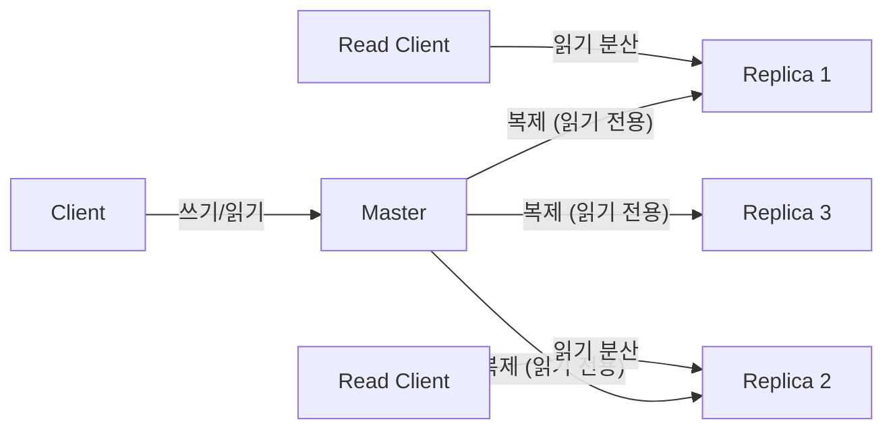
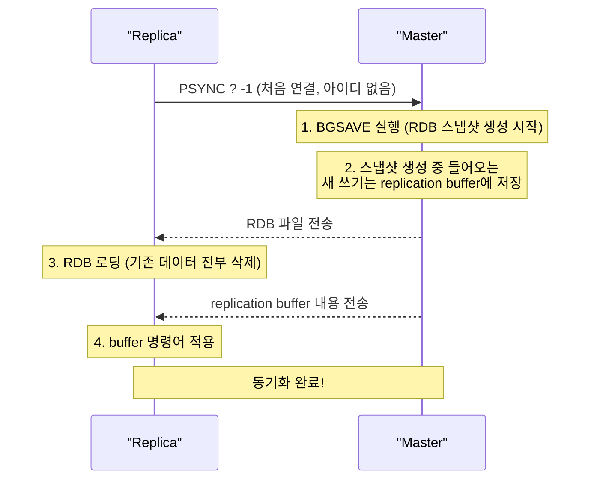
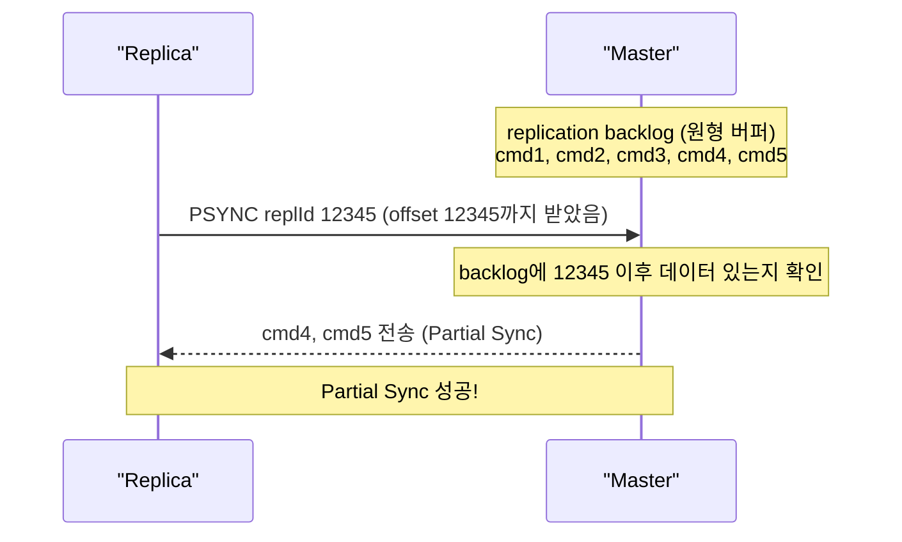
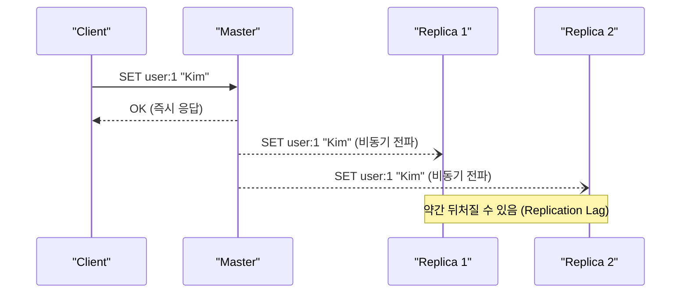
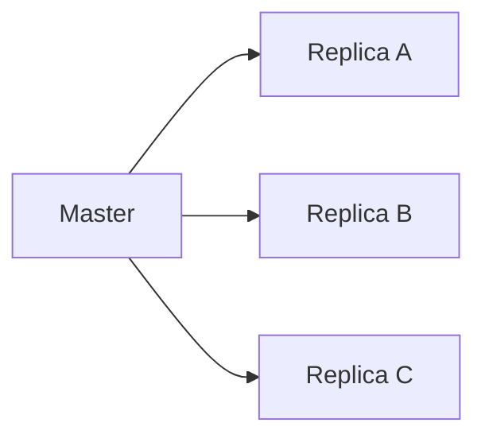
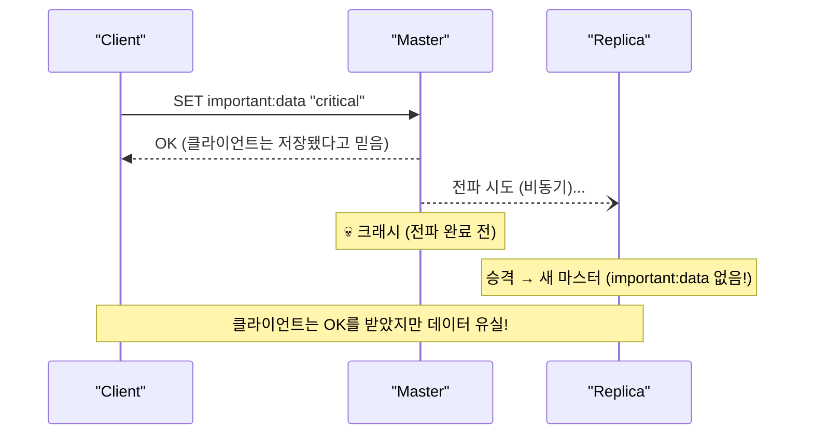
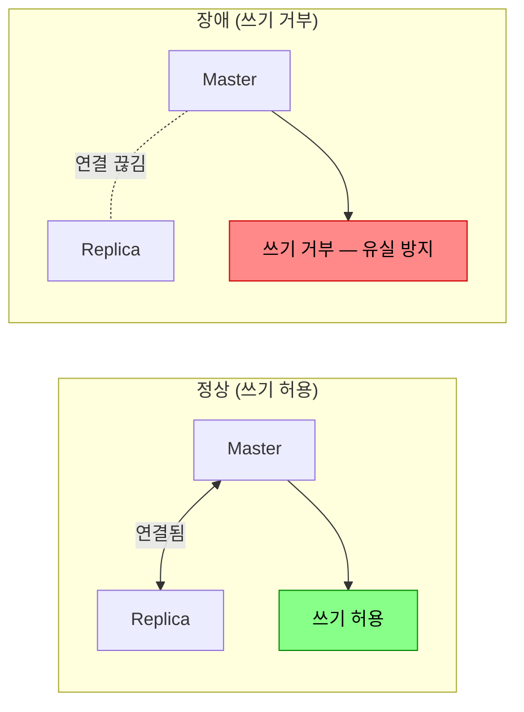
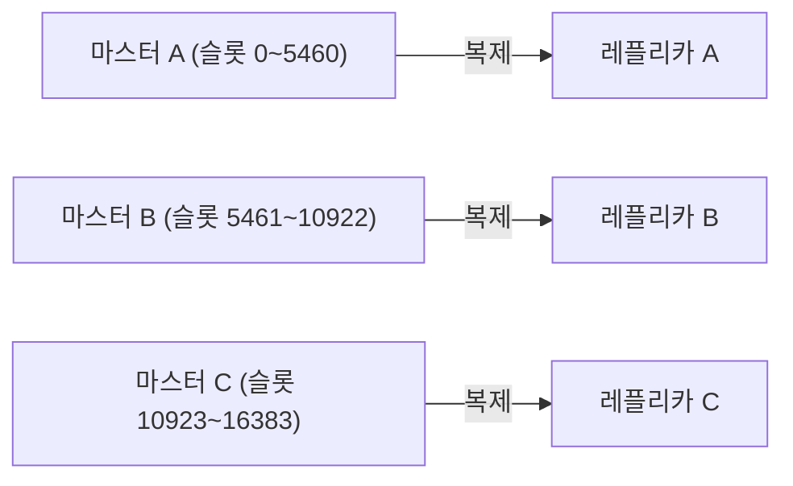

새벽 2시, Redis 마스터 서버의 디스크가 고장났다. 복제 없이 단일 Redis만 운영 중이었다면? 캐시 데이터는 전부 날아간다. 서비스가 재개되어도 모든 캐시가 비어있으니 DB에 쿼리가 폭발적으로 몰린다. DB도 죽는다. 복제(Replication)는 이 연쇄 장애를 막는 첫 번째 방어선이다.

## 복제란 무엇이고 왜 필요한가

> **비유**: 복제는 중요한 계약서를 복사해 여러 금고에 나눠 보관하는 것과 같다. 본사 금고(마스터)가 털리거나 불타도 지점 금고(레플리카)에 동일한 사본이 있어 업무를 이어갈 수 있다. 복사본이 1초 정도 늦게 업데이트될 수 있지만, 아예 없는 것보다 훨씬 낫다.

Redis 복제는 **마스터(Master)** 노드의 데이터를 하나 이상의 **레플리카(Replica)** 노드에 실시간으로 복사하는 기능이다.



**복제를 쓰는 세 가지 이유**:

| 목적 | 설명 | 없으면? |
|------|------|---------|
| **고가용성** | 마스터 장애 시 레플리카가 승격 | 장애 시 서비스 중단 |
| **읽기 분산** | 읽기 요청을 레플리카로 분산 | 마스터 과부하 |
| **백업** | 레플리카에서 RDB 스냅샷 생성 | 마스터 부하 증가 |

---

## 복제 설정

```bash
# 레플리카 서버의 redis.conf
replicaof 192.168.1.100 6379

# 또는 런타임에 동적 설정
REPLICAOF 192.168.1.100 6379

# 마스터에 인증이 있는 경우
masterauth "your_password"

# 레플리카를 독립 마스터로 전환 (페일오버 시)
REPLICAOF NO ONE
```

---

## 복제 동작 원리 — 세 단계

### 1단계: 전체 동기화 (Full Sync)

레플리카가 **최초 연결**되거나 **오랫동안 끊겼다가 재연결**될 때 수행된다. 마스터의 전체 데이터를 RDB 스냅샷으로 받는다.



**주의**: Full Sync 중 마스터는 BGSAVE + 버퍼 유지로 메모리를 추가 사용한다. 데이터가 수 GB라면 메모리 사용량이 일시적으로 크게 증가한다. 메모리가 넉넉하지 않은 환경에서 레플리카를 여러 개 붙이면 OOM 위험이 있다.

### 2단계: 부분 동기화 (Partial Sync)

연결이 **잠시 끊겼다가** 재연결되면, 끊긴 부분부터 이어서 동기화한다. 전체를 다시 받을 필요가 없다.



**Partial Sync가 실패하는 경우**: 레플리카가 너무 오래 끊겨서 마스터의 backlog에 해당 offset이 없을 때 → Full Sync로 폴백된다.

```bash
# backlog가 너무 작으면 잠깐 끊겨도 Full Sync 발생
# 네트워크 불안정 환경에서는 크게 설정
repl-backlog-size 256mb
repl-backlog-ttl 3600   # 레플리카가 없어도 1시간 backlog 유지
```

### 3단계: 명령어 전파 (Command Propagation)

동기화 완료 후, 마스터의 모든 쓰기 명령어가 **실시간으로** 레플리카에 전파된다.



**비동기**: 마스터는 레플리카의 응답을 기다리지 않는다. 그래서 마스터는 빠르지만, 레플리카는 항상 마스터보다 약간 뒤처진다(Replication Lag).

---

## 복제 토폴로지

### 스타 복제 (기본)



마스터가 모든 레플리카에 직접 전파. 지연이 짧지만 레플리카 수가 많을수록 마스터의 네트워크 부하가 선형으로 증가한다.

### 체인 복제 (Cascading)


Replica A가 B에게, B가 C에게 전파. 마스터 부하는 줄지만, 전파 지연이 단계만큼 누적된다. 레플리카가 매우 많거나 대역폭이 좁은 환경에서 사용한다.

---

## 비동기 복제의 한계 — 데이터 유실 시나리오



### WAIT 명령어 — 동기 복제 흉내

중요한 데이터를 쓸 때 최소 N개 레플리카가 받을 때까지 기다릴 수 있다:

```bash
SET important:data "critical"
WAIT 2 5000
# 최소 2개 레플리카가 ACK할 때까지 최대 5초 대기
# 반환값: 실제로 ACK한 레플리카 수
```

**주의**: `WAIT`는 강한 일관성을 **보장하지 않는다**. 레플리카가 "받았다"는 ACK이지, 디스크에 영속화했다는 보장이 아니다. 레플리카가 ACK 직후 크래시하면 여전히 유실된다. 그래도 유실 확률은 크게 줄어든다.

### min-replicas-to-write — 레플리카 없으면 쓰기 거부

```bash
# redis.conf (마스터)
min-replicas-to-write 1    # 최소 1개 레플리카 연결 시만 쓰기 허용
min-replicas-max-lag 10    # 레플리카 지연 10초 이내여야 함
```



마스터 혼자 남으면 쓰기를 거부해서 **장애 시 데이터 유실 범위를 제한**한다. 유실보다 가용성 저하가 낫다는 선택이다.

---

## Sentinel — 자동 장애 조치

수동으로 레플리카를 승격시키는 것은 새벽 2시에는 비현실적이다. Redis Sentinel이 자동으로 처리한다.

자세한 동작은 [Redis 배포 모드](/redis/redis-cluster-sentinel) 포스트 참조.

---

## Redis Cluster에서의 복제

Redis Cluster는 **샤딩 + 복제**를 결합한다:



- 각 마스터가 해시 슬롯의 일부를 담당하고, 자신의 레플리카를 가진다.
- 마스터 장애 시 해당 레플리카가 자동 승격.
- **과반수 마스터가 죽으면** 클러스터 전체가 멈추므로 최소 마스터 3개가 필요하다.

---

## 복제 모니터링

```bash
INFO replication
```

```
role:master
connected_slaves:2
slave0:ip=10.0.0.2,port=6379,state=online,offset=123456,lag=0
slave1:ip=10.0.0.3,port=6379,state=online,offset=123450,lag=1
master_repl_offset:123456
repl_backlog_active:1
repl_backlog_size:1048576
```

| 지표 | 의미 | 경고 기준 |
|------|------|---------|
| `lag` | 레플리카 지연 (초) | 1초 초과 시 주의 |
| `master_repl_offset - slave_offset` | 바이트 단위 지연 | 지속 증가 시 문제 |
| `state` | 연결 상태 | `online`이 아니면 문제 |
| `repl_backlog_size` | 부분 동기화 버퍼 크기 | 너무 작으면 Full Sync 빈발 |

---

## 실무 설정 권장

```bash
# redis.conf (마스터)
repl-backlog-size 256mb          # 네트워크 불안정 대비 버퍼 확장
repl-backlog-ttl 3600            # 레플리카 없어도 1시간 backlog 유지
min-replicas-to-write 1          # 최소 1개 레플리카 연결 시만 쓰기 허용
min-replicas-max-lag 10          # 레플리카 지연 10초 이내

# redis.conf (레플리카)
replica-read-only yes            # 레플리카에 직접 쓰기 방지 (데이터 불일치 예방)
replica-serve-stale-data yes     # 동기화 중에도 (약간 오래된) 데이터 제공
```

---

## 정리

| 항목 | 핵심 |
|------|------|
| 복제 방식 | 비동기 기본, `WAIT`로 준동기 가능 |
| 초기 동기화 | Full Sync (RDB 스냅샷 전송) |
| 재연결 | Partial Sync (backlog 활용, 실패 시 Full Sync) |
| 데이터 유실 | 비동기 특성상 발생 가능 → `WAIT`, `min-replicas-to-write`로 완화 |
| 장애 조치 | Sentinel (자동 failover) 또는 Cluster 내장 |
