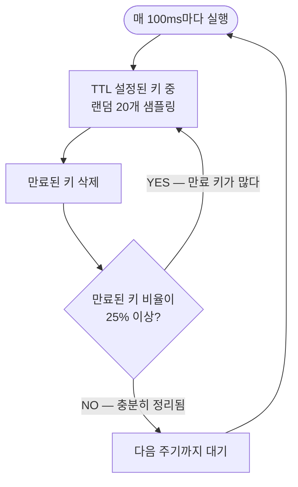
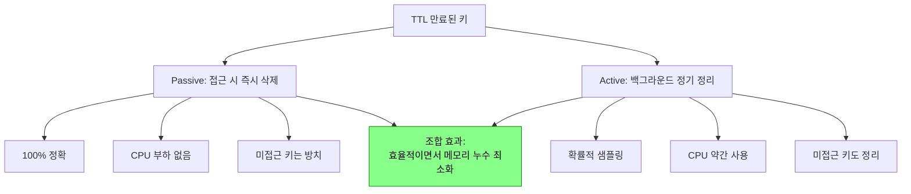

로그인 세션이 24시간 뒤 자동 만료되지 않는다면 어떻게 될까? 사용자가 로그아웃을 잊으면 그 세션은 영원히 메모리에 남는다. 수백만 명이 사용하는 서비스라면 Redis 메모리가 조금씩, 그러나 확실히 고갈된다. 어느 날 새벽 OOM으로 Redis가 죽고서야 원인을 찾는다. TTL은 이 문제를 `EX 3600` 한 줄로 해결한다.

## TTL이란 무엇이고 왜 필요한가

> **비유**: TTL은 냉장고 속 우유의 유통기한 스티커와 같다. 유통기한을 붙여두면 그 날짜가 지나면 알아서 버려진다. 매번 꺼내서 날짜를 확인하고 상했는지 코로 맡아볼 필요가 없다. 수백만 개의 우유가 냉장고(Redis)에 있다면 자동 처리는 생존 조건이다.

TTL(Time To Live)은 Redis 키에 **수명**을 부여하는 기능이다. 설정된 시간이 지나면 키가 자동으로 삭제된다.

```bash
SET session:user123 "data"
EXPIRE session:user123 3600      # 3600초(1시간) 후 자동 삭제

# 또는 SET과 동시에
SET session:user123 "data" EX 3600
```

### 관련 명령어

| 명령어 | 설명 |
|--------|------|
| `EXPIRE key seconds` | 초 단위 TTL 설정 |
| `PEXPIRE key ms` | 밀리초 단위 TTL 설정 |
| `EXPIREAT key timestamp` | Unix 타임스탬프로 만료 시점 지정 |
| `TTL key` | 남은 TTL 확인 (초 단위) |
| `PTTL key` | 남은 TTL 확인 (밀리초) |
| `PERSIST key` | TTL 제거 → 영구 키로 전환 |

```bash
TTL mykey
# -1 : 키가 존재하지만 TTL 없음 (영구)
# -2 : 키 자체가 없음
# 양수 : 남은 초
```

---

## 만료 처리의 두 전략 — 왜 두 가지가 필요한가

TTL이 지난 키를 언제 삭제하는가? Redis는 **두 전략을 조합**한다. 하나만 쓰면 각각 심각한 단점이 생긴다.

### 전략 1: Passive Expiration (수동 만료)

클라이언트가 키에 **접근할 때** 만료 여부를 확인하고 삭제한다.


- **장점**: 아무도 건드리지 않으면 CPU를 전혀 쓰지 않는다.
- **단점**: 아무도 접근하지 않는 키는 **영원히 메모리에 남는다**. 만료됐지만 삭제 안 된 키가 메모리를 조용히 잠식한다.

### 전략 2: Active Expiration (능동 만료)

Redis가 **주기적으로(초당 10회)** 만료된 키를 찾아 능동적으로 삭제한다.



**핵심**: 만료 키가 많으면 **적극적으로** 계속 정리하고, 적으면 **느긋하게** 대기한다. CPU 사용량과 메모리 낭비 사이에서 균형을 맞추는 적응형 알고리즘이다.

만약 Active Expiration이 없다면? 아무도 접근하지 않는 세션 수백만 개가 만료 후에도 메모리에 쌓인다. TTL을 설정해도 메모리가 줄지 않는 이상한 상황이 된다.

### 두 전략의 조합 효과



---

## 내부 구현 — 어떻게 만료 시각을 기억하는가

Redis는 내부적으로 **두 개의 딕셔너리**를 관리한다:

```c
typedef struct redisDb {
    dict *dict;     // 모든 키-값 저장소
    dict *expires;  // TTL이 설정된 키 → 만료 Unix timestamp 매핑
} redisDb;
```

`EXPIRE key 60` 을 실행하면:
1. `expires` 딕셔너리에 `key → (현재시각 + 60초의 timestamp)` 추가
2. `dict`(실제 값 저장소)에는 변화 없음

만료 확인 시:
1. `expires`에서 키의 만료 timestamp 조회
2. `현재 timestamp > 만료 timestamp` 이면 삭제
3. `dict`와 `expires` 양쪽에서 제거

---

## TTL과 메모리 정책 (Eviction)

TTL 만료와 **메모리 초과 시 퇴거(eviction)**는 **별개 메커니즘**이다. TTL이 아직 남아있어도 메모리가 꽉 차면 퇴거될 수 있다.

### maxmemory-policy 옵션

`maxmemory` 한도에 도달했을 때 어떤 키를 제거할지 결정한다:

| 정책 | 설명 | 언제 쓰나 |
|------|------|---------|
| `noeviction` | 쓰기 거부 (에러 반환) | 캐시가 아닌 영구 저장소 |
| `allkeys-lru` | 전체 키 중 최근에 안 쓴 키 제거 | 일반 캐시 |
| `volatile-lru` | TTL 있는 키만 LRU 제거 | 영구 키는 보호하고 싶을 때 |
| `allkeys-lfu` | 전체 키 중 자주 안 쓴 키 제거 (4.0+) | 접근 빈도 기반 캐시 |
| `volatile-lfu` | TTL 있는 키만 LFU 제거 | |
| `allkeys-random` | 랜덤 제거 | |
| `volatile-random` | TTL 있는 키 중 랜덤 제거 | |
| `volatile-ttl` | TTL이 가장 짧은 키 먼저 제거 | |

### 실무 권장

```conf
# redis.conf
maxmemory 4gb
maxmemory-policy allkeys-lfu   # 캐시 용도 — 자주 안 쓰인 키 먼저 퇴거
```

- **캐시 용도**: `allkeys-lru` 또는 `allkeys-lfu` — 모든 키가 퇴거 후보
- **세션 저장소**: `volatile-lru` — TTL 없는 키(중요 데이터)는 퇴거 안 함

---

## TTL 관련 함정 4가지

### 함정 1: SET은 TTL을 제거한다

```bash
SET mykey "v1" EX 100   # TTL 100초 설정
SET mykey "v2"          # 값만 바꾸려 했지만...
TTL mykey               # → -1 (TTL 사라짐!)
```

`SET`은 키 전체를 새로 만들므로 기존 TTL이 사라진다. 값만 변경하려면:

```bash
SET mykey "v2" KEEPTTL   # Redis 6.0+ — 기존 TTL 유지
# 또는
SET mykey "v2"
EXPIRE mykey 100         # TTL 다시 설정
```

### 함정 2: RENAME은 TTL을 이전한다

```bash
SET a "hello" EX 100
SET b "world"           # b는 TTL 없음
RENAME a b              # a의 내용과 TTL이 b로 이전됨
TTL b                   # → 약 100 (a의 TTL이 따라왔다!)
```

`RENAME` 이후 대상 키(b)의 원래 TTL은 사라지고 원본(a)의 TTL로 덮어씌워진다.

### 함정 3: INCR, LPUSH 등은 TTL에 영향 없음

```bash
SET counter 0 EX 100
INCR counter            # 값만 변경, TTL 유지
TTL counter             # → 약 100 (보존됨)
```

**키의 값을 변경하는 명령어**(`INCR`, `LPUSH`, `HSET` 등)는 TTL을 건드리지 않는다. **키 자체를 새로 쓰는 명령어**(`SET`, `GETSET` 등)만 TTL에 영향을 준다.

### 함정 4: RDB/AOF에서 TTL 처리

- **RDB**: 스냅샷 저장 시 만료 timestamp도 함께 저장. 로딩 시 이미 만료된 키는 무시한다.
- **AOF**: `EXPIREAT`(절대 timestamp) 형태로 기록. 재시작 후 정확한 만료 처리 가능.
- **복제 환경**: 마스터에서 키가 만료되면 레플리카에 `DEL` 명령어를 전파한다. 레플리카가 능동적으로 만료 처리를 하면 마스터/레플리카 불일치가 생길 수 있으므로, 레플리카의 Active Expiration은 마스터의 전파에 의존한다.

---

## 실무 활용 패턴

### 세션 관리

```bash
SET session:abc123 "{userId:1, role:admin}" EX 1800   # 30분 세션
# 사용자 활동 시 갱신
EXPIRE session:abc123 1800                             # 마지막 활동부터 30분 리셋
```

### 캐시 + TTL

```bash
SET cache:product:100 "{name:...}" EX 300   # 5분 캐시
# 만료 후 접근하면 nil → 애플리케이션이 DB 조회 후 다시 저장
```

### Rate Limiting

```bash
SET ratelimit:user:123 1 EX 60 NX   # 1분 윈도우 최초 시작 (NX: 없을 때만 생성)
INCR ratelimit:user:123             # 요청마다 증가
# 값이 100 초과 → 거부 / 60초 후 키 자동 만료 → 윈도우 리셋
```

---

## 정리

| 항목 | 핵심 |
|------|------|
| 만료 방식 | Passive(접근 시 즉시) + Active(100ms마다 샘플링) 조합 |
| 내부 구조 | `expires` 딕셔너리에 만료 timestamp 저장 |
| SET 주의 | `SET`은 TTL 제거 → `KEEPTTL` 또는 `EXPIRE` 재설정 |
| 메모리 초과 | TTL 만료와 별개로 `maxmemory-policy`가 동작 |
| 복제 환경 | 마스터 만료 → 레플리카에 DEL 전파 |
