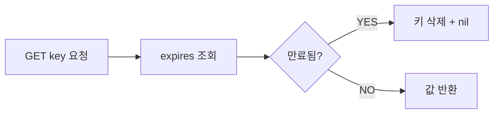
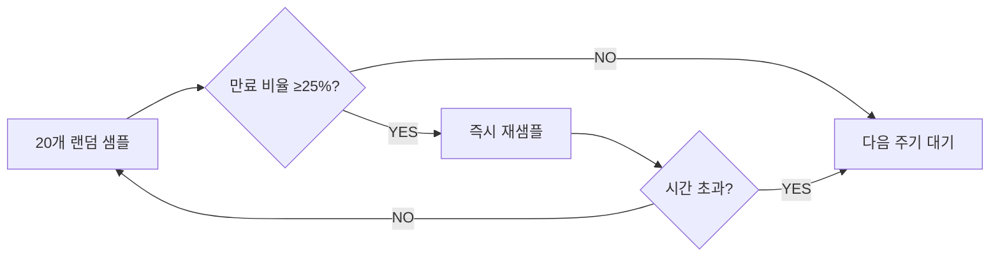

로그인 세션이 24시간 뒤 자동 만료되지 않는다면 어떻게 될까? 사용자가 로그아웃을 잊으면 세션은 영원히 메모리에 남는다. 수백만 명의 서비스라면 Redis 메모리가 조용히, 그러나 확실히 고갈된다. 어느 날 새벽 OOM으로 Redis가 죽고서야 원인을 찾는다. TTL은 `EX 3600` 한 줄로 이 문제를 해결한다. 하지만 TTL이 내부적으로 어떻게 동작하는지, 왜 만료된 키가 즉시 메모리에서 사라지지 않는지, maxmemory 정책이 왜 8가지나 있는지 — 표면 아래를 모르면 장애 앞에서 손을 쓸 수 없다.

---

## TTL 명령어 체계와 정밀도

### 기본 명령어 4종

```bash
EXPIRE key seconds          # 초 단위 상대 시간
PEXPIRE key milliseconds    # 밀리초 단위 상대 시간
EXPIREAT key unix-timestamp # 초 단위 절대 Unix 타임스탬프
PEXPIREAT key unix-ms       # 밀리초 단위 절대 Unix 타임스탬프
```

**왜 4가지가 필요한가?** Redis는 내부적으로 항상 `PEXPIREAT`(밀리초 절대 timestamp)로 변환해 저장한다. `EXPIRE 60`을 실행하면 Redis는 `현재시각(ms) + 60000`을 계산해 `expires` 딕셔너리에 기록한다. 나머지 세 명령은 전부 이 단일 형식으로 변환되는 문법 설탕(syntactic sugar)이다.

**AOF와의 관계가 핵심이다.** AOF 로그에는 항상 `PEXPIREAT` 형식으로 기록된다. 만약 `EXPIRE 3600`이 AOF에 그대로 기록된다면, Redis 재시작 시 AOF를 재실행할 때 "현재 시각 + 3600초"로 만료 시각이 재계산되어 원래 의도와 완전히 달라진다. 절대 timestamp로 변환해 기록해야 재시작 후에도 원래 만료 시각이 보존된다.

### 조회와 관리 명령어

```bash
TTL key    # 남은 초 반환. -1: TTL 없음(영구), -2: 키 없음
PTTL key   # 남은 밀리초 반환
PERSIST key # TTL 제거 → 영구 키로 전환
```

**PEXPIRE vs EXPIRE — 언제 밀리초 정밀도가 필요한가?**

Rate limiting처럼 초 단위 이하 정밀도가 필요한 경우, 또는 분산 Lock에서 lease time을 수백 밀리초로 설정하는 경우다. `EXPIRE 1`은 0~1999ms 사이 어느 순간에도 만료될 수 있다. `PEXPIRE 500`은 정확히 500ms 후 만료를 보장한다.

### PERSIST — TTL 제거의 내부 동작

`PERSIST key`를 실행하면 `expires` 딕셔너리에서 해당 키의 엔트리를 제거한다. `dict`(실제 값)에는 변화가 없다. 반환값이 0이면 키에 TTL이 없었거나 키가 없는 것, 1이면 TTL 제거 성공이다.

**실무 패턴: 슬라이딩 세션 vs 절대 세션**

```java
// 절대 세션: 로그인 후 정확히 8시간 후 만료
redisTemplate.opsForValue().set(
    "session:" + sessionId, userInfo,
    Duration.ofHours(8)
);

// 슬라이딩 세션: 마지막 활동 기준 30분
public UserSession getSession(String sessionId) {
    String key = "session:" + sessionId;
    UserSession session = redisTemplate.opsForValue().get(key);
    if (session != null) {
        // 접근마다 TTL 갱신 — EXPIRE 재설정
        redisTemplate.expire(key, Duration.ofMinutes(30));
    }
    return session;
}

// "로그인 유지" 선택 시 TTL 제거
public void keepAlive(String sessionId) {
    redisTemplate.persist("session:" + sessionId);
    // TTL=-1이 되어 영구 키로 전환
}
```

---

## TTL 내부 구현 — RedisDb expires 해시 테이블

### 두 개의 딕셔너리

Redis의 각 데이터베이스는 C 구조체 `redisDb`로 표현된다:

```c
typedef struct redisDb {
    dict *dict;       // 모든 키-값 저장소 (주 딕셔너리)
    dict *expires;    // TTL 키 → 만료 timestamp(ms) 매핑
    dict *blocking_keys;
    dict *ready_keys;
    dict *watched_keys;
    int id;
    long long avg_ttl;
} redisDb;
```

`EXPIRE key 60`을 실행하면 정확히 두 가지 일이 일어난다:

1. `expires` 딕셔너리에 `key → (현재 Unix ms + 60000)` 엔트리 추가
2. `dict`에는 아무 변화 없음 — 값은 그대로

**왜 별도 딕셔너리인가?** 값 딕셔너리에 TTL 필드를 추가하면 모든 키 객체의 크기가 커진다. TTL이 없는 키(영구 키)가 대다수인 경우 메모리 낭비가 심하다. 별도 `expires` 딕셔너리는 TTL 있는 키만 추가 메모리를 사용하므로 효율적이다.

**expires 딕셔너리 레이아웃:**

```
expires dict:
  "session:user:123"  →  1746172800000  (ms timestamp)
  "cache:product:99"  →  1746172860000
  "token:abc"         →  1746172900000
```

만료 확인 로직 (C pseudo-code):

```c
int keyIsExpired(redisDb *db, robj *key) {
    dictEntry *de = dictFind(db->expires, key->ptr);
    if (de == NULL) return 0;  // expires에 없으면 만료 아님

    long long when = dictGetSignedIntegerVal(de);
    long long now = mstime();  // 현재 ms timestamp

    return now > when;  // 현재가 만료 시각보다 크면 만료
}
```

---

## 만료 처리 두 전략 — 왜 두 가지가 필요한가

### 전략 1: Lazy Expiration (지연 만료)

클라이언트가 키에 **접근하는 순간** 만료 여부를 확인하고 삭제한다.



모든 읽기 명령(`GET`, `HGET`, `LRANGE` 등)과 쓰기 명령은 실행 전 `lookupKeyRead()` 또는 `lookupKeyWrite()`를 호출한다. 이 함수 내부에서 `keyIsExpired()`를 호출해 만료 여부를 확인하고, 만료됐으면 `dbDelete()`로 삭제 후 `NULL`을 반환한다.

**장점**: 접근이 없으면 CPU를 전혀 사용하지 않는다.
**치명적 단점**: 아무도 접근하지 않는 키는 만료 후에도 **영원히 메모리에 남는다**. 수백만 개의 세션 키가 만료됐지만 삭제되지 않아 메모리를 잠식하는 상황이 발생한다.

### 전략 2: Active Expiration (능동 만료)

Redis는 백그라운드에서 주기적으로 만료된 키를 찾아 삭제한다.

**hz 설정의 의미:**

```conf
# redis.conf
hz 10   # 초당 10회 실행 (기본값) — 타이머 이벤트 주기 = 100ms
# hz 100 으로 늘리면 더 빠른 만료 처리, 더 높은 CPU 사용
```

`hz`는 Redis의 서버사이드 타이머 함수 `serverCron()`이 초당 몇 번 호출되는지 결정한다. `serverCron()` 안에서 `activeExpireCycle()`이 호출된다.

**25% 샘플링 알고리즘의 작동 방식:**

```
activeExpireCycle() 한 번 실행 시:
1. DB별로 순회
2. expires 딕셔너리에서 무작위로 20개 키 샘플링 (ACTIVE_EXPIRE_CYCLE_LOOKUPS_PER_LOOP = 20)
3. 샘플 중 만료된 키 삭제
4. 만료된 키 비율이 25% 이상이면 → 루프 반복
5. 25% 미만이면 → 다음 serverCron() 호출까지 대기
6. 단, 각 실행마다 시간 제한(FAST 모드: 1ms, SLOW 모드: hz에 비례)을 두어 블로킹 방지
```

**적응형 주파수(Adaptive Frequency)의 핵심:**



만료 키가 25% 이상이면 "이 DB에 만료 키가 많다"는 신호로 해석해 반복 정리한다. 25% 미만이면 "충분히 정리됐다"로 보고 다음 주기까지 대기한다. 이로써 만료 키가 폭발적으로 쌓이는 상황(대량 TTL 동시 만료)에서는 CPU를 더 투입해 빠르게 정리하고, 평상시에는 CPU를 절약한다.

**왜 정확히 25%인가?** 이론적으로 20개 샘플 중 5개 이상이 만료됐을 때(25%) 반복하는 설계다. 더 낮은 임계값이면 CPU 낭비, 더 높으면 만료 키 누적 — 실험적으로 결정된 균형점이다.

---

## Java/Spring RedisTemplate 실전 코드

### 의존성 설정

```xml
<!-- pom.xml -->
<dependency>
    <groupId>org.springframework.boot</groupId>
    <artifactId>spring-boot-starter-data-redis</artifactId>
</dependency>
<!-- Lettuce (기본 클라이언트) — Netty 기반 비동기 -->
```

### RedisTemplate 기본 TTL 패턴

```java
@Configuration
public class RedisConfig {

    @Bean
    public RedisTemplate<String, Object> redisTemplate(
            RedisConnectionFactory factory) {
        RedisTemplate<String, Object> template = new RedisTemplate<>();
        template.setConnectionFactory(factory);
        template.setKeySerializer(new StringRedisSerializer());
        template.setValueSerializer(new GenericJackson2JsonRedisSerializer());
        return template;
    }
}
```

```java
@Service
@RequiredArgsConstructor
public class SessionService {

    private final RedisTemplate<String, Object> redisTemplate;

    // SET key value EX 1800
    public void saveSession(String sessionId, UserSession session) {
        redisTemplate.opsForValue().set(
            "session:" + sessionId,
            session,
            Duration.ofMinutes(30)
        );
    }

    // GET + EXPIRE 갱신 (슬라이딩)
    public UserSession getSession(String sessionId) {
        String key = "session:" + sessionId;
        UserSession session = (UserSession) redisTemplate.opsForValue().get(key);
        if (session != null) {
            redisTemplate.expire(key, Duration.ofMinutes(30));
        }
        return session;
    }

    // TTL 조회
    public Long getRemainingTtl(String sessionId) {
        return redisTemplate.getExpire("session:" + sessionId, TimeUnit.SECONDS);
        // -1: TTL 없음, -2: 키 없음, 양수: 남은 초
    }

    // PERSIST — "로그인 유지" 선택 시
    public void persistSession(String sessionId) {
        redisTemplate.persist("session:" + sessionId);
    }
}
```

### EXPIREAT — 절대 시각 만료

```java
// 이벤트 티켓: 이벤트 종료 시각(LocalDateTime)에 정확히 만료
public void saveEventTicket(String ticketId, Ticket ticket, LocalDateTime eventEnd) {
    String key = "ticket:" + ticketId;
    redisTemplate.opsForValue().set(key, ticket);

    // LocalDateTime → Unix timestamp 변환
    long expireAt = eventEnd
        .atZone(ZoneId.of("Asia/Seoul"))
        .toInstant()
        .getEpochSecond();

    // EXPIREAT key unix-timestamp
    redisTemplate.expireAt(key, new Date(expireAt * 1000L));
}
```

**주의**: EXPIREAT은 서버 간 시각 동기화가 전제 조건이다. NTP 미동기화로 앱 서버 시각이 Redis 서버 시각과 수 초 이상 다르면 TTL이 예상과 다르게 동작한다. 가능하면 `EXPIRE`(상대 시간)를 선호하고, 절대 시각이 꼭 필요하면 Redis 서버 시각(`TIME` 명령)을 기준으로 계산한다.

---

## maxmemory-policy 8가지 심층 분석

`maxmemory` 한도에 도달하면 Redis는 새 쓰기 전에 어떤 키를 퇴거(evict)할지 결정해야 한다. 이것이 TTL 만료와 완전히 별개인 Eviction이다.

### 8가지 정책 분류 체계

```
                  ┌─────────────────────────────────┐
                  │         퇴거 대상 범위            │
                  ├─────────────────┬───────────────┤
                  │  allkeys (전체)  │  volatile (TTL있는것만) │
  ┌───────────────┼─────────────────┼───────────────┤
  │  LRU          │  allkeys-lru    │  volatile-lru │
  │  LFU          │  allkeys-lfu    │  volatile-lfu │
  │  Random       │  allkeys-random │  volatile-random│
  │  TTL 기반     │       -         │  volatile-ttl │
  │  퇴거 안 함   │       -         │  noeviction   │
  └───────────────┴─────────────────┴───────────────┘
```

### noeviction

```conf
maxmemory-policy noeviction   # 기본값
```

메모리 초과 시 쓰기 명령(`SET`, `LPUSH`, `INCR` 등)에 `OOM command not allowed` 에러를 반환한다. 읽기(`GET`)는 허용된다.

**언제**: Redis를 데이터베이스처럼 쓸 때(세션/설정 영구 저장). 데이터 유실이 절대 안 되는 경우. 그러나 서비스 쓰기 장애를 감수해야 한다.

### allkeys-lru

모든 키 중 **가장 최근에 사용되지 않은** 키부터 퇴거한다. LRU = Least Recently Used.

**왜 "approximated LRU"인가?** 진정한 LRU는 모든 키의 접근 시각을 정렬해 가장 오래된 것을 찾아야 하므로 O(N) 시간과 추가 메모리가 필요하다. Redis는 각 객체에 24비트 LRU clock(`lru` 필드, 초 단위)을 내장하고, 퇴거 시 **무작위로 N개(기본 5개)를 샘플링**해 그 중 LRU 시각이 가장 오래된 것을 제거한다.

```c
struct redisObject {
    unsigned type:4;
    unsigned encoding:4;
    unsigned lru:24;    // 마지막 접근 시각 (초 단위 LRU clock)
    int refcount;
    void *ptr;
};
```

```conf
maxmemory-samples 5   # 기본값. 10으로 늘리면 진짜 LRU에 근접하지만 CPU 증가
```

**5개 샘플 vs 진짜 LRU:**

```
진짜 LRU:   정확하지만 O(N) 시간 + 포인터 메모리 낭비
샘플 5개:   실제로 충분히 정확 (LinkedIn 실험: 5개로 진짜 LRU 95% 재현)
샘플 10개:  98% 재현 — 민감한 캐시에서 권장
```

**언제**: 범용 캐시. 모든 키가 퇴거 후보. 캐시 히트율이 중요할 때.

### volatile-lru

TTL이 설정된 키 중에서만 LRU 퇴거한다. TTL 없는 키(영구 키)는 보호된다.

**언제**: 같은 Redis에 영구 데이터(설정, 코드 테이블)와 캐시 데이터를 함께 쓸 때. 영구 데이터를 절대 퇴거하면 안 되는 경우. 단, TTL 있는 키가 전혀 없으면 `noeviction`처럼 동작해 쓰기 에러가 발생한다.

### allkeys-lfu (Redis 4.0+)

모든 키 중 **접근 빈도가 가장 낮은** 키부터 퇴거한다. LFU = Least Frequently Used.

**Morris Counter — LFU 구현의 핵심:**

정확한 카운터는 키당 8바이트(long long)가 필요하다. Redis는 `redisObject.lru` 필드(24비트)를 LFU에 재활용한다:

```
lru 필드 24비트 분할:
  상위 16비트: 마지막 감소 시각 (분 단위, "LDT")
  하위  8비트: 접근 빈도 카운터 (0~255, Morris Counter)
```

**Morris Counter 동작 원리:**

```
접근할 때마다 카운터를 1씩 올리는 게 아니다.
현재 카운터 값이 클수록 올릴 확률이 낮아진다:

확률 = 1 / (현재카운터 * lfu-log-factor + 1)

lfu-log-factor=10(기본):
  카운터 0   → 약 100% 확률로 증가
  카운터 10  → 약 9%  확률로 증가
  카운터 100 → 약 1%  확률로 증가
  카운터 255 → 더 이상 올라가기 어려움
```

8비트(0~255)로 무한대의 접근 횟수를 표현하는 확률적 카운터다. 카운터가 높을수록 증가하기 어려워 실질적으로 무한 범위를 압축한다.

**LFU Decay 메커니즘:**

뜨거웠다가 식은 키를 올바르게 퇴거하기 위해 시간이 지나면 카운터를 줄인다:

```
감소 주기 = LDT(마지막 감소 시각) 기준으로 경과한 분수
감소량 = 경과 분 / lfu-decay-time

lfu-decay-time=1(기본): 1분마다 카운터 1 감소
```

```conf
lfu-log-factor 10    # 카운터 증가 감도. 낮을수록 빠르게 포화
lfu-decay-time 1     # 분 단위 카운터 감소 주기
```

**allkeys-lru vs allkeys-lfu 선택 기준:**

| 상황 | 권장 |
|------|------|
| 최근 접근 키가 중요 (시계열, 피드) | allkeys-lru |
| 반복 접근 키가 중요 (코드 테이블, 상품 상세) | allkeys-lfu |
| 접근 패턴이 불규칙한 팝스케일 | allkeys-lfu |
| 단순 캐시, 패턴 분석 불필요 | allkeys-lru |

### volatile-lfu

TTL 있는 키만 LFU로 퇴거한다. volatile-lru와 동일한 적용 맥락에서 LFU 기반으로 선택한다.

### allkeys-random / volatile-random

무작위 퇴거. 캐시 접근 패턴 분석이 의미 없거나, 모든 키가 동등한 중요도일 때. 실무에서 드물게 사용.

### volatile-ttl

TTL 있는 키 중 **남은 TTL이 가장 짧은** 키부터 퇴거한다.

**언제**: "곧 어차피 만료될 키를 먼저 제거하자"는 직관적 정책. 단, TTL이 짧다고 덜 중요한 것은 아니므로 신중히 사용해야 한다.

### 실무 설정 예시

```java
// application.yml
spring:
  data:
    redis:
      host: localhost
      port: 6379
      # maxmemory-policy는 redis.conf 또는 CONFIG SET으로 설정
```

```bash
# 캐시 서버 설정
CONFIG SET maxmemory 4gb
CONFIG SET maxmemory-policy allkeys-lfu
CONFIG SET maxmemory-samples 10    # LRU/LFU 정확도 향상

# 세션 + 영구 데이터 혼용 서버
CONFIG SET maxmemory-policy volatile-lru
```

```java
// 실시간으로 eviction 상태 모니터링
@Scheduled(fixedRate = 60000)
public void monitorEviction() {
    Properties info = redisTemplate.getConnectionFactory()
        .getConnection().serverCommands().info("stats");
    String evictedKeys = info.getProperty("evicted_keys");
    log.info("Evicted keys: {}", evictedKeys);
    // evicted_keys가 급증하면 maxmemory 확장 또는 캐시 용량 검토
}
```

---

## Key Eviction 트리거 — 왜 쓰기 전에 메모리를 확인하나

**모든 쓰기 명령 실행 전** Redis는 `freeMemoryIfNeeded()`를 호출한다. 이것이 Lazy Eviction이다:

```
Client: SET product:99 {...}
Redis:
  1. freeMemoryIfNeeded() 호출
     → used_memory > maxmemory?
     → YES → maxmemory-policy에 따라 키 퇴거 반복
     → 퇴거 후 여유 메모리 확보되면 중단
  2. 실제 SET 실행
```

**왜 읽기는 검사 안 하나?** 읽기는 메모리를 추가로 사용하지 않으므로(결과를 클라이언트에 보낼 네트워크 버퍼 제외) 퇴거가 필요 없다. 쓰기만 메모리를 증가시키므로 쓰기 전에만 검사한다.

**왜 지연(Lazy)인가?** 주기적으로 미리 메모리를 확보하는 대신, 실제로 필요할 때(쓰기 시점)만 퇴거를 실행한다. 불필요한 CPU 소비를 막고 실제 필요 시점에 정확한 양만큼 퇴거한다.

```java
// 쓰기 시 메모리 부족 에러 처리
@Service
public class CacheService {

    private final RedisTemplate<String, Object> redisTemplate;

    public void set(String key, Object value, Duration ttl) {
        try {
            redisTemplate.opsForValue().set(key, value, ttl);
        } catch (RedisSystemException e) {
            if (e.getMessage() != null && e.getMessage().contains("OOM")) {
                // maxmemory-policy=noeviction 상태에서 메모리 초과
                log.error("Redis OOM: key={}, consider allkeys-lru policy", key);
                // fallback: DB에서 직접 조회
            } else {
                throw e;
            }
        }
    }
}
```

---

## TTL Jitter 패턴 — 캐시 스탬피드 방지

### 왜 동기화된 만료가 위험한가

```
상황: 매일 자정 배치로 상품 10,000개를 캐시, 전부 TTL=3600(1시간)
결과: 새벽 1시 정각에 10,000개가 동시 만료

자정 00:00 → 캐시 저장
새벽 01:00 → 10,000개 동시 만료
새벽 01:00:00.001 → DB에 10,000 × (초당 조회수) 쿼리 폭발
DB CPU 100% → 응답 지연 → 타임아웃 → 전면 장애
```

이를 **Thundering Herd** 또는 **Cache Stampede**라 한다.

### Jitter 구현

```java
@Service
public class ProductCacheService {

    private final RedisTemplate<String, Object> redisTemplate;
    private final ProductRepository productRepository;
    private static final long BASE_TTL_SECONDS = 3600L;
    private static final long JITTER_MAX = 600L;  // ±10분 (베이스의 ~17%)

    public Product getProduct(Long productId) {
        String key = "product:" + productId;
        Product cached = (Product) redisTemplate.opsForValue().get(key);
        if (cached != null) return cached;

        Product product = productRepository.findById(productId)
            .orElseThrow(() -> new EntityNotFoundException("Product not found"));
        cacheProduct(key, product);
        return product;
    }

    private void cacheProduct(String key, Product product) {
        // TTL = BASE ± JITTER — 각 키마다 다른 만료 시각
        long jitter = ThreadLocalRandom.current().nextLong(-JITTER_MAX, JITTER_MAX);
        long ttl = BASE_TTL_SECONDS + jitter;
        redisTemplate.opsForValue().set(key, product, Duration.ofSeconds(ttl));
    }

    // 배치 캐싱 — 대량 저장 시 더 넓은 지터 범위 권장
    public void warmupCache(List<Product> products) {
        products.forEach(product -> {
            String key = "product:" + product.getId();
            // 기본 1시간 + 0~30분 랜덤 추가 → 1:00~1:30 사이에 분산 만료
            long ttl = BASE_TTL_SECONDS + ThreadLocalRandom.current().nextLong(0, 1800);
            redisTemplate.opsForValue().set(key, product, Duration.ofSeconds(ttl));
        });
    }
}
```

**지터 범위 설정 기준:**

- 너무 좁으면 (±5초): 거의 동시 만료 → 효과 없음
- 너무 넓으면 (±24시간): stale 데이터 문제
- 권장: 베이스 TTL의 10~30% 범위

### Mutex Lock 패턴 — 동시 DB 조회 직렬화

```java
@Service
public class MutexCacheService {

    private final RedisTemplate<String, Object> redisTemplate;
    private final ProductRepository productRepository;

    public Product getProductWithMutex(Long productId) {
        String cacheKey = "product:" + productId;
        String lockKey = "lock:product:" + productId;

        // 1단계: 캐시 조회
        Product cached = (Product) redisTemplate.opsForValue().get(cacheKey);
        if (cached != null) return cached;

        // 2단계: 락 획득 시도 (SET NX PX 500)
        Boolean acquired = redisTemplate.opsForValue()
            .setIfAbsent(lockKey, "1", Duration.ofMilliseconds(500));

        if (Boolean.TRUE.equals(acquired)) {
            try {
                // 락 획득 → DB 조회 + 캐시 저장
                Product product = productRepository.findById(productId).orElseThrow();
                redisTemplate.opsForValue().set(cacheKey, product, Duration.ofSeconds(3600));
                return product;
            } finally {
                redisTemplate.delete(lockKey);
            }
        } else {
            // 락 획득 실패 → 짧게 대기 후 캐시 재조회
            try { Thread.sleep(50); } catch (InterruptedException ignored) {}
            return (Product) redisTemplate.opsForValue().get(cacheKey);
        }
    }
}
```

---

## Keyspace Notifications — __keyevent@0__:expired

### 설정과 동작

```conf
# redis.conf
notify-keyspace-events "KEA"
# K: keyspace 이벤트, E: keyevent 이벤트, A: 모든 이벤트 (g$lzxedt)
# Ex: notify-keyspace-events "Ex" → 만료 이벤트만
```

만료 이벤트 채널 패턴:
```
__keyevent@{db}__:expired   → 특정 DB의 만료 이벤트
__keyspace@{db}__:{key}     → 특정 키에 발생한 모든 이벤트
```

### 왜 만료 이벤트는 보장되지 않는가

**근본 이유: Pub/Sub은 fire-and-forget이다.** Redis Pub/Sub에는 메시지 큐가 없다. 구독자가 없으면 메시지는 그냥 사라진다. 구독자가 연결된 상태라도 처리 속도가 발행 속도를 따라가지 못하면 메시지가 유실된다.

**두 번째 이유: 만료 자체가 지연될 수 있다.** Lazy Expiration은 접근 시에만 삭제하므로 아무도 접근 안 하면 이벤트가 발생하지 않는다. Active Expiration은 주기적 샘플링이므로 만료 후 수백 ms 이상 지연될 수 있다. 이벤트 발생 시각 = "만료 timestamp가 지난 시각"이 아니라 "Redis가 실제로 삭제하는 시각"이다.

**세 번째 이유: 복제 환경에서 레플리카는 이벤트를 생성하지 않는다.** 레플리카의 만료는 마스터의 DEL 전파로 처리되므로, 레플리카에서 구독하면 이벤트를 받지 못할 수 있다.

```java
@Component
public class ExpiredKeyListener implements MessageListener {

    @Override
    public void onMessage(Message message, byte[] pattern) {
        String expiredKey = new String(message.getBody());
        log.info("Key expired: {}", expiredKey);
        // 주의: 이 이벤트는 보장되지 않는다
        // 비즈니스 크리티컬 로직은 여기에 두면 안 된다
    }
}

@Configuration
public class RedisListenerConfig {

    @Bean
    public RedisMessageListenerContainer listenerContainer(
            RedisConnectionFactory factory, ExpiredKeyListener listener) {
        RedisMessageListenerContainer container = new RedisMessageListenerContainer();
        container.setConnectionFactory(factory);
        // DB 0의 만료 이벤트 구독
        container.addMessageListener(listener,
            new PatternTopic("__keyevent@0__:expired"));
        return container;
    }
}
```

**올바른 활용 vs 잘못된 활용:**

```java
// 잘못된 활용 — 만료 이벤트에 중요 로직 의존
public void onMessage(Message message, byte[] pattern) {
    String sessionKey = new String(message.getBody());
    // "세션 만료 → 사용자 활동 로그 저장"
    // 이벤트 유실 시 로그가 누락됨 → 비즈니스 데이터 손실
    activityLogService.logSessionEnd(sessionKey);
}

// 올바른 활용 — 만료 이벤트를 "힌트"로만 사용
public void onMessage(Message message, byte[] pattern) {
    String key = new String(message.getBody());
    // "캐시 키 만료 → 비동기로 재워밍 스케줄 등록"
    // 유실돼도 다음 접근 시 캐시 미스로 자연스럽게 재생성됨
    cacheWarmupScheduler.scheduleWarmup(key);
}
```

**비즈니스 크리티컬 후속 처리는 Kafka/RabbitMQ를 사용하라.** 만료 시점에 Kafka 이벤트를 발행하거나, 별도 스케줄러가 주기적으로 만료 여부를 폴링해야 한다.

---

## SCAN + TTL 패턴 — 대량 키 TTL 관리

### 왜 KEYS 대신 SCAN인가

```bash
KEYS session:*   # 위험: O(N), 전체 키 조회 시 Redis 블로킹
SCAN 0 MATCH session:* COUNT 100   # 안전: 반복 커서, 블로킹 없음
```

`KEYS`는 단일 명령으로 전체 키스페이스를 순회한다. 키가 수백만 개면 수 초간 Redis가 블로킹되어 다른 요청을 처리 못한다. `SCAN`은 커서 기반으로 조금씩 순회하므로 블로킹이 없다.

### TTL 없는 키 찾기

```java
@Service
public class TtlAuditService {

    private final RedisTemplate<String, Object> redisTemplate;

    // TTL이 없는 키 목록 조회 (대량 키 안전하게 처리)
    public List<String> findKeysWithoutTtl(String pattern) {
        List<String> noTtlKeys = new ArrayList<>();
        ScanOptions options = ScanOptions.scanOptions()
            .match(pattern)
            .count(200)   // 한 번에 처리할 힌트 개수 (실제는 Redis가 결정)
            .build();

        try (Cursor<byte[]> cursor = redisTemplate.getConnectionFactory()
                .getConnection().keyCommands().scan(options)) {
            while (cursor.hasNext()) {
                String key = new String(cursor.next());
                Long ttl = redisTemplate.getExpire(key, TimeUnit.SECONDS);
                if (ttl != null && ttl == -1L) {
                    // TTL=-1: 키가 존재하지만 TTL 없음
                    noTtlKeys.add(key);
                }
            }
        }
        return noTtlKeys;
    }

    // TTL 없는 키에 일괄 TTL 설정
    public int bulkSetTtl(String pattern, Duration ttl) {
        List<String> keys = findKeysWithoutTtl(pattern);
        int count = 0;
        for (String key : keys) {
            Boolean success = redisTemplate.expire(key, ttl);
            if (Boolean.TRUE.equals(success)) count++;
        }
        log.info("Bulk TTL set: {} keys with pattern={}", count, pattern);
        return count;
    }
}
```

### Pipeline으로 TTL 일괄 처리 성능 최적화

```java
// N번 왕복 대신 1번 Pipeline으로 일괄 처리
public void bulkSetTtlWithPipeline(List<String> keys, Duration ttl) {
    redisTemplate.executePipelined((RedisCallback<Object>) connection -> {
        for (String key : keys) {
            connection.keyCommands().expire(
                key.getBytes(),
                ttl.getSeconds()
            );
        }
        return null;
    });
}
```

**Pipeline vs 개별 EXPIRE:**

```
키 10,000개 각각 EXPIRE:
  RTT 1ms × 10,000 = 10초

Pipeline로 일괄 처리:
  1번 왕복 + 처리 시간 = ~100ms

100배 성능 차이
```

---

## TTL in Redis Cluster — 슬롯 레벨 만료

### Cluster 기본 구조

Redis Cluster는 16,384개의 슬롯을 노드에 분산한다. 각 키는 `CRC16(key) % 16384`로 슬롯이 결정된다. 키의 TTL 처리는 해당 키가 있는 **마스터 노드**에서만 발생한다.


### Cross-node TTL 일관성 문제

**시나리오: Cluster에서 MGET으로 여러 키 조회**

```java
// 이 코드는 Cluster에서 주의 필요
List<Object> values = redisTemplate.opsForValue()
    .multiGet(Arrays.asList("key1", "key2", "key3"));
```

`key1`, `key2`, `key3`가 각각 다른 슬롯(다른 노드)에 있으면 Cluster에서 `MGET`은 내부적으로 각 노드에 개별 요청을 보낸다. 만료 처리가 노드별로 독립적이므로 동일한 논리적 타임스탬프에 실제 만료 처리 시각이 수십 ms 달라질 수 있다.

**해시 태그로 같은 노드 보장:**

```java
// {} 안의 문자열로 슬롯 결정 → 모든 키가 같은 슬롯
String userId = "user:123";
redisTemplate.opsForValue().set("{user:123}:session", session, Duration.ofMinutes(30));
redisTemplate.opsForValue().set("{user:123}:profile", profile, Duration.ofHours(1));
redisTemplate.opsForValue().set("{user:123}:cart", cart, Duration.ofHours(2));

// MGET이 단일 노드에서 처리됨 → 원자적 일관성 보장
List<Object> userData = redisTemplate.opsForValue()
    .multiGet(Arrays.asList(
        "{user:123}:session",
        "{user:123}:profile",
        "{user:123}:cart"
    ));
```

### Cluster 레플리카의 만료 처리

마스터 노드에서 키가 만료되면:
1. 마스터가 `DEL` 명령을 해당 슬롯의 레플리카에 전파
2. 레플리카는 자체적으로 Active Expiration을 실행하지 않음
3. 레플리카에서 읽기 시 `expireLookup()`으로 Lazy 확인

**레플리카 읽기의 stale 위험:**

```bash
# 마스터에서 키 만료됨
# 레플리카로 DEL이 아직 전파되지 않은 순간
# 레플리카에서 READ → 만료된 키가 반환될 수 있음

# Redis 4.0+: replica-lazy-expire yes 설정 시 레플리카도 Lazy 확인
```

---

## 복제 환경 TTL 동기화

### 마스터 → 레플리카 TTL 전파 방식

```
마스터: EXPIRE key 60 실행
  → expires 딕셔너리 갱신
  → 레플리케이션 스트림에 EXPIRE key 60 전파 (상대값 그대로)

레플리카: EXPIRE key 60 수신
  → 자신의 expires 딕셔너리 갱신
  → 단, 전파 지연(replication lag)만큼 만료 시각이 늦춰짐
```

**실제 만료 전파:**

```
마스터에서 키 만료 감지 (Lazy 또는 Active)
  → DEL key를 레플리케이션 스트림에 기록
  → 레플리카가 DEL 수신 → 즉시 삭제
```

**RDB 스냅샷과 TTL:**

```conf
save 900 1    # 900초에 1번이라도 변경 시 RDB 저장
```

RDB 저장 시 `expires` 딕셔너리의 만료 timestamp를 함께 기록한다. RDB 로딩 시 이미 만료된 키(현재 시각 > 만료 timestamp)는 로딩하지 않고 건너뛴다. 이로써 오래된 RDB를 로딩해도 만료된 데이터가 살아나지 않는다.

**AOF와 TTL:**

```
클라이언트: EXPIRE key 60
AOF 기록:   *3\r\n$8\r\nPEXPIREAT\r\n$3\r\nkey\r\n$13\r\n1746172860000\r\n
            (EXPIRE가 절대 ms timestamp인 PEXPIREAT으로 변환되어 기록)
```

AOF 재실행 시 절대 timestamp이므로 재시작 후에도 원래 만료 시각이 정확히 유지된다.

---

## SET 명령의 TTL 함정과 KEEPTTL

### SET은 TTL을 리셋한다

```bash
SET session:abc "data" EX 1800    # TTL 30분 설정
# ... 15분 후 ...
SET session:abc "updated-data"    # 값만 바꾸려 했지만
TTL session:abc                   # → -1 (TTL 사라짐!)
```

**왜 이런가?** `SET`은 키 전체를 새로 생성하는 semantics이다. 내부적으로 기존 키를 삭제하고 새로 만드는 것과 동일한 효과다. `expires` 딕셔너리의 엔트리도 함께 삭제된다.

### KEEPTTL 옵션 (Redis 6.0+)

```bash
SET session:abc "updated-data" KEEPTTL
# 기존 TTL 그대로 유지
```

```java
// Spring Data Redis에서 KEEPTTL 지원 (2.4+)
redisTemplate.opsForValue().setIfPresent(key, newValue);  // XX 옵션과 함께

// 직접 KEEPTTL 사용
redisTemplate.execute((RedisCallback<Object>) connection -> {
    connection.execute("SET",
        key.getBytes(),
        serialize(newValue),
        "KEEPTTL".getBytes()
    );
    return null;
});
```

### RENAME의 TTL 이전 주의

```bash
SET a "hello" EX 100
SET b "world"           # b는 TTL 없음
RENAME a b
TTL b                   # → 약 100 (a의 TTL이 b로 이전됨!)
```

`RENAME` 후 대상 키(b)의 원래 TTL은 사라지고 원본(a)의 TTL로 덮어씌워진다. 의도치 않은 TTL 이전에 주의해야 한다.

---

## 면접 포인트 5개

<details>
<summary>펼쳐보기</summary>


### Q1. Redis의 만료 메커니즘 두 가지와 왜 둘 다 필요한지 설명하라

**Lazy Expiration**: 키에 접근할 때 `expires` 딕셔너리를 확인해 만료됐으면 삭제 후 nil 반환. CPU를 전혀 쓰지 않지만 아무도 접근하지 않는 키는 영원히 메모리에 남는다.

**Active Expiration**: `serverCron()`이 `hz`(기본 10)번/초 호출하는 `activeExpireCycle()`에서 `expires` 딕셔너리의 랜덤 20개 샘플을 검사해 만료 키를 삭제. 만료 키 비율이 25% 이상이면 루프를 반복하는 적응형 알고리즘. CPU와 메모리 낭비의 균형을 맞춘다.

**둘 다 필요한 이유**: Lazy만 있으면 접근 없는 키가 메모리를 무제한 차지한다. Active만 있으면 모든 키를 계속 폴링해 CPU를 낭비하고 응답 지연이 생긴다. 두 전략의 조합이 CPU 효율과 메모리 효율을 동시에 달성한다.

### Q2. allkeys-lru가 "approximated LRU"인 이유와 샘플 수와 정확도의 관계는?

진짜 LRU는 모든 키의 접근 시각 정렬이 필요하므로 O(N) 시간과 포인터 메모리가 필요하다. Redis는 각 객체에 24비트 LRU clock(`lru` 필드)을 내장하고, 퇴거 시 무작위로 N개(기본 5개, `maxmemory-samples`)를 샘플링해 그 중 가장 오래된 것을 제거한다.

샘플 수가 많을수록 진짜 LRU에 근접한다. LinkedIn 실험 기준으로 5개 샘플이 진짜 LRU의 95%, 10개가 98%를 재현한다. CPU와 정확도의 트레이드오프이며 민감한 캐시라면 `maxmemory-samples 10`을 권장한다.

### Q3. LFU의 Morris Counter와 Decay 메커니즘을 설명하라

`redisObject.lru` 24비트를 LFU에 재활용한다. 상위 16비트는 마지막 감소 시각(LDT, 분 단위), 하위 8비트는 Morris Counter(접근 빈도, 0~255)다.

접근 시마다 카운터를 1씩 올리는 것이 아니라 확률적으로 올린다: `P = 1 / (counter * lfu-log-factor + 1)`. 카운터가 높을수록 증가 확률이 낮아져 8비트(0~255)로 매우 높은 접근 빈도를 표현한다.

Decay: LDT 기준으로 경과한 분 수를 `lfu-decay-time`으로 나눠 카운터를 감소시킨다. 과거에 뜨거웠지만 최근에 냉각된 키를 올바르게 퇴거하기 위한 시간 감쇠다.

### Q4. Keyspace Notification의 만료 이벤트가 보장되지 않는 이유와 대안은?

세 가지 이유로 보장되지 않는다:

1. **Pub/Sub fire-and-forget**: Redis Pub/Sub에는 큐가 없다. 구독자 없으면 메시지 유실, 처리 지연 시에도 유실된다.
2. **만료 자체의 지연**: Lazy Expiration은 접근 시에만 삭제 → 이벤트도 그때 발생. Active Expiration은 주기적 샘플링 → 만료 후 수백 ms 지연 가능.
3. **레플리카 미지원**: 레플리카는 자체 만료 처리 없이 마스터 DEL 전파에 의존 → 레플리카 구독 시 이벤트 미수신.

**대안**: 비즈니스 크리티컬 후속 처리는 Kafka/RabbitMQ 사용. 만료 시점 비즈니스 이벤트는 별도 스케줄러가 주기적으로 만료 여부를 폴링하거나, 캐시 저장 시 Kafka에 "T+TTL 후 처리" 이벤트를 미리 발행한다.

### Q5. Cluster 환경에서 TTL 동작이 단일 노드와 다른 점은?

TTL 만료 처리는 슬롯 단위로, 해당 키를 담당하는 마스터 노드에서만 발생한다. 레플리카는 마스터의 DEL 전파에 의존하므로 replication lag 동안 만료된 키가 레플리카에서 잠시 조회될 수 있다(stale read).

MGET 등 멀티키 명령에서 키들이 다른 슬롯에 분산되면 Cluster가 내부적으로 노드별 요청을 나눠 보내고 만료 처리 시각이 노드별로 수십 ms 달라질 수 있다. 원자적 멀티키 TTL 일관성이 필요하면 해시 태그(`{tag}`)로 같은 슬롯에 배치한다. Redis 7.0의 `OBJECT FREQ`, `OBJECT IDLETIME`으로 각 노드별 LFU/LRU 상태를 개별 확인할 수 있다.

---

## 극한 시나리오

### 시나리오 1: 초당 100만 TTL 만료 시 Redis가 버티는가

대규모 이벤트(수백만 명 동시 접속 게임)에서 이벤트 종료 시각에 맞춰 수백만 개의 토큰이 동시에 만료되는 상황.

**무슨 일이 일어나는가:**

```
TTL 일괄 만료 → Active Expiration 루프 폭발
  → 25% 임계값 초과 → 루프 반복
  → hz=10이면 100ms마다 루프 실행
  → 각 루프에서 20개 샘플, 만료 비율 99% → 즉시 재샘플
  → CPU 점유율 급증 (단일 스레드 Redis → 다른 명령 처리 지연)
  → GET/SET 응답 시간 증가 → 클라이언트 타임아웃
```

**방어 설계:**

```java
// 방법 1: 광범위한 Jitter로 만료 시점 분산
// 이벤트 종료 1시간 전부터 순차 만료
long eventEndEpoch = eventEndTime.toEpochSecond();
long randomOffset = ThreadLocalRandom.current().nextLong(-3600, 0);
redisTemplate.expireAt(key, new Date((eventEndEpoch + randomOffset) * 1000));

// 방법 2: UNLINK 사용 (비동기 삭제)
// DEL은 동기 삭제 (O(N) for collections), UNLINK는 백그라운드 삭제
redisTemplate.unlink(key);   // Spring Data Redis 2.1+

// 방법 3: hz 증가로 Active Expiration 주기 단축
// CONFIG SET hz 50  → 50ms마다 실행, 더 빠른 만료 처리 (CPU 증가 감수)
```

### 시나리오 2: LFU Decay로 핫 키가 갑자기 퇴거되는 버그

```
상황:
  상품 A: 매일 1,000회 접근, LFU 카운터 200 (높음)
  주말 2일간 트래픽 0 (서비스 점검)
  점검 종료 후 Redis 메모리 부족 → allkeys-lfu 퇴거 시작

lfu-decay-time=1(기본):
  점검 2일 = 2,880분
  감소량 = 2,880 / 1 = 2,880
  실제 카운터 감소 = min(2,880, 200) = 200 → 카운터 0으로 초기화!

결과: 2일 접근 없었던 상품 A가 카운터 0 → 즉시 퇴거 후보
      점검 종료 직후 전체 핫 상품 캐시 증발 → 대규모 캐시 미스 → DB 폭발
```

**방어:**

```bash
# lfu-decay-time 늘려서 감쇠 속도 완화
CONFIG SET lfu-decay-time 10   # 10분마다 1씩 감소
# 점검 2일 = 2,880분 / 10 = 288 감소 → 카운터 200 - 288 = 0 (여전히 문제)

# 근본 해결: 점검 전 Cache Warming 스크립트로 핫 키 미리 재워밍
# 또는 점검 기간 동안 LFU 접근 시뮬레이션
```

### 시나리오 3: EXPIREAT 시각 불일치로 인한 즉시 만료 버그

```java
// 앱 서버 A: NTP 동기화 정상 (KST 기준)
long expireAt = LocalDateTime.now().plusHours(1)
    .atZone(ZoneId.of("Asia/Seoul"))
    .toEpochSecond();
redisTemplate.expireAt(key, new Date(expireAt * 1000));

// 앱 서버 B: NTP 미동기화, 시각이 2시간 빠름
// 서버 B가 계산한 "1시간 후" = Redis 기준으로는 "3시간 후"
// 서버 A가 계산한 "1시간 후" = Redis 기준으로는 "이미 1시간 전" (즉시 만료!)
```

**방어:**

```java
// 방법 1: EXPIRE (상대 시간) 사용 — 앱 서버 시각 불일치 영향 없음
redisTemplate.expire(key, Duration.ofHours(1));

// 방법 2: Redis 서버 시각 기준으로 계산 (Redis 6.2+)
// OBJECT FREQ, TIME 명령으로 Redis 서버 현재 시각 조회 후 계산
List<Object> serverTime = redisTemplate.execute(
    (RedisCallback<List<Object>>) conn ->
        (List<Object>) conn.execute("TIME")
);
// serverTime[0]: 초, serverTime[1]: 마이크로초
```

### 시나리오 4: maxmemory-policy noeviction + TTL 미설정 = 새벽 4시 전면 장애

```
상황: Redis 8GB, noeviction 정책, 사용자 행동 로그 TTL 없이 저장
운영 3개월 후 7.9GB 도달
새벽 4시 배치 작업 실행 → 대량 쓰기 발생
→ OOM command not allowed
→ 로그인, 주문, 결제 등 Redis 쓰기 전부 실패
→ 서비스 전면 장애
```

```java
// 긴급 조치 — 운영 중 정책 변경 (재시작 불필요)
// 1단계: 정책 변경으로 즉시 쓰기 허용
jedisCluster.configSet("maxmemory-policy", "allkeys-lru");

// 2단계: 대형 키 찾아 즉시 제거
redisTemplate.execute((RedisCallback<Object>) connection -> {
    // OBJECT ENCODING으로 컬렉션 크기 추정
    // UNLINK로 비동기 삭제 (DEL 사용 시 큰 컬렉션은 블로킹)
    connection.keyCommands().unlink("user:activity:bulk".getBytes());
    return null;
});

// 3단계: SCAN으로 TTL=-1 키 일괄 TTL 설정
ttlAuditService.bulkSetTtl("user:activity:*", Duration.ofDays(30));
```

---

## 핵심 메트릭 모니터링

```java
@Component
@Slf4j
public class RedisHealthMonitor {

    private final RedisTemplate<String, Object> redisTemplate;

    @Scheduled(fixedRate = 60_000)
    public void monitor() {
        Properties info = (Properties) redisTemplate.execute(
            (RedisCallback<Object>) conn ->
                conn.serverCommands().info("all")
        );

        long usedMemory = Long.parseLong(info.getProperty("used_memory"));
        long maxMemory = Long.parseLong(info.getProperty("maxmemory"));
        long expiredKeys = Long.parseLong(info.getProperty("expired_keys"));
        long evictedKeys = Long.parseLong(info.getProperty("evicted_keys"));
        long keyspaceHits = Long.parseLong(info.getProperty("keyspace_hits"));
        long keyspaceMisses = Long.parseLong(info.getProperty("keyspace_misses"));

        double memRatio = maxMemory > 0 ? (double) usedMemory / maxMemory : 0;
        double hitRatio = (keyspaceHits + keyspaceMisses) > 0
            ? (double) keyspaceHits / (keyspaceHits + keyspaceMisses) : 1.0;

        if (memRatio > 0.85) {
            log.error("Redis memory critical: {:.1f}%", memRatio * 100);
        }
        if (evictedKeys > 0) {
            log.warn("Redis eviction detected: {} keys", evictedKeys);
        }
        if (hitRatio < 0.90) {
            log.warn("Cache hit ratio low: {:.1f}%", hitRatio * 100);
        }
    }
}
```

| 메트릭 | 정상 | 경고 | 원인 |
|--------|------|------|------|
| used_memory / maxmemory | <70% | >85% | TTL 없는 키 누적, bigkey |
| evicted_keys | 0 | 증가 | maxmemory 초과, 용량 부족 |
| expired_keys 증가율 | 일정 | 급증 | 대량 동시 만료 (지터 필요) |
| keyspace_hits / 전체 | >95% | <90% | TTL 너무 짧음, 캐시 미스 |
| instantaneous_ops_per_sec | 정상범위 | 급감 | Active Expiration 부하 |

---

## 정리

| 항목 | 핵심 |
|------|------|
| 내부 구조 | `redisDb.expires` 딕셔너리에 만료 ms timestamp 저장 |
| Lazy 만료 | 접근 시 `keyIsExpired()` 호출, 만료면 삭제 후 nil |
| Active 만료 | `hz`회/초 `activeExpireCycle()` 실행, 20개 샘플 25% 임계값 반복 |
| LRU 근사 | 24비트 `lru` 필드 + `maxmemory-samples`개 샘플 비교 |
| LFU | Morris Counter(8비트) + LDT 기반 Decay |
| Eviction 트리거 | 모든 쓰기 전 `freeMemoryIfNeeded()` 호출 |
| AOF TTL 기록 | EXPIRE → PEXPIREAT(절대 ms)로 변환 기록 |
| Cluster TTL | 슬롯 담당 마스터에서 처리, 레플리카는 DEL 전파 수신 |
| Keyspace 알림 | Pub/Sub fire-and-forget → 비즈니스 로직 의존 금지 |
| Jitter | 동시 만료 방지 — 베이스 TTL의 10~30% 랜덤 편차 |

</details>
