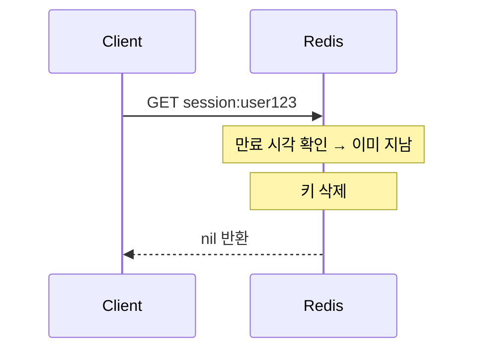
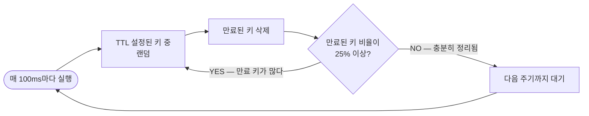
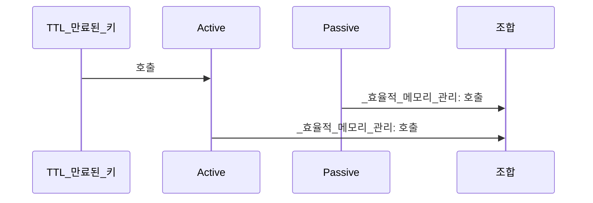

로그인 세션이 24시간 뒤 자동 만료되지 않는다면 어떻게 될까? 사용자가 로그아웃을 잊으면 그 세션은 영원히 메모리에 남는다. 수백만 명이 사용하는 서비스라면 Redis 메모리가 조금씩, 그러나 확실히 고갈된다. 어느 날 새벽 OOM으로 Redis가 죽고서야 원인을 찾는다. TTL은 이 문제를 `EX 3600` 한 줄로 해결한다.

## TTL이란 무엇이고 왜 필요한가

> **비유**: TTL은 냉장고 속 우유의 유통기한 스티커와 같다. 유통기한을 붙여두면 그 날짜가 지나면 알아서 버려진다. 매번 꺼내서 날짜를 확인하고 상했는지 코로 맡아볼 필요가 없다. 수백만 개의 우유가 냉장고(Redis)에 있다면 자동 처리는 생존 조건이다.

TTL(Time To Live)은 Redis 키에 **수명**을 부여하는 기능이다. 설정된 시간이 지나면 키가 자동으로 삭제된다.

```bash
SET session:user123 "data"
EXPIRE session:user123 3600      # 3600초(1시간) 후 자동 삭제

# 또는 SET과 동시에
SET session:user123 "data" EX 3600
```

### 관련 명령어

| 명령어 | 설명 |
|--------|------|
| `EXPIRE key seconds` | 초 단위 TTL 설정 |
| `PEXPIRE key ms` | 밀리초 단위 TTL 설정 |
| `EXPIREAT key timestamp` | Unix 타임스탬프로 만료 시점 지정 |
| `TTL key` | 남은 TTL 확인 (초 단위) |
| `PTTL key` | 남은 TTL 확인 (밀리초) |
| `PERSIST key` | TTL 제거 → 영구 키로 전환 |

```bash
TTL mykey
# -1 : 키가 존재하지만 TTL 없음 (영구)
# -2 : 키 자체가 없음
# 양수 : 남은 초
```

---

## 만료 처리의 두 전략 — 왜 두 가지가 필요한가

TTL이 지난 키를 언제 삭제하는가? Redis는 **두 전략을 조합**한다. 하나만 쓰면 각각 심각한 단점이 생긴다.

### 전략 1: Passive Expiration (수동 만료)

클라이언트가 키에 **접근할 때** 만료 여부를 확인하고 삭제한다.



- **장점**: 아무도 건드리지 않으면 CPU를 전혀 쓰지 않는다.
- **단점**: 아무도 접근하지 않는 키는 **영원히 메모리에 남는다**. 만료됐지만 삭제 안 된 키가 메모리를 조용히 잠식한다.

### 전략 2: Active Expiration (능동 만료)

Redis가 **주기적으로(초당 10회)** 만료된 키를 찾아 능동적으로 삭제한다.



**핵심**: 만료 키가 많으면 **적극적으로** 계속 정리하고, 적으면 **느긋하게** 대기한다. CPU 사용량과 메모리 낭비 사이에서 균형을 맞추는 적응형 알고리즘이다.

만약 Active Expiration이 없다면? 아무도 접근하지 않는 세션 수백만 개가 만료 후에도 메모리에 쌓인다. TTL을 설정해도 메모리가 줄지 않는 이상한 상황이 된다.

### 두 전략의 조합 효과



---

## 내부 구현 — 어떻게 만료 시각을 기억하는가

Redis는 내부적으로 **두 개의 딕셔너리**를 관리한다:

```c
typedef struct redisDb {
    dict *dict;     // 모든 키-값 저장소
    dict *expires;  // TTL이 설정된 키 → 만료 Unix timestamp 매핑
} redisDb;
```

`EXPIRE key 60` 을 실행하면:
1. `expires` 딕셔너리에 `key → (현재시각 + 60초의 timestamp)` 추가
2. `dict`(실제 값 저장소)에는 변화 없음

만료 확인 시:
1. `expires`에서 키의 만료 timestamp 조회
2. `현재 timestamp > 만료 timestamp` 이면 삭제
3. `dict`와 `expires` 양쪽에서 제거

---

## TTL과 메모리 정책 (Eviction)

TTL 만료와 **메모리 초과 시 퇴거(eviction)**는 **별개 메커니즘**이다. TTL이 아직 남아있어도 메모리가 꽉 차면 퇴거될 수 있다.

### maxmemory-policy 옵션

`maxmemory` 한도에 도달했을 때 어떤 키를 제거할지 결정한다:

| 정책 | 설명 | 언제 쓰나 |
|------|------|---------|
| `noeviction` | 쓰기 거부 (에러 반환) | 캐시가 아닌 영구 저장소 |
| `allkeys-lru` | 전체 키 중 최근에 안 쓴 키 제거 | 일반 캐시 |
| `volatile-lru` | TTL 있는 키만 LRU 제거 | 영구 키는 보호하고 싶을 때 |
| `allkeys-lfu` | 전체 키 중 자주 안 쓴 키 제거 (4.0+) | 접근 빈도 기반 캐시 |
| `volatile-lfu` | TTL 있는 키만 LFU 제거 | 영구 키는 보호하고 빈도 기반 캐시 |
| `allkeys-random` | 랜덤 제거 | 접근 패턴 예측 불가, 단순 캐시 |
| `volatile-random` | TTL 있는 키 중 랜덤 제거 | 영구 키 보호 + 단순 캐시 |
| `volatile-ttl` | TTL이 가장 짧은 키 먼저 제거 | 만료 임박 키를 먼저 정리하고 싶을 때 |

### 실무 권장

```conf
# redis.conf
maxmemory 4gb
maxmemory-policy allkeys-lfu   # 캐시 용도 — 자주 안 쓰인 키 먼저 퇴거
```

- **캐시 용도**: `allkeys-lru` 또는 `allkeys-lfu` — 모든 키가 퇴거 후보
- **세션 저장소**: `volatile-lru` — TTL 없는 키(중요 데이터)는 퇴거 안 함

---

## TTL 관련 함정 4가지

### 함정 1: SET은 TTL을 제거한다

```bash
SET mykey "v1" EX 100   # TTL 100초 설정
SET mykey "v2"          # 값만 바꾸려 했지만...
TTL mykey               # → -1 (TTL 사라짐!)
```

`SET`은 키 전체를 새로 만들므로 기존 TTL이 사라진다. 값만 변경하려면:

```bash
SET mykey "v2" KEEPTTL   # Redis 6.0+ — 기존 TTL 유지
# 또는
SET mykey "v2"
EXPIRE mykey 100         # TTL 다시 설정
```

### 함정 2: RENAME은 TTL을 이전한다

```bash
SET a "hello" EX 100
SET b "world"           # b는 TTL 없음
RENAME a b              # a의 내용과 TTL이 b로 이전됨
TTL b                   # → 약 100 (a의 TTL이 따라왔다!)
```

`RENAME` 이후 대상 키(b)의 원래 TTL은 사라지고 원본(a)의 TTL로 덮어씌워진다.

### 함정 3: INCR, LPUSH 등은 TTL에 영향 없음

```bash
SET counter 0 EX 100
INCR counter            # 값만 변경, TTL 유지
TTL counter             # → 약 100 (보존됨)
```

**키의 값을 변경하는 명령어**(`INCR`, `LPUSH`, `HSET` 등)는 TTL을 건드리지 않는다. **키 자체를 새로 쓰는 명령어**(`SET`, `GETSET` 등)만 TTL에 영향을 준다.

### 함정 4: RDB/AOF에서 TTL 처리

- **RDB**: 스냅샷 저장 시 만료 timestamp도 함께 저장. 로딩 시 이미 만료된 키는 무시한다.
- **AOF**: `EXPIREAT`(절대 timestamp) 형태로 기록. 재시작 후 정확한 만료 처리 가능.
- **복제 환경**: 마스터에서 키가 만료되면 레플리카에 `DEL` 명령어를 전파한다. 레플리카가 능동적으로 만료 처리를 하면 마스터/레플리카 불일치가 생길 수 있으므로, 레플리카의 Active Expiration은 마스터의 전파에 의존한다.

---

## 실무 활용 패턴

### 세션 관리

```bash
SET session:abc123 "{userId:1, role:admin}" EX 1800   # 30분 세션
# 사용자 활동 시 갱신
EXPIRE session:abc123 1800                             # 마지막 활동부터 30분 리셋
```

### 캐시 + TTL

```bash
SET cache:product:100 "{name:...}" EX 300   # 5분 캐시
# 만료 후 접근하면 nil → 애플리케이션이 DB 조회 후 다시 저장
```

### Rate Limiting

```bash
SET ratelimit:user:123 1 EX 60 NX   # 1분 윈도우 최초 시작 (NX: 없을 때만 생성)
INCR ratelimit:user:123             # 요청마다 증가
# 값이 100 초과 → 거부 / 60초 후 키 자동 만료 → 윈도우 리셋
```

---

## 정리

| 항목 | 핵심 |
|------|------|
| 만료 방식 | Passive(접근 시 즉시) + Active(100ms마다 샘플링) 조합 |
| 내부 구조 | `expires` 딕셔너리에 만료 timestamp 저장 |
| SET 주의 | `SET`은 TTL 제거 → `KEEPTTL` 또는 `EXPIRE` 재설정 |
| 메모리 초과 | TTL 만료와 별개로 `maxmemory-policy`가 동작 |
| 복제 환경 | 마스터 만료 → 레플리카에 DEL 전파 |

---

## 왜 TTL 관리가 중요한가?

TTL은 Redis의 핵심 메모리 관리 수단이다. TTL 없이 데이터를 쌓으면 메모리가 조금씩 차오르다 `maxmemory` 한계에서 OOM 에러나 예상치 못한 키 삭제가 발생한다. TTL 설계는 캐시 전략(Cache-Aside, Write-Through)과 직결되며, 너무 짧으면 캐시 미스율이 높아지고 너무 길면 stale 데이터 문제가 생긴다.

---

## 실무에서 자주 하는 실수

**실수 1: TTL 없이 캐시 키 저장**
`SET user:1 '{...}'`처럼 TTL 없이 저장한다. 사용자가 늘어날수록 키가 무한히 쌓이고 메모리가 서서히 찬다. `maxmemory-policy allkeys-lru`를 설정해도 중요한 키가 예상치 못하게 삭제될 수 있다. 모든 캐시 키에는 `PX`/`EX` 옵션으로 TTL을 설정한다.

**실수 2: SET 명령으로 기존 TTL 덮어쓰기**
`SET key value`는 기존 키의 TTL을 제거한다. 캐시를 갱신하려고 SET을 실행하면 영구 키가 되어버린다. `SET key value KEEPTTL`(Redis 6.0+) 또는 갱신 후 `EXPIRE`를 재설정해야 한다.

**실수 3: TTL을 고정값으로만 설정해 캐시 스탬피드 발생**
같은 시간에 생성된 수천 개의 캐시가 동일한 TTL로 동시에 만료된다. 순간적으로 수천 개의 DB 쿼리가 몰려 DB가 과부하 상태가 된다. TTL에 랜덤 지터(jitter)를 추가한다: `TTL = base_ttl + random(0, base_ttl * 0.1)`.

**실수 4: 만료 이벤트에 의존한 비즈니스 로직**
`notify-keyspace-events`의 만료 이벤트로 후속 처리를 구현한다. Redis는 만료를 지연 삭제(lazy expiration)할 수 있어 이벤트 발생 시점이 보장되지 않는다. 비즈니스 로직은 별도 스케줄러나 Kafka로 처리해야 한다.

**실수 5: EXPIREAT으로 절대 시각 설정 시 서버 시각 불일치**
여러 앱 서버에서 `EXPIREAT`로 Unix timestamp를 설정할 때 서버 간 시각이 수 초 차이나면 TTL이 예상과 다르게 동작한다. NTP 동기화를 확인하거나 `EXPIRE`(상대 시간)를 사용한다.

---

## 핵심 메트릭

| 메트릭 | 정상 기준 | 이상 신호 | 원인 가설 |
|--------|---------|---------|---------|
| 만료 키 비율 (`expired_keys` / `total_keys`) | 일정 수준 유지 | 급증 또는 0% | TTL 일괄 만료(스탬피드), TTL 미설정 |
| TTL 없는 키 수 (`TTL key = -1` 비율) | 5% 미만 | 5% 초과 증가 추세 | TTL 설정 누락, SET으로 TTL 덮어쓰기 |
| eviction 발생 빈도 (`evicted_keys`) | 0 | 증가 | maxmemory 도달, 캐시 용량 부족 |
| used_memory / maxmemory 비율 | 70% 이하 | 85% 초과 | TTL 없는 키 누적, bigkey 적재 |
| Active Expiration CPU 점유율 | 낮음 | 급증 | 만료 키가 25% 이상 — 정리 루프 과부하 |
| 캐시 히트율 (`keyspace_hits` / 전체) | 95% 이상 | 70% 미만 | TTL이 너무 짧아 캐시 미스 급증 |

## 실제 장애 사례

### 사례 1: maxmemory 도달 후 noeviction으로 쓰기 전면 거부

**상황**: 사용자 활동 로그를 Redis Hash에 저장하는 코드에 TTL 설정이 누락됐다. 3개월 운영 후 8GB Redis의 메모리 사용량이 7.8GB에 도달했다. `maxmemory-policy noeviction`(기본값) 설정으로 인해 신규 쓰기가 전부 `OOM command not allowed when used memory > 'maxmemory'` 에러로 실패했다. 로그인, 주문, 결제 등 Redis를 사용하는 모든 쓰기 기능이 동시에 중단됐다.

**근본 원인**: TTL 없이 적재된 키가 수천만 개 쌓였고, `noeviction` 정책은 메모리 부족 시 새 쓰기를 거부한다. 사용되지 않는 오래된 데이터가 메모리를 점유한 채 자동으로 정리되지 않았다.

**해결책**:
- 즉시 조치: `redis-cli --bigkeys`로 대형 키 식별 후 `UNLINK`로 삭제
- `maxmemory-policy allkeys-lru`로 변경하여 메모리 부족 시 LRU 키 자동 퇴거
- 모든 신규 키 저장 코드에 TTL 필수 설정 규칙 코드 리뷰 체크리스트 추가
- 주간 모니터링: `TTL=-1` 키 비율이 5% 초과 시 알림

**교훈**: `noeviction`은 데이터 유실을 막지만 서비스 장애를 일으킨다. 캐시 용도라면 반드시 `allkeys-lru`나 `allkeys-lfu`를 사용하라.

---

### 사례 2: 캐시 스탬피드로 DB 과부하 후 서비스 응답 지연

**상황**: 쇼핑몰 인기 상품 5,000개를 정각에 일괄 캐싱하면서 모두 동일한 TTL 60초를 설정했다. 60초 후 5,000개 캐시가 동시에 만료됐다. 초당 5만 건 조회가 전부 캐시 미스로 DB에 몰렸고, DB CPU가 100%에 도달하면서 응답 시간이 10초 이상으로 늘어났다.

**근본 원인**: 동일한 시각에 생성된 키에 동일한 TTL을 부여하면 만료 시각도 동일해진다. 수천 개 키가 같은 순간 만료되면 DB에 동시 쿼리 폭풍이 발생한다(Thundering Herd).

**해결책**:
- TTL에 랜덤 지터 적용: `TTL = 60 + ThreadLocalRandom.nextInt(-15, 15)` (45~75초 분산)
- Cache-Aside 패턴에 Mutex Lock 추가: 동일 키 동시 DB 조회를 한 건으로 직렬화
- 핫 키는 TTL 만료 전 백그라운드에서 미리 갱신하는 Cache Warming 적용

**교훈**: 대량 키의 TTL은 절대 동일하게 설정하지 마라. 10~30% 랜덤 지터가 DB를 살린다.

---

### 사례 3: SET 명령으로 TTL 덮어쓰기로 세션 영구화

**상황**: 세션 갱신 코드에서 `redisTemplate.opsForValue().set(key, value)`를 사용했다. 원래 30분 TTL이 설정된 세션 키였는데, 갱신 후 TTL이 사라지고 영구 키(`TTL = -1`)가 됐다. 수백만 개의 세션 키가 만료되지 않고 쌓여 메모리를 잠식했다.

**근본 원인**: `SET` 명령은 기존 키를 완전히 덮어쓴다. TTL 포함 모든 메타데이터가 초기화된다. 값만 바꾸려 했지만 TTL도 함께 삭제됐다.

**해결책**:
- Redis 6.0+: `SET key value KEEPTTL`로 기존 TTL 유지
- 이전 버전: `SET` 후 `EXPIRE key 1800` 재설정
- Spring Data Redis: `redisTemplate.opsForValue().set(key, value, Duration.ofMinutes(30))` 형태로 항상 TTL 명시
- 기존 누적 영구 키: 배치 스크립트로 `SCAN + TTL=-1 키 EXPIRE 설정` 처리

**교훈**: 세션·캐시 키를 SET으로 갱신할 때는 TTL도 반드시 함께 명시해야 한다. KEEPTTL 옵션을 습관화하라.

---

## 면접 포인트

**Q1. Redis의 키 만료(expiration) 메커니즘은?**
두 가지 방식이 병행된다. ① Lazy expiration: 키에 접근할 때 만료 여부를 확인하고 삭제 ② Active expiration: 백그라운드에서 주기적으로(초당 10회) 만료된 키 샘플을 검사해 삭제. 두 방식 덕분에 만료된 키가 즉시 메모리에서 해제되지 않을 수 있다(`DEBUG SLEEP`으로 확인 가능).

**Q2. maxmemory-policy 종류와 선택 기준은?**
`noeviction`(기본): OOM 에러 반환 — 데이터 유실 불가 시. `allkeys-lru`: 전체 키 중 최근 미사용 순 삭제 — 범용 캐시. `volatile-lru`: TTL 있는 키만 LRU 삭제 — TTL 없는 키는 보호. `allkeys-lfu`: 접근 빈도 기반 삭제(Redis 4.0+) — 핫 데이터 보존에 유리. 캐시 전용이면 `allkeys-lru`나 `allkeys-lfu`가 실무 표준이다.

**Q3. TTL 지터(jitter)가 필요한 이유는?**
동일 TTL로 대량의 키가 동시에 만료되면 캐시 스탬피드(thundering herd)가 발생한다. 만료 시점을 분산시키기 위해 `base_ttl * (1 + random * 0.1)` 형태로 TTL에 노이즈를 추가한다. Netflix, Facebook 등 대규모 캐시 시스템에서 필수로 적용한다.

**Q4. 복제 환경에서 TTL은 어떻게 동기화되는가?**
마스터에서 키가 만료되면 `DEL` 명령을 레플리카에 전파한다. 레플리카는 자체적으로 만료 처리를 하지 않고(replica-lazy-expire 기본 no) 마스터의 DEL을 기다린다. 따라서 레플리카에서 읽을 때 만료된 키가 순간적으로 보일 수 있다.

**Q5. PERSIST 명령의 용도는?**
`PERSIST key`는 키의 TTL을 제거해 영구 키로 만든다. 임시 세션 데이터를 사용자가 "로그인 유지"를 선택했을 때 영구화하는 패턴에서 활용한다. `TTL key`로 현재 남은 시간을 확인하고(-1이면 영구, -2면 키 없음) 필요 시 PERSIST 또는 EXPIRE를 적용한다.

---
## 극한 시나리오

### 시나리오 1: 캐시 스탬피드 — 인기 상품 TTL 동시 만료

쇼핑몰 인기 상품 100개를 Redis에 TTL 60초로 캐시했습니다. 초당 1만 건 조회. 정각에 모든 캐시가 동시 만료됩니다.

**만료 순간 무슨 일이 일어나는가:**
- 1만 TPS 중 100개 상품에 대해 동시에 캐시 Miss
- 각 상품당 수백 건의 요청이 동시에 DB 조회 시작
- DB에 100 × 수백 = 수만 건의 동시 쿼리 → DB 과부하 → 타임아웃 → 서비스 장애

**TTL Jitter로 해결:**
```java
@Service
public class ProductCacheService {
    private static final int BASE_TTL = 60;
    private static final int JITTER = 20;  // ±20초 랜덤 편차

    public Product getProduct(Long productId) {
        String key = "product:" + productId;
        Product cached = redisTemplate.opsForValue().get(key);
        if (cached != null) return cached;

        Product product = productRepository.findById(productId).orElseThrow();
        // 각 상품마다 다른 만료 시각: 40~80초 사이 랜덤
        int ttl = BASE_TTL + ThreadLocalRandom.current().nextInt(-JITTER, JITTER);
        redisTemplate.opsForValue().set(key, product, Duration.ofSeconds(ttl));
        return product;
    }
}
// 결과: 100개 상품의 TTL이 40~80초로 분산
// 동시 만료 대신 초당 1~2개씩 순차적으로 만료 → DB 부하 95% 감소
```

**수치:**
- Jitter 없음: 정각에 DB 쿼리 수만 건 집중 → 응답 지연 10초+
- Jitter 적용: 40초에 걸쳐 분산 → DB 쿼리 초당 2~3건 → 정상 응답

### 시나리오 2: TTL 미설정으로 메모리 고갈

운영 중인 Redis 인스턴스의 메모리가 매주 1GB씩 증가합니다.

**원인 진단:**
```bash
# TTL 없는 키 비율 확인
redis-cli --scan --pattern "*" | while read key; do
  ttl=$(redis-cli TTL "$key")
  if [ "$ttl" == "-1" ]; then
    echo "NO_TTL: $key"
  fi
done | wc -l

# 메모리 사용량 상위 키 확인
redis-cli --bigkeys
```

**실제 장애 사례:** 사용자 활동 로그를 Redis Hash에 저장하는 코드에서 TTL 설정을 빠뜨렸습니다. 3개월 후 8GB Redis 인스턴스의 메모리가 7.5GB에 도달했고 `maxmemory-policy noeviction` 설정으로 인해 신규 쓰기가 전부 OOM 에러로 실패. 서비스 전체 장애로 이어졌습니다.

```java
// 잘못된 코드: TTL 없음
redisTemplate.opsForHash().putAll("user:activity:" + userId, activityData);

// 올바른 코드: 반드시 TTL 설정
redisTemplate.opsForHash().putAll("user:activity:" + userId, activityData);
redisTemplate.expire("user:activity:" + userId, Duration.ofDays(30));

// 또는 원자적으로 (Lua 스크립트)
// HSET key field value && EXPIRE key seconds
```

**예방 정책:**
- `maxmemory-policy allkeys-lru` 설정으로 메모리 임박 시 LRU 자동 삭제
- 신규 키 생성 코드 리뷰 시 TTL 설정 여부 필수 확인 항목 추가
- 주간 모니터링: TTL 없는 키 수가 전체의 5% 초과 시 알림

### 시나리오 3: 세션 TTL 갱신 누락으로 강제 로그아웃

사용자가 오랜 시간 활발히 사용 중인데 갑자기 로그아웃되는 현상이 신고됩니다.

**원인:** 세션 조회(GET) 시 TTL을 갱신하지 않고, 마지막 쓰기(로그인) 시각 기준 TTL만 설정. 사용자가 "읽기"만 하는 30분 동안 세션 만료.

```java
// 잘못된 방식: 조회 시 TTL 갱신 없음
public UserSession getSession(String sessionId) {
    return redisTemplate.opsForValue().get("session:" + sessionId);
    // TTL이 자동 갱신되지 않음
}

// 올바른 방식: 접근마다 TTL 연장
public UserSession getSession(String sessionId) {
    String key = "session:" + sessionId;
    UserSession session = redisTemplate.opsForValue().get(key);
    if (session != null) {
        // 마지막 접근 시각 기준으로 TTL 갱신 (Sliding Expiration)
        redisTemplate.expire(key, Duration.ofMinutes(30));
    }
    return session;
}
// Spring Session 사용 시: spring.session.redis.save-mode=on_get_attribute 설정으로 자동 처리
```

---

## 왜 TTL 관리인가

**TTL(Time To Live) 관리를 신중히 해야 하는 이유는 잘못된 TTL 설정이 데이터 불일치, 메모리 낭비, 캐시 미스 폭풍을 유발하기 때문이다.**

| TTL 전략 | 적합 상황 | 주의점 |
|---------|----------|-------|
| 고정 TTL | 일정 기간만 유효한 세션, 인증 토큰 | 만료 시점 동기화 주의 |
| 슬라이딩 TTL | 활성 세션(접근마다 연장) | EXPIRE 갱신 호출 오버헤드 |
| TTL 없음 | 영속 설정, 코드 테이블 | maxmemory 정책으로 강제 퇴거 위험 |
| 랜덤 지터 TTL | 대량 키 동시 만료 방지 | baseTime + random(0~30%) |

같은 시각에 생성된 수천 개의 캐시 키가 같은 TTL을 가지면 동시에 만료돼 DB 부하가 폭발한다. TTL에 10~30%의 랜덤 지터를 더하면 만료 시점이 분산돼 캐시 스탬피드를 방지할 수 있다.
