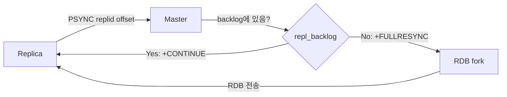
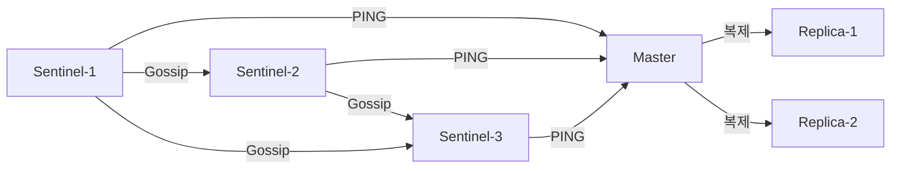
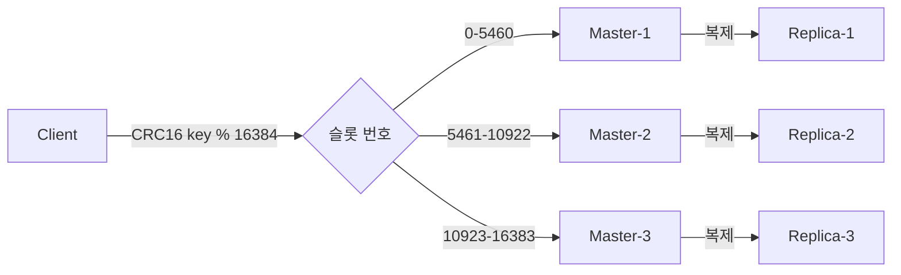
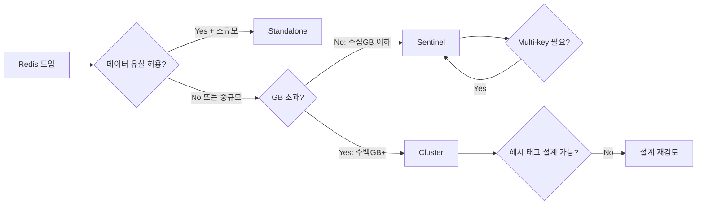

> **한 줄 요약**: Redis는 단일 프로세스(Standalone)에서 시작해 자동 장애복구(Sentinel), 수평 확장(Cluster)으로 진화하며, 각 모드는 해결하는 문제가 근본적으로 다르다 — 무엇을 선택하느냐는 곧 어떤 장애를 감수하느냐를 결정한다.

---

## 1. 왜 세 가지 모드가 필요한가

Redis는 단일 장비가 가진 세 가지 벽에 부딪힌다.

- **메모리 용량**: 64GB 서버에서 Redis가 사용할 수 있는 최대 데이터는 약 50~55GB. `maxmemory` 초과 시 `maxmemory-policy`에 따라 키를 강제 퇴거(eviction)시키거나, `noeviction` 정책에서는 쓰기를 거부한다.
- **가용성**: 단일 프로세스 장애 시 즉시 서비스 중단. 재시작 복구 시간이 RDB 크기에 비례해 수십 초~수 분에 달한다.
- **처리량**: Redis 6.0 이전까지 명령 처리는 단일 스레드. `KEYS *` 같은 O(N) 명령 하나가 전체 이벤트 루프를 블로킹할 수 있다.

### 각 모드가 해결하는 문제

| 모드 | 핵심 문제 | 해결 방식 |
|------|----------|----------|
| Standalone | 단순 캐시, 데이터 손실 감수 | 단일 프로세스 + 선택적 복제 |
| Sentinel | 단일 마스터 장애 = 서비스 중단 | 자동 장애 감지 + 페일오버 |
| Cluster | 단일 노드 메모리/처리량 한계 | 데이터 샤딩 + 다중 마스터 |

세 모드는 기능이 겹치지 않는다. **선택 실수는 곧 운영 사고로 이어진다.**

> **실제 사고**: 국내 커머스 플랫폼이 플래시 세일 당일 Redis 마스터 OOM으로 프로세스가 종료됐다. Replica는 있었지만 Sentinel이 없어 자동 페일오버가 불가능했고, 운영자가 수동으로 승격하는 동안 4분간 주문 서비스가 다운됐다. **복제만으로는 가용성을 보장할 수 없다.**

---

## 2. Standalone 모드

### 아키텍처

Redis Standalone은 **이벤트 루프(ae)** 기반 단일 프로세스다. Linux에서 `epoll`, macOS에서 `kqueue`를 사용해 I/O 이벤트를 비동기로 처리한다.

명령 실행 자체는 Redis 6.0 이후에도 단일 스레드다. 6.0에서 추가된 I/O 멀티스레딩은 **네트워크 read/write 파싱**에만 적용된다. 이 구조 덕분에 레이스 컨디션 없이 원자적(atomic) 명령을 보장할 수 있다.

`KEYS *`, `SMEMBERS`(대형 Set) 같은 O(N) 명령은 이벤트 루프를 수십~수백 밀리초 블로킹한다. `slowlog get 10`으로 주기적으로 확인하고, `SCAN` 커서 기반 반복자로 대체해야 한다.

### 복제: PSYNC 프로토콜

Replica가 마스터에 연결될 때 두 가지 정보를 교환한다.

- **Replication ID (replid)**: 마스터 기동 시 생성하는 40자리 랜덤 16진수. 마스터가 교체되거나 재시작되면 새로 생성된다.
- **Replication Offset (repl_offset)**: 마스터가 replica에게 전송한 누적 바이트 오프셋.



- **부분 재동기화**: `repl_backlog` 링 버퍼(기본 1MB) 안에 해당 offset 이후 데이터가 있으면 누락된 명령만 전송
- **전체 재동기화**: 버퍼 오버플로 또는 replid 불일치 시 RDB 스냅샷 전송. 대형 인스턴스에서 수분이 걸리고 CPU/메모리에 상당한 부하를 준다.

### 영속성: RDB vs AOF

**RDB**: `fork()`로 자식 프로세스를 생성해 디스크에 쓴다. 복구 속도 빠름, 파일 크기 작음. 스냅샷 간격 사이의 쓰기 데이터는 유실된다.

**AOF**: 모든 쓰기 명령을 RESP 형식으로 순서대로 기록. `fsync` 정책:
- `appendfsync always`: 데이터 유실 0, 성능 급저하
- `appendfsync everysec`: 최대 1초 유실. **실무 권장값**
- `appendfsync no`: OS가 결정(기본 30초), 유실 위험 큼

**RDB-AOF 혼합 모드 (Redis 4.0+)**: `aof-use-rdb-preamble yes` 설정 시 AOF 앞부분에 RDB 바이너리를 기록하고, 이후 변경 사항만 AOF 형식으로 추가. 복구 속도와 내구성을 동시에 확보하는 현재 권장 설정이다.

### 언제 Standalone이 적합한가

- 개발/테스트 환경
- 캐시 전용(Cache-aside): 데이터 유실이 허용되고 원본 DB에서 재생성 가능
- 데이터 규모 < 수십 GB, 장애 시 수 분의 다운타임을 감수할 수 있는 내부 도구

---

## 3. Sentinel 모드 — 자동 장애 감지와 페일오버

### 아키텍처

Sentinel은 별도의 Redis 프로세스(`redis-sentinel`)로 동작하며 데이터를 저장하지 않는다. 역할은 **모니터링, 알림, 페일오버 자동화, 구성 제공자** 네 가지다.

클라이언트는 Redis 마스터에 직접 연결하지 않고, 먼저 Sentinel에 마스터 주소를 질의한다.

**왜 Sentinel은 최소 3대가 필요한가?** 페일오버는 "과반수(quorum)"의 동의가 필요하다. Sentinel이 2대이면 네트워크 파티션 시 어느 쪽도 과반수를 확보할 수 없어 페일오버가 영원히 일어나지 않는다. 3대에서 한 대가 장애여도 나머지 2대가 quorum을 형성한다.



### SDOWN vs ODOWN

- **SDOWN (Subjectively Down)**: 단일 Sentinel이 `down-after-milliseconds` 동안 유효한 응답을 받지 못하면 혼자 판단. 이것만으로는 페일오버가 시작되지 않는다.
- **ODOWN (Objectively Down)**: `quorum` 이상의 Sentinel이 동의하면 전환. 이 시점부터 페일오버가 시작된다.

### 페일오버 과정

1. **마스터 다운 감지**: 각 Sentinel이 1초마다 PING. `down-after-milliseconds` 내 응답 없으면 SDOWN
2. **ODOWN 합의**: SDOWN Sentinel이 다른 Sentinel들에게 투표 요청. quorum 달성 시 ODOWN
3. **리더 Sentinel 선출**: Raft 유사 방식. 에포크 번호가 높은 후보 우선, 과반수 투표 확보 시 리더
4. **최적 replica 선택**: replica-priority → replication offset → Run ID 순으로 적용
5. **SLAVEOF NO ONE**: 선택된 replica에게 명령 전송, 해당 replica가 마스터로 전환
6. **나머지 replica 리포인팅**: 다른 replica들에게 새 마스터 주소 전달. 전부 Full Resync 수행
7. **클라이언트 리디렉션**: `+switch-master` 이벤트로 Lettuce/Jedis 커넥션 풀 자동 갱신

전체 소요 시간: 통상 5~30초의 쓰기 중단이 발생한다.

### Split-Brain 방어

네트워크 파티션으로 구 마스터와 신 마스터가 동시에 쓰기를 받으면, 파티션 복구 후 구 마스터에 기록된 데이터가 **롤백(유실)**된다.

```conf
min-replicas-to-write 1
min-replicas-max-lag 10
```

이 설정은 "최소 1개 replica가 10초 이내 lag으로 연결된 경우에만 쓰기를 허용"한다. 파티션으로 격리된 구 마스터는 쓰기를 거부해 유실을 방지한다.

### 클라이언트 연동: Spring Boot + Lettuce

```java
@Configuration
public class RedisConfig {

    @Bean
    public RedisConnectionFactory redisConnectionFactory() {
        RedisSentinelConfiguration sentinelConfig =
            new RedisSentinelConfiguration("mymaster",
                Set.of("sentinel1:26379", "sentinel2:26379", "sentinel3:26379"));
        sentinelConfig.setPassword(RedisPassword.of("your-password"));

        LettuceClientConfiguration clientConfig = LettuceClientConfiguration.builder()
            .readFrom(ReadFrom.REPLICA_PREFERRED)
            .commandTimeout(Duration.ofSeconds(2))
            .build();

        return new LettuceConnectionFactory(sentinelConfig, clientConfig);
    }
}
```

### Sentinel 모드의 한계

- **수평 확장 불가**: 전체 데이터가 단일 마스터 메모리에 들어가야 한다.
- **쓰기 처리량 제한**: 모든 쓰기가 마스터 단일 스레드를 통과한다.
- **페일오버 중 쓰기 중단**: 통상 5~30초.
- Multi-key 연산(`MGET`, Lua, 트랜잭션)은 제약 없이 동작한다(Cluster와의 차이점).

---

## 4. Cluster 모드 — 수평 확장과 자동 샤딩

### 아키텍처: 16384 해시 슬롯

Redis Cluster는 데이터를 **16384개의 해시 슬롯**으로 분할한다. 각 키는 `CRC16(key) % 16384`로 슬롯 번호가 결정된다.

예: 3 마스터 구성 시
- M1: 슬롯 0 ~ 5460
- M2: 슬롯 5461 ~ 10922
- M3: 슬롯 10923 ~ 16383

16384를 선택한 이유: 슬롯 비트맵 크기를 2KB(16384/8)로 제한해 gossip 트래픽을 최소화하면서, 1000개 이상의 노드도 수용할 수 있기 때문이다.



### MOVED vs ASK 리디렉션

| 구분 | MOVED | ASK |
|------|-------|-----|
| 의미 | 슬롯 소유권 영구 이전 완료 | 마이그레이션 중 임시 리디렉션 |
| 슬롯 캐시 갱신 | O | X |
| ASKING 선행 필요 | X | O |
| 발생 시점 | 정상 운영 + 슬롯 이전 후 | 슬롯 이전 진행 중 |

### 해시 태그 {tag}

`MGET`, `MSET` 같은 Multi-key 명령은 관련 키들이 모두 동일 슬롯에 있어야 한다. 다른 슬롯의 키를 묶으면 `CROSSSLOT` 오류가 발생한다.

```
user:{1001}:profile  -> CRC16("1001") % 16384 = 슬롯 X
user:{1001}:orders   -> CRC16("1001") % 16384 = 슬롯 X (동일)
```

주의: 해시 태그를 남용하면 특정 슬롯에 키가 집중되어 **핫 슬롯(Hot Slot)** 문제가 발생한다.

### 클러스터 페일오버

마스터가 `cluster-node-timeout`(기본 15초) 동안 응답하지 않으면 replica들이 페일오버를 시작한다. replication offset이 큰 replica(최신 데이터를 가진)가 우선 승격된다.

`cluster-require-full-coverage yes`(기본): 일부 슬롯이 커버되지 않으면 클러스터 전체 쓰기를 거부한다. `no`로 설정하면 가용한 슬롯에 대해 계속 서비스한다.

### 데이터 유실 주의

복제는 **비동기**다. 마스터가 `OK` 응답 후 replica에 복제 전에 장애나면 쓰기가 유실된다. 중요한 쓰기에 한해 `WAIT` 명령으로 동기 복제를 확인할 수 있지만 성능 비용이 따른다.

```java
// 최소 1개 replica에 복제될 때까지 최대 1000ms 대기
redisTemplate.execute((RedisCallback<Long>) connection -> {
    connection.set(key.getBytes(), value.getBytes());
    return connection.wait(1, 1000);
});
```

### 클라이언트 연동: Spring Boot + Lettuce Cluster

```java
@Configuration
public class RedisClusterConfig {

    @Bean
    public RedisConnectionFactory redisConnectionFactory() {
        RedisClusterConfiguration clusterConfig = new RedisClusterConfiguration(
            List.of("redis-node1:6379", "redis-node2:6379", "redis-node3:6379")
        );
        clusterConfig.setPassword(RedisPassword.of("your-password"));
        clusterConfig.setMaxRedirects(3);

        ClusterTopologyRefreshOptions topologyRefresh =
            ClusterTopologyRefreshOptions.builder()
                .enablePeriodicRefresh(Duration.ofMinutes(1))
                .enableAllAdaptiveRefreshTriggers()  // MOVED/ASK 발생 시 즉시 토폴로지 갱신
                .build();

        LettuceClientConfiguration clientConfig = LettuceClientConfiguration.builder()
            .clientOptions(ClusterClientOptions.builder()
                .topologyRefreshOptions(topologyRefresh).build())
            .readFrom(ReadFrom.REPLICA_PREFERRED)
            .build();

        return new LettuceConnectionFactory(clusterConfig, clientConfig);
    }
}
```

---

## 5. 세 모드 종합 비교

| 항목 | Standalone | Sentinel | Cluster |
|------|-----------|----------|---------|
| **자동 페일오버** | X | O | O |
| **수평 확장(샤딩)** | X | X | O |
| **데이터 용량 한계** | 단일 노드 메모리 | 단일 노드 메모리 | 노드 수 × 메모리 |
| **쓰기 처리량** | 단일 마스터 | 단일 마스터 | 마스터 수만큼 분산 |
| **Multi-key 연산** | 제한 없음 | 제한 없음 | 같은 슬롯만 가능 |
| **Lua 스크립트** | 완전 지원 | 완전 지원 | 단일 슬롯 키만 |
| **트랜잭션(MULTI/EXEC)** | 완전 지원 | 완전 지원 | 단일 슬롯 키만 |
| **운영 복잡도** | 낮음 | 중간 | 높음 |
| **최소 노드 수** | 1 | 6 (Sentinel 3 + Redis 3) | 6 (master 3 + replica 3) |
| **페일오버 시간** | 수동 | 5~30초 | 10~30초 |
| **적합 규모** | 소규모 | 중규모 | 대규모 |



단일 Redis가 50GB를 넘거나, 초당 쓰기가 10만 ops를 초과하거나, 레이턴시 SLA가 1ms 이하라면 Cluster를 검토한다. 그 이하에서는 Sentinel이 운영 복잡도 대비 충분하다.

---

## 6. 극한 시나리오와 운영 Best Practice

### 시나리오 1: 마스터 OOM Kill

**Sentinel 환경**: `down-after-milliseconds` 후 SDOWN → ODOWN → replica 승격. 약 30초~1분 이내 자동 복구. 단, 구 마스터가 자동 재시작되지 않으면 복구 후 토폴로지는 마스터 1 + replica 1로 줄어 또 다른 장애에 취약해진다.

**Cluster 환경**: OOM Kill된 노드의 슬롯은 `cluster-node-timeout` 후 replica가 자동 승격. 단, replica가 없거나 함께 장애라면 `cluster-require-full-coverage yes` 시 전체 쓰기가 중단된다.

```bash
# OS 레벨 OOM kill 방어
echo 1 > /proc/sys/vm/overcommit_memory
echo -500 > /proc/$(pgrep redis-server)/oom_score_adj
```

### 시나리오 2: 핫키(Hot Key) 과부하

특정 키에 초당 수만 번 조회가 집중되면 해당 슬롯의 마스터 CPU가 100%에 달한다.

**해결책 1**: `ReadFrom.REPLICA_PREFERRED`로 읽기 트래픽을 replica에 분산

**해결책 2**: JVM 로컬 캐시(Caffeine)에 짧은 TTL로 캐싱해 Redis 호출 자체를 줄임

```java
@Service
public class StockService {
    private final Cache<String, Long> localCache = Caffeine.newBuilder()
        .expireAfterWrite(500, TimeUnit.MILLISECONDS)
        .maximumSize(1000)
        .build();

    public long getStock(String productId) {
        return localCache.get("stock:" + productId, key ->
            redisTemplate.opsForValue().get(key));
    }
}
```

**해결책 3**: `product:1234:stock:{0}` ~ `product:1234:stock:{N-1}` 여러 키에 분산, 조회 시 랜덤 선택

### 운영 체크리스트

**필수 설정 (`redis.conf`)**:
```conf
maxmemory 48gb
maxmemory-policy allkeys-lru
appendonly yes
appendfsync everysec
aof-use-rdb-preamble yes
min-replicas-to-write 1
min-replicas-max-lag 10
slowlog-log-slower-than 10000
maxclients 10000
tcp-keepalive 300
```

**모니터링 필수 지표**:

| 지표 | 정상 범위 | 경고 기준 |
|------|---------|---------|
| `used_memory_rss` / `used_memory` (단편화율) | 1.0~1.5 | >2.0 또는 <1.0 |
| `connected_clients` | < `maxclients` × 0.8 | > `maxclients` × 0.9 |
| `blocked_clients` | 0 | > 0 (BLPOP 등 제외) |
| `rdb_last_bgsave_status` | `ok` | `err` |
| `master_link_status` | `up` | `down` |

---

## 7. 실전 구성 예시

### Sentinel 구성

**sentinel.conf**:
```conf
sentinel monitor mymaster redis-master 6379 2
sentinel auth-pass mymaster yourpassword
sentinel down-after-milliseconds mymaster 5000
sentinel failover-timeout mymaster 60000
sentinel parallel-syncs mymaster 1
```

**Spring Boot `application.yml`**:
```yaml
spring:
  data:
    redis:
      sentinel:
        master: mymaster
        nodes:
          - sentinel-1:26379
          - sentinel-2:26379
          - sentinel-3:26379
      password: yourpassword
      lettuce:
        pool:
          max-active: 20
          max-idle: 10
          min-idle: 5
          max-wait: 2000ms
```

### Cluster 구성

**클러스터 초기화**:
```bash
redis-cli --cluster create \
  redis-node1:6379 redis-node2:6379 redis-node3:6379 \
  redis-node4:6379 redis-node5:6379 redis-node6:6379 \
  --cluster-replicas 1 --cluster-yes -a yourpassword
```

**node별 redis.conf**:
```conf
port 6379
cluster-enabled yes
cluster-config-file nodes.conf
cluster-node-timeout 15000
cluster-announce-ip 192.168.1.1
requirepass yourpassword
masterauth yourpassword
appendonly yes
appendfsync everysec
min-replicas-to-write 1
min-replicas-max-lag 10
```

**Spring Boot `application.yml`**:
```yaml
spring:
  data:
    redis:
      cluster:
        nodes:
          - redis-node1:6379
          - redis-node2:6379
          - redis-node3:6379
        max-redirects: 3
      password: yourpassword
      lettuce:
        cluster:
          refresh:
            adaptive: true
            period: 60s
```

---

## 8. 면접 포인트

<details>
<summary><strong>Q. Redis가 단일 스레드임에도 빠른 이유는?</strong></summary>

모든 데이터가 메모리에 있으므로 명령 처리 자체는 수 마이크로초에 완료된다. 단일 스레드는 컨텍스트 스위칭과 락 경합이 없어 오히려 유리하다. Redis 6.0+에서 I/O 스레딩이 추가됐지만 명령 처리 자체는 여전히 단일 스레드다.

</details>

<details>
<summary><strong>Q. Sentinel과 Cluster 중 어떤 상황에서 Sentinel을 선택하는가?</strong></summary>

데이터 규모가 단일 노드 메모리에 충분히 들어가고, Multi-key 연산(`MGET`, Lua, 트랜잭션)을 제약 없이 사용해야 하거나, 운영 복잡도를 최소화해야 할 때 Sentinel을 선택한다. 수 GB~수십 GB 규모라면 Sentinel + 고성능 단일 노드가 Cluster보다 운영하기 쉽다.

</details>

<details>
<summary><strong>Q. Cluster에서 MGET이 실패하는 이유와 해결 방법은?</strong></summary>

각 키가 다른 슬롯에 속하면 `CROSSSLOT` 오류가 발생한다. 해결책은 두 가지다. 첫째, 해시 태그를 사용해 관련 키를 같은 슬롯에 배치한다(`{user:1001}:profile`, `{user:1001}:orders`). 둘째, MGET을 개별 GET으로 분해하고 Pipelining으로 묶어 슬롯별 병렬 요청으로 최적화한다.

</details>

<details>
<summary><strong>Q. PSYNC에서 부분 재동기화가 실패하는 조건은?</strong></summary>

`repl_backlog` 링 버퍼(기본 1MB)에 replica의 offset 이후 데이터가 없을 때 실패한다. 구체적으로: (1) 네트워크 단절 시간 동안 발생한 쓰기가 버퍼를 초과했을 때, (2) replica가 참조하는 replid가 현재 마스터와 다를 때(마스터 교체 발생). 고쓰기 트래픽 환경에서 `repl-backlog-size`를 100MB~1GB로 늘려야 한다.

</details>

<details>
<summary><strong>Q. `maxmemory-policy volatile-lru`와 `allkeys-lru`의 차이와 선택 기준은?</strong></summary>

`volatile-lru`는 TTL이 설정된 키 중에서만 LRU를 적용한다. TTL 없는 키는 절대 퇴거되지 않는다. `allkeys-lru`는 TTL 유무에 관계없이 모든 키에 LRU를 적용한다. 순수 캐시 용도라면 `allkeys-lru`가 안전하다. 일부 키는 절대 퇴거하면 안 되는 영속 데이터라면 `volatile-lru`를 사용하되, 영속 키에는 TTL을 설정하지 않고 캐시 키에는 반드시 TTL을 설정한다.

</details>

<details>
<summary><strong>Q. Split-Brain 상황에서 두 마스터가 동시에 쓰기를 받으면 어떻게 되는가?</strong></summary>

파티션 복구 후 구 마스터는 새 마스터의 replica로 전환되고, 구 마스터에 기록된 모든 데이터가 유실된다. 이를 방지하기 위해 `min-replicas-to-write 1`로 격리된 마스터의 쓰기를 원천 차단하거나, 애플리케이션에서 CAS 패턴과 버전 번호를 함께 사용해 충돌을 감지한다.

</details>

<details>
<summary><strong>Q. Redis Cluster에서 `WAIT` 명령의 역할과 한계는?</strong></summary>

`WAIT numreplicas timeout`은 지정한 수의 replica가 최신 쓰기를 복제 확인할 때까지 블로킹한다. 한계: (1) 타임아웃 내 replica가 응답하지 않으면 실제 복제 여부와 무관하게 반환, (2) 확인된 replica도 이후 비정상 재시작 시 데이터를 잃을 수 있음, (3) 파이프라이닝 최적화를 깨뜨려 성능 저하. 금융 트랜잭션 등 zero-loss 요구사항에는 Redis 단독으로 충분하지 않고 RDBMS와 조합해야 한다.

</details>
