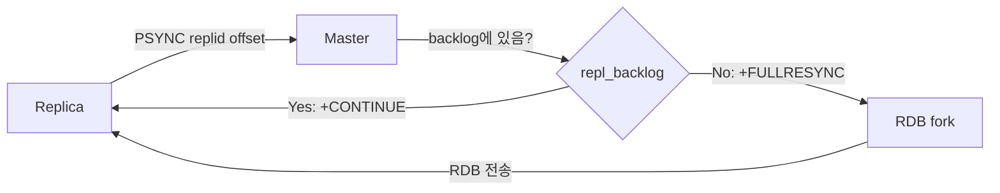
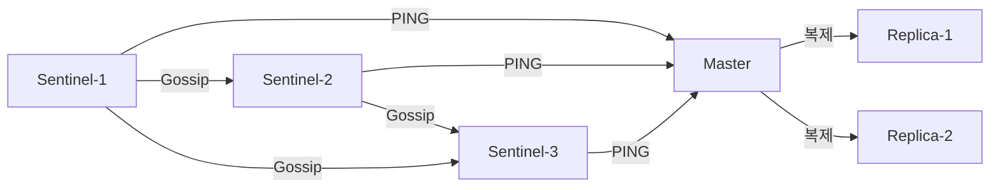
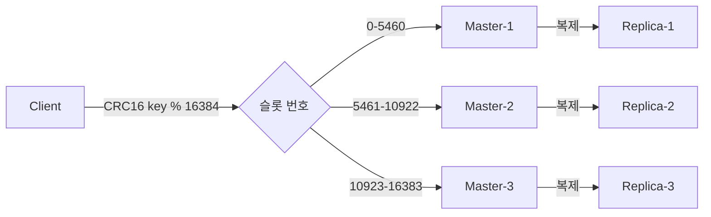
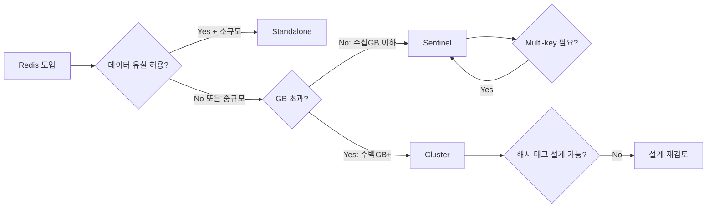

> **한 줄 요약**: Redis는 단일 프로세스(Standalone)에서 시작해 자동 장애복구(Sentinel), 수평 확장(Cluster)으로 진화하며, 각 모드는 해결하는 문제가 근본적으로 다르다 — 무엇을 선택하느냐는 곧 어떤 장애를 감수하느냐를 결정한다.

---

## 1. 왜 세 가지 모드가 필요한가

### 단일 장비의 물리적 한계

Redis는 모든 데이터를 RAM에 올려두는 인메모리 데이터 구조 스토어다. 이 설계 덕분에 마이크로초 단위 응답이 가능하지만, 동시에 단일 장비가 가진 세 가지 벽에 부딪힌다.

**첫 번째 벽 — 메모리 용량**: 64GB RAM 서버에서 Redis가 사용할 수 있는 최대 데이터는 약 50~55GB다(OS, 커널 버퍼, RSS 오버헤드 제외). 광고 플랫폼이나 세션 스토어처럼 수백 GB 규모의 데이터를 다루려면 단순히 메모리를 늘리는 것으로는 한계에 닿는다. `maxmemory`를 초과하면 Redis는 `maxmemory-policy`에 따라 키를 강제 퇴거(eviction)시키거나, `noeviction` 정책에서는 쓰기를 거부한다.

**두 번째 벽 — 가용성**: 단일 프로세스는 프로세스 크래시, OS 재부팅, 하드웨어 장애 중 하나라도 발생하면 즉시 서비스 중단이다. Redis는 기본적으로 영속성(persistence)을 포기하고 속도를 택했기 때문에, 재시작 후 복구 시간이 RDB 파일 크기에 비례해 수십 초~수 분에 달한다. 이 시간 동안 애플리케이션은 캐시 미스(cold cache)나 완전한 장애 상태를 경험한다.

**세 번째 벽 — 처리량**: Redis 6.0 이전까지 명령 처리는 단일 스레드였다. `KEYS *` 같은 O(N) 명령 하나가 전체 이벤트 루프를 수십 밀리초 블로킹할 수 있고, 초당 수백만 ops 규모로 성장한 트래픽을 단일 프로세스 하나가 감당하는 데는 한계가 있다.

### 각 모드가 해결하는 문제

| 모드 | 핵심 문제 | 해결 방식 |
|------|----------|----------|
| Standalone | 단순 캐시, 데이터 손실 감수 | 단일 프로세스 + 선택적 복제 |
| Sentinel | 단일 마스터 장애 = 서비스 중단 | 자동 장애 감지 + 페일오버 |
| Cluster | 단일 노드 메모리/처리량 한계 | 데이터 샤딩 + 다중 마스터 |

세 모드는 기능이 겹치지 않는다. Sentinel은 확장성 문제를 해결하지 않고, Cluster는 Sentinel보다 훨씬 복잡한 운영 비용을 요구한다. 선택 실수는 곧 운영 사고로 이어진다.

### 실제 사고 사례 — Redis 단일 노드 장애

2021년 한 국내 커머스 플랫폼은 플래시 세일 당일 Redis 마스터 노드의 OOM(Out of Memory)로 인한 프로세스 종료를 경험했다. `maxmemory-policy allkeys-lru`로 설정되어 있었지만, 메모리 할당 속도가 퇴거 속도를 초과하면서 Linux OOM Killer가 Redis 프로세스를 강제 종료했다. Replica는 존재했지만 Sentinel이 없었기 때문에 자동 페일오버가 일어나지 않았고, 운영자가 수동으로 replica를 마스터로 승격하는 동안 약 4분간 주문 서비스가 완전 다운됐다.

이 사고가 가르치는 핵심: **복제만으로는 가용성을 보장할 수 없다. 자동 페일오버 메커니즘이 반드시 필요하다.**

---

## 2. Standalone 모드

### 아키텍처: 단일 프로세스와 이벤트 루프

Redis Standalone은 하나의 OS 프로세스 안에서 동작한다. 내부 구조의 핵심은 **이벤트 루프(ae — A Event library)**다. Redis는 Linux에서 `epoll`, macOS에서 `kqueue`, 그 외에서 `select`를 사용해 I/O 이벤트를 비동기로 처리한다.

```
[Client 연결] --> [TCP accept] --> [이벤트 루프]
                                        |
                          +-------------+-------------+
                          |             |             |
                    [명령 파싱]    [타이머 이벤트]  [I/O 이벤트]
                          |
                    [명령 실행 (단일 스레드)]
                          |
                    [응답 버퍼 기록]
                          |
                    [클라이언트로 송신]
```

명령 실행 자체는 Redis 6.0 이후에도 여전히 단일 스레드다. 6.0에서 추가된 I/O 멀티스레딩은 **네트워크 read/write 파싱**에만 적용된다(`io-threads` 설정). 즉, 실제 데이터 구조 접근과 명령 처리는 메인 스레드 하나에서만 일어나므로 레이스 컨디션이 발생하지 않는다. 이것이 Redis가 원자적(atomic) 명령을 보장할 수 있는 근본 이유다.

**단일 스레드 모델의 실전 함의**: `KEYS *`, `SMEMBERS`(대형 Set), `LRANGE 0 -1`(긴 List) 같은 O(N) 명령은 이벤트 루프를 수십~수백 밀리초 블로킹한다. 이 시간 동안 다른 모든 클라이언트 요청이 대기한다. `slowlog get 10`으로 주기적으로 확인하고, `SCAN` 커서 기반 반복자로 대체해야 한다.

### 복제(Replication): master-replica 구조

복제는 Standalone에서도 사용할 수 있다. `replicaof <master-ip> <port>` 명령을 replica에서 실행하면 복제가 시작된다.

**복제 내부 메커니즘 — PSYNC 프로토콜**

Replica가 마스터에 연결될 때 두 가지 핵심 정보를 교환한다.

- **Replication ID (replid)**: 마스터가 기동 시 생성하는 40자리 랜덤 16진수 문자열. 마스터가 교체되거나 재시작되면 새로운 replid가 생성된다.
- **Replication Offset (repl_offset)**: 마스터가 replica에게 전송한 데이터의 누적 바이트 오프셋.

Replica가 연결을 시도하면 `PSYNC <replid> <offset>` 명령을 전송한다.

**부분 재동기화(Partial Resync)**: 마스터가 replica의 replid와 offset을 확인하여, `repl_backlog` 링 버퍼(기본 1MB, `repl-backlog-size`로 설정) 안에 해당 offset 이후의 데이터가 있으면 `+CONTINUE`를 응답하고 누락된 명령만 전송한다. 네트워크 단절 후 재연결 시 전체 데이터를 다시 받지 않아도 된다.

**전체 재동기화(Full Resync)**: `repl_backlog`에 해당 offset이 없거나(버퍼 오버플로), replid가 다르면(마스터 교체) 마스터는 RDB 스냅샷을 생성해 전송한다. 이 과정에서 `fork()`가 발생하고 Copy-on-Write(CoW) 메모리가 급증한다. 대형 인스턴스(수십 GB)에서 Full Resync는 수분이 걸리고 마스터 CPU/메모리에 상당한 부하를 준다.



### 영속성: RDB vs AOF

**RDB(Redis Database Snapshot)**

RDB는 특정 시점의 전체 데이터를 이진 형식으로 디스크에 기록한다. `BGSAVE` 명령 또는 `save` 설정(`save 900 1` = 900초 내 1개 이상 변경 시)에 의해 트리거된다.

내부적으로 Redis는 `fork()`를 호출해 자식 프로세스를 생성한다. 자식 프로세스는 부모의 메모리 페이지를 CoW 방식으로 공유하면서 디스크에 쓴다. 부모(메인 프로세스)는 계속 요청을 처리하면서 수정된 페이지만 새로 할당한다. 따라서 RDB 생성 중 메모리 사용량은 최악의 경우 2배까지 증가할 수 있다.

- **장점**: 복구 속도가 빠름(바이너리 로드), 파일 크기가 작음, 복제 초기화에 사용됨
- **단점**: 스냅샷 간격 사이의 쓰기 데이터는 유실(최대 수 분의 데이터 손실 가능)

**AOF(Append-Only File)**

AOF는 모든 쓰기 명령을 Redis 프로토콜(RESP) 형식으로 순서대로 파일에 기록한다. `appendonly yes`로 활성화한다.

핵심은 `fsync` 정책이다:

- `appendfsync always`: 매 명령 후 `fsync()` 호출. 데이터 유실 0이지만 성능이 급격히 저하됨(HDD에서 수백 ops/s 수준).
- `appendfsync everysec`: 1초마다 `fsync()`. 최대 1초 분량의 데이터 유실. **실무 권장값**. 백그라운드 스레드가 fsync를 담당.
- `appendfsync no`: OS가 결정(기본 30초). 성능 최대이지만 유실 위험 큼.

AOF 파일은 시간이 지나면 커진다. Redis는 AOF Rewrite를 통해 현재 데이터 상태를 최소 명령 집합으로 재작성한다(`BGREWRITEAOF`). 역시 `fork()` 기반이다.

**RDB-AOF 혼합 모드 (Redis 4.0+)**

`aof-use-rdb-preamble yes` 설정 시 AOF 파일의 앞부분에 RDB 바이너리를 기록하고, 그 이후 변경 사항만 AOF 형식으로 추가한다. 복구 속도(RDB 장점)와 데이터 내구성(AOF 장점)을 동시에 확보하는 현재 Redis의 권장 영속성 설정이다.

### Standalone의 한계

1. **수동 페일오버**: 마스터 장애 시 운영자가 직접 replica를 마스터로 승격해야 한다 (`REPLICAOF NO ONE`).
2. **단일 쓰기 노드**: 모든 쓰기가 마스터 하나로 집중된다. Replica는 기본적으로 읽기 전용.
3. **메모리 한계**: 전체 데이터셋이 단일 노드의 메모리에 맞아야 한다.
4. **`fork()` 부하**: RDB/AOF Rewrite는 대형 인스턴스에서 수 초의 지연(latency spike)을 유발한다.

### 언제 Standalone이 적합한가

- 개발/테스트 환경: 운영 단순성이 최우선
- 캐시 전용(Cache-aside): 데이터 유실이 허용되고 원본 DB에서 재생성 가능
- 데이터 규모 < 수십 GB, DAU < 수만 명 수준의 소규모 서비스
- 장애 시 수 분의 다운타임을 감수할 수 있는 내부 도구

---

## 3. Sentinel 모드 — 자동 장애 감지와 페일오버

### 아키텍처: Sentinel 프로세스

Sentinel은 별도의 Redis 프로세스로 동작한다(`redis-sentinel sentinel.conf`). 데이터를 저장하지 않고, 오직 **모니터링, 알림, 페일오버 자동화, 구성 제공자(Configuration Provider)**의 네 가지 역할을 한다.

클라이언트는 Redis 마스터에 직접 연결하지 않고, 먼저 Sentinel에 마스터 주소를 질의한다. Sentinel이 반환한 주소로 연결함으로써, 페일오버 후 새 마스터 주소를 자동으로 얻을 수 있다.

**왜 Sentinel은 최소 3대가 필요한가?**

이것은 분산 합의(distributed consensus) 문제다. Sentinel이 페일오버를 실행하려면 "과반수(quorum)"의 동의가 필요하다. Sentinel이 2대인 경우, 네트워크 파티션으로 각 Sentinel이 서로를 볼 수 없게 되면 어느 쪽도 과반수를 확보할 수 없어 페일오버가 영원히 일어나지 않는다(split-brain + no quorum). 3대에서 한 대가 장애여도 나머지 2대가 quorum(2/3 > 1/2)을 형성한다. Sentinel 짝수 구성은 이 보호를 깨뜨린다.



### SDOWN vs ODOWN: 주관적 다운 vs 객관적 다운

**SDOWN (Subjectively Down)**

단일 Sentinel이 마스터에게 `down-after-milliseconds`(기본 30000ms) 동안 유효한 응답을 받지 못하면 그 Sentinel만의 판단으로 마스터를 SDOWN으로 표시한다. 단순 네트워크 지연일 수도 있으므로 이것만으로는 페일오버가 시작되지 않는다.

**ODOWN (Objectively Down)**

SDOWN 상태의 Sentinel이 다른 Sentinel들에게 `SENTINEL is-master-down-by-addr <ip> <port>` 메시지를 전송해 투표를 요청한다. `quorum`(기본 2) 이상의 Sentinel이 동의하면 ODOWN으로 전환된다. 이 시점부터 페일오버 프로세스가 시작된다.

비유하자면 SDOWN은 "나는 사장이 사무실에 없는 것 같다"는 개인적 판단이고, ODOWN은 "동료 3명 중 2명 이상이 사장이 없다고 동의했다"는 조직적 합의다.

### 페일오버 과정 — 단계별 상세

**1단계: 마스터 다운 감지**

각 Sentinel은 모니터링 중인 마스터에게 1초마다(기본) `PING`을 보낸다. `down-after-milliseconds` 내에 `+PONG` 또는 `-LOADING`, `-MASTERDOWN` 이외의 응답이 없으면 SDOWN으로 표시한다.

**2단계: ODOWN 합의 (quorum 투표)**

SDOWN을 선언한 Sentinel(이하 S1)이 Sentinel 네트워크를 통해 `SENTINEL is-master-down-by-addr` 메시지를 브로드캐스트한다. 각 Sentinel이 응답의 `down_state` 필드를 통해 자신의 판단을 알려주면, S1이 quorum 수를 집계한다. quorum 이상이면 ODOWN 선언.

**3단계: Sentinel 리더 선출 (Raft 유사)**

ODOWN이 된 이후, 페일오버를 실제로 실행할 "리더 Sentinel"을 선출해야 한다. Redis Sentinel은 Raft와 유사하지만 완전히 동일하지 않은 선출 방식을 사용한다.

- 각 Sentinel은 자신에게 투표하거나 먼저 요청한 다른 Sentinel에게 투표한다.
- 에포크(epoch) 번호가 가장 높은 후보를 우선 지지한다.
- 과반수(전체 Sentinel 수의 절반 초과)의 투표를 얻은 Sentinel이 리더가 된다.
- 일정 시간 내 리더가 선출되지 않으면 다음 에포크에서 재선출을 시도한다.

**4단계: 최적 replica 선택**

리더 Sentinel은 다음 기준을 순서대로 적용해 새 마스터가 될 replica를 선택한다:

1. `slave-priority`(또는 `replica-priority`) 값이 낮은 replica 우선 (0이면 선출 제외)
2. 마스터로부터 받은 replication offset이 가장 큰 replica (데이터 유실 최소화)
3. lexicographically 가장 작은 Run ID (동률일 때 결정적 선택)

**5단계: SLAVEOF NO ONE**

리더 Sentinel이 선택된 replica에게 `SLAVEOF NO ONE` 명령을 전송한다. 이 명령을 받은 replica는 복제 연결을 끊고 스스로 마스터가 된다. `INFO replication`에서 `role:master`로 전환됨을 확인할 수 있다.

**6단계: 나머지 replica 리포인팅**

리더 Sentinel이 다른 모든 replica들에게 `SLAVEOF <new_master_ip> <new_master_port>`를 전송한다. 각 replica는 새 마스터에게 PSYNC를 시도한다. 새 마스터는 기동 직후이므로 replid가 다르고, 따라서 모든 replica는 Full Resync를 수행한다.

**7단계: 클라이언트 리디렉션**

Sentinel은 `+switch-master` 이벤트를 발행한다. Lettuce나 Jedis의 Sentinel 모드 클라이언트는 이 이벤트를 구독하고 있다가 커넥션 풀을 새 마스터 주소로 자동 갱신한다.

전체 과정의 소요 시간은 통상 `down-after-milliseconds + failover-timeout(기본 3분)` 이내지만, 실제 애플리케이션 입장에서는 클라이언트 커넥션 풀 갱신 완료까지 포함해 보통 5~30초의 쓰기 중단이 발생한다.

### Split-Brain 문제

Split-Brain은 네트워크 파티션으로 인해 두 노드가 동시에 자신이 마스터라고 생각하는 상황이다.

시나리오: 마스터 M과 Sentinel S1, S2, S3이 있다. 마스터가 네트워크 파티션으로 S1, S2, S3과 격리된다. Sentinel들은 ODOWN을 선언하고 replica R1을 새 마스터로 승격한다. 이제 클라이언트 그룹 A는 파티션 너머의 구 마스터 M에게 쓰고, 클라이언트 그룹 B는 새 마스터 R1에게 쓴다. 파티션이 복구되면 M은 replica로 강등되고 M에 기록됐던 모든 데이터가 **롤백(유실)**된다.

**방어책: `min-replicas-to-write`와 `min-replicas-max-lag`**

마스터의 `redis.conf`에 다음을 추가한다:

```
min-replicas-to-write 1
min-replicas-max-lag 10
```

이 설정은 "최소 1개의 replica가 10초 이내 lag으로 연결된 경우에만 쓰기를 허용한다"는 의미다. 파티션으로 replica와 격리된 구 마스터는 쓰기 요청을 모두 거부하게 되어 데이터 유실을 방지한다. 대신 가용성이 일부 희생된다.

### Sentinel 자체 장애

Sentinel 한 대가 장애면 어떻게 될까? 나머지 Sentinel들이 quorum을 유지하는 한 문제없다. Sentinel 자체는 영속 데이터가 없고, 재시작하면 모니터링 중인 Redis 토폴로지를 자동으로 재감지한다.

주의: Sentinel 짝수 구성(2대, 4대)은 네트워크 파티션 시 어느 쪽도 과반수를 얻지 못해 페일오버 불가 상태가 된다. **항상 홀수로 구성하라.**

### 클라이언트 연동: Spring Boot + Lettuce

```java
@Configuration
public class RedisConfig {

    @Bean
    public RedisConnectionFactory redisConnectionFactory() {
        // Sentinel 설정
        RedisSentinelConfiguration sentinelConfig =
            new RedisSentinelConfiguration("mymaster",
                Set.of("sentinel1:26379", "sentinel2:26379", "sentinel3:26379"));
        sentinelConfig.setPassword(RedisPassword.of("your-password"));

        LettuceClientConfiguration clientConfig = LettuceClientConfiguration.builder()
            .readFrom(ReadFrom.REPLICA_PREFERRED) // 읽기는 replica 우선
            .commandTimeout(Duration.ofSeconds(2))
            .build();

        return new LettuceConnectionFactory(sentinelConfig, clientConfig);
    }

    @Bean
    public RedisTemplate<String, Object> redisTemplate(
            RedisConnectionFactory factory) {
        RedisTemplate<String, Object> template = new RedisTemplate<>();
        template.setConnectionFactory(factory);
        template.setKeySerializer(new StringRedisSerializer());
        template.setValueSerializer(new GenericJackson2JsonRedisSerializer());
        return template;
    }
}
```

Lettuce는 Sentinel에게 `SENTINEL get-master-addr-by-name mymaster`를 주기적으로 질의하고, `+switch-master` pub/sub 이벤트를 구독해 페일오버 발생 시 자동으로 커넥션을 갱신한다. 애플리케이션 코드는 이 전환 과정을 몰라도 된다.

### Sentinel 모드의 한계

- **수평 확장 불가**: 데이터 전체가 단일 마스터 메모리에 들어가야 한다.
- **쓰기 처리량 제한**: 모든 쓰기가 마스터 단일 스레드를 통과한다.
- **페일오버 중 쓰기 중단**: 통상 5~30초의 쓰기 불가 구간이 발생한다.
- **Multi-key 연산 완전 지원**: 이것은 장점이다. Cluster와 달리 모든 키가 동일 노드에 있으므로 `MGET`, `MSET`, Lua 스크립트, 트랜잭션이 제약 없이 동작한다.

---

## 4. Cluster 모드 — 수평 확장과 자동 샤딩

### 아키텍처: 16384 해시 슬롯

Redis Cluster는 데이터를 **16384개의 해시 슬롯(hash slot)**으로 분할한다. 각 키는 `CRC16(key) % 16384`로 슬롯 번호가 결정된다. 각 마스터 노드는 슬롯의 일부를 담당한다.

예: 3 마스터 구성 시
- M1: 슬롯 0 ~ 5460
- M2: 슬롯 5461 ~ 10922
- M3: 슬롯 10923 ~ 16383

왜 16384인가? `CRC16`은 0~65535(2^16) 범위를 생성하지만, Redis 설계자 Salvatore Sanfilippo는 16384(2^14)를 선택했다. 그 이유는 클러스터 상태 메시지(gossip)의 슬롯 비트맵 크기를 2KB(16384/8 = 2048 바이트)로 제한하기 위해서다. 65536 슬롯이면 비트맵이 8KB로 커져 gossip 트래픽이 4배 증가한다. 동시에 16384는 1000개 이상의 노드를 구성할 수 있을 만큼 충분히 크다.



### 슬롯 마이그레이션 — MIGRATING / IMPORTING 상태

노드를 추가하거나 제거할 때 슬롯을 재분배해야 한다. 이 과정을 **슬롯 마이그레이션**이라 하며, 서비스를 중단하지 않고 진행된다(online reshard).

마이그레이션 중 특정 슬롯은 두 노드에 걸쳐 있는 중간 상태가 된다:

- **MIGRATING 상태** (소스 노드): "이 슬롯은 다른 노드로 이전 중이다." 소스 노드가 해당 슬롯에 대한 요청을 받으면 로컬에 키가 있으면 처리하고, 없으면 `ASK` 리디렉션을 응답한다.
- **IMPORTING 상태** (대상 노드): "이 슬롯을 곧 받는다." 대상 노드는 `ASKING` 명령과 함께 온 요청만 임시로 처리한다.

마이그레이션 도구(`redis-cli --cluster reshard`)는 `CLUSTER SETSLOT <slot> MIGRATING <dest>`, `CLUSTER SETSLOT <slot> IMPORTING <src>`, `MIGRATE` 명령을 조합해 키를 하나씩 이전한다. 이전이 완료되면 `CLUSTER SETSLOT <slot> NODE <dest>`로 슬롯 소유권을 확정한다.

### Gossip 프로토콜: 클러스터 상태 전파

Redis Cluster 노드들은 별도의 클러스터 버스 포트(데이터 포트 + 10000, 예: 6379→16379)로 서로 gossip 메시지를 주고받는다.

**메시지 유형**:
- `PING`: 주기적으로 무작위 소수의 노드에게 보내 생존을 확인하고 클러스터 상태를 전파
- `PONG`: PING에 대한 응답. 자신의 슬롯 비트맵, 에포크, 노드 상태를 포함
- `MEET`: 새 노드를 클러스터에 참여시킬 때 사용 (`CLUSTER MEET <ip> <port>`)
- `FAIL`: 특정 노드가 실패했음을 전체에 브로드캐스트

**수렴 시간(Convergence Time)**: gossip은 확률적으로 전파되므로 클러스터 상태가 모든 노드에 도달하는 데 시간이 걸린다. 노드 수 N에서 O(log N) gossip 라운드 후 수렴한다. 6노드 클러스터는 수 초, 100노드 클러스터는 수십 초가 걸릴 수 있다. 이 수렴 지연 동안 일부 노드는 구 토폴로지 정보를 가지고 있어 `MOVED` 리디렉션이 발생한다.

### 클러스터 내 페일오버 — 에포크 기반 투표

마스터가 `cluster-node-timeout`(기본 15초) 동안 응답하지 않으면 replica들이 페일오버를 시작한다.

**에포크(Config Epoch)**: 클러스터의 모든 변경(페일오버, 슬롯 재할당 등)에는 단조 증가하는 에포크 번호가 부여된다. 에포크가 높은 정보가 낮은 정보를 덮어쓴다. 이 메커니즘이 클러스터 전체의 일관성을 보장한다.

**페일오버 절차**:
1. 장애 마스터의 replica가 `PFAIL`(주관적 장애) 상태를 감지
2. 다른 마스터들로부터 FAIL 확인을 수집해 `FAIL` 상태 확정
3. 페일오버를 원하는 replica가 새 에포크로 다른 마스터들에게 투표 요청
4. 각 마스터는 에포크당 하나의 투표만 하며, 과반수(마스터 수의 절반 초과) 확보 시 승격
5. 승격된 replica는 새 에포크로 `PONG`을 브로드캐스트해 자신의 마스터 상태를 전파

replication offset이 큰 replica(가장 최신 데이터를 가진)가 다른 replica들보다 빨리 투표를 요청해 우선 승격될 가능성이 높다(delay = `500ms + random(0~500ms) + offset_rank * 1000ms`).

### MOVED vs ASK 리디렉션

클라이언트가 잘못된 노드에 요청을 보냈을 때 두 가지 다른 응답이 올 수 있다.

**MOVED 리디렉션**:
```
-MOVED 3999 127.0.0.1:6381
```
슬롯 3999의 담당 노드가 영구적으로 6381임을 의미한다. 클라이언트는 슬롯 캐시를 갱신하고 6381로 재전송해야 한다. Lettuce는 슬롯 캐시를 자동 갱신한다.

**ASK 리디렉션**:
```
-ASK 3999 127.0.0.1:6381
```
슬롯 3999가 마이그레이션 중이며, 이 요청에 한해 6381에서 찾아보라는 의미다. 클라이언트는 6381에 먼저 `ASKING` 명령을 보내고 원래 명령을 재전송해야 한다. **ASK는 일시적이므로 슬롯 캐시를 갱신하지 않는다.**

| 구분 | MOVED | ASK |
|------|-------|-----|
| 의미 | 슬롯 소유권 영구 이전 완료 | 마이그레이션 중 임시 리디렉션 |
| 슬롯 캐시 갱신 | O | X |
| ASKING 선행 필요 | X | O |
| 발생 시점 | 정상 운영 + 슬롯 이전 후 | 슬롯 이전 진행 중 |

### 해시 태그 {tag}

Redis Cluster에서 `MGET`, `MSET`, `SUNIONSTORE` 같은 Multi-key 명령은 관련 키들이 모두 동일한 슬롯에 있어야 실행된다. 다른 슬롯의 키를 하나의 명령으로 묶으려 하면 `CROSSSLOT Keys in request don't hash to the same slot` 오류가 발생한다.

**해시 태그**는 이를 해결하기 위해 키 이름에서 슬롯 계산에 사용할 부분을 `{}`로 명시한다.

```
user:{1001}:profile  -> CRC16("1001") % 16384 = 슬롯 X
user:{1001}:orders   -> CRC16("1001") % 16384 = 슬롯 X (동일)
user:{1002}:profile  -> CRC16("1002") % 16384 = 슬롯 Y (다름)
```

중괄호 `{}`가 있으면 그 안의 문자열만으로 슬롯을 계산한다. `{}`가 없거나 비어 있으면 전체 키를 사용한다.

주의: 해시 태그를 남용하면 특정 슬롯에 키가 집중되어 **핫 슬롯(Hot Slot)** 문제가 발생한다. 예를 들어 `{session}:*` 패턴으로 모든 세션 키를 같은 슬롯에 몰면, 해당 슬롯을 담당하는 마스터 하나가 전체 세션 트래픽을 처리해야 한다.

### 클러스터 파티션 시나리오

클러스터가 네트워크 파티션으로 분리될 때 동작은 `cluster-require-full-coverage` 설정에 따라 달라진다.

- `cluster-require-full-coverage yes` (기본): 일부 슬롯이 커버되지 않으면 클러스터 전체가 쓰기를 거부한다. 데이터 일관성 우선.
- `cluster-require-full-coverage no`: 가용한 슬롯에 대해서는 계속 서비스한다. 가용성 우선.

예시: 6노드(M1/R1, M2/R2, M3/R3) 클러스터에서 M3과 R3이 격리되면,
- `yes`: 슬롯 10923~16383이 커버되지 않아 전체 클러스터 쓰기 불가
- `no`: 슬롯 0~10922는 정상 서비스, 10923~16383 관련 키 접근 시만 오류

### 데이터 유실 시나리오

Redis Cluster 복제는 **비동기**다. 마스터가 클라이언트에게 `OK`를 응답한 후 replica에 복제 명령이 전달된다. 마스터가 응답 직후 장애나면 복제되지 않은 쓰기가 유실된다.

이것은 근본적인 트레이드오프다. 동기 복제는 모든 쓰기마다 replica의 확인을 기다려야 하므로 레이턴시가 크게 증가한다. `WAIT <numreplicas> <timeout>` 명령으로 특정 쓰기에 한해 동기적 복제 확인을 요청할 수 있지만, 이는 성능 비용을 수반한다.

```java
// 중요한 쓰기에 한해 replica 동기 확인
redisTemplate.execute((RedisCallback<Long>) connection -> {
    connection.set(key.getBytes(), value.getBytes());
    // 최소 1개 replica에 복제될 때까지 최대 1000ms 대기
    return connection.wait(1, 1000);
});
```

### 클라이언트 연동: Spring Boot + Lettuce Cluster

```java
@Configuration
public class RedisClusterConfig {

    @Bean
    public RedisConnectionFactory redisConnectionFactory() {
        RedisClusterConfiguration clusterConfig = new RedisClusterConfiguration(
            List.of(
                "redis-node1:6379",
                "redis-node2:6379",
                "redis-node3:6379"
            )
        );
        clusterConfig.setPassword(RedisPassword.of("your-password"));
        clusterConfig.setMaxRedirects(3); // MOVED 리디렉션 최대 횟수

        ClusterTopologyRefreshOptions topologyRefresh =
            ClusterTopologyRefreshOptions.builder()
                .enablePeriodicRefresh(Duration.ofMinutes(1))
                // MOVED/ASK 발생 시 즉시 토폴로지 갱신
                .enableAllAdaptiveRefreshTriggers()
                .build();

        ClusterClientOptions clientOptions = ClusterClientOptions.builder()
            .topologyRefreshOptions(topologyRefresh)
            .build();

        LettuceClientConfiguration clientConfig = LettuceClientConfiguration.builder()
            .clientOptions(clientOptions)
            .readFrom(ReadFrom.REPLICA_PREFERRED)
            .build();

        return new LettuceConnectionFactory(clusterConfig, clientConfig);
    }
}
```

`enableAllAdaptiveRefreshTriggers()`가 핵심이다. 이 설정 없이는 Lettuce가 MOVED 응답을 받아도 슬롯 캐시를 즉시 갱신하지 않아 리디렉션이 반복될 수 있다.

### 스케일 아웃/인 절차

**노드 추가**:
1. 새 Redis 인스턴스 시작
2. `redis-cli --cluster add-node <new-node> <existing-node>`: 새 노드를 클러스터에 추가
3. `redis-cli --cluster reshard <any-node>`: 기존 노드들의 슬롯을 새 노드로 이전
4. `redis-cli --cluster add-node --cluster-slave --cluster-master-id <master-id> <new-replica> <existing-node>`: replica 추가

**노드 제거**:
1. 해당 노드의 슬롯을 다른 노드로 먼저 이전 (`reshard`)
2. 슬롯이 0이 된 후 `redis-cli --cluster del-node <any-node> <node-id>`
3. 순서를 지키지 않으면 슬롯 담당 노드가 사라져 클러스터 오류가 발생한다.

---

## 5. 세 모드 종합 비교

### 상세 비교 테이블

| 항목 | Standalone | Sentinel | Cluster |
|------|-----------|----------|---------|
| **자동 페일오버** | X | O | O |
| **수평 확장(샤딩)** | X | X | O |
| **데이터 용량 한계** | 단일 노드 메모리 | 단일 노드 메모리 | 노드 수 × 메모리 |
| **쓰기 처리량** | 단일 마스터 | 단일 마스터 | 마스터 수만큼 분산 |
| **Multi-key 연산** | 제한 없음 | 제한 없음 | 같은 슬롯만 가능 |
| **Pub/Sub** | 완전 지원 | 완전 지원 | 클러스터 내 노드 제한 |
| **Lua 스크립트** | 완전 지원 | 완전 지원 | 단일 슬롯 키만 |
| **트랜잭션(MULTI/EXEC)** | 완전 지원 | 완전 지원 | 단일 슬롯 키만 |
| **운영 복잡도** | 낮음 | 중간 | 높음 |
| **최소 노드 수** | 1 | 6 (Sentinel 3 + Redis 3) | 6 (master 3 + replica 3) |
| **페일오버 시간** | 수동 | 5~30초 | 10~30초 |
| **데이터 유실 위험** | 중간 | 낮음 | 낮음 (비동기 복제 한계) |
| **적합 규모** | 소규모 | 중규모 | 대규모 |
| **클라이언트 복잡도** | 단순 | 중간 | 높음 |

### 선택 플로차트



실무 결정 기준을 더 구체적으로 말하면: 단일 Redis 인스턴스가 50GB를 넘거나, 초당 쓰기 명령이 10만 ops를 초과하거나, 레이턴시 SLA가 1ms 이하라면 Cluster를 검토해야 한다. 그 이하에서는 Sentinel이 운영 복잡도 대비 충분한 가용성을 제공한다.

---

## 6. 극한 시나리오와 운영 Best Practice

### 시나리오 1: 마스터 OOM Kill

**상황**: 트래픽 급증으로 Redis 마스터의 RSS 메모리가 `maxmemory` 설정을 초과하고, Linux OOM Killer가 Redis 프로세스를 강제 종료한다.

**Sentinel 환경에서의 동작**: Sentinel들이 마스터에 PING을 보내도 응답이 없으므로 `down-after-milliseconds` 후 SDOWN → quorum 수집 후 ODOWN → 리더 선출 → replica 승격 순서로 진행된다. 약 30초~1분 이내에 자동 복구된다. 그러나 구 마스터 프로세스가 OOM Kill된 서버에서 Redis가 자동 재시작 설정이 없다면, 복구 후 토폴로지는 마스터 1 + replica 1(원래 2개)로 줄어들어 또 다른 장애에 취약해진다.

**예방책**:
```
# redis.conf
maxmemory 48gb
maxmemory-policy allkeys-lru
# OOM kill 방어: vm.overcommit_memory 설정
```
```bash
# OS 레벨
echo 1 > /proc/sys/vm/overcommit_memory
# Redis 프로세스 OOM score 조정 (-1000 = 절대 kill 안 함, 운영 환경에 따라 조절)
echo -500 > /proc/$(pgrep redis-server)/oom_score_adj
```

**Cluster 환경에서의 동작**: OOM Kill된 노드의 슬롯은 해당 노드의 replica가 `cluster-node-timeout` 후 자동 승격해 담당한다. 다른 슬롯들은 영향받지 않는다. 단, 그 노드의 replica가 없거나 replica도 함께 장애라면 해당 슬롯이 커버되지 않아 `cluster-require-full-coverage yes`인 경우 클러스터 전체 쓰기가 중단된다.

### 시나리오 2: 네트워크 파티션 — Split-Brain과 데이터 유실 최소화

**상황**: 데이터센터 라우터 장애로 Redis 클러스터가 두 파티션으로 분리된다. 파티션 A에는 M1, M2와 Sentinel S1, S2가 있고, 파티션 B에는 M3과 S3이 있다.

**Sentinel 시나리오**: 파티션 A의 S1, S2는 M3를 SDOWN → ODOWN 처리하고, quorum(2)을 달성해 R3을 새 마스터로 승격한다. 파티션 B의 S3은 quorum을 달성할 수 없어 아무 행동도 하지 않는다. 파티션 복구 후 M3은 R3(새 마스터)의 replica로 강등된다. M3에 기록된 데이터는 유실된다.

**`min-replicas-to-write 1`의 실제 동작**: M3이 파티션으로 replica와 격리되면, M3은 더 이상 조건을 충족할 수 없어(`connected replicas < 1`) 쓰기를 거부한다. 클라이언트는 에러를 받지만, 페일오버 후 롤백될 쓰기를 성공한 것처럼 착각하지 않는다.

**Cluster 시나리오**: 파티션 A(M1, M2)와 파티션 B(M3)이 분리되면, M3의 replica가 파티션 A에 있다면 자동 승격이 발생한다. 이후 M3은 재연결 시 강등되고 M3의 쓰기는 유실된다.

**운영 교훈**: 비동기 복제의 쓰기 유실은 완전히 막을 수 없다. 금융 트랜잭션 같은 zero-loss 요구사항에 Redis를 단독 영속 저장소로 사용하면 안 된다. Redis는 캐시 또는 세컨더리 스토어로 사용하고, RDBMS를 primary로 유지해야 한다.

### 시나리오 3: 전체 클러스터 재시작

**상황**: 보안 패치나 커널 업그레이드로 모든 노드를 순차 재시작해야 한다. Cluster 모드에서 재시작 순서를 잘못 정하면 데이터 불일치가 발생한다.

**올바른 재시작 순서**:
1. Replica 먼저 재시작: replica는 마스터에 재연결해 PSYNC로 동기화하므로 서비스 영향 없음
2. 마스터 재시작: 한 번에 하나씩, 재시작 전 `DEBUG SLEEP` 없이 그냥 재시작. 마스터 재시작 시 해당 노드의 replica가 임시 마스터로 승격된다.
3. 각 노드 재시작 후 `CLUSTER INFO` → `cluster_state:ok` 확인 후 다음 노드 진행

**AOF 활성화 중요성**: 재시작 시 AOF가 없으면 RDB 스냅샷 시점 이후 데이터가 모두 유실된 채 시작한다. Cluster에서 각 마스터가 최신 데이터 없이 재시작하면 복제본 간 심각한 불일치가 발생한다.

**클러스터 무결성 확인**:
```bash
redis-cli --cluster check <any-node>:6379
# 예상 출력:
# [OK] All nodes agree about slots configuration.
# [OK] All 16384 slots covered.
```

### 시나리오 4: 핫키(Hot Key) — 단일 슬롯 과부하

**상황**: 특정 인기 상품의 재고 키(`product:1234:stock`)에 초당 수만 번의 조회가 집중된다. 이 키가 속한 슬롯의 마스터 노드 CPU가 100%에 달하고, 해당 노드로 향하는 요청의 레이턴시가 급증한다.

**해결책 1 — Replica에서 읽기**: Lettuce의 `ReadFrom.REPLICA_PREFERRED`로 읽기 트래픽을 replica에 분산한다. 단, replica에서 읽으면 마스터의 최신 쓰기가 반영되지 않을 수 있다(복제 지연, 통상 수 밀리초).

**해결책 2 — 로컬 캐시(Local Cache) 레이어 추가**: JVM 로컬 캐시(Caffeine)에 짧은 TTL(100ms~1초)로 캐싱해 Redis 호출 자체를 줄인다. 대부분의 핫키 문제는 이 방법으로 해결된다.

```java
@Service
public class StockService {
    private final Cache<String, Long> localCache = Caffeine.newBuilder()
        .expireAfterWrite(500, TimeUnit.MILLISECONDS)
        .maximumSize(1000)
        .build();

    public long getStock(String productId) {
        return localCache.get("stock:" + productId, key ->
            redisTemplate.opsForValue().get(key));
    }
}
```

**해결책 3 — 키 분산(Key Sharding)**: `product:1234:stock` 단일 키 대신 `product:1234:stock:{0}` ~ `product:1234:stock:{N-1}` 여러 키에 분산하고, 조회 시 랜덤하게 하나를 선택한다. 쓰기 시 모든 샤드를 업데이트해야 하므로 쓰기 비용이 늘어난다.

### 시나리오 5: 대용량 키 마이그레이션 중 블로킹

**상황**: 슬롯 리샤딩 중 수 MB 크기의 Hash 또는 Sorted Set 키를 다른 노드로 마이그레이션할 때, `MIGRATE` 명령이 키 전체를 직렬화해 전송한다. 이 과정에서 소스 노드의 이벤트 루프가 블로킹된다.

Redis 3.0.6 이후 `MIGRATE ... COPY REPLACE KEYS` 명령으로 여러 키를 한 번에 마이그레이션할 수 있어 개선됐지만, 단일 대형 키(Large Key) 문제는 여전히 존재한다.

**예방책**:
- `redis-cli --bigkeys`로 주기적으로 대형 키를 발견하고 분할한다
- Hash/Sorted Set은 적절한 크기(`hash-max-listpack-entries 128`)를 넘지 않도록 설계 단계에서 제한
- 마이그레이션 전 `redis-cli --cluster check`로 키 크기 분포 확인

**대형 키 탐지 스크립트**:
```bash
redis-cli --bigkeys -i 0.1  # 0.1초 간격으로 SCAN 수행 (프로덕션 부하 최소화)
# 또는 메모리 사용량 기반
redis-cli --memkeys -i 0.1
```

### 운영 체크리스트

**필수 설정 (`redis.conf`)**:
```conf
# 메모리
maxmemory 48gb
maxmemory-policy allkeys-lru  # 캐시용, 데이터 손실 불가면 noeviction

# 영속성 (캐시 전용은 비활성화 고려)
save 900 1
save 300 10
appendonly yes
appendfsync everysec
aof-use-rdb-preamble yes

# 복제 안전
min-replicas-to-write 1
min-replicas-max-lag 10

# 슬로우로그
slowlog-log-slower-than 10000  # 10ms 이상 명령 기록
slowlog-max-len 128

# 클라이언트 연결
maxclients 10000
tcp-keepalive 300
```

**모니터링 필수 지표 (`INFO` 명령)**:
```bash
redis-cli INFO all | grep -E "used_memory_human|connected_clients|blocked_clients|
  instantaneous_ops_per_sec|used_memory_rss_human|mem_fragmentation_ratio|
  rdb_last_save_time|aof_last_write_status|master_replid|
  role|master_link_status|slave_repl_offset"
```

| 지표 | 정상 범위 | 경고 기준 |
|------|---------|---------|
| `used_memory_rss` / `used_memory` (단편화율) | 1.0~1.5 | >2.0 또는 <1.0 |
| `connected_clients` | < `maxclients` × 0.8 | > `maxclients` × 0.9 |
| `blocked_clients` | 0 | > 0 (BLPOP 등 제외) |
| `rdb_last_bgsave_status` | `ok` | `err` |
| `master_link_status` | `up` | `down` |
| `slowlog` 건수 | 0~수 건/분 | 급증 시 즉시 조사 |

---

## 7. 실전 구성 예시

### Sentinel 구성: Sentinel 3 + master 1 + replica 2

**docker-compose.yml**:
```yaml
version: '3.8'
services:
  redis-master:
    image: redis:7.2
    container_name: redis-master
    command: >
      redis-server
      --requirepass yourpassword
      --masterauth yourpassword
      --min-replicas-to-write 1
      --min-replicas-max-lag 10
      --appendonly yes
      --appendfsync everysec
    ports:
      - "6379:6379"

  redis-replica-1:
    image: redis:7.2
    container_name: redis-replica-1
    command: >
      redis-server
      --requirepass yourpassword
      --masterauth yourpassword
      --replicaof redis-master 6379
      --appendonly yes
    depends_on:
      - redis-master

  redis-replica-2:
    image: redis:7.2
    container_name: redis-replica-2
    command: >
      redis-server
      --requirepass yourpassword
      --masterauth yourpassword
      --replicaof redis-master 6379
      --appendonly yes
    depends_on:
      - redis-master

  sentinel-1:
    image: redis:7.2
    container_name: sentinel-1
    command: >
      redis-sentinel /etc/redis/sentinel.conf
    volumes:
      - ./sentinel.conf:/etc/redis/sentinel.conf
    depends_on:
      - redis-master

  sentinel-2:
    image: redis:7.2
    container_name: sentinel-2
    command: >
      redis-sentinel /etc/redis/sentinel.conf
    volumes:
      - ./sentinel.conf:/etc/redis/sentinel.conf
    depends_on:
      - redis-master

  sentinel-3:
    image: redis:7.2
    container_name: sentinel-3
    command: >
      redis-sentinel /etc/redis/sentinel.conf
    volumes:
      - ./sentinel.conf:/etc/redis/sentinel.conf
    depends_on:
      - redis-master
```

**sentinel.conf**:
```conf
sentinel monitor mymaster redis-master 6379 2
sentinel auth-pass mymaster yourpassword
sentinel down-after-milliseconds mymaster 5000
sentinel failover-timeout mymaster 60000
sentinel parallel-syncs mymaster 1
```

**Spring Boot `application.yml`**:
```yaml
spring:
  data:
    redis:
      sentinel:
        master: mymaster
        nodes:
          - sentinel-1:26379
          - sentinel-2:26379
          - sentinel-3:26379
      password: yourpassword
      lettuce:
        pool:
          max-active: 20
          max-idle: 10
          min-idle: 5
          max-wait: 2000ms
```

### Cluster 구성: master 3 + replica 3

**cluster-init.sh** (클러스터 초기화):
```bash
#!/bin/bash
# 6개 노드 기동 후 클러스터 생성
redis-cli --cluster create \
  redis-node1:6379 \
  redis-node2:6379 \
  redis-node3:6379 \
  redis-node4:6379 \
  redis-node5:6379 \
  redis-node6:6379 \
  --cluster-replicas 1 \
  --cluster-yes \
  -a yourpassword
```

**node별 redis.conf** (redis-node1.conf 예시):
```conf
port 6379
cluster-enabled yes
cluster-config-file nodes.conf
cluster-node-timeout 15000
cluster-announce-ip 192.168.1.1  # 컨테이너 환경에서 필수
cluster-announce-port 6379
cluster-announce-bus-port 16379
requirepass yourpassword
masterauth yourpassword
appendonly yes
appendfsync everysec
min-replicas-to-write 1
min-replicas-max-lag 10
```

**Spring Boot `application.yml`**:
```yaml
spring:
  data:
    redis:
      cluster:
        nodes:
          - redis-node1:6379
          - redis-node2:6379
          - redis-node3:6379
        max-redirects: 3
      password: yourpassword
      lettuce:
        cluster:
          refresh:
            adaptive: true
            period: 60s
        pool:
          max-active: 20
          max-idle: 10
          min-idle: 5
```

**클러스터 상태 확인**:
```bash
redis-cli -a yourpassword --cluster info redis-node1:6379
redis-cli -a yourpassword -c -h redis-node1 cluster nodes
# 각 노드의 슬롯 범위와 마스터/replica 관계 확인
```

---

## 8. 면접 포인트 — Q&A

**Q1. Redis가 단일 스레드임에도 빠른 이유는?**

A. 네트워크 I/O 대기와 디스크 I/O가 없기 때문이다. 모든 데이터가 메모리에 있으므로 명령 처리 자체는 수 마이크로초에 완료된다. 단일 스레드는 컨텍스트 스위칭과 락 경합이 없어 오히려 유리하다. 비유하자면 슈퍼카(메모리)와 일반 도로(단일 차선)의 조합 — 도로가 하나여도 차가 빠르면 충분하다. Redis 6.0+에서 I/O 스레딩이 추가됐지만 명령 처리 자체는 여전히 단일 스레드다.

**Q2. Sentinel과 Cluster 중 어떤 상황에서 Sentinel을 선택하는가?**

A. 데이터 규모가 단일 노드 메모리에 충분히 들어가고, Multi-key 연산(`MGET`, Lua, 트랜잭션)을 제약 없이 사용해야 하거나, 운영 복잡도를 최소화해야 할 때 Sentinel을 선택한다. Cluster는 16384 슬롯 제약, MOVED/ASK 리디렉션, 해시 태그 설계, 슬롯 마이그레이션 운영 부담이 있다. 수 GB~수십 GB 규모라면 Sentinel + 고성능 단일 노드가 Cluster보다 심플하고 운영하기 쉽다.

**Q3. Cluster에서 MGET이 실패하는 이유와 해결 방법은?**

A. `MGET key1 key2 key3`에서 각 키가 다른 슬롯에 속하면 `CROSSSLOT` 오류가 발생한다. 해결책은 두 가지다. 첫째, 해시 태그를 사용해 관련 키를 같은 슬롯에 배치한다(`{user:1001}:profile`, `{user:1001}:orders`). 둘째, MGET을 개별 GET으로 분해하고 Pipelining으로 묶어 최적화한다(슬롯별로 그룹핑 후 병렬 요청).

**Q4. PSYNC에서 부분 재동기화가 실패하는 조건은?**

A. repl_backlog 링 버퍼에 replica의 offset 이후 데이터가 없을 때 실패한다. 구체적으로: (1) `repl-backlog-size`(기본 1MB)가 너무 작아 네트워크 단절 시간 동안 발생한 쓰기 데이터가 버퍼를 초과했을 때, (2) replica가 참조하는 replid가 현재 마스터와 다를 때(마스터 교체 발생). 해결책: 고쓰기 트래픽 환경에서 `repl-backlog-size`를 100MB~1GB로 늘린다.

**Q5. Redis Cluster에서 에포크(epoch)의 역할은?**

A. Config Epoch는 클러스터 설정 변경의 순서를 보장하는 단조 증가 카운터다. 같은 슬롯에 대해 두 노드가 서로 다른 정보를 가지고 있을 때, 에포크가 높은 정보가 항상 이긴다. 페일오버 후 새 마스터는 이전 마스터보다 높은 에포크로 PONG을 브로드캐스트하여 모든 노드가 자신을 새 마스터로 인식하게 만든다. 에포크가 없으면 클러스터 상태 수렴 시 충돌이 발생할 수 있다.

**Q6. `maxmemory-policy volatile-lru`와 `allkeys-lru`의 차이와 선택 기준은?**

A. `volatile-lru`는 TTL이 설정된 키 중에서만 LRU를 적용한다. TTL 없는 키는 절대 퇴거되지 않는다. `allkeys-lru`는 TTL 유무에 관계없이 모든 키에 LRU를 적용한다. 순수 캐시 용도라면 `allkeys-lru`가 안전하다. 일부 키는 절대 퇴거하면 안 되는 영속 데이터이고 나머지는 캐시라면 `volatile-lru`를 사용하되, 영속 키에는 TTL을 설정하지 않고 캐시 키에는 반드시 TTL을 설정한다. `noeviction`은 메모리 초과 시 쓰기를 거부하므로, 캐시 용도에서는 사실상 쓸 수 없다.

**Q7. Split-Brain 상황에서 두 마스터가 동시에 쓰기를 받으면 어떻게 되는가?**

A. 파티션 복구 후 구 마스터(더 낮은 에포크 또는 Sentinel이 강등 처리)는 새 마스터의 replica로 전환된다. 이 시점에 구 마스터의 데이터는 새 마스터의 상태로 덮어씌워진다 — 즉, 파티션 동안 구 마스터에 기록된 모든 데이터가 유실된다. 이를 방지하기 위해 `min-replicas-to-write 1`로 격리된 마스터의 쓰기를 원천 차단하거나, 애플리케이션에서 CAS(Compare-and-Swap) 패턴과 버전 번호를 함께 사용해 충돌을 감지한다.

**Q8. Redis Cluster에서 `WAIT` 명령의 역할과 한계는?**

A. `WAIT numreplicas timeout`은 지정한 수의 replica가 최신 쓰기를 복제 확인할 때까지 블로킹한다. 반환값은 실제로 확인한 replica 수다. 이를 통해 특정 중요 쓰기의 내구성을 높일 수 있다. 그러나 한계는: (1) 타임아웃 내 replica가 응답하지 않으면 실제 복제 여부와 무관하게 반환된다, (2) `WAIT`로 확인된 replica도 이후 장애 + 비정상 재시작 시 데이터를 잃을 수 있다, (3) 클러스터의 파이프라이닝 최적화를 깨뜨려 성능을 저하시킨다. 따라서 금융 트랜잭션 등 zero-loss 요구사항에는 Redis 단독으로 충분하지 않고 RDBMS와 조합해야 한다.

---

## 마치며

Redis 운영 모드 선택은 단순히 기능 목록을 비교하는 문제가 아니다. 어떤 장애를 자동으로 복구할 것인지, 어느 수준의 데이터 유실을 감수할 것인지, 운영팀이 감당할 수 있는 복잡도가 어디까지인지를 먼저 결정하고 모드를 선택해야 한다.

핵심을 다시 정리하면:
- **Standalone**: 데이터 유실 허용 캐시 또는 개발 환경
- **Sentinel**: 자동 페일오버 필요 + 단일 노드 메모리로 충분한 중규모
- **Cluster**: 수평 확장 필수 + Multi-key 제약을 설계로 해결할 수 있는 대규모

그리고 어떤 모드를 선택하든, **비동기 복제의 한계를 이해하고 Redis를 primary data store로 사용하지 말아야 한다**는 원칙은 변하지 않는다. Redis는 빠른 캐시이자 세컨더리 데이터 레이어다. 이 경계를 지키는 것이 가장 중요한 운영 원칙이다.
