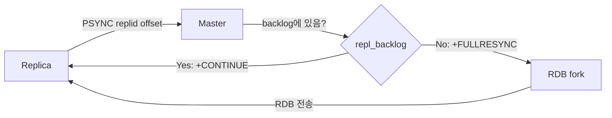
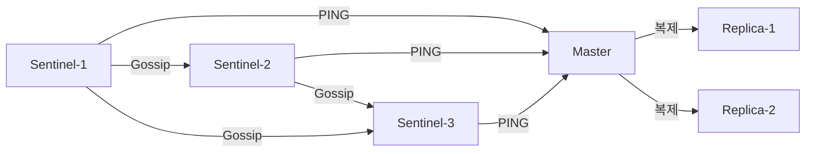
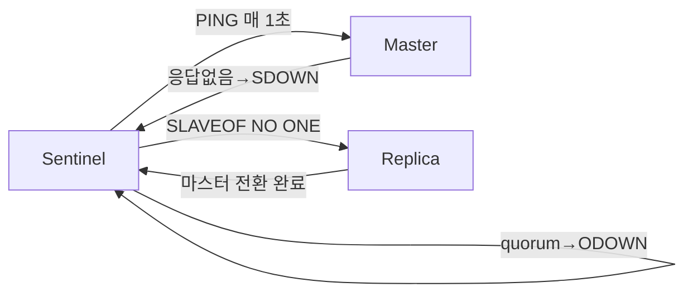
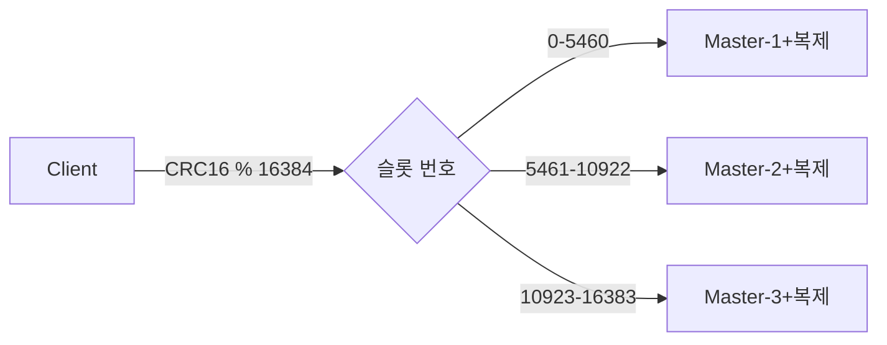
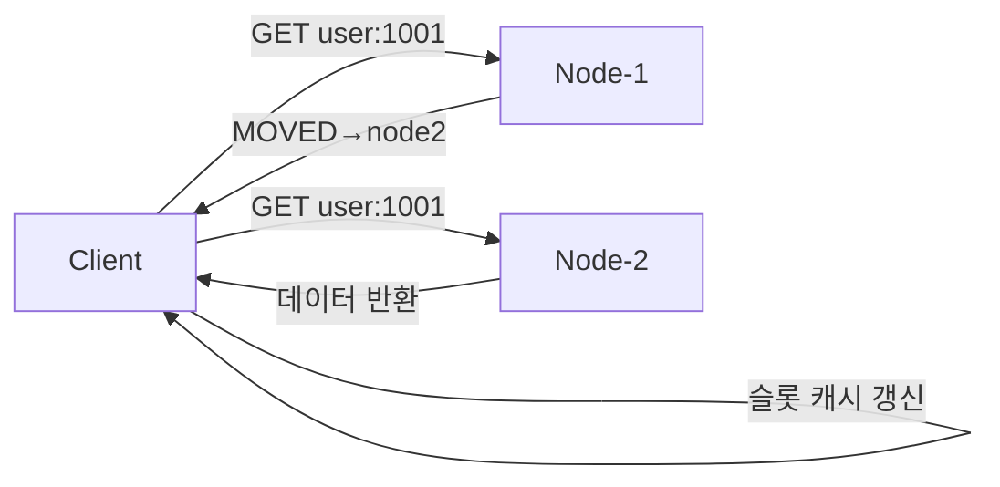
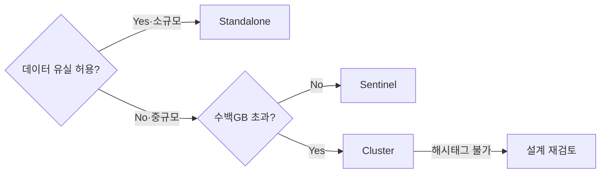

> **한 줄 요약**: Redis는 단일 프로세스(Standalone)에서 시작해 자동 장애복구(Sentinel), 수평 확장(Cluster)으로 진화하며, 각 모드는 해결하는 문제가 근본적으로 다르다 — 무엇을 선택하느냐는 곧 어떤 장애를 감수하느냐를 결정한다.

---

## 1. 왜 세 가지 모드가 필요한가

Redis는 단일 장비가 가진 세 가지 벽에 부딪힌다.

- **메모리 용량**: 64GB 서버에서 Redis가 사용할 수 있는 최대 데이터는 약 50~55GB. `maxmemory` 초과 시 `maxmemory-policy`에 따라 키를 강제 퇴거(eviction)시키거나, `noeviction` 정책에서는 쓰기를 거부한다.
- **가용성**: 단일 프로세스 장애 시 즉시 서비스 중단. 재시작 복구 시간이 RDB 크기에 비례해 수십 초~수 분에 달한다.
- **처리량**: Redis 6.0 이전까지 명령 처리는 단일 스레드. `KEYS *` 같은 O(N) 명령 하나가 전체 이벤트 루프를 블로킹할 수 있다.

### 각 모드가 해결하는 문제

| 모드 | 핵심 문제 | 해결 방식 |
|------|----------|----------|
| Standalone | 단순 캐시, 데이터 손실 감수 | 단일 프로세스 + 선택적 복제 |
| Sentinel | 단일 마스터 장애 = 서비스 중단 | 자동 장애 감지 + 페일오버 |
| Cluster | 단일 노드 메모리/처리량 한계 | 데이터 샤딩 + 다중 마스터 |

세 모드는 기능이 겹치지 않는다. **선택 실수는 곧 운영 사고로 이어진다.**

> **실제 사고**: 국내 커머스 플랫폼이 플래시 세일 당일 Redis 마스터 OOM으로 프로세스가 종료됐다. Replica는 있었지만 Sentinel이 없어 자동 페일오버가 불가능했고, 운영자가 수동으로 승격하는 동안 4분간 주문 서비스가 다운됐다. **복제만으로는 가용성을 보장할 수 없다.**

---

## 2. Standalone 모드

### 아키텍처

> **비유**: Standalone Redis는 혼자 일하는 금고 담당자입니다. 모든 요청을 한 명이 처리하므로 절대 충돌이 없고 빠릅니다. 하지만 그 담당자가 쓰러지면 금고 접근이 완전히 막힙니다.

Redis Standalone은 **이벤트 루프(ae)** 기반 단일 프로세스입니다. Linux에서 `epoll`, macOS에서 `kqueue`를 사용해 I/O 이벤트를 비동기로 처리합니다.

| 특성 | 내용 |
|------|------|
| 명령 처리 스레드 | 단일 스레드 (Redis 6.0 이후에도 동일) |
| I/O 멀티스레딩 (6.0+) | 네트워크 read/write 파싱에만 적용 |
| 원자성 보장 | 단일 스레드 특성상 레이스 컨디션 없음 |
| O(N) 명령 위험 | `KEYS *`, 대형 `SMEMBERS` → 이벤트 루프 수십~수백ms 블로킹 |
| 권장 대안 | `SCAN` 커서 반복자 사용, `slowlog get 10`으로 주기 확인 |

### 복제: PSYNC 프로토콜

Replica가 마스터에 연결될 때 두 가지 정보를 교환한다.

- **Replication ID (replid)**: 마스터 기동 시 생성하는 40자리 랜덤 16진수. 마스터가 교체되거나 재시작되면 새로 생성된다.
- **Replication Offset (repl_offset)**: 마스터가 replica에게 전송한 누적 바이트 오프셋.



- **부분 재동기화**: `repl_backlog` 링 버퍼(기본 1MB) 안에 해당 offset 이후 데이터가 있으면 누락된 명령만 전송
- **전체 재동기화**: 버퍼 오버플로 또는 replid 불일치 시 RDB 스냅샷 전송. 대형 인스턴스에서 수분이 걸리고 CPU/메모리에 상당한 부하를 준다.

### 영속성: RDB vs AOF

> **비유**: RDB는 하루에 한 번 찍는 사진, AOF는 모든 행동을 기록하는 블랙박스입니다. 사진은 빠르게 복원되지만 마지막 촬영 이후 변경사항은 사라집니다. 블랙박스는 최신까지 복원되지만 재생 시간이 깁니다.

**RDB vs AOF 비교:**

| 항목 | RDB | AOF |
|------|-----|-----|
| 방식 | `fork()` 자식 프로세스로 스냅샷 | 모든 쓰기 명령을 RESP 형식으로 순차 기록 |
| 복구 속도 | 빠름 | 느림 (명령 재생 필요) |
| 데이터 유실 | 스냅샷 간격 사이 데이터 유실 | `fsync` 정책에 따라 최대 1초 |
| 파일 크기 | 작음 | 큼 (주기적 rewrite 필요) |

**AOF `fsync` 정책:**

| 정책 | 유실 범위 | 성능 |
|------|---------|------|
| `appendfsync always` | 데이터 유실 0 | 성능 급저하 |
| `appendfsync everysec` | 최대 1초 유실 | **실무 권장값** |
| `appendfsync no` | OS 결정(기본 30초) | 유실 위험 큼 |

**RDB-AOF 혼합 모드 (Redis 4.0+)**: `aof-use-rdb-preamble yes` 설정 시 AOF 앞부분에 RDB 바이너리를 기록하고, 이후 변경 사항만 AOF 형식으로 추가. 복구 속도와 내구성을 동시에 확보하는 현재 권장 설정입니다.

### 언제 Standalone이 적합한가

- 개발/테스트 환경
- 캐시 전용(Cache-aside): 데이터 유실이 허용되고 원본 DB에서 재생성 가능
- 데이터 규모 < 수십 GB, 장애 시 수 분의 다운타임을 감수할 수 있는 내부 도구

---

## 3. Sentinel 모드 — 자동 장애 감지와 페일오버

### 아키텍처

> **비유**: Sentinel은 Redis 마스터를 감시하는 경비원입니다. 경비원 혼자면 졸 수 있으므로 최소 3명이 교대로 감시합니다. 2명 이상이 "마스터 이상하다"고 동의할 때만 비상 절차(페일오버)를 시작합니다.

Sentinel은 별도의 Redis 프로세스(`redis-sentinel`)로 동작하며 데이터를 저장하지 않습니다.

| 역할 | 설명 |
|------|------|
| 모니터링 | 1초마다 마스터/레플리카에 PING |
| 알림 | 장애 감지 시 관리자·클라이언트에 이벤트 발행 |
| 페일오버 자동화 | quorum 합의 후 레플리카를 마스터로 자동 승격 |
| 구성 제공자 | 클라이언트가 현재 마스터 주소를 질의하는 엔드포인트 |

**왜 Sentinel은 최소 3대가 필요한가?** 페일오버는 "과반수(quorum)"의 동의가 필요합니다. Sentinel이 2대이면 네트워크 파티션 시 어느 쪽도 과반수를 확보할 수 없어 페일오버가 영원히 일어나지 않습니다. 3대에서 한 대가 장애여도 나머지 2대가 quorum을 형성합니다.



### SDOWN vs ODOWN

| 상태 | 판단 주체 | 페일오버 시작 |
|------|---------|------------|
| **SDOWN** (Subjectively Down) | 단일 Sentinel이 혼자 판단 | 시작 안 함 |
| **ODOWN** (Objectively Down) | quorum 이상 동의 | 이 시점부터 시작 |

### 페일오버 과정

**Sentinel 페일오버 흐름:**



| 단계 | 동작 | 소요 시간 |
|------|------|---------|
| 1. 마스터 다운 감지 | 각 Sentinel이 1초마다 PING, `down-after-milliseconds` 초과 시 SDOWN | 설정값에 따라 다름 |
| 2. ODOWN 합의 | SDOWN Sentinel이 투표 요청 → quorum 달성 시 ODOWN | ~1초 |
| 3. 리더 Sentinel 선출 | Raft 유사 방식, 에포크 번호 높은 후보 우선, 과반수 확보 시 리더 | ~1초 |
| 4. 최적 replica 선택 | replica-priority → replication offset → Run ID 순 적용 | 즉시 |
| 5. SLAVEOF NO ONE | 선택된 replica에 명령 전송, 마스터로 전환 | ~1초 |
| 6. 나머지 replica 리포인팅 | 다른 replica들에게 새 마스터 주소 전달, Full Resync 수행 | 수~수십초 |
| 7. 클라이언트 리디렉션 | `+switch-master` 이벤트로 Lettuce/Jedis 커넥션 풀 자동 갱신 | 즉시 |

**전체 소요 시간**: 통상 5~30초의 쓰기 중단이 발생합니다.

### Split-Brain 방어

네트워크 파티션으로 구 마스터와 신 마스터가 동시에 쓰기를 받으면, 파티션 복구 후 구 마스터에 기록된 데이터가 **롤백(유실)**된다.

```conf
min-replicas-to-write 1
min-replicas-max-lag 10
```

이 설정은 "최소 1개 replica가 10초 이내 lag으로 연결된 경우에만 쓰기를 허용"한다. 파티션으로 격리된 구 마스터는 쓰기를 거부해 유실을 방지한다.

### 클라이언트 연동: Spring Boot + Lettuce

```java
@Configuration
public class RedisConfig {

    @Bean
    public RedisConnectionFactory redisConnectionFactory() {
        RedisSentinelConfiguration sentinelConfig =
            new RedisSentinelConfiguration("mymaster",
                Set.of("sentinel1:26379", "sentinel2:26379", "sentinel3:26379"));
        sentinelConfig.setPassword(RedisPassword.of("your-password"));

        LettuceClientConfiguration clientConfig = LettuceClientConfiguration.builder()
            .readFrom(ReadFrom.REPLICA_PREFERRED)
            .commandTimeout(Duration.ofSeconds(2))
            .build();

        return new LettuceConnectionFactory(sentinelConfig, clientConfig);
    }
}
```

### Sentinel 모드의 한계

| 한계 | 내용 | Cluster와의 차이 |
|------|------|----------------|
| 수평 확장 불가 | 전체 데이터가 단일 마스터 메모리에 들어가야 함 | Cluster는 노드 수 × 메모리로 확장 가능 |
| 쓰기 처리량 제한 | 모든 쓰기가 마스터 단일 스레드를 통과 | Cluster는 마스터 수만큼 분산 |
| 페일오버 중 쓰기 중단 | 통상 5~30초 | Cluster도 10~30초로 유사 |
| Multi-key 연산 | **제약 없음** (`MGET`, Lua, 트랜잭션 자유롭게 사용 가능) | Cluster는 같은 슬롯 키만 허용 |

---

## 4. Cluster 모드 — 수평 확장과 자동 샤딩

### 아키텍처: 16384 해시 슬롯

> **비유**: Redis Cluster는 우체국 집배원 시스템입니다. 우편번호(해시 슬롯)에 따라 담당 집배원(마스터 노드)이 배정됩니다. 집배원 한 명이 쓰러지면 그 구역만 재배정(페일오버)되고 나머지는 정상 운영됩니다.

Redis Cluster는 데이터를 **16384개의 해시 슬롯**으로 분할합니다. 각 키는 `CRC16(key) % 16384`로 슬롯 번호가 결정됩니다.

예: 3 마스터 구성 시

| 마스터 | 담당 슬롯 범위 |
|--------|-------------|
| M1 | 0 ~ 5460 |
| M2 | 5461 ~ 10922 |
| M3 | 10923 ~ 16383 |

16384를 선택한 이유: 슬롯 비트맵 크기를 2KB(16384/8)로 제한해 gossip 트래픽을 최소화하면서, 1000개 이상의 노드도 수용할 수 있기 때문입니다.



### MOVED vs ASK 리디렉션

**Cluster MOVED 리디렉션 흐름:**



| 구분 | MOVED | ASK |
|------|-------|-----|
| 의미 | 슬롯 소유권 영구 이전 완료 | 마이그레이션 중 임시 리디렉션 |
| 슬롯 캐시 갱신 | O | X |
| ASKING 선행 필요 | X | O |
| 발생 시점 | 정상 운영 + 슬롯 이전 후 | 슬롯 이전 진행 중 |

### 해시 태그 {tag}

`MGET`, `MSET` 같은 Multi-key 명령은 관련 키들이 모두 동일 슬롯에 있어야 한다. 다른 슬롯의 키를 묶으면 `CROSSSLOT` 오류가 발생한다.

```
user:{1001}:profile  -> CRC16("1001") % 16384 = 슬롯 X
user:{1001}:orders   -> CRC16("1001") % 16384 = 슬롯 X (동일)
```

주의: 해시 태그를 남용하면 특정 슬롯에 키가 집중되어 **핫 슬롯(Hot Slot)** 문제가 발생한다.

### 클러스터 페일오버

- 마스터가 `cluster-node-timeout`(기본 15초) 동안 응답하지 않으면 replica들이 페일오버를 시작
- replication offset이 큰 replica(최신 데이터를 가진)가 우선 승격
- `cluster-require-full-coverage yes`(기본): 일부 슬롯이 커버되지 않으면 클러스터 전체 쓰기를 거부
- `no`로 설정하면 가용한 슬롯에 대해 계속 서비스

### 데이터 유실 주의

복제는 **비동기**다. 마스터가 `OK` 응답 후 replica에 복제 전에 장애나면 쓰기가 유실된다. 중요한 쓰기에 한해 `WAIT` 명령으로 동기 복제를 확인할 수 있지만 성능 비용이 따른다.

```java
// 최소 1개 replica에 복제될 때까지 최대 1000ms 대기
redisTemplate.execute((RedisCallback<Long>) connection -> {
    connection.set(key.getBytes(), value.getBytes());
    return connection.wait(1, 1000);
});
```

### 클라이언트 연동: Spring Boot + Lettuce Cluster

```java
@Configuration
public class RedisClusterConfig {

    @Bean
    public RedisConnectionFactory redisConnectionFactory() {
        RedisClusterConfiguration clusterConfig = new RedisClusterConfiguration(
            List.of("redis-node1:6379", "redis-node2:6379", "redis-node3:6379")
        );
        clusterConfig.setPassword(RedisPassword.of("your-password"));
        clusterConfig.setMaxRedirects(3);

        ClusterTopologyRefreshOptions topologyRefresh =
            ClusterTopologyRefreshOptions.builder()
                .enablePeriodicRefresh(Duration.ofMinutes(1))
                .enableAllAdaptiveRefreshTriggers()  // MOVED/ASK 발생 시 즉시 토폴로지 갱신
                .build();

        LettuceClientConfiguration clientConfig = LettuceClientConfiguration.builder()
            .clientOptions(ClusterClientOptions.builder()
                .topologyRefreshOptions(topologyRefresh).build())
            .readFrom(ReadFrom.REPLICA_PREFERRED)
            .build();

        return new LettuceConnectionFactory(clusterConfig, clientConfig);
    }
}
```

---

## 5. 세 모드 종합 비교

| 항목 | Standalone | Sentinel | Cluster |
|------|-----------|----------|---------|
| **자동 페일오버** | X | O | O |
| **수평 확장(샤딩)** | X | X | O |
| **데이터 용량 한계** | 단일 노드 메모리 | 단일 노드 메모리 | 노드 수 × 메모리 |
| **쓰기 처리량** | 단일 마스터 | 단일 마스터 | 마스터 수만큼 분산 |
| **Multi-key 연산** | 제한 없음 | 제한 없음 | 같은 슬롯만 가능 |
| **Lua 스크립트** | 완전 지원 | 완전 지원 | 단일 슬롯 키만 |
| **트랜잭션(MULTI/EXEC)** | 완전 지원 | 완전 지원 | 단일 슬롯 키만 |
| **운영 복잡도** | 낮음 | 중간 | 높음 |
| **최소 노드 수** | 1 | 6 (Sentinel 3 + Redis 3) | 6 (master 3 + replica 3) |
| **페일오버 시간** | 수동 | 5~30초 | 10~30초 |
| **적합 규모** | 소규모 | 중규모 | 대규모 |



단일 Redis가 50GB를 넘거나, 초당 쓰기가 10만 ops를 초과하거나, 레이턴시 SLA가 1ms 이하라면 Cluster를 검토한다. 그 이하에서는 Sentinel이 운영 복잡도 대비 충분하다.

---

## 6. 극한 시나리오와 운영 Best Practice

### 시나리오 1: 마스터 OOM Kill

**Sentinel 환경**:

- `down-after-milliseconds` 후 SDOWN → ODOWN → replica 승격
- 약 30초~1분 이내 자동 복구
- 단, 구 마스터가 자동 재시작되지 않으면 복구 후 토폴로지는 마스터 1 + replica 1로 줄어 또 다른 장애에 취약

**Cluster 환경**:

- OOM Kill된 노드의 슬롯은 `cluster-node-timeout` 후 replica가 자동 승격
- replica가 없거나 함께 장애라면 `cluster-require-full-coverage yes` 시 전체 쓰기 중단

```bash
# OS 레벨 OOM kill 방어
echo 1 > /proc/sys/vm/overcommit_memory
echo -500 > /proc/$(pgrep redis-server)/oom_score_adj
```

### 시나리오 2: 핫키(Hot Key) 과부하

특정 키에 초당 수만 번 조회가 집중되면 해당 슬롯의 마스터 CPU가 100%에 달한다.

- **해결책 1**: `ReadFrom.REPLICA_PREFERRED`로 읽기 트래픽을 replica에 분산
- **해결책 2**: JVM 로컬 캐시(Caffeine)에 짧은 TTL로 캐싱해 Redis 호출 자체를 줄임
- **해결책 3**: `product:1234:stock:{0}` ~ `product:1234:stock:{N-1}` 여러 키에 분산, 조회 시 랜덤 선택

```java
@Service
public class StockService {
    private final Cache<String, Long> localCache = Caffeine.newBuilder()
        .expireAfterWrite(500, TimeUnit.MILLISECONDS)
        .maximumSize(1000)
        .build();

    public long getStock(String productId) {
        return localCache.get("stock:" + productId, key ->
            redisTemplate.opsForValue().get(key));
    }
}
```

### 운영 체크리스트

**필수 설정 (`redis.conf`)**:
```conf
maxmemory 48gb
maxmemory-policy allkeys-lru
appendonly yes
appendfsync everysec
aof-use-rdb-preamble yes
min-replicas-to-write 1
min-replicas-max-lag 10
slowlog-log-slower-than 10000
maxclients 10000
tcp-keepalive 300
```

**모니터링 필수 지표**:

| 지표 | 정상 범위 | 경고 기준 |
|------|---------|---------|
| `used_memory_rss` / `used_memory` (단편화율) | 1.0~1.5 | >2.0 또는 <1.0 |
| `connected_clients` | < `maxclients` × 0.8 | > `maxclients` × 0.9 |
| `blocked_clients` | 0 | > 0 (BLPOP 등 제외) |
| `rdb_last_bgsave_status` | `ok` | `err` |
| `master_link_status` | `up` | `down` |

---

## 7. 실전 구성 예시

### Sentinel 구성

**sentinel.conf**:
```conf
sentinel monitor mymaster redis-master 6379 2
sentinel auth-pass mymaster yourpassword
sentinel down-after-milliseconds mymaster 5000
sentinel failover-timeout mymaster 60000
sentinel parallel-syncs mymaster 1
```

**Spring Boot `application.yml`**:
```yaml
spring:
  data:
    redis:
      sentinel:
        master: mymaster
        nodes:
          - sentinel-1:26379
          - sentinel-2:26379
          - sentinel-3:26379
      password: yourpassword
      lettuce:
        pool:
          max-active: 20
          max-idle: 10
          min-idle: 5
          max-wait: 2000ms
```

### Cluster 구성

**클러스터 초기화**:
```bash
redis-cli --cluster create \
  redis-node1:6379 redis-node2:6379 redis-node3:6379 \
  redis-node4:6379 redis-node5:6379 redis-node6:6379 \
  --cluster-replicas 1 --cluster-yes -a yourpassword
```

**node별 redis.conf**:
```conf
port 6379
cluster-enabled yes
cluster-config-file nodes.conf
cluster-node-timeout 15000
cluster-announce-ip 192.168.1.1
requirepass yourpassword
masterauth yourpassword
appendonly yes
appendfsync everysec
min-replicas-to-write 1
min-replicas-max-lag 10
```

**Spring Boot `application.yml`**:
```yaml
spring:
  data:
    redis:
      cluster:
        nodes:
          - redis-node1:6379
          - redis-node2:6379
          - redis-node3:6379
        max-redirects: 3
      password: yourpassword
      lettuce:
        cluster:
          refresh:
            adaptive: true
            period: 60s
```

---

## 핵심 메트릭

Redis 운영에서 이 숫자들이 정상 범위이면 인스턴스가 안정적으로 동작하고 있다. 특히 Sentinel과 Cluster 환경에서는 복제 상태 지표를 반드시 함께 확인해야 한다.

| 메트릭 | 정상 기준 | 이상 신호 | 원인 가설 |
|--------|---------|---------|---------|
| **`used_memory` / `maxmemory`** | 75% 이하 | 90% 초과 | TTL 미설정 키 누적, 예상보다 많은 데이터, AOF 버퍼 팽창 |
| **`mem_fragmentation_ratio`** | 1.0 ~ 1.5 | 2.0 초과 또는 1.0 미만 | 2.0 초과: 메모리 단편화(BGREWRITEAOF 필요), 1.0 미만: 스왑 발생(즉시 대응) |
| **`master_link_status`** | `up` | `down` | 네트워크 단절, 마스터 장애, repl_backlog 오버플로 |
| **`master_repl_offset` - `slave_repl_offset`** (lag) | 0 ~ 수백 바이트 | 수 MB 이상 지속 | 네트워크 대역폭 부족, 마스터 쓰기 폭주, replica 느린 디스크 |
| **`connected_clients`** | `maxclients` × 0.7 이하 | `maxclients` × 0.9 초과 | 커넥션 풀 누수, 클라이언트 증가, `maxclients` 설정값 낮음 |
| **`blocked_clients`** | 0 (BLPOP 등 정상 용도 제외) | 지속적으로 0 초과 | O(N) 명령 실행 중, 느린 Lua 스크립트, `WAIT` 명령 대기 |
| **`instantaneous_ops_per_sec`** | 설계 피크 TPS의 70% 이하 | 피크 TPS 근접 지속 | 트래픽 폭증, 핫키 집중, 클라이언트 재시도 루프 |
| **`rdb_last_bgsave_status`** | `ok` | `err` | 디스크 공간 부족, fork 실패(메모리 부족), 파일 권한 오류 |

**Sentinel 전용 추가 지표**

| 메트릭 | 정상 기준 | 이상 신호 |
|--------|---------|---------|
| Sentinel 활성 수 | 3개 이상 (홀수) | 2개 이하 (quorum 형성 불가) |
| `sentinel_masters` 상태 | `ok` | `odown` 또는 `sdown` |
| 페일오버 횟수 (`sentinel_failover_count`) | 낮은 증가율 | 단기간 급증 |

**알람 설정 예시**

```
used_memory > maxmemory × 0.9 → PagerDuty P0 (즉시 maxmemory 증설 또는 eviction 확인)
mem_fragmentation_ratio < 1.0 → PagerDuty P0 (스왑 발생, 즉시 메모리 확보)
master_link_status = down → PagerDuty P1 (복제 단절 원인 조사)
repl lag > 10MB → Slack 경고 (네트워크/쓰기 부하 확인)
connected_clients > maxclients × 0.9 → Slack 경고 (커넥션 누수 조사)
```

---

## 실무 실수 Top 5

| # | 실수 | 결과 | 올바른 방법 |
|---|------|------|-----------|
| 1 | Sentinel 없이 복제만 구성하고 가용성을 믿음 | 마스터 장애 시 수동 승격 필요, 새벽 장애면 수십 분 다운타임 | Sentinel 또는 Cluster 도입 (복제 ≠ HA) |
| 2 | Cluster에서 해시 태그 없이 MGET 사용 | `CROSSSLOT` 에러, Standalone에서는 멀쩡하다가 Cluster 전환 후 폭발 | `{user:1001}:profile` 형태 해시 태그로 통일 또는 파이프라이닝 |
| 3 | `maxmemory-policy noeviction`으로 캐시 운영 | 메모리 풀 시 모든 쓰기 `OOM command not allowed`, 애플리케이션 전체 장애 | 순수 캐시는 `allkeys-lru`, 영속 키 혼재 시 `volatile-lru` + TTL 조합 |
| 4 | `repl-backlog-size` 기본값(1MB) 유지 | 순단 복구 시 Full PSYNC 발생 → 마스터 CPU/네트워크 급상승 | 고쓰기 환경에서 `repl-backlog-size 256mb` 이상 설정 |
| 5 | Cluster 노드 수를 짝수로 구성 | 마스터 1대 장애 시 나머지가 quorum 과반수 확보 불가, 페일오버 안 됨 | 마스터 홀수(최소 3개), 최소 구성 마스터 3 + 레플리카 3 = 6노드 |

---

## 극한 시나리오

### 극한 시나리오 1: Sentinel 환경 — Split-Brain 후 데이터 유실

새벽 3시 네트워크 스위치 장애로 마스터 노드가 Sentinel들과 격리됐습니다. Sentinel들은 ODOWN으로 판정하고 레플리카를 새 마스터로 승격시켰습니다. 애플리케이션 서버 중 일부는 네트워크 경로 차이로 구 마스터에 계속 쓰기를 보냈고, 나머지는 새 마스터에 썼습니다. 20분 뒤 스위치가 복구되자 구 마스터가 새 마스터의 레플리카로 편입되면서, 구 마스터에 기록된 20분치 데이터 전체가 롤백되어 유실됐습니다.

**문제점:**
- 구 마스터가 격리 중에도 클라이언트 쓰기를 정상 수락
- 격리된 마스터에 기록된 데이터는 복구 불가
- 클라이언트 연결 풀이 `+switch-master` 이벤트를 늦게 감지

**대응 전략:**

1️⃣ **`min-replicas-to-write 1` 설정**: 레플리카가 최소 1개 이상 연결된 경우에만 쓰기를 허용합니다. 격리된 마스터는 쓰기를 거부해 유실을 방지합니다.

2️⃣ **`min-replicas-max-lag 10` 설정**: 레플리카 응답이 10초 이상 지연되면 쓰기를 거부합니다. 두 설정을 함께 사용해야 효과적입니다.

3️⃣ **클라이언트 Sentinel 이벤트 구독**: Lettuce는 `+switch-master` 이벤트를 수신하면 커넥션 풀을 자동으로 갱신합니다. `enableAllAdaptiveRefreshTriggers()` 설정을 확인하세요.

4️⃣ **애플리케이션 레벨 버전 번호**: 쓰기 시 타임스탬프 또는 버전 번호를 함께 저장해, Split-Brain 복구 후 어느 쪽 데이터가 최신인지 애플리케이션이 판단할 수 있도록 합니다.

5️⃣ **중요 데이터는 Redis 단독 의존 금지**: 유실이 허용되지 않는 데이터는 DB에 먼저 쓰고 Redis에 캐싱하는 방식으로 Redis를 캐시로만 사용합니다. Redis 장애 시 DB 폴백이 자동으로 동작하도록 설계합니다.

### 극한 시나리오 2: Cluster 핫 슬롯 — 특정 마스터 CPU 100%

플래시 세일 이벤트 당일 `product:9999:stock`에 초당 5만 건의 DECR 요청이 집중됐습니다. 이 키는 슬롯 14,723에 배정되어 M3 노드에서 처리됩니다. M3의 CPU가 100%에 달하고 응답시간이 수십 밀리초로 치솟았습니다. 나머지 M1, M2는 한가한 상태였지만 키를 분산할 방법이 없었습니다.

**문제점:**
- Cluster 샤딩은 키를 분산하지만 단일 키 자체의 핫 문제는 해결하지 못함
- 읽기는 레플리카로 분산 가능하지만 DECR(쓰기)은 마스터에만 가능
- 해시 태그 변경은 운영 중 불가 (모든 클라이언트 코드 수정 필요)

**대응 전략:**

1️⃣ **읽기 분산**: 재고 조회(GET)는 `ReadFrom.REPLICA_PREFERRED`로 레플리카에서 처리해 마스터 부하를 즉시 절반으로 줄입니다.

2️⃣ **로컬 캐시 + 배치 차감**: JVM 레벨 Caffeine 캐시(TTL 500ms)로 조회를 흡수하고, 실제 DECR은 100ms 간격으로 배치 처리합니다. 초당 5만 건 → 초당 200건으로 줄어듭니다.

3️⃣ **키 샤딩 (사전 설계)**: 재고 키를 `product:9999:stock:{0}` ~ `product:9999:stock:{N-1}`으로 N개로 나눕니다. 차감 시 랜덤 샤드를 선택하고, 전체 재고는 N개 합산으로 계산합니다. 이 패턴은 사전에 설계되어야 적용 가능합니다.

4️⃣ **핫 슬롯 사전 탐지**: `redis-cli --hotkeys` (LFU 정책 필요)로 핫키를 미리 찾아 이벤트 전에 샤딩을 적용합니다.

5️⃣ **임시 슬롯 마이그레이션**: `CLUSTER SETSLOT`으로 핫 슬롯을 부하가 낮은 노드로 이전합니다. 다만 마이그레이션 중 ASK 리디렉션이 발생해 클라이언트 응답시간이 일시적으로 증가합니다.

### 극한 시나리오 3: Full PSYNC 폭풍 — 레플리카 동시 재연결

AWS AZ 전환으로 Cluster 레플리카 3대가 동시에 약 30초간 연결이 끊어졌다가 복구됐습니다. `repl-backlog-size`가 기본값 1MB였고, 30초 동안 발생한 쓰기가 각 마스터당 50MB였습니다. 레플리카 3대가 동시에 Full PSYNC를 시작했고, 각 마스터는 `fork()`로 RDB를 생성하면서 메모리 사용량이 2배로 치솟았습니다. 두 마스터가 OOM Kill되어 Cluster 전체가 불안정 상태에 빠졌습니다.

**문제점:**
- Full PSYNC = fork() = 메모리 순간 2배 (CoW 방식)
- 여러 레플리카가 동시에 Full PSYNC를 요청하면 CPU와 메모리 모두 폭발
- OOM Kill된 마스터 슬롯의 레플리카도 Full PSYNC 중이라 승격 불가

**대응 전략:**

1️⃣ **`repl-backlog-size` 증설**: 예상 네트워크 단절 시간 × 초당 쓰기량으로 계산합니다. 60초 단절, 초당 5MB 쓰기라면 최소 300MB. 여유있게 1GB로 설정합니다.

2️⃣ **`repl-diskless-sync yes`**: 디스크에 RDB를 쓰지 않고 소켓으로 직접 스트리밍합니다. 디스크 I/O를 제거해 Full PSYNC 비용을 줄이고, SSD가 없는 환경에서 특히 효과적입니다.

3️⃣ **`repl-diskless-sync-delay 5`**: 여러 레플리카가 동시에 Full PSYNC를 요청할 경우 5초 대기 후 한 번에 전송합니다. fork() 횟수를 줄여 마스터 부하를 경감합니다.

4️⃣ **`overcommit_memory=1` 설정**: OS 레벨에서 메모리 오버커밋을 허용해 fork() 시 즉시 OOM Kill되는 것을 방지합니다. `echo 1 > /proc/sys/vm/overcommit_memory`

5️⃣ **레플리카 재연결 지터(jitter) 도입**: 모든 레플리카가 동시에 재연결하지 않도록 재연결 타이밍에 무작위 지연을 추가합니다. Kubernetes 환경이라면 파드별 `REDIS_RECONNECT_DELAY=$((RANDOM % 30))` 환경변수를 활용합니다.

---

## 실제 장애 사례

### 사례 1: 국내 커머스 플랫폼 — Sentinel 없는 복제 구성으로 4분 다운타임

**상황**: 국내 중형 커머스 플랫폼이 Redis 마스터 1대 + 레플리카 2대 구성으로 운영 중이었다. 플래시 세일 당일 마스터에 OOM이 발생해 프로세스가 종료됐다. 레플리카는 정상이었지만 Sentinel이 없어 자동 페일오버가 불가능했다. 모니터링 알람을 받은 운영자가 수동으로 레플리카에 `SLAVEOF NO ONE`을 실행하고 애플리케이션 설정을 변경하기까지 4분이 걸렸다. 그 4분간 주문 서비스가 완전히 중단됐다.

**근본 원인**: "레플리카가 있으니 안전하다"는 오해. 복제는 데이터 이중화이고, 가용성은 Sentinel/Cluster의 역할이다.

**해결책**:
- Sentinel 3대 즉시 도입 (`down-after-milliseconds 5000`, quorum 2)
- `maxmemory 48gb` + `maxmemory-policy allkeys-lru` 설정으로 OOM 원인 해소
- `min-replicas-to-write 1`로 레플리카 연결 없을 때 마스터 쓰기 거부
- 페일오버 절차 런북(Runbook) 작성 및 분기별 드릴 실시

**교훈**: 복제와 가용성은 다른 개념이다. 레플리카가 있어도 Sentinel/Cluster 없이는 수동 개입 없이 장애를 복구할 수 없다. 가용성 SLA가 99.9%(연간 8.7시간) 이상이라면 Sentinel은 선택이 아닌 필수다.

### 사례 2: 글로벌 게임사 — Cluster CROSSSLOT으로 대규모 롤백

**상황**: 국내 대형 게임사가 Redis Standalone에서 Cluster로 마이그레이션했다. 마이그레이션 전 QA에서는 문제가 없었지만, 프로덕션 전환 직후 유저 랭킹 갱신 API에서 `CROSSSLOT` 에러가 폭발적으로 발생했다. 원인은 랭킹 갱신 Lua 스크립트가 `user:1001:score`, `user:1001:rank`, `leaderboard:global`을 하나의 스크립트에서 동시에 조작했기 때문이었다. 이 키들이 서로 다른 슬롯에 있었다. 서비스를 Standalone으로 롤백하는 데 45분이 걸렸고, 그 사이 랭킹 데이터가 일부 유실됐다.

**근본 원인**: Cluster에서 Lua 스크립트는 단일 슬롯 키만 다룰 수 있다는 제약을 QA 환경에서 검증하지 않았다. QA 환경이 Standalone이었기 때문이다.

**해결책**:
- QA 환경을 Cluster와 동일하게 구성 (최소 마스터 3 + 레플리카 3)
- 해시 태그 도입: `{user:1001}:score`, `{user:1001}:rank`로 통일 (leaderboard는 별도 처리)
- Lua 스크립트 내 Multi-key 사용 부분을 애플리케이션 코드로 분리
- Cluster 마이그레이션 체크리스트에 "Multi-key 명령 전수 조사" 항목 추가

**교훈**: Cluster 마이그레이션 전에 반드시 프로덕션과 동일한 Cluster 환경에서 전체 명령 세트를 검증해야 한다. Multi-key 명령과 Lua 스크립트는 특히 주의가 필요하다.

### 사례 3: 핀테크 플랫폼 — Full PSYNC 폭풍으로 Sentinel 페일오버 연쇄

**상황**: 핀테크 플랫폼이 Sentinel 환경에서 마스터 1 + 레플리카 2로 운영 중이었다. 데이터센터 네트워크 점검으로 15초간 레플리카 2대가 모두 연결이 끊어졌다. `repl-backlog-size`가 1MB였고 15초 동안 30MB의 쓰기가 발생해 부분 재동기화가 불가능했다. 두 레플리카가 동시에 Full PSYNC를 시작했고, 마스터가 fork()를 두 번 수행하면서 메모리 사용량이 maxmemory를 초과했다. 마스터가 OOM Kill되자 Sentinel이 레플리카를 새 마스터로 승격시켰지만, 새 마스터도 Full PSYNC 중이어서 복구에 3분이 걸렸다.

**근본 원인**: `repl-backlog-size` 기본값(1MB)이 실제 트래픽에 비해 턱없이 작았다. 여러 레플리카의 동시 Full PSYNC가 마스터 메모리를 폭발시키는 시나리오를 운영 계획에 포함하지 않았다.

**해결책**:
- `repl-backlog-size` 를 300MB로 증설 (초당 2MB 쓰기 × 최대 단절 150초 기준)
- `repl-diskless-sync yes` + `repl-diskless-sync-delay 5` 설정으로 동시 Full PSYNC 비용 절감
- `maxmemory`를 물리 메모리의 60%로 낮춰 fork() 시 CoW 여유 공간 확보
- `echo 1 > /proc/sys/vm/overcommit_memory` OS 설정 적용
- 레플리카 재연결 jitter 설정으로 동시 재연결 방지

**교훈**: Full PSYNC는 마스터에 극심한 부하를 준다. `repl-backlog-size`는 "이 정도면 충분하겠지"가 아니라 최악의 단절 시간과 쓰기 트래픽을 기반으로 계산해야 한다. 메모리 여유 공간은 항상 fork() 비용을 포함해 계획해야 한다.

---

## 8. 면접 포인트

<details>
<summary>펼쳐보기</summary>


### 면접 포인트 1️⃣ "Redis가 단일 스레드임에도 빠른 이유는?"

모든 데이터가 메모리에 있으므로 명령 처리 자체는 수 마이크로초에 완료된다. 단일 스레드는 컨텍스트 스위칭과 락 경합이 없어 오히려 유리하다. Redis 6.0+에서 I/O 스레딩이 추가됐지만 명령 처리 자체는 여전히 단일 스레드다.

### 면접 포인트 2️⃣ "Sentinel과 Cluster 중 어떤 상황에서 Sentinel을 선택하는가?"

데이터 규모가 단일 노드 메모리에 충분히 들어가고, Multi-key 연산(`MGET`, Lua, 트랜잭션)을 제약 없이 사용해야 하거나, 운영 복잡도를 최소화해야 할 때 Sentinel을 선택한다. 수 GB~수십 GB 규모라면 Sentinel + 고성능 단일 노드가 Cluster보다 운영하기 쉽다.

### 면접 포인트 3️⃣ "Cluster에서 MGET이 실패하는 이유와 해결 방법은?"

각 키가 다른 슬롯에 속하면 `CROSSSLOT` 오류가 발생한다. 해결책은 두 가지다:

- 해시 태그를 사용해 관련 키를 같은 슬롯에 배치 (`{user:1001}:profile`, `{user:1001}:orders`)
- MGET을 개별 GET으로 분해하고 Pipelining으로 묶어 슬롯별 병렬 요청으로 최적화

### 면접 포인트 4️⃣ "PSYNC에서 부분 재동기화가 실패하는 조건은?"

`repl_backlog` 링 버퍼(기본 1MB)에 replica의 offset 이후 데이터가 없을 때 실패한다. 구체적으로:

- 네트워크 단절 시간 동안 발생한 쓰기가 버퍼를 초과했을 때
- replica가 참조하는 replid가 현재 마스터와 다를 때(마스터 교체 발생)

고쓰기 트래픽 환경에서 `repl-backlog-size`를 100MB~1GB로 늘려야 한다.

### 면접 포인트 5️⃣ "`maxmemory-policy volatile-lru`와 `allkeys-lru`의 차이와 선택 기준은?"

- `volatile-lru`: TTL이 설정된 키 중에서만 LRU 적용. TTL 없는 키는 절대 퇴거되지 않음
- `allkeys-lru`: TTL 유무에 관계없이 모든 키에 LRU 적용

순수 캐시 용도라면 `allkeys-lru`가 안전하다. 일부 키는 절대 퇴거하면 안 되는 영속 데이터라면 `volatile-lru`를 사용하되, 영속 키에는 TTL을 설정하지 않고 캐시 키에는 반드시 TTL을 설정한다.

### 면접 포인트 6️⃣ "Split-Brain 상황에서 두 마스터가 동시에 쓰기를 받으면 어떻게 되는가?"

파티션 복구 후 구 마스터는 새 마스터의 replica로 전환되고, 구 마스터에 기록된 모든 데이터가 유실된다. 이를 방지하기 위해:

- `min-replicas-to-write 1`로 격리된 마스터의 쓰기를 원천 차단
- 애플리케이션에서 CAS 패턴과 버전 번호를 함께 사용해 충돌을 감지

### 면접 포인트 7️⃣ "Redis Cluster에서 `WAIT` 명령의 역할과 한계는?"

`WAIT numreplicas timeout`은 지정한 수의 replica가 최신 쓰기를 복제 확인할 때까지 블로킹한다.

한계:

- 타임아웃 내 replica가 응답하지 않으면 실제 복제 여부와 무관하게 반환
- 확인된 replica도 이후 비정상 재시작 시 데이터를 잃을 수 있음
- 파이프라이닝 최적화를 깨뜨려 성능 저하

금융 트랜잭션 등 zero-loss 요구사항에는 Redis 단독으로 충분하지 않고 RDBMS와 조합해야 한다.

</details>
