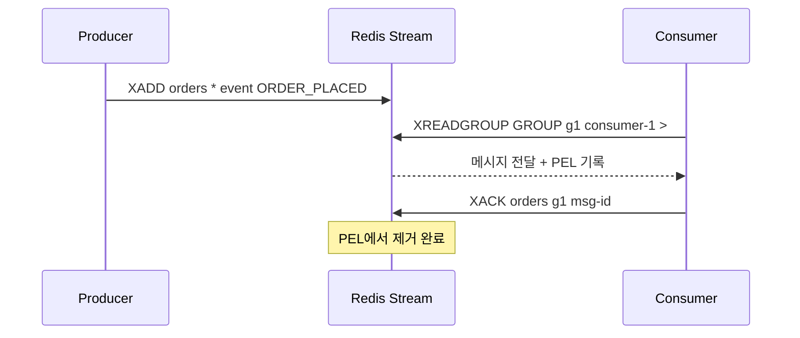
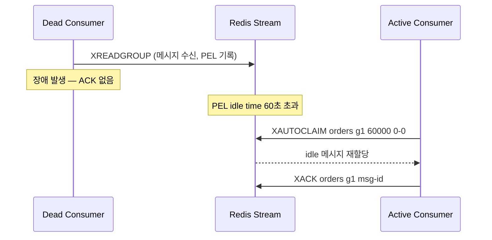

> **한 줄 요약**: Redis Streams는 "메시지를 보내고 받는 우체통"인데, 받는 사람이 여러 명이어도 편지가 사라지지 않고, 누가 읽었고 누가 아직 안 읽었는지까지 추적해주는 Redis의 자료구조입니다.

---

## 실제 문제: 왜 Redis Streams가 필요한가?

이커머스 서비스를 운영한다고 가정합니다. 주문이 들어오면 여러 서비스가 각자 할 일이 있습니다.

- **결제 서비스**: 돈을 받아야 합니다
- **재고 서비스**: 수량을 차감해야 합니다
- **알림 서비스**: 사용자에게 푸시를 보내야 합니다
- **분석 서비스**: 매출 통계를 업데이트해야 합니다

주문 서비스가 이 4개 서비스를 **직접 호출**하면 어떻게 될까요? 결제 서비스가 1초 걸리고, 재고가 0.5초, 알림이 2초, 분석이 0.3초면 — 사용자는 주문 버튼을 누르고 **3.8초를 기다려야** 합니다. 알림 서비스가 장애가 나면? 주문 자체가 실패합니다.

이 문제의 해결책이 **메시지 큐**입니다. 주문 서비스가 "주문 완료됐다"는 메시지를 큐에 던져놓으면, 각 서비스가 자기 속도에 맞춰 가져갑니다. 주문 응답은 즉시 나가고, 나머지는 비동기로 처리됩니다.

그런데 Kafka를 쓰려면 Zookeeper(또는 KRaft), 브로커 클러스터, 별도 운영이 필요합니다. **이미 Redis를 캐시로 쓰고 있는데, Redis 하나로 메시지 큐까지 해결할 수 없을까?** 이 질문에 대한 Redis의 답이 **Streams**입니다.

---

## 1. Redis Streams란 무엇인가

### 핵심 개념 — 한 줄로

Redis Streams는 **메모리에 저장되는 메시지 로그**입니다. 메시지를 시간 순서대로 쌓아놓고, 여러 소비자가 각자 읽어갈 수 있습니다.

> **비유**: 회사 게시판을 떠올려보세요. 누군가 공지를 올리면(Producer), 게시판에 시간 순서대로 쌓입니다(Stream). 마케팅팀, 개발팀, 디자인팀이 각자 읽습니다(Consumer Group). 한 팀이 읽었다고 게시글이 사라지지 않습니다. 그리고 각 팀 내에서도 "누가 어디까지 읽었는지" 체크리스트가 있습니다(PEL).

### 데이터 구조 — Append-only Log

Redis Streams는 **append-only log** 구조입니다. "뒤에만 추가할 수 있고, 한번 적힌 건 수정/삭제하지 않는 로그"라는 뜻입니다.

일반 DB 테이블은 UPDATE/DELETE가 가능하지만, Streams는 끝에 추가(XADD)만 합니다. 왜 이렇게 설계했을까요?

- **순서가 보장**됩니다 — 뒤에만 붙이니까 시간 순서가 자동으로 유지됩니다
- **여러 소비자가 독립적으로 읽을 수 있습니다** — 데이터가 삭제되지 않으니까 각자 "어디까지 읽었는지"만 추적하면 됩니다
- **과거 이벤트를 다시 읽을 수 있습니다** — 새 서비스가 추가되면 처음부터 따라잡기(replay)가 가능합니다

```
시간 →
[주문#1001 10:00:01] → [주문#1002 10:00:02] → [주문#1003 10:00:03] → ...
                 ↑                                        ↑
           결제 서비스가                              재고 서비스가
           여기까지 읽음                              여기까지 읽음
```

Kafka의 파티션도 같은 append-only log 구조입니다. 차이는 **저장 위치**입니다.

| | Redis Streams | Kafka |
|--|--------------|-------|
| **저장** | 메모리 (RAM) | 디스크 |
| **속도** | <1ms 지연 | 1~50ms 지연 |
| **용량** | 서버 메모리 한계 (보통 수십GB) | 디스크 한계 (수 TB 가능) |
| **운영** | Redis 하나면 됨 | 브로커 클러스터 + 별도 운영 |

**정리하면**: Redis Streams는 "메모리에 저장하는 메시지 로그"입니다. 빠르지만 용량이 제한적이고, Kafka처럼 별도 인프라 없이 기존 Redis에서 바로 사용할 수 있습니다.

### Entry ID — 메시지의 주소

모든 메시지는 고유한 ID를 가집니다. 형식은 `<밀리초 타임스탬프>-<시퀀스 번호>`입니다.

```
1715420001234-0   ← 2024-05-11 12:00:01.234의 첫 번째 메시지
1715420001234-1   ← 같은 밀리초에 들어온 두 번째 메시지
1715420001235-0   ← 1밀리초 후 메시지
```

이 설계가 영리한 이유 3가지:

1. **항상 커지는 숫자** — 시계가 NTP drift로 살짝 뒤로 가도 Redis가 마지막 ID 이상으로 강제 발급합니다. 순서가 절대 꼬이지 않습니다.
2. **시간으로 검색 가능** — `XRANGE mystream 1715420000000-0 1715420010000-0` 한 줄로 "10:00:00 ~ 10:00:10 사이 메시지"를 조회할 수 있습니다.
3. **충돌 없음** — 여러 클라이언트가 동시에 XADD해도 Redis가 싱글 스레드로 직렬 처리하므로 같은 ID가 두 번 나올 수 없습니다.

### 기존 Redis로는 왜 안 되는가

Streams 이전에도 메시지를 전달할 수 있는 Redis 구조가 있었습니다. 하지만 각각 치명적인 한계가 있었습니다.

**Redis List (LPUSH/BRPOP):**
- BRPOP으로 메시지를 꺼내면 **List에서 삭제**됩니다
- 한 컨슈머가 가져가면 끝 — 다른 서비스는 못 봅니다
- 가져간 뒤 처리 중에 죽으면? 메시지 영구 유실

**Redis Pub/Sub:**
- 메모리에 저장 자체를 하지 않습니다
- 발행(PUBLISH) 순간에 연결된 구독자만 받습니다
- 연결이 끊긴 사이에 온 메시지는 영원히 사라집니다

| 구조 | 저장 | 멀티 컨슈머 | ACK | 과거 재생 |
|------|------|:---:|:---:|:---:|
| **List** | ✅ | ❌ (꺼내면 삭제) | ❌ | ❌ |
| **Pub/Sub** | ❌ (저장 안 함) | ✅ (fan-out) | ❌ | ❌ |
| **Streams** | ✅ | ✅ (Consumer Group) | ✅ (PEL) | ✅ (XRANGE) |

**Streams가 해결하는 것**: 소비해도 삭제 안 됨, PEL로 "누가 읽었고 처리했는지" 추적, XRANGE로 과거 재생, MAXLEN으로 메모리 제어.

---

## 2. 핵심 명령어 동작원리

### XADD — 메시지 추가

```bash
XADD orders MAXLEN ~ 10000 * event ORDER_PLACED orderId 12345
```

내부 동작 순서:

- ① Unix 밀리초 읽기
- ② 새 ID 발급
- ③ radix tree에 저장
- ④ 블로킹 대기 클라이언트 wakeup

**트리밍 옵션:**

| 옵션 | 의미 | 비용 |
|------|------|------|
| `MAXLEN 10000` | 정확히 10,000개 유지 | radix tree 노드 분할 필요, 비용 큼 |
| `MAXLEN ~ 10000` | 최소 10,000개 유지 (노드 경계에서 삭제) | O(1)에 가까움, **프로덕션 권장** |
| `MINID ~ <id>` | 해당 ID 이전 메시지 삭제 | 시간 기반 보존 정책에 사용 |

### XREAD — 단순 읽기

```bash
XREAD COUNT 10 BLOCK 5000 STREAMS orders $
```

- `$`: 이 명령 이후의 새 메시지만
- `BLOCK 5000`: 최대 5초 대기
- 내부적으로 XADD 시점에 event-driven으로 깨우므로 폴링보다 효율적

**한계**: 여러 컨슈머가 XREAD하면 **모든 컨슈머가 동일 메시지**를 받습니다(fan-out). 작업 분산이 필요하면 Consumer Group을 사용해야 합니다.

### XREADGROUP + Consumer Group

Consumer Group의 핵심:

- 같은 그룹 내 컨슈머들은 **서로 다른 메시지**를 받습니다 (파티션 없는 파티셔닝)
- **받은 것**과 **처리 완료**를 분리합니다 (PEL)

```bash
# 그룹 생성 ($ = 지금부터, 0 = 처음부터)
XGROUP CREATE orders processing-group $ MKSTREAM

# 메시지 읽기 (> = 아직 전달 안 된 새 메시지)
XREADGROUP GROUP processing-group consumer-1 COUNT 10 BLOCK 5000 STREAMS orders >

# 처리 완료 확인 → PEL에서 제거
XACK orders processing-group 1715420001234-0

# 죽은 컨슈머의 메시지 재할당 (60초 이상 ACK 안 된 것)
XAUTOCLAIM orders processing-group consumer-2 60000 0-0 COUNT 10
```

**XREADGROUP 정상 처리 흐름:**



### "0" vs ">" — 재시작 시 필수 패턴

| ID | 의미 | 용도 |
|----|------|------|
| `>` | 아직 전달 안 된 **새 메시지** | 정상 운영 중 |
| `0` | 이 컨슈머의 PEL에 있는 **미확인 메시지** | 재시작 후 미처리 건 재처리 |

**올바른 재시작 패턴**: 먼저 `0`으로 PEL 미처리 건을 소화한 뒤, PEL이 비면 `>`로 전환합니다.

```java
public void start() {
    // 1단계: PEL에 남은 미처리 메시지 재처리
    while (true) {
        List<MapRecord<...>> records = streamOps.read(
            Consumer.from(GROUP, consumerId),
            StreamReadOptions.empty().count(100),
            StreamOffset.create(STREAM, ReadOffset.from("0"))
        );
        if (records == null || records.isEmpty()) break;
        records.forEach(this::processAndAck);
    }

    // 2단계: 새 메시지 처리로 전환
    while (!Thread.currentThread().isInterrupted()) {
        List<MapRecord<...>> records = streamOps.read(
            Consumer.from(GROUP, consumerId),
            StreamReadOptions.empty().count(10).block(Duration.ofSeconds(1)),
            StreamOffset.create(STREAM, ReadOffset.lastConsumed())
        );
        if (records != null) records.forEach(this::processAndAck);
    }
}
```

---

## 3. 다른 메시지 큐와의 비교

### Redis Streams vs Kafka

| 기준 | Redis Streams | Kafka |
|------|--------------|-------|
| **저장** | 인메모리 (AOF로 디스크 백업) | 디스크 (순차 쓰기) |
| **파티셔닝** | 없음 — Consumer Group이 암묵적 분산 | 명시적 파티션, 키 기반 라우팅 |
| **리밸런싱** | 없음 | 자동 리밸런싱 (짧은 중단) |
| **처리량** | 수십만 TPS (단일 인스턴스) | 수백만 TPS (클러스터) |
| **지연시간** | <1ms | 1~50ms |
| **Exactly-once** | 미지원 (앱 레벨 멱등) | Transactions API 지원 |
| **수평 확장** | 앱 레벨 키 샤딩 필요 | 파티션 추가로 선형 확장 |

- **Streams가 나은 경우**: 이미 Redis 사용 중, 소규모(수백만/일 이하), 지연시간 <1ms, 짧은 보존 기간
- **Kafka가 압도적인 경우**: TB 단위 히스토리, 수백만 TPS, Exactly-once 필수, Kafka Streams/Flink 연동

### Redis Streams vs RabbitMQ

| 기준 | Redis Streams | RabbitMQ |
|------|--------------|----------|
| **라우팅** | 없음 — 앱이 키 결정 | Exchange 4종 (Direct/Topic/Fanout/Headers) |
| **ACK** | PEL에서 제거 (메시지는 유지) | Queue에서 삭제 |
| **DLQ** | 직접 구현 필요 | 네이티브 지원 |
| **우선순위 큐** | 없음 | 0~255 우선순위 지원 |

### Redis Streams vs AWS SQS

| 기준 | Redis Streams | AWS SQS |
|------|--------------|---------|
| **운영** | 직접 운영 (Sentinel/Cluster) | 완전 관리형 (99.9% SLA) |
| **순서** | 전역 보장 (단일 키) | Standard: 미보장, FIFO: 보장 |
| **비용** | 인스턴스 고정비 | 100만 요청당 $0.40~$0.50 |

### 종합 비교

| 기능 | Streams | Kafka | RabbitMQ | SQS | Pub/Sub | List |
|------|---------|-------|----------|-----|---------|------|
| 영속성 | 메모리+AOF | 디스크 | 디스크 | 관리형 | 없음 | 메모리 |
| 순서 보장 | 전역 | 파티션 내 | Queue 내 | FIFO만 | 발행순 | FIFO |
| ACK | XACK+PEL | 오프셋 | basic.ack | Delete | 없음 | 없음 |
| 재생 | XRANGE | 오프셋 | 불가 | 불가 | 불가 | 불가 |
| Exactly-once | 미지원 | 지원 | 미지원 | 미지원 | 미지원 | 미지원 |
| 최대 TPS | 수십만 | 수백만 | 수만 | 무제한 | 수십만 | 수십만 |
| 지연시간 | <1ms | 1~5ms | 1~5ms | 수십ms | <1ms | <1ms |
| DLQ | 수동 | 수동 | 네이티브 | 네이티브 | 없음 | 없음 |

---

## 4. 실전 코드 — Java/Spring Boot

### Producer

```java
@Service
public class OrderEventProducer {

    private final StreamOperations<String, String, String> streamOps;

    public RecordId publish(String orderId, String event) {
        return streamOps.add(StreamRecords.newRecord()
            .in("orders")
            .ofMap(Map.of(
                "event", event,
                "orderId", orderId,
                "ts", String.valueOf(System.currentTimeMillis())
            )));
    }
}
```

### Consumer + DLQ 패턴

```java
@Service
public class OrderEventConsumer {

    private final StreamOperations<String, String, String> streamOps;
    private static final String STREAM = "orders";
    private static final String GROUP = "order-processing";
    private final String consumerId = "consumer-" + UUID.randomUUID();

    @Scheduled(fixedDelay = 100)
    public void consume() {
        List<MapRecord<String, String, String>> records = streamOps.read(
            Consumer.from(GROUP, consumerId),
            StreamReadOptions.empty().count(10).block(Duration.ofMillis(100)),
            StreamOffset.create(STREAM, ReadOffset.lastConsumed())
        );
        if (records == null) return;

        for (MapRecord<String, String, String> record : records) {
            try {
                processOrder(record.getValue());
                streamOps.acknowledge(STREAM, GROUP, record.getId());
            } catch (Exception e) {
                handleFailure(record, e);
            }
        }
    }

    private void handleFailure(MapRecord<String, String, String> record, Exception e) {
        PendingMessages pending = streamOps.pending(STREAM, GROUP,
            Range.closed(record.getId().getValue(), record.getId().getValue()), 1);

        if (pending.size() > 0 && pending.get(0).getTotalDeliveryCount() >= 3) {
            streamOps.add(StreamRecords.newRecord()
                .in("orders:dlq").ofMap(record.getValue()));
            streamOps.acknowledge(STREAM, GROUP, record.getId());
            log.error("DLQ 이동: {}", record.getId());
        }
        // 3회 미만이면 ACK 안 함 → PEL에 남아 XAUTOCLAIM 대상
    }
}
```

### 죽은 컨슈머 메시지 재할당

컨슈머 장애 시 PEL에 메시지가 쌓입니다. XAUTOCLAIM으로 살아있는 컨슈머가 가져가 재처리합니다.



```java
@Scheduled(fixedDelay = 30_000)  // 30초마다
public void reclaimStale() {
    // 60초 이상 ACK 안 된 메시지를 현재 컨슈머로 재할당
    // min-idle-time 권장: 평균 처리시간 × 3
}
```

---

## 5. 운영 — 극한 시나리오

### 메모리 폭발

`MAXLEN`이 없으면 Redis 메모리가 차서 `OOM command not allowed` 에러와 함께 XADD가 거부됩니다.

**대응 원칙:**

- 항상 `MAXLEN ~`을 설정
- MAXLEN은 **PEL 크기보다 크게** 설정해야 합니다
- MAXLEN이 PEL보다 작으면 처리 중인 메시지가 스트림에서 삭제되어 **좀비 PEL**이 생깁니다

> 엔트리당 ~500B, 10만 개 = 50MB. PEL 엔트리당 ~100B. 생각보다 작지만 PEL 누수가 위험합니다.

### 컨슈머 장애와 PEL 누적

**탐지**: `XPENDING orders group - + 10`으로 idle time이 수 분 이상인 항목 모니터링.

**복구**: XAUTOCLAIM의 min-idle-time을 `평균 처리시간 × 3` 이상으로 설정. 너무 짧으면 정상 처리 중인 메시지를 빼앗아 중복 처리됩니다.

### Redis 재시작 시 데이터 보존

```
appendonly yes
appendfsync everysec    # 최대 1초 유실 가능
save 60 10000           # RDB 스냅샷 병행
```

Consumer Group 메타데이터(last-delivered-id, PEL)도 AOF에 보존됩니다.

### 클러스터 모드 주의사항

- 여러 스트림을 한 명령에 읽으려면 **같은 슬롯**이어야 합니다. Hash Tag로 강제 배치: `orders:{shard0}:events`
- Consumer Group은 **키 단위**입니다. 샤드별로 그룹을 따로 생성해야 합니다.

### 순서 역전이 발생하는 케이스

1. Consumer Group 내 병렬 처리 → consumer-2가 consumer-1보다 먼저 완료
2. XCLAIM 후 구/신 메시지 처리가 뒤섞임
3. 여러 스트림 키 사용 시 같은 userId 이벤트가 다른 컨슈머에서 처리

순서가 중요하면 같은 키의 이벤트를 같은 스트림에 넣고 단일 컨슈머로 처리하거나, Entry ID 기반 낙관적 락을 사용합니다.

---

## 6. 성능 벤치마크

단일 Redis 7.x 인스턴스 (8코어, 32GB) 기준:

| 명령 | 단건 | 파이프라인(100) |
|------|------|----------------|
| XADD | ~100K TPS | ~800K TPS |
| XREAD | ~80K TPS | ~600K TPS |
| XREADGROUP | ~70K TPS | ~500K TPS |
| XACK | ~120K TPS | ~900K TPS |

| 지표 | Redis Streams | Kafka (복제) |
|------|--------------|-------------|
| P50 | <0.5ms | 5~10ms |
| P99 | <2ms | 20~50ms |
| P99.9 | <10ms | 100~500ms |

> 지연시간만 비교하면 Streams가 압도적이지만, Kafka의 강점은 처리량·내구성·확장성입니다.

---

## 핵심 메트릭

Redis Streams 운영에서 이 숫자들이 모두 정상 범위이면 메시지가 안전하게 흐르고 있다. 하나라도 이상하면 즉시 확인이 필요하다.

| 메트릭 | 정상 기준 | 이상 신호 | 원인 가설 |
|--------|---------|---------|---------|
| **PEL 크기** (`XPENDING` 총합) | 0 ~ MAXLEN × 0.1 이하 | 지속 증가 또는 MAXLEN 초과 | 컨슈머 장애, ACK 누락, DLQ 미구현 |
| **PEL idle time 최대값** | 평균 처리시간 × 3 이하 | 수 분 이상 지속 | 컨슈머 프로세스 사망, XAUTOCLAIM 미설정 |
| **스트림 길이** (`XLEN`) | MAXLEN 설정값의 80% 이하 | MAXLEN 근접 또는 초과 | 컨슈머 처리 지연, MAXLEN 미설정 |
| **컨슈머 그룹 lag** (XLEN - last-delivered-id 차이) | 0 ~ 1,000 이하 | 지속 증가 | 컨슈머 처리량 < 프로듀서 발행량 |
| **XADD 응답시간 P99** | 1ms 이하 | 5ms 초과 | Redis 메모리 부족, AOF fsync 지연, 핫키 경합 |
| **메모리 사용량** (`used_memory`) | `maxmemory` × 0.75 이하 | `maxmemory` × 0.9 초과 | MAXLEN 미설정, PEL 누수, AOF 재작성 지연 |

**알람 설정 예시**

```
PEL 크기 > MAXLEN × 0.5 → Slack 경고 (XAUTOCLAIM 간격 단축 검토)
PEL idle time > 5분 → PagerDuty P1 (컨슈머 생사 확인)
컨슈머 lag > 10,000 → PagerDuty P1 (컨슈머 스케일 아웃 검토)
XLEN이 MAXLEN의 95% → PagerDuty P1 (MAXLEN 증설 또는 처리량 증가)
used_memory > maxmemory × 0.9 → PagerDuty P0 (즉시 MAXLEN 강제 트리밍)
```

---

## 실무 실수 Top 5

**실수 1: MAXLEN 없이 스트림 운영**
`XADD mystream * ...`만 쓰고 MAXLEN을 지정하지 않으면 스트림이 무한 증가합니다. Redis 메모리가 가득 차면 `OOM command not allowed` 에러와 함께 모든 쓰기가 거부됩니다. 항상 `XADD mystream MAXLEN ~ 100000 * ...` 형태로 사용하세요. 물결표(`~`)는 노드 경계에서 삭제해 O(1)에 가까운 비용으로 트리밍합니다.

**실수 2: 재시작 시 `>` 로만 읽기**
컨슈머 재시작 후 곧바로 `>`(새 메시지)만 읽으면 장애 전 PEL에 쌓여있던 미확인 메시지가 영구히 처리되지 않습니다. 반드시 재시작 직후 `0`으로 PEL을 먼저 소진한 다음 `>`로 전환하는 2단계 패턴을 사용하세요.

**실수 3: MAXLEN을 PEL보다 작게 설정**
`MAXLEN 1000`인데 컨슈머가 느려 PEL에 2,000개가 쌓이면, 스트림에서 오래된 메시지가 삭제되어 PEL에만 ID가 남는 **좀비 PEL**이 발생합니다. XAUTOCLAIM으로 재처리하려 해도 실제 데이터가 없어 영원히 처리 불가합니다. MAXLEN은 항상 예상 최대 PEL 크기의 10배 이상으로 설정하세요.

**실수 4: min-idle-time 너무 짧게 설정**
`XAUTOCLAIM orders g1 consumer-2 1000 0-0`처럼 idle time을 1초로 설정하면, 정상적으로 처리 중인 메시지(처리에 2~3초 소요)를 다른 컨슈머가 빼앗아 **중복 처리**가 발생합니다. min-idle-time은 `평균 처리시간 × 3` 이상으로, 처리 시간이 3초라면 최소 9,000ms(9초)로 설정하세요.

**실수 5: Consumer Group MKSTREAM 없이 선 읽기 시도**
스트림이 아직 존재하지 않는 상태에서 `XGROUP CREATE nonexistent-stream g1 $` 명령을 날리면 `ERR The XGROUP subcommand requires the key to exist`로 실패합니다. `MKSTREAM` 옵션을 붙이거나, 스트림을 먼저 생성한 후 그룹을 만드세요. 프로듀서가 뜨기 전에 컨슈머가 먼저 초기화되는 환경에서 자주 발생합니다.

---

## 극한 시나리오

### 극한 시나리오 1: 컨슈머 전원 장애 — PEL 폭탄

배포 실수로 컨슈머 파드 전체가 동시에 내려갔습니다. 그 사이 프로듀서는 계속 메시지를 발행했고, 이미 전달됐지만 ACK를 못 받은 메시지 수만 건이 PEL에 쌓였습니다.

**문제점:**
- PEL 크기가 MAXLEN에 근접 → 스트림 트리밍이 PEL 메시지를 삭제 → 좀비 PEL 발생
- 컨슈머 재기동 후 `0`으로 PEL을 재처리하려니 수만 건이 한꺼번에 처리되어 DB 과부하
- 일부 메시지는 비즈니스 로직상 순서가 중요한데, PEL 재처리 순서가 뒤섞임

**대응 전략:**

1️⃣ **MAXLEN을 PEL 예상 최대치의 10배로 설정**: 컨슈머가 30분간 다운될 때 발생하는 PEL 최대값을 계산해 역산으로 MAXLEN을 결정합니다.

2️⃣ **재기동 시 처리량 조절**: `0`으로 PEL 재처리할 때 COUNT를 작게(예: 10~50) 잡아 DB에 부하를 분산합니다. 평소 COUNT 100이라면 재처리 초기에는 10으로 시작합니다.

3️⃣ **XPENDING으로 좀비 PEL 사전 탐지**: `XPENDING stream group - + 100`으로 idle time이 스트림 보존 기간을 초과한 항목을 찾아 수동으로 XACK 처리합니다.

4️⃣ **컨슈머 그룹 분리**: 순서가 중요한 이벤트(예: 주문 상태 변경)와 순서가 무관한 이벤트(예: 로그 수집)를 별도 스트림으로 분리해 PEL 폭탄의 영향 범위를 제한합니다.

5️⃣ **PEL 크기 알람**: `XPENDING stream group - + 1`으로 PEL 총합을 주기적으로 모니터링하고 MAXLEN의 50% 초과 시 경고를 발송합니다.

### 극한 시나리오 2: Redis 메모리 90% — XADD 거부 직전

메모리 모니터링 알람이 울렸습니다. `used_memory`가 `maxmemory`의 92%에 달했고, `maxmemory-policy noeviction` 설정 때문에 곧 모든 쓰기가 거부될 상황입니다. 스트림 7개가 각각 수십만 건씩 적재되어 있습니다.

**문제점:**
- `noeviction` 정책이므로 메모리 초과 즉시 XADD 에러 반환 → 프로듀서 장애 전파
- XTRIM으로 트리밍하면 PEL에 있는 메시지가 삭제되어 좀비 PEL 발생 가능
- 긴급 MAXLEN 축소 시 비즈니스적으로 중요한 메시지가 유실될 수 있음

**대응 전략:**

1️⃣ **PEL 먼저 확인 후 트리밍**: `XPENDING`으로 각 스트림의 PEL 최솟값 ID를 확인한 후, 그 ID보다 오래된 메시지만 `XTRIM MINID`로 안전하게 삭제합니다.

2️⃣ **컨슈머 처리 속도 임시 증가**: 긴급히 컨슈머 인스턴스를 증설해 COUNT를 높여 빠르게 ACK를 쌓아 PEL을 비운 뒤 트리밍합니다.

3️⃣ **AOF 재작성 트리거**: 메모리 단편화가 높으면(`mem_fragmentation_ratio > 1.5`) `BGREWRITEAOF`로 AOF를 압축해 메모리를 일부 회수합니다.

4️⃣ **스트림별 MAXLEN 긴급 축소**: 덜 중요한 스트림(로그, 분석)부터 MAXLEN을 절반으로 줄입니다. `XADD mystream MAXLEN ~ 50000 * ...`으로 이후 XADD 때마다 자동 트리밍됩니다.

5️⃣ **중기 대책: 스트림 분리**: 중요도별로 스트림을 별도 Redis 인스턴스에 분산합니다. 비즈니스 핵심 스트림(주문)과 분석용 스트림(클릭 로그)을 같은 Redis에 두지 않습니다.

### 극한 시나리오 3: 프로듀서 폭주 — 컨슈머 lag 10만 건 초과

이벤트 처리 로직에 버그가 생겨 컨슈머가 처리 속도가 갑자기 초당 100건에서 10건으로 떨어졌습니다. 프로듀서는 여전히 초당 500건을 발행 중이고, lag이 분당 3만 건씩 쌓이고 있습니다.

**문제점:**
- lag이 증가하면 결과적으로 MAXLEN에 걸려 오래된 메시지가 삭제
- 삭제된 메시지가 PEL에 있으면 좀비 PEL, 없으면 유실
- 긴급 컨슈머 스케일 아웃해도 PEL 재처리 + 신규 메시지를 동시에 받아 오히려 DB 과부하

**대응 전략:**

1️⃣ **근본 원인부터 파악**: 컨슈머 처리 속도 저하 원인이 DB 락, 외부 API 타임아웃, 코드 버그인지 먼저 확인합니다. 컨슈머 스케일 아웃은 근본 원인 해결 후에 합니다.

2️⃣ **프로듀서 속도 제한**: 근본 원인 해결 전에 프로듀서 발행 속도를 임시로 줄입니다. Rate limiter를 컨슈머 처리 속도의 80%로 제한해 lag 증가를 중단시킵니다.

3️⃣ **MAXLEN 임시 증설**: lag 누적 기간 동안 메시지를 보존하기 위해 MAXLEN을 현재 값의 3~5배로 임시 증설합니다. 메모리를 확인하고 여유가 있을 때만 적용합니다.

4️⃣ **컨슈머 그룹 내 병렬 처리 증가**: 동일 그룹에 컨슈머 인스턴스를 추가하면 Redis가 메시지를 자동으로 분산합니다. 단, DB 연결 풀 한계를 먼저 확인합니다.

5️⃣ **DLQ 백프레셔 모니터링**: 처리 실패 → DLQ 이동 → DLQ도 쌓이는 연쇄가 발생하지 않도록 DLQ 크기도 별도 알람을 설정합니다.

---

## 실제 장애 사례

### 사례 1: 전자상거래 플랫폼 — 좀비 PEL로 주문 이벤트 3만 건 유실

**상황**: 국내 중견 커머스 플랫폼에서 주문 완료 이벤트를 Redis Streams로 처리하고 있었다. 배포 중 컨슈머 파드가 2분간 모두 내려갔고, 그 사이 2만 건의 메시지가 PEL에 쌓였다. MAXLEN이 50,000으로 설정되어 있었으나 PEL 크기가 50,000을 넘어서면서 Redis가 오래된 메시지를 트리밍했다. 재기동된 컨슈머가 `0`으로 PEL을 재처리하려 했지만, 실제 메시지 데이터가 없는 좀비 PEL 3만 건을 처리할 수 없었다. 결국 3만 건의 주문에 대한 재고 차감, 포인트 적립, 알림 발송이 누락됐다.

**근본 원인**: MAXLEN이 예상 최대 PEL 크기보다 작게 설정되어 있었다. 배포 시 컨슈머가 동시에 내려가는 상황을 고려하지 않았고, PEL 크기 모니터링도 없었다.

**해결책**:
- MAXLEN을 `예상 최대 lag × 10` 기준으로 재산정 (50,000 → 500,000)
- PEL 크기 > MAXLEN × 0.3 시 즉시 알람 발송
- 배포 절차에 "컨슈머 중단 전 PEL 크기 확인" 체크리스트 추가
- 좀비 PEL 자동 탐지 배치 구현: 스트림에 존재하지 않는 PEL ID를 DLQ로 이동 후 수동 처리

**교훈**: MAXLEN 설정은 메모리 제약만 고려해서는 안 된다. 최악의 컨슈머 다운타임 동안 쌓일 PEL 크기를 역산해야 한다. "PEL은 항상 스트림 안에 있다"는 가정을 운영 중에도 지켜야 한다.

### 사례 2: 핀테크 스타트업 — min-idle-time 오설정으로 이중 결제 이벤트

**상황**: 결제 완료 이벤트를 Redis Streams → 정산 서비스로 전달하는 파이프라인에서 XAUTOCLAIM의 min-idle-time을 2,000ms(2초)로 설정했다. 정산 서비스의 평균 처리 시간은 3~5초였다. XAUTOCLAIM이 2초마다 idle 메시지를 다른 컨슈머에게 재할당하면서, 이미 처리 중인 결제 이벤트가 다른 컨슈머에게도 전달됐다. 동일 결제 ID에 대해 정산 레코드가 2개 생성되었고, 판매자에게 정산금이 두 번 지급되는 사고가 발생했다.

**근본 원인**: min-idle-time을 평균 처리 시간보다 짧게 설정했다. "느리게 처리 중"인 상태와 "컨슈머 장애"를 구분하지 못했다.

**해결책**:
- min-idle-time을 `평균 처리시간 P99 × 3` 기준으로 재설정 (P99 = 8초이므로 24,000ms)
- 정산 서비스에 결제 ID 기반 멱등성 체크 추가 (`INSERT IGNORE` 또는 UNIQUE 제약)
- 처리 시작 시 Redis Set에 처리 중 결제 ID를 기록하고 XAUTOCLAIM 전 대조 확인
- 잘못 지급된 정산금은 역분개 처리 후 다음 정산 사이클에서 차감

**교훈**: XAUTOCLAIM은 "죽은 컨슈머 대응" 도구다. min-idle-time이 처리 시간보다 짧으면 정상 처리를 방해한다. 다운스트림 서비스에는 반드시 멱등성 처리를 함께 구현해야 한다.

### 사례 3: SaaS 플랫폼 — Consumer Group 미초기화로 메시지 전량 유실

**상황**: 새 기능 출시 후 Redis Streams 컨슈머를 추가했다. 배포 스크립트에서 `XGROUP CREATE` 명령이 실행되지 않아 Consumer Group이 생성되지 않았다. 컨슈머 코드는 `XREADGROUP` 호출 시 그룹이 없으면 예외를 throw했지만, 이 예외를 `try-catch`로 묵살하고 루프를 계속 돌았다. 72시간 동안 8만 건의 메시지가 스트림에 쌓였지만 아무것도 처리되지 않았다. MAXLEN이 50,000이었기 때문에 절반이 이미 트리밍되어 복구도 불가능했다.

**근본 원인**: 컨슈머 초기화 실패를 묵살하는 예외 처리 코드, Consumer Group 존재 여부 확인 없는 배포 스크립트, 컨슈머 lag 모니터링 부재가 복합적으로 작용했다.

**해결책**:
- 컨슈머 시작 시 그룹 존재 여부를 확인하고 없으면 애플리케이션을 즉시 종료 (fail-fast)
- 배포 스크립트에 `XGROUP CREATE ... MKSTREAM` 멱등 실행 추가
- 컨슈머 lag (XLEN - last-delivered-id) > 1,000 시 PagerDuty 알람 설정
- 예외를 묵살하는 `catch (Exception e) {}` 패턴 코드 리뷰 금지 가이드라인 수립

**교훈**: 컨슈머가 "실행 중"이라고 해서 "처리 중"이 아니다. lag 모니터링은 Streams 운영의 핵심 안전망이다. 예외 묵살은 시스템이 조용히 실패하게 만드는 가장 위험한 패턴 중 하나다.

---

## 면접 포인트

### 면접 포인트 1️⃣ "Kafka와의 가장 큰 차이?"

저장 매체(메모리 vs 디스크)와 확장 단위입니다. Kafka는 파티션이라는 독립 확장 단위가 있어 클러스터 수평 확장이 자연스럽고, Exactly-once를 지원합니다. Streams는 단일 키가 단일 인스턴스에 바인딩되어 앱 레벨 샤딩이 필요하며, at-least-once만 보장합니다.

### 면접 포인트 2️⃣ "PEL이 왜 중요한가?"

at-least-once 보장의 핵심입니다. 컨슈머가 메시지를 받고 죽으면 PEL에 남아있어 XAUTOCLAIM으로 다른 컨슈머가 재처리할 수 있습니다. PEL 없이는 메시지 유실이 불가피합니다.

### 면접 포인트 3️⃣ "`>` 와 `0` 차이?"

`>`는 새 메시지, `0`은 PEL의 미확인 메시지입니다. 재시작 시 `0` → `>` 순서로 전환해야 미처리 건이 유실되지 않습니다.

### 면접 포인트 4️⃣ "MAXLEN이 PEL보다 작으면?"

가장 위험한 운영 실수입니다. 스트림에서 삭제된 메시지가 PEL에만 남아 좀비 항목이 됩니다. XCLAIM/XAUTOCLAIM으로 재처리하려 해도 실제 데이터가 없어 영원히 처리 불가합니다.

### 면접 포인트 5️⃣ "Exactly-once 구현 가능?"

Streams 자체는 at-least-once만 지원합니다. 처리한 Entry ID를 Redis Set에 저장하고 Lua Script로 중복 체크하면 앱 레벨 멱등을 구현할 수 있지만, 완전한 Exactly-once가 필요하면 Kafka Transactions API가 적합합니다.
