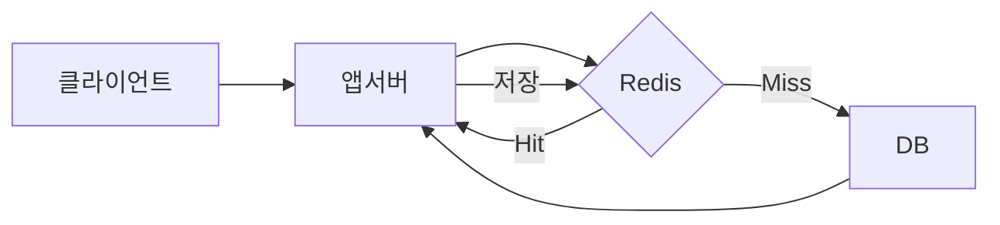
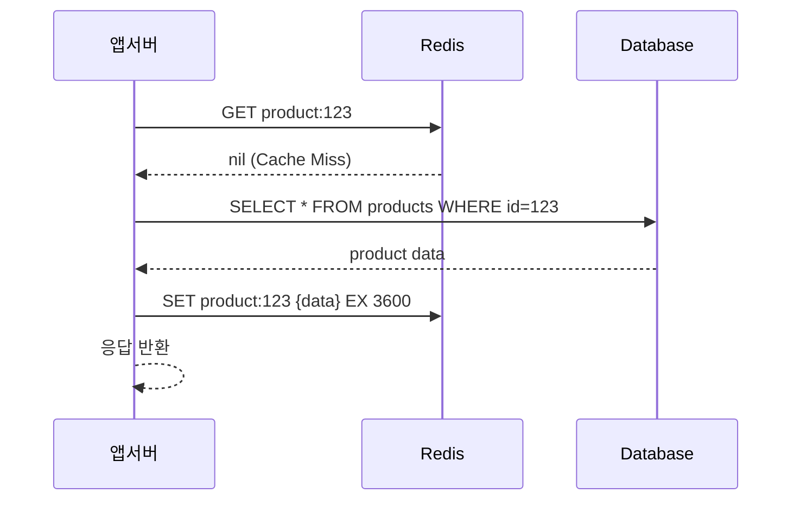

> **한 줄 요약**: 캐시는 DB 부하를 줄이는 마법이 아니라, 일관성·가용성·성능 사이에서 트레이드오프를 선택하는 설계 결정이며, 패턴을 잘못 고르면 Cache Stampede나 데이터 유실 같은 재앙이 기다린다.

## 실제 문제: 캐시 때문에 서비스가 무너진 사례

2021년 국내 D 이커머스에서 블랙프라이데이 당일 상품 상세 페이지 캐시가 일제히 만료됐습니다. 수십만 개의 동시 요청이 캐시 Miss를 내고 전부 DB로 쏟아졌습니다. DB CPU가 100%를 찍고 쿼리 타임아웃이 폭발했습니다. 상품 페이지가 10분간 완전히 응답 불가였습니다. 원인은 단 하나, **모든 상품의 TTL을 동일하게 설정**했던 것입니다. 동시에 만료됐고, 동시에 DB로 몰렸습니다.

이것이 Cache Stampede(캐시 스탬피드)입니다. 캐시 패턴을 잘못 선택하거나 TTL 설정 하나를 잘못해도 전체 서비스가 무너집니다.

캐싱 시스템이 해결해야 할 핵심 문제:
- **Cache Miss Storm**: 대량의 캐시가 동시에 만료될 때 DB 과부하를 막는 방법
- **캐시 일관성**: DB와 캐시 중 어느 쪽이 최신 데이터를 갖는가
- **쓰기 전파**: 쓰기 요청을 DB와 캐시에 어떤 순서로 반영하는가
- **캐시 장애 시 폴백**: Redis가 죽으면 서비스가 전부 멈추는가

---

## 설계 의사결정 로드맵

캐싱 패턴 선택에서 순서대로 답해야 할 핵심 결정 4가지입니다. 패턴 이름을 외우는 것보다 "언제 어떤 패턴이 적합한가"를 설명할 수 있어야 합니다.

### 결정 1: 읽기 패턴 — Cache-Aside vs Read-Through

**문제**: 데이터를 읽을 때 캐시에 없으면 누가 DB에서 가져와서 캐시에 채우는가? 애플리케이션이 직접 하는가, 캐시 레이어가 자동으로 하는가?

| 후보 | 장점 | 단점 | 언제 적합 |
|------|------|------|----------|
| Cache-Aside (Lazy Loading) | 애플리케이션이 캐시 로직 완전 제어, 장애 시 DB 직접 조회 가능 | Cache Miss 시 3번의 왕복(캐시조회→DB조회→캐시저장), 첫 요청은 느림 | 읽기 많고 쓰기 적은 경우, 캐시 데이터가 DB와 동일한 형태 |
| Read-Through | 캐시 레이어가 자동 채움, 애플리케이션 코드 단순 | 캐시 미스 시 동일하게 느림, 커스텀 변환 로직 넣기 어려움 | ORM/캐시 라이브러리가 통합 지원하는 경우 |

**우리의 선택: Cache-Aside**
- 이유: 애플리케이션이 캐시 키 설계, TTL 설정, 캐시 데이터 변환을 직접 제어합니다. DB 스키마와 캐시 데이터 형태가 달라도 됩니다(JOIN 결과를 캐시하거나, 여러 테이블 데이터를 합쳐서 캐시). Redis 장애 시 캐시 없이 DB 직접 조회로 폴백이 자연스럽습니다.
- 안 하면: Read-Through는 캐시 레이어가 DB 접근 로직을 알아야 합니다. 비즈니스 로직이 캐시 레이어로 누수됩니다.

### 결정 2: 쓰기 패턴 — Write-Through vs Write-Behind

**문제**: 데이터를 쓸 때 DB와 캐시를 어떤 순서로, 동기/비동기로 갱신하는가?

| 후보 | 장점 | 단점 | 언제 적합 |
|------|------|------|----------|
| Write-Through | 캐시와 DB 항상 동기, 일관성 보장 | 쓰기 지연 증가 (DB + 캐시 순차), 읽지 않을 데이터도 캐시에 씀 | 읽기와 쓰기가 균형 잡힌 경우 |
| Write-Behind (Write-Back) | 쓰기 응답 빠름 (캐시만 쓰고 즉시 반환), DB 부하 낮음 | Redis 장애 시 캐시의 미반영 데이터 유실 | 쓰기가 매우 많고 일시적 유실 허용 (게임 점수 등) |
| Write-Around | DB에만 쓰고 캐시 무효화, 불필요한 캐시 오염 없음 | 다음 읽기 시 Cache Miss 발생 | 한 번 쓰고 거의 읽지 않는 데이터 |

**우리의 선택: Write-Around (캐시 무효화 방식)**
- 이유: 대부분의 서비스에서 쓰기 발생 시 캐시를 무효화(DELETE)하고, 다음 읽기 시 Cache-Aside로 다시 채우는 방식이 가장 안전합니다. 캐시 갱신 실패 시에도 읽기 시 캐시 Miss → DB 조회 → 최신 데이터 캐시로 자동 복구됩니다.
- 안 하면: Write-Behind를 잘못 사용하면 Redis 재시작 한 번에 수 분의 쓰기 데이터가 사라집니다. 결제, 재고 같은 데이터에는 절대 사용할 수 없습니다.

### 결정 3: Cache Stampede 방어 — TTL 랜덤화 vs Mutex vs Probabilistic Early Recomputation

**문제**: 동일한 TTL을 가진 수십만 개의 캐시 키가 동시에 만료되거나, 인기 캐시 하나가 만료될 때 수천 개의 동시 요청이 DB로 쏟아지는 것을 어떻게 막는가?

| 후보 | 장점 | 단점 | 언제 적합 |
|------|------|------|----------|
| TTL 랜덤 지터 | 구현 단순, 만료 시간 분산 | 특정 키에 동시 요청 몰리면 무방비 | 대량 키의 일제 만료 방지 |
| Mutex (분산 락) | 한 요청만 DB 조회, 나머지 대기 | 락 대기 지연, 데드락 위험 | 인기 키 하나에 집중되는 경우 |
| PER (Probabilistic Early Recomputation) | 만료 전 확률적 갱신, 만료 순간 없음 | 구현 복잡도 | 고트래픽 인기 키 |

**우리의 선택: TTL 랜덤 지터 + Mutex 조합**
- 이유: TTL 랜덤화로 대규모 일제 만료를 막고, 인기 키에는 Mutex로 중복 재생성을 방지합니다. 두 방어선을 모두 갖춥니다.
- 안 하면: 블랙프라이데이 트래픽에서 상품 캐시 TTL이 동시에 만료되면 DB가 수초 안에 다운됩니다.

### 결정 4: 캐시 Warm-Up — 콜드 스타트 대응

**문제**: 서버를 새로 배포하거나 Redis를 재시작하면 캐시가 비어있어 모든 요청이 DB로 갑니다. 어떻게 대응하는가?

| 후보 | 장점 | 단점 | 언제 적합 |
|------|------|------|----------|
| 요청 기반 자연 채움 | 추가 구현 없음 | 콜드 스타트 시 DB 과부하 | 트래픽이 낮은 서비스 |
| 배포 전 Pre-warming | 중요 데이터 미리 캐시 | 어떤 키를 미리 채울지 알아야 함 | 인기 데이터가 예측 가능한 경우 |
| 그레이스풀 배포 | 구 인스턴스 캐시를 새 인스턴스가 공유 | Redis가 외부에 있어야 함 | Redis가 서버와 분리된 경우 |

**우리의 선택: Pre-warming + 그레이스풀 배포**
- 이유: 배포 시 인기 상품 Top 1000, 메인 배너 데이터 등을 미리 캐시에 채웁니다. Redis가 애플리케이션 서버와 분리되어 있으면 배포 시에도 캐시가 유지됩니다.
- 안 하면: 블랙프라이데이 직전 배포 후 Redis가 비어있으면 대규모 트래픽이 전부 DB로 쏟아집니다.

---

## 1. 요구사항 분석 및 규모 추정

### 기능 요구사항

1️⃣ **읽기 캐시**: 상품 상세, 사용자 프로필, 카테고리 목록 — 읽기 비율 95% 이상
2️⃣ **쓰기 전파**: DB 쓰기 후 캐시 일관성 유지
3️⃣ **TTL 관리**: 데이터 유형별 만료 정책
4️⃣ **캐시 무효화**: 특정 키 또는 패턴 기반 삭제
5️⃣ **Cache Miss 처리**: DB 폴백, Stampede 방어

### 비기능 요구사항

- **히트율**: 캐시 히트율 90% 이상 목표
- **지연시간**: 캐시 조회 1ms 이하, DB 조회 100ms
- **가용성**: Redis 장애 시 DB 폴백으로 서비스 유지
- **일관성**: 최종 일관성 허용 (수초~수분 허용)

### 규모 추정

```
DAU: 200만 명
읽기 QPS: 50,000
쓰기 QPS: 5,000 (읽기 10분의 1)
캐시 히트율 90% 목표 → DB에 실제로 가는 QPS: 5,000

캐시 용량:
  상품: 100만 건 × 2KB = 2GB
  사용자 세션: 50만 × 500B = 250MB
  카테고리/배너: 무시할 수준
  총계: ~3GB Redis 메모리

Redis 인스턴스: cache.r6g.large (13GB) × 2 (Sentinel)
월 비용: ~$200
```

---

## 2. 고수준 아키텍처

> **비유:** 캐시는 식당의 앞쪽 카운터와 같습니다. 자주 주문하는 메뉴(인기 데이터)는 카운터 앞에 미리 꺼내둡니다. 손님이 오면 카운터에서 바로 줍니다(Cache Hit). 없으면 주방(DB)까지 들어가 가져옵니다(Cache Miss). 주방에서 가져왔으면 카운터에도 올려둡니다(캐시 채움).



### 핵심 컴포넌트 역할

**애플리케이션 서버**: Cache-Aside 패턴에서 캐시 조회 → Cache Miss → DB 조회 → 캐시 저장 로직을 직접 담당합니다. 캐시 레이어가 죽어도 DB로 폴백하는 방어 코드를 포함합니다.

**Redis**: 인메모리 데이터 저장소로 1ms 이하의 응답을 제공합니다. TTL로 자동 만료를 관리하고, LRU 정책으로 메모리 한계 시 오래된 데이터를 자동 제거합니다.

**DB (MySQL/PostgreSQL)**: 캐시 Miss 시의 Source of Truth입니다. 캐시는 DB의 복사본이며, DB가 항상 최신 정확한 데이터를 갖습니다.

---

## 3. Cache-Aside (Lazy Loading) — 가장 많이 쓰이는 패턴

> **비유:** 도서관에서 책을 찾을 때, 데스크 위 즉시 대출 목록(캐시)을 먼저 확인합니다. 없으면 서고(DB)에 직접 들어가 찾아옵니다. 찾아온 책은 다음번을 위해 데스크 위에 올려둡니다. 데스크 위 책이 오래되어 낡으면(TTL 만료) 버리고, 다음 요청 시 다시 서고에서 가져옵니다.

### 왜 Cache-Aside인가

Cache-Aside는 애플리케이션이 캐시 존재를 인식하고 직접 관리합니다. 덕분에 캐시에 저장할 데이터를 자유롭게 변환할 수 있습니다. DB의 raw 데이터가 아니라 여러 테이블을 JOIN한 결과, 계산된 값, 직렬화된 객체 등을 캐시할 수 있습니다. Redis가 장애 나도 `try/except`로 DB 직접 조회로 폴백하는 것도 자연스럽습니다.

### 동작 원리



### 코드 구현

```python
import redis
import json
from typing import Optional

redis_client = redis.Redis(host="localhost", port=6379, decode_responses=True)

def get_product(product_id: int) -> dict:
    cache_key = f"product:{product_id}"

    # 1. 캐시 조회
    try:
        cached = redis_client.get(cache_key)
        if cached:
            return json.loads(cached)  # Cache Hit
    except redis.RedisError:
        pass  # Redis 장애 시 DB 폴백

    # 2. Cache Miss → DB 조회
    product = db.query(
        "SELECT * FROM products WHERE id = %s", product_id
    )
    if not product:
        return None

    # 3. 캐시에 저장 (TTL: 1시간 + 랜덤 지터)
    import random
    ttl = 3600 + random.randint(0, 600)  # 지터 최대 10분
    try:
        redis_client.setex(cache_key, ttl, json.dumps(product))
    except redis.RedisError:
        pass  # 캐시 저장 실패는 치명적이지 않음

    return product

def update_product(product_id: int, data: dict):
    # DB 업데이트
    db.execute(
        "UPDATE products SET ... WHERE id = %s", product_id
    )
    # 캐시 무효화 (Write-Around)
    try:
        redis_client.delete(f"product:{product_id}")
    except redis.RedisError:
        pass  # 다음 조회 시 Cache Miss → DB 최신값 반영
```

### 주의사항

**Cache Miss Storm**: TTL 랜덤 지터를 반드시 추가합니다. `3600`으로 고정하면 같은 시각에 생성된 키가 모두 같은 시각에 만료됩니다.

**Thundering Herd on Single Key**: 인기 상품 하나의 캐시가 만료될 때 수천 요청이 동시에 Cache Miss를 내면 DB에 수천 개의 동일 쿼리가 날립니다. Mutex 패턴으로 방어합니다 (아래 설명).

**캐시와 DB 불일치 윈도우**: 쓰기 시 캐시를 DELETE하고 다음 읽기 시 DB에서 최신값을 가져옵니다. 삭제와 다음 채움 사이의 짧은 순간에도 캐시는 비어있으므로, DB에서 항상 정확한 값을 읽습니다.

---

## 4. Read-Through — 캐시 레이어가 자동으로 채운다

> **비유:** Cache-Aside가 "손님이 직접 서고에 가서 책을 가져오는 것"이라면, Read-Through는 "손님이 요청하면 사서가 알아서 서고에 다녀오는 것"입니다. 손님(애플리케이션)은 항상 데스크(캐시)에만 요청합니다.

### Cache-Aside와의 차이

Cache-Aside에서는 애플리케이션 코드에 `if cache miss: fetch from DB; populate cache` 로직이 있습니다. Read-Through에서는 이 로직이 캐시 레이어(라이브러리 또는 프록시) 안에 있습니다. 애플리케이션은 항상 캐시에만 요청하고, 캐시 레이어가 Cache Miss 시 DB에서 자동으로 가져와서 채웁니다.

```python
# Read-Through (Spring @Cacheable이 이 패턴을 구현)
@Cacheable(value = "products", key = "#productId")
public Product getProduct(Long productId) {
    // 캐시에 없으면 이 메서드 실행, 결과를 자동으로 캐시에 저장
    return productRepository.findById(productId).orElseThrow();
}
```

### Cache-Aside vs Read-Through 비교

| 항목 | Cache-Aside | Read-Through |
|------|-------------|-------------|
| 누가 DB 조회하는가 | 애플리케이션 | 캐시 레이어 |
| 캐시 제어 수준 | 높음 (TTL, 키, 변환 직접 제어) | 낮음 (라이브러리 의존) |
| 장애 시 폴백 | 자연스러움 (try/except) | 라이브러리 지원 필요 |
| 코드 복잡도 | 높음 (캐시 로직 직접 작성) | 낮음 (어노테이션 한 줄) |
| DB와 다른 형태 캐시 | 자유롭게 가능 | 어려움 |

실무에서 Spring `@Cacheable`이 Read-Through를 구현합니다. 단순 엔티티 캐시에는 편리하지만, 복잡한 캐시 키 설계나 JOIN 결과 캐시는 Cache-Aside가 적합합니다.

---

## 5. Write-Through — 쓸 때 캐시와 DB를 동시에

> **비유:** 카드 결제 시 영수증을 즉시 두 장 프린트해서 하나는 손님에게, 하나는 매장 서랍에 보관하는 것과 같습니다. 항상 두 곳이 동기화됩니다. 시간이 두 배 걸리지만 어디서 봐도 같은 내용입니다.

### 동작 원리

쓰기 요청이 오면 DB와 캐시를 순차적으로 모두 업데이트합니다. 두 작업이 모두 성공해야 쓰기가 완료됩니다.

```python
def update_product_write_through(product_id: int, data: dict):
    # 1. DB 업데이트
    db.execute("UPDATE products SET ... WHERE id = %s", product_id)

    # 2. 캐시도 즉시 업데이트 (삭제가 아닌 갱신)
    cache_key = f"product:{product_id}"
    redis_client.setex(cache_key, 3600, json.dumps(data))
    # 두 작업 모두 성공해야 완료
```

### 언제 적합한가

Write-Through는 읽기와 쓰기가 균형 잡히고, 캐시 데이터가 DB 데이터와 동일한 형태일 때 적합합니다. 쓰기 이후 즉시 읽기가 발생하는 경우(방금 작성한 댓글을 즉시 보여주는 경우)에 Cache Miss 없이 바로 캐시에서 읽을 수 있습니다.

### 문제점 — 쓰기 지연과 캐시 오염

Write-Through의 두 가지 단점이 있습니다.

**쓰기 지연**: DB 쓰기 + 캐시 쓰기가 순차적이므로 응답 시간이 늘어납니다. 쓰기 QPS가 높으면 병목이 됩니다.

**캐시 오염**: 쓴 데이터를 나중에 거의 읽지 않아도 캐시에 저장됩니다. 관리자가 백오피스에서 상품 1,000개를 일괄 수정하면 거의 읽히지 않을 데이터 1,000개가 캐시에 채워집니다. 정작 읽기 트래픽이 많은 인기 데이터가 캐시에서 밀려날 수 있습니다.

이 때문에 실무에서는 Write-Through보다 **Write-Around(쓰기 시 캐시 무효화)**가 더 일반적입니다.

---

## 6. Write-Behind (Write-Back) — 캐시에 먼저 쓰고 나중에 DB에

> **비유:** 교수님이 강의 중 칠판(캐시)에 빠르게 판서하고, 강의가 끝난 후 조교가 칠판 내용을 교재(DB)에 정리합니다. 판서는 즉시 이루어지고 교재 업데이트는 나중에 비동기로 됩니다. 정전이 나면 칠판 내용이 사라질 수 있습니다.

### 동작 원리

쓰기 요청이 오면 캐시에만 저장하고 즉시 성공 응답을 반환합니다. 별도의 비동기 워커가 주기적으로 캐시의 변경 사항을 DB에 반영합니다.

```python
# Write-Behind 패턴
def update_game_score_write_behind(user_id: int, score: int):
    # 1. 캐시에만 즉시 반영 (빠른 응답)
    redis_client.zadd("leaderboard", {user_id: score})
    redis_client.hset(f"user_score:{user_id}", "score", score)

    # 2. 변경 큐에 적재 (비동기 DB 반영)
    redis_client.lpush("db_write_queue", json.dumps({
        "type": "score_update",
        "user_id": user_id,
        "score": score,
        "timestamp": time.time()
    }))

# 비동기 워커 (별도 프로세스)
def db_write_worker():
    while True:
        item = redis_client.brpop("db_write_queue", timeout=1)
        if item:
            data = json.loads(item[1])
            db.execute(
                "UPDATE user_scores SET score=%s WHERE user_id=%s",
                data["score"], data["user_id"]
            )
```

### 언제 Write-Behind를 써야 하는가

쓰기 빈도가 매우 높고, 일시적인 데이터 유실을 허용할 수 있는 경우에만 씁니다.

**적합**: 게임 점수(Redis 장애 시 수분치 점수 유실 허용), 페이지 뷰 카운터(정확도보다 성능 우선), 실시간 로그 집계.

**절대 부적합**: 결제, 주문, 재고, 사용자 계정 정보. Redis가 장애 나면 캐시에만 있던 데이터가 영구 소실됩니다.

### 데이터 유실 방어

Write-Behind를 사용할 때는 반드시 AOF(Append-Only File) 또는 RDB 스냅샷을 활성화해야 합니다. Redis 재시작 시 캐시에만 있던 변경 사항을 복구합니다.

```
# redis.conf
appendonly yes
appendfsync everysec  # 1초마다 fsync (성능/안정성 균형)
# 또는
appendfsync always    # 매 쓰기마다 fsync (가장 안전하지만 느림)
```

---

## 7. Refresh-Ahead — 만료 전에 미리 갱신한다

> **비유:** 냉장고 우유가 유통기한이 3일 남았을 때, 유통기한이 되기 하루 전에 미리 새 우유를 사오는 것입니다. 냉장고가 비는 순간이 없습니다. 누군가가 우유를 찾았을 때 항상 신선한 우유가 있습니다.

### 동작 원리

캐시 항목에 두 가지 시간을 관리합니다. **Soft TTL**: 이 시간이 지나면 백그라운드에서 갱신을 시작합니다. **Hard TTL**: 절대 만료. Soft TTL 경과 시 현재 요청에게는 기존(약간 오래된) 데이터를 반환하면서, 백그라운드에서 새 데이터를 가져와 캐시를 갱신합니다.

```python
import threading

def get_with_refresh_ahead(cache_key: str, fetch_fn, soft_ttl: int, hard_ttl: int):
    entry = redis_client.hgetall(cache_key)

    if not entry:
        # Hard Miss: 동기로 즉시 가져옴
        data = fetch_fn()
        store_entry(cache_key, data, soft_ttl, hard_ttl)
        return data

    current_time = time.time()
    created_at = float(entry["created_at"])

    # Soft TTL 경과 시 백그라운드 갱신 트리거
    if current_time - created_at > soft_ttl:
        def background_refresh():
            new_data = fetch_fn()
            store_entry(cache_key, new_data, soft_ttl, hard_ttl)

        thread = threading.Thread(target=background_refresh, daemon=True)
        thread.start()

    # 기존 데이터 즉시 반환 (갱신 완료 기다리지 않음)
    return json.loads(entry["data"])

def store_entry(cache_key, data, soft_ttl, hard_ttl):
    pipe = redis_client.pipeline()
    pipe.hset(cache_key, mapping={
        "data": json.dumps(data),
        "created_at": str(time.time())
    })
    pipe.expire(cache_key, hard_ttl)
    pipe.execute()
```

### 언제 Refresh-Ahead가 적합한가

캐시 Miss 지연을 절대 허용할 수 없는 경우입니다. 메인 화면 배너, 실시간 추천 목록처럼 항상 빠른 응답이 필요하고 약간 오래된 데이터를 허용할 수 있는 경우에 적합합니다.

주의사항: 실제로 읽히지 않을 데이터를 미리 갱신하면 DB 부하만 증가합니다. 히트율이 높은 인기 키에만 적용합니다.

---

## 8. 5가지 패턴 종합 비교

| 패턴 | 읽기 성능 | 쓰기 성능 | 일관성 | 데이터 유실 위험 | 구현 복잡도 | 적합 사례 |
|------|---------|---------|------|--------------|----------|---------|
| Cache-Aside | 높음 (Hit 시) | 보통 (캐시 삭제) | 최종 일관성 | 없음 | 낮음 | 대부분의 읽기 캐시 |
| Read-Through | 높음 | 보통 | 최종 일관성 | 없음 | 낮음 | ORM 기반 단순 조회 |
| Write-Through | 높음 | 낮음 (2회 쓰기) | 강한 일관성 | 없음 | 보통 | 쓰기 후 즉시 읽기 |
| Write-Behind | 높음 | 매우 높음 | 최종 일관성 | **높음** | 높음 | 게임 점수, 카운터 |
| Refresh-Ahead | 매우 높음 | 보통 | 약한 일관성 | 없음 | 높음 | 인기 키, 만료 없음 목표 |

---

## 9. Cache Stampede / Thundering Herd 방어

> **비유:** 인기 콘서트 티켓 예매 사이트에서 12시 정각에 수만 명이 동시에 접속하는 것과 같습니다. 캐시가 그 순간 만료되면 수만 명이 동시에 DB를 두드립니다. DB는 이 폭발적 부하를 견디지 못합니다.

### 방어 전략 1: TTL 랜덤 지터

```python
import random

def set_with_jitter(key: str, value: str, base_ttl: int, jitter_range: int = 600):
    # 기본 TTL ± 랜덤 지터
    ttl = base_ttl + random.randint(-jitter_range, jitter_range)
    ttl = max(60, ttl)  # 최소 60초 보장
    redis_client.setex(key, ttl, value)

# 상품 10만 개를 캐시할 때
for product in products:
    set_with_jitter(
        f"product:{product.id}",
        json.dumps(product),
        base_ttl=3600  # 1시간 ± 10분
    )
# 10만 개가 3300~4200초 사이에 분산되어 만료
```

### 방어 전략 2: Mutex (분산 락)

```python
def get_with_mutex(cache_key: str, fetch_fn, ttl: int):
    # 1. 캐시 조회
    cached = redis_client.get(cache_key)
    if cached:
        return json.loads(cached)

    # 2. Cache Miss → 분산 락 획득 시도
    lock_key = f"lock:{cache_key}"
    lock_acquired = redis_client.set(lock_key, "1", nx=True, ex=10)

    if lock_acquired:
        try:
            # 3. 락 획득한 요청만 DB 조회
            data = fetch_fn()
            redis_client.setex(cache_key, ttl, json.dumps(data))
            return data
        finally:
            redis_client.delete(lock_key)
    else:
        # 4. 락 못 얻은 요청: 잠시 대기 후 캐시 재조회
        time.sleep(0.1)  # 100ms 대기
        cached = redis_client.get(cache_key)
        if cached:
            return json.loads(cached)
        # 여전히 없으면 DB 조회 (안전망)
        return fetch_fn()
```

### 방어 전략 3: PER (Probabilistic Early Recomputation)

```python
import math, random

def get_with_per(cache_key: str, fetch_fn, ttl: int, beta: float = 1.0):
    entry = redis_client.hgetall(cache_key)

    if entry:
        expiry = float(entry["expiry"])
        delta = float(entry["delta"])  # 마지막 재계산 소요 시간(초)

        # 확률적 조기 갱신 판단
        # TTL이 얼마 남지 않을수록 갱신 확률 증가
        current_time = time.time()
        if current_time - beta * delta * math.log(random.random()) >= expiry:
            # 현재 요청이 갱신 담당 (락 없이 확률적)
            start = time.time()
            data = fetch_fn()
            delta = time.time() - start

            redis_client.hset(cache_key, mapping={
                "data": json.dumps(data),
                "expiry": str(current_time + ttl),
                "delta": str(delta)
            })
            redis_client.expire(cache_key, ttl + 60)
            return data

        return json.loads(entry["data"])

    # 완전 Cache Miss
    start = time.time()
    data = fetch_fn()
    delta = time.time() - start
    redis_client.hset(cache_key, mapping={
        "data": json.dumps(data),
        "expiry": str(time.time() + ttl),
        "delta": str(delta)
    })
    redis_client.expire(cache_key, ttl + 60)
    return data
```

PER은 만료 직전에 확률적으로 일부 요청이 캐시를 갱신합니다. 만료 순간 모든 요청이 DB로 쏟아지는 대신, 만료 수십 초 전부터 소수 요청이 조용히 갱신합니다. 캐시가 실제로 만료되는 순간이 존재하지 않습니다.

---

## 10. 캐시 일관성 문제

> **비유:** 두 직원이 같은 재고 장부를 동시에 수정하면 충돌이 납니다. 한 명은 서랍(캐시)의 장부를, 다른 한 명은 전산(DB)의 장부를 봅니다. 누가 맞는 숫자인가? 이것이 캐시 일관성 문제입니다.

### 문제 1: Double Write 순서 역전

DB를 먼저 업데이트하고 캐시를 삭제하는 순서가 역전되면 문제가 생깁니다.

```
올바른 순서:
1. DB UPDATE
2. Redis DELETE (캐시 무효화)

역전 시나리오 (캐시를 먼저 삭제하면):
1. Redis DELETE
2. 다른 요청이 Cache Miss → DB READ (아직 UPDATE 전의 값!)
3. DB UPDATE (이제 새 값)
4. 다른 요청이 캐시에 이전 값 저장 (DB는 새 값인데 캐시는 이전 값!)
```

**해결**: 항상 DB를 먼저 업데이트하고 캐시를 나중에 삭제합니다.

### 문제 2: 캐시 갱신 실패

DB 업데이트는 성공했지만 Redis 삭제가 실패하면 캐시에 이전 값이 남습니다.

```python
def update_product_safe(product_id: int, data: dict):
    try:
        # 1. DB 업데이트 (실패 시 예외 발생)
        db.execute("UPDATE products SET ... WHERE id = %s", product_id)

        # 2. 캐시 삭제 (실패해도 치명적이지 않음 — TTL 만료 시 자연 해결)
        try:
            redis_client.delete(f"product:{product_id}")
        except redis.RedisError as e:
            # 캐시 삭제 실패 로깅 (모니터링)
            logger.warning(f"캐시 삭제 실패: {cache_key}, 오류: {e}")
            # TTL까지 캐시 불일치 허용 (최종 일관성)

    except DBError:
        raise  # DB 실패는 전파
```

캐시 삭제 실패는 TTL 만료까지 불일치를 허용합니다. TTL을 짧게 유지하면 불일치 윈도우를 줄일 수 있습니다.

### 문제 3: 분산 환경에서의 이중 쓰기

여러 서버가 동시에 같은 캐시 키를 업데이트하는 경우입니다.

```
서버 A: DB 업데이트(v2) → 캐시 DELETE
서버 B: DB 업데이트(v3) → 캐시 DELETE

정상 흐름:
  캐시: v2 → 삭제 → v3 → 삭제 → (다음 조회 시 v3 캐시)

경쟁 조건:
  A의 캐시 삭제가 B의 DB 업데이트보다 먼저 실행되면?
  캐시에 v2 값이 남을 수 있음
```

**해결**: 캐시 업데이트 대신 무조건 삭제(DELETE)를 사용합니다. 삭제는 버전에 관계없이 안전합니다. 다음 읽기 시 DB의 최신값을 가져와 채웁니다.

---

## 11. Spring @Cacheable 연동

```java
@Service
public class ProductService {

    // 캐시 조회 (Read-Through 방식)
    @Cacheable(value = "products", key = "#productId",
               unless = "#result == null")
    public Product getProduct(Long productId) {
        return productRepository.findById(productId).orElse(null);
    }

    // 캐시 무효화 (업데이트 시)
    @CacheEvict(value = "products", key = "#product.id")
    public Product updateProduct(Product product) {
        return productRepository.save(product);
    }

    // 캐시 갱신 (업데이트 후 즉시 새 값 캐시)
    @CachePut(value = "products", key = "#result.id")
    public Product updateAndCache(Product product) {
        return productRepository.save(product);
    }
}
```

```yaml
# application.yml — Redis 캐시 TTL 설정
spring:
  cache:
    type: redis
  redis:
    host: localhost
    port: 6379

  cache-manager:
    redis:
      time-to-live: 3600000  # 기본 TTL 1시간 (ms)
      cache-names:
        - products: 3600000
        - categories: 86400000   # 카테고리는 24시간
        - user-sessions: 1800000  # 세션은 30분
```

**`@CacheEvict` vs `@CachePut` 선택**:
- `@CacheEvict`: 업데이트 후 캐시를 삭제합니다. 다음 읽기 시 DB에서 최신값을 가져옵니다. **가장 안전하고 일반적인 방법**입니다.
- `@CachePut`: 업데이트 후 새 값을 캐시에 즉시 넣습니다. 다음 읽기 시 Cache Miss 없음. 단, 캐시 데이터 변환 로직이 복잡하면 실수하기 쉽습니다.

---

## 12. 극한 시나리오 3가지

### 시나리오 1: 블랙프라이데이 — 전체 캐시 동시 만료

**문제점**: 이벤트 시작 30분 전 모든 상품 캐시를 갱신했습니다. 이벤트 시작 후 30분이 지나면 수십만 개의 캐시가 동시에 만료됩니다. 이 순간 수십만 건의 DB 쿼리가 동시에 발생합니다.

**대응 5단계**:
1. **TTL 랜덤 지터 적용**: 캐시 저장 시 TTL에 ±10분 랜덤 지터를 추가해 만료를 분산합니다
2. **Mutex 패턴 적용**: 동일 키 Cache Miss 시 한 요청만 DB를 조회하고 나머지는 대기합니다
3. **이벤트 전 Pre-warming**: 이벤트 시작 직전에 캐시를 새로 채워 TTL을 리셋합니다
4. **DB Connection Pool 확장**: 이벤트 기간 동안 Connection Pool 최대값을 임시 확장합니다
5. **캐시 히트율 모니터링**: Redis `INFO stats`의 `keyspace_hits/misses`를 실시간 모니터링하고 히트율이 급락하면 알림을 발송합니다

### 시나리오 2: Redis 장애 — 캐시 전체 비가용

**문제점**: Redis Sentinel에서 Master 장애 발생. Failover가 완료되기까지 10~30초간 Redis가 응답하지 않습니다. 이 시간 동안 모든 캐시 조회가 타임아웃되고 DB에 100% 트래픽이 쏟아집니다.

**대응 5단계**:
1. **Circuit Breaker 적용**: Redis 오류율이 50% 초과 시 서킷을 열고 즉시 DB 폴백합니다
2. **DB 접속 스로틀링**: Redis 장애 탐지 시 캐시 없이 DB로 가는 요청을 QPS 제한합니다
3. **로컬 메모리 캐시 폴백**: Caffeine 같은 JVM 내 캐시에 최근 조회 데이터를 30초간 보관합니다
4. **Sentinel 페일오버 최적화**: `min-replicas-to-write 1`로 Master 교체 시간을 최소화합니다
5. **복구 후 점진적 워밍**: Redis 복구 시 트래픽을 점진적으로 캐시로 되돌리고 DB 부하를 모니터링합니다

### 시나리오 3: 캐시 오염 — 잘못된 데이터가 캐시에 고착

**문제점**: 버그로 인해 잘못된 상품 가격이 캐시에 저장됐습니다. TTL이 24시간이라 24시간 동안 수백만 명이 잘못된 가격을 봅니다.

**대응 5단계**:
1. **즉시 대상 키 삭제**: `redis-cli DEL product:12345` 또는 패턴으로 `SCAN + DEL`을 실행합니다
2. **버전 기반 캐시 무효화**: 캐시 키에 버전을 포함합니다 (`product:v2:12345`). 버그 수정 후 버전을 올리면 모든 캐시가 자동 무효화됩니다
3. **캐시 Namespace 스위칭**: 전체 캐시 무효화가 필요하면 Redis key prefix를 변경합니다 (`cache:v1:` → `cache:v2:`)
4. **짧은 TTL 정책 재검토**: 가격 같은 중요 데이터는 TTL을 5분 이하로 유지합니다
5. **쓰기 시 검증 추가**: 캐시 저장 전 데이터 유효성 검증 레이어를 추가합니다

---

## 13. 면접 포인트 5가지

### 면접 포인트 1️⃣ Cache-Aside와 Read-Through의 차이는?

Cache-Aside는 애플리케이션이 직접 캐시를 관리합니다. Cache Miss 시 애플리케이션 코드가 DB를 조회하고 캐시를 채웁니다. 캐시 제어 자유도가 높고, Redis 장애 시 폴백이 자연스럽습니다.

Read-Through는 캐시 레이어가 자동으로 DB를 조회해 캐시를 채웁니다. 애플리케이션 코드가 단순해지지만(Spring `@Cacheable`), 캐시 데이터 형태를 커스텀하기 어렵습니다.

실무에서 대부분의 복잡한 캐시는 Cache-Aside를 씁니다. 단순 엔티티 캐시는 `@Cacheable`(Read-Through)로 충분합니다.

### 면접 포인트 2️⃣ Cache Stampede가 무엇이고 어떻게 방어하는가?

Cache Stampede는 캐시가 만료된 순간 다수의 동시 요청이 Cache Miss를 내고 모두 DB로 쏟아지는 현상입니다. 단일 인기 키에서 발생하는 Thundering Herd와 유사합니다.

방어 방법 세 가지입니다.

**TTL 랜덤 지터**: 기본 TTL에 랜덤 값을 더해 대량 키의 일제 만료를 막습니다. 가장 단순하고 효과적인 1차 방어입니다.

**Mutex 패턴**: Cache Miss 시 Redis SETNX로 분산 락을 잡고 한 요청만 DB를 조회합니다. 나머지는 대기하다 캐시가 채워지면 캐시에서 읽습니다. 단일 인기 키에 효과적입니다.

**PER**: 만료 전부터 확률적으로 미리 갱신합니다. 만료 순간 자체가 없어집니다. 구현이 복잡하지만 가장 완벽한 방어입니다.

### 면접 포인트 3️⃣ Write-Through와 Write-Behind의 차이, 언제 각각 쓰는가?

Write-Through는 DB와 캐시를 동기적으로 모두 업데이트합니다. 일관성이 강하지만 쓰기가 느립니다.

Write-Behind는 캐시에만 빠르게 쓰고, 비동기로 나중에 DB에 반영합니다. 쓰기가 매우 빠르지만 Redis 장애 시 미반영 데이터가 유실됩니다.

**Write-Through**: 결제, 주문, 재고처럼 데이터 유실이 절대 안 되는 경우.

**Write-Behind**: 게임 점수, 페이지 뷰 카운터처럼 쓰기 빈도가 극히 높고 일시적 유실을 허용하는 경우.

실무에서는 둘 다보다 **Write-Around(쓰기 시 캐시 삭제)**가 더 일반적입니다. 구현이 단순하고 캐시 오염이 없습니다.

### 면접 포인트 4️⃣ DB 업데이트와 캐시 무효화의 올바른 순서는?

DB 업데이트를 먼저 하고, 이후 캐시를 삭제합니다.

**반대 순서(캐시 삭제 먼저)의 위험**: 캐시를 삭제한 순간 다른 요청이 Cache Miss → DB READ(아직 구 값) → 캐시에 구 값 저장. 이후 DB UPDATE가 완료되어도 캐시에는 구 값이 남습니다. TTL이 만료될 때까지 불일치입니다.

**올바른 순서(DB 먼저)**: DB UPDATE → 캐시 DELETE. 캐시 삭제 후 들어오는 요청은 Cache Miss → DB READ(새 값) → 캐시에 새 값 저장. 항상 최신값이 캐시됩니다.

완벽한 일관성이 필요하면 분산 트랜잭션이 필요하지만, 대부분의 서비스는 "DB 먼저 + 캐시 삭제" 순서로 충분합니다.

### 면접 포인트 5️⃣ 캐시 히트율이 낮을 때 어떻게 개선하는가?

먼저 원인을 파악합니다. `Redis INFO stats`에서 `keyspace_hits`와 `keyspace_misses`로 히트율을 계산합니다.

**TTL이 너무 짧은 경우**: TTL을 늘립니다. 단, 데이터 신선도와 트레이드오프입니다.

**캐시 키 설계 문제**: 동일한 데이터를 다른 키로 캐시하면 히트율이 낮습니다. 예를 들어 `product:123:user:456`처럼 사용자별로 다른 키를 쓰면 절대 히트율이 올라가지 않습니다. 사용자 무관 데이터는 공통 키로 캐시합니다.

**메모리 부족으로 Eviction 과다**: `INFO stats`의 `evicted_keys`가 높으면 Redis 메모리를 늘립니다. LRU 정책이 너무 많은 키를 제거하는 것입니다.

**Long-Tail 데이터**: 상품이 100만 개인데 대부분 조회되지 않습니다. 인기 상품만 선별적으로 캐시하거나, 조회 횟수 기반으로 캐시 여부를 결정합니다.

---

## 14. 실무 실수 Top 5

### 실수 1: 모든 키에 동일한 TTL 설정

가장 흔한 실수입니다. `3600`으로 고정하면 같은 시각에 대량으로 생성된 캐시가 정확히 1시간 후에 동시에 만료됩니다. 반드시 `3600 + random.randint(-600, 600)`처럼 지터를 추가합니다.

### 실수 2: 캐시 삭제를 DB 업데이트 전에 수행

DB 업데이트 전에 캐시를 삭제하면 Cache Miss 발생 시 DB에서 구 값을 읽어 캐시에 저장합니다. 이후 DB 업데이트가 완료되어도 캐시에는 구 값이 TTL까지 남습니다. 항상 DB 먼저, 캐시 삭제 나중입니다.

### 실수 3: Write-Behind를 중요 데이터에 사용

Write-Behind는 캐시에만 데이터가 있는 순간이 존재합니다. Redis 재시작, OOM으로 인한 Eviction, 네트워크 파티션 상황에서 데이터가 영구 소실됩니다. 결제, 주문, 재고에는 절대 사용하지 않습니다.

### 실수 4: 캐시 장애 시 서비스 전체 중단

Redis `get()` 호출에서 예외가 발생할 때 상위로 그대로 전파하면 Redis 장애가 서비스 전체 장애가 됩니다. 반드시 `try/except`로 캐시 예외를 잡고 DB 폴백 경로를 확보합니다. 캐시는 성능 최적화 도구이지 필수 의존성이어서는 안 됩니다.

### 실수 5: 캐시에 민감 정보 저장 후 TTL 없이 방치

사용자 개인정보, 세션 토큰을 캐시에 저장하면서 TTL을 설정하지 않으면 영구적으로 Redis에 남습니다. 반드시 TTL을 설정하고, 민감 정보는 암호화하거나 캐시하지 않는 것을 원칙으로 합니다.

---

## 15. Phase별 진화

### Phase 1 — MVP (월 ~5만원)

단일 Redis 인스턴스, Cache-Aside 패턴, TTL 기반 만료.
- Redis Standalone (cache.t3.micro): 월 $15
- 상품/카테고리 캐시 적용
- 히트율 목표: 70%

### Phase 2 — 성장기 (월 ~20만원)

Redis Sentinel, 랜덤 지터, Mutex 패턴 추가.
- Redis Sentinel 3-node (cache.t3.medium): 월 $60
- TTL 랜덤 지터 적용
- 캐시 히트율 모니터링 (Prometheus + Grafana)
- 히트율 목표: 85%

### Phase 3 — 스케일업 (월 ~100만원)

Redis Cluster, PER 패턴, 로컬 메모리 캐시 폴백.
- Redis Cluster 6-node (cache.r6g.large): 월 $300
- Caffeine(JVM) + Redis 2-tier 캐시
- Cache Stampede 완전 방어
- 히트율 목표: 95%

### Phase 4 — 엔터프라이즈 (월 ~300만원 이상)

멀티 리전 Redis, Read-Replica, 캐시 분석 자동화.
- Redis Global Datastore (멀티 리전): 월 $800
- 인기 키 자동 탐지 및 Refresh-Ahead 적용
- 캐시 키 네임스페이스 자동 버전 관리
- 히트율 목표: 98%

---

## 16. 핵심 메트릭 테이블

| 메트릭 | 목표 | 경보 임계값 | 측정 방법 |
|--------|------|------------|---------|
| 캐시 히트율 | >90% | <80% | keyspace_hits / (hits+misses) |
| 캐시 응답 시간 (P99) | <1ms | >5ms | Redis LATENCY HISTORY |
| Eviction 수 | 0 목표 | >1,000/분 | evicted_keys 증감률 |
| DB QPS (캐시 Miss 전달) | <5,000 | >20,000 | DB slow query log |
| Redis 메모리 사용률 | <70% | >85% | used_memory / maxmemory |
| Stampede 발생 건수 | 0 목표 | >1건/일 | Mutex 경합 카운터 |
| 캐시-DB 불일치 건수 | 0 목표 | >10건/일 | 정합성 검증 배치 |

---

## 17. 실제 장애 사례

### 사례 1: 쿠팡 류 이커머스 — TTL 동기화로 인한 DB 폭발

블랙프라이데이 준비로 전날 상품 데이터 100만 건을 일괄 캐시 워밍했습니다. 모든 항목에 TTL 24시간을 적용했습니다. 24시간 후 100만 건이 동시에 만료되고 수십만 동시 요청이 DB로 쏟아졌습니다. DB CPU 100%, 쿼리 타임아웃 폭발.

**교훈**: 캐시 워밍 시 TTL에 반드시 랜덤 지터를 추가합니다. Pre-warming 시에도 `base_ttl + random(0, 3600)`으로 1시간에 걸쳐 분산시킵니다.

### 사례 2: 게임 서비스 — Write-Behind 데이터 유실

실시간 대전 게임에서 플레이어 랭킹을 Write-Behind로 Redis에 먼저 저장했습니다. DB 반영은 30초마다 배치로 수행했습니다. Redis 메모리 초과로 Eviction이 발생하면서 30초치 랭킹 변경이 소실됐습니다. 수천 명의 플레이어 랭킹이 30초 전으로 롤백됐고, 커뮤니티에 폭발적인 항의가 쏟아졌습니다.

**교훈**: Write-Behind 사용 시 Redis 메모리를 여유 있게 설정하고 `maxmemory-policy noeviction`으로 메모리 초과 시 쓰기 실패를 선택합니다. 중요 데이터는 Write-Behind 대신 Write-Through를 사용합니다.

### 사례 3: 배달 앱 — 캐시 오염으로 잘못된 가게 정보 노출

음식점 정보 업데이트 시 DB는 업데이트됐지만 Redis 캐시 삭제가 네트워크 오류로 실패했습니다. TTL이 12시간으로 설정되어 있어 12시간 동안 수백만 명이 폐업한 가게의 정보를 보고 주문 시도를 했습니다. CS 폭발과 환불 요청이 수천 건 발생했습니다.

**교훈**: 캐시 삭제 실패를 모니터링하고 재시도 큐에 적재합니다. 중요한 실시간 정보(영업 여부, 가격)는 TTL을 5분 이하로 유지합니다. 캐시 삭제 실패 알림 체계를 구축합니다.
