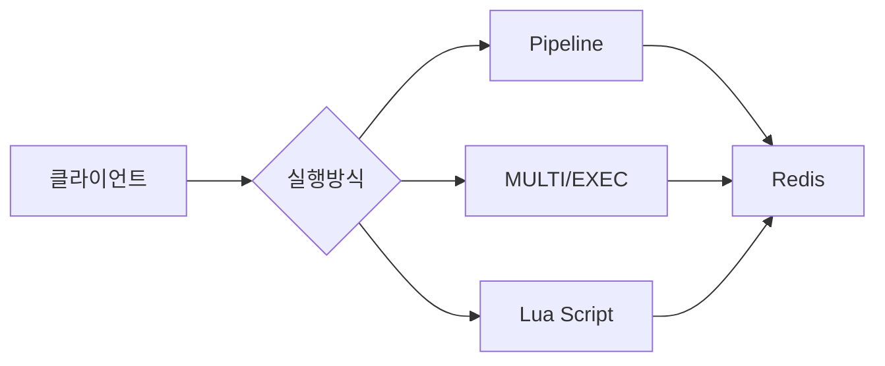
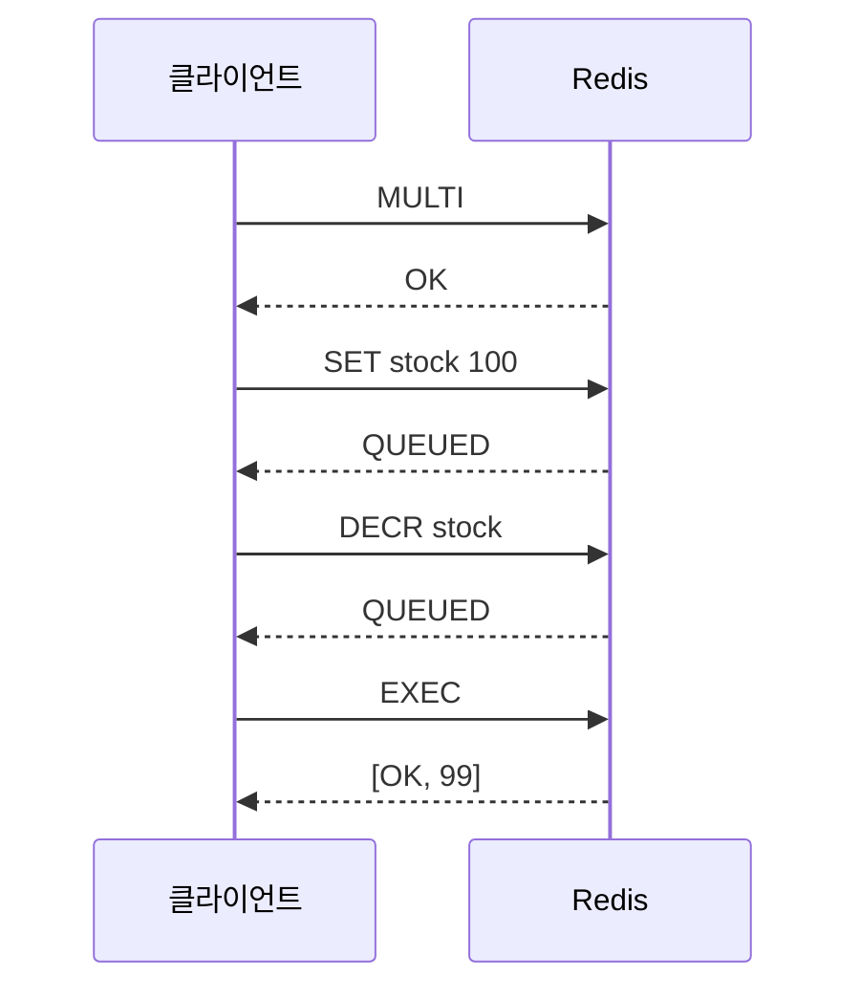
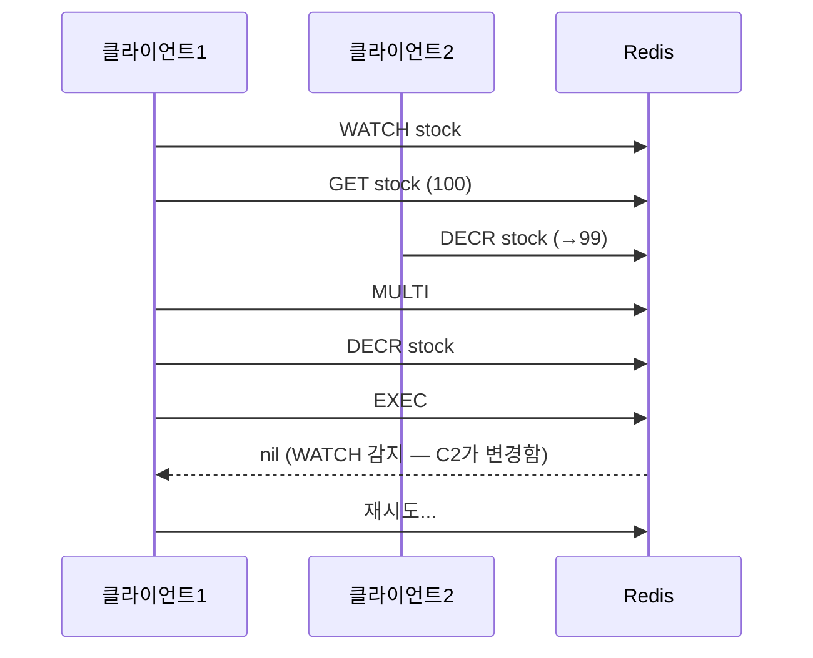

> **한 줄 요약**: Redis 트랜잭션(MULTI/EXEC)은 RDBMS처럼 롤백이 없고, 중간 명령 실패를 무시하고 계속 실행되므로, 원자성이 필요한 실무에서는 WATCH를 이용한 낙관적 락 또는 Lua 스크립트가 훨씬 안전하다.

## 실제 문제: Redis 트랜잭션을 RDBMS처럼 쓰다가 생긴 사고

2022년 국내 E 이커머스에서 선착순 쿠폰 발급 시스템을 Redis MULTI/EXEC로 구현했습니다. 쿠폰 수량을 DECR하고 사용자에게 쿠폰을 SADD하는 두 작업을 MULTI/EXEC로 묶었습니다. 팀은 "같은 트랜잭션이니까 하나가 실패하면 롤백될 것"이라고 믿었습니다.

현실은 달랐습니다. DECR은 성공했고 SADD는 타입 오류로 실패했습니다. Redis는 실패한 SADD를 무시하고 EXEC를 완료했습니다. 결과: 쿠폰 수량은 100개 줄었지만 사용자에게는 발급되지 않았습니다. 100명이 쿠폰 화면에서 "발급 완료" 메시지를 보았지만 실제 쿠폰은 없었습니다. CS 폭발, 수동 복구에 3일이 걸렸습니다.

**Redis 트랜잭션은 RDBMS 트랜잭션이 아닙니다.** 이 차이를 이해하는 것이 이 포스트의 핵심입니다.

Redis 트랜잭션이 해결해야 할 핵심 문제:
- **부분 실패 처리**: MULTI/EXEC 중 일부 명령 실패 시 어떻게 되는가
- **동시성 제어**: 여러 클라이언트가 같은 키를 동시에 수정하면 어떻게 되는가
- **원자성 보장 수준**: 진짜 원자적 연산이 필요하면 어떻게 하는가
- **클러스터 제약**: 트랜잭션이 여러 노드에 걸친 키에는 어떻게 동작하는가

---

## 설계 의사결정 로드맵

Redis에서 "여러 명령을 안전하게 묶어 실행"하는 방법 선택 시 순서대로 답해야 할 핵심 결정 4가지입니다.

### 결정 1: 배치 전송 vs 원자적 실행 — Pipeline vs MULTI/EXEC

**문제**: 10개의 Redis 명령을 실행할 때, 10번의 네트워크 왕복을 줄이고 싶은가? 아니면 10개가 중간에 끊기지 않고 실행되길 보장하고 싶은가?

| 후보 | 목적 | 원자성 | 롤백 | 언제 적합 |
|------|------|------|------|----------|
| Pipeline | 네트워크 왕복 최소화 (성능) | **없음** | 없음 | 독립 명령들을 묶어 빠르게 전송 |
| MULTI/EXEC | 명령 큐잉 후 일괄 실행 | **부분적** (명령 간 끼어들기 방지) | **없음** | 중간에 다른 클라이언트가 끼어드는 것 방지 |
| Lua Script | 서버 측 원자적 실행 | **완전** (실행 중 다른 명령 차단) | **없음** | 읽기-수정-쓰기 패턴, 조건부 원자 실행 |

**우리의 선택: 목적에 따라 분리**
- 성능만 필요하면 Pipeline
- 다른 클라이언트 끼어들기 방지가 필요하면 MULTI/EXEC + WATCH
- 진짜 원자적 실행이 필요하면 Lua Script
- 안 하면: Pipeline을 원자성 있다고 착각하거나, MULTI/EXEC가 롤백된다고 착각합니다.

### 결정 2: 동시성 제어 — 낙관적 락 vs 비관적 락

**문제**: 재고 10개를 동시에 100명이 감소 요청할 때, 어떻게 -10 이하로 내려가는 것을 막는가?

| 후보 | 동작 방식 | 충돌 시 | 언제 적합 |
|------|---------|--------|----------|
| WATCH (낙관적 락) | 감시 후 변경 감지 시 EXEC 취소 | 재시도 필요 | 충돌이 드문 경우 |
| SETNX 분산 락 (비관적 락) | 락 획득 후 독점 실행 | 대기 또는 실패 | 충돌이 잦은 경우 |
| Lua Script (원자적) | 조건 체크 + 변경을 원자적 실행 | 조건 미충족 시 즉시 실패 | 단순 조건부 연산 |

**우리의 선택: Lua Script (재고 차감처럼 단순한 경우)**
- 이유: `IF stock > 0 THEN DECR stock END`를 Lua로 원자적으로 실행합니다. WATCH 재시도 복잡도도 없고, 분산 락 관리도 없습니다.
- 안 하면: WATCH로 낙관적 락을 구현하면 충돌 빈도가 높을 때 무한 재시도가 발생합니다.

### 결정 3: 롤백 필요 여부 — Redis vs RDBMS 선택

**문제**: 쿠폰 발급처럼 "A가 성공하면 B도 반드시 성공해야 하고, B가 실패하면 A도 취소되어야 한다"는 요구사항에 Redis 트랜잭션을 쓸 수 있는가?

| 후보 | 롤백 지원 | 적합 여부 |
|------|---------|---------|
| Redis MULTI/EXEC | **없음** | 부적합 |
| Redis Lua Script | **없음** | 부적합 |
| RDBMS 트랜잭션 | **있음** | 적합 |
| Redis + 보상 트랜잭션 | 수동 구현 | 복잡하지만 가능 |

**우리의 선택: 롤백이 필요하면 RDBMS 사용**
- 이유: Redis는 롤백을 지원하지 않습니다. 철학적으로도 Redis는 "빠른 캐시/세마포어/카운터"를 위한 도구이며, 복잡한 일관성 보장은 RDBMS의 역할입니다.
- 안 하면: MULTI/EXEC로 롤백을 기대하면 위 사고 사례처럼 데이터 불일치가 발생합니다.

### 결정 4: 클러스터 환경 — 단일 슬롯 제약

**문제**: Redis Cluster에서 MULTI/EXEC로 여러 키를 트랜잭션으로 묶을 수 있는가?

| 상황 | 가능 여부 | 이유 |
|------|---------|------|
| 같은 슬롯의 키들 | 가능 | 동일 노드에 있음 |
| 다른 슬롯의 키들 | **불가 (CROSSSLOT 오류)** | 다른 노드에 분산 |
| Hash Tag로 강제 동일 슬롯 | 가능 | `{user:123}:stock` 형태 |

**우리의 선택: Hash Tag로 관련 키를 동일 슬롯에 배치**
- 이유: `{order:456}:stock`, `{order:456}:coupon`처럼 Hash Tag를 사용하면 같은 슬롯에 배치됩니다. 같은 슬롯이면 MULTI/EXEC와 Lua Script 모두 동작합니다.
- 안 하면: 클러스터에서 `MULTI; SET key1; SET key2; EXEC` 실행 시 key1과 key2가 다른 슬롯이면 CROSSSLOT 오류가 발생합니다.

---

## 1. 요구사항 분석 및 규모 추정

### 기능 요구사항

1️⃣ **원자적 카운터**: 재고 차감, 쿠폰 발급 수량 관리 — 동시 요청 시 정확한 차감
2️⃣ **조건부 업데이트**: 잔액이 충분할 때만 차감, 재고가 있을 때만 예약
3️⃣ **배치 명령 전송**: 여러 키를 한 번의 네트워크로 설정/조회
4️⃣ **충돌 감지**: 다른 클라이언트가 같은 키를 수정했는지 감지

### 비기능 요구사항

- **원자성**: 재고 체크 → 차감이 원자적으로 실행되어야 함
- **성능**: 배치 명령은 Pipeline으로 네트워크 왕복 최소화
- **클러스터 호환**: Redis Cluster에서도 동작해야 함

### 규모 추정

```
선착순 이벤트 동시 요청: 10,000 QPS
재고 차감 원자적 처리: Lua Script 1개로 처리
충돌 확률 (WATCH 기준): 10,000 QPS × 공유 키 = 매우 높음
→ WATCH보다 Lua Script가 필수

Pipeline 효과:
  단건 10개 명령: 10 × 1ms = 10ms
  Pipeline 10개: 1ms (네트워크 1회)
  10배 성능 개선
```

---

## 2. 고수준 아키텍처

> **비유:** Redis 트랜잭션을 이해하려면 레스토랑 주방을 떠올리세요. Pipeline은 "주문서를 한 번에 몰아서 주방에 전달"하는 것입니다. MULTI/EXEC는 "이 메뉴들은 순서대로 묶어서 요리하되, 중간에 다른 주문이 끼어들지 못하게" 하는 것입니다. Lua Script는 "주방장이 레시피를 보고 혼자 처음부터 끝까지 완성"하는 것입니다.



### 핵심 개념 비교

**Pipeline**: 여러 명령을 버퍼에 모아 한 번에 서버로 전송합니다. 서버는 순서대로 실행하고 결과를 모아 반환합니다. 원자성이 없습니다. 중간에 다른 클라이언트 명령이 끼어들 수 있습니다.

**MULTI/EXEC**: `MULTI` 선언 후 명령들을 큐에 적재하고, `EXEC` 호출 시 한 번에 실행합니다. 실행 중 다른 클라이언트 명령이 끼어들지 않습니다. 단, 개별 명령 실패 시 **롤백 없이 계속 실행**됩니다.

**Lua Script**: 서버에서 Lua 코드를 실행합니다. 실행 중 다른 Redis 명령이 완전히 차단됩니다. 가장 강한 원자성을 제공합니다. 단, 마찬가지로 롤백 없습니다.

---

## 3. MULTI/EXEC — 동작원리와 함정

> **비유:** MULTI/EXEC는 "장보기 목록 작성 후 한 번에 구매"와 같습니다. MULTI를 선언하면 장보기 목록(큐)이 열립니다. 이후 명령들은 즉시 실행되지 않고 목록에 추가됩니다. EXEC를 호출하면 목록의 모든 항목을 한 번에 처리합니다. 목록 작성 중에는 다른 손님이 같은 상품을 가져가도 알 수 없습니다.

### 동작 원리

```
1. MULTI       → 큐 모드 시작
2. SET k1 v1   → 큐에 적재 (QUEUED 반환, 실행 안 됨)
3. INCR k2     → 큐에 적재
4. SET k3 v3   → 큐에 적재
5. EXEC        → 큐의 명령 순서대로 원자적 실행
```



### MULTI/EXEC의 핵심 함정: 롤백이 없다

Redis 트랜잭션에는 두 가지 오류가 있습니다. 처리 방식이 완전히 다릅니다.

**오류 유형 1 — 큐잉 시 문법 오류**: EXEC 실행 전에 이미 감지됩니다. 이 경우 EXEC 시 전체가 실행되지 않습니다.

```
MULTI
SET key1 val1    → QUEUED
NOTACOMMAND      → ERROR (문법 오류 감지)
SET key2 val2    → QUEUED
EXEC             → (nil) — 전체 취소
```

**오류 유형 2 — 실행 시 타입 오류**: EXEC 실행 중 발생합니다. **실패한 명령만 오류, 나머지는 정상 실행됩니다. 롤백 없음.**

```python
import redis
r = redis.Redis()

# 의도적 오류 시나리오
r.set("mystr", "hello")  # 문자열 설정

r.multi_exec = r.pipeline(transaction=True)
pipe = r.pipeline(transaction=True)
pipe.set("key1", "value1")      # 정상
pipe.incr("mystr")               # 오류! 문자열에 INCR 불가
pipe.set("key2", "value2")      # 정상
results = pipe.execute(raise_on_error=False)

# results: ['OK', ResponseError('...not an integer'), 'OK']
# key1, key2는 저장됨. mystr INCR만 실패.
# RDBMS처럼 롤백되지 않음!
print(r.get("key1"))  # b'value1' — 저장됨
print(r.get("key2"))  # b'value2' — 저장됨
```

이것이 Redis가 "RDBMS 트랜잭션과 다르다"는 핵심입니다. Redis 철학은 "개발자가 타입 오류를 만들지 않는 것이 올바른 프로그래밍이며, 이는 프로덕션에서 발생해선 안 되는 프로그래밍 오류다"입니다. 따라서 타입 오류에 대한 롤백을 지원하지 않습니다.

### DISCARD — 트랜잭션 취소

EXEC 대신 DISCARD를 호출하면 큐를 비우고 트랜잭션을 취소합니다.

```python
pipe = r.pipeline(transaction=True)
pipe.set("key1", "value1")
pipe.set("key2", "value2")
# 조건 확인 후 취소 결정
pipe.reset()  # DISCARD와 동일
```

---

## 4. WATCH — 낙관적 락으로 경쟁 조건 방지

> **비유:** 두 사람이 같은 Google 문서를 동시에 편집할 때 "마지막으로 저장한 사람이 이기는" 문제가 있습니다. WATCH는 이를 해결하는 낙관적 락입니다. "내가 읽은 후 변경되면 내 작업을 취소해줘"라고 Redis에게 요청합니다. 충돌이 감지되면 처음부터 다시 시도합니다.

### WATCH 동작 원리

WATCH로 키를 감시하고, MULTI/EXEC 사이에 그 키가 다른 클라이언트에 의해 변경되면 EXEC가 nil을 반환하고 트랜잭션이 취소됩니다.



### CAS (Check-And-Set) 패턴 구현

```python
import redis
import time

r = redis.Redis()

def decrement_stock_with_watch(product_id: str, quantity: int) -> bool:
    stock_key = f"stock:{product_id}"
    max_retries = 5

    for attempt in range(max_retries):
        try:
            # 1. WATCH 설정 (이 키가 변경되면 EXEC 취소)
            with r.pipeline() as pipe:
                pipe.watch(stock_key)

                # 2. 현재 재고 조회 (WATCH 감시 중)
                current_stock = int(pipe.get(stock_key) or 0)

                if current_stock < quantity:
                    pipe.unwatch()
                    return False  # 재고 부족

                # 3. MULTI 시작 (큐 모드)
                pipe.multi()
                pipe.decrby(stock_key, quantity)

                # 4. EXEC (WATCH 이후 변경 없으면 성공, 있으면 None 반환)
                pipe.execute()
                return True  # 성공

        except redis.WatchError:
            # 다른 클라이언트가 stock_key를 변경 → 재시도
            if attempt == max_retries - 1:
                raise Exception("재고 차감 재시도 한도 초과")
            time.sleep(0.01 * (2 ** attempt))  # 지수 백오프
            continue

    return False
```

### WATCH의 한계 — 충돌 빈도가 높을 때

WATCH는 낙관적 락입니다. 충돌이 드물 때 효율적입니다. 선착순 이벤트처럼 동시에 수천 명이 같은 키를 수정하면, 대부분의 요청이 WATCH 충돌로 재시도를 반복합니다. 최악의 경우 활성 대기(busy-waiting)로 성능이 오히려 나빠집니다.

충돌 빈도가 높은 경우에는 WATCH 대신 Lua Script를 사용합니다.

---

## 5. Pipeline vs MULTI/EXEC — 혼동하기 쉬운 차이

> **비유:** Pipeline은 "편지 10통을 묶어서 한 번에 우체통에 넣는 것"입니다. 빠르게 전달되지만, 각 편지는 도착 후 개별 처리됩니다. 중간에 다른 편지가 끼어들 수 있습니다. MULTI/EXEC는 "10통을 묶어서 우체부가 도착 시 순서대로 10통을 연속으로 처리하고, 그 동안 다른 편지는 잠시 기다리게 하는 것"입니다.

### 핵심 차이

| 항목 | Pipeline | MULTI/EXEC |
|------|---------|-----------|
| 목적 | 네트워크 왕복 감소 (성능) | 명령 간 끼어들기 방지 |
| 원자성 | **없음** (명령 간 다른 클라이언트 끼어들기 가능) | **부분적** (실행 중 끼어들기 방지) |
| 롤백 | 없음 | 없음 |
| 에러 처리 | 각 명령 독립적 오류 | 개별 명령 오류 무시, 나머지 실행 |
| 응답 수신 | 모든 명령 완료 후 한 번에 | EXEC 후 한 번에 |

### Pipeline 코드

```python
# Pipeline — 성능 최적화용
pipe = r.pipeline(transaction=False)  # 주의: transaction=False가 순수 Pipeline
pipe.set("key1", "val1")
pipe.set("key2", "val2")
pipe.set("key3", "val3")
results = pipe.execute()
# 3개 명령이 1번의 네트워크 왕복으로 전송
# 실행 중 다른 클라이언트 명령이 끼어들 수 있음

# MULTI/EXEC — 원자적 실행용
pipe = r.pipeline(transaction=True)  # transaction=True = MULTI/EXEC
pipe.set("key1", "val1")
pipe.set("key2", "val2")
pipe.set("key3", "val3")
results = pipe.execute()
# MULTI → QUEUED × 3 → EXEC
# 실행 중 다른 클라이언트 명령이 끼어들 수 없음
```

### 언제 Pipeline, 언제 MULTI/EXEC?

**Pipeline만으로 충분한 경우**: 독립적인 키들을 일괄 설정/조회할 때입니다. 예를 들어 사용자 프로필 여러 항목을 한 번에 캐시에 저장합니다. 명령 간에 의존성이 없고, 다른 클라이언트가 끼어들어도 무방합니다.

**MULTI/EXEC가 필요한 경우**: 여러 키의 값을 하나의 논리적 단위로 변경하고, 변경 도중 다른 클라이언트가 그 키들을 보면 안 되는 경우입니다. 예를 들어 사용자 A에서 사용자 B로 포인트를 이전할 때, 중간 상태(A에서만 차감됐고 B에는 아직 추가 안 된 상태)를 다른 클라이언트가 보면 안 됩니다.

실무에서 단순 성능 최적화에는 Pipeline, 중간 상태 방지가 필요하면 MULTI/EXEC + WATCH, 조건부 원자 실행에는 Lua Script를 사용합니다.

---

## 6. Lua Script — 진짜 원자성 보장

> **비유:** MULTI/EXEC가 "여러 셰프가 각자 요리하되 다른 주문이 끼어들지 못하게 막는 것"이라면, Lua Script는 "주방장 한 명이 레시피 전체를 혼자 처음부터 끝까지 만드는 것"입니다. 레시피 실행 중에는 다른 요리가 일절 진행되지 않습니다.

### Lua Script가 제공하는 원자성

Lua Script 실행 중에는 Redis가 다른 클라이언트의 명령을 받지 않습니다. Redis는 단일 스레드이기 때문에 Lua 실행이 끝날 때까지 다른 명령은 큐에서 대기합니다. 이것이 MULTI/EXEC보다 강한 원자성입니다.

- **MULTI/EXEC**: 큐잉된 명령들을 연속 실행. 실행 사이에 다른 명령이 끼어들지 못함. 단, 각 명령은 서버에서 개별 실행됨.
- **Lua Script**: 전체 스크립트가 하나의 Redis 명령처럼 실행됨. 중간에 어떤 명령도 끼어들지 못함.

### 재고 차감 Lua Script

```python
import redis

r = redis.Redis()

# Lua Script 정의
DECREMENT_STOCK_SCRIPT = """
local stock_key = KEYS[1]
local quantity = tonumber(ARGV[1])

-- 현재 재고 조회
local current = tonumber(redis.call('GET', stock_key))

if current == nil then
    return {err = 'stock_key_not_found'}
end

if current < quantity then
    return {err = 'insufficient_stock'}
end

-- 원자적으로 재고 차감
local new_stock = redis.call('DECRBY', stock_key, quantity)
return new_stock
"""

# 스크립트 사전 등록 (SHA 캐싱)
script = r.register_script(DECREMENT_STOCK_SCRIPT)

def decrement_stock_lua(product_id: str, quantity: int) -> int:
    try:
        result = script(
            keys=[f"stock:{product_id}"],
            args=[quantity]
        )
        return result  # 남은 재고 반환
    except redis.ResponseError as e:
        if "insufficient_stock" in str(e):
            raise ValueError("재고 부족")
        if "stock_key_not_found" in str(e):
            raise ValueError("재고 키 없음")
        raise
```

### 쿠폰 발급 Lua Script — 수량 차감 + 사용자 기록 원자적 처리

```lua
-- KEYS[1]: 쿠폰 수량 키
-- KEYS[2]: 발급된 사용자 집합 키
-- ARGV[1]: 사용자 ID
-- ARGV[2]: 발급 가능 최대 수량

local coupon_count_key = KEYS[1]
local issued_users_key = KEYS[2]
local user_id = ARGV[1]
local max_count = tonumber(ARGV[2])

-- 1. 이미 발급받았는지 확인
local already_issued = redis.call('SISMEMBER', issued_users_key, user_id)
if already_issued == 1 then
    return {err = 'already_issued'}
end

-- 2. 남은 수량 확인
local remaining = tonumber(redis.call('GET', coupon_count_key))
if remaining == nil or remaining <= 0 then
    return {err = 'coupon_exhausted'}
end

-- 3. 수량 차감 + 사용자 기록 (원자적)
redis.call('DECR', coupon_count_key)
redis.call('SADD', issued_users_key, user_id)

return remaining - 1  -- 남은 쿠폰 수
```

```python
COUPON_ISSUE_SCRIPT = """...(위 Lua 코드)..."""

coupon_script = r.register_script(COUPON_ISSUE_SCRIPT)

def issue_coupon(coupon_id: str, user_id: str, max_count: int) -> int:
    try:
        remaining = coupon_script(
            keys=[f"coupon:count:{coupon_id}",
                  f"coupon:issued:{coupon_id}"],
            args=[user_id, max_count]
        )
        return remaining
    except redis.ResponseError as e:
        if "already_issued" in str(e):
            raise ValueError("이미 발급받은 쿠폰입니다")
        if "coupon_exhausted" in str(e):
            raise ValueError("쿠폰이 모두 소진됐습니다")
        raise
```

### MULTI/EXEC vs Lua Script 비교

| 항목 | MULTI/EXEC | Lua Script |
|------|-----------|-----------|
| 원자성 수준 | 중간 (실행 중 끼어들기 방지) | 강함 (전체 서버 블록) |
| 조건부 로직 | **불가** (큐잉 시점에 결과 모름) | **가능** (if/else 지원) |
| 롤백 | 없음 | 없음 |
| 읽기 후 조건 분기 | WATCH 조합 필요 | 스크립트 내 처리 가능 |
| 성능 | 양호 | 스크립트 길면 서버 블록 주의 |
| 디버깅 | 쉬움 | 어려움 (서버에서 실행) |
| 클러스터 | 동일 슬롯 키만 가능 | 동일 슬롯 키만 가능 |

**Lua Script 주의사항**: 실행 시간이 긴 Lua Script는 Redis 전체를 블록합니다. 스크립트 안에서 루프로 대량 데이터를 처리하거나, 외부 호출을 하거나, sleep을 쓰면 안 됩니다. Lua Script는 수 밀리초 이내에 완료되도록 짧게 유지합니다.

---

## 7. Redis는 롤백이 없다 — RDBMS와의 근본적 차이

> **비유:** RDBMS 트랜잭션은 "연필로 쓴 장부"입니다. 실수하면 지우개로 지울 수 있습니다. Redis 트랜잭션은 "볼펜으로 쓴 장부"입니다. 잘못 쓰면 줄을 긋고 다시 써야 합니다. 지우는 게 아니라 수정 항목을 추가합니다.

### 롤백이 없는 철학적 이유

Redis 공식 문서에 명시된 이유입니다.

1. **Redis 오류는 프로그래밍 오류다**: 타입 불일치, 잘못된 명령 수 등은 개발자의 실수입니다. 프로덕션에서는 발생해서는 안 됩니다. 따라서 롤백을 지원해야 할 이유가 없다고 봅니다.

2. **단순성과 성능**: 롤백 지원은 복잡도와 비용을 크게 높입니다. Redis는 단순함과 성능을 최우선으로 합니다.

3. **롤백이 버그를 숨긴다**: RDBMS에서 롤백은 프로그래밍 오류를 은폐합니다. Redis는 오류가 명시적으로 드러나도록 합니다.

### RDBMS vs Redis 트랜잭션 비교

| 항목 | RDBMS (PostgreSQL) | Redis MULTI/EXEC |
|------|------------------|----------------|
| 원자성 (Atomicity) | 완전 (모두 성공 또는 모두 실패) | **부분적** (오류 명령 건너뜀) |
| 일관성 (Consistency) | 제약조건 위반 시 전체 롤백 | **없음** |
| 격리성 (Isolation) | READ COMMITTED 등 레벨 지원 | **직렬화** (실행 중 다른 명령 차단) |
| 지속성 (Durability) | WAL로 보장 | AOF 설정에 따라 다름 |
| 롤백 | **지원** | **미지원** |
| 중첩 트랜잭션 | 지원 (SAVEPOINT) | **미지원** |

### 롤백이 필요한 경우 어떻게 하는가

Redis만으로 롤백이 필요한 작업을 처리해야 한다면, **보상 트랜잭션**을 수동으로 구현합니다.

```python
def transfer_points(from_user: str, to_user: str, points: int):
    # Step 1: from_user 차감
    pipe = r.pipeline(transaction=True)
    pipe.watch(f"points:{from_user}")
    current = int(r.get(f"points:{from_user}") or 0)

    if current < points:
        pipe.unwatch()
        raise ValueError("포인트 부족")

    pipe.multi()
    pipe.decrby(f"points:{from_user}", points)
    try:
        pipe.execute()
    except redis.WatchError:
        raise RetryException("충돌 발생, 재시도 필요")

    # Step 2: to_user 추가
    try:
        r.incrby(f"points:{to_user}", points)
    except Exception as e:
        # Step 2 실패 → 보상 트랜잭션: from_user 복원
        r.incrby(f"points:{from_user}", points)
        raise Exception(f"이전 실패, 복원 완료: {e}")
```

하지만 이 패턴은 복잡하고 보상 트랜잭션 자체가 실패할 수 있습니다. **포인트 이전처럼 롤백이 필수인 작업은 RDBMS를 사용하는 것이 올바른 선택입니다.**

---

## 8. Spring Data Redis에서의 사용법

```java
@Service
public class RedisTransactionService {

    @Autowired
    private StringRedisTemplate redisTemplate;

    // MULTI/EXEC 사용
    public void executeTransaction() {
        redisTemplate.execute(new SessionCallback<List<Object>>() {
            @Override
            public List<Object> execute(RedisOperations operations)
                    throws DataAccessException {
                operations.multi();  // MULTI

                operations.opsForValue().set("key1", "val1");
                operations.opsForValue().increment("counter");
                operations.opsForSet().add("myset", "member1");

                return operations.exec();  // EXEC
            }
        });
    }

    // WATCH + MULTI/EXEC (낙관적 락)
    public boolean decrementWithWatch(String stockKey, int quantity) {
        return redisTemplate.execute(new SessionCallback<Boolean>() {
            @Override
            public Boolean execute(RedisOperations operations)
                    throws DataAccessException {
                operations.watch(stockKey);  // WATCH

                Integer current = (Integer) operations.opsForValue().get(stockKey);
                if (current == null || current < quantity) {
                    operations.unwatch();
                    return false;
                }

                operations.multi();  // MULTI
                operations.opsForValue().decrement(stockKey, quantity);

                List<Object> results = operations.exec();  // EXEC
                return results != null && !results.isEmpty();
                // null이면 WATCH 충돌
            }
        });
    }

    // Lua Script 실행
    private static final DefaultRedisScript<Long> DECR_SCRIPT;

    static {
        DECR_SCRIPT = new DefaultRedisScript<>();
        DECR_SCRIPT.setScriptText(
            "local cur = tonumber(redis.call('GET', KEYS[1])) " +
            "if cur >= tonumber(ARGV[1]) then " +
            "  return redis.call('DECRBY', KEYS[1], ARGV[1]) " +
            "else return -1 end"
        );
        DECR_SCRIPT.setResultType(Long.class);
    }

    public long decrementStock(String productId, int quantity) {
        Long result = redisTemplate.execute(
            DECR_SCRIPT,
            Collections.singletonList("stock:" + productId),
            String.valueOf(quantity)
        );
        return result != null ? result : -1;
    }
}
```

### @Transactional과 Redis 트랜잭션

Spring의 `@Transactional`은 RDBMS 트랜잭션용입니다. Redis에서 `@Transactional`을 사용하려면 `redisTemplate.setEnableTransactionSupport(true)`를 설정해야 하는데, 이 경우 `@Transactional` 메서드 내의 Redis 명령이 MULTI/EXEC로 자동 래핑됩니다. 단, 이 모드에서는 읽기 명령의 결과를 즉시 사용할 수 없습니다(큐잉되므로). 실무에서는 자동 래핑보다 명시적 SessionCallback 방식이 더 예측 가능합니다.

---

## 9. 클러스터 환경에서의 트랜잭션 제약

> **비유:** Redis Cluster는 데이터를 16,384개의 슬롯으로 나누어 여러 노드에 분산합니다. MULTI/EXEC는 한 노드 안에서만 동작합니다. 다른 노드에 있는 키를 같은 트랜잭션으로 처리하려는 것은 "서울 지점과 부산 지점의 장부를 동시에 한 직원이 수정하는 것"처럼 불가능합니다.

### CROSSSLOT 오류

```python
# 클러스터에서 다른 슬롯의 키를 MULTI/EXEC로 묶으면:
pipe = r.pipeline(transaction=True)
pipe.set("user:123", "alice")     # 슬롯 5474
pipe.set("product:456", "shirt")  # 슬롯 11900
pipe.execute()
# → ResponseError: CROSSSLOT Keys in request don't hash to the same slot
```

### Hash Tag로 같은 슬롯 강제

중괄호 `{}` 안의 문자열이 슬롯을 결정합니다. 같은 `{}` 내용이면 같은 슬롯에 배치됩니다.

```python
# Hash Tag 사용 — {order:456}이 슬롯을 결정
order_id = "456"
pipe = r.pipeline(transaction=True)
pipe.set(f"{{order:{order_id}}}:stock", 10)
pipe.set(f"{{order:{order_id}}}:status", "pending")
pipe.set(f"{{order:{order_id}}}:coupon", "COUP001")
pipe.execute()
# 세 키 모두 같은 슬롯 → MULTI/EXEC 성공
```

### 클러스터에서의 Lua Script

Lua Script도 동일한 제약이 있습니다. KEYS 배열의 모든 키가 같은 슬롯에 있어야 합니다.

```lua
-- 클러스터에서 안전한 Lua Script
-- KEYS[1]과 KEYS[2]가 반드시 같은 슬롯에 있어야 함
local count_key = KEYS[1]   -- {coupon:abc}:count
local users_key = KEYS[2]   -- {coupon:abc}:users
-- Hash Tag {coupon:abc}으로 같은 슬롯 보장
```

```python
# 클러스터 Lua Script 호출 시 키 명명 규칙
coupon_id = "summer2024"
script(
    keys=[f"{{coupon:{coupon_id}}}:count",
          f"{{coupon:{coupon_id}}}:users"],
    args=[user_id]
)
```

---

## 10. 극한 시나리오 3가지

### 시나리오 1: 선착순 이벤트 — 동시 10,000 요청에 재고 100개

**문제점**: 재고 100개 쿠폰을 선착순으로 발급합니다. 동시에 10,000명이 요청하면 WATCH를 쓸 경우 9,900명이 WATCH 충돌로 재시도합니다. 재시도가 반복되면서 Redis가 과부하됩니다. MULTI/EXEC만 쓰면 재고 체크와 차감이 원자적이지 않아 마이너스 재고가 발생합니다.

**대응 5단계**:
1. **Lua Script 사용**: `IF remaining > 0 THEN DECR, SADD END`를 원자적으로 실행해 동시성 문제를 완전 해결합니다
2. **이중 체크**: Redis Lua로 1차 차감, DB에 2차 검증 레코드를 비동기로 저장합니다
3. **요청 큐잉**: 피크 트래픽은 Redis List로 큐에 적재하고 워커가 순서대로 처리합니다
4. **레이트 리미팅**: 사용자당 요청 횟수를 제한해 투기적 재시도를 막습니다
5. **조기 차단**: 재고 소진 후에는 Lua Script 호출 전 `GET`으로 먼저 확인해 서버 부하를 줄입니다

### 시나리오 2: MULTI/EXEC 중 Redis Master 장애

**문제점**: MULTI를 선언하고 명령을 큐잉하는 도중 Redis Master가 다운됩니다. Sentinel이 Replica를 Master로 승격시키지만, 새 Master에는 아직 큐잉된 명령이 없습니다. EXEC를 호출하면 오류가 발생합니다.

**대응 5단계**:
1. **EXEC 응답 확인**: `execute()` 반환값이 nil이거나 예외 발생 시 전체 작업을 재시도합니다
2. **멱등 설계**: 트랜잭션 내 작업을 멱등하게 설계해 재시도 시 중복 처리가 없도록 합니다
3. **Sentinel 페일오버 시간 최소화**: `min-slaves-to-write 1`, `min-slaves-max-lag 10`으로 설정합니다
4. **클라이언트 재연결 처리**: Redis 클라이언트 라이브러리의 자동 재연결 + 재시도 설정을 확인합니다
5. **애플리케이션 레벨 멱등성 키**: 트랜잭션에 고유 ID를 부여하고 재시도 시 중복 실행을 방지합니다

### 시나리오 3: Lua Script가 무한 루프로 Redis 블록

**문제점**: 개발자가 실수로 Lua Script 안에 `while true do ... end` 루프를 작성했습니다. Redis가 단일 스레드이므로 Lua 실행 중 모든 다른 요청이 블록됩니다. 서비스 전체가 응답 불가가 됩니다.

**대응 5단계**:
1. **즉시 대응**: `redis-cli SCRIPT KILL` 명령으로 실행 중인 Lua Script를 강제 종료합니다 (단, 이미 쓰기를 수행했으면 SCRIPT KILL 불가 → SHUTDOWN NOSAVE 필요)
2. **Lua Script 실행 시간 제한**: `lua-time-limit 5000` (기본 5초)으로 Lua Script 최대 실행 시간을 설정합니다
3. **코드 리뷰 강화**: Lua Script는 반드시 루프 횟수를 상한으로 제한하고 PR 리뷰에서 확인합니다
4. **스테이징 환경 부하 테스트**: 프로덕션 배포 전 동시 요청으로 Lua Script 실행 시간을 측정합니다
5. **SCRIPT LOAD 사전 검증**: `SCRIPT LOAD` 후 `EVALSHA`로 실행해 문법 오류를 사전에 감지합니다

---

## 11. 면접 포인트 5가지

### 면접 포인트 1️⃣ Redis MULTI/EXEC는 RDBMS 트랜잭션과 어떻게 다른가?

세 가지 핵심 차이가 있습니다.

**롤백 없음**: RDBMS는 트랜잭션 중 오류 발생 시 모든 변경이 롤백됩니다. Redis는 타입 오류 등 실행 시 오류가 발생해도 해당 명령만 건너뛰고 나머지는 실행됩니다. "다 되거나 다 안 되는" 원자성이 없습니다.

**조건부 분기 불가**: RDBMS에서는 트랜잭션 안에서 SELECT 결과를 보고 UPDATE 여부를 결정할 수 있습니다. MULTI/EXEC에서는 EXEC 전에는 결과를 알 수 없어서 조건 분기가 불가능합니다. WATCH로 우회하거나 Lua Script를 사용합니다.

**격리 수준**: RDBMS는 READ COMMITTED, REPEATABLE READ 등 격리 수준을 선택합니다. Redis MULTI/EXEC는 실행 중 다른 클라이언트를 완전 차단하는 직렬화만 있습니다.

### 면접 포인트 2️⃣ Pipeline과 MULTI/EXEC의 차이는?

Pipeline은 **성능 최적화**가 목적입니다. 여러 명령을 네트워크 버퍼에 모아 한 번에 전송합니다. 서버에서는 명령을 순서대로 실행하지만, 실행 중 다른 클라이언트 명령이 끼어들 수 있습니다. 원자성이 없습니다.

MULTI/EXEC는 **원자적 실행**이 목적입니다. MULTI 이후 명령들은 큐에 적재됩니다. EXEC 시 큐의 명령들을 연속으로 실행하고, 이 동안 다른 클라이언트 명령이 끼어들지 않습니다. 단, 롤백은 없습니다.

"독립적인 키 100개를 빠르게 설정"하면 Pipeline, "두 키를 동시에 업데이트하고 중간 상태를 노출하지 않으려면" MULTI/EXEC입니다.

### 면접 포인트 3️⃣ WATCH는 어떻게 동작하고 한계는?

WATCH는 낙관적 락입니다. `WATCH key1 key2`를 선언하면 Redis가 해당 키들을 감시합니다. MULTI~EXEC 사이에 감시 중인 키가 다른 클라이언트에 의해 변경되면 EXEC가 nil을 반환하고 트랜잭션이 취소됩니다. 클라이언트는 재시도합니다.

한계는 충돌이 잦을 때입니다. 선착순 이벤트처럼 수천 명이 같은 키를 동시에 수정하면 대부분이 WATCH 충돌로 재시도합니다. 재시도가 더 많은 충돌을 만들고 성능이 급락합니다. 이 경우 Lua Script가 훨씬 효율적입니다.

### 면접 포인트 4️⃣ Lua Script의 원자성은 MULTI/EXEC보다 강한가?

강합니다. 이유는 Redis의 단일 스레드 특성 때문입니다.

MULTI/EXEC는 큐잉된 명령들을 서버에서 순차적으로 실행합니다. 각 명령 사이에 다른 클라이언트 명령이 끼어들 수 있을까요? 실제로는 Redis가 EXEC를 받으면 큐 전체를 연속으로 처리해 끼어들지 못합니다. 하지만 EXEC 처리 자체가 단일 명령이 아닌 루프이기 때문에 이론적 경계가 있습니다.

Lua Script는 Redis 서버에서 Lua 인터프리터가 통째로 실행됩니다. Redis 이벤트 루프에서 단 하나의 명령으로 처리됩니다. 실행 중에는 이벤트 루프가 다른 클라이언트 요청을 처리하지 않습니다. 이것이 완전한 원자성입니다.

단, 두 방식 모두 롤백은 지원하지 않습니다.

### 면접 포인트 5️⃣ Redis Cluster에서 MULTI/EXEC 사용 시 주의사항은?

Redis Cluster는 키를 CRC16 해시로 16,384개 슬롯 중 하나에 배치하고, 슬롯을 여러 노드에 분산합니다. MULTI/EXEC는 단일 노드에서만 동작합니다.

따라서 MULTI/EXEC로 묶는 키들이 모두 같은 슬롯에 있어야 합니다. 다른 슬롯에 있으면 `CROSSSLOT` 오류가 발생합니다.

해결책은 Hash Tag입니다. `{order:456}:stock`처럼 중괄호 안의 문자열이 슬롯을 결정합니다. 관련 키들을 같은 Hash Tag로 묶으면 같은 슬롯에 배치됩니다.

단, Hash Tag를 남용하면 특정 슬롯에 데이터가 집중되어 클러스터의 부하 분산 이점이 사라집니다. 관련성이 높은 키끼리만 Hash Tag로 묶어야 합니다.

---

## 12. 실무 실수 Top 5

### 실수 1: MULTI/EXEC가 롤백된다는 착각

가장 위험한 착각입니다. MULTI/EXEC 중 한 명령이 실패해도 나머지는 실행됩니다. 결제나 쿠폰 발급처럼 "A와 B가 반드시 함께 성공해야 하는" 작업에 MULTI/EXEC를 쓰면 반드시 불일치가 발생합니다. 롤백이 필요하면 RDBMS를 사용합니다.

### 실수 2: WATCH를 고빈도 공유 키에 사용

WATCH는 낙관적 락입니다. 선착순 이벤트처럼 수천 명이 같은 키를 동시에 수정하면, 대부분이 WATCH 충돌로 재시도합니다. 재시도가 재시도를 만들고 Redis는 폭주합니다. 고빈도 공유 키에는 Lua Script가 올바른 선택입니다.

### 실수 3: Pipeline을 원자적이라고 착각

Pipeline은 네트워크 성능 최적화 도구입니다. `transaction=False`로 생성한 Pipeline은 원자성이 없습니다. 실행 중 다른 클라이언트 명령이 사이에 끼어들 수 있습니다. 원자성이 필요하면 `transaction=True`(MULTI/EXEC)를 사용합니다.

### 실수 4: 긴 Lua Script로 Redis 블록

Lua Script 실행 중 Redis는 다른 요청을 처리하지 않습니다. 데이터 전처리, 집계, 루프를 Lua Script에 넣으면 수십~수백ms 동안 Redis 전체가 멈춥니다. Lua Script는 단순한 조건 체크와 1~3개의 Redis 명령만 실행하도록 최소화합니다.

### 실수 5: 클러스터에서 CROSSSLOT 오류 대응 미흡

개발 환경에서는 Standalone Redis라 잘 되다가, 프로덕션 Redis Cluster에 배포하면 CROSSSLOT 오류가 터집니다. 개발 시작부터 Hash Tag 명명 규칙을 정하고, 트랜잭션에 묶이는 키들은 같은 Hash Tag를 사용하도록 규약을 만들어야 합니다.

---

## 13. Phase별 진화

### Phase 1 — MVP (월 ~5만원)

Standalone Redis, MULTI/EXEC와 Lua Script 기초 사용.
- Redis Standalone (cache.t3.micro): 월 $15
- 기본 MULTI/EXEC로 관련 키 묶음 처리
- 선착순 발급에 Lua Script 적용

### Phase 2 — 성장기 (월 ~20만원)

Redis Sentinel, WATCH + Lua 혼합 전략, Pipeline 최적화.
- Redis Sentinel 3-node: 월 $60
- WATCH 재시도 로직에 지수 백오프 적용
- Pipeline으로 배치 조회 최적화 (RTT 10배 감소)

### Phase 3 — 스케일업 (월 ~100만원)

Redis Cluster, Hash Tag 설계, Lua Script 라이브러리화.
- Redis Cluster 6-node (cache.r6g.large): 월 $300
- Hash Tag 기반 키 네임스페이스 표준 수립
- Lua Script 버전 관리 (`SCRIPT LOAD` + SHA 캐싱)
- EVALSHA로 스크립트 재전송 오버헤드 제거

### Phase 4 — 엔터프라이즈 (월 ~300만원 이상)

멀티 리전, Redis Function (Redis 7+), 트랜잭션 감사 로그.
- Redis Global Datastore: 월 $800
- Redis Functions로 서버 측 비즈니스 로직 관리
- 트랜잭션 실행 감사 로그 (AOP 기반)
- 분산 트랜잭션 모니터링 대시보드

---

## 14. 핵심 메트릭 테이블

| 메트릭 | 목표 | 경보 임계값 | 측정 방법 |
|--------|------|------------|---------|
| WATCH 충돌률 | <1% | >10% | WatchError 예외 카운터 |
| Lua Script 실행 시간 (P99) | <5ms | >50ms | `SLOWLOG GET` |
| EXEC 실패율 (nil 반환) | <0.1% | >1% | nil EXEC 응답 카운터 |
| Pipeline RTT 절감 | >80% | <50% | 단건 vs Pipeline 지연 비교 |
| CROSSSLOT 오류 수 | 0 목표 | >1건/일 | ResponseError 로그 |
| 트랜잭션 평균 명령 수 | <10개 | >20개 | MULTI 큐 크기 |
| Redis 명령 처리 지연 (P99) | <2ms | >10ms | `LATENCY HISTORY command` |

---

## 15. 실제 장애 사례

### 사례 1: 쿠폰 발급 시스템 — MULTI/EXEC 롤백 착각

앞서 소개한 국내 E 이커머스 사례입니다. DECR(수량 차감)은 성공하고 SADD(사용자 기록)는 타입 오류로 실패했는데 전체가 롤백될 것으로 기대했습니다. Redis는 SADD 오류를 무시하고 DECR 결과만 적용했습니다. 100개 쿠폰 수량이 감소했지만 사용자에게 발급되지 않는 유령 차감이 발생했습니다.

**교훈**: MULTI/EXEC 전에 KEYS 타입을 사전 검증합니다. 쿠폰 발급처럼 두 작업이 반드시 함께 성공해야 하는 경우 Lua Script를 사용합니다.

### 사례 2: 포인트 이전 — WATCH 재시도 폭주

대형 할인 이벤트에서 사용자들이 포인트로 결제를 시도했습니다. WATCH로 구현된 포인트 차감 로직이 충돌로 인해 평균 7번의 재시도 후 성공했습니다. Redis 명령 처리량이 7배로 폭증하고 지연이 급등했습니다. 결제 성공률이 60%로 떨어졌습니다.

**교훈**: 충돌이 잦은 공유 키에 WATCH를 쓰면 성능이 급락합니다. Lua Script로 교체 후 재시도 없이 1회 실행으로 해결됐습니다.

### 사례 3: 게임 서버 — Lua Script 무한 루프 장애

게임 랭킹 집계 Lua Script에 버그로 인해 상위 100명을 구하는 ZRANGE 루프가 종료 조건 없이 실행됐습니다. Redis가 Lua Script 실행에 묶여 5초 이상 다른 명령을 처리하지 않았습니다. 전체 게임 서버가 5초간 응답 불가가 됐습니다. `lua-time-limit` 기본값 5초가 지나자 Redis가 스크립트를 강제 종료했습니다.

**교훈**: Lua Script 안에서 루프는 반드시 상한을 설정합니다. 스테이징에서 최악의 데이터 크기로 실행 시간을 사전 측정합니다. `lua-time-limit`을 환경에 맞게 조정하고 SLOWLOG를 주기적으로 확인합니다.
