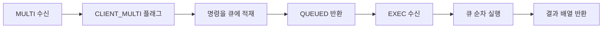
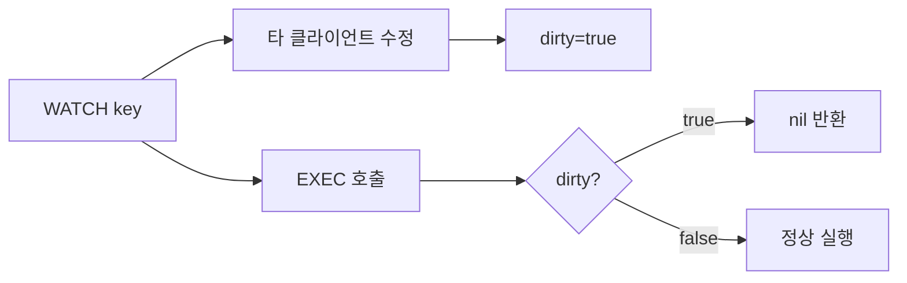
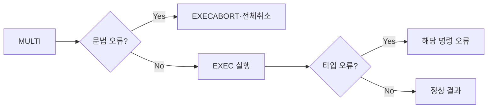
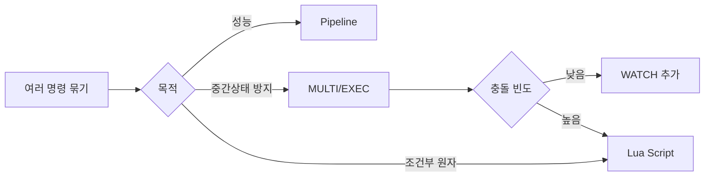

> **한 줄 요약**: Redis 트랜잭션(MULTI/EXEC)은 클라이언트 출력 버퍼에 명령을 큐잉하고 EXEC 시 원자적으로 실행하지만 롤백이 없다. 진짜 안전한 동시성 제어는 WATCH(CAS)와 Lua Script를 목적에 맞게 조합하는 것이다.

## 실제 장애: Redis 트랜잭션을 RDBMS처럼 믿었던 날

2022년 국내 E 이커머스에서 선착순 쿠폰 발급 시스템을 Redis MULTI/EXEC로 구현했습니다. 쿠폰 수량을 DECR하고 사용자에게 쿠폰을 SADD하는 두 작업을 한 트랜잭션으로 묶었습니다. 팀은 "같은 트랜잭션이니 하나가 실패하면 전체 롤백"이라고 믿었습니다.

현실은 달랐습니다. DECR은 성공했고 SADD는 타입 오류로 실패했습니다. Redis는 SADD 실패를 무시하고 EXEC를 완료했습니다. 결과: 쿠폰 수량은 100개 줄었지만 사용자에게는 발급되지 않았습니다. CS 폭발, 수동 복구에 3일.

이 포스트는 그 "왜"를 Redis 내부 메커니즘 수준에서 완전히 설명합니다.

---

## 1. MULTI/EXEC 내부 구조 — 명령 큐잉의 실제 메커니즘

### 클라이언트 출력 버퍼와 트랜잭션 큐

MULTI를 선언하면 Redis 서버는 해당 클라이언트 연결에 `CLIENT_MULTI` 플래그를 설정합니다. 이후 들어오는 명령은 **즉시 실행되지 않고 해당 클라이언트의 트랜잭션 큐(multiState.commands[])에 적재**됩니다.

```
클라이언트 상태 (redisClient 구조체)
├── flags: CLIENT_MULTI 설정
├── mstate.count: 큐에 적재된 명령 수
└── mstate.commands[]: 명령 배열
    ├── [0]: {cmd: SET, argv: ["stock:A", "100"]}
    ├── [1]: {cmd: DECR, argv: ["stock:A"]}
    └── [2]: {cmd: SADD, argv: ["issued:A", "user1"]}
```

EXEC를 받으면 Redis는 이 배열을 순회하며 각 명령을 실행합니다. 핵심은 이 실행이 **Redis 이벤트 루프의 단일 사이클 안에서 완료**된다는 것입니다. 단일 스레드 Redis에서 이벤트 루프가 다음 클라이언트 요청을 처리하기 전에 큐 전체가 실행되므로, 다른 클라이언트 명령이 끼어들 수 없습니다.



### QUEUED 응답의 의미

MULTI 이후 각 명령에 대해 서버가 `QUEUED`를 반환합니다. 이것은 **명령이 큐에 들어갔다는 수신 확인**이지, 실행 결과가 아닙니다. 클라이언트는 이 시점에 명령의 성공/실패를 알 수 없습니다. EXEC 호출 후에야 각 명령의 실제 결과 배열을 받습니다.

```java
// Spring RedisTemplate으로 MULTI/EXEC 동작 확인
@Service
public class TransactionInspectService {

    private final StringRedisTemplate redisTemplate;

    public TransactionInspectService(StringRedisTemplate redisTemplate) {
        this.redisTemplate = redisTemplate;
    }

    public List<Object> basicMultiExec() {
        return redisTemplate.execute(new SessionCallback<List<Object>>() {
            @Override
            @SuppressWarnings("unchecked")
            public List<Object> execute(RedisOperations operations)
                    throws DataAccessException {

                operations.multi();  // CLIENT_MULTI 플래그 설정

                // 아래 세 줄은 즉시 실행되지 않음 — 큐에 적재
                // 반환값은 모두 null (아직 실행 안 됨)
                operations.opsForValue().set("stock:A", "100");
                operations.opsForValue().decrement("stock:A");
                operations.opsForSet().add("issued:A", "user1");

                // EXEC: 큐 전체를 원자적으로 실행
                // 반환: ["OK", 99L, 1L] — 각 명령의 실제 결과
                return operations.exec();
            }
        });
    }
}
```

### 왜 SessionCallback이 필요한가

`RedisTemplate.execute(SessionCallback)`은 콜백 전체가 **동일한 Redis 연결(커넥션)을 공유**하도록 보장합니다. MULTI/EXEC는 클라이언트 연결 단위로 상태를 관리하기 때문에, 커넥션 풀에서 서로 다른 커넥션이 사용되면 MULTI와 EXEC가 다른 연결에 가게 됩니다. SessionCallback은 "이 블록 안에서는 하나의 커넥션만 쓴다"를 보장하는 계약입니다.

일반 `redisTemplate.opsForValue().set(...)` 호출은 매번 커넥션 풀에서 커넥션을 빌렸다가 반납합니다. MULTI를 선언한 커넥션과 EXEC를 보내는 커넥션이 달라지면 서로 다른 클라이언트가 됩니다. `EXEC without MULTI` 오류가 발생합니다.

```java
// 잘못된 방법 — 커넥션이 달라질 수 있음
redisTemplate.multi();                        // 커넥션 A
redisTemplate.opsForValue().set("k", "v");   // 커넥션 B (다른 커넥션!)
redisTemplate.exec();                         // 커넥션 C → ERR EXEC without MULTI

// 올바른 방법 — SessionCallback으로 단일 커넥션 보장
redisTemplate.execute(new SessionCallback<>() {
    public Object execute(RedisOperations ops) {
        ops.multi();
        ops.opsForValue().set("k", "v");
        return ops.exec();  // 동일 커넥션 보장
    }
});
```

---

## 2. 롤백이 없는 이유 — Redis 설계 철학과 부분 실패 시맨틱

### 두 가지 오류 유형과 다른 처리 방식

Redis MULTI/EXEC에는 성격이 완전히 다른 두 종류의 오류가 있습니다.

**유형 1 — 큐잉 시 감지되는 문법 오류**

명령 자체가 잘못된 경우입니다. EXEC 전에 이미 감지됩니다. 이 경우 EXEC 시 전체 트랜잭션이 실행되지 않습니다.

```java
// 문법 오류 — 전체 트랜잭션 취소
redisTemplate.execute(new SessionCallback<List<Object>>() {
    @Override
    public List<Object> execute(RedisOperations operations) throws DataAccessException {
        operations.multi();
        operations.opsForValue().set("key1", "val1");
        // UNKNOWNCMD는 큐잉 시점에 오류 감지
        // → 이후 EXEC 호출 시 전체 트랜잭션 취소 (EXECABORT)
        return operations.exec();
    }
});
// 결과: key1도 저장되지 않음 — 전체 취소
```

**유형 2 — 실행 시 발생하는 타입/로직 오류**

명령 문법은 올바르지만, 실행 시 대상 키의 타입이 맞지 않거나 연산이 불가한 경우입니다. **이 오류는 해당 명령만 건너뛰고 나머지는 계속 실행됩니다. 롤백 없음.**

```java
// 타입 오류 — 부분 실패, 나머지 실행 계속
@Service
public class PartialFailureDemo {

    private final StringRedisTemplate redisTemplate;

    public PartialFailureDemo(StringRedisTemplate redisTemplate) {
        this.redisTemplate = redisTemplate;
        // 사전 준비: "mystr" 키를 문자열로 설정
        redisTemplate.opsForValue().set("mystr", "hello");
    }

    public void demonstratePartialFailure() {
        List<Object> results = redisTemplate.execute(new SessionCallback<List<Object>>() {
            @Override
            @SuppressWarnings("unchecked")
            public List<Object> execute(RedisOperations operations) throws DataAccessException {
                operations.multi();

                operations.opsForValue().set("key1", "value1");   // 정상
                operations.opsForValue().increment("mystr");        // 오류! 문자열에 INCR 불가
                operations.opsForValue().set("key2", "value2");   // 정상

                return operations.exec();
            }
        });

        // results: ["OK", DataAccessException(타입오류), "OK"]
        // key1="value1" 저장됨, key2="value2" 저장됨
        // mystr은 변경 없음 (INCR 실패)
        // RDBMS처럼 key1이 롤백되지 않음!

        System.out.println(redisTemplate.opsForValue().get("key1")); // "value1"
        System.out.println(redisTemplate.opsForValue().get("key2")); // "value2"
    }
}
```

### Redis가 롤백을 지원하지 않는 철학적 이유

Redis 공식 문서에 명시된 세 가지 이유입니다.

**이유 1: Redis 오류는 프로그래밍 오류다**

문자열 키에 INCR을 호출하는 것은 개발자의 실수입니다. 프로덕션 코드에서는 절대 발생해서는 안 되는 버그입니다. Redis는 "이런 오류에 대한 롤백을 지원하는 것은 프로그래밍 오류를 감추는 것"이라고 봅니다. 오류가 명시적으로 드러나야 개발자가 버그를 수정합니다.

**이유 2: 단순성과 성능**

롤백을 지원하려면 각 명령 실행 전 상태를 스냅샷으로 저장하고, 오류 발생 시 복원해야 합니다. 이 오버헤드는 Redis의 핵심 설계 원칙인 "초고속 단순 연산"과 정면으로 충돌합니다. Redis는 마이크로초 단위 성능을 위해 복잡성을 의도적으로 배제했습니다.

**이유 3: RDBMS와 Redis의 역할 분리**

Redis는 캐시, 세마포어, 카운터, 메시지 브로커를 위한 도구입니다. 복잡한 트랜잭션 일관성 보장은 RDBMS의 역할입니다. "두 작업이 반드시 함께 성공해야 한다"는 요구사항은 Redis가 아닌 RDBMS에서 처리해야 합니다.

### RDBMS ACID vs Redis MULTI/EXEC 완전 비교

| ACID 속성 | RDBMS (PostgreSQL) | Redis MULTI/EXEC | 실무 의미 |
|----------|-------------------|-----------------|---------|
| **원자성 (Atomicity)** | 완전 — 모두 성공 또는 모두 실패 | **부분적** — 오류 명령 건너뜀, 나머지 실행 | 쿠폰 발급처럼 원자성이 필수면 RDBMS 사용 |
| **일관성 (Consistency)** | 제약조건 위반 시 전체 롤백 | **없음** — 제약조건 개념 없음 | 잔액 음수 방지는 Lua Script로 직접 구현 |
| **격리성 (Isolation)** | READ COMMITTED 등 레벨 선택 가능 | **직렬화만** — 실행 중 다른 명령 완전 차단 | READ COMMITTED 동등 격리 불가 |
| **지속성 (Durability)** | WAL로 항상 보장 | AOF `always` 설정 시에만 보장 | 기본값(RDB)은 지속성 미보장 |
| **롤백** | 지원 (ROLLBACK, SAVEPOINT) | **미지원** | Redis에서 롤백 필요 시 보상 트랜잭션 수동 구현 |
| **중첩 트랜잭션** | SAVEPOINT로 지원 | **미지원** — MULTI 중 MULTI는 오류 | 단일 레벨 트랜잭션만 가능 |

---

## 3. WATCH — CAS 메커니즘과 더티 플래그 원리

### CAS(Check-And-Set)의 내부 동작

WATCH는 낙관적 락(Optimistic Lock)의 Redis 구현입니다. 내부 동작은 CAS(Check-And-Set) 패턴입니다.

WATCH 명령을 받으면 Redis 서버는 해당 클라이언트의 watched_keys 목록에 키를 등록합니다. 동시에 각 감시 키에 대해 **더티 플래그(dirty flag)** 추적을 시작합니다.

```
서버 내부 상태
클라이언트 C1:
  watched_keys: ["stock:A", "stock:B"]
  dirty: false  ← WATCH 직후 초기값

키 "stock:A" 메타데이터:
  watchers: [C1, C3, C7]  ← 이 키를 감시하는 클라이언트 목록
```

다른 클라이언트가 감시 중인 키를 수정하면 Redis는 해당 키의 watchers 목록을 순회하며 모든 감시 클라이언트의 더티 플래그를 `true`로 설정합니다.

```
클라이언트 C2가 SET stock:A 99 실행
→ Redis: stock:A의 watchers [C1, C3, C7] 각각의 dirty = true
```

C1이 EXEC를 호출하면 Redis는 **더티 플래그를 확인**합니다. `dirty == true`면 큐를 실행하지 않고 nil을 반환합니다. `dirty == false`면 정상 실행합니다.



### WATCH가 반드시 MULTI 앞에 있어야 하는 이유

WATCH의 감시 시작 시점이 핵심입니다. **감시는 WATCH 명령 직후부터 시작**됩니다. MULTI 선언 시점이 아닙니다.

```
올바른 순서:
  WATCH stock:A    ← 이 시점부터 감시 시작
  GET stock:A      ← 현재값 읽기 (감시 중)
  [조건 검사]
  MULTI            ← 큐 모드 시작
  DECR stock:A
  EXEC             ← dirty 확인 후 실행

잘못된 순서:
  GET stock:A      ← 감시 없이 읽기
  MULTI
  WATCH stock:A    ← MULTI 이후 WATCH는 오류 (QUEUED로 처리되어 감시 안 됨)
  DECR stock:A
  EXEC             ← stock:A가 변경돼도 감지 불가
```

GET과 MULTI 사이에 다른 클라이언트가 키를 수정할 수 있습니다. WATCH가 GET 전에 설정되어 있어야 이 시점의 변경도 감지할 수 있습니다.

### Spring SessionCallback으로 WATCH 구현

```java
@Service
public class StockService {

    private final StringRedisTemplate redisTemplate;

    public StockService(StringRedisTemplate redisTemplate) {
        this.redisTemplate = redisTemplate;
    }

    /**
     * WATCH + MULTI/EXEC로 재고 차감 (낙관적 락)
     * 충돌 시 지수 백오프로 재시도
     */
    public boolean decrementStock(String productId, int quantity, int maxRetries) {
        String stockKey = "stock:" + productId;

        for (int attempt = 0; attempt < maxRetries; attempt++) {
            Boolean success = redisTemplate.execute(new SessionCallback<Boolean>() {
                @Override
                @SuppressWarnings("unchecked")
                public Boolean execute(RedisOperations operations) throws DataAccessException {

                    // 1. WATCH 설정 — 이 시점부터 stockKey 감시 시작
                    operations.watch(stockKey);

                    // 2. 현재 재고 조회 (감시 중)
                    String rawStock = (String) operations.opsForValue().get(stockKey);
                    int currentStock = rawStock == null ? 0 : Integer.parseInt(rawStock);

                    if (currentStock < quantity) {
                        // 재고 부족 — WATCH 해제 후 실패 반환
                        operations.unwatch();
                        return false;
                    }

                    // 3. MULTI 선언 (큐 모드 시작)
                    operations.multi();

                    // 4. 재고 차감 큐잉 (즉시 실행 안 됨)
                    operations.opsForValue().decrement(stockKey, quantity);

                    // 5. EXEC — dirty 플래그 확인 후 실행
                    // 다른 클라이언트가 stockKey를 수정했으면 null 반환
                    List<Object> results = operations.exec();

                    // results == null: WATCH 충돌 → 재시도 필요
                    // results.isEmpty(): 예상치 못한 빈 결과
                    return results != null && !results.isEmpty();
                }
            });

            if (Boolean.TRUE.equals(success)) {
                return true;  // 성공
            }

            if (Boolean.FALSE.equals(success)) {
                return false;  // 재고 부족 (재시도 불필요)
            }

            // null: WATCH 충돌 → 지수 백오프 후 재시도
            try {
                long backoffMs = (long) (Math.pow(2, attempt) * 10);
                Thread.sleep(Math.min(backoffMs, 200));
            } catch (InterruptedException e) {
                Thread.currentThread().interrupt();
                return false;
            }
        }

        throw new RuntimeException("재고 차감 재시도 한도 초과: " + productId);
    }
}
```

### WATCH 한계 — 충돌 빈도가 높을 때

WATCH는 낙관적 락입니다. 충돌이 드문 환경에서 효율적입니다. 선착순 이벤트처럼 수천 명이 동시에 같은 키를 수정하는 환경에서는 대부분의 요청이 WATCH 충돌로 재시도를 반복합니다.

재시도 자체가 더 많은 충돌을 만드는 **라이브락(livelock)** 상태가 됩니다. 이 경우 WATCH 대신 Lua Script를 사용합니다.

---

## 4. DISCARD — 연결 상태 정리와 사용 시점

### DISCARD의 역할

DISCARD는 MULTI로 시작된 트랜잭션을 취소하고 큐를 비웁니다. 동시에 WATCH로 감시 중이던 모든 키의 감시도 해제합니다. 연결 상태를 MULTI 이전 상태로 완전히 초기화합니다.

```java
@Service
public class DiscardExampleService {

    private final StringRedisTemplate redisTemplate;

    public DiscardExampleService(StringRedisTemplate redisTemplate) {
        this.redisTemplate = redisTemplate;
    }

    /**
     * DISCARD 사용 예: 조건 미충족 시 트랜잭션 취소
     */
    public void conditionalTransaction(String userId, int amount) {
        redisTemplate.execute(new SessionCallback<Void>() {
            @Override
            public Void execute(RedisOperations operations) throws DataAccessException {
                String balanceKey = "balance:" + userId;
                String lockKey = "lock:" + userId;

                operations.watch(balanceKey);

                String rawBalance = (String) operations.opsForValue().get(balanceKey);
                int balance = rawBalance == null ? 0 : Integer.parseInt(rawBalance);

                if (balance < amount) {
                    // 조건 미충족 — DISCARD로 깔끔하게 정리
                    // WATCH 감시도 함께 해제됨
                    // Spring에서는 unwatch()가 DISCARD를 포함
                    operations.unwatch();
                    throw new IllegalStateException("잔액 부족: " + balance);
                }

                operations.multi();
                operations.opsForValue().decrement(balanceKey, amount);
                operations.opsForValue().set(lockKey, "processed");

                operations.exec();
                return null;
            }
        });
    }
}
```

### DISCARD가 필요한 세 가지 상황

**상황 1 — 조건 미충족**: WATCH로 키를 읽고 조건을 검사했을 때 비즈니스 조건이 충족되지 않으면 DISCARD로 취소합니다. unwatch()를 호출하는 것도 내부적으로 동일한 효과입니다.

**상황 2 — 예외 발생**: MULTI 이후 Java 코드에서 예외가 발생하면 DISCARD를 명시적으로 호출해야 합니다. 그렇지 않으면 해당 Redis 연결이 커넥션 풀로 반환될 때 CLIENT_MULTI 플래그가 남아 있어 다음 사용자가 EXEC without MULTI 오류를 받습니다.

**상황 3 — 큐잉 중 오류 감지**: 큐잉 시점에 문법 오류가 감지되면 Redis 자체적으로 트랜잭션을 EXECABORT 상태로 표시합니다. EXEC 호출 시 자동으로 취소되지만, 명시적 DISCARD 호출로 즉시 정리하는 것이 안전합니다.

---

## 5. 오류 처리 — 큐 오류 vs 실행 오류의 완전한 이해

### 두 오류 유형의 처리 흐름 비교



### Spring에서 실행 오류 처리

```java
@Service
public class ErrorHandlingService {

    private final StringRedisTemplate redisTemplate;

    public ErrorHandlingService(StringRedisTemplate redisTemplate) {
        this.redisTemplate = redisTemplate;
    }

    /**
     * 실행 오류를 감지하고 보상 조치하는 패턴
     */
    public void executeWithErrorDetection() {
        // 사전 준비: 잘못된 타입 키 생성
        redisTemplate.opsForList().leftPush("mylist", "item1");  // List 타입

        List<Object> results = redisTemplate.execute(new SessionCallback<List<Object>>() {
            @Override
            @SuppressWarnings("unchecked")
            public List<Object> execute(RedisOperations operations) throws DataAccessException {
                operations.multi();

                operations.opsForValue().set("key1", "value1");    // 정상
                operations.opsForValue().increment("mylist");        // 오류: List에 INCR 불가
                operations.opsForValue().set("key2", "value2");    // 정상 (오류와 무관하게 실행)

                return operations.exec();
            }
        });

        // 결과 배열 검사로 부분 실패 감지
        if (results != null) {
            for (int i = 0; i < results.size(); i++) {
                Object result = results.get(i);
                if (result instanceof DataAccessException) {
                    // 실행 오류 감지 — 보상 조치 필요
                    handlePartialFailure(i, (DataAccessException) result);
                }
            }
        }
    }

    private void handlePartialFailure(int commandIndex, DataAccessException e) {
        // 실제로는 부분 실패 알림, 보상 트랜잭션, 감사 로그 등
        System.err.println("명령 " + commandIndex + " 실패: " + e.getMessage());
        // 주의: 이미 성공한 명령들은 되돌릴 수 없음
        // 보상 트랜잭션으로 수동 복구 필요
    }
}
```

### 왜 실행 오류가 다른 명령을 롤백하지 않는가 — 깊은 이유

Redis 소스코드(multi.c)를 보면 EXEC 실행 루프는 다음과 같습니다.

```c
// Redis 소스 (의사코드)
for (j = 0; j < c->mstate.count; j++) {
    call(c, c->mstate.commands[j]);  // 각 명령 실행
    // 오류 발생해도 루프 계속
    // 결과를 응답 버퍼에 추가 (오류도 포함)
}
// 루프 완료 후 결과 배열 전송
```

오류가 발생해도 `return`하지 않고 루프를 계속합니다. Redis 설계자 Salvatore Sanfilippo는 이를 "Redis errors are programming bugs, not runtime conditions"라고 설명했습니다. 타입 오류는 개발자가 잘못된 코드를 작성한 것이고, 이는 테스트에서 잡아야 합니다. 프로덕션에서 롤백으로 숨기는 것은 버그를 은폐합니다.

---

## 6. Pipeline vs Transaction vs Lua — 원자성/격리성/성능 완전 비교

### 세 방식의 핵심 차이 이해

> **비유로 이해하기**
>
> **Pipeline**: 편지 10통을 봉투에 묶어 우체통에 한 번에 넣습니다. 배달은 각각 따로 됩니다. 중간에 다른 편지가 끼어들어도 상관없습니다. 빠른 전송이 목적입니다.
>
> **MULTI/EXEC**: 10통을 묶어 우체부에게 "이 묶음은 연속으로 배달해달라"고 요청합니다. 배달 중 다른 편지는 잠시 대기합니다. 하지만 배달 중 한 통이 주소 오류면 그 통만 반환하고 나머지는 배달합니다.
>
> **Lua Script**: 우체부가 레시피를 보고 "10통을 받아 직접 순서대로 처리"합니다. 처리 중 아무도 개입할 수 없습니다. 읽어서 조건을 판단하고 다음 행동을 결정할 수 있습니다.

### 비교 매트릭스

| 항목 | Pipeline | MULTI/EXEC | Lua Script |
|------|---------|-----------|-----------|
| **목적** | 네트워크 RTT 최소화 | 명령 간 끼어들기 방지 | 조건부 원자 실행 |
| **원자성** | 없음 | 부분적 (실행 중 차단) | 완전 (서버 전체 차단) |
| **격리성** | 없음 | 직렬화 | 직렬화 |
| **롤백** | 없음 | 없음 | 없음 |
| **조건부 분기** | 불가 | 불가 | 가능 (if/else) |
| **읽기 후 쓰기** | 불가 (결과 나중 수신) | WATCH 조합 필요 | 스크립트 내 처리 |
| **네트워크 왕복** | 1회 | 여러 회 (MULTI+명령+EXEC) | 1회 (EVALSHA) |
| **서버 부하** | 낮음 | 낮음 | 실행 중 전체 차단 |
| **클러스터** | 크로스 슬롯 가능 | 동일 슬롯 필수 | 동일 슬롯 필수 |
| **디버깅** | 쉬움 | 보통 | 어려움 |
| **언제 사용** | 독립 키 배치 처리 | 중간 상태 노출 방지 | 재고/쿠폰 단순 조건 |

### Pipeline 코드

```java
@Service
public class PipelineService {

    private final StringRedisTemplate redisTemplate;

    public PipelineService(StringRedisTemplate redisTemplate) {
        this.redisTemplate = redisTemplate;
    }

    /**
     * Pipeline: 독립적인 키들을 배치로 빠르게 설정
     * 원자성 없음 — 다른 클라이언트가 중간에 끼어들 수 있음
     */
    public void batchSetUserProfiles(List<UserProfile> profiles) {
        redisTemplate.executePipelined(new SessionCallback<Object>() {
            @Override
            public Object execute(RedisOperations operations) throws DataAccessException {
                for (UserProfile profile : profiles) {
                    // 각 명령은 버퍼에 적재됨 — 즉시 전송 안 됨
                    operations.opsForValue().set(
                        "user:" + profile.getId(),
                        profile.toJson(),
                        Duration.ofHours(1)
                    );
                }
                // 메서드 종료 시 버퍼의 모든 명령을 한 번에 전송
                return null;
            }
        });
        // 결과: 수백 개 SET 명령이 1번의 네트워크 왕복으로 처리
    }

    /**
     * Pipeline vs 단건 성능 비교 (개념)
     *
     * 단건 100개: 100회 네트워크 왕복 × 1ms = ~100ms
     * Pipeline 100개: 1회 네트워크 왕복 = ~1ms (100배 개선)
     */
}
```

### MULTI/EXEC 코드

```java
/**
 * MULTI/EXEC: 포인트 이전 — 중간 상태 노출 방지
 * A 차감 → B 추가가 원자적으로 보임 (다른 클라이언트가 중간 상태 못 봄)
 */
public void transferPoints(String fromUser, String toUser, long points) {
    String fromKey = "points:" + fromUser;
    String toKey = "points:" + toUser;

    redisTemplate.execute(new SessionCallback<List<Object>>() {
        @Override
        @SuppressWarnings("unchecked")
        public List<Object> execute(RedisOperations operations) throws DataAccessException {
            operations.watch(fromKey);

            String rawBalance = (String) operations.opsForValue().get(fromKey);
            long balance = rawBalance == null ? 0L : Long.parseLong(rawBalance);

            if (balance < points) {
                operations.unwatch();
                throw new IllegalStateException("포인트 부족");
            }

            operations.multi();
            operations.opsForValue().decrement(fromKey, points);  // 차감
            operations.opsForValue().increment(toKey, points);     // 추가

            // EXEC 동안 다른 클라이언트는
            // "A만 차감되고 B는 아직 추가 안 된" 중간 상태를 볼 수 없음
            List<Object> results = operations.exec();

            if (results == null) {
                throw new RuntimeException("WATCH 충돌 — 재시도 필요");
            }

            return results;
        }
    });
}
```

---

## 7. Pipeline과 MULTI/EXEC가 원자성 측면에서 실제로 다른 이유

### Pipeline의 끼어들기 허용

Pipeline은 클라이언트가 여러 명령을 한 번에 전송하는 **전송 최적화**입니다. 서버에 도착 후 각 명령은 독립적으로 처리됩니다. Redis 이벤트 루프는 Pipeline의 명령들 사이에 다른 클라이언트의 명령을 처리할 수 있습니다.

```
시간선 (Pipeline의 경우):
  t1: C1 Pipeline SET key1
  t2: C2 INCR counter        ← 끼어들기 가능
  t3: C1 Pipeline SET key2
  t4: C3 GET key1            ← key1은 있고 key2는 아직 없는 상태를 봄
  t5: C1 Pipeline SET key3
```

### MULTI/EXEC의 끼어들기 불가

EXEC를 받으면 Redis는 큐의 명령들을 이벤트 루프의 단일 처리 사이클에서 모두 실행합니다. 이 사이클이 완료될 때까지 Redis는 다른 클라이언트의 요청을 처리하지 않습니다.

```
시간선 (MULTI/EXEC의 경우):
  t1: C1 MULTI
  t2: C1 SET key1     → QUEUED
  t3: C1 SET key2     → QUEUED
  t4: C1 EXEC
  ↓ [이벤트 루프가 C1 큐 실행 — 이 사이에 다른 클라이언트 요청 처리 안 됨]
  t5: C1 결과 반환
  t6: C2 INCR counter  ← EXEC 완료 후에야 처리됨
```

이것이 Pipeline은 "배치 전송"이고 MULTI/EXEC는 "원자적 실행"인 이유입니다.

---

## 8. Lua Script — 서버 측 원자 실행의 진짜 힘

### Lua Script의 원자성이 MULTI/EXEC보다 강한 이유

MULTI/EXEC는 큐잉된 명령들을 서버에서 루프로 실행합니다. 이 루프 자체는 이벤트 루프에서 끊기지 않지만, 이론적으로 각 call() 함수 호출 사이에 타이밍 의존성이 있습니다.

Lua Script는 Redis 이벤트 루프에서 **단 하나의 명령**으로 취급됩니다. Lua 인터프리터 전체가 단일 명령의 처리 과정으로 실행됩니다. 실행 중에는 이벤트 루프가 다른 클라이언트 명령을 받지 않습니다. 이것이 완전한 원자성입니다.

또한 Lua Script는 **읽기 결과를 스크립트 안에서 바로 조건 분기에 사용**할 수 있습니다. MULTI/EXEC에서는 불가능한 "재고 확인 후 차감" 같은 패턴을 단일 원자 단위로 구현합니다.

### 재고 차감 Lua Script — Java/Spring 구현

```java
@Service
public class StockLuaService {

    private final StringRedisTemplate redisTemplate;

    // Lua Script: 재고 확인 + 차감 원자 실행
    private static final DefaultRedisScript<Long> DECREMENT_STOCK_SCRIPT;

    static {
        DECREMENT_STOCK_SCRIPT = new DefaultRedisScript<>();
        DECREMENT_STOCK_SCRIPT.setScriptText(
            // KEYS[1]: 재고 키
            // ARGV[1]: 차감 수량
            "local stock_key = KEYS[1] " +
            "local quantity = tonumber(ARGV[1]) " +

            // 현재 재고 조회 (원자적 실행 중)
            "local current = tonumber(redis.call('GET', stock_key)) " +

            "if current == nil then " +
            "  return -2 " +  // -2: 키 없음
            "end " +

            "if current < quantity then " +
            "  return -1 " +  // -1: 재고 부족
            "end " +

            // 재고 충분 — 원자적으로 차감
            "return redis.call('DECRBY', stock_key, quantity)"
            // 반환: 차감 후 남은 재고 (0 이상)
        );
        DECREMENT_STOCK_SCRIPT.setResultType(Long.class);
    }

    public long decrementStock(String productId, int quantity) {
        Long result = redisTemplate.execute(
            DECREMENT_STOCK_SCRIPT,
            Collections.singletonList("stock:" + productId),
            String.valueOf(quantity)
        );

        if (result == null) {
            throw new RuntimeException("Lua Script 실행 실패");
        }
        if (result == -2L) {
            throw new IllegalStateException("재고 키가 존재하지 않음: " + productId);
        }
        if (result == -1L) {
            throw new IllegalStateException("재고 부족: " + productId);
        }

        return result;  // 차감 후 남은 재고
    }
}
```

### 쿠폰 발급 Lua Script — 수량 차감 + 사용자 기록 원자 처리

이것이 포스트 서두의 사고를 방지하는 올바른 구현입니다.

```java
@Service
public class CouponLuaService {

    private final StringRedisTemplate redisTemplate;

    // KEYS[1]: 쿠폰 잔여 수량 키
    // KEYS[2]: 발급된 사용자 집합 키
    // ARGV[1]: 사용자 ID
    private static final DefaultRedisScript<Long> ISSUE_COUPON_SCRIPT;

    static {
        ISSUE_COUPON_SCRIPT = new DefaultRedisScript<>();
        ISSUE_COUPON_SCRIPT.setScriptText(
            "local count_key = KEYS[1] " +
            "local users_key = KEYS[2] " +
            "local user_id = ARGV[1] " +

            // 1. 중복 발급 확인 (원자적 실행 중)
            "local already = redis.call('SISMEMBER', users_key, user_id) " +
            "if already == 1 then " +
            "  return -2 " +  // -2: 이미 발급
            "end " +

            // 2. 잔여 수량 확인
            "local remaining = tonumber(redis.call('GET', count_key)) " +
            "if remaining == nil or remaining <= 0 then " +
            "  return -1 " +  // -1: 쿠폰 소진
            "end " +

            // 3. 수량 차감 + 사용자 기록 (원자적)
            // 이 두 줄 사이에 다른 클라이언트가 끼어들 수 없음
            "redis.call('DECR', count_key) " +
            "redis.call('SADD', users_key, user_id) " +

            "return remaining - 1"  // 발급 후 남은 수량
        );
        ISSUE_COUPON_SCRIPT.setResultType(Long.class);
    }

    public long issueCoupon(String couponId, String userId) {
        List<String> keys = Arrays.asList(
            "coupon:count:" + couponId,
            "coupon:issued:" + couponId
        );

        Long result = redisTemplate.execute(
            ISSUE_COUPON_SCRIPT,
            keys,
            userId
        );

        if (result == null) {
            throw new RuntimeException("Lua Script 실행 실패");
        }
        if (result == -2L) {
            throw new IllegalStateException("이미 발급된 쿠폰입니다: " + userId);
        }
        if (result == -1L) {
            throw new IllegalStateException("쿠폰이 모두 소진됐습니다: " + couponId);
        }

        return result;  // 남은 쿠폰 수량
    }
}
```

이 스크립트는 사고 사례를 완전히 방지합니다. DECR과 SADD가 단일 Lua 실행 안에 있어서 둘 중 하나만 실행되는 상황이 물리적으로 불가능합니다.

### Lua Script 주의사항 — 서버 차단 위험

Lua Script 실행 중 Redis는 완전히 차단됩니다. 스크립트가 길거나 루프가 있으면 수백 ms 동안 Redis 전체가 멈춥니다.

```java
// 위험한 Lua Script 예시 — 절대 하지 말 것
private static final DefaultRedisScript<Long> DANGEROUS_SCRIPT = new DefaultRedisScript<>();
static {
    DANGEROUS_SCRIPT.setScriptText(
        // 이 루프가 실행되는 동안 Redis 전체가 차단됨
        "local total = 0 " +
        "for i = 1, 1000000 do " +  // 100만 번 루프 — 절대 금지
        "  total = total + i " +
        "end " +
        "return total"
    );
}

// 올바른 Lua Script — 짧고 단순하게
// 조건 체크 1개 + Redis 명령 2~3개가 한계
```

`lua-time-limit` 기본값은 5초입니다. 이 시간을 초과하면 Redis는 BUSY 상태를 반환하고 `SCRIPT KILL` 명령으로만 중단할 수 있습니다. 단, 이미 쓰기 명령을 실행한 스크립트는 `SCRIPT KILL`로 중단 불가하여 `SHUTDOWN NOSAVE`가 필요합니다.

---

## 9. CAS 패턴 실전 구현 — 재고, 카운터, 계좌 이전

### 패턴 1: 재고 관리 (WATCH + 재시도)

```java
@Service
public class InventoryService {

    private final StringRedisTemplate redisTemplate;

    public InventoryService(StringRedisTemplate redisTemplate) {
        this.redisTemplate = redisTemplate;
    }

    /**
     * CAS 패턴: 재고 예약
     * 조건: 재고 >= 요청 수량
     * 행동: 재고 차감 + 예약 기록
     */
    public boolean reserveStock(String productId, String orderId, int quantity) {
        String stockKey = "stock:" + productId;
        String reservedKey = "reserved:" + productId;

        for (int attempt = 0; attempt < 5; attempt++) {
            Boolean result = redisTemplate.execute(new SessionCallback<Boolean>() {
                @Override
                @SuppressWarnings("unchecked")
                public Boolean execute(RedisOperations operations) throws DataAccessException {
                    // WATCH: 재고 키 감시 시작
                    operations.watch(stockKey);

                    String rawStock = (String) operations.opsForValue().get(stockKey);
                    int stock = rawStock == null ? 0 : Integer.parseInt(rawStock);

                    if (stock < quantity) {
                        operations.unwatch();
                        return null;  // null: 재고 부족 (재시도 불필요)
                    }

                    operations.multi();
                    operations.opsForValue().decrement(stockKey, quantity);
                    operations.opsForHash().put(reservedKey, orderId, String.valueOf(quantity));

                    List<Object> execResult = operations.exec();
                    return execResult != null;  // null이면 WATCH 충돌
                }
            });

            if (result == null) {
                return false;  // 재고 부족
            }
            if (Boolean.TRUE.equals(result)) {
                return true;  // 예약 성공
            }
            // false: WATCH 충돌 → 재시도
        }

        throw new RuntimeException("재고 예약 재시도 한도 초과");
    }
}
```

### 패턴 2: 조건부 카운터 (Lua Script)

```java
@Service
public class ConditionalCounterService {

    private final StringRedisTemplate redisTemplate;

    // 카운터가 상한선 미만일 때만 증가
    private static final DefaultRedisScript<Long> INCREMENT_IF_BELOW_SCRIPT;

    static {
        INCREMENT_IF_BELOW_SCRIPT = new DefaultRedisScript<>();
        INCREMENT_IF_BELOW_SCRIPT.setScriptText(
            "local key = KEYS[1] " +
            "local limit = tonumber(ARGV[1]) " +
            "local current = tonumber(redis.call('GET', key) or '0') " +
            "if current >= limit then " +
            "  return -1 " +  // -1: 한도 초과
            "end " +
            "return redis.call('INCR', key)"
        );
        INCREMENT_IF_BELOW_SCRIPT.setResultType(Long.class);
    }

    /**
     * 일일 API 호출 한도 카운터
     * 한도 내에서만 카운터 증가, 초과 시 즉시 거부
     */
    public long incrementApiCallCount(String userId, int dailyLimit) {
        String key = "api:count:" + userId + ":" + LocalDate.now();

        Long result = redisTemplate.execute(
            INCREMENT_IF_BELOW_SCRIPT,
            Collections.singletonList(key),
            String.valueOf(dailyLimit)
        );

        if (result == null || result == -1L) {
            throw new RateLimitExceededException("일일 API 호출 한도 초과: " + userId);
        }

        return result;
    }
}
```

### 패턴 3: 계좌 이전 (WATCH 낙관적 락)

```java
@Service
public class AccountTransferService {

    private final StringRedisTemplate redisTemplate;

    /**
     * 계좌 이전: 출금 계좌 잔액 충분 시에만 이전
     * WATCH로 두 계좌 모두 감시 (둘 중 하나라도 변경되면 재시도)
     */
    public void transfer(String fromAccountId, String toAccountId, long amount) {
        String fromKey = "account:" + fromAccountId;
        String toKey = "account:" + toAccountId;

        for (int attempt = 0; attempt < 3; attempt++) {
            Boolean success = redisTemplate.execute(new SessionCallback<Boolean>() {
                @Override
                @SuppressWarnings("unchecked")
                public Boolean execute(RedisOperations operations) throws DataAccessException {
                    // 두 키 모두 감시 — 어느 쪽이든 변경되면 EXEC 취소
                    operations.watch(Arrays.asList(fromKey, toKey));

                    String rawFrom = (String) operations.opsForValue().get(fromKey);
                    String rawTo = (String) operations.opsForValue().get(toKey);

                    long fromBalance = rawFrom == null ? 0L : Long.parseLong(rawFrom);
                    long toBalance = rawTo == null ? 0L : Long.parseLong(rawTo);

                    if (fromBalance < amount) {
                        operations.unwatch();
                        throw new IllegalStateException("잔액 부족: " + fromBalance);
                    }

                    operations.multi();

                    // 두 계좌 변경이 원자적으로 실행됨
                    // 다른 클라이언트가 중간 상태(출금만 된 상태)를 볼 수 없음
                    operations.opsForValue().set(fromKey, String.valueOf(fromBalance - amount));
                    operations.opsForValue().set(toKey, String.valueOf(toBalance + amount));

                    List<Object> results = operations.exec();
                    return results != null;
                }
            });

            if (Boolean.TRUE.equals(success)) {
                return;  // 이전 성공
            }
            // WATCH 충돌 — 재시도
        }

        throw new RuntimeException("계좌 이전 재시도 한도 초과");
    }
}
```

---

## 10. 클러스터 트랜잭션 — Hash Tag와 슬롯 제약

### 왜 클러스터에서 트랜잭션이 제한되는가

Redis Cluster는 키를 CRC16 해시로 16,384개 슬롯 중 하나에 배치하고, 슬롯을 여러 노드에 분산합니다. MULTI/EXEC와 Lua Script는 **단일 노드에서만 실행**됩니다. 서로 다른 노드에 있는 키를 같은 트랜잭션으로 처리하는 것은 물리적으로 불가능합니다.

```java
// 클러스터에서 다른 슬롯 키를 MULTI/EXEC로 묶으면:
// stock:A → 슬롯 5,474 (노드 1)
// stock:B → 슬롯 11,900 (노드 2)
// → CROSSSLOT Keys in request don't hash to the same slot

// 오류 발생 예시
redisTemplate.execute(new SessionCallback<List<Object>>() {
    public List<Object> execute(RedisOperations ops) throws DataAccessException {
        ops.multi();
        ops.opsForValue().set("stock:A", "100");   // 슬롯 5474
        ops.opsForValue().set("stock:B", "200");   // 슬롯 11900
        return ops.exec();  // CROSSSLOT 오류!
    }
});
```

### Hash Tag로 같은 슬롯 강제

중괄호 `{}` 안의 문자열만으로 슬롯을 결정합니다. 같은 Hash Tag 내용이면 항상 같은 슬롯에 배치됩니다.

```java
@Service
public class ClusterTransactionService {

    private final StringRedisTemplate redisTemplate;

    public ClusterTransactionService(StringRedisTemplate redisTemplate) {
        this.redisTemplate = redisTemplate;
    }

    /**
     * Hash Tag로 같은 슬롯 보장
     * {order:456}이 슬롯을 결정 — 이 태그를 공유하는 키는 모두 같은 슬롯
     */
    public void createOrder(String orderId, String productId, int quantity) {
        // Hash Tag: {order:{orderId}}
        // 이 세 키는 모두 동일한 슬롯에 배치됨
        String stockKey = "{order:" + orderId + "}:stock:" + productId;
        String statusKey = "{order:" + orderId + "}:status";
        String quantityKey = "{order:" + orderId + "}:quantity";

        redisTemplate.execute(new SessionCallback<List<Object>>() {
            @Override
            @SuppressWarnings("unchecked")
            public List<Object> execute(RedisOperations operations) throws DataAccessException {
                operations.multi();

                // 세 키 모두 {order:{orderId}} Hash Tag로 같은 슬롯
                // MULTI/EXEC가 정상 동작
                operations.opsForValue().set(stockKey, String.valueOf(quantity));
                operations.opsForValue().set(statusKey, "PENDING");
                operations.opsForValue().set(quantityKey, String.valueOf(quantity));

                return operations.exec();
            }
        });
    }

    /**
     * Lua Script도 동일한 슬롯 제약
     * KEYS 배열의 모든 키가 같은 슬롯에 있어야 함
     */
    private static final DefaultRedisScript<Long> CLUSTER_SAFE_SCRIPT;

    static {
        CLUSTER_SAFE_SCRIPT = new DefaultRedisScript<>();
        CLUSTER_SAFE_SCRIPT.setScriptText(
            // KEYS[1]과 KEYS[2]가 반드시 같은 슬롯 — Hash Tag로 보장
            "local stock_key = KEYS[1] " +   // {coupon:abc}:count
            "local users_key = KEYS[2] " +   // {coupon:abc}:users
            "local user_id = ARGV[1] " +
            "local remaining = tonumber(redis.call('GET', stock_key)) " +
            "if remaining == nil or remaining <= 0 then return -1 end " +
            "redis.call('DECR', stock_key) " +
            "redis.call('SADD', users_key, user_id) " +
            "return remaining - 1"
        );
        CLUSTER_SAFE_SCRIPT.setResultType(Long.class);
    }

    public long issueCouponInCluster(String couponId, String userId) {
        // Hash Tag {coupon:{couponId}} 로 두 키를 같은 슬롯에 배치
        List<String> keys = Arrays.asList(
            "{coupon:" + couponId + "}:count",
            "{coupon:" + couponId + "}:users"
        );

        Long result = redisTemplate.execute(CLUSTER_SAFE_SCRIPT, keys, userId);
        if (result == null || result == -1L) {
            throw new IllegalStateException("쿠폰 발급 실패");
        }
        return result;
    }
}
```

### Hash Tag 과용의 부작용

Hash Tag는 관련 키들을 같은 슬롯에 강제로 몰아넣습니다. 너무 광범위한 Hash Tag를 사용하면 특정 슬롯에 데이터가 집중되어 클러스터의 부하 분산 이점이 사라집니다.

```
나쁜 예: {app}:user:1, {app}:product:1, {app}:order:1
→ 모든 키가 {app} 슬롯에 집중 — 한 노드가 모든 부하

좋은 예: {order:456}:stock, {order:456}:status
→ 같은 주문의 관련 키만 같은 슬롯 — 주문마다 다른 슬롯 가능
```

---

## 11. 극한 시나리오

### 시나리오 1: 선착순 이벤트 — 동시 50,000 요청에 재고 100개

**극한 상황**: 50,000명이 동시에 쿠폰 발급 버튼을 누릅니다. 재고는 100개. WATCH를 쓰면 49,900개 요청이 WATCH 충돌로 재시도합니다. 재시도가 더 많은 충돌을 만들고 Redis가 폭주합니다. MULTI/EXEC만 쓰면 재고 체크와 차감 사이에 끼어들기가 발생해 재고 마이너스가 됩니다.

**대응 전략**:

```java
@Service
public class FlashSaleService {

    private final StringRedisTemplate redisTemplate;
    private final DefaultRedisScript<Long> issueCouponScript;

    // 1단계: Lua Script로 원자적 처리 (WATCH 재시도 없음)
    public String issueCoupon(String eventId, String userId) {
        // 2단계: 소진 조기 감지 (Lua 호출 전 빠른 사전 체크)
        String remainingRaw = redisTemplate.opsForValue().get("coupon:count:" + eventId);
        if (remainingRaw == null || Long.parseLong(remainingRaw) <= 0) {
            throw new IllegalStateException("쿠폰 소진");
        }

        // 3단계: Lua Script로 원자적 처리
        List<String> keys = Arrays.asList(
            "{event:" + eventId + "}:count",
            "{event:" + eventId + "}:issued"
        );

        Long result = redisTemplate.execute(issueCouponScript, keys, userId);

        if (result == null || result < 0) {
            throw new IllegalStateException("쿠폰 발급 실패");
        }

        // 4단계: 비동기로 DB 영구 저장 (메시지 큐)
        publishCouponIssuedEvent(eventId, userId, result);

        return "발급 성공, 남은 수량: " + result;
    }

    // 5단계: Rate Limiting으로 투기적 재시도 방지
    public boolean checkRateLimit(String userId) {
        String key = "rate:" + userId;
        Long count = redisTemplate.opsForValue().increment(key);
        if (count == 1L) {
            redisTemplate.expire(key, Duration.ofSeconds(1));
        }
        return count <= 5;  // 초당 5회 제한
    }

    private void publishCouponIssuedEvent(String eventId, String userId, long remaining) {
        // Kafka/RabbitMQ로 비동기 DB 저장
    }
}
```

**핵심**: Lua Script 한 번의 호출로 50,000 요청 중 100개만 성공합니다. 나머지 49,900개는 재시도 없이 즉시 실패를 반환받습니다. Redis 부하는 50,000번의 Lua Script 호출(각 수 마이크로초)로 처리됩니다.

### 시나리오 2: MULTI/EXEC 중 Redis Master 장애

**극한 상황**: MULTI를 선언하고 명령을 큐잉하는 도중 Redis Master 서버가 다운됩니다. Sentinel이 Replica를 Master로 승격시킵니다. 새 Master에는 큐잉된 명령이 없습니다. 클라이언트가 EXEC를 호출합니다.

**동작 분석**:

```
MULTI → [명령 큐잉 중] → Master 다운
Sentinel 페일오버 (10~30초)
클라이언트 재연결 → 새 Master
EXEC 호출 → ERR EXEC without MULTI (새 Master는 MULTI 상태 없음)
```

**대응 전략**:

```java
@Service
public class FailoverSafeService {

    private final StringRedisTemplate redisTemplate;

    /**
     * 페일오버 안전 트랜잭션: 멱등 설계 + 재시도
     */
    public void idempotentUpdate(String idempotencyKey, String dataKey, String value) {
        for (int attempt = 0; attempt < 3; attempt++) {
            try {
                Boolean executed = redisTemplate.execute(new SessionCallback<Boolean>() {
                    @Override
                    @SuppressWarnings("unchecked")
                    public Boolean execute(RedisOperations operations) throws DataAccessException {
                        operations.watch(idempotencyKey);

                        // 멱등성 키 확인 (이미 처리됐으면 건너뜀)
                        String processed = (String) operations.opsForValue().get(idempotencyKey);
                        if ("done".equals(processed)) {
                            operations.unwatch();
                            return true;
                        }

                        operations.multi();
                        operations.opsForValue().set(dataKey, value);
                        // 멱등성 키: 처리 완료 표시 (TTL 24시간)
                        operations.opsForValue().set(idempotencyKey, "done",
                            Duration.ofHours(24));

                        List<Object> results = operations.exec();
                        return results != null;
                    }
                });

                if (Boolean.TRUE.equals(executed)) {
                    return;
                }
            } catch (RedisConnectionFailureException e) {
                // 페일오버 중 — 잠시 대기 후 재시도
                try {
                    Thread.sleep(1000L * (attempt + 1));
                } catch (InterruptedException ie) {
                    Thread.currentThread().interrupt();
                    throw new RuntimeException("중단됨");
                }
            }
        }

        throw new RuntimeException("Redis 장애로 업데이트 실패");
    }
}
```

### 시나리오 3: Lua Script 무한 루프로 Redis 전체 차단

**극한 상황**: 개발자가 Lua Script 안에서 대용량 키셋을 순회하는 루프를 작성했습니다. 프로덕션 데이터가 예상보다 100배 많아 루프가 수 분간 실행됩니다. Redis가 단일 스레드이므로 모든 클라이언트가 차단됩니다. 서비스 전체 응답 불가.

**즉시 대응 절차**:

```bash
# 1단계: 실행 중인 Lua Script 강제 종료 (쓰기 없었으면)
redis-cli SCRIPT KILL

# 2단계: 이미 쓰기 실행 중이면 SCRIPT KILL 불가 → 데이터 손실 감수하고 재시작
redis-cli SHUTDOWN NOSAVE

# 3단계: lua-time-limit 확인 (기본 5000ms)
redis-cli CONFIG GET lua-time-limit

# 4단계: 제한 시간 조정 (1초로 단축)
redis-cli CONFIG SET lua-time-limit 1000
```

**예방 코드 패턴**:

```java
// 위험: 루프 상한 없음
"for i = 1, #keys do ... end"

// 안전: 루프 상한 설정
private static final DefaultRedisScript<Long> SAFE_BATCH_SCRIPT;
static {
    SAFE_BATCH_SCRIPT = new DefaultRedisScript<>();
    SAFE_BATCH_SCRIPT.setScriptText(
        "local MAX_ITER = 100 " +  // 최대 100번만 순회
        "local keys = KEYS " +
        "local count = 0 " +
        "for i = 1, math.min(#keys, MAX_ITER) do " +
        "  redis.call('DEL', keys[i]) " +
        "  count = count + 1 " +
        "end " +
        "return count"
    );
    SAFE_BATCH_SCRIPT.setResultType(Long.class);
}
```

---

## 12. 면접 포인트 5가지 — 깊은 WHY 답변

<details>
<summary>펼쳐보기</summary>


### 면접 포인트 1: Redis MULTI/EXEC 내부 동작을 설명하라

**답변**:

MULTI 명령을 받으면 Redis 서버는 해당 클라이언트 구조체에 `CLIENT_MULTI` 플래그를 설정합니다. 이후 들어오는 명령은 서버의 `mstate.commands[]` 배열에 적재되고 `QUEUED`를 반환합니다. 즉시 실행되지 않습니다.

EXEC를 받으면 Redis는 이 배열을 순회하며 각 명령을 실행합니다. 핵심은 이 실행이 **Redis 이벤트 루프의 단일 처리 사이클 안에서 완료**된다는 것입니다. Redis가 단일 스레드이므로 이 사이클이 완료되기 전까지 다른 클라이언트 명령은 처리되지 않습니다. 이것이 MULTI/EXEC가 제공하는 격리성입니다.

Spring에서 SessionCallback이 필요한 이유는 MULTI/EXEC가 클라이언트 연결 단위로 상태를 관리하기 때문입니다. SessionCallback은 블록 내에서 단일 Redis 커넥션 사용을 보장합니다.

**WHY**: Redis 이벤트 루프가 단일 스레드이기 때문에 EXEC 실행 사이클이 원자적으로 동작합니다. 멀티스레드 RDBMS처럼 락을 걸 필요 없이, 단순히 "한 번에 하나씩만 처리"하는 구조로 격리성을 달성합니다.

---

### 면접 포인트 2: Redis는 왜 롤백을 지원하지 않는가

**답변**:

Redis 공식 문서에서 설계 결정으로 명시한 세 가지 이유가 있습니다.

첫째, Redis에서 발생하는 오류(타입 불일치, 잘못된 인자 수)는 **프로그래밍 오류**입니다. 올바르게 작성된 프로덕션 코드에서는 발생해선 안 됩니다. 롤백으로 이를 숨기면 버그가 개발 단계에서 발견되지 않습니다.

둘째, 롤백 지원은 각 명령 실행 전 상태를 스냅샷으로 저장해야 하므로 **상당한 성능 오버헤드**가 발생합니다. Redis의 핵심 가치인 "마이크로초 단위 성능"과 충돌합니다.

셋째, Redis와 RDBMS는 **역할이 다릅니다**. "두 작업이 반드시 함께 성공해야 한다"는 요구사항은 RDBMS의 역할입니다. Redis를 RDBMS처럼 사용하는 것은 도구를 잘못 선택한 것입니다.

**WHY**: Redis는 캐시, 세마포어, 카운터처럼 "빠른 단순 연산"에 최적화된 도구입니다. 복잡한 일관성 보장 메커니즘을 추가하면 Redis의 존재 이유인 성능과 단순성이 훼손됩니다. 설계자들이 의도적으로 선택한 트레이드오프입니다.

---

### 면접 포인트 3: WATCH의 CAS 메커니즘과 한계

**답변**:

WATCH는 CAS(Check-And-Set) 패턴의 Redis 구현입니다. 내부적으로 더티 플래그(dirty flag) 메커니즘으로 동작합니다.

WATCH 명령을 받으면 서버는 해당 클라이언트에 감시 키 목록을 등록합니다. 다른 클라이언트가 감시 키를 수정하면 Redis는 해당 키의 감시자 목록을 순회하며 **각 감시 클라이언트의 더티 플래그를 true로 설정**합니다. EXEC 호출 시 더티 플래그가 true면 큐를 실행하지 않고 nil을 반환합니다.

**WATCH가 반드시 MULTI 앞에 있어야 하는 이유**: 감시는 WATCH 명령 즉시 시작됩니다. GET으로 현재 값을 읽기 전에 WATCH를 설정해야 읽기~MULTI 사이의 변경도 감지합니다. MULTI 이후 WATCH는 큐에 적재되어 감시가 시작되지 않습니다.

**한계**: 충돌 빈도가 높으면 라이브락이 발생합니다. 선착순 이벤트처럼 수천 명이 같은 키를 동시에 수정하면 대부분의 EXEC가 nil을 반환합니다. 재시도가 더 많은 충돌을 만들어 성능이 급락합니다. 이 경우 Lua Script가 올바른 선택입니다.

---

### 면접 포인트 4: Pipeline vs MULTI/EXEC 원자성 차이의 근본 이유

**답변**:

Pipeline은 **클라이언트 측 전송 최적화**입니다. 여러 명령을 버퍼에 모아 한 번의 TCP 패킷으로 전송합니다. 서버는 이 명령들을 받아 하나씩 처리하는데, 이 처리 사이에 다른 클라이언트 명령이 이벤트 루프에 의해 처리될 수 있습니다. Redis 서버 입장에서 Pipeline은 그냥 빠르게 온 개별 명령들입니다.

MULTI/EXEC는 **서버 측 원자 실행**입니다. EXEC를 받으면 Redis는 큐의 명령 전체를 이벤트 루프의 단일 처리 사이클에서 실행합니다. 단일 처리 사이클이 끝나기 전까지 이벤트 루프는 다른 클라이언트를 처리하지 않습니다.

**WHY**: Redis가 단일 스레드 이벤트 루프 구조이기 때문입니다. "원자성"이 복잡한 락 메커니즘 없이, 단순히 "이벤트 루프 한 사이클 안에서 처리"라는 구조적 특성으로 달성됩니다. 멀티스레드 서버에서는 이런 단순한 원자성 보장이 불가능합니다.

---

### 면접 포인트 5: Lua Script 원자성이 MULTI/EXEC보다 강한 이유와 위험성

**답변**:

Lua Script는 Redis 이벤트 루프에서 **단 하나의 명령**으로 처리됩니다. Lua 인터프리터 전체 실행이 하나의 이벤트 루프 처리 단위입니다. 실행 중 이벤트 루프는 완전히 차단됩니다.

MULTI/EXEC가 명령을 루프로 순차 실행하는 것도 원자적이지만, Lua Script는 **읽기 결과를 바로 조건 분기에 활용할 수 있다**는 추가 능력이 있습니다. `재고 확인 후 차감`처럼 읽기-조건-쓰기를 단일 원자 단위로 처리하는 것은 MULTI/EXEC로는 WATCH 없이는 불가능합니다.

**위험성**: 단일 스레드 차단이 곧 서비스 전체 차단입니다. Lua Script가 100ms 실행되면 그 100ms 동안 다른 클라이언트는 완전히 차단됩니다. `lua-time-limit`(기본 5초) 초과 시 `SCRIPT KILL`로만 중단 가능한데, 이미 쓰기를 실행한 스크립트는 `SCRIPT KILL`도 거부합니다. `SHUTDOWN NOSAVE`만 남습니다.

**WHY**: 원자성과 성능은 트레이드오프입니다. Lua Script는 원자성이 강하지만, 그 대가로 실행 중 전체 Redis가 멈춥니다. MULTI/EXEC는 원자성이 약하지만(읽기-쓰기 패턴 불가), 긴 트랜잭션도 다른 클라이언트에 미치는 영향이 적습니다.

---

## 13. 실무 함정 Top 5

### 함정 1: MULTI/EXEC가 롤백된다는 착각

가장 치명적인 착각입니다. MULTI/EXEC 중 한 명령이 실행 오류를 내도 나머지는 실행됩니다. 쿠폰 발급처럼 "A와 B가 반드시 함께 성공해야 한다"는 작업에 MULTI/EXEC를 쓰면 반드시 불일치가 발생합니다.

**해결**: 진짜 원자성이 필요하면 Lua Script(두 작업이 단순한 경우) 또는 RDBMS 트랜잭션(복잡한 롤백이 필요한 경우)을 사용합니다.

### 함정 2: SessionCallback 없이 MULTI/EXEC 사용

RedisTemplate에서 MULTI/EXEC를 사용할 때 SessionCallback 없이 직접 `redisTemplate.multi()`를 호출하면 커넥션 풀에서 서로 다른 커넥션이 사용될 수 있습니다. `EXEC without MULTI` 오류가 간헐적으로 발생합니다. 부하 테스트에서만 나타나는 헤이즌버그가 됩니다.

**해결**: MULTI/EXEC는 항상 `redisTemplate.execute(new SessionCallback<>() {...})`로 감쌉니다.

### 함정 3: WATCH를 고충돌 키에 사용

WATCH는 낙관적 락입니다. 선착순 이벤트처럼 수천 명이 같은 키를 동시에 수정하면 대부분이 WATCH 충돌로 재시도합니다. 재시도가 재시도를 만드는 라이브락이 됩니다.

**해결**: 충돌 빈도가 높은 공유 키에는 Lua Script를 사용합니다. WATCH는 충돌이 드문 사용자 개인 데이터(각자의 잔액, 포인트) 수정에 적합합니다.

### 함정 4: 긴 Lua Script로 Redis 차단

Lua Script 실행 중 Redis 전체가 차단됩니다. 대량 데이터 순회, 복잡한 집계, 외부 호출을 Lua Script에 넣으면 수백 ms 동안 Redis가 멈춥니다.

**해결**: Lua Script는 조건 체크 + Redis 명령 2~3개로 최소화합니다. 루프가 필요하면 반드시 상한을 설정합니다. 스테이징에서 최악 데이터로 실행 시간을 측정합니다.

### 함정 5: 클러스터에서 CROSSSLOT 오류

개발 환경(Standalone Redis)에서는 잘 동작하다가 프로덕션 클러스터 배포 시 CROSSSLOT 오류가 터집니다. 이 오류는 서비스 시작 후에야 발견되며 즉각적인 장애를 유발합니다.

**해결**: 개발 시작부터 Hash Tag 키 네이밍 규약을 정합니다. 트랜잭션으로 묶이는 키는 `{같은태그}:키명` 형식을 사용합니다. 클러스터 호환 통합 테스트를 CI에 포함합니다.

---

## 14. @Transactional과 Redis 트랜잭션의 관계

Spring `@Transactional`은 RDBMS 트랜잭션을 위한 어노테이션입니다. Redis에 `@Transactional`을 적용하려면 `redisTemplate.setEnableTransactionSupport(true)`를 설정해야 합니다. 이 설정 시 `@Transactional` 메서드 내 Redis 명령이 자동으로 MULTI/EXEC로 래핑됩니다.

```java
@Configuration
public class RedisConfig {

    @Bean
    public StringRedisTemplate stringRedisTemplate(RedisConnectionFactory factory) {
        StringRedisTemplate template = new StringRedisTemplate(factory);
        // 주의: 이 설정은 @Transactional 메서드 내 모든 Redis 명령을 큐잉함
        // 읽기 명령 결과를 즉시 사용할 수 없게 됨
        template.setEnableTransactionSupport(true);
        return template;
    }
}

@Service
public class TransactionalService {

    private final StringRedisTemplate redisTemplate;

    @Transactional
    public void transactionalMethod() {
        // 이 메서드 내 모든 Redis 명령이 MULTI/EXEC로 래핑됨
        redisTemplate.opsForValue().set("key1", "value1");

        // 경고: 아래 get()은 null 반환 — 아직 EXEC 안 됨 (큐잉 중)
        String value = redisTemplate.opsForValue().get("key1");
        // value == null! EXEC 전이므로 실제값을 읽을 수 없음

        redisTemplate.opsForValue().set("key2", "value2");
        // 메서드 종료 시 자동으로 EXEC 호출
    }
}
```

이 동작이 직관적이지 않아서 **실무에서는 `setEnableTransactionSupport(false)`(기본값)를 유지하고 명시적 SessionCallback 방식을 사용하는 것을 권장**합니다. 자동 래핑보다 훨씬 예측 가능하고 디버깅이 쉽습니다.

---

## 15. 핵심 메트릭

| 메트릭 | 목표값 | 경보 임계값 | 측정 방법 |
|--------|--------|------------|---------|
| WATCH 충돌률 | < 1% | > 10% | WatchError 예외 카운터 |
| Lua Script 실행 시간 P99 | < 5ms | > 50ms | `SLOWLOG GET` |
| EXEC nil 반환률 (WATCH 충돌) | < 0.1% | > 1% | nil EXEC 응답 카운터 |
| Pipeline RTT 절감 효과 | > 80% | < 50% | 단건 vs Pipeline 지연 비교 |
| CROSSSLOT 오류 수 | 0 목표 | > 1건/일 | ResponseError 로그 |
| 트랜잭션 평균 명령 수 | < 10개 | > 20개 | MULTI 큐 크기 |
| Lua Script P99 서버 차단 시간 | < 5ms | > 20ms | `LATENCY HISTORY command` |

---

## 16. 요약 — 상황별 선택 가이드



| 상황 | 선택 | 이유 |
|------|------|------|
| 독립 키 100개 일괄 설정 | Pipeline | 성능만 필요, 원자성 불필요 |
| 포인트 이전 (중간 상태 방지) | MULTI/EXEC + WATCH | 중간 상태 노출 방지, 충돌 낮음 |
| 선착순 쿠폰 발급 | Lua Script | 조건부 원자, 고충돌 |
| 재고 차감 (단순 조건) | Lua Script | 읽기-조건-쓰기 단일 원자 단위 |
| 계좌 이전 (롤백 필요) | RDBMS 트랜잭션 | Redis는 롤백 미지원 |
| 클러스터 트랜잭션 | Hash Tag + MULTI/EXEC 또는 Lua | 같은 슬롯 강제 |

</details>
