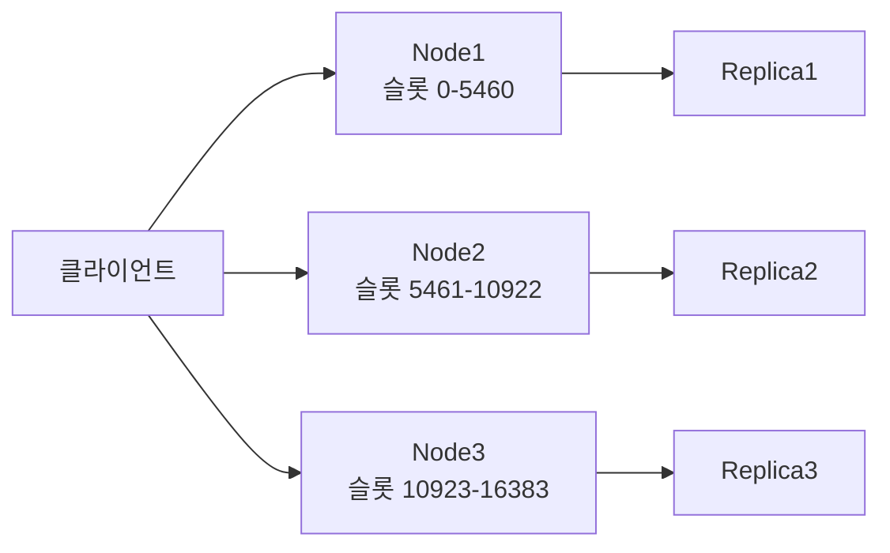

캐시 서버를 도입해야 한다. 검색하면 두 이름이 반드시 나온다. Redis와 Memcached. "그냥 Redis 쓰면 되지 않나요?"라고 묻는 신입 개발자에게 "맞아요, 대부분은요"라고 답하는 것은 절반만 옳다. 이 포스트는 두 시스템의 내부 원리를 해부하고, **어떤 요구사항에서 무엇을 선택해야 하는지**를 명확한 기준으로 제시한다.

---

## 두 시스템의 탄생 배경

Memcached는 2003년 Brad Fitzpatrick이 LiveJournal의 DB 부하를 줄이기 위해 만들었다. 목표는 단 하나 — **빠른 키-값 캐시**. 단순함이 철학이었다. 문자열을 넣고 꺼내는 것, 그것뿐.

Redis는 2009년 Salvatore Sanfilippo가 실시간 로그 분석 시스템을 만들다가 MySQL과 디스크 기반 큐의 한계를 느끼며 만들었다. 목표는 **다양한 자료구조를 메모리에서 빠르게**. Redis는 "Remote Dictionary Server"의 약자다.

> **비유**: Memcached는 편의점 냉장고다. 넣고 꺼내는 것만 한다. 빠르고 단순하다. Redis는 백화점 지하 식품관이다. 냉장 코너, 즉석식품 코너, 주류 코너가 있다. 더 복잡하지만 훨씬 많은 것을 할 수 있다.

---

## 핵심 차이 한눈에 보기

| 항목 | Redis | Memcached |
|------|-------|-----------|
| 자료구조 | String, List, Set, ZSet, Hash, Stream 등 | String(바이트 배열)만 |
| 영속성 | RDB 스냅샷 + AOF 로그 | 없음 (순수 메모리) |
| 클러스터링 | Redis Cluster (샤딩 내장) | 클라이언트 사이드 샤딩 |
| 복제 | Primary-Replica 내장 | 없음 |
| 스레드 모델 | 단일 스레드 이벤트 루프 (I/O 멀티스레드 지원) | 멀티스레드 |
| 트랜잭션 | MULTI/EXEC, Lua 스크립트 | 없음 |
| Pub/Sub | 내장 | 없음 |
| 최대 값 크기 | 512MB | 1MB |
| 라이선스 | BSD (구버전) / SSPL (7.x+) | BSD |
| 메모리 효율 | 오버헤드 있음 (자료구조별) | 더 낮은 오버헤드 |

---

## 자료구조 — 가장 근본적인 차이

### Memcached의 단순함

Memcached는 모든 값을 바이트 배열로 저장한다. 애플리케이션이 직렬화/역직렬화를 전담한다.

```bash
# Memcached 프로토콜 — 텍스트 기반
set user:1001 0 3600 45
{"id":1001,"name":"김철수","email":"kim@example.com"}

get user:1001
VALUE user:1001 0 45
{"id":1001,"name":"김철수","email":"kim@example.com"}
END
```

이렇게 단순하기 때문에 오버헤드가 극도로 낮다. 하지만 "유저의 이메일만 바꾸고 싶다"면 전체 JSON을 꺼내서 수정하고 다시 저장해야 한다. **캐시 전체를 읽어야 부분 업데이트가 가능하다.**

### Redis의 풍부한 자료구조

Redis는 자료구조 자체를 서버 사이드에서 조작한다. 애플리케이션은 의도만 전달하면 된다.

```bash
# Hash — 객체 부분 업데이트
HSET user:1001 email "new@example.com"   # 이메일만 변경
HGET user:1001 name                       # 이름만 조회
HGETALL user:1001                         # 전체 조회

# Sorted Set — 실시간 랭킹
ZADD leaderboard 9500 "player:alice"
ZADD leaderboard 8700 "player:bob"
ZRANGE leaderboard 0 9 REV WITHSCORES   # 상위 10명

# List — 최근 방문 기록 (최대 100개 유지)
LPUSH user:1001:history "product:5001"
LTRIM user:1001:history 0 99
```

> **비유**: Memcached는 택배 박스다. 물건을 넣고 싶으면 새 박스를 다시 포장해야 한다. Redis는 서랍장이다. 첫 번째 서랍만 열어서 양말만 꺼내면 된다.

---

## 영속성 — 데이터를 잃어도 되는가

Memcached는 메모리에만 데이터를 저장한다. 서버가 재시작되면 모든 데이터가 사라진다. 이것은 버그가 아니라 **설계 철학**이다. 캐시는 원본 데이터가 DB에 있어야 하고, 언제든 다시 채울 수 있어야 한다는 전제.

Redis는 두 가지 영속성 메커니즘을 제공한다.

### RDB (Redis Database) 스냅샷

```
# redis.conf
save 900 1     # 900초 안에 1개 이상 변경되면 스냅샷
save 300 10    # 300초 안에 10개 이상 변경되면 스냅샷
save 60 10000  # 60초 안에 10000개 이상 변경되면 스냅샷

dbfilename dump.rdb
dir /var/lib/redis
```

RDB는 **포크(fork)** 기반이다. 자식 프로세스가 현재 메모리 상태를 디스크에 쓰는 동안 부모 프로세스는 계속 요청을 처리한다. Copy-on-Write 덕분에 쓰기가 발생한 페이지만 복사된다.

단점: 마지막 스냅샷 이후 변경된 데이터는 서버 장애 시 유실된다.

### AOF (Append Only File) 로그

```
# redis.conf
appendonly yes
appendfsync everysec  # 1초마다 fsync (성능과 안전성의 균형)
# appendfsync always  # 매 쓰기마다 fsync (가장 안전, 가장 느림)
# appendfsync no      # OS에 맡김 (가장 빠름, 가장 위험)
```

모든 쓰기 명령을 순서대로 파일에 추가한다. 서버 재시작 시 AOF를 재생하여 데이터를 복구한다. `everysec` 설정에서 최대 1초치 데이터 유실 가능.

> **비유**: RDB는 사진이다. 특정 순간을 찍어두지만, 그 이후의 변화는 담지 못한다. AOF는 일기다. 매일 일어난 일을 기록하고, 나중에 다시 읽으면 현재 상태를 재현할 수 있다.

---

## 클러스터링 — 수평 확장 방식의 차이

### Memcached의 클라이언트 사이드 샤딩

Memcached 자체에는 클러스터 기능이 없다. 여러 노드에 데이터를 분산하려면 **클라이언트가 직접 어떤 노드에 저장할지 결정**해야 한다.

```java
// Memcached 클라이언트 — 일관성 해싱으로 노드 선택
MemcachedClient client = new MemcachedClient(
    new KetamaConnectionFactory(),  // 일관성 해싱
    AddrUtil.getAddresses("node1:11211 node2:11211 node3:11211")
);

client.set("user:1001", 3600, userJson);
// 클라이언트가 hash("user:1001") → node2를 결정
```

노드가 추가/제거되면 클라이언트 설정을 바꾸고, 캐시 히트율이 일시적으로 떨어진다. 서버는 아무것도 모른다.

### Redis Cluster의 서버 사이드 샤딩

```
# Redis Cluster — 16384개의 해시 슬롯
# 슬롯 0-5460: node1
# 슬롯 5461-10922: node2
# 슬롯 10923-16383: node3

# 클러스터 생성
redis-cli --cluster create \
  192.168.1.1:7001 192.168.1.2:7002 192.168.1.3:7003 \
  --cluster-replicas 1  # 각 Primary에 Replica 1개
```



클라이언트가 잘못된 노드에 요청하면 Redis가 `MOVED` 응답으로 올바른 노드를 알려준다. 노드 추가 시 슬롯 재분배가 자동으로 이루어진다. **클러스터 토폴로지 관리를 서버가 담당**한다.

---

## 스레드 모델 — 단일 vs 멀티

### Redis의 단일 스레드 이벤트 루프

Redis는 기본적으로 **단일 스레드**로 모든 명령을 처리한다. 경쟁 조건(race condition)이 없어서 별도의 락(lock)이 필요 없다. 모든 명령이 원자적으로 실행된다.

```
# Redis 내부 이벤트 루프 (의사코드)
while true:
    events = epoll_wait(fd_list, timeout)
    for event in events:
        if event.readable:
            command = parse_command(event.fd)
            result = execute_command(command)  # 단일 스레드에서 실행
            write_response(event.fd, result)
```

Redis 6.0부터 I/O 스레드(읽기/쓰기)는 멀티스레드로 처리하지만, 명령 실행 자체는 여전히 단일 스레드다.

> **비유**: Redis는 뛰어난 요리사 한 명이 모든 주문을 처리하는 주방이다. 동시에 두 가지를 못 하는 대신, 재료가 섞이는 사고(레이스 컨디션)가 절대 일어나지 않는다.

### Memcached의 멀티스레드

Memcached는 처음부터 멀티스레드로 설계되었다. 워커 스레드가 병렬로 요청을 처리한다. CPU 코어를 풀 활용할 수 있다.

```
# Memcached 시작 — 스레드 수 지정
memcached -t 8 -m 4096 -p 11211
# -t 8: 워커 스레드 8개
# -m 4096: 최대 메모리 4GB
```

단순한 키-값 저장/조회에서는 멀티스레드가 유리하다. 하지만 Redis도 파이프라이닝으로 처리량을 크게 높일 수 있어서 실제 차이는 생각보다 작다.

---

## 메모리 관리 — Slab Allocator vs jemalloc

### Memcached의 Slab Allocator

Memcached는 메모리 단편화를 막기 위해 **Slab Allocator**를 사용한다. 메모리를 고정 크기의 슬랩(slab)으로 나누고, 각 슬랩은 동일 크기의 청크(chunk)를 담는다.

```
Slab Class 1:  청크 크기 96B   → 88B 이하 아이템 저장
Slab Class 2:  청크 크기 120B  → 89-112B 아이템 저장
Slab Class 3:  청크 크기 152B  → 113-144B 아이템 저장
...
Slab Class 42: 청크 크기 1MB   → 최대 크기
```

장점: 메모리 단편화 거의 없음, 할당/해제 빠름.
단점: 아이템 크기가 슬랩 경계에 맞지 않으면 내부 단편화 발생. 예를 들어 90바이트 아이템이 120바이트 슬랩에 들어가면 30바이트 낭비.

### Redis의 jemalloc

Redis는 `jemalloc`(Facebook이 개선한 메모리 할당자)을 사용한다. 요청한 크기에 맞게 동적으로 할당한다. Slab처럼 고정 경계가 없어 내부 단편화가 적지만, 복잡한 자료구조 탓에 전체 메모리 사용량은 더 클 수 있다.

```bash
# Redis 메모리 사용량 상세 분석
redis-cli INFO memory

# 주요 지표
used_memory:104857600          # 실제 사용 메모리
used_memory_rss:125829120      # OS가 할당한 메모리 (RSS)
mem_fragmentation_ratio:1.20   # 1.0~1.5 정상, 1.5 초과 시 단편화 문제
```

---

## 성능 벤치마크

Redis와 Memcached의 순수 키-값 성능은 비슷하다. 실제 벤치마크 결과를 보자.

```bash
# redis-benchmark — Redis 자체 도구
redis-benchmark -h 127.0.0.1 -p 6379 -n 1000000 -c 100 \
  -t SET,GET --pipeline 16

# 결과 (일반적인 환경)
# SET: ~500,000 ops/sec
# GET: ~600,000 ops/sec

# memtier_benchmark — Memcached/Redis 공통 도구
memtier_benchmark -s 127.0.0.1 -p 11211 \
  --protocol=memcache_text -n 100000 -c 50 -t 4

# Memcached 결과 (같은 환경)
# SET: ~600,000 ops/sec
# GET: ~700,000 ops/sec
```

단순 SET/GET에서 Memcached가 약간 앞서는 경우가 많다. 멀티스레드 덕분에 CPU 코어가 많을수록 Memcached가 유리해진다. 하지만 **현실 서비스에서 이 차이가 병목이 되는 경우는 드물다.** 네트워크 레이턴시, 연결 풀 크기, 직렬화 오버헤드가 훨씬 큰 변수다.

---

## 운영 복잡도

### Memcached 운영

```bash
# 설치 및 시작 — 극도로 단순
apt install memcached
memcached -m 2048 -p 11211 -u memcache -d

# 모니터링
echo "stats" | nc 127.0.0.1 11211
echo "stats items" | nc 127.0.0.1 11211
echo "stats slabs" | nc 127.0.0.1 11211
```

설정 옵션이 몇 십 개뿐이다. 튜닝할 것이 거의 없다. 장애 포인트도 적다.

### Redis 운영

```bash
# redis.conf — 수백 개의 설정 옵션 중 핵심만
maxmemory 2gb
maxmemory-policy allkeys-lru    # 메모리 초과 시 LRU로 제거

# 영속성 설정
save 900 1
appendonly yes
appendfsync everysec

# 보안
requirepass your_strong_password
bind 127.0.0.1

# 느린 쿼리 로깅
slowlog-log-slower-than 10000  # 10ms 이상 명령 기록
slowlog-max-len 128
```

```bash
# Redis Cluster 운영 — 상태 확인
redis-cli --cluster check 192.168.1.1:7001
redis-cli --cluster rebalance 192.168.1.1:7001

# 슬롯 재분배
redis-cli --cluster reshard 192.168.1.1:7001
```

Redis는 설정, 모니터링, 클러스터 관리, 영속성 관리, 복제 관리가 필요하다. 운영 부담이 훨씬 크다.

> **비유**: Memcached 운영은 전자레인지를 다루는 것이다. 시간 맞추고 시작 버튼 누르면 된다. Redis 운영은 복합 오븐을 다루는 것이다. 컨벡션, 스팀, 그릴 모드가 있고, 각 설정이 잘못되면 음식이 타거나 설익는다.

---

## Eviction 정책 비교

### Memcached의 LRU

Memcached는 단일 LRU(Least Recently Used) 알고리즘을 사용한다. 메모리가 가득 차면 가장 오래 사용되지 않은 아이템부터 제거한다. 슬랩 클래스 단위로 LRU를 관리한다.

### Redis의 다양한 Eviction 정책

```bash
# maxmemory-policy 옵션
noeviction        # 메모리 초과 시 오류 반환 (기본값)
allkeys-lru       # 전체 키 중 LRU 제거 (가장 일반적)
volatile-lru      # TTL 있는 키 중 LRU 제거
allkeys-random    # 전체 키 중 무작위 제거
volatile-random   # TTL 있는 키 중 무작위 제거
volatile-ttl      # TTL이 가장 짧은 키부터 제거
allkeys-lfu       # 전체 키 중 LFU 제거 (Redis 4.0+)
volatile-lfu      # TTL 있는 키 중 LFU 제거 (Redis 4.0+)
```

LFU(Least Frequently Used)는 접근 빈도 기반이다. 오래됐지만 자주 쓰이는 핫 데이터를 보호하는 데 유리하다.

---

## 상황별 선택 가이드

### Redis를 선택해야 할 때

1. **단순 캐시 이상의 기능이 필요한 경우**
   - 실시간 랭킹 (Sorted Set)
   - 세션 + 세션 내 데이터 구조 (Hash)
   - 큐나 스택 (List)
   - 고유 방문자 수 (HyperLogLog)
   - 근접 검색 (Geo)

2. **데이터 유실을 감당할 수 없는 경우** (영속성 필요)

3. **분산 락이 필요한 경우** (Redlock 알고리즘)

4. **Pub/Sub 메시징이 필요한 경우**

5. **트랜잭션이 필요한 경우** (MULTI/EXEC)

```java
// Redis로 분산 락 구현
@Service
public class DistributedLockService {
    private final StringRedisTemplate redisTemplate;

    public boolean tryLock(String lockKey, String lockValue, long ttlSeconds) {
        Boolean result = redisTemplate.opsForValue()
            .setIfAbsent(lockKey, lockValue, Duration.ofSeconds(ttlSeconds));
        return Boolean.TRUE.equals(result);
    }

    public void unlock(String lockKey, String lockValue) {
        // Lua 스크립트로 원자적 비교-삭제
        String script = """
            if redis.call('get', KEYS[1]) == ARGV[1] then
                return redis.call('del', KEYS[1])
            else
                return 0
            end
            """;
        redisTemplate.execute(
            new DefaultRedisScript<>(script, Long.class),
            List.of(lockKey), lockValue
        );
    }
}
```

### Memcached를 선택해야 할 때

1. **순수 캐시 레이어만 필요한 경우** — DB 부하 감소가 유일한 목적
2. **메모리 효율이 최우선인 경우** — 동일 메모리에 더 많은 아이템 캐시
3. **멀티스레드로 CPU를 최대 활용해야 하는 경우**
4. **운영 단순성이 중요한 경우** — 작은 팀, 단순한 인프라
5. **값이 항상 단순 문자열/JSON인 경우**

```python
# Python — Memcached 단순 캐시 패턴
import pymemcache
import json

client = pymemcache.Client(('localhost', 11211), default_noreply=False)

def get_user(user_id: int):
    cache_key = f"user:{user_id}"

    # 캐시 히트
    cached = client.get(cache_key)
    if cached:
        return json.loads(cached)

    # 캐시 미스 — DB 조회 후 캐시 저장
    user = db.query_user(user_id)
    client.set(cache_key, json.dumps(user), expire=3600)
    return user
```

---

## 극한 시나리오

### 시나리오 1: Black Friday — 초당 100만 요청

대형 이커머스에서 블랙프라이데이 프로모션. 상품 상세 페이지가 초당 100만 요청.

**Memcached 전략**: 4코어 서버에서 `-t 4` 멀티스레드. 단순 JSON 캐시. 직렬화 오버헤드 최소화. 이 시나리오에서는 Memcached가 유리할 수 있다.

**Redis 전략**: 파이프라이닝으로 네트워크 왕복 최소화. Redis Cluster로 수평 확장. Sorted Set으로 핫 상품 랭킹 동시 제공.

```java
// Redis 파이프라이닝 — 100개 요청을 1번의 네트워크 왕복으로
List<String> productIds = List.of("p1", "p2", ..., "p100");

List<Object> results = redisTemplate.executePipelined(
    (RedisCallback<Object>) connection -> {
        for (String id : productIds) {
            connection.stringCommands().get(("product:" + id).getBytes());
        }
        return null;
    }
);
```

### 시나리오 2: 메모리 폭발 — OOM 직전

Redis 노드 메모리가 95%에 도달했다. `allkeys-lru` 정책이 동작하며 캐시 키를 제거하기 시작했다. 그런데 제거되는 키가 핫 데이터다.

```bash
# 원인 분석
redis-cli OBJECT FREQ hot-key  # LFU 접근 빈도 확인
redis-cli DEBUG SLEEP 0        # 이벤트 루프 상태 확인
redis-cli INFO stats | grep evicted_keys  # 제거된 키 수
```

해결책: `allkeys-lru` → `allkeys-lfu` 전환. LFU는 최근성이 아닌 빈도 기반이므로 핫 데이터를 보호한다.

### 시나리오 3: Memcached 노드 장애 — 캐시 스탬피드

Memcached 노드 1개가 다운. 해당 노드의 모든 키가 캐시 미스. 수천 개의 요청이 동시에 DB로 쏟아진다. DB가 과부하로 다운 위기.

```python
# 캐시 스탬피드 방어 — 확률적 조기 재계산 (XFetch)
import random
import time

def get_with_xfetch(key, ttl, compute_fn, beta=1.0):
    cached = client.get(key)
    if cached:
        value, expiry = cached
        # 남은 TTL이 짧고, 확률적으로 조기 재계산
        remaining_ttl = expiry - time.time()
        if remaining_ttl - beta * math.log(random.random()) < 0:
            # 갱신 타이밍 — 한 요청만 먼저 갱신
            value = compute_fn()
            client.set(key, (value, time.time() + ttl), expire=ttl)
        return value

    # 완전한 캐시 미스
    value = compute_fn()
    client.set(key, (value, time.time() + ttl), expire=ttl)
    return value
```

Redis였다면 `SET NX EX`로 락을 잡고, 하나의 프로세스만 DB를 조회하게 할 수 있다.

---

## 하이브리드 전략

대규모 시스템에서는 두 가지를 동시에 쓰는 경우도 있다.

```
[애플리케이션]
      |
      ├─── [Memcached] — 대용량 정적 콘텐츠 캐시 (CDN 오리진 캐시)
      |                   순수 키-값, 높은 히트율, 낮은 메모리 오버헤드
      |
      └─── [Redis] ────── 세션, 분산 락, 실시간 카운터, 랭킹
                          구조화된 데이터, 영속성 필요 데이터
```

하지만 현실적으로 두 시스템을 운영하면 인프라 복잡도가 두 배다. **대부분의 팀에서 Redis 하나로 시작하고, 극한의 캐시 성능이 필요할 때만 Memcached를 고려하는 것이 실용적이다.**

---

## Pub/Sub — Redis만의 기능

Memcached에는 Pub/Sub 기능이 전혀 없다. Redis는 채널 기반의 메시지 발행/구독을 내장한다.

```java
// Spring Data Redis — Pub/Sub
@Configuration
public class RedisPubSubConfig {

    @Bean
    public RedisMessageListenerContainer redisMessageListenerContainer(
            RedisConnectionFactory connectionFactory,
            MessageListenerAdapter listenerAdapter) {
        RedisMessageListenerContainer container = new RedisMessageListenerContainer();
        container.setConnectionFactory(connectionFactory);
        // "notifications" 채널 구독
        container.addMessageListener(listenerAdapter,
            new PatternTopic("notifications.*"));  // 패턴 구독
        return container;
    }

    @Bean
    public MessageListenerAdapter listenerAdapter(NotificationSubscriber subscriber) {
        return new MessageListenerAdapter(subscriber, "handleMessage");
    }
}

@Component
public class NotificationSubscriber {
    public void handleMessage(String message, String channel) {
        log.info("채널 {}: 메시지 수신 — {}", channel, message);
        // 실시간 알림, 캐시 무효화, 설정 변경 전파 등
    }
}

// 발행
@Service
public class NotificationPublisher {
    @Autowired
    private StringRedisTemplate redisTemplate;

    public void publish(String channel, String message) {
        redisTemplate.convertAndSend(channel, message);
    }
}
```

Redis Pub/Sub의 주요 활용:
- **캐시 무효화 전파**: 한 서버가 캐시를 갱신하면 전체 서버에 알림
- **실시간 알림**: WebSocket 서버 여러 대에 이벤트 브로드캐스트
- **설정 변경 전파**: 피처 플래그, 설정값 실시간 배포

> **비유**: Redis Pub/Sub는 방송국이다. 채널을 개설하고 메시지를 송출하면, 그 채널을 구독한 모든 수신자가 동시에 받는다. Memcached는 방송 기능이 없는 창고다.

단, Redis Pub/Sub는 메시지를 보존하지 않는다. 구독자가 없을 때 발행된 메시지는 유실된다. 내구성이 필요하면 Redis Streams를 사용해야 한다.

---

## 보안 설정 비교

### Memcached 보안의 한계

Memcached는 기본적으로 인증이 없다. 네트워크 접근 제어가 유일한 방어선이다.

```bash
# Memcached — 인증 없음, 바인딩으로만 보호
memcached -l 127.0.0.1 -p 11211  # localhost만 허용

# SASL 인증 (선택적, 활성화 필요)
memcached -S  # SASL 활성화 (별도 빌드 필요)
```

Memcached가 공개 네트워크에 노출되면 누구나 데이터를 읽고 쓸 수 있다. 2018년 Memcached를 이용한 대규모 DDoS 증폭 공격(memcrashed)이 발생했다. Memcached를 반드시 내부 네트워크에서만 운영해야 하는 이유다.

### Redis 보안 설정

```bash
# redis.conf — 다층 보안
# 1. 바인딩 주소 제한
bind 127.0.0.1 192.168.1.10  # 특정 인터페이스만 수신

# 2. 비밀번호 인증 (Redis 6.0 이전 단일 비밀번호)
requirepass your_strong_password_here

# 3. ACL — 사용자별 권한 제어 (Redis 6.0+)
# redis.conf 또는 ACL 파일
aclfile /etc/redis/users.acl
```

```bash
# ACL 설정 예시
# users.acl
# 관리자 계정 — 모든 권한
user admin on >adminpassword ~* &* +@all

# 읽기 전용 계정 — GET, HGET 등만 허용
user readonly on >readpassword ~* &* +@read

# 특정 키 패턴만 접근 가능한 서비스 계정
user order-service on >svcpassword ~order:* &* +@read +@write -@dangerous
```

```java
// Spring Boot — Redis ACL 사용자 설정
spring:
  data:
    redis:
      host: redis-host
      port: 6379
      username: order-service     # ACL 사용자
      password: svcpassword
      ssl:
        enabled: true             # TLS 암호화
```

Redis 6.0+의 ACL은 사용자별로 접근 가능한 키 패턴, 허용 명령어를 세밀하게 제어한다. 마이크로서비스 환경에서 각 서비스가 자신의 키 공간만 접근하도록 제한할 수 있다.

---

## 면접 포인트

### Q. Redis와 Memcached의 가장 큰 차이점은 무엇인가요?

자료구조의 풍부함입니다. Memcached는 문자열 키-값만 지원하는 반면, Redis는 List, Set, Sorted Set, Hash, Stream 등을 서버 사이드에서 직접 조작할 수 있습니다. 이 차이가 분산 락, 실시간 랭킹, 세션 관리 등 Memcached로는 구현하기 어려운 기능을 Redis로는 자연스럽게 구현하게 합니다. 영속성과 복제도 Redis만의 특성입니다.

### Q. Redis가 단일 스레드인데 왜 빠른가요?

Redis의 병목은 CPU 연산이 아니라 네트워크 I/O와 메모리 접근입니다. 모든 데이터가 메모리에 있어서 디스크 I/O가 없고, 단일 스레드 덕분에 컨텍스트 스위칭과 락 오버헤드가 없습니다. `epoll` 기반 이벤트 루프로 수만 개의 동시 연결을 효율적으로 처리합니다. Redis 6.0부터 I/O 처리는 멀티스레드로 분리하여 네트워크 처리 속도를 더 높였습니다.

### Q. Redis Cluster에서 MOVED 응답이란 무엇인가요?

Redis Cluster는 16384개의 해시 슬롯으로 키를 분산합니다. 클라이언트가 잘못된 노드에 요청하면, 해당 노드는 `MOVED slot 192.168.1.2:7002` 형태로 올바른 노드 주소를 응답합니다. Smart 클라이언트는 이 정보를 로컬에 캐싱하여 다음 요청부터는 올바른 노드로 직접 접근합니다.

### Q. Memcached Slab Allocator의 단점은 무엇인가요?

내부 단편화입니다. 90바이트 아이템이 120바이트 슬랩에 들어가면 30바이트가 낭비됩니다. 또한 특정 슬랩 클래스가 다른 슬랩에 여유 메모리가 있어도 재사용하지 못하는 문제가 있습니다. `slab_reassign` 기능으로 슬랩 간 메모리 이동이 가능하지만, 완전한 해결책은 아닙니다.

### Q. Redis AOF와 RDB를 함께 쓰는 이유는?

RDB는 복구 속도가 빠르지만 마지막 스냅샷 이후 데이터를 잃습니다. AOF는 최대 1초치만 잃지만 재생 시간이 깁니다. 함께 쓰면(AOF 우선 사용, RDB로 주기적 백업) 복구 안전성과 속도를 모두 확보할 수 있습니다. Redis 7.0부터 RDB와 AOF를 하나의 파일로 합친 **RDB-AOF 혼합 모드**가 기본값이 되었습니다.

---

## 결론 — 선택 기준 요약

대부분의 상황에서 **Redis가 올바른 선택**이다. 자료구조, 영속성, 클러스터링, 복제, Pub/Sub, 분산 락까지 현대 웹 서비스에서 캐시 레이어에 요구하는 것들을 모두 제공한다.

**Memcached가 유리한 조건**은 명확하다: 값이 항상 단순한 문자열/JSON이고, 서버 재시작 시 데이터 유실을 완전히 허용하며, 운영 단순성이 최우선이고, 멀티코어 CPU를 캐시 처리량에 최대한 활용해야 할 때다.

새로운 시스템을 설계한다면 Redis로 시작하라. 단순함이 필요한 특수 상황에서 Memcached를 추가하라.
