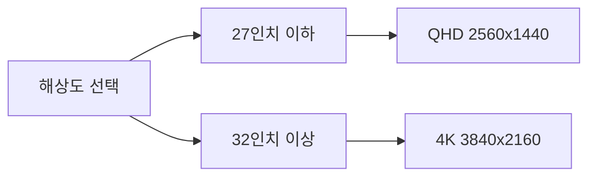
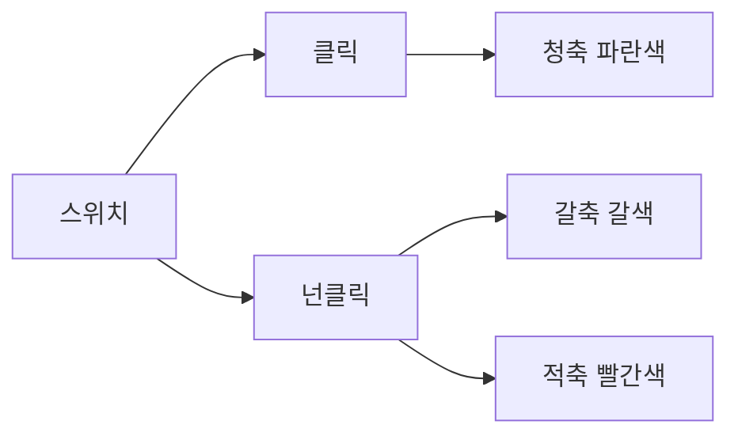
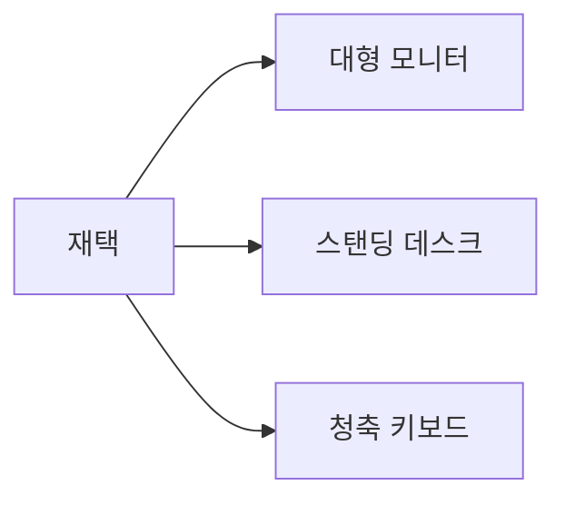
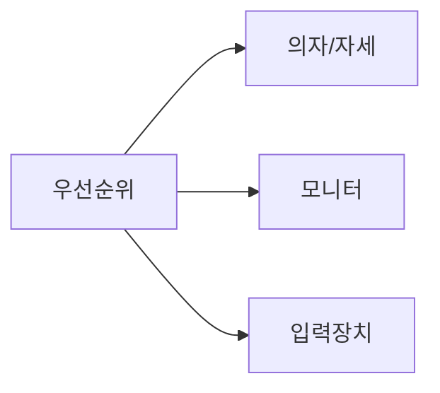

개발자에게 데스크 환경은 단순한 취향의 문제가 아니다. 하루 8~10시간을 보내는 공간인 만큼, 잘못된 셋업은 생산성 저하는 물론 허리·목·손목 부상으로 이어진다. 반대로 잘 구성된 환경은 집중력을 높이고 장기적으로 개발자 수명을 늘린다.

이 글에서는 모니터, 키보드, 마우스, 의자, 모니터 암, 조명, 노이즈캔슬링 헤드폰까지 카테고리별로 깊이 있게 다루고, 예산별 추천 조합까지 제시한다.

> **비유:** 데스크 셋업은 주방 구성과 같다. 좋은 칼과 도마가 있어야 요리가 빨라지듯, 좋은 장비가 있어야 개발이 편해진다. 단, 재료(실력)가 없으면 장비만으로는 요리가 되지 않는다.

---

## 1. 모니터 — 개발자의 창문

모니터는 데스크 장비 중 체감 효과가 가장 큰 항목이다. 화면이 넓고 선명할수록 코드 가독성이 높아지고 멀티태스킹이 편해진다.

### 해상도 선택 기준

**FHD (1920×1080)**: 24인치 이하에서는 충분하지만 27인치 이상에서는 픽셀이 보여 텍스트가 뭉개진다. 개발자에게는 비추천.

**QHD (2560×1440)**: 27~32인치에 최적이다. 성능 대비 가격이 가장 좋고, M2/M3 맥북이나 중급 GPU로도 무난하게 구동된다. 개발자 첫 업그레이드 시 가장 합리적인 선택이다.

**4K (3840×2160)**: 32인치 이상에서 진가를 발휘한다. 텍스트가 인쇄물처럼 선명하고 여러 창을 동시에 펼쳐도 넉넉하다. 단, GPU 부담이 있고 macOS 스케일링과 궁합이 좋다.

**5K (5120×2880)**: Apple Studio Display와 LG UltraFine 5K가 대표적이다. 레티나 수준의 선명함이지만 가격이 높다.

### 패널 종류

**IPS (In-Plane Switching)**: 색재현율이 높고 시야각이 넓다. 코딩, 디자인 모두에 무난하다. 개발자 표준 선택.

**VA (Vertical Alignment)**: 명암비가 높아 어두운 테마 코딩 환경에서 유리하다. 색 정확도는 IPS보다 떨어진다.

**OLED**: 완벽한 블랙, 무한 명암비. 번인 우려가 있지만 최신 제품에서는 많이 개선되었다. 다크모드 중심 개발자에게 최고의 경험.

### 크기와 개수

- **단일 27인치**: 집중도가 가장 높다. 외부 미팅이 많거나 집중 작업 비중이 높은 개발자에게 적합.
- **듀얼 27인치**: 코드 + 브라우저/터미널을 나란히 띄우는 표준 개발 셋업.
- **단일 34인치 울트라와이드**: 듀얼 모니터의 대안. 베젤 없이 넓은 화면을 쓸 수 있다. 세 개의 창을 동시에 띄우기에 최적이다.

### 추천 모델

| 모델 | 해상도 | 크기 | 가격대 |
|---|---|---|---|
| LG 27UK850 | 4K IPS | 27인치 | 40만원대 |
| Dell U2722D | QHD IPS | 27인치 | 50만원대 |
| LG 34WQ75C | WQHD IPS | 34인치 울트라와이드 | 60만원대 |
| Samsung Odyssey OLED G8 | 4K OLED | 32인치 | 90만원대 |
| Apple Studio Display | 5K | 27인치 | 230만원대 |

---

## 2. 키보드 — 손끝의 악기

키보드는 개발자가 하루에 수만 번 터치하는 장비다. 타이핑 감과 소음, 레이아웃이 생산성과 건강에 직결된다.

> **비유:** 키보드는 피아니스트의 피아노 건반과 같다. 건반의 무게와 반응이 연주 품질을 결정하듯, 키보드의 스위치가 코딩 효율을 결정한다.

### 기계식 스위치 종류

**청축 (Blue/Clicky)**: 딸깍 소리와 명확한 촉각 피드백. 사무실에서는 민폐. 집에서 혼자 쓰는 개발자에게 타이핑 만족감 최고.

**갈축 (Brown/Tactile)**: 소리 없는 촉각 피드백. 클릭과 조용함의 타협점. 사무실과 집 모두에서 무난하다. 기계식 입문자에게 가장 많이 추천.

**적축 (Red/Linear)**: 촉각 피드백 없이 부드럽게 눌린다. 소음이 가장 적고 게이밍에 인기. 장시간 타이핑 시 실수율이 높을 수 있다.

**저소음 적축/갈축**: 기계식 스위치에 소음 저감 패드가 추가된 버전. 사무실 필수 선택.

### 레이아웃 선택

**풀배열 (Full, 100%)**: 숫자 패드 포함. 데이터 입력이 많거나 엑셀을 자주 쓰는 개발자에게 적합. 단, 마우스와 손 이동 거리가 멀다.

**텐키리스 (TKL, 80%)**: 숫자 패드 제거. 마우스와의 간격이 좁아져 어깨가 덜 벌어진다. 개발자에게 가장 인기 있는 레이아웃.

**65%**: 방향키만 남기고 F열까지 제거. 매우 컴팩트해 이동성이 높다. 단축키 조합을 외워야 해 러닝커브가 있다.

**인체공학형 (Split)**: 키보드를 두 쪽으로 분리해 어깨와 손목 각도를 자연스럽게 유지한다. Kinesis Advantage, ZSA Moonlander가 대표적.

### 추천 모델

| 모델 | 스위치 | 레이아웃 | 특징 | 가격대 |
|---|---|---|---|---|
| Leopold FC900R | 갈축/적축 | 풀배열 | 빌드 품질 최고 | 15만원대 |
| HHKB Professional Hybrid | 도파 스위치 | 60% | 타이핑감 전설급 | 30만원대 |
| Keychron K2 | 갈축/적축 | 75% | Mac 호환, 무선 | 10만원대 |
| ZSA Moonlander | 다양 | Split | 인체공학 최상 | 50만원대 |
| Logitech MX Keys | 팬터그래프 | 풀배열 | 조용하고 멀티기기 | 12만원대 |

---

## 3. 마우스 — 정밀한 손의 연장

개발자는 디자이너만큼 마우스를 많이 쓰지는 않지만, 브라우저 디버깅, IDE 클릭, 코드 리뷰 등에서 마우스 품질이 피로도에 영향을 준다.

### 인체공학 마우스

손목을 세워서 잡는 버티컬 마우스는 손목 회내전을 줄여 손목터널 증후군을 예방한다. 처음에는 어색하지만 2주 정도 지나면 적응된다.

**Logitech MX Vertical**: 버티컬 마우스의 표준. 마감이 좋고 MX Anywhere 시리즈와 같은 감도를 제공한다.

**Logitech MX Master 3**: 버티컬은 아니지만 엄지 바퀴와 수평 스크롤이 편리하다. 개발자 여론조사에서 항상 상위권에 오른다.

### DPI와 민감도

개발자는 게이머만큼 높은 DPI가 필요 없다. 800~1600 DPI에서 정확도가 높다. 듀얼 모니터 환경에서는 2000~3000 DPI도 유용하다.

### 무선 vs 유선

무선 마우스가 책상 정리에 유리하다. Logitech의 Bolt 수신기는 지연이 유선과 거의 동일하다. 배터리 교체형보다 충전식을 선택하면 편리하다.

---

## 4. 의자 — 척추의 수호자

의자는 데스크 장비 중 건강에 가장 직접적인 영향을 미친다. 저렴한 의자를 쓰다 허리 디스크 수술을 받으면 의자값보다 훨씬 많이 쓰게 된다.

> **비유:** 의자는 개발자의 발판이다. 10년을 매일 올라설 발판이라면 튼튼한 것을 사야 한다.

### 핵심 기능

**요추 지지대**: 허리 곡선을 받쳐주는 것이 가장 중요하다. 높이와 깊이가 조절되는 제품이 좋다.

**좌판 깊이 조절**: 키가 크거나 다리가 긴 사람은 좌판 깊이를 늘려야 허벅지 압박이 줄어든다.

**팔걸이 (4D)**: 높이, 앞뒤, 좌우, 각도 조절이 모두 되는 4D 팔걸이가 이상적이다. 팔걸이에 팔을 올리면 어깨 긴장이 줄어든다.

**메시 vs 쿠션**: 메시는 통기성이 좋고 여름에 쾌적하다. 쿠션은 충격 흡수가 좋지만 장시간 사용 시 더울 수 있다.

### 추천 의자

**허먼밀러 Aeron**: 세계에서 가장 유명한 오피스 체어. 메시 소재, 8Z 펠리클로 체중을 균등 분산. PostureFit SL이 천골과 요추를 동시에 지지한다. 가격은 200만원 이상이지만 12년 보증이 있다.

**시디즈 T80 Plus**: 한국 인체공학 의자 시장 1위. 헤드레스트 포함 요추 지지가 훌륭하다. 허먼밀러의 절반 가격으로 비슷한 기능을 제공한다. 80만원대.

**Steelcase Leap**: 허먼밀러 Aeron과 양대산맥. 등판이 사용자 등 움직임을 따라 굽혀진다. 장시간 앉아있을 때 더 자연스럽다는 평이 많다.

**시디즈 T50**: 입문용 인체공학 의자. 30만원대에서 요추 지지와 기본 조절이 가능하다.

**DXRacer / 게이밍 체어**: 허리 지지가 부족하고 장시간 착용이 불편한 경우가 많다. 외관은 멋있지만 개발자 장시간 착석에는 비추천.

### 올바른 착석 자세

1. 발이 바닥에 평평하게 닿아야 한다
2. 무릎 각도는 90~110도
3. 허리 곡선이 요추 지지대에 닿아야 한다
4. 팔꿈치가 키보드 높이와 같아야 한다
5. 모니터 상단이 눈높이와 같거나 약간 아래

---

## 5. 모니터 암 — 공간 확보와 자세 교정

모니터 스탠드를 제거하고 암으로 교체하면 책상 면적이 넓어지고 모니터 위치 조절이 자유로워진다.

### 가스형 vs 스프링형

**가스 리프트형**: 가스 압력으로 모니터를 지탱한다. 조작이 부드럽고 조용하다. Ergotron LX, Brateck가 대표적.

**스프링형**: 스프링 장력으로 지탱한다. 시간이 지나면 처짐이 발생할 수 있다.

### 추천 모델

**Ergotron LX**: 모니터 암의 교과서. 움직임이 부드럽고 내구성이 높다. 6~9kg 모니터까지 지원한다. 가격 15만원대.

**Brateck Premium**: 가성비 최고. 대부분의 기능을 제공하면서 절반 가격. 5만원대.

**HP Single Arm**: 삼성 모니터와 세트로 자주 구성된다. 무난한 선택.

### 설치 시 주의사항

- 책상 상판 두께가 10~70mm 범위인지 확인
- 모니터 VESA 마운트 규격(75×75 또는 100×100mm) 확인
- 모니터 무게가 암 지원 한도 내인지 확인

---

## 6. 조명 — 눈의 피로를 결정하는 변수

### 모니터 글레어와 배경 조명

모니터 배경이 너무 어두우면 명암 대비가 커져 눈이 피로해진다. 모니터 뒤에 바이어스 라이트(Bias Light)를 설치하면 눈 피로를 줄일 수 있다.

**Elgato Key Light**: 스트리머들이 많이 쓰는 스튜디오 조명. 색온도와 밝기를 앱으로 조절 가능. 개발자도 화상회의 환경 개선에 유용하다.

**필립스 Hue 그라데이션 라이트스트립**: TV나 모니터 뒤에 붙이는 LED 스트립. 색온도를 낮에는 높게, 저녁에는 낮게 자동 조절하면 멜라토닌 분비 방해를 줄인다.

### 데스크 스탠드

독서등 형태의 데스크 스탠드는 키보드 영역을 밝혀 눈의 피로를 줄인다.

**BenQ ScreenBar**: 모니터 상단에 걸치는 형태로 책상 공간을 차지하지 않는다. 주변 조도를 감지해 자동 조절한다. 8만원대.

**BenQ ScreenBar Halo**: ScreenBar에 후면 글로우 기능이 추가된 버전. 바이어스 라이트 역할을 겸한다.

---

## 7. 노이즈 캔슬링 헤드폰 — 집중의 방어막

오픈 플랜 사무실이나 카페에서 일하는 개발자에게 노이즈 캔슬링 헤드폰은 집중력을 지키는 필수 장비다.

> **비유:** 노이즈 캔슬링 헤드폰은 개발자의 투명 방음 유리 칸막이다. 주변은 보이지만 소리는 차단되어 자신만의 공간을 만들어준다.

### 주요 제품 비교

**Sony WH-1000XM5**: 노이즈 캔슬링 성능과 음질 모두 최상급. 30시간 배터리. 접히지 않아 휴대성이 아쉽다. 35만원대.

**Bose QuietComfort 45**: 착용감이 가장 편안하다는 평가가 많다. 장시간 착용 피로감이 낮다. 35만원대.

**Apple AirPods Max**: 애플 생태계 사용자에게 최적화. 공간 음향, H1 칩의 빠른 전환. 80만원대로 가격이 높다.

**Jabra Evolve2 85**: 업무 특화형. 마이크 품질이 최고 수준이어서 화상회의가 많은 개발자에게 적합하다. 40만원대.

### 인이어 vs 오버이어

**인이어 (AirPods Pro 등)**: 이동성이 높고 가볍다. 장시간 착용 시 귀 안 통증이 생길 수 있다.

**오버이어**: 장시간 착용이 편하고 음질이 좋다. 무겁지만 집이나 고정 사무실에서는 최선.

---

## 8. 추가 주변기기

### KVM 스위치

회사 노트북과 개인 맥을 하나의 모니터·키보드·마우스로 전환해 쓰고 싶다면 KVM 스위치가 필수다.

**Ugreen KVM Switch**: USB-C 4K 지원 KVM. 버튼 하나로 전환된다. 5만원대.

### USB-C 허브 / 도크

노트북 포트가 부족할 때 도크로 확장한다.

**Anker 13-in-1 USB-C Hub**: HDMI 2포트, USB 3.0, SD카드, 이더넷 등 올인원. 10만원대.

**CalDigit TS4**: Mac Studio급 독립 독 스테이션. Thunderbolt 4 지원. 40만원대.

### 손목 받침대

키보드 앞에 손목 패드를 두면 손목 각도가 완만해져 손목 피로가 줄어든다.

**Grifiti Band 17**: 얇고 단단한 폼. 손목이 너무 올라가지 않도록 낮은 것을 선택한다.

### 케이블 관리

케이블이 엉킨 책상은 집중력을 흐린다.

- 케이블 트레이: 책상 아래 고정
- 케이블 클립: 모니터 암에 케이블 고정
- 전동 드라이버로 책상 아래 케이블 관리함 고정

---

## 9. 예산별 추천 조합

### 50만원 조합 — 입문 셋업

| 항목 | 제품 | 가격 |
|---|---|---|
| 모니터 | LG 27MP60G (FHD 27인치) | 15만원 |
| 키보드 | Keychron K2 갈축 | 8만원 |
| 마우스 | Logitech M705 | 5만원 |
| 의자 | 시디즈 T50 | 20만원 |
| 조명 | 일반 스탠드 | 2만원 |
| **합계** | | **50만원** |

이 조합은 이전 환경에서 크게 업그레이드되는 체감을 준다. 특히 인체공학 의자는 장기적 건강 투자다.

---

### 100만원 조합 — 균형 셋업

| 항목 | 제품 | 가격 |
|---|---|---|
| 모니터 | Dell U2722D (QHD 27인치) | 50만원 |
| 키보드 | Leopold FC750R 갈축 | 13만원 |
| 마우스 | Logitech MX Master 3 | 12만원 |
| 의자 | 시디즈 T80 (기본) | 60만원 |
| 모니터 암 | Brateck Premium | 5만원 |
| 조명 | BenQ ScreenBar | 8만원 |
| **합계** | | **148만원** |

100만원 예산에서 의자와 모니터에 집중 투자하는 것이 효율적이다.

---

### 200만원 조합 — 프리미엄 셋업

| 항목 | 제품 | 가격 |
|---|---|---|
| 모니터 | LG 34WQ75C (울트라와이드) | 65만원 |
| 키보드 | HHKB Professional Hybrid | 32만원 |
| 마우스 | Logitech MX Master 3S | 14만원 |
| 의자 | 시디즈 T80 Plus | 85만원 |
| 모니터 암 | Ergotron LX | 15만원 |
| 조명 | BenQ ScreenBar Halo | 15만원 |
| 헤드폰 | Sony WH-1000XM5 | 35만원 |
| **합계** | | **261만원** |

200만원 이상 셋업에서는 울트라와이드 모니터와 최상급 의자, 헤드폰까지 갖추어 거의 최상의 환경이 완성된다.

---

## 10. 책상 선택 — 셋업의 토대

모든 장비를 올려두는 책상 자체도 중요하다. 특히 전동 스탠딩 데스크는 장시간 앉아 일하는 개발자의 건강을 크게 개선한다.

### 스탠딩 데스크의 효과

장시간 앉아있으면 하체 혈액순환이 나빠지고 허리에 압력이 집중된다. 하루 2~3회, 각 30분씩 서서 일하는 것만으로도 허리 통증이 유의미하게 줄어든다는 연구 결과가 있다.

> **비유:** 스탠딩 데스크는 앉기·서기 자동 전환 의자와 같다. 한 자세를 오래 유지하는 것 자체가 문제이므로, 자세를 바꿀 수 있는 선택지가 생기는 것이 핵심이다.

### 전동 스탠딩 데스크 추천

**플렉시스팟 E7**: 가성비 기준 가장 많이 추천되는 모델이다. 듀얼 모터로 안정적이고 높이 메모리 기능이 있다. 140kg 하중을 지탱한다. 상판 별도 구매 시 35만원대부터 시작한다.

**시디즈 핏 스탠드**: 국내 브랜드 스탠딩 데스크. A/S가 빠르고 상판 마감이 좋다. 50만원대.

**IKEA BEKANT 전동**: 디자인이 깔끔하고 가격이 합리적이다. 기능은 단순하지만 내구성이 검증되었다. 40만원대.

### 일반 데스크 선택 기준

스탠딩이 아닌 일반 데스크를 선택한다면 다음을 고려한다.

- **상판 크기**: 최소 120×60cm. 듀얼 모니터 + 키보드 + 마우스를 올리려면 140×70cm 이상을 권장한다.
- **높이**: 키에 따라 다르지만 보통 72~75cm가 표준. 팔꿈치가 90도가 되는 높이가 이상적이다.
- **재질**: MDF(일반 파티클보드)는 저렴하지만 무거운 장비를 올리면 처짐이 생길 수 있다. 원목이나 철재 상판이 내구성이 높다.

---

## 11. 발판 — 자세의 숨은 조력자

의자를 높이 올리면 발이 바닥에 닿지 않는 경우가 생긴다. 이때 발판을 사용하면 허벅지 압박을 해소하고 자세를 바르게 유지할 수 있다.

**Humanscale FM300**: 경사 각도와 높이 조절이 가능한 인체공학 발판. 8만원대.

**일반 나무 발판**: 5~10cm 높이의 발판만으로도 자세 개선 효과가 있다. 1만원대부터 구할 수 있다.

> **비유:** 발판은 키가 작은 어린이가 세면대에서 쓰는 발 받침과 같다. 없으면 어딘가 불편한데, 있으면 그냥 자연스럽다.

---

## 12. 개발자 특화 소프트웨어 셋업

하드웨어만큼 중요한 것이 소프트웨어 환경이다. 잘 구성된 소프트웨어 셋업은 물리적 장비보다 더 큰 생산성 차이를 만든다.

### 터미널 및 셸

**iTerm2 + Oh My Zsh (Mac)**: macOS 기본 터미널보다 훨씬 강력하다. 분할 창, 검색, 자동완성이 내장되어 있다.

**Windows Terminal + WSL2 (Windows)**: Windows에서 Linux 개발 환경을 구성할 때 사실상 표준이다. WSL2로 Ubuntu를 올리면 Mac과 거의 동일한 개발 환경이 만들어진다.

**Zsh 플러그인 추천**
- `zsh-autosuggestions`: 이전 명령어를 흐리게 미리 보여준다. 탭이나 오른쪽 화살표로 완성.
- `zsh-syntax-highlighting`: 명령어 오타를 실시간으로 빨간색으로 표시한다.
- `fzf`: 히스토리와 파일 검색을 퍼지 검색으로 빠르게 한다.

### IDE 및 에디터

**IntelliJ IDEA**: Java·Kotlin 개발의 표준. 코드 분석, 리팩토링, 디버깅이 가장 강력하다. 무료 Community Edition으로 시작하고 필요하면 Ultimate로 업그레이드한다.

**VS Code**: 모든 언어를 아우르는 범용 에디터. 확장 생태계가 거대하다. 백엔드 개발 외에도 인프라 파일, 프론트엔드, 설정 파일 편집에 기본으로 사용한다.

**Neovim**: 학습 곡선이 있지만 마스터하면 키보드만으로 모든 편집이 가능하다. 극한의 효율을 추구하는 개발자에게 적합.

### 창 관리 도구

**Rectangle (Mac)**: 단축키로 창을 절반·3분의 1·4분의 1로 배치한다. 듀얼 모니터 환경에서 필수. 무료.

**AquaSnap (Windows)**: Windows의 기본 스냅 기능보다 세밀한 창 관리가 가능하다. 개인 사용 무료.

### 클립보드 관리자

**Maccy (Mac)**: 클립보드 히스토리를 최대 999개까지 저장한다. 예전에 복사한 내용을 언제든 꺼낼 수 있다. 오픈소스 무료.

**Ditto (Windows)**: 같은 기능의 Windows 버전. 무료.

> **비유:** 클립보드 관리자는 포스트잇 더미와 같다. 한 번 복사하고 붙여넣는 것을 반복하는 대신, 여러 내용을 한꺼번에 관리할 수 있다.

---

## 13. 건강 습관 — 장비만큼 중요한 루틴

최고의 장비를 갖추었다고 해서 건강 문제가 저절로 해결되지는 않는다. 올바른 사용 습관이 함께 있어야 한다.

### 20-20-20 규칙

20분 작업 → 20피트(약 6m) 떨어진 곳을 → 20초간 바라본다. 눈 근육의 피로를 줄이는 가장 간단한 방법이다.

**Time Out (Mac)**: 설정한 간격마다 화면을 어둡게 해 강제로 휴식을 상기시켜 준다. 무료.

### 스트레칭 루틴

장시간 코딩 후 굳어진 목·어깨·손목을 풀어주는 간단한 스트레칭을 루틴화한다.

**목 스트레칭**: 천천히 좌우로 45도 기울이고 10초 유지. 하루 4~5회.

**손목 스트레칭**: 손을 앞으로 뻗고 손가락을 위아래로 꺾어 10초 유지. 타이핑 전후로.

**어깨 돌리기**: 팔꿈치를 크게 원을 그리며 앞뒤로 10회. 어깨 결림 예방.

### 수분 섭취

집중하다 보면 물 마시는 것을 잊는다. 책상 위에 큰 물통을 두고 시각적으로 확인한다. 하루 1.5~2L 목표.

### 적절한 실내 환경

**온도**: 20~22도가 집중력에 최적이라는 연구 결과가 있다. 너무 덥거나 추우면 집중력이 떨어진다.

**습도**: 40~60%가 이상적이다. 건조하면 목과 눈이 불편하고 피로감이 빨리 온다. 가습기를 사용하면 좋다.

**공기 순환**: 밀폐된 공간에서 오래 작업하면 CO2 농도가 올라가 집중력이 저하된다. 1~2시간마다 환기하거나 공기청정기를 사용한다.

---

## 14. 재택 vs 사무실 셋업의 차이

재택근무 환경과 사무실 환경은 셋업 전략이 다르다.

### 재택 셋업 우선순위

재택에서는 소음 제어가 상대적으로 덜 중요하고 공간 활용이 핵심이다. 스탠딩 데스크, 대형 모니터, 청축 키보드처럼 사무실에서 쓰기 어려운 장비를 마음껏 쓸 수 있다.

재택에서 빠지기 쉬운 함정은 업무 공간과 휴식 공간의 경계가 무너지는 것이다. 가능하면 별도의 방이나 구역에 작업 공간을 분리하고, 퇴근 후에는 모니터를 끄는 루틴을 만든다.

### 사무실 셋업 우선순위

사무실에서는 소음 최소화와 이동성이 중요하다. 저소음 키보드, 노이즈 캔슬링 헤드폰, 무선 마우스가 필수다. 회사 지급 장비 외에 개인 장비를 추가할 수 있다면 키보드와 헤드폰부터 시작하면 체감이 크다.

---

## 15. 개발자 직군별 셋업 추천

개발자라도 역할에 따라 최적 셋업이 다르다. 자신의 역할에 맞는 우선순위를 참고한다.

### 백엔드 개발자

백엔드 개발자는 터미널, IDE, 브라우저(API 테스트), 문서를 동시에 열어두는 경우가 많다. 화면 공간이 넓을수록 생산성이 올라간다.

- **모니터**: 34인치 울트라와이드 단일 또는 27인치 듀얼이 최적. 코드 + 터미널 + 브라우저를 동시에 띄운다.
- **키보드**: 오랜 타이핑이 많으므로 피로감이 적은 갈축이나 저소음 적축을 권장한다.
- **추가 장비**: 멀티 탭 USB 허브, 빠른 NVMe SSD(빌드 속도 직결).

### 프론트엔드 개발자

프론트엔드는 디자인 파일(Figma)과 브라우저 DevTools를 자주 오가고, 색 정확도가 중요하다.

- **모니터**: IPS 패널 필수. 색재현율(sRGB 99% 이상) 제품을 선택한다. 듀얼로 한쪽은 코드, 한쪽은 브라우저 미리보기 전용으로 사용한다.
- **추가 장비**: 색 보정된 환경을 위해 조명 색온도를 6500K(D65)로 맞추는 것이 좋다.

### DevOps / 인프라 엔지니어

여러 서버·터미널·모니터링 대시보드를 동시에 봐야 하는 특성상 화면이 많을수록 유리하다.

- **모니터**: 트리플 모니터 또는 울트라와이드 + 세로 모니터 조합이 효과적이다. 세로 모니터는 로그를 볼 때 특히 유용하다.
- **키보드**: 터미널 단축키 사용이 많으므로 키 반응이 빠른 적축 계열을 선호하는 경향이 있다.
- **추가 장비**: KVM 스위치로 여러 서버에 접근하는 환경을 구성하기도 한다.

### 데이터 엔지니어 / ML 엔지니어

주피터 노트북, SQL 클라이언트, 데이터 시각화 도구를 주로 사용한다.

- **모니터**: 수치와 그래프를 한 화면에 보기 위해 4K 대형 모니터가 유리하다.
- **로컬 머신**: GPU가 있는 고사양 머신이 필요한 경우가 많다. 외부 GPU 케이스(eGPU)를 노트북에 연결하는 구성도 선택지다.

---

## 16. 실제 셋업 사례 — 단계별 변화

### 입문 개발자 — 6개월 차

처음에는 회사 지급 노트북 하나로 시작했다. 노트북 받침대와 외장 키보드, 마우스만 추가했다.

**구성**: 노트북 스탠드(2만원) + 로지텍 M185 마우스(1만원) + 멤브레인 키보드(1만원)

**효과**: 노트북을 눈높이에 맞추고 외장 키보드를 쓰는 것만으로 목 통증이 줄었다.

### 2년 차 개발자 — 첫 번째 업그레이드

QHD 모니터를 추가했다. 듀얼 모니터로 코드와 브라우저를 분리하자 컨텍스트 전환이 크게 줄었다.

**추가 구성**: QHD 27인치 모니터(40만원) + Keychron K2 키보드(9만원)

**효과**: 모니터 전환으로 생기는 인지 비용이 없어지고 집중 시간이 늘었다.

### 4년 차 개발자 — 홈 오피스 구성

재택근무가 늘면서 홈 오피스를 본격적으로 구성했다. 의자가 가장 큰 변화였다.

**추가 구성**: 시디즈 T80 의자(80만원) + BenQ ScreenBar(8만원) + Ergotron LX 모니터 암(15만원)

**효과**: 오후 늦게 생기던 허리 통증이 사라졌다. 모니터 암으로 책상 공간이 넓어졌다.

> **비유:** 셋업 업그레이드는 집 인테리어와 같다. 한 번에 다 바꾸면 비용이 크지만, 가장 불편한 것부터 순서대로 바꾸면 비용 대비 효과가 높다.

---

## 17. 자주 묻는 질문 (FAQ)

**Q. 의자 vs 모니터, 어느 것을 먼저 사야 하나?**

의자를 먼저 권장한다. 모니터는 성능과 생산성에 영향을 주지만, 의자는 건강과 직결된다. 허리·목 통증은 치료 비용이 장비 비용을 훨씬 초과한다.

**Q. 맥북 M3로 4K 모니터가 잘 구동되나?**

M3 맥북 프로는 외장 디스플레이 최대 2개까지 지원한다(M3 Air는 1개). 4K 60Hz는 문제없이 구동된다. DisplayPort 알터네이트 모드를 지원하는 USB-C 케이블을 사용한다.

**Q. 무선 키보드가 타이핑에 지연이 생기지 않나?**

2.4GHz 무선(USB 동글 방식)은 지연이 1ms 미만으로 유선과 차이가 없다. Bluetooth는 8~12ms 정도 지연이 있어 타이핑 감에 차이를 느끼는 사람도 있다. 민감하다면 2.4GHz 무선을 선택한다.

**Q. 모니터 암을 달면 모니터가 흔들리지 않나?**

Ergotron LX 이상 급은 흔들림이 없다. 저가 모델은 타이핑 진동이 전달될 수 있다. 모니터 무게가 암의 지원 범위 안에 있어야 한다.

**Q. 게이밍 의자와 오피스 의자의 차이는?**

게이밍 의자는 짧은 시간 착석에 적합하게 설계된 경우가 많다. 요추 지지대가 분리형 쿠션으로 위치 고정이 어렵고, 헤드레스트가 맞지 않는 경우가 많다. 장시간 코딩 착석에는 인체공학 오피스 의자가 우월하다.

**Q. 키보드 숫자 패드가 없으면 불편하지 않나?**

개발자는 숫자 패드 사용 빈도가 낮다. 코드 작성 시 숫자는 상단 키로 입력한다. 마우스와 키보드 간격이 좁아지는 이점이 숫자 패드 부재보다 크다. 단, 회계·데이터 입력이 많다면 풀배열이 유리하다.

**Q. 재택 장비를 회사에서 지원받을 수 있나?**

많은 IT 기업이 재택 장비 지원 제도를 운영한다. 입사 시 또는 재택 전환 시 장비 지원금을 요청할 수 있다. 지원 항목은 회사마다 다르지만 모니터·키보드·헤드셋이 가장 흔하다. 지원받기 어려운 경우 연말정산 시 업무용 장비 비용을 일부 공제받을 수 있는지 확인한다.

**Q. 서 있으면 더 피곤하지 않나? 스탠딩 데스크 효과가 있나?**

처음 2~3주는 서 있는 것이 오히려 피곤하게 느껴질 수 있다. 핵심은 오래 서 있는 게 아니라 **자세를 자주 바꾸는 것**이다. 30분 앉기 → 20분 서기 리듬으로 시작하면 적응이 빠르다. 피로감이 느껴지면 앉으면 된다. 피로 방지 매트(Anti-Fatigue Mat)를 함께 사용하면 발바닥 피로가 크게 줄어든다.

---

## 18. 데스크 셋업 원칙 요약

1. **의자가 최우선**이다. 허리를 잃으면 개발도 없다.
2. **모니터는 QHD 이상**으로. 눈의 피로도와 정보 밀도가 달라진다.
3. **키보드는 손목 각도**를 고려해 높이가 낮은 것을 선택한다.
4. **조명은 반드시** 설치한다. 없어도 되는 것 같지만 하루 종일 앉아 있으면 차이가 크다.
5. **케이블 정리**는 집중력이다. 지저분한 책상은 인지 비용을 높인다.
6. **소프트웨어 환경**도 셋업의 일부다. 터미널, 에디터, 창 관리 도구를 최적화한다.
7. **건강 루틴**이 없으면 좋은 장비도 반쪽짜리다. 20-20-20 규칙과 스트레칭을 습관화한다.

> **비유:** 데스크 셋업 투자는 공구 투자와 같다. 처음에는 비싸 보이지만, 매일 쓰는 공구의 품질이 결국 작업의 질과 속도를 결정한다.

---

## 마무리

완벽한 셋업을 한 번에 갖출 필요는 없다. 오늘 가장 불편한 하나부터 바꾸기 시작하자. 우선순위를 다시 정리하면 다음과 같다.

**단계 1**: 의자를 인체공학 제품으로 교체한다. 허리가 편안해지면 집중 시간이 늘어난다.
**단계 2**: 모니터를 QHD 이상으로 업그레이드하거나 듀얼로 구성한다. 작업 화면이 넓어지면 생산성이 바뀐다.
**단계 3**: 키보드와 마우스를 손목 건강을 고려한 제품으로 바꾼다.
**단계 4**: 조명과 케이블 정리로 환경을 마무리한다.
**단계 5**: 소프트웨어 환경과 건강 루틴을 구축한다.

각 단계 사이에 최소 한 달씩 적응 기간을 두는 것을 권장한다. 새 장비에 익숙해지기 전에 다음 장비를 추가하면 어떤 변화가 효과적이었는지 파악하기 어렵다. 한 번에 하나씩 바꾸고, 충분히 써본 뒤 다음 단계로 넘어간다.

한 번에 모든 것을 바꾸려 하면 비용과 피로가 크다. 분기마다 하나씩, 가장 불편한 것부터 개선해나가면 1~2년 안에 이상적인 환경이 완성된다. 그것이 지속 가능한 셋업 전략이다.

마지막으로, 셋업은 한 번 완성하면 끝이 아니다. 작업 패턴이 바뀌고, 새 기술이 나오고, 몸의 상태가 달라지면 셋업도 함께 진화해야 한다. 6개월에 한 번씩 자신의 환경을 돌아보고 "지금 가장 불편한 것이 무엇인가?"를 질문하는 것이 좋은 셋업을 유지하는 가장 단순하고 효과적인 방법이다.

좋은 환경이 좋은 코드를 보장하지는 않는다. 하지만 나쁜 환경은 좋은 코드를 쓰기 어렵게 만든다. 개발자로서 자신의 작업 환경에 투자하는 것은 실력 향상만큼이나 중요한 커리어 투자다.

---

## 추천 상품 링크

> 아래 링크를 통해 구매하시면 소정의 수수료를 받을 수 있으며, 이는 블로그 운영에 도움이 됩니다.

**모니터:**
- 4K 32인치 모니터 — [쿠팡에서 검색하기](https://www.coupang.com/np/search?q=4K+32%EC%9D%B8%EC%B9%98+%EB%AA%A8%EB%8B%88%ED%84%B0)

**키보드:**
- 기계식 저소음 키보드 — [쿠팡에서 검색하기](https://www.coupang.com/np/search?q=%EA%B8%B0%EA%B3%84%EC%8B%9D+%EC%A0%80%EC%86%8C%EC%9D%8C+%ED%82%A4%EB%B3%B4%EB%93%9C)

**의자:**
- 인체공학 사무용 의자 — [쿠팡에서 검색하기](https://www.coupang.com/np/search?q=%EC%9D%B8%EC%B2%B4%EA%B3%B5%ED%95%99+%EC%82%AC%EB%AC%B4%EC%9A%A9+%EC%9D%98%EC%9E%90)

*이 포스팅은 쿠팡 파트너스 활동의 일환으로, 이에 따른 일정액의 수수료를 제공받습니다.*
