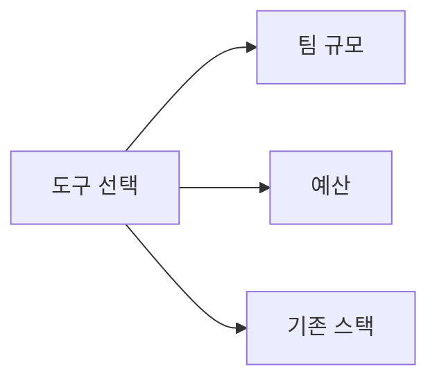

개발자의 도구함은 시대마다 달라진다. 2026년 기준으로 실무에서 실제로 쓰이는 SaaS 도구 30개를 카테고리별로 정리했다. 단순한 나열이 아니라 장단점, 요금, 대안까지 함께 담아 팀에 맞는 도구를 고를 수 있게 했다.

> **비유:** 개발자의 SaaS 스택은 주방장의 조리 도구 세트와 같다. 칼 하나로 모든 것을 할 수 있지만, 용도에 맞는 도구가 있으면 훨씬 빠르고 안전하게 일할 수 있다.

---

## 1. 협업 및 커뮤니케이션

### 1. Slack

**카테고리**: 팀 메신저

스타트업부터 대기업까지 개발 팀 커뮤니케이션의 표준이다. 채널 기반 구조로 주제별 대화를 분리하고, GitHub·Jira·PagerDuty 등 수백 가지 도구와 연동된다.

**장점**
- 워크플로 자동화(Workflow Builder)로 반복 작업 자동화
- 스레드 기능으로 대화 정리
- Huddle로 즉시 음성/화상 대화

**단점**
- 무료 플랜은 90일 메시지 검색 제한
- 알림 관리가 안 되면 집중력 분산
- 유료 플랜이 인당 과금이라 팀 규모에 따라 비용이 급증

**요금**: 무료 / Pro $7.25/월/인 / Business+ $12.50/월/인

**대안**: Microsoft Teams(Microsoft 365 사용 조직), Discord(스타트업·오픈소스)

---

### 2. Notion

**카테고리**: 문서 및 위키

팀 위키, 프로젝트 계획, 회의록, 로드맵을 한 곳에 관리할 수 있다. 데이터베이스 기능이 특히 강력해 스프레드시트 수준의 데이터 관리가 가능하다.

**장점**
- 문서·데이터베이스·캘린더를 하나의 앱에서
- AI 기능(요약, 초안 작성)이 2024년부터 통합
- 블록 기반 편집으로 자유도가 높음

**단점**
- 대용량 위키에서 로딩이 느림
- 오프라인 지원 미흡
- 복잡한 관계형 데이터베이스는 여전히 스프레드시트보다 불편

**요금**: 무료(개인) / Plus $10/월/인 / Business $18/월/인

**대안**: Confluence(Atlassian 스택 사용 팀), Obsidian(개인 노트), GitBook(기술 문서)

---

### 3. Linear

**카테고리**: 이슈 트래커

Jira의 복잡함에 지친 개발 팀을 위한 모던 이슈 트래커다. 빠른 속도와 깔끔한 UX가 특징이며, 사이클(스프린트)·로드맵·백로그가 모두 직관적으로 구성되어 있다.


**장점**
- 앱 속도가 압도적으로 빠름 (Jira 대비)
- GitHub PR과 자동 연동 (PR 병합 시 이슈 자동 완료)
- 단축키 기반 UX로 마우스 없이도 대부분 조작 가능

**단점**
- Jira만큼 세밀한 커스터마이징이 안 됨
- 엔터프라이즈 기능(감사 로그 등)이 부족
- 소규모 팀에서는 과할 수 있음

**요금**: 무료(최대 250 이슈) / Standard $8/월/인 / Plus $16/월/인

**대안**: Jira(엔터프라이즈), GitHub Issues(소규모), Shortcut

---

### 4. Loom

**카테고리**: 비동기 영상 커뮤니케이션

화면 녹화 + 얼굴 캠 + 음성을 합쳐 영상 메시지를 만든다. 복잡한 버그 재현 과정이나 코드 리뷰 피드백을 영상으로 보내면 텍스트 설명보다 훨씬 빠르게 전달된다.

**장점**
- 녹화 즉시 링크 생성, 공유가 매우 쉬움
- 시청자가 특정 타임스탬프에 댓글 가능
- 자동 자막 생성

**단점**
- 무료는 5분 제한
- 영상이 쌓이면 관리가 어려움

**요금**: 무료(5분) / Business $12.50/월/인

---

## 2. CI/CD 및 버전 관리

### 5. GitHub

**카테고리**: 코드 호스팅 + CI/CD

Git 호스팅의 표준이자 가장 큰 오픈소스 생태계다. GitHub Actions로 CI/CD 파이프라인을 코드로 관리하고, Copilot으로 AI 코딩 어시스턴트를 내장한다.

**장점**
- 오픈소스 생태계 최대 (npm, PyPI 등과 연동)
- Actions 생태계가 방대해 거의 모든 CI/CD 시나리오 커버
- GitHub Packages로 컨테이너 레지스트리 내장

**단점**
- 대용량 파일(LFS) 비용 별도
- Enterprise 기능은 비용이 높음

**요금**: 무료(퍼블릭/개인) / Team $4/월/인 / Enterprise $21/월/인

**대안**: GitLab(셀프 호스팅 강점), Bitbucket(Atlassian 스택)

---

### 6. GitHub Actions

**카테고리**: CI/CD

GitHub 내장 CI/CD. YAML로 워크플로를 정의하고 푸시·PR·스케줄 등 다양한 이벤트에 반응한다.

```yaml
name: CI
on: [push, pull_request]
jobs:
  build:
    runs-on: ubuntu-latest
    steps:
      - uses: actions/checkout@v4
      - uses: actions/setup-java@v4
        with:
          java-version: '21'
      - run: ./mvnw test
```

**장점**
- GitHub과 완전 통합 (별도 설정 없음)
- Marketplace에 수천 개의 Action
- 퍼블릭 저장소 무료

**단점**
- 프라이빗 저장소 무료 시간 제한 (월 2000분)
- 복잡한 파이프라인에서 YAML이 방대해짐

**요금**: 퍼블릭 무료 / 프라이빗 월 2000분 무료 후 분당 과금

---

### 7. CircleCI

**카테고리**: CI/CD

GitHub Actions보다 먼저 등장한 CI/CD 전문 서비스다. 캐싱, 병렬 실행, Orbs(재사용 가능 설정 모듈)가 강점이다.

**장점**
- 캐싱 전략이 세밀해 빌드 속도 최적화 유리
- Docker Layer 캐싱 지원
- 복잡한 병렬 워크플로에 강함

**단점**
- GitHub Actions에 비해 생태계가 작음
- 요금이 복잡함

**요금**: 무료(월 6000 크레딧) / Performance $15/월~

---

### 8. ArgoCD

**카테고리**: GitOps CD

Kubernetes 클러스터에 배포를 Git 저장소 기반으로 관리하는 GitOps 도구다. Git 상태와 클러스터 상태를 동기화한다.

**장점**
- 배포 상태를 Git으로 추적 → 롤백이 `git revert`
- 웹 UI로 배포 현황 시각화
- 멀티 클러스터 관리

**단점**
- Kubernetes 전제 (없으면 불필요)
- 초기 학습 곡선이 있음

**요금**: 오픈소스 무료

---

## 3. 모니터링 및 관측성

### 9. Datadog

**카테고리**: APM + 인프라 모니터링

인프라 메트릭, APM(트레이싱), 로그, 알람을 하나의 플랫폼에서 관리한다. 서비스 맵으로 MSA 의존성을 시각화하는 기능이 강력하다.

> **비유:** Datadog은 항공기 조종실 계기판 같다. 수십 개의 지표를 한 화면에 모아 비행(서비스) 상태를 실시간으로 파악할 수 있다.

**장점**
- 에이전트 설치 하나로 메트릭·로그·트레이스 동시 수집
- 600+ 통합(AWS, GCP, Kubernetes 등)
- AI 기반 이상 탐지(Watchdog)

**단점**
- 가격이 매우 비쌈 (데이터 볼륨에 따라 급격히 증가)
- 학습 곡선이 높음

**요금**: 인프라 $15/호스트/월 + APM $31/호스트/월 등 모듈별 과금

**대안**: Grafana + Prometheus(오픈소스), New Relic, Dynatrace

---

### 10. Sentry

**카테고리**: 에러 모니터링

앱에서 발생하는 에러를 실시간으로 수집·분류·알람한다. 에러가 발생한 사용자 컨텍스트, 브레드크럼(이벤트 흐름), 스택트레이스를 함께 제공한다.

**장점**
- SDK 추가 몇 줄로 즉시 에러 수집 시작
- 에러 중복 제거 및 그룹핑이 뛰어남
- 성능 모니터링(트랜잭션 추적) 추가됨

**단점**
- 대량 에러 발생 시 비용 폭증
- 무료 플랜 이벤트 제한

**요금**: 무료(5K 에러/월) / Team $26/월~ / Business $80/월~

**대안**: Rollbar, Bugsnag, GCP Error Reporting

---

### 11. Grafana

**카테고리**: 메트릭 시각화

Prometheus, InfluxDB, Elasticsearch 등 다양한 데이터 소스를 연결해 대시보드를 만든다. 오픈소스이며 Grafana Cloud로 SaaS 버전도 제공한다.

**장점**
- 오픈소스로 자체 호스팅 가능
- 50+ 데이터 소스 플러그인
- 알람 기능 내장

**단점**
- 데이터 소스를 직접 관리해야 함
- 복잡한 대시보드 구성에 시간 소요

**요금**: 오픈소스 무료 / Cloud 무료(제한) / Pro $8/인/월~

---

### 12. PagerDuty

**카테고리**: 인시던트 관리

모니터링 알람을 받아 온콜 팀에 에스컬레이션하고 인시던트 대응을 조율한다. 장애 시 누가 연락을 받고 어떻게 대응할지 워크플로를 자동화한다.

**장점**
- 복잡한 에스컬레이션 정책 설정
- Datadog·Sentry 등 모니터링 도구와 연동
- 인시던트 사후 분석(Postmortem) 템플릿

**단점**
- 소규모 팀에는 과사양
- 가격이 높음

**요금**: Professional $21/인/월 / Business $41/인/월

**대안**: OpsGenie(Atlassian), Alertmanager(오픈소스), Better Uptime

---

## 4. 클라우드 인프라

### 13. Vercel

**카테고리**: 프론트엔드 배포

Next.js 창시자들이 만든 프론트엔드 배포 플랫폼이다. Git 푸시만으로 배포가 완료되고 PR마다 Preview URL이 생성된다.

**장점**
- 배포 속도가 압도적으로 빠름
- Edge Network 자동 적용
- PR Preview 기능이 QA에 매우 유용

**단점**
- 백엔드 서비스엔 부적합
- Next.js 외 프레임워크는 기능 일부 제한
- 대용량 트래픽에서 비용 급증

**요금**: 무료(취미) / Pro $20/월 / Enterprise 문의

**대안**: Netlify, Cloudflare Pages, AWS Amplify

---

### 14. Railway

**카테고리**: 백엔드 배포

Heroku 이후 가장 편리한 백엔드 배포 플랫폼이라는 평가를 받는다. Docker, 데이터베이스, 크론잡을 모두 한 플랫폼에서 관리한다.

**장점**
- 설정 없이 바로 배포 (Heroku처럼)
- PostgreSQL, MySQL, Redis를 클릭 한 번으로 추가
- 실사용량 기반 과금 (유휴 시 비용 없음)

**단점**
- 대규모 서비스엔 AWS/GCP가 더 유연함
- 커스텀 네트워킹이 제한적

**요금**: 무료($5 크레딧/월) / Pro $20/월~

**대안**: Render, Fly.io, Heroku

---

### 15. AWS / GCP / Azure

**카테고리**: 클라우드 인프라

규모가 커지면 결국 주요 클라우드 중 하나를 선택해야 한다. 각각의 강점이 다르다.

| 항목 | AWS | GCP | Azure |
|---|---|---|---|
| 생태계 | 가장 넓음 | AI/ML 강점 | Microsoft 연동 |
| 진입장벽 | 높음 | 중간 | 중간 |
| 가격 | 복잡 | 심플 | 복잡 |
| 추천 대상 | 대부분 | AI 스타트업 | MS 스택 조직 |

---

## 5. 디자인 및 프로토타이핑

### 16. Figma

**카테고리**: UI 디자인 + 협업

2026년 현재 UI 디자인 도구의 표준이다. 개발자도 Figma를 읽을 줄 알아야 디자이너와 원활히 협업할 수 있다.

**장점**
- 실시간 협업으로 디자이너-개발자 동시 편집
- Dev Mode로 CSS 값, 에셋 export 간편화
- 컴포넌트 라이브러리로 디자인 시스템 관리

**단점**
- 오프라인 미지원
- 복잡한 프로토타입에서 성능 저하
- 어도비 인수 시도 이후 가격 정책 변화 우려

**요금**: 무료(3 프로젝트) / Professional $15/인/월 / Organization $45/인/월

**대안**: Sketch(Mac 전용), Adobe XD(서비스 종료), Penpot(오픈소스)

---

## 6. AI 도구

### 17. Cursor

**카테고리**: AI 코드 에디터

VS Code 기반의 AI 네이티브 코드 에디터다. 코드베이스 전체를 컨텍스트로 인식해 더 정확한 자동완성과 리팩토링을 제공한다.

> **비유:** Cursor는 코드베이스를 이미 다 읽은 짝 프로그래머가 옆에 앉아 있는 것과 같다. 함수 이름만 말해도 어디 있는지 알고, 변경 영향도를 파악한다.

**장점**
- Tab 자동완성의 정확도가 Copilot보다 높다는 평가
- `@codebase`로 전체 저장소 질문 가능
- 멀티파일 편집(Composer) 기능

**단점**
- 유료 플랜이 필요해야 성능이 충분히 나옴
- VS Code 확장 호환성 일부 문제

**요금**: 무료(제한) / Pro $20/월 / Business $40/인/월

**대안**: GitHub Copilot, Windsurf, JetBrains AI

---

### 18. Claude (Anthropic)

**카테고리**: AI 어시스턴트

복잡한 코드 리뷰, 기술 문서 작성, 아키텍처 설계 논의에 가장 적합한 AI다. 긴 컨텍스트 윈도우(200K 토큰)로 대용량 코드베이스 분석이 가능하다.

**장점**
- 긴 코드도 정확하게 분석하는 컨텍스트 처리 능력
- 기술 설명이 논리적이고 상세함
- Claude Code로 터미널 통합 사용 가능

**단점**
- API 비용이 높음 (고성능 모델 기준)

**요금**: 무료(Claude.ai) / Pro $20/월 / API 토큰 기반 과금

---

### 19. GitHub Copilot

**카테고리**: AI 코딩 어시스턴트

VS Code, JetBrains, Neovim에 통합되는 AI 자동완성 도구다. 2026년에는 Copilot Workspace로 이슈에서 코드 PR까지 자동화하는 기능이 추가됐다.

**장점**
- IDE 통합이 자연스러움
- GitHub과 완전 연동
- 다양한 언어 지원

**단점**
- 컨텍스트 이해가 Cursor보다 제한적
- 라이선스 이슈 논란 (오픈소스 코드 학습)

**요금**: Individual $10/월 / Business $19/인/월

---

## 7. 테스트 및 품질

### 20. Postman

**카테고리**: API 테스트

REST API 개발 시 요청을 테스트하고 팀과 컬렉션을 공유하는 표준 도구다.

**장점**
- API 컬렉션을 팀과 공유
- 환경 변수로 dev/staging/prod 전환
- Newman으로 CI 통합

**단점**
- 무거운 앱 (Electron 기반)
- 무료 플랜은 팀 기능 제한

**요금**: 무료(개인) / Basic $14/인/월

**대안**: Insomnia, Bruno(오픈소스), httpie

---

### 21. SonarQube / SonarCloud

**카테고리**: 정적 코드 분석

코드 품질, 보안 취약점, 커버리지를 자동으로 분석한다. PR마다 코드 품질 게이트를 통과해야 병합 가능하게 설정한다.

**장점**
- 25개 이상 언어 지원
- OWASP Top 10 취약점 자동 탐지
- CI/CD 통합으로 PR 리뷰 자동화

**단점**
- 초기 설정이 복잡
- False Positive가 많아 규칙 튜닝 필요

**요금**: Community Edition 무료 / SonarCloud $10/월~

---

### 22. k6

**카테고리**: 부하 테스트

JavaScript로 부하 테스트 시나리오를 작성하고 Grafana로 결과를 시각화한다. CLI 기반이라 CI/CD에 통합하기 쉽다.

```javascript
import http from 'k6/http';
import { check } from 'k6';

export const options = {
  vus: 100,
  duration: '30s',
};

export default function () {
  const res = http.get('https://api.example.com/health');
  check(res, { 'status is 200': (r) => r.status === 200 });
}
```

**요금**: 오픈소스 무료 / Cloud $49/월~

---

## 8. 보안

### 23. Snyk

**카테고리**: 보안 취약점 스캐닝

코드, 컨테이너 이미지, IaC(Terraform), 오픈소스 의존성의 보안 취약점을 자동으로 탐지하고 수정 방법을 제안한다.

**장점**
- IDE 플러그인, CI/CD 모두 통합
- 취약점 수정 PR을 자동 생성
- CVE 데이터베이스와 실시간 연동

**단점**
- 무료 플랜 스캔 횟수 제한
- 알림이 많아 피로감

**요금**: 무료(제한) / Team $25/인/월~

---

### 24. 1Password for Teams

**카테고리**: 팀 시크릿 관리

팀 API 키, 비밀번호, 인증서를 안전하게 공유한다. 개발 환경에서는 `.env` 파일 대신 1Password CLI로 시크릿을 주입할 수 있다.

```bash
# 1Password CLI로 시크릿 주입
op run --env-file=.env.template -- npm start
```

**요금**: Teams $4/인/월 / Business $8/인/월

**대안**: Vault(HashiCorp), Doppler, AWS Secrets Manager

---

## 9. 데이터베이스 및 스토리지

### 25. PlanetScale

**카테고리**: MySQL 서버리스

MySQL 호환 서버리스 데이터베이스. 스키마 변경을 브랜치로 관리하고 무중단 배포가 가능하다.

**장점**
- 데이터베이스 브랜치 (Git처럼 DB 분기)
- 자동 스케일링
- 글로벌 리전 복제

**요금**: 무료(개발용) / Scaler $39/월~

**대안**: Neon(PostgreSQL), Supabase, CockroachDB

---

### 26. Supabase

**카테고리**: BaaS (Backend as a Service)

PostgreSQL 기반의 Firebase 대안이다. 인증, 실시간 DB, 스토리지, Edge Function을 한 번에 제공한다.

**장점**
- PostgreSQL 그대로 사용 가능 (벤더 종속 없음)
- 오픈소스로 셀프 호스팅 가능
- Row Level Security로 클라이언트 직접 접근도 안전

**요금**: 무료(2 프로젝트) / Pro $25/프로젝트/월

---

## 10. 문서 및 API

### 27. Swagger / OpenAPI

**카테고리**: API 문서화

REST API를 OpenAPI 스펙으로 정의하고 Swagger UI로 인터랙티브 문서를 제공한다. Spring Boot에서는 springdoc-openapi로 자동 생성이 가능하다.

```xml
<dependency>
    <groupId>org.springdoc</groupId>
    <artifactId>springdoc-openapi-starter-webmvc-ui</artifactId>
    <version>2.3.0</version>
</dependency>
```

**요금**: 오픈소스 무료 / SwaggerHub $75/월~

---

### 28. GitBook

**카테고리**: 기술 문서 사이트

개발자 문서, API 가이드, 온보딩 가이드를 보기 좋게 발행한다. GitHub과 연동해 Markdown 문서를 자동으로 동기화한다.

**요금**: 무료(퍼블릭) / Plus $8/인/월

---

## 11. 분석

### 29. Mixpanel

**카테고리**: 제품 분석

사용자 행동 이벤트를 추적하고 퍼널·코호트·리텐션을 분석한다. 개발자가 새 기능의 실제 사용률을 측정하는 데 필수다.

**장점**
- 이벤트 기반 분석이 유연함
- 코호트 분석으로 사용자 세그먼트별 행동 비교

**요금**: 무료(1만 MAU) / Growth $28/월~

**대안**: Amplitude, PostHog(오픈소스), GA4

---

### 30. PostHog

**카테고리**: 제품 분석 + 피처 플래그

분석, 세션 녹화, 피처 플래그, A/B 테스트를 하나의 오픈소스 플랫폼에서 제공한다. 셀프 호스팅으로 데이터 주권을 유지할 수 있다.

**장점**
- 오픈소스로 셀프 호스팅 가능
- 피처 플래그와 분석이 통합됨
- GDPR 친화적 (데이터가 자사 서버에 유지)

**요금**: 오픈소스 무료 / Cloud 무료(100만 이벤트/월)

---

## 도구 선택 원칙



1. **작게 시작한다**: 소규모 팀에서 30개 도구를 모두 쓸 필요 없다. 핵심 5~7개부터 시작한다.
2. **통합을 확인한다**: 도구끼리 연동되어야 시너지가 난다. GitHub + Linear + Slack 조합이 대표적이다.
3. **오픈소스 대안을 고려한다**: Grafana, PostHog, Supabase는 오픈소스로 시작해 비용을 통제할 수 있다.
4. **무료 티어로 먼저 검증한다**: 대부분 무료 플랜이 있다. 2~4주 써보고 유료 전환을 결정한다.

> **비유:** 도구는 수단이지 목적이 아니다. 최신 도구를 쓰는 것보다 팀이 실제로 활용하는 도구를 쓰는 것이 훨씬 중요하다. 아무리 좋은 칼도 쓸 줄 모르면 무용지물이다.

---

## 마무리

2026년 개발자 SaaS 생태계는 AI 통합이 모든 카테고리에 스며드는 방향으로 빠르게 변화하고 있다. 이 30개 도구는 현재 실무에서 검증된 것들이지만, 6개월 뒤에는 상황이 달라질 수 있다. 중요한 것은 도구 자체보다 **도구를 평가하고 도입·폐기하는 팀의 역량**이다.
