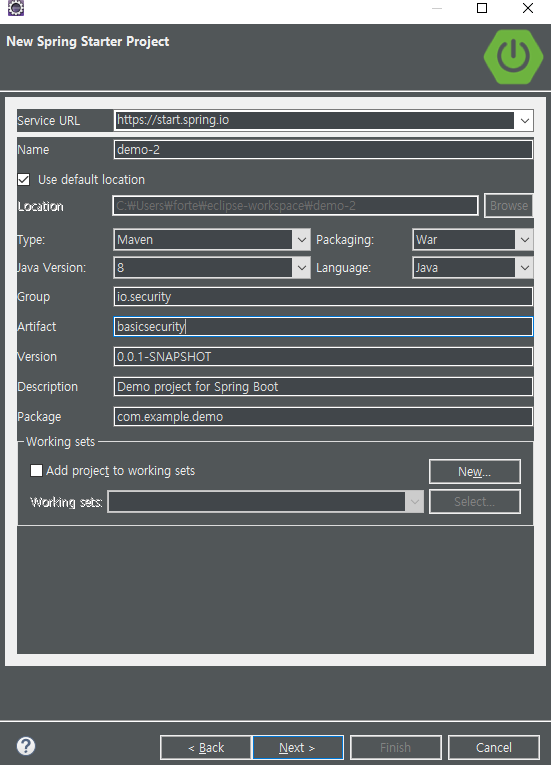
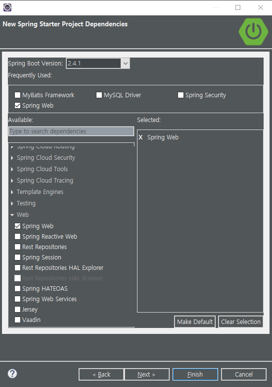
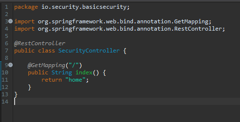
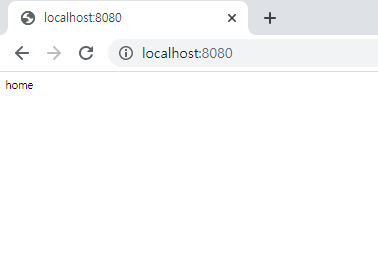
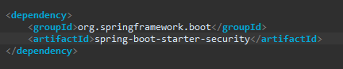
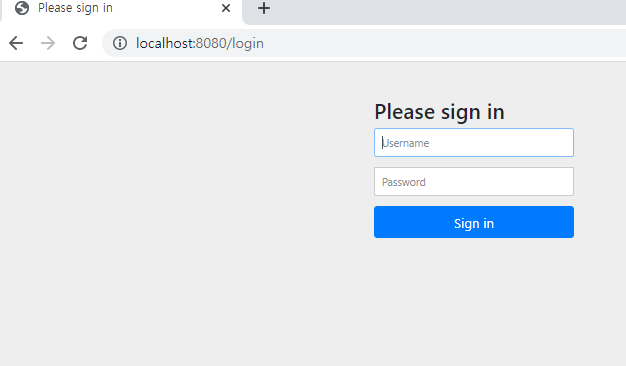
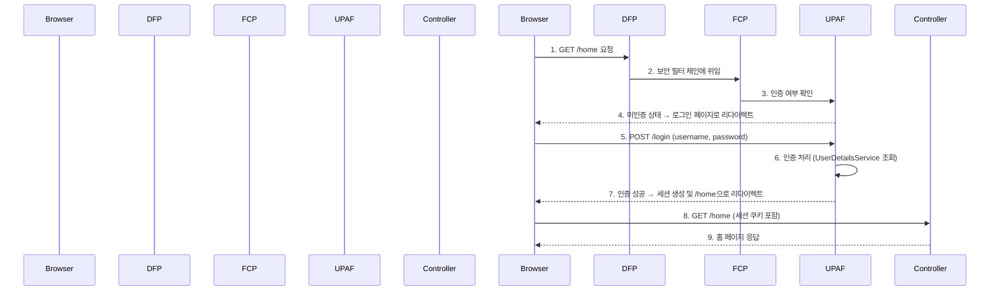
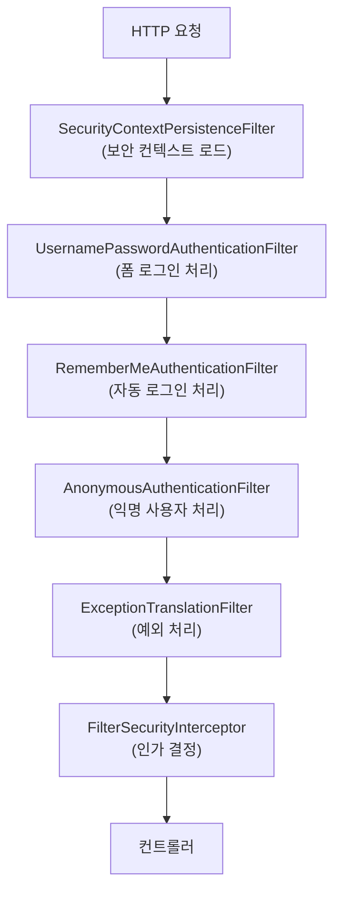

> 한 줄 요약: Spring Security 의존성 하나만 추가해도 모든 엔드포인트에 인증이 자동으로 적용된다.

## 왜 Spring Security인가?

건물에 비유해 보겠습니다. 아무런 보안 장치 없이 지어진 건물은 누구나 자유롭게 드나들 수 있습니다. 그런데 경비원을 배치하고, 출입증 시스템을 설치하고, 각 층마다 접근 권한을 달리 하면 훨씬 안전한 건물이 됩니다. Spring Security는 웹 애플리케이션의 이 경비 시스템 역할을 합니다.

웹 애플리케이션을 개발할 때 보안은 선택이 아닌 필수입니다. 인증(Authentication, 당신이 누구인지 확인)과 인가(Authorization, 당신이 무엇을 할 수 있는지 결정)는 모든 서비스에 필요하지만, 이를 직접 구현하면 수많은 보안 취약점이 생길 수 있습니다. Spring Security는 이러한 복잡한 보안 로직을 검증된 방식으로 제공합니다.

Spring Security는 서블릿 필터 기반으로 동작하며, 애플리케이션의 요청이 컨트롤러에 도달하기 전에 여러 단계의 보안 검사를 수행합니다. 이를 통해 비즈니스 로직과 보안 로직을 완전히 분리할 수 있습니다.

## 보안 위협 시나리오

Spring Security 없이 웹 애플리케이션을 배포하면 어떤 일이 일어날까요?

- 관리자 페이지(`/admin`)에 누구나 접근 가능합니다.
- 다른 사용자의 개인정보 API를 직접 호출할 수 있습니다.
- 세션 탈취, CSRF 공격, 무차별 대입 공격에 무방비 상태가 됩니다.
- 민감한 데이터가 암호화 없이 전송될 수 있습니다.

Spring Security는 이러한 기본적인 보안 위협들을 의존성 추가만으로 상당 부분 차단해 줍니다.

## 프로젝트 생성

Spring Initializr(start.spring.io)를 통해 프로젝트를 생성합니다.

```
프로젝트 구성:
- Project: Maven
- Language: Java
- Spring Boot: 2.x
- Dependencies: Spring Web, Spring Security
```





## 컨트롤러 생성

간단한 테스트용 컨트롤러를 생성합니다. `/home` 엔드포인트를 만들어 Spring Security 적용 전후를 비교합니다.

```java
@RestController
public class SecurityController {

    // 인증 없이 접근할 엔드포인트
    @GetMapping("/home")
    public String home() {
        return "홈 페이지입니다.";
    }
}
```



## Security 적용 전 동작

의존성을 추가하기 전에는 `/home`에 아무런 제약 없이 접근할 수 있습니다. 브라우저에서 `localhost:8080/home`을 입력하면 바로 응답을 받습니다.



## POM.XML에 Security 의존성 추가

`pom.xml`에 아래 한 줄을 추가하는 것만으로 Spring Security가 활성화됩니다.

```xml
<dependency>
    <groupId>org.springframework.boot</groupId>
    <artifactId>spring-boot-starter-security</artifactId>
</dependency>
```



이 의존성이 추가되면 Spring Boot의 자동 설정(Auto Configuration)이 작동하여 보안 관련 빈들이 자동으로 초기화됩니다. 구체적으로는 `SecurityAutoConfiguration`과 `SpringBootWebSecurityConfiguration`이 활성화되어 기본 보안 정책이 적용됩니다.

## Security 적용 후 동작

의존성 추가 후 애플리케이션을 재시작하면, 이제 `/home`에 접근하려 할 때 자동으로 로그인 페이지로 리다이렉트됩니다.



Spring Security가 자동으로 생성한 로그인 페이지입니다. 기본 제공되는 계정 정보는 다음과 같습니다.

- **ID**: `user`
- **Password**: 애플리케이션 실행 시 콘솔 로그에 자동 생성되어 출력됩니다.

콘솔에서 아래와 같은 메시지를 확인할 수 있습니다.

```
Using generated security password: a1b2c3d4-e5f6-7890-abcd-ef1234567890
```

이 UUID 형태의 비밀번호는 애플리케이션을 재시작할 때마다 새로 생성됩니다.

## 내부 동작 원리

Spring Security 의존성을 추가하면 내부적으로 어떤 일이 일어나는지 살펴보겠습니다.



## 왜 이게 중요한가?

의존성 한 줄 추가만으로 다음과 같은 보안 기능이 자동으로 활성화됩니다.

1. **모든 URL에 대한 인증 요구**: 로그인하지 않으면 어떤 페이지도 접근할 수 없습니다.
2. **기본 로그인 폼 제공**: 별도의 HTML 없이도 로그인 UI가 제공됩니다.
3. **CSRF 보호**: 폼 기반 공격을 자동으로 방어합니다.
4. **세션 고정 공격 방지**: 로그인 시 새로운 세션 ID를 발급합니다.
5. **보안 헤더 자동 설정**: `X-Content-Type-Options`, `X-Frame-Options` 등의 보안 헤더를 응답에 자동 추가합니다.
6. **비밀번호 암호화 강제**: 기본 `PasswordEncoder`를 통해 평문 비밀번호 저장을 방지합니다.

## Security 필터 체인 구조

Spring Security는 여러 필터로 구성된 체인 구조로 동작합니다. 각 필터는 특정 보안 기능을 담당합니다.



기본 설정만으로도 이 모든 필터가 자동으로 구성됩니다. 이후 포스팅에서는 각 필터의 역할과 커스터마이징 방법을 상세히 알아볼 것입니다.

## 핵심 포인트 정리

- Spring Security는 `spring-boot-starter-security` 의존성 하나로 즉시 활성화된다.
- 의존성 추가 즉시 모든 URL에 인증이 요구되며, 기본 로그인 페이지가 제공된다.
- 기본 계정은 `user` / 콘솔에 출력되는 UUID 비밀번호이다.
- 내부적으로 서블릿 필터 체인 구조로 동작하며, 컨트롤러 도달 전에 보안 검사를 수행한다.
- `Auto Configuration`을 통해 개발자가 설정을 추가하지 않아도 기본 보안 정책이 자동 적용된다.
- 실무에서는 기본 설정을 그대로 사용하지 않고, `WebSecurityConfigurerAdapter`를 상속하여 커스터마이징한다.
