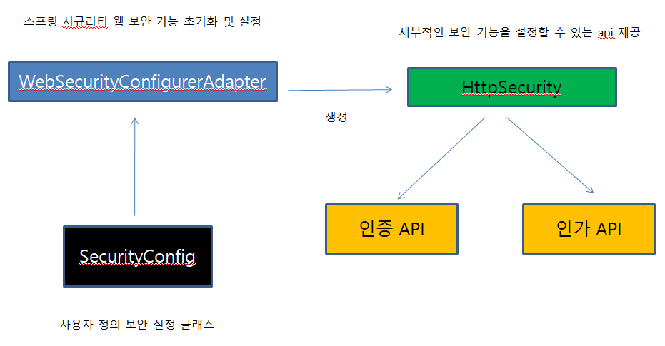
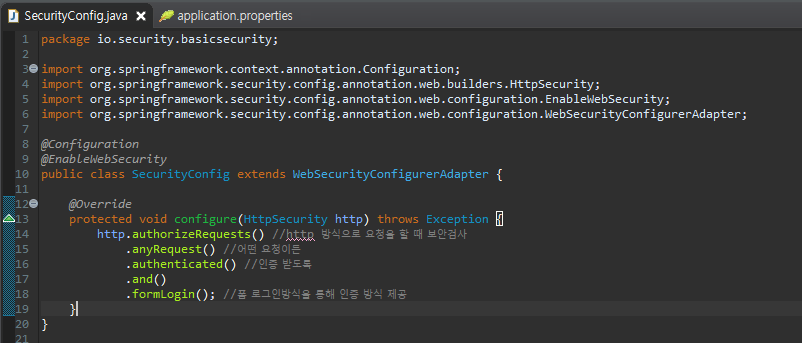
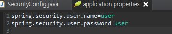
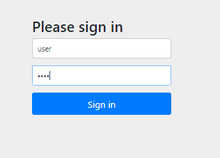
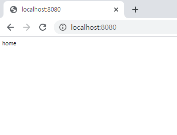

##### 사용자 정의 보완 기능 구현

지난 블로깅에서 Security 의존성만 추가해 간단한 보안 시스템을 만들었다면

이번 블로깅에서는 추가적으로 보안 기능을 설정 할 것이다.

**WebSecurityConfigurerAdapter**는 스프링 시큐리티의 웹 보안 기능 초기화 및 설정하는 클래스이다.

이 클래스를 상속받아 추가적으로 설정한다.

아래와 같이 SecurityConfig.java를 생성한다. 

계정과 암호를 별도로 설정한다. application.properties

위와 같이 설정 후 어플리케이션을 실행한다.

