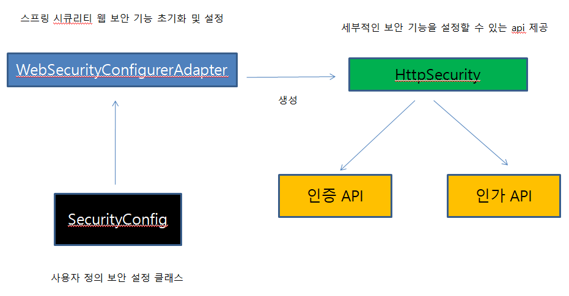
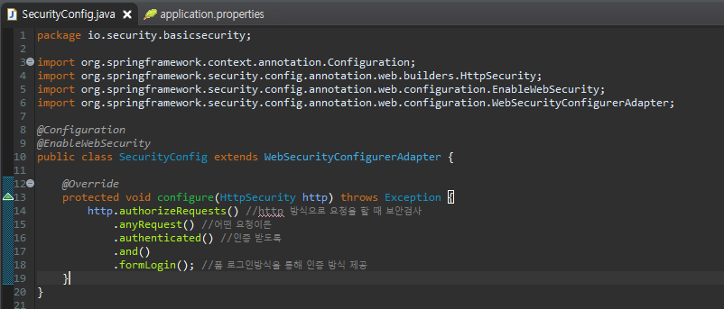
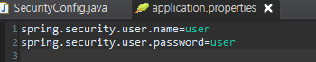
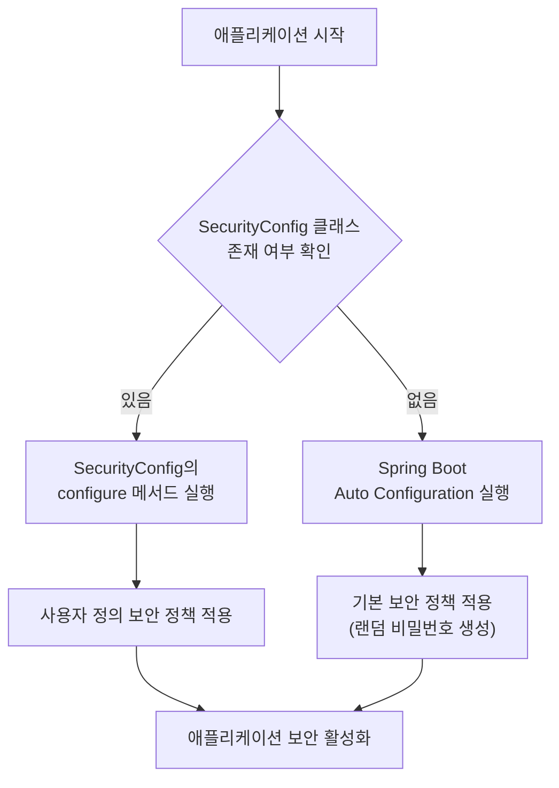
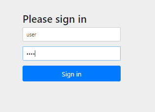
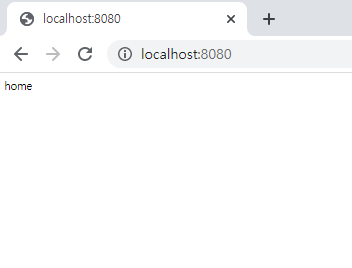

> 한 줄 요약: WebSecurityConfigurerAdapter를 상속하면 Spring Security의 기본 설정을 내 애플리케이션에 맞게 세밀하게 커스터마이징할 수 있다.

## 기본 설정의 한계

앞선 포스팅에서 의존성 하나만으로 Spring Security가 동작하는 것을 확인했습니다. 그러나 실무에서 기본 설정만으로 사용하는 경우는 거의 없습니다. 아파트 단지에 비유하면, 기본 설정은 단지 정문에 경비원이 한 명 있는 수준입니다. 실제로는 동별 출입문, 층별 엘리베이터 접근 권한, 방문자 등록 절차 등 세분화된 보안이 필요합니다.

Spring Security의 기본 설정이 가진 문제점은 다음과 같습니다. 비밀번호가 매번 랜덤 생성되므로 실제 사용자 관리가 불가능합니다. 모든 URL이 동일한 수준의 보안을 요구하므로 공개 페이지도 로그인을 강제합니다. 로그인 페이지 디자인을 변경할 수 없습니다. 이러한 문제를 해결하기 위해 사용자 정의 보안 설정이 필요합니다.

## WebSecurityConfigurerAdapter란

`WebSecurityConfigurerAdapter`는 Spring Security의 웹 보안 기능을 초기화하고 설정하는 추상 클래스입니다. 이 클래스를 상속받아 메서드를 오버라이드하면 기본 동작을 대체하는 커스텀 보안 정책을 정의할 수 있습니다.

이 어댑터 패턴을 사용하면 필요한 메서드만 선택적으로 오버라이드할 수 있어서, 필요하지 않은 설정은 기본값을 그대로 사용할 수 있습니다. Spring Security의 방대한 설정 중 애플리케이션에 필요한 부분만 재정의하는 방식입니다.

```java
@Configuration
@EnableWebSecurity // Spring Security 활성화 어노테이션
public class SecurityConfig extends WebSecurityConfigurerAdapter {

    @Override
    protected void configure(HttpSecurity http) throws Exception {
        // HTTP 보안 정책 설정
        http
            .authorizeRequests()
                .anyRequest().authenticated() // 모든 요청에 인증 필요
            .and()
            .formLogin(); // 기본 폼 로그인 사용
    }

    @Override
    protected void configure(AuthenticationManagerBuilder auth) throws Exception {
        // 인증 사용자 정보 설정
        auth
            .inMemoryAuthentication()
            .withUser("user")
            .password("{noop}1234") // {noop}: 암호화 없이 평문 사용 (개발용)
            .roles("USER");
    }
}
```



## SecurityConfig 클래스 생성

`SecurityConfig.java` 파일을 생성하여 보안 설정을 구성합니다. 이 클래스에는 반드시 `@Configuration`과 `@EnableWebSecurity` 어노테이션을 붙여야 합니다.

- `@Configuration`: 이 클래스가 Spring 설정 클래스임을 나타냅니다.
- `@EnableWebSecurity`: Spring Security의 웹 보안 지원을 활성화하고 Spring MVC와 통합합니다.



## application.properties로 계정 설정

개발 환경에서는 `application.properties`에 계정 정보를 직접 설정할 수도 있습니다. 이 방법은 빠른 프로토타이핑에 유용하지만, 실제 운영 환경에서는 데이터베이스 기반 사용자 관리를 사용해야 합니다.

```properties
# application.properties
spring.security.user.name=admin
spring.security.user.password=admin1234
spring.security.user.roles=ADMIN
```



이 설정은 Spring Boot의 자동 설정이 읽어 `InMemoryUserDetailsManager`에 등록합니다. 단, `SecurityConfig` 클래스에서 `configure(AuthenticationManagerBuilder auth)` 메서드를 오버라이드하면 이 설정은 무시됩니다.

## 설정 우선순위와 동작 원리

Spring Security 설정에는 우선순위가 있습니다.



`WebSecurityConfigurerAdapter`를 상속한 `@Configuration` 클래스가 존재하면 Spring Boot의 기본 자동 설정(`SpringBootWebSecurityConfiguration`)이 비활성화됩니다. 즉, 사용자 정의 설정이 완전히 기본 설정을 대체합니다.

## 설정 적용 확인

설정을 적용한 후 애플리케이션을 실행하면 콘솔에 더 이상 랜덤 비밀번호가 출력되지 않습니다. 대신 설정한 계정으로 로그인이 가능해집니다.





설정한 사용자명과 비밀번호로 로그인에 성공하면, 이전에 접근하려 했던 페이지로 자동으로 이동합니다.

## configure 메서드의 종류

`WebSecurityConfigurerAdapter`에는 오버라이드할 수 있는 여러 `configure` 메서드가 있습니다.

```java
@Configuration
@EnableWebSecurity
public class SecurityConfig extends WebSecurityConfigurerAdapter {

    // 1. HTTP 보안 규칙 설정 (가장 자주 사용)
    @Override
    protected void configure(HttpSecurity http) throws Exception {
        // URL별 접근 권한, 로그인/로그아웃 설정 등
    }

    // 2. 인증 매니저 설정 (사용자 저장소 지정)
    @Override
    protected void configure(AuthenticationManagerBuilder auth) throws Exception {
        // 메모리, DB, LDAP 등 사용자 정보 소스 설정
    }

    // 3. 웹 보안 설정 (정적 리소스 보안 제외 등)
    @Override
    public void configure(WebSecurity web) throws Exception {
        // CSS, JS 등 정적 파일은 보안 검사 제외
        web.ignoring().antMatchers("/css/**", "/js/**", "/images/**");
    }
}
```

각 메서드의 역할을 명확히 이해하는 것이 Spring Security 커스터마이징의 핵심입니다.

## 왜 이게 중요한가?

`WebSecurityConfigurerAdapter`를 통한 사용자 정의 설정은 실무 Spring Security의 출발점입니다. 이 설정 없이는 모든 URL에 동일한 보안 정책이 적용되어 공개 페이지와 보호 페이지를 구분할 수 없습니다. 또한 사용자 정보를 데이터베이스와 연동하거나, 소셜 로그인을 추가하거나, JWT 인증을 구현하려면 반드시 이 어댑터를 커스터마이징해야 합니다.

Spring Security 5.7 버전부터는 `WebSecurityConfigurerAdapter`가 deprecated되고 `SecurityFilterChain` 빈을 직접 등록하는 방식이 권장됩니다. 하지만 기본 원리는 동일하므로, 어댑터 패턴을 이해하면 새로운 방식으로의 전환도 어렵지 않습니다.

## 보안 위협 시나리오

커스텀 보안 설정 없이 기본 설정만 사용할 경우의 위험성을 살펴봅니다.

기본 설정은 메모리에 인증 정보를 저장하므로, 서버 재시작 시 모든 로그인 상태가 초기화됩니다. 랜덤 비밀번호는 관리가 불가능하여 실제 사용자 계정 시스템을 구축할 수 없습니다. 모든 URL에 동일한 보안이 적용되므로, `/health`, `/metrics` 같은 모니터링 엔드포인트도 로그인을 요구하게 되어 운영 도구와의 연동이 어렵습니다.

## 핵심 포인트 정리

- `WebSecurityConfigurerAdapter`를 상속하면 Spring Boot의 기본 보안 자동 설정이 비활성화된다.
- `@Configuration` + `@EnableWebSecurity` 조합으로 사용자 정의 보안 설정 클래스를 선언한다.
- `configure(HttpSecurity http)`: URL별 접근 제어, 로그인/로그아웃 방식 설정.
- `configure(AuthenticationManagerBuilder auth)`: 사용자 인증 정보 저장소(메모리, DB 등) 설정.
- `configure(WebSecurity web)`: 정적 리소스처럼 보안 검사가 필요 없는 경로 제외 설정.
- `application.properties`의 계정 설정은 `SecurityConfig`가 존재하면 무시된다.
- Spring Security 5.7+ 에서는 `SecurityFilterChain` 빈 직접 등록 방식이 권장된다.
