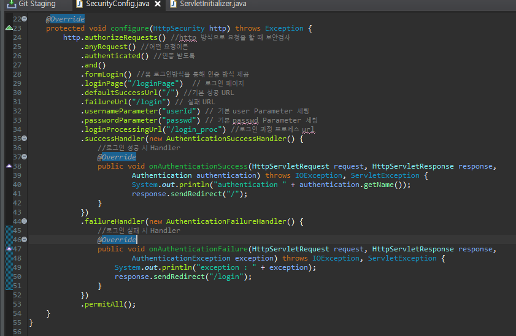
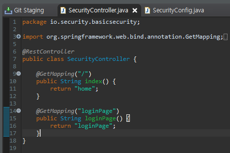
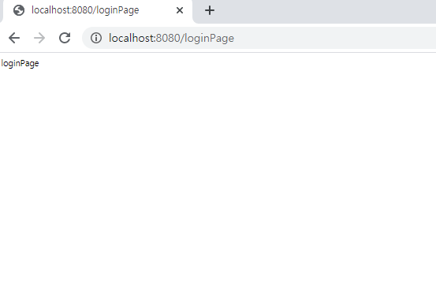
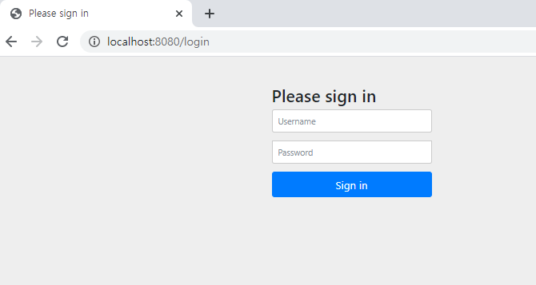

##### 인증 API - FORM 인증 방식

지난 블로깅에 이어 추가적으로 기본적인 보안기능을 설정 할 것이다.

**Security 로그인 동작 과정**

**Client가 /home에 대해 접근 시도 시 인증이 되어있지 않으면 로그인페이지로 이동한다.**

**로그인페이지에서 로그인 요청 시 서버에서 검증 후 Session Id 및 토큰을 생성한다.**

**Client는 세션에 저장된 인증 토큰으로 /home에 접근이 가능해진다.**

SecurityConfig 설정을 아래와 같이 변경한다.

**.loginPage  : 사용자 정의 로그인 페이지**

**.defaultSuccessUrl : 로그인 성공 후 이동 페이지**

**.failureUrl : 로그인 실패 후 이동 페이지**

**.usernameParameter : 아이디 파라미터명 설정**

**.passwordParameter : 패스워드 파라미터명 설정**

**.loginProcessingUrl : 로그인 Form Action Url**

**.successHandler : 로그인 성공 후 핸들러**

**.failureHandler : 로그인 실패 후 핸들러**

**.permitAll : loginPage로는 누구나 접근이 가능하도록 설정**

SecurityController를 아래와 같이 설정한다.

위와 같이 설정 후 서버를 실행 시키면 로그인 페이지는 아래의 사진과 같다.

위에서 설정한 loginPage를 주석 처리하고 실행하면 Spring Security가 지원하는 기본 login화면을 

볼 수 있다.

