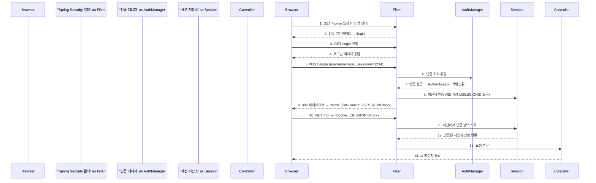
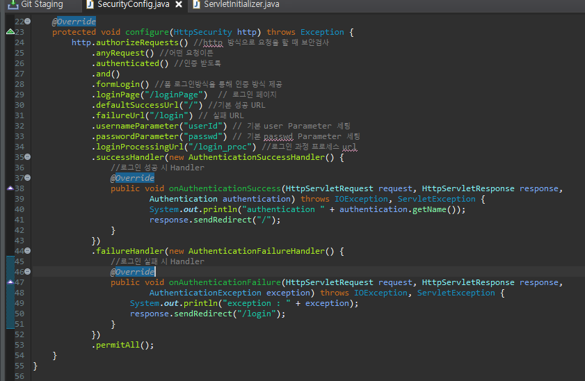
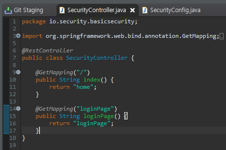
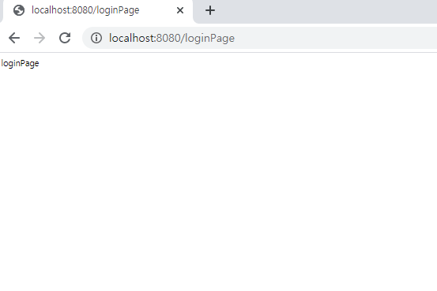
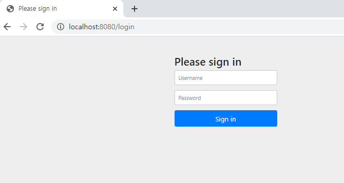
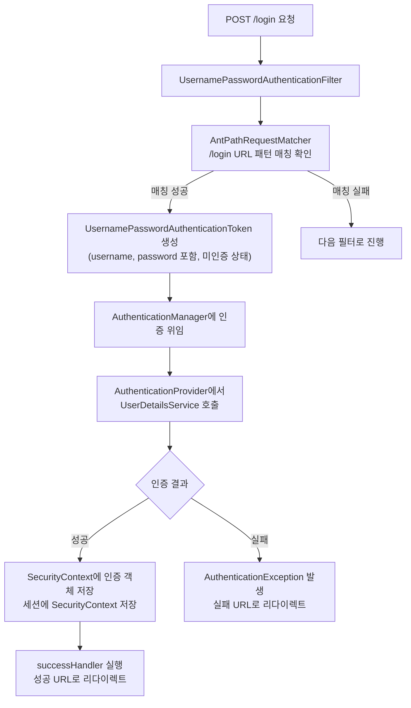

> 한 줄 요약: Form 인증은 사용자가 아이디/비밀번호를 입력하면 서버가 세션 기반 토큰을 발급해 인증 상태를 유지하는 가장 보편적인 웹 인증 방식이다.

## 실생활 비유로 이해하는 Form 인증

도서관에 처음 입장할 때를 상상해 보겠습니다. 처음 방문하면 신분증을 제시하고 회원증을 발급받습니다. 이후에는 신분증 없이 회원증만 보여줘도 도서관에 입장하고 책을 빌릴 수 있습니다. Form 인증이 바로 이런 방식입니다.

사용자가 처음 아이디와 비밀번호를 제출(신분증 제시)하면 서버는 이를 검증하고 세션 토큰(회원증)을 발급합니다. 이후 요청에서는 브라우저가 자동으로 세션 쿠키(회원증)를 첨부하여 전송하므로, 매번 로그인하지 않아도 인증 상태가 유지됩니다.

## Form 인증 전체 흐름


```mermaid
sequenceDiagram
    participant "브라우저" as Browser
    participant "Spring Security 필터" as Filter
    participant "인증 매니저" as AuthManager
    participant "세션 저장소" as Session
    participant "컨트롤러" as Controller

    Browser->>Filter: 1. GET /home 요청 (미인증 상태)
    Filter-->>Browser: 2. 302 리다이렉트 → /login
    Browser->>Filter: 3. GET /login 요청
    Filter-->>Browser: 4. 로그인 페이지 응답
    Browser->>Filter: 5. POST /login (username=user, password=1234)
    Filter->>AuthManager: 6. 인증 처리 위임
    AuthManager-->>Filter: 7. 인증 성공 → Authentication 객체 반환
    Filter->>Session: 8. 세션에 인증 정보 저장 (JSESSIONID 발급)
    Filter-->>Browser: 9. 302 리다이렉트 → /home (Set-Cookie: JSESSIONID=xxx)
    Browser->>Filter: 10. GET /home (Cookie: JSESSIONID=xxx)
    Filter->>Session: 11. 세션에서 인증 정보 조회
    Session-->>Filter: 12. 인증된 사용자 정보 반환
    Filter->>Controller: 13. 요청 전달
    Controller-->>Browser: 14. 홈 페이지 응답
```

이 흐름에서 핵심은 두 가지입니다. 첫째, 최초 인증은 POST 요청으로 아이디/비밀번호를 전송합니다. 둘째, 이후 요청에서는 서버가 발급한 `JSESSIONID` 쿠키를 통해 인증 상태를 확인합니다.

## SecurityConfig에서 Form 로그인 설정

`configure(HttpSecurity http)` 메서드에서 `formLogin()` API를 사용해 Form 인증을 세밀하게 설정할 수 있습니다.

```java
@Configuration
@EnableWebSecurity
public class SecurityConfig extends WebSecurityConfigurerAdapter {

    @Override
    protected void configure(HttpSecurity http) throws Exception {
        http
            .authorizeRequests()
                .anyRequest().authenticated()  // 모든 요청에 인증 필요
            .and()
            .formLogin()
                .loginPage("/login")                    // 사용자 정의 로그인 페이지 URL
                .defaultSuccessUrl("/home")             // 로그인 성공 후 이동할 URL
                .failureUrl("/login?error=true")        // 로그인 실패 후 이동할 URL
                .usernameParameter("username")          // 아이디 입력 필드의 name 속성
                .passwordParameter("password")          // 비밀번호 입력 필드의 name 속성
                .loginProcessingUrl("/login")           // 로그인 폼의 action URL (POST)
                .successHandler(loginSuccessHandler())  // 로그인 성공 시 커스텀 핸들러
                .failureHandler(loginFailureHandler())  // 로그인 실패 시 커스텀 핸들러
                .permitAll();                           // 로그인 페이지는 누구나 접근 가능
    }
}
```



## 각 설정 옵션 상세 설명

### loginPage

사용자가 직접 만든 로그인 페이지의 URL을 지정합니다. 설정하지 않으면 Spring Security가 자동으로 `/login`에 기본 로그인 페이지를 생성합니다.

```java
.loginPage("/custom-login")  // /custom-login URL에서 로그인 폼을 제공
```

### defaultSuccessUrl vs successHandler

`defaultSuccessUrl`은 로그인 성공 후 이동할 URL을 단순히 지정합니다. 반면 `successHandler`를 사용하면 로그인 성공 후 더 복잡한 로직을 실행할 수 있습니다.

```java
// 단순 리다이렉트
.defaultSuccessUrl("/home")

// 커스텀 핸들러 (로그 기록, 권한별 다른 페이지로 이동 등)
.successHandler((request, response, authentication) -> {
    String role = authentication.getAuthorities().iterator().next().getAuthority();
    if (role.equals("ROLE_ADMIN")) {
        response.sendRedirect("/admin/dashboard");  // 관리자는 대시보드로
    } else {
        response.sendRedirect("/user/home");         // 일반 사용자는 홈으로
    }
})
```

### failureUrl vs failureHandler

```java
// 단순 실패 페이지 이동
.failureUrl("/login?error=true")

// 커스텀 핸들러 (실패 원인 분석, 잠금 처리 등)
.failureHandler((request, response, exception) -> {
    String errorMessage = "아이디 또는 비밀번호가 올바르지 않습니다.";
    if (exception instanceof LockedException) {
        errorMessage = "계정이 잠겼습니다. 관리자에게 문의하세요.";
    }
    request.getSession().setAttribute("errorMessage", errorMessage);
    response.sendRedirect("/login?error");
})
```

### usernameParameter / passwordParameter

HTML 로그인 폼의 `input` 필드 `name` 속성과 일치해야 합니다.

```html
<!-- 기본값: username, password -->
<form action="/login" method="post">
    <input type="text" name="username" placeholder="아이디">
    <input type="password" name="password" placeholder="비밀번호">
    <button type="submit">로그인</button>
</form>
```

필드명을 변경한 경우 반드시 Security 설정과 맞춰야 합니다.

```java
// HTML에서 name="userId", name="userPw"를 사용하는 경우
.usernameParameter("userId")
.passwordParameter("userPw")
```

## SecurityController 설정

로그인 페이지와 홈 페이지를 처리하는 컨트롤러를 설정합니다.

```java
@Controller
public class SecurityController {

    // 홈 페이지
    @GetMapping("/home")
    public String home() {
        return "home";  // templates/home.html
    }

    // 사용자 정의 로그인 페이지
    @GetMapping("/login")
    public String login() {
        return "login";  // templates/login.html
    }
}
```



## 사용자 정의 로그인 페이지

커스텀 로그인 페이지를 설정하면 아래와 같이 나타납니다.



`loginPage` 설정을 주석 처리하면 Spring Security가 기본으로 제공하는 로그인 페이지가 표시됩니다.



기본 로그인 페이지는 개발 및 테스트 환경에서 편리하지만, 실제 서비스에서는 브랜드에 맞는 커스텀 로그인 페이지를 사용해야 합니다.

## UsernamePasswordAuthenticationFilter 동작 원리

Form 인증의 핵심은 `UsernamePasswordAuthenticationFilter`입니다. 이 필터가 POST `/login` 요청을 가로채어 인증을 처리합니다.


```mermaid
flowchart TD
    A["POST /login 요청"] --> B["UsernamePasswordAuthenticationFilter"]
    B --> C["AntPathRequestMatcher\n/login URL 패턴 매칭 확인"]
    C -- "매칭 성공" --> D["UsernamePasswordAuthenticationToken 생성\n(username, password 포함, 미인증 상태)"]
    C -- "매칭 실패" --> E["다음 필터로 진행"]
    D --> F["AuthenticationManager에 인증 위임"]
    F --> G["AuthenticationProvider에서\nUserDetailsService 호출"]
    G --> H{"인증 결과"}
    H -- "성공" --> I["SecurityContext에 인증 객체 저장\n세션에 SecurityContext 저장"]
    H -- "실패" --> J["AuthenticationException 발생\n실패 URL로 리다이렉트"]
    I --> K["successHandler 실행\n성공 URL로 리다이렉트"]
```

## 왜 이게 중요한가?

Form 인증은 웹 애플리케이션에서 가장 널리 사용되는 인증 방식입니다. 사용자가 직관적으로 이해하고 사용할 수 있으며, 브라우저가 세션 쿠키를 자동으로 관리해 줍니다.

하지만 Form 인증의 특성상 몇 가지 주의점이 있습니다. 세션 기반이므로 서버가 상태를 유지해야 합니다. REST API 서버처럼 무상태(Stateless) 아키텍처를 원한다면 JWT 기반 인증을 고려해야 합니다. 또한 HTTPS 없이 Form 인증을 사용하면 비밀번호가 평문으로 전송될 수 있으므로, 운영 환경에서는 반드시 SSL/TLS를 적용해야 합니다.

## 보안 위협 시나리오

Form 인증에서 발생할 수 있는 주요 보안 위협입니다.

**브루트 포스 공격**: 무차별 대입으로 비밀번호를 맞추려는 시도입니다. 일정 횟수 이상 실패 시 계정을 잠그거나(`LockedException`) 캡차를 요구하는 방어가 필요합니다.

**세션 하이재킹**: 발급된 `JSESSIONID`를 탈취하여 다른 사람의 세션을 가로채는 공격입니다. HTTPS 적용과 `HttpOnly`, `Secure` 쿠키 플래그 설정으로 방어합니다.

**CSRF 공격**: 악의적인 사이트에서 로그인된 사용자의 브라우저를 통해 원치 않는 요청을 보내는 공격입니다. Spring Security는 기본적으로 CSRF 토큰 검증을 활성화하여 방어합니다.

## 핵심 포인트 정리

- Form 인증은 아이디/비밀번호 제출 → 서버 검증 → 세션 토큰 발급 순서로 동작한다.
- `loginPage()`: 커스텀 로그인 페이지 URL 지정 (미설정 시 Spring Security 기본 페이지 사용).
- `loginProcessingUrl()`: 로그인 폼이 POST 요청을 보낼 URL 지정 (기본값: `/login`).
- `successHandler()`: 로그인 성공 후 권한별 다른 페이지로 이동하는 등 복잡한 로직 처리.
- `failureHandler()`: 로그인 실패 원인에 따른 다른 처리 (계정 잠금, 비밀번호 오류 구분 등).
- `permitAll()`: 로그인 페이지는 미인증 사용자도 접근 가능하도록 반드시 설정해야 한다.
- 운영 환경에서는 반드시 HTTPS를 적용하여 비밀번호 평문 전송을 방지해야 한다.
