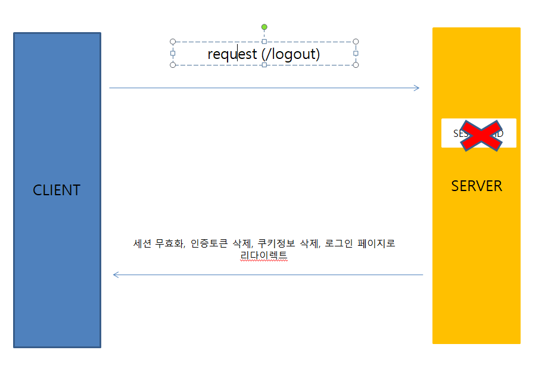
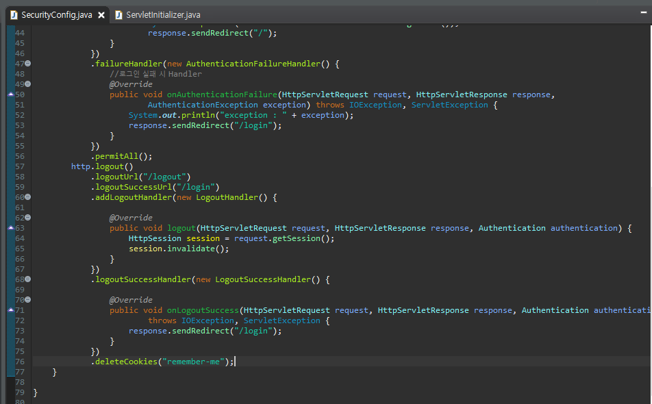
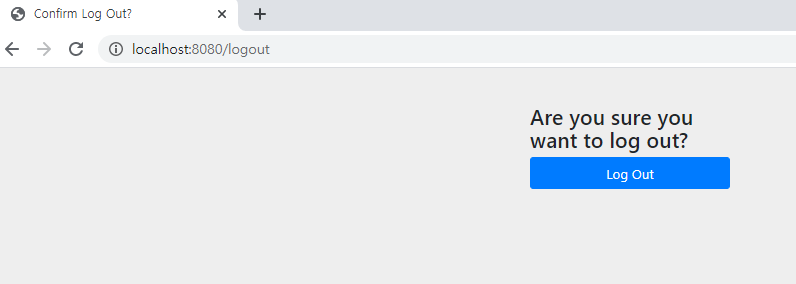
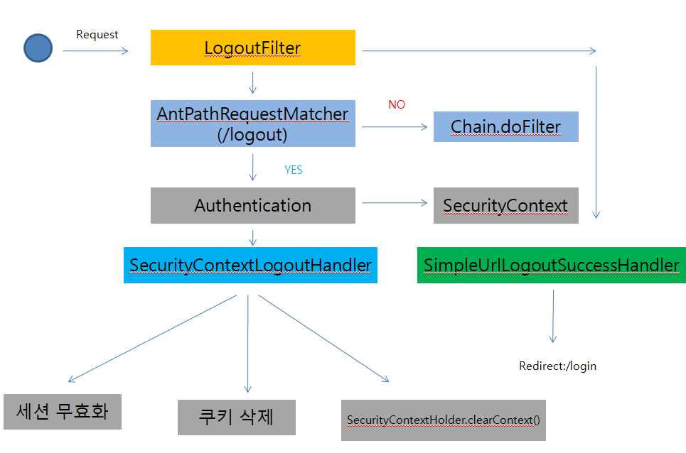

##### Security Logout

**Logout 처리 과정**

클라이언트가 로그아웃 시 서버는 해당 세션을 제거(무효화), 인증토큰, 쿠키정보 삭제 후 로그인 페이지로 리다이렉트 한다.

Logout 설정을 위해 지난 블로깅에 이어 SecurityConfig파일을 아래와 같이 수정한다.

.logout : 로그아웃 처리

.logoutUrl : 로그아웃 처리 URL

.logoutSuccessUrl : 로그아웃 성공 후 이동페이지

.deleteCookies : 로그아웃 후 쿠키 삭제

.addLogoutHandler : 로그아웃 핸들러

.logoutSuccessHandler : 로그아웃 성공 후 핸들러

 

위와 같이 설정 후 어플리케이션 실행 후 /logout 경로로 가게되면 Spring Security에서 지원하는 logout 페이지로 이동한다.

logout 클릭 시 login 화면으로 이동한다.

이번엔 Logout이 Spring Security에서 어떤 원리로 이루어지는지 알아본다.

##### 