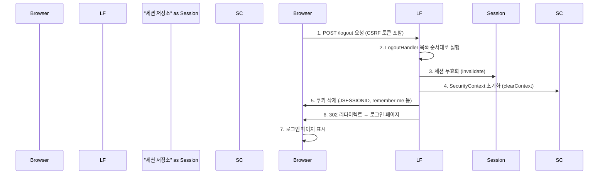
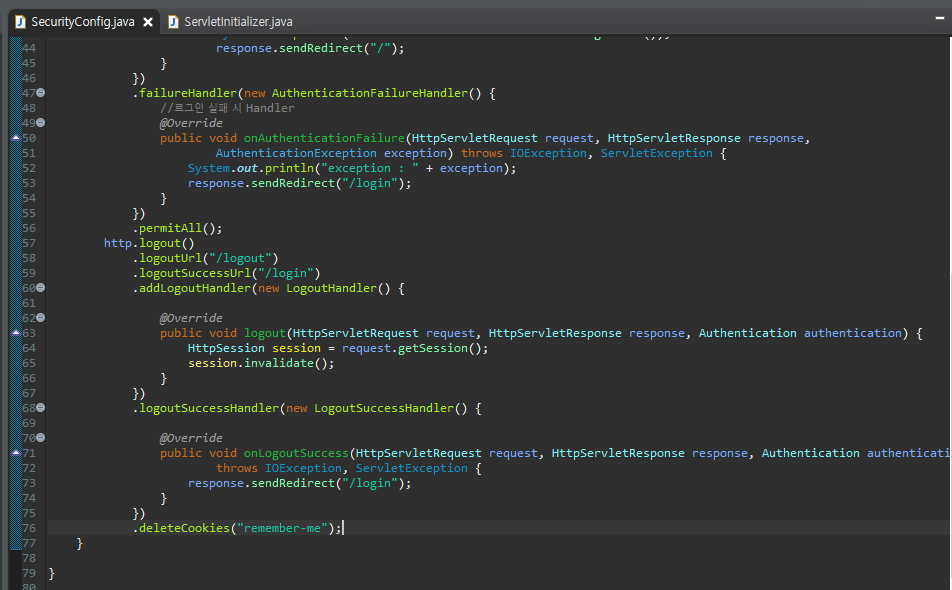
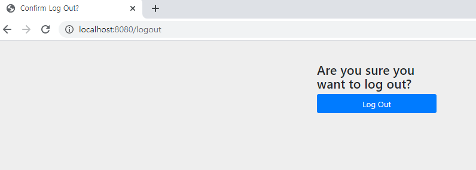
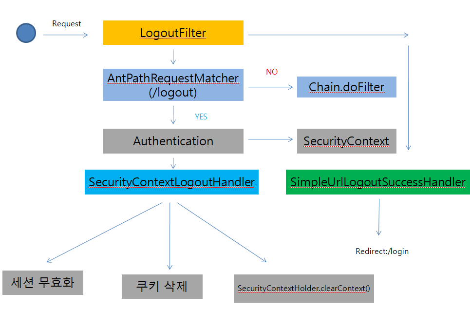
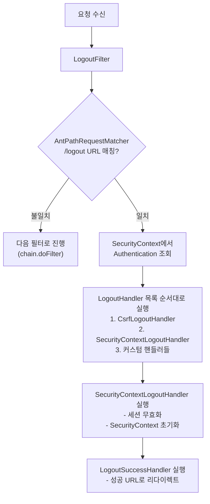

> 한 줄 요약: 로그아웃은 서버 세션 무효화, 인증 토큰 삭제, 쿠키 제거를 한 번에 처리하여 사용자의 인증 상태를 완전히 초기화하는 작업이다.

## 로그아웃이 중요한 이유

도서관 회원증 비유를 다시 떠올려 보겠습니다. 도서관 이용이 끝나면 회원증을 반납하거나, 적어도 회원증이 분실되지 않도록 안전하게 보관해야 합니다. 웹 애플리케이션에서 로그아웃은 이 "회원증 반납" 과정입니다.

로그아웃을 제대로 구현하지 않으면 심각한 보안 문제가 발생할 수 있습니다. 공용 컴퓨터에서 로그아웃하지 않고 브라우저만 닫으면, 세션이 서버에 남아 있어 다음 사용자가 그 세션을 이용해 로그인한 것처럼 행동할 수 있습니다. 따라서 완전한 로그아웃은 클라이언트와 서버 양쪽 모두에서 인증 정보를 제거해야 합니다.

## 로그아웃 처리 과정


```mermaid
sequenceDiagram
    participant "브라우저" as Browser
    participant "LogoutFilter" as LF
    participant "세션 저장소" as Session
    participant "SecurityContext" as SC

    Browser->>LF: 1. POST /logout 요청 (CSRF 토큰 포함)
    LF->>LF: 2. LogoutHandler 목록 순서대로 실행
    LF->>Session: 3. 세션 무효화 (invalidate)
    LF->>SC: 4. SecurityContext 초기화 (clearContext)
    LF->>Browser: 5. 쿠키 삭제 (JSESSIONID, remember-me 등)
    LF->>Browser: 6. 302 리다이렉트 → 로그인 페이지
    Browser->>Browser: 7. 로그인 페이지 표시
```

로그아웃 처리는 `LogoutFilter`가 담당합니다. 이 필터는 로그아웃 URL로의 요청을 감지하면 등록된 `LogoutHandler`들을 순서대로 실행하고, 마지막으로 `LogoutSuccessHandler`를 호출합니다.

## SecurityConfig에서 로그아웃 설정

```java
@Configuration
@EnableWebSecurity
public class SecurityConfig extends WebSecurityConfigurerAdapter {

    @Override
    protected void configure(HttpSecurity http) throws Exception {
        http
            .logout()
                .logoutUrl("/logout")                          // 로그아웃 처리 URL (POST 방식)
                .logoutSuccessUrl("/login?logout=true")        // 로그아웃 성공 후 이동 페이지
                .deleteCookies("JSESSIONID", "remember-me")   // 로그아웃 시 삭제할 쿠키
                .invalidateHttpSession(true)                   // 세션 무효화 (기본값 true)
                .clearAuthentication(true)                     // SecurityContext 초기화 (기본값 true)
                .addLogoutHandler(logoutHandler())             // 커스텀 로그아웃 핸들러 추가
                .logoutSuccessHandler(logoutSuccessHandler()); // 로그아웃 성공 시 커스텀 처리
    }
}
```



## 각 설정 옵션 상세 설명

### logoutUrl

로그아웃 요청을 처리할 URL입니다. 기본값은 `/logout`이며, Spring Security는 이 URL로 오는 **POST** 요청만 로그아웃으로 처리합니다. GET 요청이 아닌 POST를 사용하는 이유는 CSRF 공격을 방지하기 위함입니다.

```html
<!-- 로그아웃 버튼 HTML -->
<form action="/logout" method="post">
    <!-- CSRF 토큰 (Thymeleaf는 자동 추가) -->
    <input type="hidden" th:name="${_csrf.parameterName}" th:value="${_csrf.token}"/>
    <button type="submit">로그아웃</button>
</form>
```

### deleteCookies

로그아웃 시 브라우저에서 삭제할 쿠키 이름을 지정합니다. `JSESSIONID`는 세션 식별 쿠키이고, `remember-me`는 자동 로그인 쿠키입니다. 애플리케이션에서 사용하는 모든 인증 관련 쿠키를 명시해야 합니다.

### invalidateHttpSession

서버 측 세션을 완전히 무효화합니다. `true`로 설정하면 세션에 저장된 모든 데이터가 삭제되고 세션 ID가 폐기됩니다. 이후 같은 `JSESSIONID`로 접근해도 유효하지 않은 세션으로 처리됩니다.

### addLogoutHandler vs logoutSuccessHandler

```java
// LogoutHandler: 로그아웃 처리 중 실행 (예: 로그 기록, DB 업데이트)
private LogoutHandler logoutHandler() {
    return (request, response, authentication) -> {
        // 로그아웃 이벤트 DB 기록
        if (authentication != null) {
            String username = authentication.getName();
            log.info("사용자 로그아웃: {}", username);
            // auditLogService.recordLogout(username);
        }
    };
}

// LogoutSuccessHandler: 로그아웃 완료 후 실행 (예: 특정 페이지로 이동)
private LogoutSuccessHandler logoutSuccessHandler() {
    return (request, response, authentication) -> {
        response.sendRedirect("/login?message=로그아웃되었습니다");
    };
}
```

## 기본 로그아웃 페이지

설정 후 애플리케이션을 실행하고 `/logout`으로 이동하면 Spring Security가 제공하는 기본 로그아웃 확인 페이지가 나타납니다.



"Log Out" 버튼을 클릭하면 POST `/logout` 요청이 전송되고, 설정한 `logoutSuccessUrl`로 리다이렉트됩니다.

## LogoutFilter 내부 동작 원리




```mermaid
flowchart TD
    A["요청 수신"] --> B["LogoutFilter"]
    B --> C{"AntPathRequestMatcher\n/logout URL 매칭?"}
    C -- "불일치" --> D["다음 필터로 진행\n(chain.doFilter)"]
    C -- "일치" --> E["SecurityContext에서\nAuthentication 조회"]
    E --> F["LogoutHandler 목록 순서대로 실행\n1. CsrfLogoutHandler\n2. SecurityContextLogoutHandler\n3. 커스텀 핸들러들"]
    F --> G["SecurityContextLogoutHandler 실행\n- 세션 무효화\n- SecurityContext 초기화"]
    G --> H["LogoutSuccessHandler 실행\n- 성공 URL로 리다이렉트"]
```

`LogoutFilter`는 여러 `LogoutHandler`로 구성된 컴포지트 패턴을 사용합니다. 기본으로 등록되는 핸들러는 다음과 같습니다.

- `CsrfLogoutHandler`: CSRF 토큰 저장소를 초기화합니다.
- `SecurityContextLogoutHandler`: 세션을 무효화하고 `SecurityContextHolder`를 초기화합니다.
- `RememberMeServices` (Remember Me 설정 시): Remember Me 쿠키를 삭제합니다.

## GET 방식 로그아웃 허용 (권장하지 않음)

CSRF 비활성화 환경이나 REST API 환경에서는 GET 방식 로그아웃을 사용하는 경우도 있습니다.

```java
http
    .logout()
        .logoutRequestMatcher(new AntPathRequestMatcher("/logout", "GET"))
        // GET /logout으로도 로그아웃 처리 (CSRF 위험 있음)
```

하지만 이 방식은 CSRF 공격에 취약하므로 Form 기반 웹 애플리케이션에서는 사용하지 않아야 합니다.

## 왜 이게 중요한가?

로그아웃 구현의 완전성은 보안에 직결됩니다. 많은 개발자가 클라이언트 측 쿠키 삭제만으로 로그아웃을 구현하는 실수를 저지릅니다. 이 경우 쿠키를 복원하면 여전히 로그인된 세션을 사용할 수 있습니다.

완전한 로그아웃은 반드시 서버 측 세션 무효화를 포함해야 합니다. 서버가 세션을 무효화하면, 해당 세션 ID로는 더 이상 인증된 요청을 처리하지 않습니다.

## 보안 위협 시나리오

**세션 재사용 공격**: 로그아웃 후에도 서버 세션이 남아 있다면, 공격자가 이전에 획득한 `JSESSIONID`를 이용해 세션을 재사용할 수 있습니다. `invalidateHttpSession(true)` 설정으로 방어합니다.

**공용 PC에서의 세션 탈취**: 공용 컴퓨터에서 사용자가 브라우저를 닫기만 하고 로그아웃하지 않으면, 다음 사용자가 브라우저 히스토리나 저장된 쿠키로 세션에 접근할 수 있습니다. 세션 만료 시간을 짧게 설정하고 로그아웃을 강제하는 UI를 제공해야 합니다.

**CSRF를 통한 강제 로그아웃**: POST 방식 로그아웃과 CSRF 토큰 검증을 함께 사용하면, 악의적인 사이트가 사용자를 강제로 로그아웃시키는 공격을 방어할 수 있습니다.

## 핵심 포인트 정리

- 로그아웃은 세션 무효화 + SecurityContext 초기화 + 쿠키 삭제 세 가지를 모두 수행해야 완전하다.
- `logoutUrl()`: 로그아웃 처리 URL (기본: POST `/logout`), CSRF 방지를 위해 POST 사용.
- `deleteCookies()`: `JSESSIONID`, `remember-me` 등 인증 관련 쿠키를 명시적으로 삭제.
- `invalidateHttpSession(true)`: 서버 측 세션을 완전히 무효화하여 재사용 방지.
- `addLogoutHandler()`: 로그 기록, DB 업데이트 등 로그아웃 중 추가 처리.
- `logoutSuccessHandler()`: 로그아웃 완료 후 복잡한 리다이렉트 로직 처리.
- 클라이언트 측 쿠키 삭제만으로는 충분하지 않으며, 반드시 서버 세션도 무효화해야 한다.
