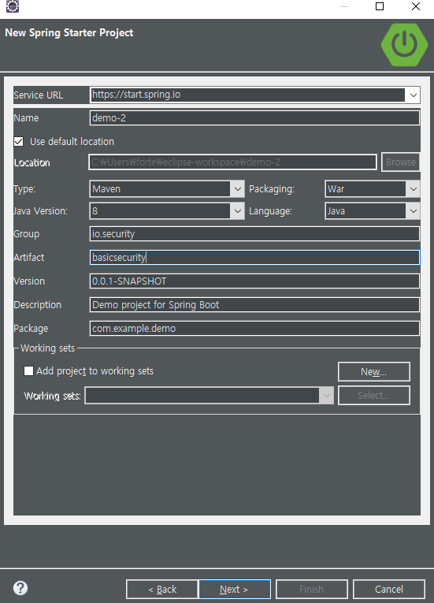

##### 프로젝트 생성

##### Controller 생성 

##### 실행 (Security 적용 전)

##### POM.XML 설정 (Security dependency 추가)

##### 실행 (Security 적용 후)

단지 POM.XML에 Security dependecy를 추가 한 후 실행 했을때의 화면이다.

기본적으로 제공되는 id는 user이며 pw는 실행 했을때 아래와 같이 나온다.

