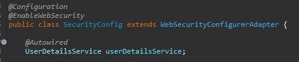
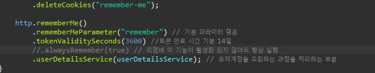
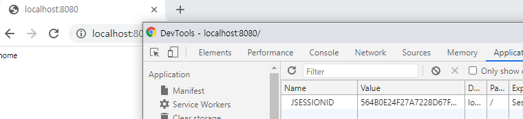
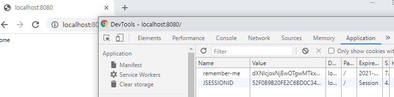

##### Remember Me

웹 사이트에 흔히 로그인화면에서 자동로그인 이라는 체크박스를 본 적이 있을 것이다.

그것이 Remember Me 기능을 사용한 것이다.

Remember Me란

* 세션이 만료되고 웹 브라우저가 종료 된 후에도 애플리케이션이 사용자를 기억 하는 기능
* Remember-Me 쿠키에 대한 Http 요청을 확인 한 후 토큰 기반 인증을 사용해 유효성을 검사하고 토큰이 검증되면 사용자는 로그인 된다.
* 사용자 라이프 사이클
  * 인증 성공 ( Remember-Me 쿠키 설정 )
  * 인증 실패 (쿠키가 존재하면 쿠키 무효화)
  * 로그아웃(쿠키가 존재하면 쿠키 무효화)

Spring Security에서 Remember Me 설정을 추가적으로 한다. 

지난번 블로깅에 이어 SecurityConfig 파일을 아래와 같이 수정한다.

상단에 UserDetailsService를 주입해준다.

위와 같이 설정후 어플리케이션 실행 후 Remember-me를 클릭하지 않고 로그인을 해본다

로그인후 JSESSIONID가 발급이 되는데 JSESSIONID를 삭제 후 화면을 새로고침하면 로그인 화면으로 이동한다.

다시 Remember-Me를 클릭 하고 로그인을 하게되면 아래와 같이 remember-me에 대한 토큰이 발급 된다. 이때 JSESSIONID를 지우고 새로고침을 하게 되도 remember-me 토큰에 의해 JSESSIONID가 다시 발급이 되고 로그인이 유지 된다. 

