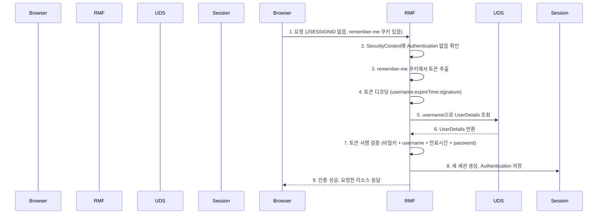
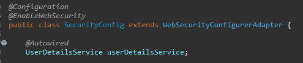
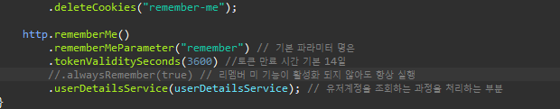
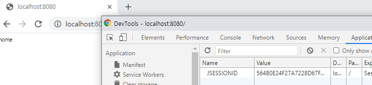
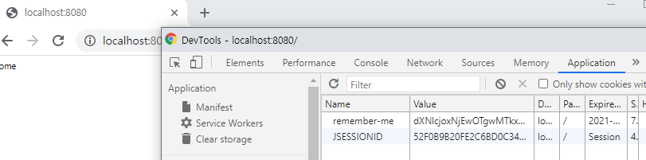

> 한 줄 요약: Remember Me는 세션이 만료되거나 브라우저를 닫아도 쿠키에 저장된 토큰으로 자동 재인증하여 로그인 상태를 장기간 유지하는 기능이다.

## 실생활 비유로 이해하는 Remember Me

자주 가는 카페의 단골 카드를 생각해 보겠습니다. 처음에는 신분증을 제시해 회원 가입을 하지만, 이후에는 단골 카드만 보여줘도 혜택을 받을 수 있습니다. 단골 카드는 지갑 속에 오래 보관되고, 카드가 있는 한 단골로 인정받습니다.

Remember Me 쿠키가 바로 이 단골 카드입니다. 브라우저를 닫아도(일반 세션 쿠키는 삭제됨) 기기에 남아 있는 Remember Me 쿠키를 통해 재방문 시 자동으로 로그인됩니다.

## Remember Me의 동작 원리

일반 세션 로그인과 Remember Me 로그인의 차이를 이해하는 것이 중요합니다.

**일반 세션 로그인**:
- 로그인 시 서버에 세션 생성, 브라우저에 `JSESSIONID` 쿠키 저장
- 브라우저 종료 시 `JSESSIONID`(세션 쿠키)는 삭제됨
- 재방문 시 세션이 없어 다시 로그인 필요

**Remember Me 로그인**:
- 로그인 시 서버에 세션 생성 + Remember Me 토큰 쿠키 저장
- 브라우저 종료 시 `JSESSIONID`는 삭제되지만 `remember-me` 쿠키는 유지됨
- 재방문 시 `remember-me` 쿠키로 자동 인증 후 새 세션 발급


```mermaid
sequenceDiagram
    participant "브라우저" as Browser
    participant "RememberMeAuthenticationFilter" as RMF
    participant "UserDetailsService" as UDS
    participant "세션" as Session

    Browser->>RMF: 1. 요청 (JSESSIONID 없음, remember-me 쿠키 있음)
    RMF->>RMF: 2. SecurityContext에 Authentication 없음 확인
    RMF->>RMF: 3. remember-me 쿠키에서 토큰 추출
    RMF->>RMF: 4. 토큰 디코딩 (username:expireTime:signature)
    RMF->>UDS: 5. username으로 UserDetails 조회
    UDS-->>RMF: 6. UserDetails 반환
    RMF->>RMF: 7. 토큰 서명 검증 (비밀키 + username + 만료시간 + password)
    RMF->>Session: 8. 새 세션 생성, Authentication 저장
    RMF-->>Browser: 9. 인증 성공, 요청한 리소스 응답
```

## 사용자 라이프사이클

Remember Me 기능의 사용자 상태 흐름입니다.

```mermaid
stateDiagram-v2
    [*] --> "미인증"
    "미인증" --> "인증됨": 로그인 성공 (Remember Me 체크)
    "인증됨" --> "세션만료": 브라우저 종료 또는 세션 타임아웃
    "세션만료" --> "자동재인증": remember-me 쿠키 유효
    "자동재인증" --> "인증됨": RememberMeAuthenticationFilter 처리
    "세션만료" --> "미인증": remember-me 쿠키 없거나 만료
    "인증됨" --> "미인증": 로그아웃 (쿠키 무효화)
    "인증됨" --> "미인증": 인증 실패 (쿠키 무효화)
```

## SecurityConfig에서 Remember Me 설정

```java
@Configuration
@EnableWebSecurity
public class SecurityConfig extends WebSecurityConfigurerAdapter {

    @Autowired
    private UserDetailsService userDetailsService;  // 사용자 정보 서비스 주입

    @Override
    protected void configure(HttpSecurity http) throws Exception {
        http
            .rememberMe()
                .rememberMeParameter("remember-me")         // HTML 체크박스의 name 속성
                .tokenValiditySeconds(86400)                // 토큰 유효 기간 (초): 86400 = 1일
                .alwaysRemember(false)                      // 체크박스 없어도 항상 기억할지 여부
                .userDetailsService(userDetailsService);    // 사용자 정보 조회 서비스
    }
}
```



### UserDetailsService 주입

Remember Me 기능은 토큰에서 사용자 이름을 추출한 뒤, `UserDetailsService`를 통해 최신 사용자 정보를 데이터베이스에서 다시 조회합니다. 따라서 반드시 `UserDetailsService` 빈을 주입해야 합니다.

```java
@Autowired
private UserDetailsService userDetailsService;
```



## HTML 로그인 폼에 Remember Me 체크박스 추가

```html
<form action="/login" method="post">
    <input type="text" name="username" placeholder="아이디">
    <input type="password" name="password" placeholder="비밀번호">
    <!-- remember-me 파라미터명은 SecurityConfig 설정과 일치해야 함 -->
    <input type="checkbox" name="remember-me"> 로그인 상태 유지
    <button type="submit">로그인</button>
</form>
```

## 동작 테스트

### Remember Me 미체크 로그인

체크박스를 선택하지 않고 로그인하면 `JSESSIONID`만 발급됩니다.



이 상태에서 `JSESSIONID` 쿠키를 삭제하면 즉시 로그인 페이지로 이동합니다.

### Remember Me 체크 후 로그인

Remember Me를 선택하고 로그인하면 `JSESSIONID`와 함께 `remember-me` 쿠키가 발급됩니다.



이 상태에서 `JSESSIONID`를 삭제해도, `remember-me` 쿠키가 남아 있어 페이지를 새로고침하면 자동으로 재인증되고 새로운 `JSESSIONID`가 발급됩니다.

## Remember Me 토큰 구조

Spring Security의 기본 Remember Me는 **Hash-based Token** 방식입니다.

```
remember-me 쿠키 값 = Base64(username + ":" + expirationTime + ":" + md5Hex(username + ":" + expirationTime + ":" + password + ":" + key))
```

토큰이 서버에 도달하면 다음 검증을 수행합니다.

1. Base64 디코딩으로 `username`, `expirationTime`, `signature` 추출
2. 현재 시각과 `expirationTime` 비교 (만료 여부 확인)
3. `UserDetailsService`로 사용자 정보 조회
4. 동일한 공식으로 서명을 재계산하여 쿠키의 서명과 비교

## Persistent Token 방식 (더 안전한 방법)

기본 Hash-based 방식의 단점은 비밀번호가 변경되어도 기존 쿠키가 여전히 유효하다는 점입니다. 데이터베이스에 토큰을 저장하는 **Persistent Token** 방식으로 더 강력한 보안을 구현할 수 있습니다.

```java
@Override
protected void configure(HttpSecurity http) throws Exception {
    http
        .rememberMe()
            .tokenRepository(persistentTokenRepository())  // DB 기반 토큰 저장소
            .userDetailsService(userDetailsService);
}

@Bean
public PersistentTokenRepository persistentTokenRepository() {
    JdbcTokenRepositoryImpl tokenRepository = new JdbcTokenRepositoryImpl();
    tokenRepository.setDataSource(dataSource);
    return tokenRepository;
}
```

Persistent Token 방식은 토큰을 DB에 저장하므로, 서버 측에서 언제든지 토큰을 무효화할 수 있습니다. 의심스러운 로그인 감지 시 강제 로그아웃도 가능합니다.

## 왜 이게 중요한가?

Remember Me 기능은 사용자 편의성과 보안 사이의 균형을 잡는 기능입니다. 너무 짧은 세션은 사용자를 불편하게 하고, 너무 긴 Remember Me 유효 기간은 보안 위험을 높입니다.

금융 서비스나 개인 정보를 다루는 서비스에서는 Remember Me를 비활성화하거나 매우 짧은 유효 기간을 설정하는 것이 권장됩니다. 반면 일반 커뮤니티 서비스에서는 7일~30일 정도의 유효 기간으로 편의성을 높일 수 있습니다.

## 보안 위협 시나리오

**쿠키 탈취를 통한 세션 재현**: 공격자가 네트워크 스니핑으로 `remember-me` 쿠키를 탈취하면, 유효 기간 내에 언제든지 해당 사용자로 인증할 수 있습니다. HTTPS 적용과 `Secure` 쿠키 플래그 설정으로 방어해야 합니다.

**비밀번호 변경 후에도 유효한 토큰**: Hash-based 방식에서는 비밀번호가 변경되면 기존 토큰이 무효화됩니다(비밀번호가 서명에 포함되기 때문). Persistent Token 방식에서는 비밀번호 변경 시 명시적으로 모든 토큰을 삭제하는 로직을 추가해야 합니다.

## 핵심 포인트 정리

- Remember Me는 브라우저 종료 후에도 쿠키로 자동 재인증하는 기능이다.
- `rememberMeParameter()`: HTML 체크박스의 `name` 속성과 일치시켜야 한다.
- `tokenValiditySeconds()`: 쿠키 유효 기간 (초 단위, 86400 = 1일).
- `userDetailsService()`: 토큰에서 사용자 정보를 재조회하기 위해 반드시 필요하다.
- 기본 Hash-based Token: 간단하지만 서버 측 토큰 무효화가 불가능.
- Persistent Token: DB에 저장하여 서버 측 강제 로그아웃 가능, 더 안전함.
- 민감한 정보를 다루는 서비스에서는 Remember Me 사용을 제한하거나 비활성화할 것.
