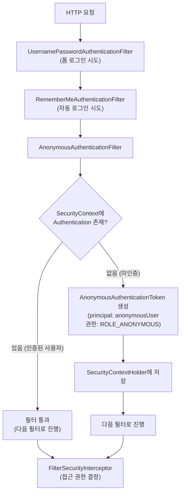
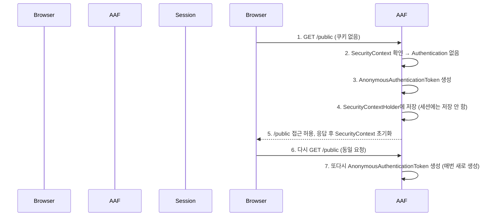

> 한 줄 요약: AnonymousAuthenticationFilter는 인증되지 않은 사용자에게 "익명 사용자" 역할의 인증 객체를 부여하여, null 체크 없이 일관된 방식으로 인증 여부를 판단할 수 있게 한다.

## 실생활 비유로 이해하는 익명 인증

대형 쇼핑몰에 들어갈 때를 생각해 보겠습니다. 회원 카드가 없어도 입장은 가능합니다. 단지 회원 전용 구역(포인트 적립, 특별 할인 등)에는 접근할 수 없을 뿐입니다. 이때 매장 직원은 방문객을 "비회원 손님"으로 구분하여 적절한 서비스를 제공합니다.

Spring Security의 AnonymousAuthenticationFilter가 바로 이 역할입니다. 로그인하지 않은 사용자를 단순히 "없음(null)"으로 처리하는 게 아니라, "익명 사용자"라는 명확한 정체성을 부여합니다. 이렇게 하면 코드에서 null 체크 없이 모든 사용자(인증/익명)를 일관된 방식으로 처리할 수 있습니다.

## AnonymousAuthenticationFilter의 역할

이 필터는 Spring Security 필터 체인에서 인증 관련 필터들 이후에 위치합니다. 앞선 필터들(UsernamePasswordAuthenticationFilter, RememberMeAuthenticationFilter 등)이 모두 인증을 처리하지 못했을 때 동작합니다.



핵심은 이 필터가 인증 객체를 **새로 생성하거나 덮어쓰지 않는다**는 점입니다. SecurityContext에 이미 Authentication 객체가 있으면 아무것도 하지 않습니다. 오직 Authentication이 없을 때만 익명 인증 토큰을 생성합니다.

## 익명 사용자와 인증 사용자 구분

```java
// 컨트롤러에서 인증 여부 확인하는 방법

@GetMapping("/mypage")
public String mypage(Authentication authentication) {
    // AnonymousAuthenticationFilter 덕분에 authentication은 절대 null이 아님
    if (authentication instanceof AnonymousAuthenticationToken) {
        // 익명 사용자
        return "redirect:/login";
    }
    // 인증된 사용자
    return "mypage";
}
```

Thymeleaf에서는 Spring Security 태그를 사용해 뷰에서도 구분할 수 있습니다.

```html
<!-- Thymeleaf + Spring Security -->
<div sec:authorize="isAnonymous()">
    <!-- 익명 사용자에게만 표시 -->
    <a href="/login">로그인</a>
    <a href="/signup">회원가입</a>
</div>

<div sec:authorize="isAuthenticated()">
    <!-- 인증된 사용자에게만 표시 -->
    <span sec:authentication="name">사용자명</span>
    <a href="/logout">로그아웃</a>
</div>
```

## isAnonymous()와 isAuthenticated()의 차이

Spring Security Expression에서 두 메서드의 차이를 정확히 이해해야 합니다.

| 표현식 | 익명 사용자 | 일반 인증 사용자 | Remember Me 사용자 |
|--------|------------|-----------------|-------------------|
| `isAnonymous()` | true | false | false |
| `isAuthenticated()` | false | true | true |
| `isFullyAuthenticated()` | false | true | false |
| `hasRole('USER')` | false | 권한에 따라 | 권한에 따라 |

`isFullyAuthenticated()`는 Remember Me로 자동 로그인된 사용자를 제외합니다. 비밀번호 변경, 결제 같은 중요한 작업에는 `isFullyAuthenticated()`를 사용하여 재인증을 강제하는 것이 좋습니다.

```java
http
    .authorizeRequests()
        .antMatchers("/public/**").permitAll()           // 모두 허용
        .antMatchers("/user/**").authenticated()         // 인증된 사용자 (익명 제외)
        .antMatchers("/payment/**").fullyAuthenticated() // 완전 인증만 허용 (Remember Me 제외)
        .antMatchers("/admin/**").hasRole("ADMIN")       // ADMIN 권한만 허용
```

## AnonymousAuthenticationToken 구조

```java
// AnonymousAuthenticationFilter가 생성하는 토큰
AnonymousAuthenticationToken anonymousToken = new AnonymousAuthenticationToken(
    "anonymousKey",           // 키 (고유 식별자)
    "anonymousUser",          // principal (사용자 식별자)
    List.of(new SimpleGrantedAuthority("ROLE_ANONYMOUS"))  // 권한
);
```

이 토큰은 `isAuthenticated()` 호출 시 항상 `false`를 반환합니다. 즉, `AnonymousAuthenticationToken`은 "인증이 없다"는 상태를 명시적으로 표현하는 객체입니다.

## 익명 사용자 커스터마이징

익명 사용자의 기본값을 변경할 수 있습니다.

```java
http
    .anonymous()
        .principal("guest")                          // 기본 "anonymousUser" 대신 "guest" 사용
        .authorities("ROLE_GUEST")                   // 기본 ROLE_ANONYMOUS 대신 ROLE_GUEST 사용
        .key("myCustomAnonymousKey");                // 토큰 키 변경
```

실무에서는 익명 사용자에게 특별한 권한을 부여하는 경우가 있습니다. 예를 들어 읽기 전용 게시판에는 익명 사용자도 접근 가능하도록 `ROLE_GUEST` 권한을 부여하는 방식입니다.

## 인증 객체를 세션에 저장하지 않는 이유

AnonymousAuthenticationToken은 세션에 저장되지 않습니다. 이는 매우 중요한 설계 결정입니다.

익명 사용자는 인증되지 않은 상태이므로, 세션에 저장할 의미 있는 사용자 정보가 없습니다. 모든 익명 요청마다 동일한 `AnonymousAuthenticationToken`을 생성하면 되므로 세션 저장이 불필요합니다. 또한 대량의 익명 트래픽에 대해 세션을 생성하지 않으므로 메모리를 절약할 수 있습니다.



## 왜 이게 중요한가?

AnonymousAuthenticationFilter가 없다면 코드 곳곳에서 null 체크가 필요합니다.

```java
// AnonymousAuthenticationFilter 없을 때 (null 체크 필요)
Authentication auth = SecurityContextHolder.getContext().getAuthentication();
if (auth == null || !auth.isAuthenticated()) {
    // 미인증 처리
}

// AnonymousAuthenticationFilter 있을 때 (null 걱정 없음)
Authentication auth = SecurityContextHolder.getContext().getAuthentication();
if (auth instanceof AnonymousAuthenticationToken) {
    // 익명 사용자 처리
} else {
    // 인증된 사용자 처리
}
```

Null Object Pattern을 적용하여 코드를 더 안전하고 일관되게 만드는 것이 이 필터의 핵심 가치입니다.

## 보안 위협 시나리오

AnonymousAuthenticationFilter 자체는 보안 위협의 대상이 아닙니다. 오히려 이 필터의 부재가 위험합니다. null 체크를 빠뜨리면 `NullPointerException`이 발생하거나, 예상치 못한 동작으로 보안 로직이 우회될 수 있습니다.

주의할 점은 익명 사용자에게 부여된 `ROLE_ANONYMOUS` 권한을 의도치 않게 중요한 URL에 허용하는 실수입니다. `permitAll()`과 `anonymous()` 표현식의 차이를 명확히 알고 사용해야 합니다.

## 핵심 포인트 정리

- AnonymousAuthenticationFilter는 미인증 사용자에게 `AnonymousAuthenticationToken`을 부여한다.
- SecurityContext에 이미 Authentication이 있으면 아무것도 하지 않는다.
- 익명 인증 객체는 세션에 저장되지 않아 요청마다 새로 생성된다.
- `isAnonymous()`: 익명 사용자만 true, `isAuthenticated()`: 인증된 사용자(Remember Me 포함)만 true.
- `isFullyAuthenticated()`: Remember Me 사용자를 제외한 완전 인증 사용자만 true.
- Null Object Pattern을 통해 코드 전반에서 null 체크를 제거하는 설계 패턴을 적용한다.
- 결제, 비밀번호 변경 등 중요 작업에는 `fullyAuthenticated()`를 사용해 재인증을 강제할 것.
