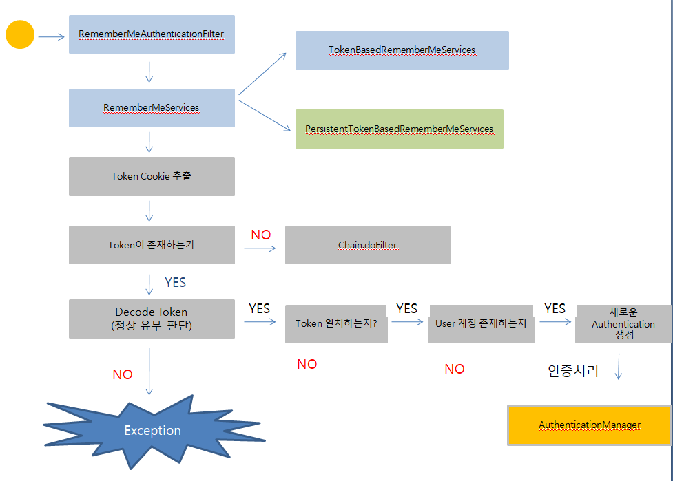

##### RememberMeAuthenticationFilter

지난 블로깅에서 Spring Security Remember Me를 적용하는법에 대해 알아보았는데

이번 블로깅에서는 어떤 절차로 Remember Me 인증이 이루어지는지 알아보겠다.

 Remember Me 인증 철차는 아래의 그림과 같이 이루어진다.

**Security Remember Me 인증 절차**

