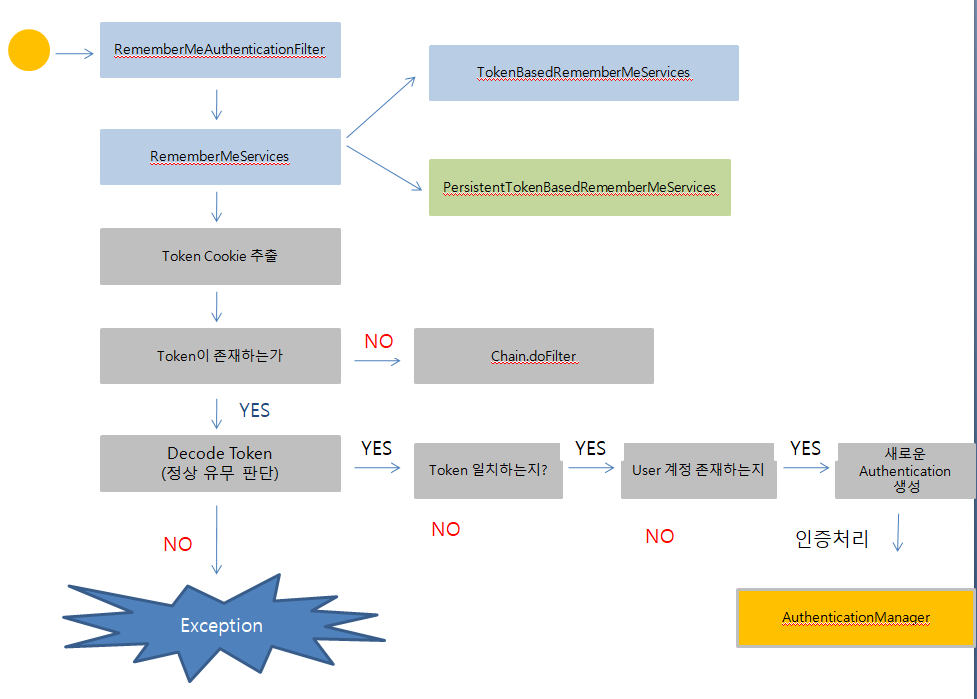
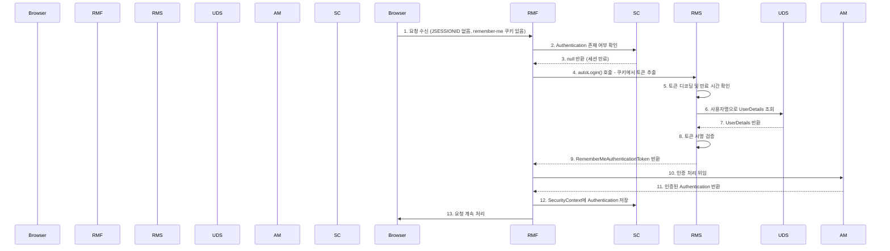
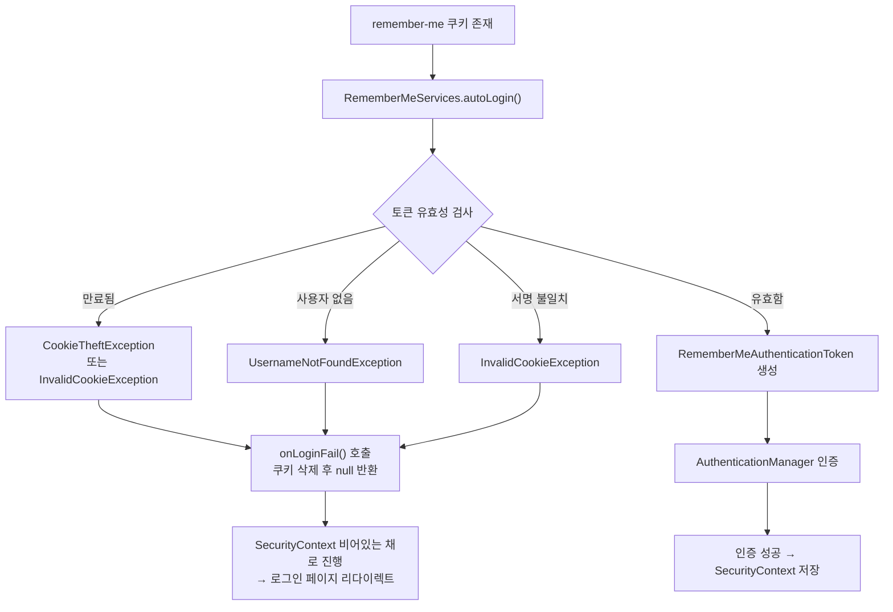

> 한 줄 요약: RememberMeAuthenticationFilter는 세션이 만료된 상태에서 Remember Me 쿠키가 존재할 때 자동으로 토큰을 검증하고 재인증을 처리하는 필터다.

## 실생활 비유로 이해하기

장기 주차권을 생각해 보겠습니다. 일일 주차권(일반 세션)이 만료되어도, 월정액 주차권(Remember Me 쿠키)이 있다면 다시 주차장에 입장할 수 있습니다. 주차 관리 시스템(RememberMeAuthenticationFilter)은 월정액 주차권의 유효성을 확인하고, 유효하다면 자동으로 입장을 허용합니다.

## 필터 동작 조건

RememberMeAuthenticationFilter는 다음 두 조건이 동시에 충족될 때만 동작합니다.

1. SecurityContext에 Authentication 객체가 **없음** (세션 만료 또는 미로그인)
2. 요청 쿠키에 `remember-me` 쿠키가 **존재함**

이 조건이 충족되지 않으면 필터는 아무것도 하지 않고 다음 필터로 제어를 넘깁니다.

## RememberMeAuthenticationFilter 처리 흐름




```mermaid
sequenceDiagram
    participant "브라우저" as Browser
    participant "RememberMeAuthenticationFilter" as RMF
    participant "RememberMeServices" as RMS
    participant "UserDetailsService" as UDS
    participant "AuthenticationManager" as AM
    participant "SecurityContext" as SC

    Browser->>RMF: 1. 요청 수신 (JSESSIONID 없음, remember-me 쿠키 있음)
    RMF->>SC: 2. Authentication 존재 여부 확인
    SC-->>RMF: 3. null 반환 (세션 만료)
    RMF->>RMS: 4. autoLogin() 호출 - 쿠키에서 토큰 추출
    RMS->>RMS: 5. 토큰 디코딩 및 만료 시간 확인
    RMS->>UDS: 6. 사용자명으로 UserDetails 조회
    UDS-->>RMS: 7. UserDetails 반환
    RMS->>RMS: 8. 토큰 서명 검증
    RMS-->>RMF: 9. RememberMeAuthenticationToken 반환
    RMF->>AM: 10. 인증 처리 위임
    AM-->>RMF: 11. 인증된 Authentication 반환
    RMF->>SC: 12. SecurityContext에 Authentication 저장
    RMF->>Browser: 13. 요청 계속 처리
```

## 핵심 컴포넌트: RememberMeServices

`RememberMeServices`는 Remember Me의 핵심 인터페이스입니다. 두 가지 구현체가 있습니다.

### TokenBasedRememberMeServices (기본)

쿠키에 사용자 정보와 서명을 직접 담는 방식입니다. 서버에 별도 저장소가 필요 없지만, 서버 측에서 토큰을 강제 무효화할 수 없습니다.

```java
// 토큰 생성 공식
String signature = md5Hex(username + ":" + expirationTime + ":" + password + ":" + key);
String tokenValue = username + ":" + expirationTime + ":" + signature;
String cookieValue = Base64.encode(tokenValue);
```

### PersistentTokenBasedRememberMeServices

토큰을 데이터베이스에 저장하는 방식입니다. 서버 측에서 언제든지 토큰을 삭제하여 강제 로그아웃할 수 있습니다.

```java
// DB 테이블 구조 (persistent_logins)
// series: 토큰 시리즈 식별자 (쿠키에 저장)
// token: 실제 인증 토큰 (매 인증마다 갱신)
// username: 사용자명
// last_used: 마지막 사용 시간

CREATE TABLE persistent_logins (
    username VARCHAR(64) NOT NULL,
    series   VARCHAR(64) PRIMARY KEY,
    token    VARCHAR(64) NOT NULL,
    last_used TIMESTAMP NOT NULL
);
```

## 토큰 검증 실패 처리

Remember Me 토큰 검증이 실패하는 경우와 그 처리 방식입니다.


```mermaid
flowchart TD
    A["remember-me 쿠키 존재"] --> B["RememberMeServices.autoLogin()"]
    B --> C{"토큰 유효성 검사"}
    C -- "만료됨" --> D["CookieTheftException\n또는 InvalidCookieException"]
    C -- "사용자 없음" --> E["UsernameNotFoundException"]
    C -- "서명 불일치" --> F["InvalidCookieException"]
    C -- "유효함" --> G["RememberMeAuthenticationToken 생성"]
    D --> H["onLoginFail() 호출\n쿠키 삭제 후 null 반환"]
    E --> H
    F --> H
    G --> I["AuthenticationManager 인증"]
    H --> J["SecurityContext 비어있는 채로 진행\n→ 로그인 페이지 리다이렉트"]
    I --> K["인증 성공 → SecurityContext 저장"]
```

토큰 검증 실패 시 `onLoginFail()` 메서드가 호출되어 쿠키를 삭제하고 `null`을 반환합니다. 이후 필터 체인이 계속 진행되어 인증되지 않은 상태로 로그인 페이지로 이동하게 됩니다.

## RememberMeAuthenticationToken vs UsernamePasswordAuthenticationToken

두 토큰 타입의 차이를 이해하는 것이 중요합니다.

```java
// 일반 로그인으로 생성되는 토큰
UsernamePasswordAuthenticationToken token =
    new UsernamePasswordAuthenticationToken(userDetails, null, userDetails.getAuthorities());
// isAuthenticated() == true
// getCredentials() == null (비밀번호 보안을 위해 인증 후 제거)

// Remember Me로 생성되는 토큰
RememberMeAuthenticationToken token =
    new RememberMeAuthenticationToken(key, userDetails, userDetails.getAuthorities());
// isAuthenticated() == true
// isFullyAuthenticated() == false (중요!)
```

`RememberMeAuthenticationToken`은 `isAuthenticated()`는 `true`이지만, `isFullyAuthenticated()`는 `false`입니다. 이 차이를 활용해 중요한 작업에서 재인증을 요구할 수 있습니다.

## 실무 활용 패턴

중요한 작업(비밀번호 변경, 계좌이체 등)에서 Remember Me 사용자를 구분하여 재인증을 강제하는 패턴입니다.

```java
// SecurityConfig에서 중요 URL에 fullyAuthenticated() 적용
http
    .authorizeRequests()
        .antMatchers("/mypage/**").authenticated()         // Remember Me도 허용
        .antMatchers("/password/change").fullyAuthenticated()  // 반드시 직접 로그인 필요
        .antMatchers("/payment/**").fullyAuthenticated();  // 결제도 직접 로그인 필요
```

```java
// 컨트롤러에서 직접 체크하는 방식
@GetMapping("/sensitive-action")
public String sensitiveAction(Authentication authentication) {
    if (authentication instanceof RememberMeAuthenticationToken) {
        // Remember Me 사용자에게 재인증 요청
        return "redirect:/login?reauth=true";
    }
    return "sensitive-page";
}
```

## 필터 체인에서의 위치

RememberMeAuthenticationFilter는 `UsernamePasswordAuthenticationFilter` 다음, `AnonymousAuthenticationFilter` 이전에 위치합니다.

```
요청
 ↓
UsernamePasswordAuthenticationFilter  (폼 로그인 처리)
 ↓ (폼 로그인 실패/해당 없음)
RememberMeAuthenticationFilter        (Remember Me 자동 로그인)
 ↓ (Remember Me 없거나 실패)
AnonymousAuthenticationFilter         (익명 사용자 토큰 생성)
 ↓
FilterSecurityInterceptor             (접근 권한 결정)
```

이 순서가 중요한 이유는, 앞선 필터가 인증에 성공하면 뒤의 필터는 동작하지 않기 때문입니다.

## 왜 이게 중요한가?

RememberMeAuthenticationFilter를 이해하면 자동 로그인 구현의 복잡성을 파악할 수 있습니다. 단순히 쿠키를 읽는 것이 아니라, 토큰 검증, 사용자 정보 재조회, 서명 확인, 새 세션 생성 등 여러 단계의 보안 검사가 이루어집니다.

또한 `RememberMeAuthenticationToken`과 `UsernamePasswordAuthenticationToken`의 차이를 알아야 `isFullyAuthenticated()`를 올바르게 활용하여 보안 수준을 세밀하게 제어할 수 있습니다.

## 보안 위협 시나리오

**토큰 탈취 후 재사용**: Remember Me 쿠키를 탈취하면 유효 기간 내에 자유롭게 재사용할 수 있습니다. Persistent Token 방식에서는 동일한 series로 다른 token이 들어오면 토큰 탈취로 판단하여 해당 사용자의 모든 Remember Me 세션을 무효화하는 "쿠키 도난 감지" 기능을 제공합니다.

**세션 고정 공격**: Remember Me 재인증 후에는 새로운 세션 ID가 발급되어야 합니다. Spring Security는 기본적으로 `changeSessionId()` 전략으로 세션 고정 공격을 방어합니다.

## 핵심 포인트 정리

- RememberMeAuthenticationFilter는 Authentication이 없고 remember-me 쿠키가 있을 때만 동작한다.
- `TokenBasedRememberMeServices`: 쿠키에 서명 포함, 서버 저장소 불필요, 서버 측 무효화 불가.
- `PersistentTokenBasedRememberMeServices`: DB에 토큰 저장, 서버 측 강제 로그아웃 가능.
- `RememberMeAuthenticationToken.isFullyAuthenticated()` == false: 중요 작업에서 재인증 강제 가능.
- 토큰 검증 실패 시 쿠키 자동 삭제 후 로그인 페이지로 이동.
- Persistent Token 방식은 토큰 탈취 감지 기능을 제공하여 더 안전하다.
- 결제, 비밀번호 변경 등 민감한 작업에는 `fullyAuthenticated()`로 Remember Me 사용자를 차단할 것.
