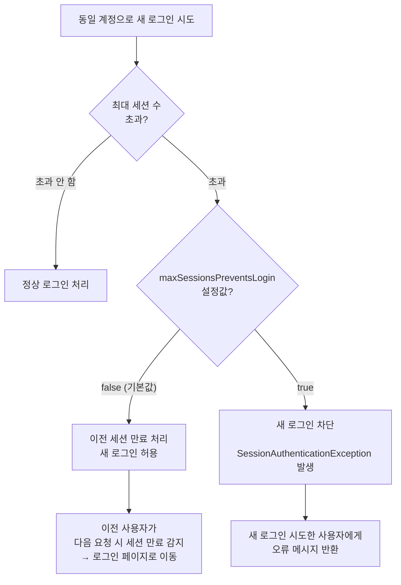
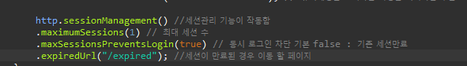
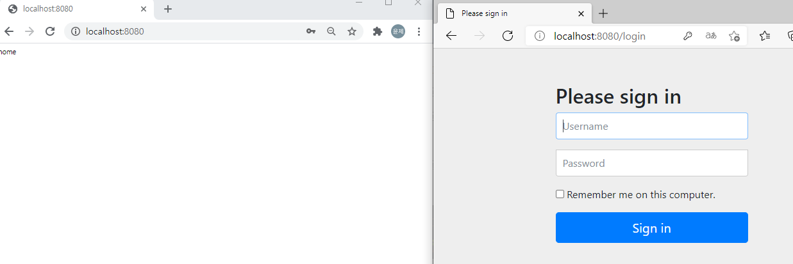
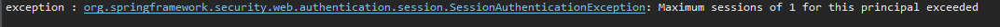
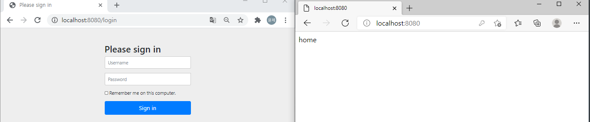
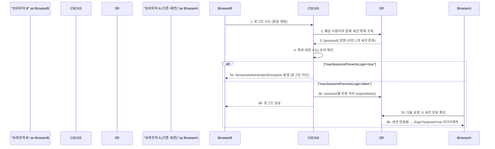

> 한 줄 요약: 동시 세션 제어는 동일 계정의 중복 로그인을 관리하는 기능으로, 이전 세션 만료 또는 신규 로그인 차단 두 가지 전략을 제공한다.

## 실생활 비유로 이해하기

넷플릭스나 왓챠 같은 스트리밍 서비스를 생각해 보겠습니다. 요금제에 따라 동시에 접속할 수 있는 기기 수가 제한됩니다. 기본 요금제는 1개 기기, 프리미엄은 4개 기기까지 허용됩니다. 만약 허용 기기 수를 초과하면 "다른 기기에서 접속 중입니다"라는 메시지와 함께 이전 세션이 종료되거나 새 로그인이 차단됩니다.

Spring Security의 동시 세션 제어가 바로 이 기능입니다.

## 두 가지 제어 전략

동시 세션 제어에는 두 가지 전략이 있으며, 비즈니스 요구사항에 따라 선택합니다.


```mermaid
flowchart TD
    A["동일 계정으로 새 로그인 시도"] --> B{"최대 세션 수\n초과?"}
    B -- "초과 안 함" --> C["정상 로그인 처리"]
    B -- "초과" --> D{"maxSessionsPreventsLogin\n설정값?"}
    D -- "false (기본값)" --> E["이전 세션 만료 처리\n새 로그인 허용"]
    D -- "true" --> F["새 로그인 차단\n SessionAuthenticationException 발생"]
    E --> G["이전 사용자가\n다음 요청 시 세션 만료 감지\n→ 로그인 페이지로 이동"]
    F --> H["새 로그인 시도한 사용자에게\n오류 메시지 반환"]
```

### 전략 1: 이전 세션 만료 (기본값, maxSessionsPreventsLogin=false)

새로운 로그인을 허용하고 기존 세션을 만료시킵니다. 이미 로그인된 사용자가 다음 요청을 보낼 때 세션 만료 메시지를 받게 됩니다.

**사용 사례**: 사용자가 새 기기에서 로그인하면 이전 기기의 세션을 자동으로 종료하는 서비스 (예: 게임, 스트리밍)

### 전략 2: 신규 로그인 차단 (maxSessionsPreventsLogin=true)

기존 세션을 유지하고 새로운 로그인 시도를 차단합니다.

**사용 사례**: 계정 공유를 엄격히 금지하는 서비스, 또는 보안이 중요한 기업 내부 시스템

## SecurityConfig 설정

```java
@Configuration
@EnableWebSecurity
public class SecurityConfig extends WebSecurityConfigurerAdapter {

    @Override
    protected void configure(HttpSecurity http) throws Exception {
        http
            .sessionManagement()
                .maximumSessions(1)                  // 최대 허용 세션 수
                .maxSessionsPreventsLogin(false)      // false: 이전 세션 만료 (기본)
                                                     // true: 새 로그인 차단
                .expiredUrl("/login?expired=true")   // 세션 만료 시 이동할 URL
                .sessionRegistry(sessionRegistry()); // 세션 목록 관리 빈
    }

    @Bean
    public SessionRegistry sessionRegistry() {
        return new SessionRegistryImpl();
    }

    // 스프링 빈으로 등록하여 세션 이벤트 처리
    @Bean
    public HttpSessionEventPublisher httpSessionEventPublisher() {
        return new HttpSessionEventPublisher();
    }
}
```



## 동작 테스트

### 전략 2 테스트 (maxSessionsPreventsLogin=true)

두 개의 브라우저에서 동일 계정으로 로그인을 시도합니다.



첫 번째 브라우저(좌측)에서 이미 로그인된 상태에서 두 번째 브라우저(우측)로 로그인을 시도하면, 로그인이 차단되고 서버 로그에 `SessionAuthenticationException`이 발생합니다.



### 전략 1 테스트 (maxSessionsPreventsLogin=false)



두 브라우저 모두 로그인에 성공하지만, 좌측 브라우저에서 새로고침하면 세션이 만료되어 로그인 페이지로 이동합니다. 이는 새로운 로그인이 이전 세션을 만료 처리했기 때문입니다.

## 내부 동작 원리

동시 세션 제어는 `ConcurrentSessionControlAuthenticationStrategy`와 `SessionRegistry`가 협력하여 동작합니다.


```mermaid
sequenceDiagram
    participant "브라우저 B" as BrowserB
    participant "ConcurrentSessionControlAuthenticationStrategy" as CSCAS
    participant "SessionRegistry" as SR
    participant "브라우저 A (기존 세션)" as BrowserA

    BrowserB->>CSCAS: 1. 로그인 시도 (동일 계정)
    CSCAS->>SR: 2. 해당 사용자의 현재 세션 목록 조회
    SR-->>CSCAS: 3. [sessionA] 반환 (이미 1개 세션 존재)
    CSCAS->>CSCAS: 4. 최대 세션 수(1) 초과 확인
    alt "maxSessionsPreventsLogin=true"
        CSCAS-->>BrowserB: 5a. SessionAuthenticationException 발생 (로그인 차단)
    else "maxSessionsPreventsLogin=false"
        CSCAS->>SR: 5b. sessionA를 만료 처리 (expireNow())
        CSCAS-->>BrowserB: 6b. 로그인 성공
        BrowserA->>SR: 7b. 다음 요청 시 세션 만료 확인
        SR-->>BrowserA: 8b. 세션 만료됨 → /login?expired=true 리다이렉트
    end
```

## SessionRegistry 활용

`SessionRegistry`를 빈으로 등록하면 현재 로그인된 사용자 목록을 프로그래밍 방식으로 조회하고 관리할 수 있습니다.

```java
@Service
public class SessionService {

    @Autowired
    private SessionRegistry sessionRegistry;

    // 현재 로그인된 사용자 목록 조회
    public List<String> getLoggedInUsers() {
        return sessionRegistry.getAllPrincipals().stream()
            .filter(principal -> !sessionRegistry.getAllSessions(principal, false).isEmpty())
            .map(principal -> ((UserDetails) principal).getUsername())
            .collect(Collectors.toList());
    }

    // 특정 사용자 강제 로그아웃
    public void forceLogout(String username) {
        sessionRegistry.getAllPrincipals().stream()
            .filter(p -> ((UserDetails) p).getUsername().equals(username))
            .forEach(p -> sessionRegistry.getAllSessions(p, false)
                .forEach(SessionInformation::expireNow));
    }
}
```

이 기능을 활용하면 관리자 페이지에서 특정 사용자를 강제 로그아웃시키거나, 현재 접속자 수를 모니터링할 수 있습니다.

## HttpSessionEventPublisher 등록 이유

`HttpSessionEventPublisher`를 스프링 빈으로 등록해야 하는 이유가 있습니다. 이 빈은 서블릿 컨테이너의 세션 이벤트(`HttpSessionCreatedEvent`, `HttpSessionDestroyedEvent`)를 Spring의 이벤트 시스템으로 변환합니다. `SessionRegistry`가 이 이벤트를 구독하여 세션 목록을 최신 상태로 유지합니다. 이 빈 없이는 세션이 만료되어도 `SessionRegistry`에서 제거되지 않아 세션 목록이 점점 쌓이게 됩니다.

## 왜 이게 중요한가?

동시 세션 제어는 보안과 비즈니스 요구사항을 모두 충족하는 중요한 기능입니다.

**보안 관점**: 계정이 탈취된 경우, 공격자가 해당 계정으로 로그인하면 원래 사용자의 세션이 만료됩니다. 원래 사용자는 갑자기 로그아웃되는 것을 통해 계정 탈취를 인지할 수 있습니다.

**비즈니스 관점**: 유료 서비스에서 계정 공유를 제한하여 수익을 보호할 수 있습니다.

## 보안 위협 시나리오

**세션 만료 타이밍 공격**: 전략 1(이전 세션 만료)을 사용하는 경우, 공격자가 탈취한 계정으로 로그인하면 원래 사용자가 로그아웃됩니다. 이를 이용해 정상 사용자를 지속적으로 로그아웃시키는 서비스 방해 공격이 가능합니다. 전략 2(신규 로그인 차단)는 이 공격을 방어하지만, 정상 사용자가 여러 기기를 사용할 수 없다는 불편함이 있습니다.

## 핵심 포인트 정리

- `maximumSessions(n)`: 동일 계정의 최대 허용 세션 수 설정.
- `maxSessionsPreventsLogin(false)`: 새 로그인 허용 + 이전 세션 만료 (기본값).
- `maxSessionsPreventsLogin(true)`: 이전 세션 유지 + 새 로그인 차단.
- `SessionRegistry` 빈 등록으로 현재 로그인 사용자 목록 조회 및 강제 로그아웃 가능.
- `HttpSessionEventPublisher` 빈 등록 필수: 세션 소멸 이벤트를 SessionRegistry에 전달.
- `expiredUrl()`: 세션 만료 감지 시 이동할 URL 지정.
- 강제 로그아웃 기능으로 보안 이벤트 대응 및 관리자 기능 구현 가능.
