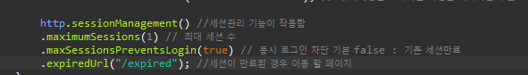

##### 동시 세션 제어

Spring Security에서 동시 세션을 제어하는 방법으로는 2가지가 있다.

아래의 그림을 보자.

첫번째 방법으로는 서버에서 설정한 최대 세션 허용 개수를 넘어서면 이전 사용자의 세션을 만료 시키는 것이다. 

두번째 방법으로는 로그인 하려는 사용자의 인증에 대해 예외를 발생 시키는 것이다.

이 두가지 방법에 대해 Security에 적용하여 실제로 테스트를 해보자.

Spring Security 동시 세션 제어 설정을 위한 코드는 다음과 같다.

SecurityConfig.java 

위 코드에서 설정한 maxSessionPreventsLogin이 동시 로그인 차단을 하는 부분이다. 

기본은 false => 기존 세션 만료를 시키는 것이고 true일 경우 로그인 하려는 사용자의 인증에 대해 예외를 발생시킨다.

서버 실행 후 확인 해보자.

위와 같이 다른 브라우저를 켜서 접속을 할 경우 우측 브라우저는 로그인이 되지 않고 

서버에는 아래와 같이 maximum session 예외가 발생한다.

이번에는 maxSessionPreventsLogin을 false로 설정하고 테스트 해보자.

처음에는 두 브라우저다 로그인이 되지만, 좌측 브라우저는 새로고침하면 세션이 만료되어 로그인 화면으로 이동된다.

