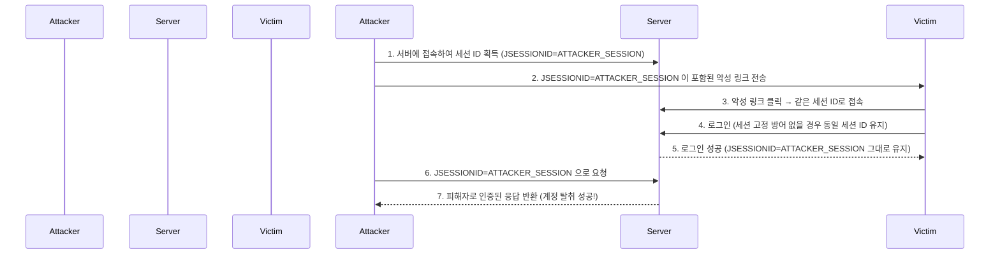
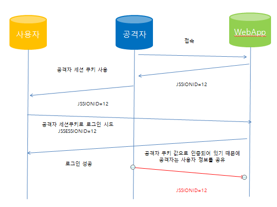
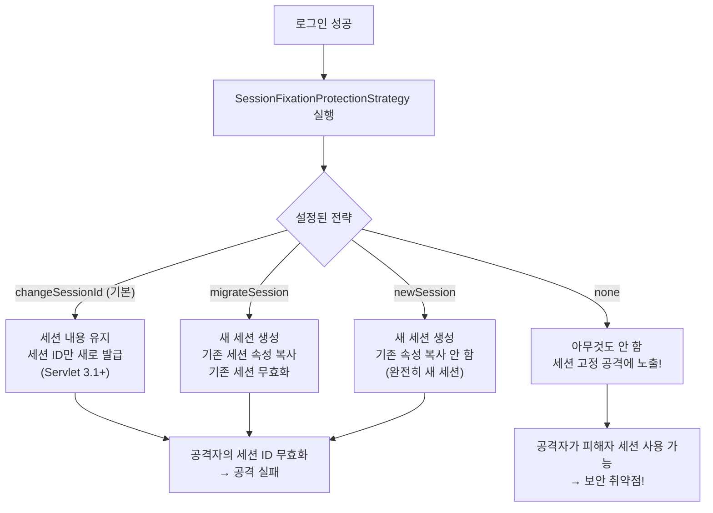
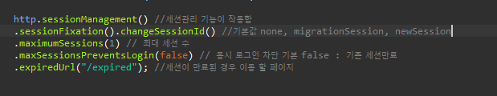
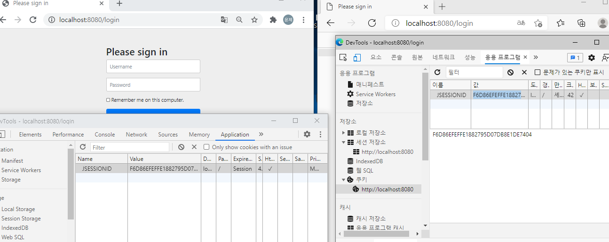
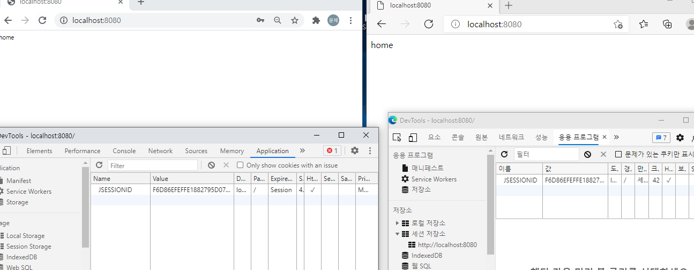
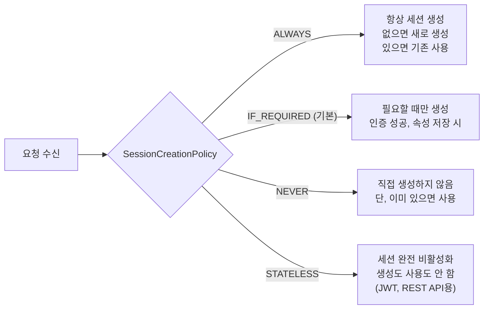
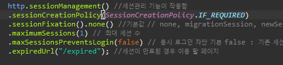

> 한 줄 요약: 세션 고정 공격은 공격자가 미리 심어둔 세션 ID로 피해자가 인증하게 만드는 공격이며, Spring Security는 로그인 시 새 세션을 발급하여 이를 방어한다.

## 세션 고정 공격이란

도서관 회원증 비유를 다시 들어보겠습니다. 악의적인 사람이 가짜 회원증 번호를 인터넷에 올려 누군가가 그 번호로 회원 가입하도록 유도합니다. 피해자가 그 번호로 회원 가입(인증)을 완료하면, 공격자는 같은 번호를 사용해 도서관에서 피해자 행세를 할 수 있게 됩니다.

세션 고정 공격(Session Fixation Attack)이 바로 이 방식입니다.


```mermaid
sequenceDiagram
    participant "공격자" as Attacker
    participant "서버" as Server
    participant "피해자" as Victim

    Attacker->>Server: 1. 서버에 접속하여 세션 ID 획득 (JSESSIONID=ATTACKER_SESSION)
    Attacker->>Victim: 2. JSESSIONID=ATTACKER_SESSION 이 포함된 악성 링크 전송
    Victim->>Server: 3. 악성 링크 클릭 → 같은 세션 ID로 접속
    Victim->>Server: 4. 로그인 (세션 고정 방어 없을 경우 동일 세션 ID 유지)
    Server-->>Victim: 5. 로그인 성공 (JSESSIONID=ATTACKER_SESSION 그대로 유지)
    Attacker->>Server: 6. JSESSIONID=ATTACKER_SESSION 으로 요청
    Server-->>Attacker: 7. 피해자로 인증된 응답 반환 (계정 탈취 성공!)
```

이 공격의 핵심은 서버가 인증 전후에 **동일한 세션 ID를 유지**한다는 취약점을 이용한다는 점입니다.

## 세션 고정 보호 전략

Spring Security는 로그인 성공 시 새로운 세션 또는 세션 ID를 발급하여 이 공격을 방어합니다.




```mermaid
flowchart TD
    A["로그인 성공"] --> B["SessionFixationProtectionStrategy 실행"]
    B --> C{"설정된 전략"}
    C -- "changeSessionId (기본)" --> D["세션 내용 유지\n세션 ID만 새로 발급\n(Servlet 3.1+)"]
    C -- "migrateSession" --> E["새 세션 생성\n기존 세션 속성 복사\n기존 세션 무효화"]
    C -- "newSession" --> F["새 세션 생성\n기존 속성 복사 안 함\n(완전히 새 세션)"]
    C -- "none" --> G["아무것도 안 함\n세션 고정 공격에 노출!"]
    D --> H["공격자의 세션 ID 무효화\n→ 공격 실패"]
    E --> H
    F --> H
    G --> I["공격자가 피해자 세션 사용 가능\n→ 보안 취약점!"]
```

## SecurityConfig 설정

```java
@Configuration
@EnableWebSecurity
public class SecurityConfig extends WebSecurityConfigurerAdapter {

    @Override
    protected void configure(HttpSecurity http) throws Exception {
        http
            .sessionManagement()
                .sessionFixation()
                    .changeSessionId();  // 기본값: 가장 권장되는 설정
                    // .migrateSession()   // 새 세션 생성 + 속성 이전
                    // .newSession()       // 새 세션 생성 (속성 이전 없음)
                    // .none()             // 비활성화 (보안 취약, 사용 금지)
    }
}
```



## 각 전략 비교

| 전략 | 동작 | 기존 속성 유지 | 보안 수준 | 권장 여부 |
|------|------|--------------|----------|----------|
| `changeSessionId()` | 세션 ID만 변경 (Servlet 3.1+) | 유지 | 높음 | **권장** |
| `migrateSession()` | 새 세션 생성 + 속성 이전 | 유지 | 높음 | 권장 |
| `newSession()` | 완전히 새 세션 생성 | 미유지 | 높음 | 상황에 따라 |
| `none()` | 아무 처리 안 함 | 유지 | 없음 | **절대 금지** |

`changeSessionId()`가 기본값인 이유는 새 세션을 생성하는 것보다 오버헤드가 적고, Servlet 3.1 스펙에서 공식 지원하는 방식이기 때문입니다.

## none() 설정 시 공격 시나리오

`sessionFixation.none()`으로 설정한 경우의 공격 성공 시나리오입니다.



우측 브라우저(공격자)의 `JSESSIONID` 값을 복사하여 좌측 브라우저(피해자)의 쿠키에 설정합니다. 피해자가 해당 세션으로 로그인하면 세션 ID가 변경되지 않아, 공격자도 같은 세션으로 접근할 수 있게 됩니다.



`none()` 이외의 설정에서는 로그인 성공 시 새로운 세션 ID가 발급되므로, 공격자가 가지고 있던 세션 ID는 무효화됩니다.

## 세션 정책 설정

세션 고정 보호와 함께 세션 생성 정책도 설정할 수 있습니다. 세션 정책은 Spring Security가 세션을 언제 생성할지를 결정합니다.

```java
http
    .sessionManagement()
        .sessionCreationPolicy(SessionCreationPolicy.IF_REQUIRED); // 기본값
```

### 세션 정책 종류


```mermaid
flowchart LR
    A["요청 수신"] --> B{"SessionCreationPolicy"}
    B -- "ALWAYS" --> C["항상 세션 생성\n없으면 새로 생성\n있으면 기존 사용"]
    B -- "IF_REQUIRED (기본)" --> D["필요할 때만 생성\n인증 성공, 속성 저장 시"]
    B -- "NEVER" --> E["직접 생성하지 않음\n단, 이미 있으면 사용"]
    B -- "STATELESS" --> F["세션 완전 비활성화\n생성도 사용도 안 함\n(JWT, REST API용)"]
```



### 각 정책 설명

**ALWAYS**: 세션이 없으면 항상 새로 생성합니다. 세션을 적극적으로 활용하는 애플리케이션에 적합합니다.

**IF_REQUIRED (기본값)**: 인증 성공, 세션 속성 저장 등 세션이 필요한 경우에만 생성합니다. 대부분의 웹 애플리케이션에 적합한 기본값입니다.

**NEVER**: Spring Security가 직접 세션을 생성하지는 않지만, 다른 컴포넌트가 생성한 세션이 있으면 사용합니다.

**STATELESS**: 세션을 전혀 사용하지 않습니다. JWT(JSON Web Token) 기반 인증을 사용하는 REST API 서버에 적합합니다. 이 설정에서는 SecurityContextPersistenceFilter도 세션을 사용하지 않습니다.

## REST API에서의 세션 정책

JWT 기반 REST API에서는 `STATELESS` 정책을 사용합니다.

```java
@Configuration
@EnableWebSecurity
public class JwtSecurityConfig extends WebSecurityConfigurerAdapter {

    @Override
    protected void configure(HttpSecurity http) throws Exception {
        http
            .csrf().disable()  // REST API에서는 CSRF 불필요
            .sessionManagement()
                .sessionCreationPolicy(SessionCreationPolicy.STATELESS)  // 세션 미사용
            .and()
            .addFilterBefore(jwtAuthenticationFilter(), UsernamePasswordAuthenticationFilter.class);
            // JWT 검증 필터를 폼 로그인 필터 앞에 삽입
    }
}
```

`STATELESS` 설정 시 `SessionFixationProtectionStrategy`는 동작하지 않습니다. JWT 자체가 stateless하므로 세션 고정 공격과 무관합니다.

## 왜 이게 중요한가?

세션 고정 공격은 비교적 단순한 공격이지만 그 결과는 심각합니다. 공격자가 피해자의 인증된 세션을 완전히 장악하여 모든 권한을 행사할 수 있습니다. Spring Security가 기본으로 `changeSessionId()`를 적용하는 이유는, 이 공격이 너무 쉽게 발생할 수 있기 때문입니다.

개발자가 `none()`으로 변경하지 않는 이상 Spring Security는 기본적으로 이 공격을 방어합니다. 반드시 기본값을 유지하거나 `changeSessionId()`, `migrateSession()` 중 하나를 선택해야 합니다.

## 보안 위협 시나리오

**소셜 엔지니어링 결합 공격**: 공격자가 세션 ID가 포함된 링크를 이메일, 메신저 등으로 전송합니다. "특별 할인 쿠폰을 받으려면 이 링크를 클릭하세요"와 같은 방식으로 피해자를 속입니다. 피해자가 링크를 클릭하고 로그인하면 세션 고정 공격이 성공합니다.

Spring Security의 `changeSessionId()` 또는 `migrateSession()` 설정으로 이 공격을 완벽히 방어할 수 있습니다.

## 핵심 포인트 정리

- 세션 고정 공격: 공격자가 심어둔 세션 ID로 피해자가 인증하면 세션을 탈취하는 공격.
- `changeSessionId()`: 인증 시 세션 ID만 교체 (기본값, 권장).
- `migrateSession()`: 새 세션 생성 후 기존 속성 이전.
- `newSession()`: 완전히 새 세션 생성 (기존 속성 미이전).
- `none()`: 아무 처리 안 함 (절대 사용 금지).
- `SessionCreationPolicy.STATELESS`: JWT 기반 REST API에서 세션을 완전히 비활성화.
- 기본값(`IF_REQUIRED` + `changeSessionId()`)을 변경할 특별한 이유가 없다면 그대로 유지할 것.
