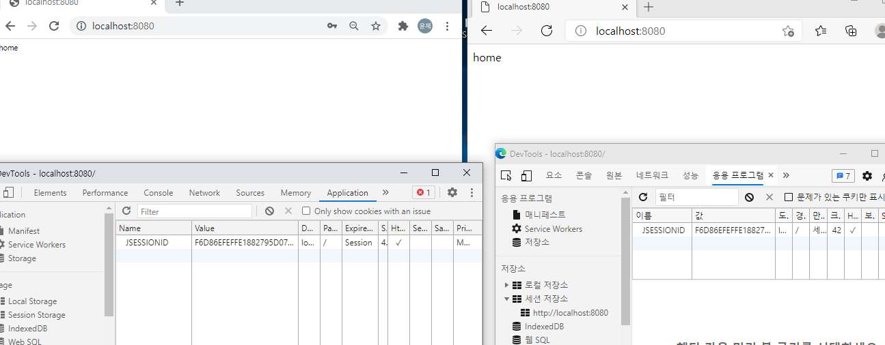

##### 세션고정 보호

위와 같은 이유 때문에 Spring Secuirty에서는 공격자가 사용자에게 세션쿠키를 심어 놓고 사용자가 인증을 시도한다고 하더라도, 인증 할 때마다 새로운 세션과 쿠키를 생성을 해서 세션 고정 보호를 한다. 

Spring Security에서 제공하는 세션 고정 보호 api를 알아보자.

코드는 지난 블로깅에 이어 아래와 같이 SecurityConfig.java 파일을 수정한다.

**sessionFixation.changeSessionid() - 기본 (세션 새로 생성)**

**sessionFixation.none() - 세션을 새로 생성하지 않아 공격에 노출 된다.**

**sessionFixation.migrationSession() - 세션 새로 생성)**

**sessionFixation.newSession() - 세션 새로 생성)**

sessionFixation.none()으로 설정 후 공격자에게 노출 되도록 설정한 예시를 보자.

우측 브라우저의 JSSEIONID값을 좌측 브라우저의 JSESSIONID 값에 입력한 후 

좌측 브라우저는 우측 브라우저와 상태를 공유하게 된다. 때문에 우측 브라우저에서 ROOT로 접근하면 로그인 처리가 된다.

위와 같이 None으로 설정을 하게되면 공격자에게 노출이 되지만,  그 이외의 설정 값은 새로운 세션을 생성하여 세션 고정 보호를 한다.

##### 세션 정책

Spring Security에서 제공하는 세션 정책 api에 대해 알아보자.

**SessionCreationPolicy.Always : 스프링 시큐리티가 항상 세션 생성**

**SessionCreationPolicy.If_Required : 스프링 시큐리티가 필요시 생성 (기본값)**

**SessionCreationPolicy.Never : 스프링 시큐리티가 생성하지 않지만 이미 존재하면 사용**

**SessionCreationPolicy.Stateless : 스프링 시큐리티가 생성하지 않고 존재해도 사용하지 않음**

코드는 SecurityConfig.java를 아래와 같이 수정한다.

