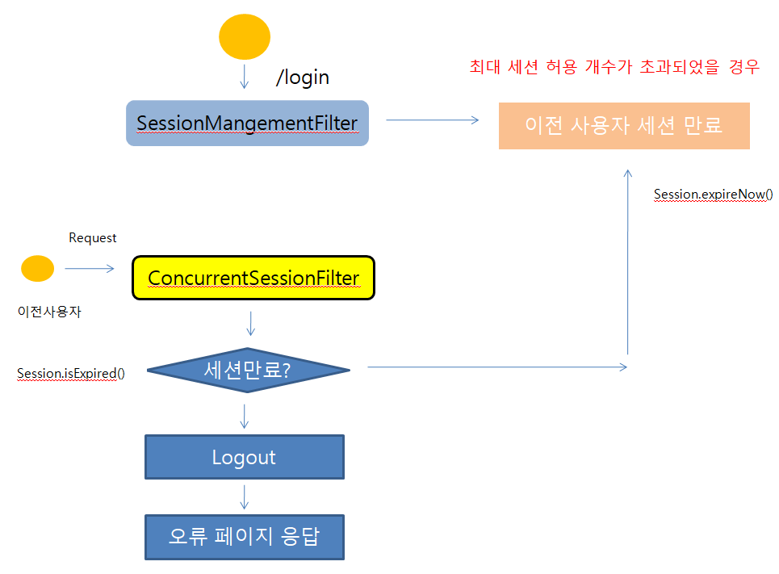

##### SessionManagementFilter

1. 세션 관리
   * 인증 시 사용자의 세션정보를 등록, 조회, 삭제 등의 세션 이력을 관리
2. 동시적 세션 제어 
   * 동일 계정으로 접속이 허용되는 최대 세션수를 제한

3. 세션 고정 보호
   * 인증 할 때마다 세션 쿠키를 새로 발급하여 공격자의 쿠키 조작을 방지

4. 세션 생성 정책
   * Always, If_Required, Never, Stateless

