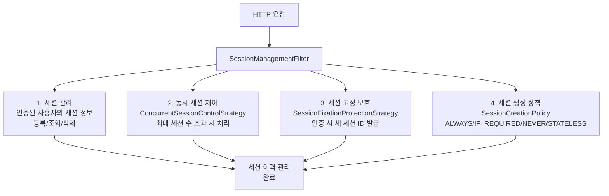
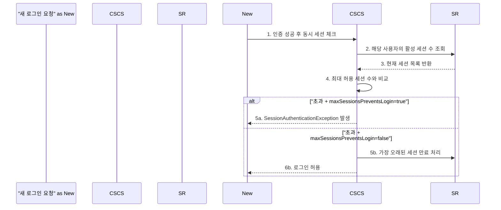
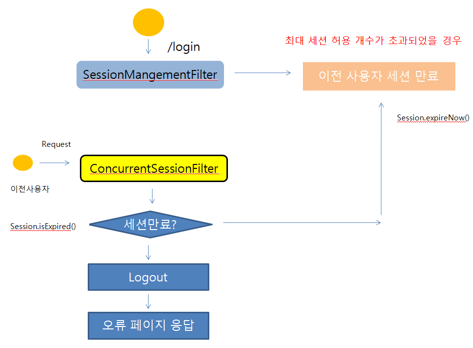
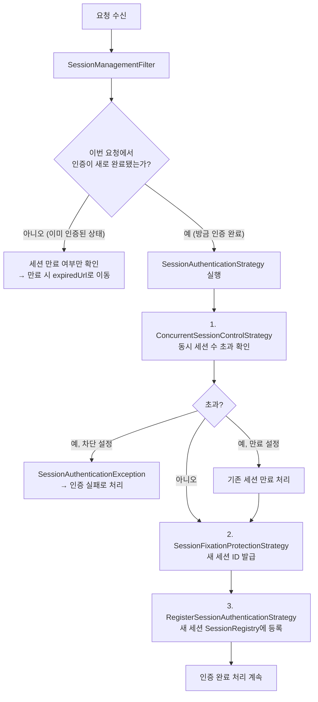
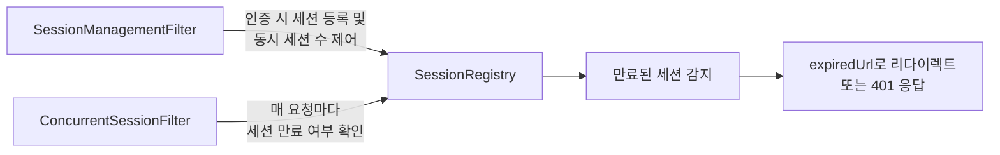

> 한 줄 요약: SessionManagementFilter는 세션 관리, 동시 세션 제어, 세션 고정 보호, 세션 생성 정책을 하나의 필터에서 통합 처리하는 세션 보안의 핵심 컴포넌트다.

## 실생활 비유로 이해하기

대형 호텔의 프론트 데스크를 생각해 보겠습니다. 프론트는 체크인(세션 등록), 동일인 중복 체크인 방지(동시 세션 제어), 새 방 키 발급(세션 고정 보호), 체크아웃 정책 관리(세션 생성 정책)를 모두 담당합니다. SessionManagementFilter가 바로 이 호텔 프론트 데스크 역할을 합니다.

## SessionManagementFilter의 4가지 역할

SessionManagementFilter는 세션과 관련된 네 가지 핵심 기능을 담당합니다.


```mermaid
flowchart TD
    A["HTTP 요청"] --> B["SessionManagementFilter"]
    B --> C["1. 세션 관리\n인증된 사용자의 세션 정보\n등록/조회/삭제"]
    B --> D["2. 동시 세션 제어\nConcurrentSessionControlStrategy\n최대 세션 수 초과 시 처리"]
    B --> E["3. 세션 고정 보호\nSessionFixationProtectionStrategy\n인증 시 새 세션 ID 발급"]
    B --> F["4. 세션 생성 정책\nSessionCreationPolicy\nALWAYS/IF_REQUIRED/NEVER/STATELESS"]
    C --> G["세션 이력 관리\n완료"]
    D --> G
    E --> G
    F --> G
```

## 역할 1: 세션 관리

인증이 완료된 사용자의 세션 정보를 `SessionRegistry`에 등록하고, 이후 요청에서 세션 유효성을 검사합니다.

```java
// SessionRegistry를 통한 세션 관리 예시
@Autowired
private SessionRegistry sessionRegistry;

// 현재 로그인된 모든 사용자 조회
public List<Object> getAllActivePrincipals() {
    return sessionRegistry.getAllPrincipals();
}

// 특정 사용자의 모든 세션 조회
public List<SessionInformation> getUserSessions(Object principal) {
    return sessionRegistry.getAllSessions(principal, false);
}

// 특정 세션 강제 만료
public void expireSession(String sessionId) {
    SessionInformation sessionInfo = sessionRegistry.getSessionInformation(sessionId);
    if (sessionInfo != null) {
        sessionInfo.expireNow();
    }
}
```

## 역할 2: 동시 세션 제어

`ConcurrentSessionControlAuthenticationStrategy`가 동일 계정의 중복 로그인을 관리합니다.


```mermaid
sequenceDiagram
    participant "새 로그인 요청" as New
    participant "ConcurrentSessionControlStrategy" as CSCS
    participant "SessionRegistry" as SR

    New->>CSCS: 1. 인증 성공 후 동시 세션 체크
    CSCS->>SR: 2. 해당 사용자의 활성 세션 수 조회
    SR-->>CSCS: 3. 현재 세션 목록 반환
    CSCS->>CSCS: 4. 최대 허용 세션 수와 비교

    alt "초과 + maxSessionsPreventsLogin=true"
        CSCS-->>New: 5a. SessionAuthenticationException 발생
    else "초과 + maxSessionsPreventsLogin=false"
        CSCS->>SR: 5b. 가장 오래된 세션 만료 처리
        CSCS-->>New: 6b. 로그인 허용
    end
```

## 역할 3: 세션 고정 보호

`SessionFixationProtectionStrategy`가 인증 성공 시 세션 ID를 교체합니다.

인증 전에는 공격자가 심어둔 세션 ID를 사용하더라도, 인증 성공 후 새로운 세션 ID가 발급되어 공격자의 세션 ID는 무효화됩니다.

```java
// 세션 고정 보호 전략 설정
http.sessionManagement()
    .sessionFixation()
    .changeSessionId();  // 기본값: 세션 ID만 교체
```

## 역할 4: 세션 생성 정책

`HttpSessionSecurityContextRepository`와 연계하여 세션 생성 시점을 제어합니다.

```java
// 세션 정책별 특성
http.sessionManagement()
    .sessionCreationPolicy(SessionCreationPolicy.IF_REQUIRED);  // 기본값

/*
 * ALWAYS:      항상 세션 생성 (없을 경우)
 * IF_REQUIRED: 필요 시에만 생성 (기본값)
 * NEVER:       직접 생성 안 함, 있으면 사용
 * STATELESS:   생성도 사용도 안 함 (REST API/JWT용)
 */
```

## SessionManagementFilter 동작 흐름




```mermaid
flowchart TD
    A["요청 수신"] --> B["SessionManagementFilter"]
    B --> C{"이번 요청에서\n인증이 새로 완료됐는가?"}
    C -- "아니오 (이미 인증된 상태)" --> D["세션 만료 여부만 확인\n→ 만료 시 expiredUrl로 이동"]
    C -- "예 (방금 인증 완료)" --> E["SessionAuthenticationStrategy 실행"]
    E --> F["1. ConcurrentSessionControlStrategy\n동시 세션 수 초과 확인"]
    F --> G{"초과?"}
    G -- "예, 차단 설정" --> H["SessionAuthenticationException\n→ 인증 실패로 처리"]
    G -- "예, 만료 설정" --> I["기존 세션 만료 처리"]
    G -- "아니오" --> J["2. SessionFixationProtectionStrategy\n새 세션 ID 발급"]
    I --> J
    J --> K["3. RegisterSessionAuthenticationStrategy\n새 세션 SessionRegistry에 등록"]
    K --> L["인증 완료 처리 계속"]
```

## CompositeSessionAuthenticationStrategy

실제로 SessionManagementFilter는 단일 전략이 아닌 `CompositeSessionAuthenticationStrategy`를 사용하여 여러 전략을 순서대로 실행합니다.

```java
// 내부적으로 이런 구조로 동작
CompositeSessionAuthenticationStrategy compositeStrategy = new CompositeSessionAuthenticationStrategy(
    Arrays.asList(
        new ConcurrentSessionControlAuthenticationStrategy(sessionRegistry),  // 1. 동시 세션 제어
        new SessionFixationProtectionStrategy(),                               // 2. 세션 고정 보호
        new RegisterSessionAuthenticationStrategy(sessionRegistry)             // 3. 세션 등록
    )
);
```

각 전략은 독립적으로 교체하거나 추가할 수 있습니다. 예를 들어 커스텀 세션 정책을 추가하려면 `SessionAuthenticationStrategy` 인터페이스를 구현하여 목록에 추가하면 됩니다.

## ConcurrentSessionFilter와의 관계

`SessionManagementFilter`와 함께 `ConcurrentSessionFilter`도 동시 세션 제어에 참여합니다.


```mermaid
flowchart LR
    A["SessionManagementFilter"] -- "인증 시 세션 등록 및\n동시 세션 수 제어" --> B["SessionRegistry"]
    C["ConcurrentSessionFilter"] -- "매 요청마다\n세션 만료 여부 확인" --> B
    B --> D["만료된 세션 감지"]
    D --> E["expiredUrl로 리다이렉트\n또는 401 응답"]
```

역할 분담:
- `SessionManagementFilter`: 로그인 시점에 세션 등록 및 동시 세션 초과 제어
- `ConcurrentSessionFilter`: 매 요청마다 세션 만료 여부를 확인하여 만료된 세션 처리

## 전체 설정 예시

```java
@Configuration
@EnableWebSecurity
public class SecurityConfig extends WebSecurityConfigurerAdapter {

    @Autowired
    private UserDetailsService userDetailsService;

    @Override
    protected void configure(HttpSecurity http) throws Exception {
        http
            .authorizeRequests()
                .anyRequest().authenticated()
            .and()
            .formLogin()
            .and()
            .sessionManagement()
                // 세션 생성 정책
                .sessionCreationPolicy(SessionCreationPolicy.IF_REQUIRED)
                // 세션 고정 보호
                .sessionFixation().changeSessionId()
                // 동시 세션 제어
                .maximumSessions(1)
                    .maxSessionsPreventsLogin(false)
                    .expiredUrl("/login?expired=true")
                    .sessionRegistry(sessionRegistry());
    }

    @Bean
    public SessionRegistry sessionRegistry() {
        return new SessionRegistryImpl();
    }

    // 세션 소멸 이벤트를 Spring으로 전파 (필수)
    @Bean
    public HttpSessionEventPublisher httpSessionEventPublisher() {
        return new HttpSessionEventPublisher();
    }
}
```

## 왜 이게 중요한가?

SessionManagementFilter는 세션 보안의 중심 허브입니다. 세션과 관련된 모든 보안 위협(세션 고정, 세션 탈취, 계정 공유)에 대한 방어가 이 필터를 통해 이루어집니다.

특히 `CompositeSessionAuthenticationStrategy`를 통한 전략 패턴 적용으로, 각 보안 기능이 독립적으로 유지되면서도 하나의 파이프라인으로 실행됩니다. 이 구조를 이해하면 커스텀 세션 정책을 쉽게 추가할 수 있습니다.

## 보안 위협 시나리오

**세션 클러스터링 환경에서의 문제**: 여러 서버로 이루어진 클러스터 환경에서는 `SessionRegistry`가 기본 인메모리 구현체(`SessionRegistryImpl`)를 사용하면 서버 간 세션 정보가 공유되지 않습니다. 이 경우 Spring Session + Redis를 활용한 분산 세션 관리가 필요합니다.

**세션 만료 감지 지연**: 전략 1(이전 세션 만료)에서 피해자가 즉시 로그아웃되는 게 아니라, 다음 요청 시에만 만료를 감지합니다. 이 창(window) 동안 두 세션이 동시에 유효한 상태가 됩니다. 매우 민감한 서비스에서는 전략 2(신규 로그인 차단)를 사용해야 합니다.

## 핵심 포인트 정리

- SessionManagementFilter는 세션 관리, 동시 세션 제어, 세션 고정 보호, 세션 생성 정책 4가지를 담당한다.
- `CompositeSessionAuthenticationStrategy`: 여러 세션 전략을 순서대로 실행하는 컴포지트 패턴.
- `ConcurrentSessionFilter`: SessionManagementFilter와 협력하여 매 요청마다 세션 만료를 확인.
- `SessionRegistry` 빈 + `HttpSessionEventPublisher` 빈 등록이 함께 필요하다.
- 클러스터 환경에서는 인메모리 `SessionRegistry` 대신 Redis 기반 분산 세션 관리를 사용할 것.
- 세션 만료 감지는 즉시가 아닌 다음 요청 시에 이루어진다는 점을 설계에 반영할 것.
