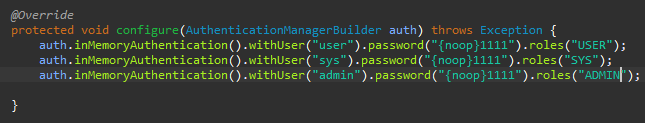
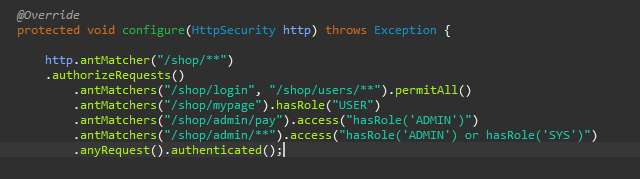

##### 권한 설정 및 표현식

Spring Secuirty가 지원하는 권한 설정 방식은 선언전 방식과 동적 방식으로 나누어져 있다.

* 선언적 방식

  * URL

    * http.antMatchers("/users/**").hasRole("USER")

  * Method

    * @PreAuthorize("hasRole('USER')")

      public void user(){System.out.println("user")}

* 동적 방식 - DB 연동 프로그래밍

  * URL
  * Method

먼저 선언적 방식의 URL 방식에 대해 알아보겠다.

설정은 아래와 같이 SecurityConfig.java 를 수정한다.

**/shop/login, /shop/user/** 의 경로는 누구든 접근 가능하다.**

**/shop/mypage는 USER의 권한을 가져야만 접근이 가능하며, /shop/admin/pay는 ADMIN 권한이 있어야한다.**

**/shop/admin/** 경로는 ADMIN 또는 SYS 권한을 가져야만 접근이 가능하다. 여기서 SYS 계정은 /shop/admin/pay에 대해 접근이 불가능하다.**

**표현식 종류**

| 메소드                  | 동작                                                     |
| ----------------------- | -------------------------------------------------------- |
| authenticated()         | 인증된 사용자의 접근을 허용                              |
| fullyAuthenticated()    | 인증된 사용자의 접근을 허용, rememberMe 인증 제외        |
| permitAll()             | 무조건 접근을 허용                                       |
| denyAll()               | 무조건 접근을 허용하지 않음                              |
| anonymous()             | 익명사용자의 접근을 허용                                 |
| rememberMe()            | 기억하기를 통해 인증된 사용자의 접근을 허용              |
| access(String)          | 주어진 SpEL 표현식의 평가 결과가 true이면 접근을 허용    |
| hasRole(String)         | 사용자가 주어진 역할이 있다면 접근을 허용                |
| hasAuthority(String)    | 사용자가 주어진 권한이 있다면                            |
| hasAnyRole(String)      | 사용자가 주어진 권한이 있다면 접근을 허용                |
| hasAnyAuthority(String) | 사용자가 주어진 권한 중 어떤 것이라도 있다면 접근을 허용 |
| hasIpAddress(String)    | 주어진 IP로부터 요청이 왔다면 접근을 허용                |

