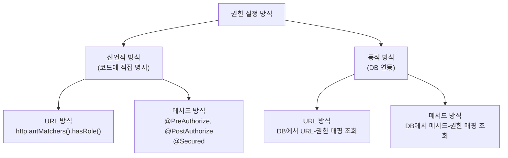
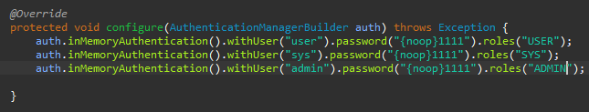
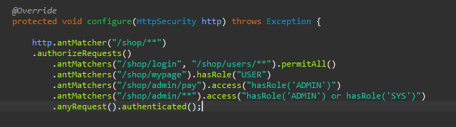
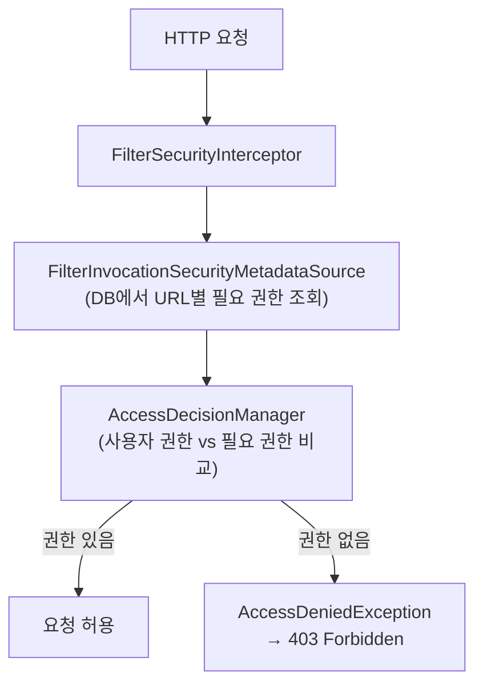

> 한 줄 요약: Spring Security의 권한 설정은 URL 패턴과 메서드 단위로 접근을 제어하며, SpEL 표현식을 통해 역할(Role), 권한(Authority), IP, 인증 상태 등 다양한 조건을 조합할 수 있다.

## 실생활 비유로 이해하기

회사 건물의 출입 통제 시스템을 생각해 보겠습니다. 로비는 누구나 입장 가능하고, 사무실은 직원만, 서버실은 IT팀만, 임원실은 임원급만 출입할 수 있습니다. 이처럼 공간(URL)마다 다른 접근 권한을 부여하는 것이 Spring Security의 권한 설정입니다.

## 권한 설정 방식의 두 가지 분류

Spring Security의 권한 설정은 크게 선언적 방식과 동적 방식으로 나뉩니다.


```mermaid
flowchart TD
    A["권한 설정 방식"] --> B["선언적 방식\n(코드에 직접 명시)"]
    A --> C["동적 방식\n(DB 연동)"]
    B --> D["URL 방식\nhttp.antMatchers().hasRole()"]
    B --> E["메서드 방식\n@PreAuthorize, @PostAuthorize\n@Secured"]
    C --> F["URL 방식\nDB에서 URL-권한 매핑 조회"]
    C --> G["메서드 방식\nDB에서 메서드-권한 매핑 조회"]
```

선언적 방식은 설정이 단순하고 코드에서 바로 확인할 수 있지만, 권한 구조가 변경될 때마다 코드를 수정해야 합니다. 동적 방식은 DB에서 권한 정보를 관리하므로 코드 변경 없이 권한 구조를 변경할 수 있어 대규모 서비스에 적합합니다.

## URL 방식 선언적 권한 설정

`configure(HttpSecurity http)` 메서드에서 URL 패턴별로 접근 권한을 설정합니다.

```java
@Override
protected void configure(HttpSecurity http) throws Exception {
    http
        .authorizeRequests()
            // 1. 누구나 접근 가능
            .antMatchers("/shop/login", "/shop/user/**").permitAll()

            // 2. USER 권한이 있어야 접근 가능
            .antMatchers("/shop/mypage").hasRole("USER")

            // 3. ADMIN 권한만 접근 가능
            .antMatchers("/shop/admin/pay").hasRole("ADMIN")

            // 4. ADMIN 또는 SYS 권한으로 접근 가능 (단, /pay는 ADMIN만)
            .antMatchers("/shop/admin/**").hasAnyRole("ADMIN", "SYS")

            // 5. 나머지 모든 URL은 인증된 사용자만
            .anyRequest().authenticated();
}
```





## 설정 순서의 중요성

`antMatchers`는 **위에서 아래 순서**로 평가됩니다. 더 구체적인 패턴을 먼저 설정해야 합니다.

```java
// 잘못된 순서 (문제 발생)
.antMatchers("/shop/admin/**").hasAnyRole("ADMIN", "SYS")  // SYS도 /pay 접근 가능 (의도 외)
.antMatchers("/shop/admin/pay").hasRole("ADMIN")            // 이미 위에서 처리됨, 무효

// 올바른 순서 (구체적인 것 먼저)
.antMatchers("/shop/admin/pay").hasRole("ADMIN")            // 먼저 평가: ADMIN만
.antMatchers("/shop/admin/**").hasAnyRole("ADMIN", "SYS")   // 나머지 /admin/**은 ADMIN 또는 SYS
```

이 순서 실수는 매우 흔한 보안 취약점입니다. 항상 **구체적인 URL을 앞에, 와일드카드 URL을 뒤에** 배치해야 합니다.

## 메서드 방식 선언적 권한 설정

컨트롤러나 서비스 메서드에 직접 어노테이션을 붙이는 방식입니다. 먼저 설정 클래스에서 활성화해야 합니다.

```java
@Configuration
@EnableWebSecurity
@EnableGlobalMethodSecurity(
    prePostEnabled = true,  // @PreAuthorize, @PostAuthorize 활성화
    securedEnabled = true   // @Secured 활성화
)
public class SecurityConfig extends WebSecurityConfigurerAdapter { ... }
```

```java
@RestController
public class ShopController {

    // USER 권한을 가진 사용자만 접근 가능
    @PreAuthorize("hasRole('USER')")
    @GetMapping("/mypage")
    public String mypage() {
        return "마이페이지";
    }

    // ADMIN 또는 SYS 권한
    @PreAuthorize("hasAnyRole('ADMIN', 'SYS')")
    @GetMapping("/admin")
    public String admin() {
        return "관리자 페이지";
    }

    // 메서드 실행 후 결과에 대한 권한 검사
    @PostAuthorize("returnObject.username == authentication.name")
    @GetMapping("/user/{id}")
    public User getUser(@PathVariable Long id) {
        return userService.findById(id);
        // 반환된 User의 username이 로그인한 사용자와 같을 때만 결과 반환
    }

    // @Secured: 역할(Role) 하나만 지정 가능
    @Secured("ROLE_ADMIN")
    @DeleteMapping("/user/{id}")
    public void deleteUser(@PathVariable Long id) {
        userService.deleteById(id);
    }
}
```

## 표현식(Expression) 종류

Spring Security SpEL 표현식은 접근 제어 조건을 유연하게 표현합니다.

| 표현식 | 설명 | 예시 |
|--------|------|------|
| `authenticated()` | 인증된 사용자 (Remember Me 포함) | `.authenticated()` |
| `fullyAuthenticated()` | 완전 인증 사용자 (Remember Me 제외) | `.fullyAuthenticated()` |
| `permitAll()` | 모두 허용 (익명 포함) | `.permitAll()` |
| `denyAll()` | 모두 거부 | `.denyAll()` |
| `anonymous()` | 익명 사용자만 허용 | `.anonymous()` |
| `rememberMe()` | Remember Me 인증 사용자 허용 | `.rememberMe()` |
| `hasRole(String)` | 지정 역할 보유 여부 | `hasRole('ADMIN')` |
| `hasAnyRole(String...)` | 지정 역할 중 하나 보유 | `hasAnyRole('ADMIN','USER')` |
| `hasAuthority(String)` | 지정 권한 보유 여부 | `hasAuthority('READ_PRIVILEGE')` |
| `hasAnyAuthority(String...)` | 지정 권한 중 하나 보유 | `hasAnyAuthority('READ','WRITE')` |
| `hasIpAddress(String)` | 지정 IP에서의 요청 | `hasIpAddress('192.168.1.0/24')` |
| `access(String)` | SpEL 표현식 직접 지정 | `access("hasRole('ADMIN') and hasIpAddress('...')")` |

## hasRole vs hasAuthority 차이

```java
// hasRole('ADMIN') 은 내부적으로 'ROLE_ADMIN'을 찾음
.antMatchers("/admin/**").hasRole("ADMIN")
// 실제로는 GrantedAuthority 목록에서 "ROLE_ADMIN"을 확인

// hasAuthority는 정확한 문자열을 찾음
.antMatchers("/admin/**").hasAuthority("ROLE_ADMIN")
// "ROLE_ADMIN" 정확히 일치하는 것을 확인

// 세밀한 권한 제어 시 hasAuthority가 더 유연함
.antMatchers("/articles/write").hasAuthority("WRITE_ARTICLE")
.antMatchers("/articles/read").hasAuthority("READ_ARTICLE")
```

`hasRole()`은 자동으로 `ROLE_` 접두사를 추가하고, `hasAuthority()`는 입력한 문자열 그대로를 비교합니다.

## access()로 복합 조건 설정

```java
// IP 주소 + 역할 조합
.antMatchers("/admin/**")
    .access("hasRole('ADMIN') and hasIpAddress('192.168.1.0/24')")

// 특정 시간대에만 접근 허용 (커스텀 빈 활용)
.antMatchers("/api/**")
    .access("@timeAccessChecker.isAccessibleTime(authentication)")
```

커스텀 빈을 `@`로 참조하여 복잡한 접근 제어 로직을 구현할 수 있습니다.

## 동적 방식 권한 설정 개요

실무에서는 DB에서 URL-권한 매핑을 관리하는 동적 방식을 많이 사용합니다.


```mermaid
flowchart TD
    A["HTTP 요청"] --> B["FilterSecurityInterceptor"]
    B --> C["FilterInvocationSecurityMetadataSource\n(DB에서 URL별 필요 권한 조회)"]
    C --> D["AccessDecisionManager\n(사용자 권한 vs 필요 권한 비교)"]
    D -- "권한 있음" --> E["요청 허용"]
    D -- "권한 없음" --> F["AccessDeniedException\n→ 403 Forbidden"]
```

```java
// DB 기반 동적 권한 설정 (개념 예시)
@Component
public class UrlFilterSecurityMetadataSource implements FilterInvocationSecurityMetadataSource {

    @Autowired
    private UrlRoleRepository urlRoleRepository;

    @Override
    public Collection<ConfigAttribute> getAttributes(Object object) {
        HttpServletRequest request = ((FilterInvocation) object).getRequest();
        // DB에서 현재 URL에 필요한 권한 목록 조회
        List<String> roles = urlRoleRepository.findRolesByUrl(request.getRequestURI());
        return roles.stream()
            .map(SecurityConfig::createList)
            .flatMap(Collection::stream)
            .collect(Collectors.toList());
    }
}
```

## 왜 이게 중요한가?

권한 설정은 인증(누구인지 확인)과 함께 보안의 양대 축인 인가(무엇을 할 수 있는지 결정)를 담당합니다. 잘못된 권한 설정은 권한 상승 공격(Privilege Escalation)으로 이어질 수 있습니다.

특히 `antMatchers` 순서 실수, `hasRole`과 `hasAuthority` 혼동, `anyRequest().authenticated()` 누락 등은 실무에서 자주 발생하는 보안 취약점입니다.

## 보안 위협 시나리오

**권한 우회 공격**: `antMatchers("/admin/**")` 설정이 있더라도 URL 인코딩(`/admin%2F`)이나 경로 트래버설(`/admin/./dashboard`)을 이용해 우회 시도를 할 수 있습니다. Spring Security는 이를 방어하는 `StrictHttpFirewall`을 기본으로 사용합니다.

**수직적 권한 상승**: USER 권한 사용자가 ADMIN 전용 API를 직접 호출하는 공격입니다. URL 패턴 설정과 함께 메서드 레벨 `@PreAuthorize`를 이중으로 적용하여 방어 심도를 높일 수 있습니다.

## 핵심 포인트 정리

- 선언적 방식(코드): URL 패턴(`antMatchers`) 또는 메서드 어노테이션(`@PreAuthorize`)으로 권한 설정.
- 동적 방식(DB): `FilterInvocationSecurityMetadataSource`로 DB에서 URL-권한 매핑을 동적으로 조회.
- `antMatchers` 순서: 구체적인 URL을 먼저, 와일드카드를 나중에 배치해야 한다.
- `hasRole('ADMIN')` == `hasAuthority('ROLE_ADMIN')`: hasRole은 자동으로 'ROLE_' 접두사를 추가.
- `fullyAuthenticated()`: Remember Me 사용자를 제외하여 중요 작업에서 재인증 강제.
- `access()`: SpEL 표현식으로 IP, 시간, 커스텀 로직 등 복합 조건 설정 가능.
- `anyRequest().authenticated()`를 마지막에 반드시 추가하여 누락된 URL을 보호할 것.
