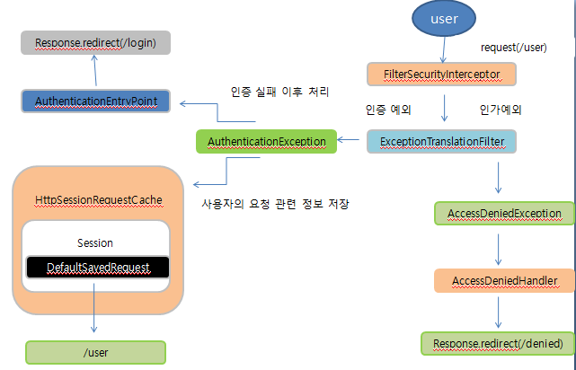
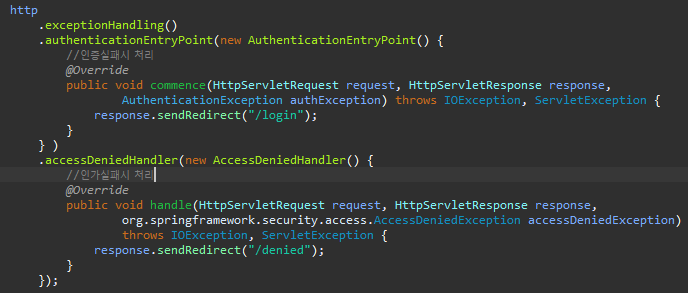

## AuthenticationException  

* 인증 예외 처리
  1. AuthenticationEntryPoint 호출
     * 로그인 페이지 이동, 401 오류 코드 전달 등
  2.  인증 예외가 발생하기 전의 요청 정보를 저장
     * RequestCache - 사용자의 이전 요청 정보를 세션에 저장하고 이를 꺼내오는 캐시 메카니즘
     * SavedRequest - 사용자가 요청했던 request 파라미터 값들, 그 당시의 헤더값들 등이 저장

## AccessDeniedException

* 인가 예외 처리

  * AccessDeniedHandler 에서 예외 처리하도록 제공

  

