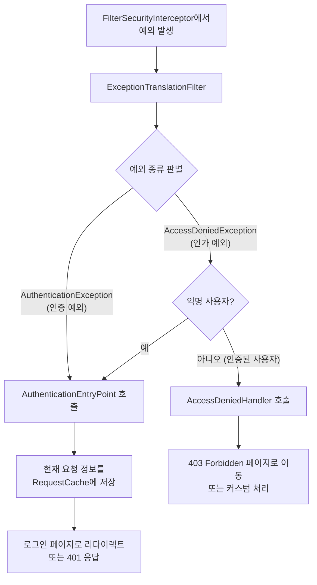
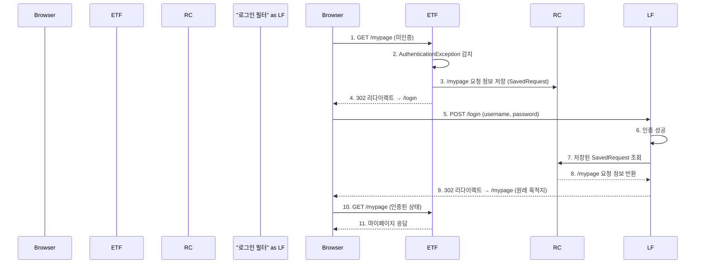
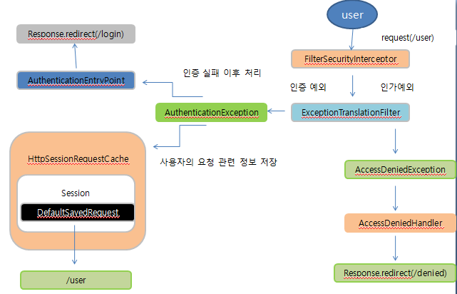
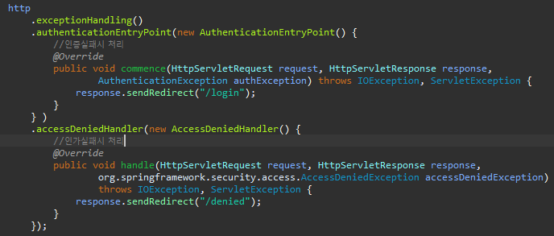
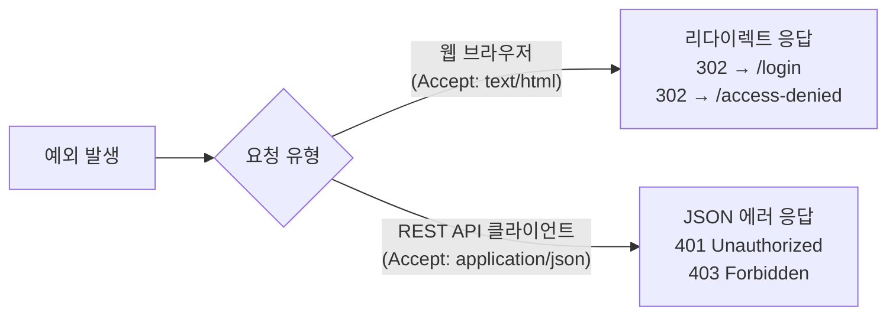

> 한 줄 요약: ExceptionTranslationFilter는 인증 예외와 인가 예외를 구분하여 처리하며, 인증 예외 발생 시 원래 요청 정보를 캐시에 저장해 로그인 후 해당 페이지로 자동 이동시킨다.

## 실생활 비유로 이해하기

영화관에서 특별 상영관에 입장하려는 상황을 생각해 보겠습니다. 두 가지 거절 상황이 있습니다.

첫 번째는 티켓이 없는 경우(인증 예외): 매표소로 안내받고, 티켓을 구매한 뒤 원하는 상영관으로 다시 안내받습니다. 두 번째는 티켓은 있지만 VIP 전용관을 일반 티켓으로 입장하려는 경우(인가 예외): "접근 권한이 없습니다"라는 안내를 받고 출구로 안내됩니다.

`ExceptionTranslationFilter`가 바로 이 두 상황을 구분하여 처리하는 필터입니다.

## 두 가지 예외 유형


```mermaid
flowchart TD
    A["FilterSecurityInterceptor에서\n예외 발생"] --> B["ExceptionTranslationFilter"]
    B --> C{"예외 종류 판별"}
    C -- "AuthenticationException\n(인증 예외)" --> D["AuthenticationEntryPoint 호출"]
    C -- "AccessDeniedException\n(인가 예외)" --> E{"익명 사용자?"}
    E -- "예" --> D
    E -- "아니오 (인증된 사용자)" --> F["AccessDeniedHandler 호출"]
    D --> G["현재 요청 정보를\nRequestCache에 저장"]
    G --> H["로그인 페이지로 리다이렉트\n또는 401 응답"]
    F --> I["403 Forbidden 페이지로 이동\n또는 커스텀 처리"]
```

### AuthenticationException (인증 예외)

인증되지 않은 사용자가 보호된 리소스에 접근할 때 발생합니다.

- 로그인하지 않은 상태에서 인증이 필요한 URL 접근
- 세션 만료 후 보호된 URL 접근 시도
- 잘못된 인증 토큰 사용

### AccessDeniedException (인가 예외)

인증은 되었지만 해당 리소스에 대한 권한이 없을 때 발생합니다.

- USER 권한 사용자가 ADMIN 전용 페이지 접근 시도
- 자신의 리소스가 아닌 다른 사용자의 데이터 접근 시도

## RequestCache와 SavedRequest

`AuthenticationEntryPoint`가 호출되면 현재 요청 정보를 `RequestCache`에 저장합니다. 이 덕분에 로그인 후 원래 접근하려 했던 페이지로 자동 이동할 수 있습니다.


```mermaid
sequenceDiagram
    participant "브라우저" as Browser
    participant "ExceptionTranslationFilter" as ETF
    participant "RequestCache" as RC
    participant "로그인 필터" as LF

    Browser->>ETF: 1. GET /mypage (미인증)
    ETF->>ETF: 2. AuthenticationException 감지
    ETF->>RC: 3. /mypage 요청 정보 저장 (SavedRequest)
    ETF-->>Browser: 4. 302 리다이렉트 → /login
    Browser->>LF: 5. POST /login (username, password)
    LF->>LF: 6. 인증 성공
    LF->>RC: 7. 저장된 SavedRequest 조회
    RC-->>LF: 8. /mypage 요청 정보 반환
    LF-->>Browser: 9. 302 리다이렉트 → /mypage (원래 목적지)
    Browser->>ETF: 10. GET /mypage (인증된 상태)
    ETF-->>Browser: 11. 마이페이지 응답
```

`SavedRequest`에는 다음 정보가 저장됩니다.

- 원래 요청 URL
- HTTP 메서드 (GET, POST 등)
- 요청 파라미터
- 요청 헤더 (Accept, Content-Type 등)

## SecurityConfig 설정

```java
@Override
protected void configure(HttpSecurity http) throws Exception {
    http
        .exceptionHandling()
            // 인증 예외 처리
            .authenticationEntryPoint(customAuthenticationEntryPoint())
            // 인가 예외 처리
            .accessDeniedHandler(customAccessDeniedHandler());
}

// 인증 예외 처리: 로그인 페이지로 리다이렉트 또는 JSON 응답
@Bean
public AuthenticationEntryPoint customAuthenticationEntryPoint() {
    return (request, response, authException) -> {
        // REST API인 경우 JSON 응답
        if (isApiRequest(request)) {
            response.setStatus(HttpServletResponse.SC_UNAUTHORIZED);
            response.setContentType("application/json;charset=UTF-8");
            response.getWriter().write("{\"error\": \"인증이 필요합니다.\"}");
        } else {
            // 웹 페이지인 경우 로그인 페이지로 리다이렉트
            response.sendRedirect("/login");
        }
    };
}

// 인가 예외 처리: 403 페이지 또는 JSON 응답
@Bean
public AccessDeniedHandler customAccessDeniedHandler() {
    return (request, response, accessDeniedException) -> {
        if (isApiRequest(request)) {
            response.setStatus(HttpServletResponse.SC_FORBIDDEN);
            response.setContentType("application/json;charset=UTF-8");
            response.getWriter().write("{\"error\": \"접근 권한이 없습니다.\"}");
        } else {
            response.sendRedirect("/access-denied");
        }
    };
}

private boolean isApiRequest(HttpServletRequest request) {
    String accept = request.getHeader("Accept");
    return accept != null && accept.contains("application/json");
}
```





## RequestCache 커스터마이징

기본 `RequestCache` 구현체는 `HttpSessionRequestCache`입니다. 요청 정보를 세션에 저장합니다.

```java
// 기본 동작: 세션에 SavedRequest 저장
RequestCache requestCache = new HttpSessionRequestCache();

// 특정 조건의 요청만 캐싱 (예: GET 요청만 캐싱)
HttpSessionRequestCache customCache = new HttpSessionRequestCache();
customCache.setRequestMatcher(new AntPathRequestMatcher("/**", "GET"));

http.requestCache().requestCache(customCache);
```

```java
// 로그인 성공 핸들러에서 캐싱된 요청 사용
.successHandler((request, response, authentication) -> {
    HttpSessionRequestCache requestCache = new HttpSessionRequestCache();
    SavedRequest savedRequest = requestCache.getRequest(request, response);

    if (savedRequest != null) {
        // 로그인 전에 접근하려 했던 URL로 이동
        String targetUrl = savedRequest.getRedirectUrl();
        response.sendRedirect(targetUrl);
    } else {
        // 기본 이동 URL
        response.sendRedirect("/home");
    }
})
```

## ExceptionTranslationFilter의 위치

이 필터는 `FilterSecurityInterceptor` 바로 앞에 위치하여, 인터셉터에서 발생하는 예외를 잡아 처리합니다.

```
필터 체인 순서:
...
→ AnonymousAuthenticationFilter
→ ExceptionTranslationFilter        ← 여기서 예외를 감싸서 처리
→ FilterSecurityInterceptor          ← 여기서 인증/인가 예외 발생
→ 컨트롤러
```

`ExceptionTranslationFilter`는 `try-catch` 구조로 `FilterSecurityInterceptor`를 감쌉니다.

```java
// ExceptionTranslationFilter 내부 동작 (개념적 표현)
try {
    chain.doFilter(request, response);  // FilterSecurityInterceptor 실행
} catch (AuthenticationException e) {
    // 인증 예외 처리
    requestCache.saveRequest(request, response);
    authenticationEntryPoint.commence(request, response, e);
} catch (AccessDeniedException e) {
    if (authenticationTrustResolver.isAnonymous(authentication)) {
        // 익명 사용자의 인가 예외 → 인증 예외로 처리
        requestCache.saveRequest(request, response);
        authenticationEntryPoint.commence(request, response, new InsufficientAuthenticationException(...));
    } else {
        // 인증된 사용자의 인가 예외
        accessDeniedHandler.handle(request, response, e);
    }
}
```

## REST API와 웹 애플리케이션의 차이


```mermaid
flowchart LR
    A["예외 발생"] --> B{"요청 유형"}
    B -- "웹 브라우저\n(Accept: text/html)" --> C["리다이렉트 응답\n302 → /login\n302 → /access-denied"]
    B -- "REST API 클라이언트\n(Accept: application/json)" --> D["JSON 에러 응답\n401 Unauthorized\n403 Forbidden"]
```

REST API 서버에서 리다이렉트 응답을 반환하면 클라이언트가 처리할 수 없습니다. 요청의 `Accept` 헤더나 URL 패턴으로 요청 유형을 판별하여 적절한 응답을 반환해야 합니다.

## 왜 이게 중요한가?

사용자 경험(UX) 관점에서 `RequestCache`의 역할이 매우 중요합니다. 로그인 후 처음 페이지가 아닌 원래 접근하려 했던 페이지로 이동하는 것은 당연한 UX처럼 보이지만, 이를 직접 구현하려면 상당히 복잡한 로직이 필요합니다. Spring Security는 이 기능을 기본으로 제공합니다.

또한 인증 예외와 인가 예외를 명확히 구분하는 것은 올바른 HTTP 상태 코드 반환(401 vs 403)과 적절한 사용자 안내를 위해 필수적입니다.

## 보안 위협 시나리오

**오픈 리다이렉트**: `SavedRequest`에 저장된 URL을 로그인 후 그대로 리다이렉트하는 경우, 공격자가 악의적인 외부 URL을 저장하도록 유도할 수 있습니다. Spring Security는 기본적으로 같은 호스트의 URL만 저장하도록 방어하지만, 커스텀 구현 시 주의가 필요합니다.

**정보 노출**: `AccessDeniedException` 처리 시 상세한 에러 메시지를 반환하면 시스템 구조가 노출될 수 있습니다. 최소한의 정보만 포함한 에러 메시지를 반환해야 합니다.

## 핵심 포인트 정리

- `ExceptionTranslationFilter`는 `AuthenticationException`과 `AccessDeniedException`을 구분하여 처리한다.
- `AuthenticationEntryPoint`: 인증 예외 처리 (로그인 페이지 리다이렉트 또는 401 응답).
- `AccessDeniedHandler`: 인가 예외 처리 (403 페이지 또는 JSON 응답).
- `RequestCache`: 인증 예외 시 원래 요청 정보를 세션에 저장하여 로그인 후 자동 이동.
- `SavedRequest`: 원래 URL, 파라미터, 헤더 정보를 보관.
- 익명 사용자의 `AccessDeniedException`은 내부적으로 `AuthenticationException`으로 처리된다.
- REST API와 웹 브라우저 요청을 구분하여 적절한 응답(JSON vs 리다이렉트)을 반환할 것.
