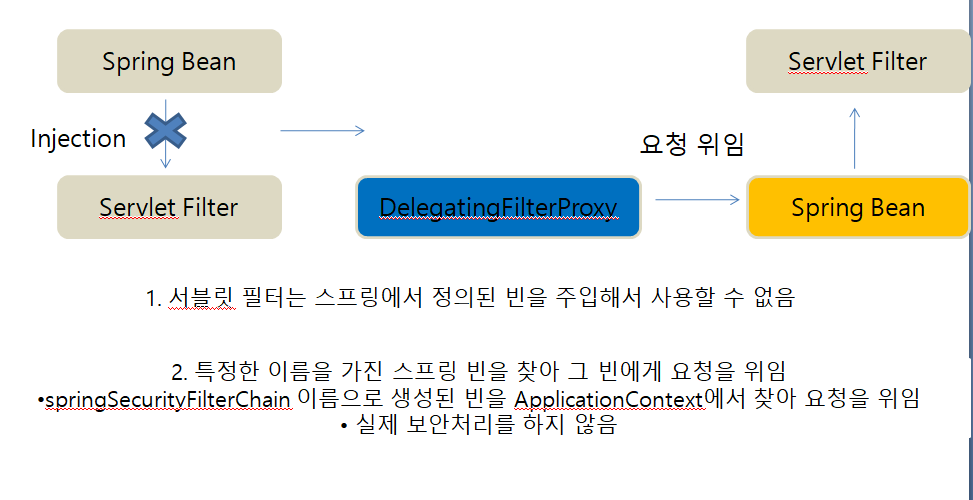
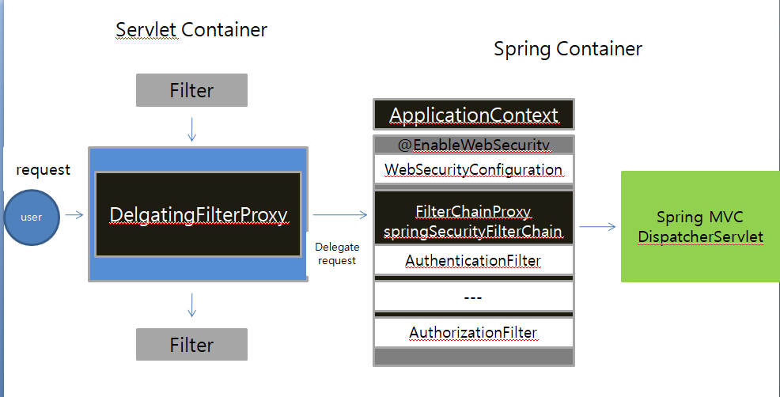

## DelegatingFilterProxy

**Servlet filter는 스프링에서 정의된 빈을 주입해서 사용할 수 없다. 그 이유는 서로의 컨테이너가 다르기 때문이다. Servlet Container vs Spring Container**

**하지만 Servlet Filter에서 Spring Bean을 DelegatingFilterProxy를 통해 사용 할 수 있다.**

**위의 2번의 특정한 이름을 가진 스프링 빈을 찾아 그 빈에게 요청을 위임하는 역할을 하는 클래스가 DelgatingFilterProxy이다.**

## FilterChaingProxy

1. springSecurityFillterChain의 이름으로 생성되는 필터 빈
2. DelegatingFilterProxy으로 부터 요청을 위임 받고 실제 보안 처리
3. 스프링 시큐리티 초기화 시 생성되는 필터들을 관리하고 제어
   * 스프링 시큐리티가 기본적으로 생성하는 필터
   * 설정 클래스에서 API 추가 시 생성되는 필터
4. 사용자의 요청을 필터 순서대로 호출하여 전달
5. 사용자 정의 필터를 생성해서 기존의 필터 전.후로 추가 가능
   * 필터의 순서를 잘 정의
6. 마지막 필터까지 인증 및 인가 예외가 발생하지 않으면 보안 통과

