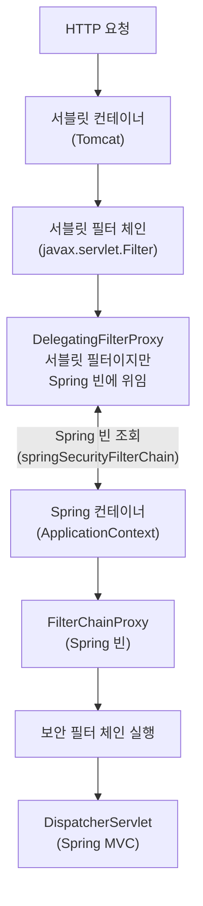
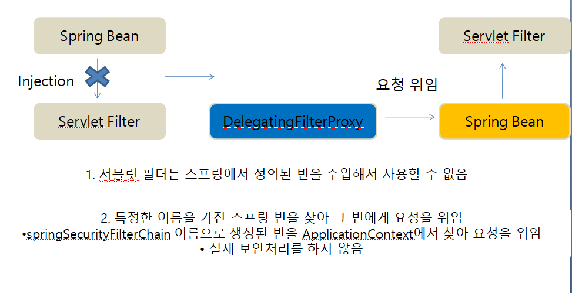
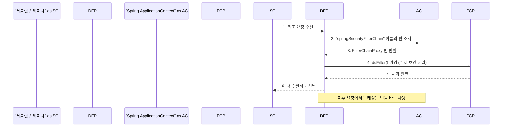
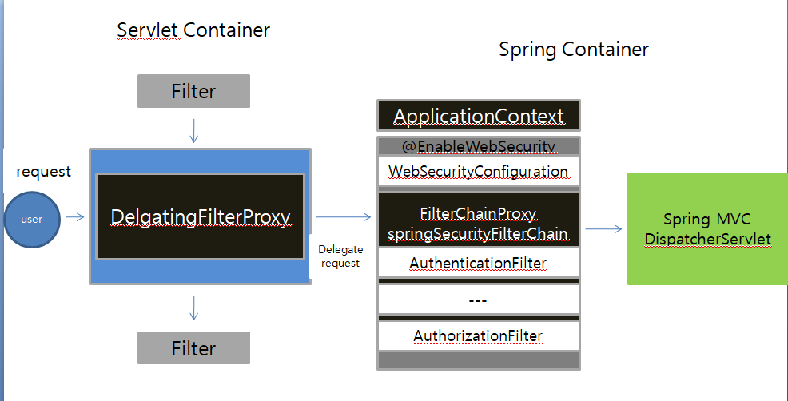
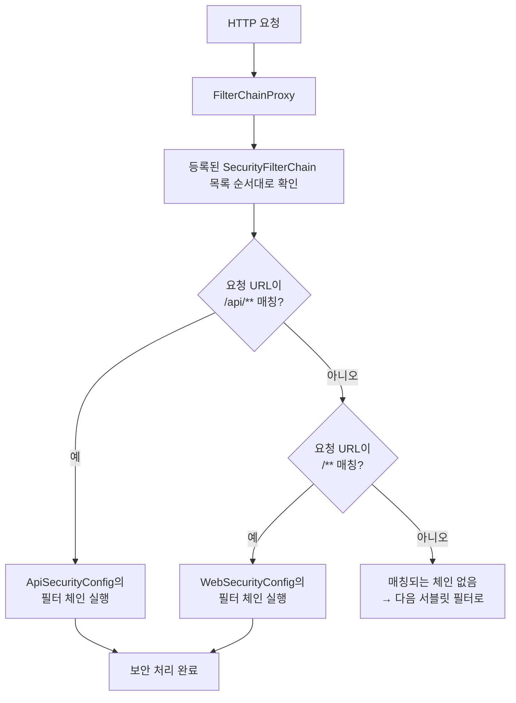

> 한 줄 요약: DelegatingFilterProxy는 서블릿 컨테이너의 필터 체계와 Spring 컨테이너의 빈 체계를 연결하는 다리 역할을 하며, FilterChainProxy에게 실제 보안 처리를 위임한다.

## 두 컨테이너의 세계

웹 애플리케이션에는 두 개의 독립적인 컨테이너가 존재합니다. 이 두 세계가 어떻게 연결되는지 이해하는 것이 DelegatingFilterProxy를 이해하는 핵심입니다.

**서블릿 컨테이너 (Tomcat 등)**: 웹 요청을 받아 서블릿으로 전달하는 역할을 합니다. `Filter`, `Servlet`, `Listener`를 관리합니다. Spring 빈을 직접 주입받을 수 없습니다.

**Spring 컨테이너 (ApplicationContext)**: Spring 빈들을 생성하고 의존성을 주입하는 IoC 컨테이너입니다. 서블릿 컨테이너와 별개로 동작합니다.


```mermaid
flowchart TD
    A["HTTP 요청"] --> B["서블릿 컨테이너\n(Tomcat)"]
    B --> C["서블릿 필터 체인\n(javax.servlet.Filter)"]
    C --> D["DelegatingFilterProxy\n서블릿 필터이지만\nSpring 빈에 위임"]
    D <-- "Spring 빈 조회\n(springSecurityFilterChain)" --> E["Spring 컨테이너\n(ApplicationContext)"]
    E --> F["FilterChainProxy\n(Spring 빈)"]
    F --> G["보안 필터 체인 실행"]
    G --> H["DispatcherServlet\n(Spring MVC)"]
```

## 왜 DelegatingFilterProxy가 필요한가

서블릿 필터는 서블릿 컨테이너가 생성하고 관리합니다. 따라서 서블릿 필터에서는 Spring의 `@Autowired`나 생성자 주입으로 Spring 빈을 받을 수 없습니다. 서블릿 컨테이너는 Spring 컨테이너를 모르기 때문입니다.

Spring Security는 `UserDetailsService`, `PasswordEncoder`, `AuthenticationProvider` 등 수많은 Spring 빈을 활용해야 합니다. 이를 위해 "서블릿 필터처럼 동작하지만 내부에서 Spring 빈에게 처리를 위임하는" 특별한 필터가 필요합니다. 그것이 바로 `DelegatingFilterProxy`입니다.



## DelegatingFilterProxy의 동작 원리


```mermaid
sequenceDiagram
    participant "서블릿 컨테이너" as SC
    participant "DelegatingFilterProxy" as DFP
    participant "Spring ApplicationContext" as AC
    participant "FilterChainProxy" as FCP

    SC->>DFP: 1. 최초 요청 수신
    DFP->>AC: 2. "springSecurityFilterChain" 이름의 빈 조회
    AC-->>DFP: 3. FilterChainProxy 빈 반환
    DFP->>FCP: 4. doFilter() 위임 (실제 보안 처리)
    FCP-->>DFP: 5. 처리 완료
    DFP-->>SC: 6. 다음 필터로 전달

    note over DFP,AC: 이후 요청에서는 캐싱된 빈을 바로 사용
```

`DelegatingFilterProxy`는 처음 요청이 들어올 때 Spring ApplicationContext에서 `springSecurityFilterChain`이라는 이름의 빈을 찾아 내부에 캐싱합니다. 이후 요청에서는 캐싱된 빈을 재사용합니다.

## FilterChainProxy

`FilterChainProxy`는 `springSecurityFilterChain` 이름으로 등록되는 Spring 빈입니다. Spring Security의 실제 보안 처리를 담당합니다.



### FilterChainProxy의 주요 특징

**1. 여러 SecurityFilterChain 관리**

```java
// 다중 SecurityFilterChain 설정 예시
@Configuration
@Order(1)  // 우선순위 1
public class ApiSecurityConfig extends WebSecurityConfigurerAdapter {
    @Override
    protected void configure(HttpSecurity http) throws Exception {
        http.antMatcher("/api/**")  // /api/** URL에만 적용
            .csrf().disable()
            .sessionManagement()
                .sessionCreationPolicy(SessionCreationPolicy.STATELESS);
    }
}

@Configuration
@Order(2)  // 우선순위 2
public class WebSecurityConfig extends WebSecurityConfigurerAdapter {
    @Override
    protected void configure(HttpSecurity http) throws Exception {
        http.antMatcher("/**")  // 나머지 모든 URL
            .formLogin();
    }
}
```

**2. 요청에 맞는 필터 체인 선택**


```mermaid
flowchart TD
    A["HTTP 요청"] --> B["FilterChainProxy"]
    B --> C["등록된 SecurityFilterChain 목록 순서대로 확인"]
    C --> D{"요청 URL이\n/api/** 매칭?"}
    D -- "예" --> E["ApiSecurityConfig의\n필터 체인 실행"]
    D -- "아니오" --> F{"요청 URL이\n/** 매칭?"}
    F -- "예" --> G["WebSecurityConfig의\n필터 체인 실행"]
    F -- "아니오" --> H["매칭되는 체인 없음\n→ 다음 서블릿 필터로"]
    E --> I["보안 처리 완료"]
    G --> I
```

**3. Spring Security 기본 제공 필터 목록**

Spring Security가 기본으로 생성하는 필터들입니다 (순서대로).

```
1.  WebAsyncManagerIntegrationFilter
2.  SecurityContextPersistenceFilter
3.  HeaderWriterFilter
4.  CsrfFilter
5.  LogoutFilter
6.  UsernamePasswordAuthenticationFilter
7.  DefaultLoginPageGeneratingFilter
8.  DefaultLogoutPageGeneratingFilter
9.  BasicAuthenticationFilter
10. RequestCacheAwareFilter
11. SecurityContextHolderAwareRequestFilter
12. AnonymousAuthenticationFilter
13. SessionManagementFilter
14. ExceptionTranslationFilter
15. FilterSecurityInterceptor
```

API 추가나 설정에 따라 일부 필터가 추가되거나 제거됩니다.

**4. 커스텀 필터 삽입**

```java
// JWT 인증 필터를 UsernamePasswordAuthenticationFilter 앞에 삽입
http.addFilterBefore(
    new JwtAuthenticationFilter(jwtTokenProvider),
    UsernamePasswordAuthenticationFilter.class
);

// 특정 필터 뒤에 삽입
http.addFilterAfter(
    new CustomLoggingFilter(),
    SecurityContextPersistenceFilter.class
);

// 특정 필터 위치에 대체
http.addFilterAt(
    new CustomUsernamePasswordFilter(),
    UsernamePasswordAuthenticationFilter.class
);
```

## Spring Boot에서의 자동 설정

Spring Boot를 사용하면 `DelegatingFilterProxy`와 `FilterChainProxy` 설정이 자동으로 이루어집니다.

```java
// Spring Boot 자동 설정이 내부적으로 하는 일 (개념적 표현)
@Bean(name = "springSecurityFilterChain")
public FilterChainProxy springSecurityFilterChain() {
    // SecurityConfig 설정을 읽어 FilterChainProxy 생성
    return new FilterChainProxy(securityFilterChains);
}

// DelegatingFilterProxy는 web.xml 또는 WebApplicationInitializer에서 등록
// Spring Boot는 이를 자동으로 처리
```

Spring Boot 없이 순수 Spring MVC를 사용하는 경우에는 `AbstractSecurityWebApplicationInitializer`를 사용하거나 `web.xml`에 `DelegatingFilterProxy`를 직접 등록해야 합니다.

## 사용자 정의 필터 작성

커스텀 필터를 작성할 때는 `OncePerRequestFilter`를 상속하는 것이 권장됩니다.

```java
@Component
public class JwtAuthenticationFilter extends OncePerRequestFilter {

    private final JwtTokenProvider jwtTokenProvider;

    public JwtAuthenticationFilter(JwtTokenProvider jwtTokenProvider) {
        this.jwtTokenProvider = jwtTokenProvider;
    }

    @Override
    protected void doFilterInternal(
            HttpServletRequest request,
            HttpServletResponse response,
            FilterChain filterChain) throws ServletException, IOException {

        // 1. 요청 헤더에서 JWT 토큰 추출
        String token = resolveToken(request);

        // 2. 토큰 유효성 검사
        if (token != null && jwtTokenProvider.validateToken(token)) {
            // 3. 토큰에서 Authentication 생성
            Authentication auth = jwtTokenProvider.getAuthentication(token);
            // 4. SecurityContext에 저장
            SecurityContextHolder.getContext().setAuthentication(auth);
        }

        // 5. 다음 필터로 전달
        filterChain.doFilter(request, response);
    }

    private String resolveToken(HttpServletRequest request) {
        String bearerToken = request.getHeader("Authorization");
        if (bearerToken != null && bearerToken.startsWith("Bearer ")) {
            return bearerToken.substring(7);
        }
        return null;
    }
}
```

## 왜 이게 중요한가?

DelegatingFilterProxy와 FilterChainProxy의 구조를 이해하면 Spring Security의 전체 아키텍처를 파악할 수 있습니다. 커스텀 필터 삽입 위치, 다중 보안 설정의 우선순위, JWT 필터 통합 등 실무에서 자주 마주치는 문제들이 이 두 컴포넌트와 직접 관련됩니다.

특히 REST API 서버를 개발할 때 JWT 필터를 어디에 삽입해야 하는지, `@Order`를 어떻게 설정해야 API와 웹 페이지 보안을 분리할 수 있는지 이해하는 데 필수적인 개념입니다.

## 보안 위협 시나리오

**필터 우회**: `WebSecurity.ignoring()`으로 특정 경로를 보안 필터 체인에서 제외할 수 있습니다. 이 경로는 DelegatingFilterProxy 자체를 건너뛰므로, 잘못 설정하면 인증이 완전히 무시됩니다.

```java
// 주의: ignoring()은 보안 필터 체인 자체를 건너뜀
// 정적 리소스에만 사용하고 API 경로에는 절대 사용하지 말 것
web.ignoring().antMatchers("/css/**", "/js/**");

// API 경로는 permitAll()을 사용해야 최소한의 보안 처리가 이루어짐
http.authorizeRequests().antMatchers("/public/api/**").permitAll();
```

## 핵심 포인트 정리

- `DelegatingFilterProxy`: 서블릿 필터이지만 Spring 빈(`springSecurityFilterChain`)에게 처리를 위임.
- `FilterChainProxy`: `springSecurityFilterChain` 이름의 Spring 빈, 실제 보안 필터들을 관리.
- 요청 URL에 매칭되는 `SecurityFilterChain`을 찾아 해당 필터 체인만 실행.
- `@Order`로 다중 `SecurityFilterChain`의 우선순위 지정 (숫자가 낮을수록 우선).
- `addFilterBefore/After/At`으로 커스텀 필터(JWT 등)를 원하는 위치에 삽입 가능.
- `WebSecurity.ignoring()`은 보안 필터 체인 자체를 건너뛰므로 정적 리소스에만 사용할 것.
- Spring Boot에서는 자동 설정으로 `DelegatingFilterProxy` 등록이 자동 처리됨.
